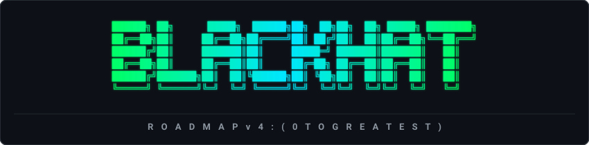

<div align="center">

<p align="center">
  
</p>

### From Nothing to Operator. No Ceilings, No Apologies.

The definitive, zero-to-elite offensive security engineering curriculum, low-level systems syllabus, and operational security compendium built from the metal up.

<p align="center">
  <a href="https://github.com/SagarBiswas-MultiHAT"></a>
  <a href="#"></a>
  <a href="#"></a>
  <a href="#"></a>
  <a href="CONTRIBUTING.md"></a>
  <a href="LICENSE"></a>
</p>

<p align="center">
  
  
  
</p>

<p align="center">
  <a href="#quick-navigation">Curriculum Index</a> •
  <a href="#why-this-repository-exists">The Philosophy</a> •
  <a href="#master-volumes">Master Volumes</a> •
  <a href="#visual-learning-path--progression-map">Learning Path</a> •
  <a href="TRACKER.md">Journey Tracker</a> •
  <a href="labs/">Hands-on Labs</a> •
  <a href="#legal-disclaimer">Legal Notice</a>
</p>

---

</div>


<a id="curricular-progression-map"></a>
## Visual Learning Path & Progression Map


---

## Executive Summary

The cybersecurity industry is saturated with surface-level certification guides, multiple-choice cheat sheets, and automated tool tutorials that fail the moment modern defensive telemetry is encountered.

**The BlackHAT Roadmap v4** is engineered on a different principle: **understanding systems completely from the metal up.**

This repository contains over 9,300 lines of battle-tested technical documentation, weaponized code architectures, evasion mechanics, and operational security doctrines. It bridges the gap between running automated point-and-click tools and operating as a tier-one security researcher, red team engineer, or exploit developer.

```
+-----------------------------------------------------------------------------+
| REPOSITORY AT A GLANCE                                                      |
+-----------------------------------------------------------------------------+
| Total Content Volume : 9,300+ lines of raw technical tradecraft             |
| Progression Depth    : 6 Core Phases (Phase -1 through Phase 5)             |
| Specialized Modules  : 35+ In-Depth Modules and Modern 2026 Tracks          |
| Practical Languages  : C, C++, Rust, x86/x64 Assembly, eBPF, Python, PS    |
| Defense Evasion      : Sleep Obfuscation, Indirect Syscalls, Stack Spoof    |
| Identity Tradecraft  : ADCS ESC1-8, Coercion, Kerberos, Entra ID PRT       |
| Modern Attack Vector : Offensive AI, Cloud Pivoting, Hypervisors, eBPF     |
+-----------------------------------------------------------------------------+
```

---

## Why This Repository Exists

Most resources teach how software is *supposed* to work. Real offensive security requires understanding how software *actually* works when subjected to edge cases, flawed assumptions, and memory corruption.

### The Contrast

| Category | Standard InfoSec Curriculums | The BlackHAT Roadmap v4 |
| :--- | :--- | :--- |
| **Core Objective** | Passing multiple-choice exams (CEH, PenTest+) | Engineering original capabilities from scratch |
| **Tooling Approach** | Running public scanners (Nmap, Metasploit, Nikto) | Writing custom implants, loaders, and C2 agents |
| **Defense Evasion** | Basic payload encoding and obfuscation | Ekko/Foliage sleep obfuscation, indirect syscalls, stack spoofing |
| **Active Directory** | Basic password spraying and simple bloodhound | ADCS ESC1-8, Auth Coercion, Shadow Credentials, Entra ID PRT theft |
| **Binary Exploitation** | Classical stack overflows in outdated Linux VMs | Modern Windows heap exploitation, ROP chains, V8 browser exploitation |
| **Persistence & Kernel**| Scheduled tasks and standard registry run keys | eBPF rootkits, COM hijacking, HVCI bypasses, hypervisor ring -1 |
| **Operational Security**| "Turn on a commercial VPN service" | Hardware stripping, Tails/Whonix chains, Monero loops, RAM sanitization |

---

## Master Volumes

This repository is organized into distinct operational modules and practical engineering labs:

```
the-blackhat-roadmap/
|-- The BlackHAT Roadmap v4 (0 to GREATEST).md   # [Volume I] Complete 8,500+ line curriculum
|-- BlackHat Long-Term Survival Tactics.md       # [Volume II] 760+ line OPSEC & survival guide
|-- TRACKER.md                                   # Interactive milestone progress tracker
|-- labs/                                        # Compilable C & Rust offensive engineering labs
|   |-- 01_dynamic_api_resolver/                 # Windows PEB traversal & export hashing in C
|   `-- 02_offensive_rust_loader/                # Memory state transition & loader in Rust
`-- README.md                                    # Master syllabus and navigation hub
```

### Volume I: [The BlackHAT Roadmap v4 (0 to GREATEST)](The%20BlackHAT%20Roadmap%20v4%20%280%20to%20GREATEST%29.md)
An end-to-end technical syllabus guiding engineers from fundamental systems architecture to the top 0.001% tier of offensive operators. Contains hands-on implementations in C, C++, Rust, Assembly, and Python across Windows, Linux, macOS, Cloud, and Active Directory environments.

### Volume II: [BlackHat Long-Term Survival Tactics](BlackHat%20Long-Term%20Survival%20Tactics.md)
The operational security doctrine. Covers persona isolation, hardware sterilization (BIOS, MAC, serial cleaning), network layering (multi-hop Tor/VPN/proxy chains), non-KYC financial anonymity, encrypted counter-surveillance, and anti-forensics.

### Progress Tracking: [Interactive Journey Tracker](TRACKER.md)
Fork the repository and track your personal progress through Phase -1 to Phase 5, logging lab milestones and capstone projects directly on GitHub.

---

## Quick Navigation

Click any section below to navigate directly into the roadmap documentation:

### Core Progression
- [Phase -1: OPSEC and Infrastructure](The%20BlackHAT%20Roadmap%20v4%20%280%20to%20GREATEST%29.md#phase--1-opsec--infrastructure)
- [Phase 0: Low-Level Foundations (3-6 Months)](The%20BlackHAT%20Roadmap%20v4%20%280%20to%20GREATEST%29.md#phase-0-foundation-36-months)
- [Phase 1: Web Application Security (2-3 Months)](The%20BlackHAT%20Roadmap%20v4%20%280%20to%20GREATEST%29.md#phase-1-web-application-security-23-months)
- [Phase 2: Network and Infrastructure (4-6 Months)](The%20BlackHAT%20Roadmap%20v4%20%280%20to%20GREATEST%29.md#phase-2-network--infrastructure-46-months)
- [Phase 3: System and Kernel Exploitation (6-12 Months)](The%20BlackHAT%20Roadmap%20v4%20%280%20to%20GREATEST%29.md#phase-3-system--kernel-exploitation-612-months)
- [Phase 4: Advanced Operator Tradecraft (12+ Months)](The%20BlackHAT%20Roadmap%20v4%20%280%20to%20GREATEST%29.md#phase-4-advanced-tradecraft-12-months)
- [Phase 5: GREATEST - The 0.001%](The%20BlackHAT%20Roadmap%20v4%20%280%20to%20GREATEST%29.md#phase-5-greatest---the-0001)

### Specialized Phase 4 Engineering Tracks
- [4A: Implant and Malware Development](The%20BlackHAT%20Roadmap%20v4%20%280%20to%20GREATEST%29.md#4a-implant--malware-development)
- [4B: C2 Framework Development and Protocol Design](The%20BlackHAT%20Roadmap%20v4%20%280%20to%20GREATEST%29.md#4b-c2-framework-development)
- [4C: Modern EDR Evasion and Defense Bypass](The%20BlackHAT%20Roadmap%20v4%20%280%20to%20GREATEST%29.md#4c-edr-evasion--defense-bypass)
- [4D: Vulnerability Research and 0-Day Development](The%20BlackHAT%20Roadmap%20v4%20%280%20to%20GREATEST%29.md#4d-vulnerability-research--0-day-development)
- [4E: APT Persistence, Rootkits and Anti-Forensics](The%20BlackHAT%20Roadmap%20v4%20%280%20to%20GREATEST%29.md#4e-apt-persistence-rootkits--anti-forensics)
- [4F: Advanced Web, Modern API and Multi-Cloud](The%20BlackHAT%20Roadmap%20v4%20%280%20to%20GREATEST%29.md#4f-advanced-web-api--cloud)
- [4G: Hardware, Firmware, CAN Bus and Silicon](The%20BlackHAT%20Roadmap%20v4%20%280%20to%20GREATEST%29.md#4g-hardware-firmware--silicon)
- [4H: Supply Chain and CI/CD Pipeline Attacks](The%20BlackHAT%20Roadmap%20v4%20%280%20to%20GREATEST%29.md#4h-supply-chain--ecosystem-attacks)

### 2025-2027 Bleeding-Edge Modules
- [Advanced Implant Evasion Standards (Ekko, Foliage, Cronos)](The%20BlackHAT%20Roadmap%20v4%20%280%20to%20GREATEST%29.md#advanced-implant-evasion-20252026-standard)
- [HVCI, VBS and Kernel Security 2026](The%20BlackHAT%20Roadmap%20v4%20%280%20to%20GREATEST%29.md#hvci-vbs--kernel-security-20252026)
- [macOS Red Team Attack Surface (TCC, ESF, dylib Hijacking)](The%20BlackHAT%20Roadmap%20v4%20%280%20to%20GREATEST%29.md#macos-attack-surface)
- [Active Directory Attacks (ADCS ESC1-8, Coercion, Kerberos)](The%20BlackHAT%20Roadmap%20v4%20%280%20to%20GREATEST%29.md#active-directory-attacks)
- [Azure AD and Entra ID Attacks (PRT Theft, CA Bypass)](The%20BlackHAT%20Roadmap%20v4%20%280%20to%20GREATEST%29.md#azure-ad--entra-id-attacks-2025)
- [Offensive Rust Engineering (Custom Loaders, Syscalls)](The%20BlackHAT%20Roadmap%20v4%20%280%20to%20GREATEST%29.md#offensive-rust-20252026)
- [AI / ML Attack Surface (Prompt Injection, RAG Poisoning)](The%20BlackHAT%20Roadmap%20v4%20%280%20to%20GREATEST%29.md#ai--ml-attack-surface)
- [Offensive AI Workflows (AI-Assisted Weaponization)](The%20BlackHAT%20Roadmap%20v4%20%280%20to%20GREATEST%29.md#offensive-ai-workflows---ai-as-a-weapon)
- [Linux eBPF Rootkits](The%20BlackHAT%20Roadmap%20v4%20%280%20to%20GREATEST%29.md#linux-ebpf-rootkits)
- [Browser Exploitation and 1-Day Patch Diffing](The%20BlackHAT%20Roadmap%20v4%20%280%20to%20GREATEST%29.md#phase-4d-expanded---browser--advanced-vuln-research)
- [Network Pivoting and Named Pipe C2](The%20BlackHAT%20Roadmap%20v4%20%280%20to%20GREATEST%29.md#network-pivoting--tunneling)
- [Red Team Operations: Scoping, ROE, Reporting and Cleanup](The%20BlackHAT%20Roadmap%20v4%20%280%20to%20GREATEST%29.md#red-team-ops-scoping-roe--reporting)

---

## 2025-2027 Operator Modules

The curriculum integrates the newest offensive paradigms required to defeat modern security stacks:

### 1. Modern EDR Evasion & Sleep Obfuscation
Defeating memory scanners (Moneta, Hunt-Sleeping-Beacons, Pe-sieve) through asynchronous timer-based memory protection flips.
- **Ekko, Foliage, and Cronos implementations:** ROP chain encryption via `NtContinue`, `CreateTimerQueueTimer`, and stack frame wiping.
- **Call Stack Spoofing:** Synthetic stack frame generation (SilentMoonwalk, Unwinder) to pass return address validation.
- **Indirect Syscalls:** Resolving SSNs dynamically and executing syscall instructions from within legitimate `ntdll.dll` memory space to bypass user-mode hooks.

### 2. Enterprise Active Directory & Hybrid Identity
- **ADCS Exploitation:** Abuse of Enterprise Certificate Authority misconfigurations across ESC1 through ESC8.
- **Authentication Coercion:** Forcing NTLM authentication via PetitPotam (MS-EFSR), DFSCoerce (MS-DFSNM), and Shadow Credentials.
- **Entra ID (Azure AD):** Primary Refresh Token (PRT) extraction, Conditional Access bypasses, Device Code phishing, and Azure Arc lateral movement.

### 3. Offensive Rust Engineering
Replacing legacy C/C++ loaders with high-performance, statically compiled Rust:
- Dynamic API resolution via hashed PE exports.
- Direct invocation of Windows Native APIs using safe wrappers.
- In-memory shellcode execution without RWX allocation artifacts.

### 4. AI / ML Exploitation & Automated Weaponization
- Exploitation of LLM-integrated enterprise applications: Indirect prompt injections, Retrieval-Augmented Generation (RAG) poisoning, and agent jailbreaking.
- Local offensive LLM pipelines: Fine-tuned local models for automated vulnerability triaging, decompilation analysis, and exploit script generation.

---

## Recommended Learning Tracks

Depending on your professional background and operational goals, select an optimized pathway through the curriculum:

```
[ Track A: Low-Level Exploit Researcher ]
Phase 0 (Assembly & C) ---> Phase 3 (Binary & Kernel) ---> Phase 4D (0-Day / Fuzzing / Browser)

[ Track B: Enterprise Red Team Operator ]
Phase 1 (Web / API) ---> Phase 2 (Active Directory) ---> Modern ADCS & Entra ID ---> Red Team Ops

[ Track C: Stealth Implant & Malware Developer ]
Phase 0 (OS Internals) ---> Phase 4A (Implant Dev) ---> Phase 4C (EDR Evasion) ---> Offensive Rust

[ Track D: Hardware & Infrastructure Infiltrator ]
Phase 0 (Architecture) ---> Phase 2 (Pivoting) ---> Phase 4G (Hardware/CAN/SDR) ---> Survival OPSEC
```

---

## Lab Architecture & Prerequisites

To execute the practical exercises in this curriculum, the recommended self-hosted lab setup includes:

1. **Virtualization Hypervisor:** Proxmox VE, VMware ESXi, or VMware Workstation Pro.
2. **Active Directory Range:** Dual Windows Server Domain Controllers (2019/2022) with Active Directory Certificate Services (ADCS) installed, and 2-3 joined Windows 10/11 enterprise workstations.
3. **Malware Analysis Sandbox:** Isolated FlareVM (Windows) and REMnux (Linux) nodes configured with non-routed virtual host-only adapters.
4. **Tooling Environment:** Dedicated Kali Linux or Debian instance equipped with Docker, Rust toolchain, MinGW-w64, Clang/LLVM, and Ghidra.
5. **Hardware Security Kit (Optional for Phase 4G):** RTL-SDR blog V4, HackRF One, Raspberry Pi Pico / Bus Pirate, and an MCP2515 CAN bus transceiver module.

---

## Star History

If this curriculum provides value to your research or career, consider starring the repository to help other researchers find it:

<div align="center">

[](https://star-history.com/#SagarBiswas-MultiHAT/the-blackhat-roadmap&Date)

</div>

---

## Contributing

Contributions that raise the technical bar are welcome:

- **Quality Threshold:** PRs adding generic tool lists or introductory material will not be merged. Read our [Contributing Guidelines](CONTRIBUTING.md).
- **Code Standards:** Code samples must be functional, accompanied by technical rationale, and compiled against modern toolchains. Check out the [Hands-on Labs](labs/) directory.
- **Formatting Rule:** Adhere strictly to clean markdown standards. Do not include em-dashes anywhere in text or documentation.

---

## Legal Disclaimer

> [!CAUTION]
> **Strictly For Authorized Educational, Research, and Defensive Purposes Only.**
> 
> The materials, methodologies, code snippets, and operational guidance provided in this repository are designed solely for authorized cybersecurity professionals, penetration testers, red team engineers, and academic researchers operating under explicit, formal written authorization.
> 
> Unauthorized testing, access, or exploitation against networks, servers, or endpoints without explicit permission is illegal under local, national, and international laws (including the US Computer Fraud and Abuse Act, UK Computer Misuse Act, and equivalent statutes).
> 
> The author assumes no liability and is not responsible for any misuse, damage, or legal consequences resulting from the application of the information contained herein. Learn responsibly. Refer to [SECURITY.md](SECURITY.md) for scope and reporting.

---

## Author & Contact

**Sagar Biswas**  
GitHub: [@SagarBiswas-MultiHAT](https://github.com/SagarBiswas-MultiHAT)  

*Built for those who demand mastery from the silicon up.*
