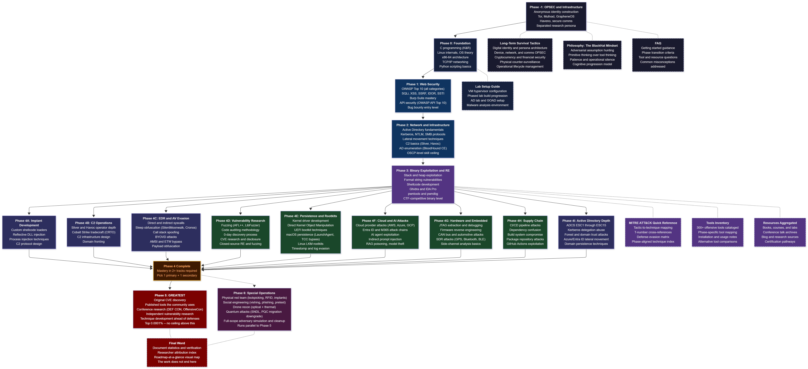

<div align="center">

<p align="center">
  
</p>

### From Nothing to Operator. No Ceilings, No Apologies.

The definitive, zero-to-elite offensive security engineering curriculum, low-level systems syllabus, and operational security compendium built from the metal up.

<p align="center">
  <a href="https://github.com/SagarBiswas-MultiHAT"></a>
  <a href="#"></a>
  <a href="#"></a>
  <a href="#"></a>
  <a href="#"></a>
  <a href="#"></a>
  <a href="payloads/"></a>
  <a href=".github/CONTRIBUTING.md"></a>
  <a href="LICENSE"></a>
</p>

<p align="center">
  
  
  
</p>

<p align="center">
  <a href="#master-curriculum--navigation-hub">Curriculum Index</a> •
  <a href="#visual-learning-path--progression-map">Visual Learning Path</a> •
  <a href="#compilable-offensive-engineering-payloads">Weaponized Payloads</a> •
  <a href="#2025-2027-operator-modules">Bleeding-Edge Modules</a> •
  <a href="#recommended-learning-tracks">Learning Pathways</a> •
  <a href=".github/TRACKER.md">Journey Tracker</a> •
  <a href="#citation--academic-attribution">Citation</a> •
  <a href="#legal-disclaimer">Legal Notice</a>
</p>

---

**READING GUIDE**

</div>

- It is recommended to use a mobile device because there are over 150 high-quality diagrams, which you can easily zoom in and out of on mobile.
- Avoid using the GitHub app on mobile; instead, access GitHub through your browser in desktop view.
- All diagrams have been tested in light mode, so using dark mode is not advised.
- Are you facing any problems? Is there anything difficult to understand? Do you have any suggestions? Please direct message me in the discussion section of this GitHub repository. Contributions are always welcome.

---

<a id="curricular-progression-map"></a>
## Visual Learning Path & Progression Map

<div align="center">
<table><tr><td>



</td></tr></table>
</div>

---

---

<a id="table-of-contents"></a>
## Table of Contents

<div align="center">

| Core Progression Phases | Specialized Tracks & Capstone | Master Field Guides |
| :--- | :--- | :--- |
| • [Phase -1: OPSEC & Infra](#phase--1) | • [Phase 4: Specialized Tracks](#phase-4) | • [Survival Tactics](#blackhat-long-term-survival-tactics) |
| • [Phase 0: Foundations](#phase-0) | • [Phase 5: GREATEST](#phase-5) | • [The BlackHat Mindset](#philosophy-the-blackhat-mindset) |
| • [Phase 1: Web & API](#phase-1) | • [Phase 6: Special Operations](#phase-6-parallel-learning-alongside-phase-5) | • [Comprehensive FAQ](#faq) |
| • [Phase 2: Network & AD](#phase-2) | • [Final Word (Capstone)](#final-word) | • [Lab Setup Guide](#lab-setup-guide) |
| • [Phase 3: System & Kernel](#phase-3) | | • [MITRE ATT&CK Matrix](#mitre-attck-quick-reference) |
| | | • [Tools Inventory (300+)](#tools-inventory) |
| | | • [Resources Aggregated](#resources_aggregated) |

</div>

---

<a id="phase--1"></a>
#### [Phase -1: Hardened OPSEC & Anonymous Infrastructure](phases/PHASE_-1.md)

<details>
<summary><strong>Explore Phase -1 Syllabus (24 Modules)</strong></summary>

1. [Why This Comes Before Everything Else](phases/PHASE_-1.md#1-why-this-comes-before-everything-else)
2. [Real Operators. Real Failures. Real Lessons.](phases/PHASE_-1.md#2-real-operators-real-failures-real-lessons)
3. [The Legal Framework: Read This First](phases/PHASE_-1.md#3-the-legal-framework-read-this-first)
4. [Counter-OSINT: Know Your Exposure Before You Start](phases/PHASE_-1.md#4-counter-osint-know-your-exposure-before-you-start)
5. [Threat Modeling: Think Before You Act](phases/PHASE_-1.md#5-threat-modeling-think-before-you-act)
6. [Communication Security: The Number One Arrest Vector](phases/PHASE_-1.md#6-communication-security-the-number-one-arrest-vector)
7. [Phone and Mobile OPSEC](phases/PHASE_-1.md#7-phone-and-mobile-opsec)
8. [Anonymous Infrastructure Setup](phases/PHASE_-1.md#8-anonymous-infrastructure-setup)
9. [Anonymization Stack: VPN, Tor, and Chaining](phases/PHASE_-1.md#9-anonymization-stack-vpn-tor-and-chaining)
10. [Browser Fingerprinting: You Are Being Identified](phases/PHASE_-1.md#10-browser-fingerprinting-you-are-being-identified)
11. [Cryptocurrency: Why Monero and How It Actually Works](phases/PHASE_-1.md#11-cryptocurrency-why-monero-and-how-it-actually-works)
12. [Identity Compartmentalization and Stylometry](phases/PHASE_-1.md#12-identity-compartmentalization-and-stylometry)
13. [Secure Research OS](phases/PHASE_-1.md#13-secure-research-os)
14. [Physical OPSEC: The Layer Most Guides Ignore](phases/PHASE_-1.md#14-physical-opsec-the-layer-most-guides-ignore)
15. [Timing and Pattern OPSEC: The Invisible Fingerprint](phases/PHASE_-1.md#15-timing-and-pattern-opsec-the-invisible-fingerprint)
16. [Metadata: The Silent Killer](phases/PHASE_-1.md#16-metadata-the-silent-killer)
17. [Secure Deletion: Leaving Nothing Behind](phases/PHASE_-1.md#17-secure-deletion-leaving-nothing-behind)
18. [What Logs Exist on Every System You Touch](phases/PHASE_-1.md#18-what-logs-exist-on-every-system-you-touch)
19. [Forensic Artifacts on Your Own Machine](phases/PHASE_-1.md#19-forensic-artifacts-on-your-own-machine) *(New in v5.5)*
20. [Cold Boot and Evil Maid: Concrete Mitigations](phases/PHASE_-1.md#20-cold-boot-and-evil-maid-concrete-mitigations) *(Expanded in v5.5)*
21. [When Things Go Wrong: The Burn Protocol](phases/PHASE_-1.md#21-when-things-go-wrong-the-burn-protocol) *(New in v5.5)*
22. [Crew OPSEC and Cell Structure](phases/PHASE_-1.md#22-crew-opsec-and-cell-structure) *(New in v5.5)*
23. [Phase -1 Milestones Checklist](phases/PHASE_-1.md#23-phase--1-milestones-checklist)
24. [Resources](phases/PHASE_-1.md#24-resources)

</details>

<div align="right"><a href="#table-of-contents">↑ Return to TOC</a></div>

---

<a id="phase-0"></a>
#### [Phase 0: Low-Level Foundations & Systems Internals](phases/PHASE_0.md)

<details>
<summary><strong>Explore Phase 0 Syllabus (23 Modules)</strong></summary>

1. [Goal and Philosophy](phases/PHASE_0.md#1-goal-and-philosophy)
2. [How to Use This Phase](phases/PHASE_0.md#2-how-to-use-this-phase)
3. [Prerequisites](phases/PHASE_0.md#3-prerequisites)
4. [Checkpoint: What You Must Know by the End](phases/PHASE_0.md#4-checkpoint-what-you-must-know-by-the-end)
5. [Timeline and Parallel Track Architecture](phases/PHASE_0.md#5-timeline-and-parallel-track-architecture)
6. [Section 1: Operating Systems Fundamentals](phases/PHASE_0.md#6-section-1-operating-systems-fundamentals)
7. [Section 1B: Bash Scripting Essentials](phases/PHASE_0.md#7-section-1b-bash-scripting-essentials)
8. [Section 2: C Programming](phases/PHASE_0.md#8-section-2-c-programming)
9. [Section 3: Python Scripting](phases/PHASE_0.md#9-section-3-python-scripting)
10. [Section 4: Networking Fundamentals](phases/PHASE_0.md#10-section-4-networking-fundamentals)
11. [Section 5: x86-64 Assembly](phases/PHASE_0.md#11-section-5-x86-64-assembly)
12. [Section 6: Reverse Engineering Basics](phases/PHASE_0.md#12-section-6-reverse-engineering-basics)
13. [Section 7: Cryptography Primer](phases/PHASE_0.md#13-section-7-cryptography-primer)
14. [Section 8: ARM64 Architecture Awareness](phases/PHASE_0.md#14-section-8-arm64-architecture-awareness)
15. [Section 9: glibc Internals Primer](phases/PHASE_0.md#15-section-9-glibc-internals-primer)
16. [Milestone Projects: Full Spec Cards](phases/PHASE_0.md#16-milestone-projects-full-spec-cards)
17. [Lab Setup](phases/PHASE_0.md#17-lab-setup)
18. [GDB Setup and Command Reference](phases/PHASE_0.md#18-gdb-setup-and-command-reference)
19. [CTF Platform Guide](phases/PHASE_0.md#19-ctf-platform-guide)
20. [Common Failure Points and Fixes](phases/PHASE_0.md#20-common-failure-points-and-fixes)
21. [Phase 0 Master Checklist](phases/PHASE_0.md#21-phase-0-master-checklist)
22. [What Comes Next](phases/PHASE_0.md#22-what-comes-next)
23. [Resources Aggregated](phases/PHASE_0.md#23-resources-aggregated)

</details>

<div align="right"><a href="#table-of-contents">↑ Return to TOC</a></div>

---

<details>
<summary><strong>Parallel Learning Alongside Phase 0: Operational OPSEC, Mindset & FAQ (3 Master Guides)</strong></summary>

<a id="blackhat-long-term-survival-tactics"></a>
#### [BlackHat Long-Term Survival Tactics](black-bag/BlackHat_Long-Term_Survival_Tactics.md)

1. [For the Beginner: Start Here](black-bag/BlackHat_Long-Term_Survival_Tactics.md#for-the-beginner-start-here)
2. [Threat Modeling Framework](black-bag/BlackHat_Long-Term_Survival_Tactics.md#threat-modeling-framework)
3. [Section 1: Digital Identity and Persona Architecture](black-bag/BlackHat_Long-Term_Survival_Tactics.md#section-1-digital-identity-and-persona-architecture)
4. [Section 2: Device Security - OS and Hardware](black-bag/BlackHat_Long-Term_Survival_Tactics.md#section-2-device-security---os-and-hardware)
5. [Section 3: Network-Level OPSEC](black-bag/BlackHat_Long-Term_Survival_Tactics.md#section-3-network-level-opsec)
6. [Section 4: Communications Security](black-bag/BlackHat_Long-Term_Survival_Tactics.md#section-4-communications-security)
7. [Section 5: Cryptocurrency and Financial Security](black-bag/BlackHat_Long-Term_Survival_Tactics.md#section-5-cryptocurrency-and-financial-security)
8. [Section 6: Physical Location Security](black-bag/BlackHat_Long-Term_Survival_Tactics.md#section-6-physical-location-security)
9. [Section 7: Physical Appearance and Counter-Surveillance](black-bag/BlackHat_Long-Term_Survival_Tactics.md#section-7-physical-appearance-and-counter-surveillance)
10. [Section 8: Social Engineering Defense (Self-Protection)](black-bag/BlackHat_Long-Term_Survival_Tactics.md#section-8-social-engineering-defense-self-protection)
11. [Section 9: AI-Powered Surveillance Evasion (2027)](black-bag/BlackHat_Long-Term_Survival_Tactics.md#section-9-ai-powered-surveillance-evasion-2027)
12. [Section 10: Blockchain Forensics Threat Model (2027)](black-bag/BlackHat_Long-Term_Survival_Tactics.md#section-10-blockchain-forensics-threat-model-2027)
13. [Section 11: Darknet Operational Security](black-bag/BlackHat_Long-Term_Survival_Tactics.md#section-11-darknet-operational-security)
14. [Section 12: Legal Counter-Intelligence](black-bag/BlackHat_Long-Term_Survival_Tactics.md#section-12-legal-counter-intelligence)
15. [Section 13: Long-Term Survival Planning](black-bag/BlackHat_Long-Term_Survival_Tactics.md#section-13-long-term-survival-planning)
16. [Section 14: Emergency Exfil Protocol](black-bag/BlackHat_Long-Term_Survival_Tactics.md#section-14-emergency-exfil-protocol)
17. [Section 15: Counter-LE Awareness](black-bag/BlackHat_Long-Term_Survival_Tactics.md#section-15-counter-le-awareness)
18. [Section 16: International Jurisdictions 2027](black-bag/BlackHat_Long-Term_Survival_Tactics.md#section-16-international-jurisdictions-2027)
19. [Section 17: OPSEC Golden Rules](black-bag/BlackHat_Long-Term_Survival_Tactics.md#section-17-opsec-golden-rules)
20. [Section 18: Case Studies](black-bag/BlackHat_Long-Term_Survival_Tactics.md#section-18-case-studies)
21. [Section 19: Advanced Hardware Attack Resistance](black-bag/BlackHat_Long-Term_Survival_Tactics.md#section-19-advanced-hardware-attack-resistance)
22. [Section 20: In-Memory Forensics and Cold Boot Defense](black-bag/BlackHat_Long-Term_Survival_Tactics.md#section-20-in-memory-forensics-and-cold-boot-defense)
23. [Section 21: Server-Side Detection and eBPF Awareness](black-bag/BlackHat_Long-Term_Survival_Tactics.md#section-21-server-side-detection-and-ebpf-awareness)
24. [Quick Reference Operational Checklist](black-bag/BlackHat_Long-Term_Survival_Tactics.md#quick-reference-operational-checklist)

<div align="right"><a href="#table-of-contents">↑ Return to TOC</a></div>

---

<a id="philosophy-the-blackhat-mindset"></a>
#### [Philosophy: The BlackHat Mindset](field-guides/Philosophy_The_BlackHat_Mindset.md)

1. [What This Is Not](field-guides/Philosophy_The_BlackHat_Mindset.md#1-what-this-is-not)
2. [What a BlackHat Actually Is](field-guides/Philosophy_The_BlackHat_Mindset.md#2-what-a-blackhat-actually-is)
3. [The Cognitive Progression](field-guides/Philosophy_The_BlackHat_Mindset.md#3-the-cognitive-progression)
4. [The Separation That Matters: Student, Operator, Researcher](field-guides/Philosophy_The_BlackHat_Mindset.md#4-the-separation-that-matters)
5. [GREATEST vs Good - The 2027 Edition](field-guides/Philosophy_The_BlackHat_Mindset.md#5-greatest-vs-good-the-2027-edition)
6. [The Seven Pillars of the BlackHat Mindset](field-guides/Philosophy_The_BlackHat_Mindset.md#6-the-seven-pillars-of-the-blackhat-mindset)
   - [Pillar I: Adversarial Assumption Hunting](field-guides/Philosophy_The_BlackHat_Mindset.md#pillar-i-adversarial-assumption-hunting)
   - [Pillar II: Understand the Defender Before You Attack](field-guides/Philosophy_The_BlackHat_Mindset.md#pillar-ii-understand-the-defender-before-you-attack)
   - [Pillar III: Primitive Thinking Over Tool Thinking](field-guides/Philosophy_The_BlackHat_Mindset.md#pillar-iii-primitive-thinking-over-tool-thinking)
   - [Pillar IV: Patience and Operational Silence](field-guides/Philosophy_The_BlackHat_Mindset.md#pillar-iv-patience-and-operational-silence)
   - [Pillar V: Fail Silently](field-guides/Philosophy_The_BlackHat_Mindset.md#pillar-v-fail-silently)
   - [Pillar VI: Ego Is an OpSec Failure](field-guides/Philosophy_The_BlackHat_Mindset.md#pillar-vi-ego-is-an-opsec-failure)
   - [Pillar VII: The Research Posture](field-guides/Philosophy_The_BlackHat_Mindset.md#pillar-vii-the-research-posture)
7. [The 2027 Landscape Reality](field-guides/Philosophy_The_BlackHat_Mindset.md#7-the-2027-landscape-reality)
8. [The Psychological Framework](field-guides/Philosophy_The_BlackHat_Mindset.md#8-the-psychological-framework)
9. [Reality Check - Updated 2027](field-guides/Philosophy_The_BlackHat_Mindset.md#9-reality-check-updated-2027)
10. [The Closing Truth](field-guides/Philosophy_The_BlackHat_Mindset.md#10-the-closing-truth)

<div align="right"><a href="#table-of-contents">↑ Return to TOC</a></div>

---

<a id="faq"></a>
#### [Comprehensive FAQ](field-guides/FAQ.md)

1. [Getting Started](field-guides/FAQ.md#part-1-getting-started)
2. [Hardware, OS, and Environment](field-guides/FAQ.md#part-2-hardware-os-and-environment)
3. [Learning Path and Methodology](field-guides/FAQ.md#part-3-learning-path-and-methodology)
4. [Certifications and Courses](field-guides/FAQ.md#part-4-certifications-and-courses)
5. [Technical Questions](field-guides/FAQ.md#part-5-technical-questions)
6. [AI, Tools, and the 2027 Landscape](field-guides/FAQ.md#part-6-ai-tools-and-the-2027-landscape)
7. [Bug Bounty and Real-World Practice](field-guides/FAQ.md#part-7-bug-bounty-and-real-world-practice)
8. [Mindset, Burn-Out, and Staying Operational](field-guides/FAQ.md#part-8-mindset-burn-out-and-staying-operational)
9. [Authorization, OPSEC, and Legal Reality](field-guides/FAQ.md#part-9-authorization-opsec-and-legal-reality)
10. [Questions Nobody Asks But Should](field-guides/FAQ.md#part-10-questions-nobody-asks-but-should)
11. [2027 Special Operations and Horizons FAQ](field-guides/FAQ.md#part-11-2027-special-operations-and-horizons-faq)

<div align="right"><a href="#table-of-contents">↑ Return to TOC</a></div>

</details>

---

<a id="phase-1"></a>
#### [Phase 1: Modern Web & API Attack Surface](phases/PHASE_1.md)

<details>
<summary><strong>Explore Phase 1 Syllabus (39 Modules)</strong></summary>

1. [How To Use This Phase](phases/PHASE_1.md#how-to-use-this-phase)
2. [Difficulty Map](phases/PHASE_1.md#difficulty-map)
3. [The Developer Mindset](phases/PHASE_1.md#the-developer-mindset)
4. [Week-by-Week Spine](phases/PHASE_1.md#week-by-week-spine)
5. [When You Are Stuck](phases/PHASE_1.md#when-you-are-stuck)
6. [Section 0: Lab Environment Setup](phases/PHASE_1.md#section-0-lab-environment-setup)
7. [Section 1: HTTP Fundamentals](phases/PHASE_1.md#section-1-http-fundamentals)
8. [Section 2: Reconnaissance and Target Mapping](phases/PHASE_1.md#section-2-reconnaissance-and-target-mapping)
9. [Section 3: SQL Injection](phases/PHASE_1.md#section-3-sql-injection)
10. [Section 3.5: Command Injection](phases/PHASE_1.md#section-35-command-injection)
11. [Section 4: Cross-Site Scripting (XSS)](phases/PHASE_1.md#section-4-cross-site-scripting-xss)
12. [Section 5: CSRF and CORS Misconfiguration](phases/PHASE_1.md#section-5-csrf-and-cors-misconfiguration)
13. [Section 6: Server-Side Request Forgery (SSRF)](phases/PHASE_1.md#section-6-server-side-request-forgery-ssrf)
14. [Section 7: XML External Entity Injection (XXE)](phases/PHASE_1.md#section-7-xml-external-entity-injection-xxe)
15. [Section 8: Authentication Attacks](phases/PHASE_1.md#section-8-authentication-attacks)
16. [Section 8.5: NoSQL Injection](phases/PHASE_1.md#section-85-nosql-injection)
17. [Section 9: Access Control and IDOR](phases/PHASE_1.md#section-9-access-control-and-idor)
18. [Section 10: Business Logic Flaws](phases/PHASE_1.md#section-10-business-logic-flaws)
19. [Section 11: Path Traversal / LFI / RFI](phases/PHASE_1.md#section-11-path-traversal--lfi--rfi)
20. [Section 12: File Upload Vulnerabilities](phases/PHASE_1.md#section-12-file-upload-vulnerabilities)
21. [Section 13: Server-Side Template Injection (SSTI)](phases/PHASE_1.md#section-13-server-side-template-injection-ssti)
22. [Section 14: HTTP Request Smuggling and H2C Attacks](phases/PHASE_1.md#section-14-http-request-smuggling-and-h2c-attacks)
23. [Section 15: Race Conditions](phases/PHASE_1.md#section-15-race-conditions)
24. [Section 16: WebSocket Attacks](phases/PHASE_1.md#section-16-websocket-attacks)
25. [Section 17: GraphQL Attacks](phases/PHASE_1.md#section-17-graphql-attacks)
26. [Section 18: API Security (OWASP API Top 10: 2023)](phases/PHASE_1.md#section-18-api-security-owasp-api-top-10-2023)
27. [Section 19: Prototype Pollution](phases/PHASE_1.md#section-19-prototype-pollution)
28. [Section 20: Web Cache Poisoning and Deception](phases/PHASE_1.md#section-20-web-cache-poisoning-and-deception)
29. [Section 21: OAuth2 and OIDC Attacks](phases/PHASE_1.md#section-21-oauth2-and-oidc-attacks)
30. [Section 22: Deserialization Attacks](phases/PHASE_1.md#section-22-deserialization-attacks)
31. [Section 23: Clickjacking](phases/PHASE_1.md#section-23-clickjacking)
32. [Section 24: Modern SPA and Framework Attacks](phases/PHASE_1.md#section-24-modern-spa-and-framework-attacks)
33. [Section 25: LLM Integration Attack Surface](phases/PHASE_1.md#section-25-llm-integration-attack-surface)
34. [Section 26: Chaining Vulnerabilities](phases/PHASE_1.md#section-26-chaining-vulnerabilities)
35. [Milestone Projects](phases/PHASE_1.md#milestone-projects)
36. [Tools Reference and Decision Tree](phases/PHASE_1.md#tools-reference-and-decision-tree)
37. [Web Testing Methodology Framework](phases/PHASE_1.md#web-testing-methodology-framework)
38. [Phase 1 Final Milestones Checklist](phases/PHASE_1.md#phase-1-final-milestones-checklist)
39. [Resources Aggregated](phases/PHASE_1.md#resources-aggregated)

</details>

<div align="right"><a href="#table-of-contents">↑ Return to TOC</a></div>

---

<details>
<summary><strong>Parallel Learning Alongside Phase 1: Enterprise Attack Labs (1 Master Guide)</strong></summary>

<a id="lab-setup-guide"></a>
#### [Lab Setup Guide](field-guides/Lab_Setup_Guide.md)

1. [Overview and Philosophy](field-guides/Lab_Setup_Guide.md#1-overview-and-philosophy)
2. [Hardware Requirements](field-guides/Lab_Setup_Guide.md#2-hardware-requirements)
3. [Hypervisor Selection](field-guides/Lab_Setup_Guide.md#3-hypervisor-selection)
4. [Lab Network Architecture](field-guides/Lab_Setup_Guide.md#4-lab-network-architecture)
5. [Core VM Library](field-guides/Lab_Setup_Guide.md#5-core-vm-library)
6. [Attacker VM: Kali Linux 2024+](field-guides/Lab_Setup_Guide.md#6-attacker-vm-kali-linux-2024)
7. [Development VM: Ubuntu 22.04 LTS](field-guides/Lab_Setup_Guide.md#7-development-vm-ubuntu-2204-lts)
8. [Windows Target and Implant Dev VM](field-guides/Lab_Setup_Guide.md#8-windows-target-and-implant-dev-vm)
9. [Active Directory Lab: GOAD](field-guides/Lab_Setup_Guide.md#9-active-directory-lab-goad)
10. [Malware Analysis Environment](field-guides/Lab_Setup_Guide.md#10-malware-analysis-environment)
11. [Kernel Debugging Environment](field-guides/Lab_Setup_Guide.md#11-kernel-debugging-environment)
12. [Container Attack Lab](field-guides/Lab_Setup_Guide.md#12-container-attack-lab)
13. [Cloud Lab Alternative](field-guides/Lab_Setup_Guide.md#13-cloud-lab-alternative)
14. [OPSEC Layer: Whonix + Qubes](field-guides/Lab_Setup_Guide.md#14-opsec-layer-whonix--qubes)
15. [Detection Visibility Layer: DetectionLab](field-guides/Lab_Setup_Guide.md#15-detection-visibility-layer-detectionlab)
16. [ICS/SCADA Lab](field-guides/Lab_Setup_Guide.md#16-icsscada-lab)
17. [Hardware Hacking Lab](field-guides/Lab_Setup_Guide.md#17-hardware-hacking-lab)
18. [Vulnerability Research & Fuzzing Lab (Phase 5: GREATEST)](field-guides/Lab_Setup_Guide.md#18-vulnerability-research--fuzzing-lab-phase-5-greatest)
19. [Special Operations Lab: Physical, SE & Quantum (Phase 6)](field-guides/Lab_Setup_Guide.md#19-special-operations-lab-physical-se--quantum-phase-6)
20. [Snapshot Discipline](field-guides/Lab_Setup_Guide.md#20-snapshot-discipline)
21. [Phase-by-Phase Lab Evolution](field-guides/Lab_Setup_Guide.md#21-phase-by-phase-lab-evolution)
22. [Environment Verification Checklist](field-guides/Lab_Setup_Guide.md#22-environment-verification-checklist)
23. [Maintenance Schedule](field-guides/Lab_Setup_Guide.md#23-maintenance-schedule)

<div align="right"><a href="#table-of-contents">↑ Return to TOC</a></div>

</details>

---

<a id="phase-2"></a>
#### [Phase 2: Network Pivoting & Active Directory Mastery](phases/PHASE_2.md)

<details>
<summary><strong>Explore Phase 2 Syllabus (23 Modules)</strong></summary>

1. [What This Phase Builds](phases/PHASE_2.md#1-what-this-phase-builds)
2. [Prerequisites Check](phases/PHASE_2.md#2-prerequisites-check)
3. [Phase 2 Kill Chain](phases/PHASE_2.md#3-phase-2-kill-chain)
4. [Lab Topology](phases/PHASE_2.md#4-lab-topology)
5. [Timeline Overview](phases/PHASE_2.md#5-timeline-overview)
6. [How to Use This Phase](phases/PHASE_2.md#6-how-to-use-this-phase)
7. [Section 1: Reconnaissance and OSINT](phases/PHASE_2.md#section-1-reconnaissance-and-osint)
8. [Section 2: Service Exploitation](phases/PHASE_2.md#section-2-service-exploitation)
9. [Section 3: Privilege Escalation - Linux](phases/PHASE_2.md#section-3-privilege-escalation---linux)
10. [Section 4: Privilege Escalation - Windows](phases/PHASE_2.md#section-4-privilege-escalation---windows)
11. [Section 5: Credential Poisoning and Relay Attacks](phases/PHASE_2.md#section-5-credential-poisoning-and-relay-attacks)
12. [Section 6: Post-Exploitation and Lateral Movement](phases/PHASE_2.md#section-6-post-exploitation-and-lateral-movement)
13. [Section 6.6: Active Directory - Enumeration and Attacks](phases/PHASE_2.md#section-66-active-directory-enumeration-and-attacks)
14. [Section 7: Network Pivoting and Tunneling](phases/PHASE_2.md#section-7-network-pivoting-and-tunneling)
15. [Section 8: Wireless Attacks](phases/PHASE_2.md#section-8-wireless-attacks)
16. [Section 9: Password Attacks Methodology](phases/PHASE_2.md#section-9-password-attacks-methodology)
17. [Section 10: AV/EDR Evasion and Payload Delivery](phases/PHASE_2.md#section-10-avedr-evasion-and-payload-delivery)
18. [Section 11: C2 Framework Operations](phases/PHASE_2.md#section-11-c2-framework-operations)
19. [Section 12: OPSEC Within Phase 2](phases/PHASE_2.md#section-12-opsec-within-phase-2)
20. [Milestone Projects](phases/PHASE_2.md#milestone-projects)
21. [Phase 2 Completion Checklist](phases/PHASE_2.md#phase-2-completion-checklist)
22. [CTF Labs and Practice Targets](phases/PHASE_2.md#ctf-labs-and-practice-targets)
23. [Phase 2 to Phase 3 Bridge](phases/PHASE_2.md#phase-2-to-phase-3-bridge)

</details>

<div align="right"><a href="#table-of-contents">↑ Return to TOC</a></div>

---

<a id="phase-3"></a>
#### [Phase 3: System & Kernel Exploitation](phases/PHASE_3.md)

<details>
<summary><strong>Explore Phase 3 Syllabus (21 Modules)</strong></summary>

1. [Who This Phase Is For](phases/PHASE_3.md#who-this-phase-is-for)
2. [Phase 3 Architecture Map](phases/PHASE_3.md#phase-3-architecture-map)
3. [Timeline](phases/PHASE_3.md#timeline)
4. [Goal and Checkpoints](phases/PHASE_3.md#goal-and-checkpoints)
5. [Milestone Projects](phases/PHASE_3.md#milestone-projects)
6. [Block 0: Environment Setup](phases/PHASE_3.md#block-0-environment-setup)
7. [Block 1: Binary Exploitation Fundamentals](phases/PHASE_3.md#block-1-binary-exploitation-fundamentals)
8. [Block 2: Shellcode Writing](phases/PHASE_3.md#block-2-shellcode-writing)
9. [Block 3: Exploit Mitigations and Bypass](phases/PHASE_3.md#block-3-exploit-mitigations-and-bypass)
10. [Block 4: Format String Vulnerabilities](phases/PHASE_3.md#block-4-format-string-vulnerabilities)
11. [Block 5: Heap Exploitation -- Linux glibc Modern](phases/PHASE_3.md#block-5-heap-exploitation----linux-glibc-modern)
12. [Block 6: Windows Heap Exploitation](phases/PHASE_3.md#block-6-windows-heap-exploitation)
13. [Block 7: Linux Kernel Exploitation](phases/PHASE_3.md#block-7-linux-kernel-exploitation)
14. [Block 8: Linux Kernel SLUB/Slab Exploitation](phases/PHASE_3.md#block-8-linux-kernel-slubslab-exploitation)
15. [Block 9: Windows Kernel Exploitation](phases/PHASE_3.md#block-9-windows-kernel-exploitation)
16. [Block 10: ARM64 Exploitation + PAC Bypass](phases/PHASE_3.md#block-10-arm64-exploitation--pac-bypass)
17. [Block 11: Control Flow Guard Bypass](phases/PHASE_3.md#block-11-control-flow-guard-bypass)
18. [Block 12: Linux eBPF Rootkits + Anti-Detection](phases/PHASE_3.md#block-12-linux-ebpf-rootkits--anti-detection)
19. [Block 13: HVCI, VBS and Kernel Security 2026-2027](phases/PHASE_3.md#block-13-hvci-vbs-and-kernel-security-2026-2027)
20. [Block 14: Mobile Security -- Android and iOS](phases/PHASE_3.md#block-14-mobile-security----android-and-ios)
21. [CTF Progression and Lab Resources](phases/PHASE_3.md#ctf-progression-and-lab-resources)

</details>

<div align="right"><a href="#table-of-contents">↑ Return to TOC</a></div>

---

<a id="phase-4"></a>
#### [Phase 4: Specialized Operator Tracks (4A-4I)](phases/PHASE_4.md)

<details>
<summary><strong>Explore Phase 4 Operator Tracks & Curriculums (16 Sections)</strong></summary>

| Section | Topic | Difficulty | Time Estimate |
|---------|-------|------------|---------------|
| [Phase 4 Intro](phases/PHASE_4.md#phase-4-advanced-tradecraft) | How to read, pairings, bridge checklist, architecture map | - | 2 hrs |
| [4A](phases/PHASE_4.md#4a-implant--malware-development) | Implant and Malware Development | Expert | 8-12 weeks |
| [4B](phases/PHASE_4.md#4b-c2-framework-development) | C2 Framework Development | Expert | 6-10 weeks |
| [4C](phases/PHASE_4.md#4c-edr-evasion--defense-bypass) | EDR Evasion and Defense Bypass | Expert | 6-8 weeks |
| [4D](phases/PHASE_4.md#4d-vulnerability-research-and-0-day-development) | Vulnerability Research and 0-Day Development | Expert+ | 12-20 weeks |
| [4E](phases/PHASE_4.md#4e-apt-persistence-rootkits-and-anti-forensics) | APT Persistence, Rootkits, Anti-Forensics | Expert | 8-12 weeks |
| [4F](phases/PHASE_4.md#4f-cloud-aitm-phishing-and-advanced-web) | Cloud, AiTM Phishing, and Advanced Web | Expert | 6-10 weeks |
| [4G](phases/PHASE_4.md#4g-hardware-firmware-and-silicon) | Hardware, Firmware, and Silicon | Expert | 8-16 weeks |
| [4H](phases/PHASE_4.md#4h-supply-chain-and-ecosystem-attacks) | Supply Chain and Ecosystem Attacks | Expert | 4-8 weeks |
| [4I](phases/PHASE_4.md#4i-active-directory-and-identity-tradecraft) | Active Directory and Identity Tradecraft | Expert | 8-12 weeks |
| [4J](phases/PHASE_4.md#4j-macos-and-linux-offensive-tradecraft) | macOS and Linux Offensive Tradecraft | Advanced | 4-8 weeks |
| [4X](phases/PHASE_4.md#4x-physical-red-team-field-tradecraft) | Physical Red Team (Field Tradecraft) | Advanced | 4-8 weeks |
| [MITRE Reference](phases/PHASE_4.md#phase-4-mitre-attck-quick-reference) | ATT&CK technique mapping for all Phase 4 sections | - | Reference |
| [Tools Master List](phases/PHASE_4.md#phase-4-tools-master-list) | All tools organized by specialization | - | Reference |
| [Completion Gates](phases/PHASE_4.md#phase-4-completion-gates) | 12 binary gates to verify Phase 4 depth | - | Checkpoints |
| [What Comes After](phases/PHASE_4.md#what-comes-after-phase-4) | Path from Phase 4 to top 0.0001% | - | Reference |

</details>

<div align="right"><a href="#table-of-contents">↑ Return to TOC</a></div>

---

<details>
<summary><strong>Parallel Learning Alongside Phase 4: Tactical Matrices, Tooling & Literature (3 Master Guides)</strong></summary>

<a id="mitre-attck-quick-reference"></a>
#### [MITRE ATT&CK Quick Reference](field-guides/MITRE_ATT&CK_Quick_Reference.md)

1. [Enterprise Tactic Overview](field-guides/MITRE_ATT&CK_Quick_Reference.md#1-enterprise-tactic-overview)
2. [TA0043: Reconnaissance](field-guides/MITRE_ATT&CK_Quick_Reference.md#2-ta0043-reconnaissance)
3. [TA0042: Resource Development](field-guides/MITRE_ATT&CK_Quick_Reference.md#3-ta0042-resource-development)
4. [TA0001: Initial Access](field-guides/MITRE_ATT&CK_Quick_Reference.md#4-ta0001-initial-access)
5. [TA0002: Execution](field-guides/MITRE_ATT&CK_Quick_Reference.md#5-ta0002-execution)
6. [TA0003: Persistence](field-guides/MITRE_ATT&CK_Quick_Reference.md#6-ta0003-persistence)
7. [TA0004: Privilege Escalation](field-guides/MITRE_ATT&CK_Quick_Reference.md#7-ta0004-privilege-escalation)
8. [TA0005: Defense Evasion](field-guides/MITRE_ATT&CK_Quick_Reference.md#8-ta0005-defense-evasion)
9. [TA0006: Credential Access](field-guides/MITRE_ATT&CK_Quick_Reference.md#9-ta0006-credential-access)
10. [TA0007: Discovery](field-guides/MITRE_ATT&CK_Quick_Reference.md#10-ta0007-discovery)
11. [TA0008: Lateral Movement](field-guides/MITRE_ATT&CK_Quick_Reference.md#11-ta0008-lateral-movement)
12. [TA0009: Collection](field-guides/MITRE_ATT&CK_Quick_Reference.md#12-ta0009-collection)
13. [TA0011: Command and Control](field-guides/MITRE_ATT&CK_Quick_Reference.md#13-ta0011-command-and-control)
14. [TA0010: Exfiltration](field-guides/MITRE_ATT&CK_Quick_Reference.md#14-ta0010-exfiltration)
15. [TA0040: Impact](field-guides/MITRE_ATT&CK_Quick_Reference.md#15-ta0040-impact)
16. [Roadmap Phase to Technique Mapping](field-guides/MITRE_ATT&CK_Quick_Reference.md#16-roadmap-phase-to-technique-mapping)
17. [Critical Attack Chain Diagrams](field-guides/MITRE_ATT&CK_Quick_Reference.md#17-critical-attack-chain-diagrams)
18. [Tool to Technique Mapping](field-guides/MITRE_ATT&CK_Quick_Reference.md#18-tool-to-technique-mapping)
19. [MITRE ATLAS: AI/ML Attack Techniques](field-guides/MITRE_ATT&CK_Quick_Reference.md#19-mitre-atlas-aiml-attack-techniques)
20. [ICS ATT&CK Quick Reference](field-guides/MITRE_ATT&CK_Quick_Reference.md#20-ics-attck-quick-reference)
21. [Detection Signal Index](field-guides/MITRE_ATT&CK_Quick_Reference.md#21-detection-signal-index)

<div align="right"><a href="#table-of-contents">↑ Return to TOC</a></div>

---

<a id="tools-inventory"></a>
#### [Tools Inventory](field-guides/Tools_Inventory.md)

1. [How to Read This Inventory](field-guides/Tools_Inventory.md#how-to-read-this-inventory)
2. [Phase -1: OPSEC & Anonymization](field-guides/Tools_Inventory.md#phase-neg1-opsec)
3. [Phase 0: Foundation Environment](field-guides/Tools_Inventory.md#phase-0-foundation)
4. [Phase 1: Web Application Security](field-guides/Tools_Inventory.md#phase-1-web)
5. [Phase 2: Recon, Network & Infrastructure](field-guides/Tools_Inventory.md#phase-2-recon)
6. [Phase 3: Binary & System Exploitation](field-guides/Tools_Inventory.md#phase-3-binary)
7. [Phase 4A/B: Implant, C2 & Loader Development](field-guides/Tools_Inventory.md#phase-4ab-implant)
8. [Phase 4C: EDR / AV Evasion](field-guides/Tools_Inventory.md#phase-4c-edr)
9. [Phase 4D: Vulnerability Research & 0-Day](field-guides/Tools_Inventory.md#phase-4d-vr)
10. [Phase 4E: APT Persistence, Rootkits & Anti-Forensics](field-guides/Tools_Inventory.md#phase-4e-apt)
11. [Phase 4F: Cloud, AiTM & Advanced Web](field-guides/Tools_Inventory.md#phase-4f-cloud)
12. [Phase 4G: Hardware, SDR & Embedded](field-guides/Tools_Inventory.md#phase-4g-hardware)
13. [Phase 4H: Supply Chain](field-guides/Tools_Inventory.md#phase-4h-supply-chain)
14. [Phase 4I: Active Directory & Identity](field-guides/Tools_Inventory.md#phase-4i-ad)
15. [AI / LLM Attack Surface](field-guides/Tools_Inventory.md#ai-llm-attack-surface)
16. [Phase 5: GREATEST - Vulnerability Research & 0-Day Discovery](field-guides/Tools_Inventory.md#phase-5-greatest)
17. [Phase 6: Special Operations - Physical, Social & Quantum](field-guides/Tools_Inventory.md#phase-6-special-operations)
18. [Practice Platforms](field-guides/Tools_Inventory.md#practice-platforms)
19. [Essential Resources](field-guides/Tools_Inventory.md#essential-resources)
20. [❌ Deprecated Stack - Do Not Use](field-guides/Tools_Inventory.md#deprecated-stack)

<div align="right"><a href="#table-of-contents">↑ Return to TOC</a></div>

---

<a id="resources_aggregated"></a>
#### [Resources Aggregated](field-guides/Resources_Aggregated.md)

1. [How to Use This Section](field-guides/Resources_Aggregated.md#1-how-to-use-this-section)
2. [Phase-to-Resource Navigator](field-guides/Resources_Aggregated.md#2-phase-to-resource-navigator)
3. [Reference Databases](field-guides/Resources_Aggregated.md#3-reference-databases)
4. [YouTube Channels - Active 2027](field-guides/Resources_Aggregated.md#4-youtube-channels-active-2027)
5. [Essential Books - Phase Ordered](field-guides/Resources_Aggregated.md#5-essential-books-phase-ordered)
6. [Courses - 2027 Pricing and Timing](field-guides/Resources_Aggregated.md#6-courses-2027-pricing-and-timing)
7. [Practice Platforms](field-guides/Resources_Aggregated.md#7-practice-platforms)
8. [Blogs and Research Sources](field-guides/Resources_Aggregated.md#8-blogs-and-research-sources)
9. [Malware Sample Repositories and Sandboxes](field-guides/Resources_Aggregated.md#9-malware-sample-repositories-and-sandboxes)
10. [Vulnerability Databases and Exploit Sources](field-guides/Resources_Aggregated.md#10-vulnerability-databases-and-exploit-sources)
11. [AI and LLM Security Resources](field-guides/Resources_Aggregated.md#11-ai-and-llm-security-resources)
12. [Nation-State and APT Research](field-guides/Resources_Aggregated.md#12-nation-state-and-apt-research)
13. [Community and Networking](field-guides/Resources_Aggregated.md#13-community-and-networking)
14. [Deprecated Stack - Do Not Use](field-guides/Resources_Aggregated.md#14-deprecated-stack-do-not-use)
15. [MITRE ATT&CK Reference - 2027](field-guides/Resources_Aggregated.md#15-mitre-attck-reference-2027)
16. [Lab Setup Guide](field-guides/Resources_Aggregated.md#16-lab-setup-guide)
17. [Phase 5: GREATEST - Vulnerability Research & 0-Day Resources](field-guides/Resources_Aggregated.md#17-phase-5-greatest-resources)
18. [Phase 6: Special Operations Resources](field-guides/Resources_Aggregated.md#18-phase-6-special-operations-resources)
19. [Resource-by-Phase Matrix](field-guides/Resources_Aggregated.md#19-resource-by-phase-matrix)

<div align="right"><a href="#table-of-contents">↑ Return to TOC</a></div>

</details>

---

<a id="phase-5"></a>
#### [Phase 5: GREATEST (Apex Research & 0-Day)](phases/PHASE_5.md)

<details>
<summary><strong>Explore Phase 5 Syllabus (22 Modules)</strong></summary>

1. [What GREATEST Actually Is](phases/PHASE_5.md#1-what-greatest-actually-is)
2. [The Decision to Go Further](phases/PHASE_5.md#2-the-decision-to-go-further)
3. [What GREATEST Is NOT](phases/PHASE_5.md#3-what-greatest-is-not)
4. [The Real Markers of GREATEST](phases/PHASE_5.md#4-the-real-markers-of-greatest)
5. [What You Must Bring From Phase 4](phases/PHASE_5.md#5-what-you-must-bring-from-phase-4)
6. [Your Research Environment: Setup From Scratch](phases/PHASE_5.md#6-your-research-environment-setup-from-scratch)
7. [Your First 30 Days in Phase 5](phases/PHASE_5.md#7-your-first-30-days-in-phase-5)
8. [The Research Loop: How GREATEST Actually Finds 0-Days](phases/PHASE_5.md#8-the-research-loop-how-greatest-actually-finds-0-days)
9. [Patch Diffing: The Most Teachable Path Into Research](phases/PHASE_5.md#9-patch-diffing-the-most-teachable-path-into-research)
10. [Fuzzing for Research: Not Just Crashing, But Finding](phases/PHASE_5.md#10-fuzzing-for-research-not-just-crashing-but-finding)
11. [Triage: From Crash to Confirmed Vulnerability](phases/PHASE_5.md#11-triage-from-crash-to-confirmed-vulnerability)
12. [Exploit Development Standards: What a Real PoC Looks Like](phases/PHASE_5.md#12-exploit-development-standards-what-a-real-poc-looks-like)
13. [Research Domain Deep-Dives (2026 to 2027 Frontiers)](phases/PHASE_5.md#13-research-domain-deep-dives-2026-to-2027-frontiers)
14. [The Exploit Market: The BlackHAT Path](phases/PHASE_5.md#14-the-exploit-market-the-blackhat-path)
15. [The Publication Path: If You Choose Disclosure](phases/PHASE_5.md#15-the-publication-path-if-you-choose-disclosure)
16. [The Community: Getting Into the Right Rooms](phases/PHASE_5.md#16-the-community-getting-into-the-right-rooms)
17. [The Complete Reading List: Surface and Underground](phases/PHASE_5.md#17-the-complete-reading-list-surface-and-underground)
18. [The Mindset Gap: From Phase 4 Operator to GREATEST Researcher](phases/PHASE_5.md#18-the-mindset-gap-from-phase-4-operator-to-greatest-researcher)
19. [Measuring Your Progress](phases/PHASE_5.md#19-measuring-your-progress)
20. [Extended Failure: When Nothing Is Happening](phases/PHASE_5.md#20-extended-failure-when-nothing-is-happening)
21. [Legal Risk: The GREATEST Operator's Landscape](phases/PHASE_5.md#21-legal-risk-the-greatest-operators-landscape)
22. [The Algorithm](phases/PHASE_5.md#22-the-algorithm)

</details>

<div align="right"><a href="#table-of-contents">↑ Return to TOC</a></div>

---

<a id="phase-6-parallel-learning-alongside-phase-5"></a>
#### [Phase 6: Special Operations & Adversary Simulation](phases/PHASE_6.md) *(Parallel learning alongside Phase 5)*

<details>
<summary><strong>Explore Phase 6 Syllabus (39 Modules & Sub-disciplines)</strong></summary>

1. [Why Phase 6 Exists](phases/PHASE_6.md#why-phase-6-exists)
2. [Section 1: Physical Red Team](phases/PHASE_6.md#section-1-physical-red-team)
   - [1.1 Lockpicking: The Foundational Skill](phases/PHASE_6.md#11-lockpicking-the-foundational-skill)
   - [1.2 Bump Keys and Impressioning](phases/PHASE_6.md#12-bump-keys-and-impressioning)
   - [1.3 Bypass Tools: Faster Than Picking](phases/PHASE_6.md#13-bypass-tools-faster-than-picking)
   - [1.4 Electronic Access Control Bypass (Wiegand + OSDP)](phases/PHASE_6.md#14-electronic-access-control-bypass)
   - [1.5 Camera Bypass and Visual Surveillance Defeat](phases/PHASE_6.md#15-camera-bypass-and-visual-surveillance-defeat)
   - [1.6 RFID / HID Cloning (Legacy + Modern Readers)](phases/PHASE_6.md#16-rfid--hid-cloning-legacy--modern-readers)
   - [1.7 Badge Visual Cloning](phases/PHASE_6.md#17-badge-visual-cloning)
   - [1.8 Hardware Implants: LAN Turtle + EDR-Evasive Callbacks](phases/PHASE_6.md#18-hardware-implants-lan-turtle--edr-evasive-callbacks)
   - [1.9 Tailgating and Pretext Entry](phases/PHASE_6.md#19-tailgating-and-pretext-entry)
   - [1.10 Drone Recon: Full Curriculum (Optical + Thermal)](phases/PHASE_6.md#110-drone-recon-full-curriculum-optical--thermal)
3. [Section 2: Social Engineering](phases/PHASE_6.md#section-2-social-engineering-the-human-attack-surface)
   - [2.1 The Psychology Framework: Six Principles of Influence](phases/PHASE_6.md#21-the-psychology-framework-six-principles-of-influence)
   - [2.2 Elicitation Techniques](phases/PHASE_6.md#22-elicitation-techniques)
   - [2.3 Vishing: Voice Phishing (Full Scripts + Objection Handling)](phases/PHASE_6.md#23-vishing-voice-phishing-full-scripts--objection-handling)
   - [2.4 Email Phishing Construction](phases/PHASE_6.md#24-email-phishing-construction)
   - [2.5 USB Drop Attacks](phases/PHASE_6.md#25-usb-drop-attacks)
   - [2.6 In-Person SE: Non-Verbal and Body Language](phases/PHASE_6.md#26-in-person-social-engineering-non-verbal-and-body-language)
   - [2.7 Pretext Abort Signals and Recovery](phases/PHASE_6.md#27-pretext-abort-signals-and-recovery)
   - [2.8 Persona Development and Identity Legends](phases/PHASE_6.md#28-persona-development-and-identity-legends)
   - [2.9 SE Campaign Planning and Metrics](phases/PHASE_6.md#29-se-campaign-planning-and-metrics)
4. [Section 3: Quantum Computing 2027](phases/PHASE_6.md#section-3-quantum-computing-2027)
   - [3.1 The Threat Model](phases/PHASE_6.md#31-the-threat-model)
   - [3.2 SNDL Collection Infrastructure](phases/PHASE_6.md#32-sndl-collection-infrastructure)
   - [3.3 PQC Migration Attack: Downgrade](phases/PHASE_6.md#33-pqc-migration-attack-downgrade)
   - [3.4 ML-KEM Timing Side-Channel Analysis](phases/PHASE_6.md#34-ml-kem-timing-side-channel-analysis)
   - [3.5 Cryptographic Inventory Audit Script](phases/PHASE_6.md#35-cryptographic-inventory-audit-script)
   - [3.6 Operator PQC OPSEC](phases/PHASE_6.md#36-operator-pqc-opsec)
   - [3.7 Lab Path for Beginners](phases/PHASE_6.md#37-lab-path-for-beginners-5-week-structure)
5. [Section 4: Red Team Operations](phases/PHASE_6.md#section-4-red-team-operations)
   - [4.1 Pre-Engagement Scoping Questionnaire](phases/PHASE_6.md#41-pre-engagement-scoping-questionnaire)
   - [4.2 Rules of Engagement](phases/PHASE_6.md#42-rules-of-engagement-document)
   - [4.3 Report Structure and Writing](phases/PHASE_6.md#43-report-structure-and-writing)
   - [4.4 Debrief Methodology](phases/PHASE_6.md#44-debrief-methodology)
   - [4.5 Purple Team and Re-Test](phases/PHASE_6.md#45-purple-team-and-re-test)
   - [4.6 Threat-Intelligence-Led Testing: TIBER-EU and CBEST](phases/PHASE_6.md#46-threat-intelligence-led-testing-tiber-eu-and-cbest)
6. [Section 5: Post-Engagement Cleanup](phases/PHASE_6.md#section-5-post-engagement-cleanup)
   - [5.1 Digital Footprint Removal (Windows + Sysmon)](phases/PHASE_6.md#51-digital-footprint-removal)
   - [5.2 Active Directory Cleanup](phases/PHASE_6.md#52-active-directory-cleanup)
   - [5.3 Physical Cleanup Checklist](phases/PHASE_6.md#53-physical-cleanup-checklist)
   - [5.4 Log Clearing Decision Tree](phases/PHASE_6.md#54-log-clearing-decision-tree)
7. [Section 6: TSCM: Finding Bugs to Plant Them](phases/PHASE_6.md#section-6-tscm-finding-bugs-to-plant-them)
   - [6.1 Surveillance Device Types and Signatures](phases/PHASE_6.md#61-surveillance-device-types-and-signatures)
   - [6.2 Detection Methodology: Step by Step](phases/PHASE_6.md#62-detection-methodology-step-by-step)
   - [6.3 RF Explorer Practical Walkthrough](phases/PHASE_6.md#63-rf-explorer-practical-walkthrough)
   - [6.4 Lab Exercise](phases/PHASE_6.md#64-lab-exercise-build-and-detect)
   - [6.5 Offensive Planting Principles](phases/PHASE_6.md#65-offensive-planting-principles)
8. [Section 7: ADCS Attack Paths](phases/PHASE_6.md#section-7-adcs-attack-paths)
   - [7.1 What ADCS Is and Why It Matters](phases/PHASE_6.md#71-what-adcs-is-and-why-it-matters)
   - [7.2 ESC1: Misconfigured Certificate Template](phases/PHASE_6.md#72-esc1-misconfigured-certificate-template)
   - [7.3 ESC4: Template Write Permission Abuse](phases/PHASE_6.md#73-certipy-full-workflow-esc1--esc4--esc8)
   - [7.4 ESC8: NTLM Relay to ADCS HTTP Endpoint](phases/PHASE_6.md#73-certipy-full-workflow-esc1--esc4--esc8)
   - [7.5 Certipy Full Workflow](phases/PHASE_6.md#73-certipy-full-workflow-esc1--esc4--esc8)
9. [Section 8: Full Operational Scenario: Operation Silent Ledger v2](phases/PHASE_6.md#section-8-operation-silent-ledger-v2)
10. [Phase 6 Resource Reference](phases/PHASE_6.md#phase-6-resource-reference)
11. [Phase 6 Competency Checklist](phases/PHASE_6.md#phase-6-competency-checklist)

</details>

<div align="right"><a href="#table-of-contents">↑ Return to TOC</a></div>

---

<a id="final-word"></a>
#### [Final Word: Capstone & Horizon Roadmap](field-guides/Final_Word.md)

<details>
<summary><strong>Explore Final Word Sections (Capstone & Verification)</strong></summary>

1. [Document Statistics - Verified 2027](field-guides/Final_Word.md#document-statistics----verified-2027)
2. [Master Curriculum and Companion Directory](field-guides/Final_Word.md#master-curriculum-and-companion-directory)
3. [The Roadmap at a Glance](field-guides/Final_Word.md#the-roadmap-at-a-glance)
4. [Researcher Attribution Index](field-guides/Final_Word.md#the-researchers-who-built-the-techniques-in-this-document)
5. [What This Document Cannot Give You](field-guides/Final_Word.md#what-this-document-cannot-give-you)
6. [What GREATEST Looks Like in Practice](field-guides/Final_Word.md#what-greatest-looks-like-in-practice)
7. [The Emerging Frontier: Beyond v6.0 / Research Horizons (2027-2028)](field-guides/Final_Word.md#the-emerging-frontier-beyond-v60--research-horizons-2027-2028)
8. [Author and Version](field-guides/Final_Word.md#author-and-version)

</details>

<div align="right"><a href="#table-of-contents">↑ Return to TOC</a></div>

---

## Executive Summary

The cybersecurity industry is saturated with surface-level certification guides, multiple-choice cheat sheets, and automated tool tutorials that fail the moment modern defensive telemetry is encountered.

**The BlackHAT Roadmap v0.0.0 · GREATEST Edition** is engineered on a fundamentally different principle: **understanding systems completely from the metal up.**

This repository contains over **43,500 lines** of battle-tested technical documentation, weaponized code architectures, evasion mechanics, and operational security doctrines across 15 master modules. It bridges the gap between running automated point-and-click tools and operating as a tier-one security researcher, red team engineer, or exploit developer.

```
+-----------------------------------------------------------------------------+
| REPOSITORY AT A GLANCE (v0.0.0 · 2027 EDITION)                               |
+-----------------------------------------------------------------------------+
| Total Content Volume : 43,500+ lines of dense offensive engineering         |
| Total Documentation  : ~1.80 MB source markdown across 15 master modules    |
| Progression Depth    : 8 Core Phases (Phase -1 through Phase 6)             |
| Section Count        : 440+ Major Sections (H2), 1,120+ Subsections (H3)    |
| Code Implementation  : 1,080+ Verified Code Blocks across 13+ Languages     |
| Offensive Tooling    : 300+ Unique offensive tools cataloged                |
| MITRE Alignment      : 200+ ATT&CK Techniques (Enterprise, ICS, ATLAS)      |
| Compilable Labs      : Native C API Resolver & Offensive Rust In-Memory Dev |
| Special Operations   : Physical Red Team, SE, Drone Recon, Quantum / SNDL   |
+-----------------------------------------------------------------------------+
```

---

## Why This Repository Exists

Most educational resources teach how software is *supposed* to work. Real offensive security requires understanding how software *actually* works when subjected to edge cases, flawed assumptions, and memory corruption.

### The Contrast

| Category | Standard InfoSec Curriculums | The BlackHAT Roadmap v0.0.0 |
| :--- | :--- | :--- |
| **Core Objective** | Passing multiple-choice exams (CEH, PenTest+) | Engineering original capabilities from scratch |
| **Tooling Approach** | Running public scanners (Nmap, Metasploit, Nikto) | Writing custom implants, loaders, and C2 agents |
| **Defense Evasion** | Basic payload encoding and obfuscation | Ekko/Foliage sleep obfuscation, indirect syscalls, stack spoofing |
| **Active Directory** | Basic password spraying and simple bloodhound | ADCS ESC1-15, Auth Coercion, Shadow Credentials, Entra ID PRT theft |
| **Binary Exploitation** | Classical stack overflows in outdated Linux VMs | Modern Windows heap exploitation, ROP chains, V8 browser exploitation |
| **Special Operations** | Not covered or treated as separate domains | Physical covert entry, drone recon, SE pretexts, quantum SNDL |
| **Persistence & Kernel**| Scheduled tasks and standard registry run keys | eBPF rootkits, COM hijacking, HVCI bypasses, hypervisor ring -1 |
| **Operational Security**| "Turn on a commercial VPN service" | Hardware stripping, Tails/Whonix chains, Monero loops, RAM sanitization |

---

## Master Repository Architecture

```text
The-BlackHAT-roadmap/
├── .github/                      <- Project metadata, issue templates, PR template & tracker
├── assets/
│   ├── banner.svg                <- Cybernetic HUD SVG banner (v0.0.0)
│   └── diagrams/                 <- Modularized Mermaid diagrams & high-res renders
├── black-bag/                    <- Covert operational tradecraft & survival payload
│   └── BlackHat_Long-Term_Survival_Tactics.md <- 3,000+ line master OPSEC & counter-surveillance manual
├── field-guides/                 <- Operational manuals, tactical matrices & infrastructure
│   ├── FAQ.md                    <- Career realities & operational transitions FAQ
│   ├── Final_Word.md             <- Verification statistics, attributions & 2027-2028 roadmap
│   ├── Lab_Setup_Guide.md        <- Multi-tier enterprise AD & hypervisor blueprints
│   ├── MITRE_ATT&CK_Quick_Reference.md <- Enterprise v15, ICS & ATLAS tactical matrix
│   ├── Philosophy_The_BlackHat_Mindset.md <- Cognitive doctrine & primitive mental models
│   ├── Resources_Aggregated.md   <- Canonical literature, whitepapers & archives
│   └── Tools_Inventory.md        <- 300+ phase-aligned offensive tool directory
├── payloads/                     <- Compilable weaponized source implementations
│   ├── README.md                 <- Master payload index, toolchains & lab prerequisites
│   ├── 01_dynamic_api_resolver/  <- In-memory PEB traversal & DJB2 export hashing in C
│   └── 02_offensive_rust_loader/ <- RW -> RX memory state flipping & binary hardening in Rust
├── phases/                       <- STRICTLY the 8 chronological curriculum phases
│   ├── PHASE_-1.md               <- Hardened OPSEC & Anonymous Infrastructure
│   ├── PHASE_0.md                <- Low-Level Foundations & Systems Internals
│   ├── PHASE_1.md                <- Modern Web & API Attack Surface
│   ├── PHASE_2.md                <- Network Pivoting & Active Directory Mastery
│   ├── PHASE_3.md                <- System & Kernel Exploitation
│   ├── PHASE_4.md                <- Specialized Operator Tracks (4A-4I)
│   ├── PHASE_5.md                <- GREATEST (Apex Vulnerability Research & 0-Day)
│   └── PHASE_6.md                <- Special Operations & Adversary Simulation
├── CITATION.cff                  <- Native GitHub Citation metadata
├── LICENSE                       <- MIT License
└── README.md                     <- Master curriculum hub & navigation launchpad
```

The curriculum is structured across 8 core operational phases, 1 classified black-bag tradecraft volume, and 7 specialized field guides:

### Core Progression Phases

| Phase | Volume | Focus & Operational Scope | Status |
| :---: | :--- | :--- | :---: |
| **[-1](phases/PHASE_-1.md)** | [Phase -1: Hardened OPSEC & Anonymous Infrastructure](phases/PHASE_-1.md) | Persona isolation, non-persistent OS, multi-hop proxy chains, non-KYC crypto | `VERIFIED` |
| **[0](phases/PHASE_0.md)** | [Phase 0: Low-Level Foundations & Systems Internals](phases/PHASE_0.md) | x86-64 assembly, C memory internals, PE/ELF formats, Windows Native API | `VERIFIED` |
| **[1](phases/PHASE_1.md)** | [Phase 1: Modern Web & API Attack Surface](phases/PHASE_1.md) | Cloud SSRF, OAuth/JWT tampering, race conditions, deserialization, GraphQL | `VERIFIED` |
| **[2](phases/PHASE_2.md)** | [Phase 2: Network Pivoting & Active Directory Mastery](phases/PHASE_2.md) | Kerberos, NTLM relaying, ADCS ESC1-15, auth coercion, multi-hop pivoting | `VERIFIED` |
| **[3](phases/PHASE_3.md)** | [Phase 3: System & Kernel Exploitation](phases/PHASE_3.md) | Position-independent shellcode, ROP chains, Windows heap exploitation, BYOVD | `VERIFIED` |
| **[4](phases/PHASE_4.md)** | [Phase 4: Specialized Operator Tracks (4A-4I)](phases/PHASE_4.md) | EDR evasion, C2 protocol design, kernel rootkits, cloud/AI, hardware, supply chain | `VERIFIED` |
| **[5](phases/PHASE_5.md)** | [Phase 5: GREATEST (Apex Research & 0-Day)](phases/PHASE_5.md) | Autonomous vuln research lab, novel hypervisor/silicon bypasses, original 0-days | `VERIFIED` |
| **[6](phases/PHASE_6.md)** | [Phase 6: Special Operations & Adversary Simulation](phases/PHASE_6.md) | Covert physical entry, drone recon, SE pretexts, quantum SNDL, forensic cleanup | `VERIFIED` |

### Black-Bag Tradecraft Volume & Master Field Guides

| Module | Document | Scope & Utility |
| :---: | :--- | :--- |
| **Black-Bag** | [BlackHat Long-Term Survival Tactics](black-bag/BlackHat_Long-Term_Survival_Tactics.md) | 3,000+ line master manual on counter-surveillance, digital persona architecture, and lifecycle OPSEC |
| **Doctrine** | [Philosophy: The BlackHat Mindset](field-guides/Philosophy_The_BlackHat_Mindset.md) | Cognitive models, adversarial assumption hunting, primitive thinking over tool thinking |
| **Matrix** | [MITRE ATT&CK Quick Reference](field-guides/MITRE_ATT&CK_Quick_Reference.md) | Enterprise v15, ICS, and ATLAS technique mapping, detection signals, and 7 attack chain diagrams |
| **Directory** | [Tools Inventory](field-guides/Tools_Inventory.md) | Canonical index of 300+ offensive tools cataloged across 18 specialized operational categories |
| **Archives** | [Resources Aggregated](field-guides/Resources_Aggregated.md) | Canonical offensive literature, academic research proceedings, conference talk archives, and labs |
| **Lab Guide** | [Lab Setup Guide](field-guides/Lab_Setup_Guide.md) | Hypervisor configurations, multi-tier enterprise AD (GOAD), malware detonation sandbox topology |
| **FAQ** | [Comprehensive FAQ](field-guides/FAQ.md) | Pacing, career realities, specialized hardware kits, 2027 quantum transition, and mindset calibration |
| **Capstone** | [Final Word](field-guides/Final_Word.md) | Document verification statistics, researcher attributions, and horizon research roadmap (2027-2028) |

---

## Compilable Offensive Engineering Payloads

To bridge the gap between theoretical comprehension and binary execution, the repository includes ready-to-compile, weaponized codebases in [payloads/](payloads/):

```
payloads/
|-- README.md                  # Master payload index, toolchains & lab prerequisites
|-- 01_dynamic_api_resolver/   # Windows PEB traversal, In-Memory API export hashing in C (DJB2)
`-- 02_offensive_rust_loader/  # Memory protection flips (RW -> RX), Native API wrapping in Rust
```

- **[Payload 01: Dynamic API Resolver in C](payloads/01_dynamic_api_resolver/)**: Demonstrates resolving Windows API functions purely in memory by traversing the Process Environment Block (PEB) and hashing export table strings, defeating static Import Address Table (IAT) analysis.
- **[Payload 02: Offensive Rust In-Memory Loader](payloads/02_offensive_rust_loader/)**: Demonstrates staging encrypted shellcode in memory, avoiding direct RWX allocation flags, and flipping memory permissions to executable (`PAGE_EXECUTE_READ`) immediately prior to thread dispatch.

---

## 2025-2027 Operator Modules

The curriculum integrates the newest offensive paradigms required to defeat modern security stacks:

### 1. Modern EDR Evasion & Sleep Obfuscation
Defeating memory scanners (Moneta, Hunt-Sleeping-Beacons, Pe-sieve) through asynchronous timer-based memory protection flips.
- **Ekko, Foliage, and Cronos implementations:** ROP chain encryption via `NtContinue`, `CreateTimerQueueTimer`, and stack frame wiping.
- **Call Stack Spoofing:** Synthetic stack frame generation (SilentMoonwalk, Unwinder) to pass return address validation.
- **Indirect Syscalls:** Resolving SSNs dynamically and executing syscall instructions from within legitimate `ntdll.dll` memory space to bypass user-mode hooks.

### 2. Enterprise Active Directory & Hybrid Identity
- **ADCS Exploitation:** Abuse of Enterprise Certificate Authority misconfigurations across ESC1 through ESC15.
- **Authentication Coercion:** Forcing NTLM authentication via PetitPotam (MS-EFSR), DFSCoerce (MS-DFSNM), and Shadow Credentials.
- **Entra ID (Azure AD):** Primary Refresh Token (PRT) extraction, Conditional Access bypasses, Device Code phishing, and Azure Arc lateral movement.

### 3. Offensive Rust Engineering
Replacing legacy C/C++ loaders with high-performance, statically compiled Rust:
- Dynamic API resolution via hashed PE exports.
- Direct invocation of Windows Native APIs using safe wrappers.
- In-memory shellcode execution without RWX allocation artifacts.

### 4. AI / ML Exploitation & Automated Weaponization
- Exploitation of LLM-integrated enterprise applications: Indirect prompt injections, Retrieval-Augmented Generation (RAG) poisoning, and agent jailbreaking.
- Local offensive LLM pipelines: Fine-tuned local models for automated vulnerability triaging, decompilation analysis, and exploit script generation.

### 5. Quantum Computing & SNDL Threat Modeling (Phase 6)
- **Store Now, Decrypt Later (SNDL):** Harvesting encrypted enterprise traffic ahead of Cryptanalytically Relevant Quantum Computers (CRQCs).
- **Post-Quantum Cryptography (PQC) Downgrades:** Forcing hybrid key exchange negotiation fallbacks to classical ciphers during migration windows.

### 6. Covert Physical Entry & Aerial Reconnaissance (Phase 6)
- Non-destructive entry: pin tumbler lockpicking, bypass tools, latch slips, and under-door tools.
- Electronic access control: Wiegand protocol interception, OSDP auditing, and RFID/NFC badge cloning.
- Drone reconnaissance: optical patrol mapping and thermal HVAC/server room heat profile analysis.

---

## Recommended Learning Tracks

Depending on your professional background and operational goals, select an optimized pathway through the curriculum:

```
[ Track A: Low-Level Exploit Researcher ]
Phase 0 (Assembly & C) ---> Phase 3 (Binary & Kernel) ---> Phase 4D (0-Day / Fuzzing / Browser) ---> Phase 5 (GREATEST)

[ Track B: Enterprise Red Team Operator ]
Phase 1 (Web / API) ---> Phase 2 (Active Directory) ---> Phase 4I (ADCS ESC1-15 & Entra ID) ---> Red Team Ops

[ Track C: Stealth Implant & Malware Developer ]
Phase 0 (OS Internals) ---> Phase 4A (Implant Dev) ---> Phase 4C (EDR Evasion) ---> Offensive Rust Labs

[ Track D: Hardware & Infrastructure Infiltrator ]
Phase 0 (Architecture) ---> Phase 2 (Pivoting) ---> Phase 4G (Hardware/CAN/SDR) ---> Survival OPSEC

[ Track E: Special Operations & Full-Scope Adversary Emulator ]
Phase -1 (OPSEC) ---> Phase 2 (AD) ---> Phase 4B/4G (C2 & Hardware) ---> Phase 6 (Special Operations)
```

---

## Lab Architecture & Prerequisites

To execute the practical exercises in this curriculum, the recommended self-hosted lab setup includes:

1. **Virtualization Hypervisor:** Proxmox VE, VMware ESXi, or VMware Workstation Pro.
2. **Active Directory Range:** Dual Windows Server Domain Controllers (2019/2022) with Active Directory Certificate Services (ADCS) installed, and 2-3 joined Windows 10/11 enterprise workstations.
3. **Malware Analysis Sandbox:** Isolated FlareVM (Windows) and REMnux (Linux) nodes configured with non-routed virtual host-only adapters.
4. **Tooling Environment:** Dedicated Kali Linux or Debian instance equipped with Docker, Rust toolchain, MinGW-w64, Clang/LLVM, and Ghidra.
5. **Hardware Security Kit (Phase 4G & Phase 6):** RTL-SDR blog V4, HackRF One, SouthOrd/Sparrows lockpick set, Proxmark3 RDV4 / Flipper Zero, Hak5 LAN Turtle, and CAN bus transceiver module.

---

## Discoverability & GitHub Topics

This repository is optimized for researchers and practitioners across offensive security, red teaming, and exploit engineering:

`red-team` · `offensive-security` · `exploit-development` · `malware-development` · `edr-evasion` · `active-directory` · `kernel-exploitation` · `reverse-engineering` · `c2-framework` · `cybersecurity-roadmap` · `zero-day` · `post-quantum-cryptography` · `hardware-hacking` · `physical-security` · `ebpf-rootkit` · `social-engineering` · `rust-offensive`

---

## Star History

If this curriculum provides value to your research or career, consider starring the repository to help other researchers find it:

<div align="center">

[](https://star-history.com/#SagarBiswas-MultiHAT/The-BlackHAT-roadmap&Date)

</div>

---

## Contributing

Contributions that raise the technical bar are welcome:

- **Quality Threshold:** PRs adding generic tool lists or introductory material will not be merged. Read our [Contributing Guidelines](.github/CONTRIBUTING.md).
- **Code Standards:** Code samples must be functional, accompanied by technical rationale, and compiled against modern toolchains. Check out the [Weaponized Payloads](payloads/) directory.
- **Formatting Rule:** Adhere strictly to clean markdown standards. Do not include em-dashes anywhere in text or documentation.

---

## Citation & Academic Attribution

If you utilize this curriculum, offensive engineering architectures, or lab implementations in your academic research, technical whitepapers, or institutional courses, please cite this work as follows:

```bibtex
@misc{biswas2026blackhat,
  author       = {Sagar Biswas},
  title        = {The BlackHAT Roadmap: From 0 to GREATEST (v0.0.0)},
  year         = {2026},
  publisher    = {GitHub},
  journal      = {GitHub repository},
  howpublished = {\url{https://github.com/SagarBiswas-MultiHAT/The-BlackHAT-roadmap}}
}
```

Or reference the native [CITATION.cff](CITATION.cff) file via GitHub's "Cite this repository" interface.

---

## Legal Disclaimer

> [!CAUTION]
> **Strictly For Authorized Educational, Research, and Defensive Purposes Only.**
> 
> The materials, methodologies, code snippets, and operational guidance provided in this repository are designed solely for authorized cybersecurity professionals, penetration testers, red team engineers, and academic researchers operating under explicit, formal written authorization.
> 
> Unauthorized testing, access, or exploitation against networks, servers, or endpoints without explicit permission is illegal under local, national, and international laws (including the US Computer Fraud and Abuse Act, UK Computer Misuse Act, and equivalent statutes).
> 
> The author assumes no liability and is not responsible for any misuse, damage, or legal consequences resulting from the application of the information contained herein. Learn responsibly. Refer to [SECURITY.md](.github/SECURITY.md) for scope and reporting.

---

## Author & Contact

**Sagar Biswas**  
GitHub: [@SagarBiswas-MultiHAT](https://github.com/SagarBiswas-MultiHAT)  

*Built for those who demand mastery from the silicon up.*
