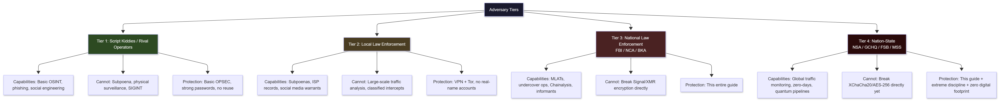
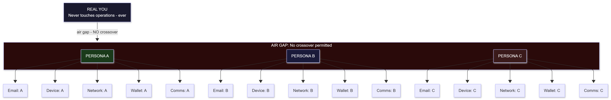
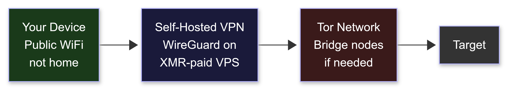
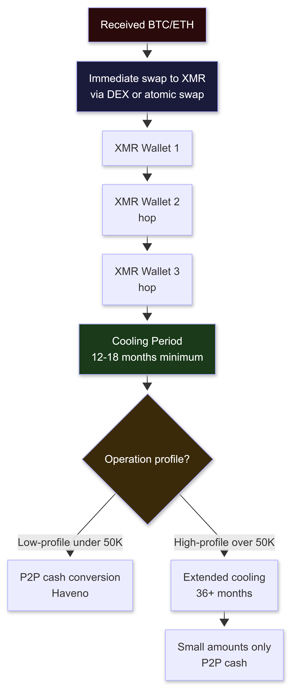
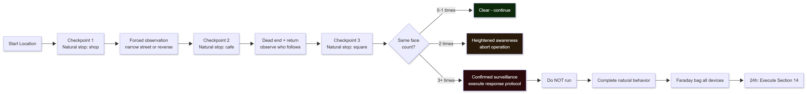
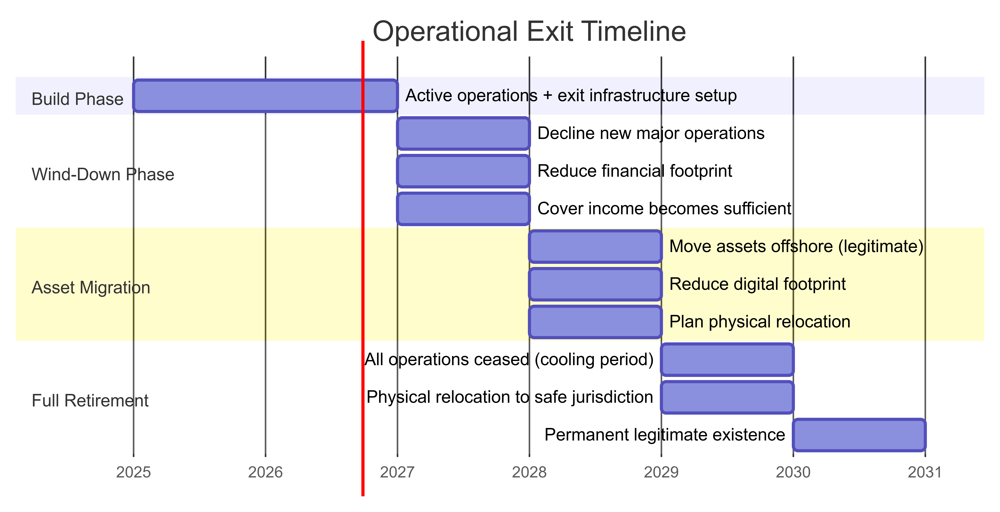
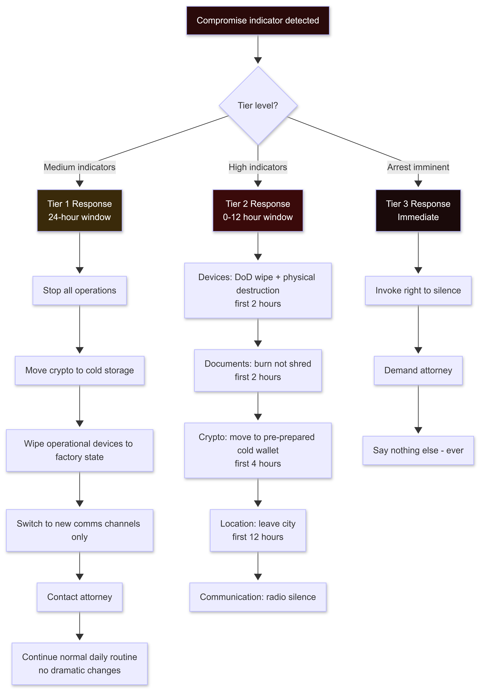
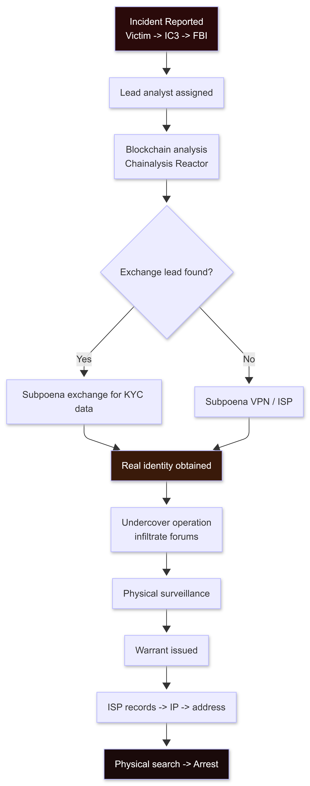

# BlackHat Long-Term Survival Tactics

**The Complete Operational Security Manual - 2027 Edition**

**Author:** Sagar Biswas  
**Version:** v1.1.0 · 2027 Edition<br/> 
**Companion to:** The BlackHAT Roadmap (0 to GREATEST)

> 📚 **Companion Roadmap Documents:**
> * **[Master Curriculum (Phases -1 to 6)](../phases/PHASE_-1.md)**: Zero-to-elite offensive engineering syllabus from foundational metal to apex operations.
> * **[Philosophy: The BlackHat Mindset](../field-guides/Philosophy_The_BlackHat_Mindset.md)**: Cognitive doctrine, adversarial assumption hunting, and primitive thinking mental models.
> * **[MITRE ATT&CK Quick Reference](../field-guides/MITRE_ATT&CK_Quick_Reference.md)**: Enterprise, ICS, and ATLAS technique mapping, detection signals, and attack chain blueprints.
> * **[Tools Inventory](../field-guides/Tools_Inventory.md)**: Canonical, phase-aligned 300+ tool directory covering primitive-to-tool realization.
> * **[Resources Aggregated](../field-guides/Resources_Aggregated.md)**: Curated books, research whitepapers, conference talk archives, and hands-on platforms.
> * **[Lab Setup Guide](../field-guides/Lab_Setup_Guide.md)**: Multi-tier hardware specifications and isolated enterprise/kernel lab blueprints.
> * **[FAQ](../field-guides/FAQ.md)**: Comprehensive operational and career transitions FAQ.
> * **[Final Word](../field-guides/Final_Word.md)**: Document verification statistics, researcher attributions, and horizon research roadmap.

---

> *"The best operation is the one nobody ever finds out happened."*
>
> *The second-best is the one that happened but can never be traced to you.*
>
> *There is no third place.*

---

## TABLE OF CONTENTS

1. [For the Beginner: Start Here](#for-the-beginner-start-here)
2. [Threat Modeling Framework](#threat-modeling-framework)
3. [Section 1: Digital Identity and Persona Architecture](#section-1-digital-identity-and-persona-architecture)
4. [Section 2: Device Security - OS and Hardware](#section-2-device-security---os-and-hardware)
5. [Section 3: Network-Level OPSEC](#section-3-network-level-opsec)
6. [Section 4: Communications Security](#section-4-communications-security)
7. [Section 5: Cryptocurrency and Financial Security](#section-5-cryptocurrency-and-financial-security)
8. [Section 6: Physical Location Security](#section-6-physical-location-security)
9. [Section 7: Physical Appearance and Counter-Surveillance](#section-7-physical-appearance-and-counter-surveillance)
10. [Section 8: Social Engineering Defense (Self-Protection)](#section-8-social-engineering-defense-self-protection)
11. [Section 9: AI-Powered Surveillance Evasion (2027)](#section-9-ai-powered-surveillance-evasion-2027)
12. [Section 10: Blockchain Forensics Threat Model (2027)](#section-10-blockchain-forensics-threat-model-2027)
13. [Section 11: Darknet Operational Security](#section-11-darknet-operational-security)
14. [Section 12: Legal Counter-Intelligence](#section-12-legal-counter-intelligence)
15. [Section 13: Long-Term Survival Planning](#section-13-long-term-survival-planning)
16. [Section 14: Emergency Exfil Protocol](#section-14-emergency-exfil-protocol)
17. [Section 15: Counter-LE Awareness](#section-15-counter-le-awareness)
18. [Section 16: International Jurisdictions 2027](#section-16-international-jurisdictions-2027)
19. [Section 17: OPSEC Golden Rules](#section-17-opsec-golden-rules)
20. [Section 18: Case Studies](#section-18-case-studies)
21. [Section 19: Advanced Hardware Attack Resistance](#section-19-advanced-hardware-attack-resistance)
22. [Section 20: In-Memory Forensics and Cold Boot Defense](#section-20-in-memory-forensics-and-cold-boot-defense)
23. [Section 21: Server-Side Detection and eBPF Awareness](#section-21-server-side-detection-and-ebpf-awareness)
24. [Quick Reference Operational Checklist](#quick-reference-operational-checklist)

---

## FOR THE BEGINNER: START HERE

This guide is dense. Before you read a single technique, understand the mental model. Every beginner who gets caught does so not because they lacked knowledge, but because they had knowledge without understanding the *why* behind it.

### The Three Pillars of Long-Term Survival

```
Pillar 1: ANONYMITY
  You do not exist as yourself during operations.
  A persona is a costume. Put it on fully. Take it off fully.
  One thread connecting your real identity to an operation = arrest.

Pillar 2: COMPARTMENTALIZATION
  Different operations = different everything.
  Device. Network. Identity. Wallet. Communication channel.
  Sharing anything between compartments defeats all other OPSEC.

Pillar 3: PATIENCE
  The worst mistakes happen fast.
  - Fast exit of crypto = chain analysis flags you
  - Fast talk after a win = informants find you
  - Fast repeat of same location = surveillance identifies you
  The slow operator survives. The impatient one does not.
```

### Why Most Get Caught (Learn This Before Anything Else)

Study these. They are the actual patterns from real cases:

| Cause | % of Arrests | How to Avoid |
|-------|-------------|--------------|
| Bragging (online or offline) | ~40% | Absolute operational silence |
| Financial mistakes (cashing out too fast, lifestyle change) | ~25% | Financial patience + no lifestyle signal |
| Technical mistakes (reused infrastructure, unmasked IP) | ~20% | Separate infrastructure, review this guide |
| Betrayal by associates | ~10% | Solo operations or minimal, vetted team |
| Bad luck / physical surveillance | ~5% | Counter-surveillance discipline |

Source: Analysis of ransomware/cybercrime prosecutions 2019-2026 (DOJ, Europol press releases).

**The single biggest insight:** Most arrests are not sophisticated investigations. They are *social* failures. The operator talked. Or spent visibly. Or reused an email. The technical layers held; the human layer failed.

### How to Use This Guide

- Read sequentially the first time. Every section builds on the previous.
- Beginner: focus on Sections 1-5 and the Quick Reference Checklist.
- Intermediate: add Sections 6-12.
- Advanced: all sections, especially 13-21.
- Review the checklist before and after every operation.

---

## THREAT MODELING FRAMEWORK

Before deploying any OPSEC measure, you must understand *who* you are protecting against. Different adversaries have different capabilities. Building a bunker against a nation-state when you only face local police wastes resources and creates operational friction. Being under-prepared for nation-state adversaries when you are actually facing them is fatal.

### Step 1: Identify Your Adversaries

<div align="center">
<table><tr><td>



</td></tr></table>
</div>

### Step 2: Define What You Are Protecting

```
Asset 1: Identity
  What it is: Your real name, location, face, devices
  Exposure: If LE connects real identity to operation
  Consequence: Arrest

Asset 2: Location (current)
  What it is: Where you physically are
  Exposure: IP leak, card transaction, cell phone ping, CCTV
  Consequence: Physical surveillance, arrest

Asset 3: Operation Details
  What it is: Target, technique, timing, co-conspirators
  Exposure: Communications intercept, informant, confession
  Consequence: Evidence for prosecution

Asset 4: Financial Trail
  What it is: Flow of funds from operation to you
  Exposure: Blockchain analysis, bank records, crypto exchange KYC
  Consequence: Forfeiture + evidence

Asset 5: Infrastructure
  What it is: Servers, domains, accounts used in operation
  Exposure: Server seizure, hosting provider cooperation
  Consequence: Attribution + evidence
```

### Step 3: Map Attack Paths

```
Example - Identity exposure paths:
1. IP leak during operation -> ISP subpoena -> real name (most common)
2. Reused email/username from pre-OPSEC era -> OSINT -> real identity
3. Payment method traced -> bank/exchange -> KYC records

Example - Location exposure paths:
1. Cell phone in pocket during operation -> carrier tower logs -> location
2. Cafe CCTV + facial recognition -> physical location at time of IP
3. Laptop WiFi probe requests -> passive tracking of device movement
```

### Step 4: Assign Countermeasures

Match each attack path to a countermeasure in this guide. That is your personal OPSEC plan.

---

## SECTION 1: DIGITAL IDENTITY AND PERSONA ARCHITECTURE

### 1.1 The Persona Model

<div align="center">
<table><tr><td>



</td></tr></table>
</div>

Every operation lives inside a persona. A persona is:
- A complete, internally-consistent fictional identity
- Backed by infrastructure that matches (email, device, network, payment)
- Isolated from every other persona you run
- Never touched by your real identity

### 1.2 Building a Persona (Step by Step)

**Step 1: Generate the identity (offline)**
```
Tools (run locally, never cloud):
- Fake Name Generator: https://www.fakenamegenerator.com (for structure only)
- Better: generate manually: realistic name for target country,
  plausible age (25-40), consistent backstory

Backstory elements to define BEFORE creating any accounts:
- Name, DOB, nationality
- Profession (IT consultant, freelance developer -> believable for tech access)
- City (somewhere you know well enough to fake knowledge of)
- Education background
- "Why they are online" (makes social media believable if needed)
```

**Step 2: Create email infrastructure (via Tor)**
```bash
# Tier 1: Anonymous disposable email (for sign-ups that do not matter)
# Options: Temp-Mail, Guerrilla Mail
# Do NOT use for anything critical

# Tier 2: ProtonMail (for persistent but anonymous accounts)
# Access: Tor Browser -> proton.me
# Create: NO phone number, NO recovery email
# Weakness: Proton has cooperated with LE on IP (Tor covers this)
# Key: access ONLY via Tor, ALWAYS

# Tier 3: Self-hosted mail (for maximum control)
# Requires: VPS paid with XMR + domain from Njalla
# Setup: mailcow (docker-based mail server)
# Overkill for most; essential for high-value ops

# Secure email alternatives (2027):
# - Tutanota (Germany, zero-knowledge encryption, accepts XMR payment)
#   https://tuta.com
# - Disroot (privacy-focused collective, XMPP + email)
#   https://disroot.org
```

**Step 3: Establish the device for this persona**
(See Section 2 for full device setup: each persona gets its own device)

**Step 4: Build the network layer for this persona**
(See Section 3: each persona uses isolated network infrastructure)

**Step 5: Create cryptocurrency wallet for this persona**
(See Section 5: one wallet per persona, never reused)

**Step 6: Age the persona (before it matters)**
```
Minimum 3-6 months aging for credible persona:
- Post occasionally to relevant forums (technical content, nothing operational)
- GitHub account with a few minor commits
- Stack Overflow profile with some questions
- LinkedIn (optional: useful for corporate espionage personas)
- Goal: if someone searches the username/email, they find a plausible human

DO NOT:
- Create persona and immediately use for operations
- Reuse any username, email, or handle from previous personas
- Let the persona's activity pattern match your real activity pattern
  (timezone, writing style, posting hours)
```

### 1.3 Username and Password Hygiene

```bash
# Username generation (never reuse across platforms):
# Pattern: [adjective][noun][2-digit-number] or [word][word][3-digit-number]
# Never: real name initials, birth year, home city

# Password management:
# KeePassXC (local, encrypted, never cloud):
# https://keepassxc.org
# Database stored on encrypted volume only
# Different strong password for every single account

# Passphrase generation (Diceware method: truly random):
# 5-7 random words = uncrackable but memorable
# Example tool:
diceware  # apt install diceware
# Output: "correct horse battery staple lumber fence"
# This beats a complex password like P@ssw0rd123! every time

# NEVER:
# - Password managers that sync to cloud (LastPass, 1Password cloud)
# - Bitwarden cloud mode (self-hosted Bitwarden/Vaultwarden is acceptable)
# - Browser-saved passwords (extractable)
# - Same password on multiple accounts (one breach = all accounts)
# - Password less than 16 characters for anything operational
```

---

## SECTION 2: DEVICE SECURITY - OS AND HARDWARE

### 2.1 Operating System Selection (2027)

```
+------------+-------------------------+-------------------+-----------------+
| OS         | Best For                | Pros              | Cons            |
+------------+-------------------------+-------------------+-----------------+
| Tails OS   | Single operations,      | Amnesiac (wipes   | Slow; no        |
|            | maximum anonymity,      | on shutdown);     | persistence;    |
|            | beginners               | Tor by default;   | limited         |
|            |                         | no trace on host  | software        |
+------------+-------------------------+-------------------+-----------------+
| QubesOS    | Multi-persona ops,      | Security by       | Steep           |
|            | long-term use,          | compartment;      | learning        |
|            | advanced operators      | different VMs per | curve;          |
|            |                         | persona; best     | needs 16GB+     |
|            |                         | desktop security  | RAM             |
+------------+-------------------------+-------------------+-----------------+
| Whonix     | Development work,       | Tor gateway       | Requires        |
| (in Qubes) | operations requiring    | architecture;     | host OS;        |
|            | persistence             | workstation       | VM escape       |
|            |                         | isolated          | risk on         |
|            |                         |                   | bare metal      |
+------------+-------------------------+-------------------+-----------------+
| Hardened   | Pentesters who need     | Full toolset;     | NOT amnesiac    |
| Kali Linux | professional tool       | familiar UX       | by default;     |
|            | access                  |                   | hardening       |
|            |                         |                   | required        |
+------------+-------------------------+-------------------+-----------------+
```

**Recommendation by skill level:**
- Beginner: **Tails OS** -- boots from USB, leaves zero trace
- Intermediate: **QubesOS** -- compartmentalization built into the OS
- Advanced: **QubesOS + Whonix VMs** -- the current gold standard (2027)

### 2.2 Tails OS - Setup and Usage (Beginner Path)

```bash
# Step 1: Download Tails
# https://tails.net - verify the OpenPGP signature
wget https://tails.net/tails-amd64-6.x.img
# Verify:
gpg --keyserver hkps://keyserver.ubuntu.com \
    --recv-keys A490D0F4D311A4153E2BB7CADBB802B258ACD84F
gpg --verify tails-amd64-6.x.img.sig tails-amd64-6.x.img

# Step 2: Write to USB (8GB minimum, 16GB recommended)
# Linux:
sudo dd if=tails-amd64-6.x.img of=/dev/sdX bs=16M status=progress
# Windows: use Rufus or balenaEtcher

# Step 3: Boot from USB
# BIOS/UEFI: disable Secure Boot, set USB as first boot device
# On Tails start: choose "Tails" from boot menu

# Step 4: Configure Persistent Storage (optional, encrypted)
# Applications -> Tails -> Persistent Storage
# Enable: Personal Data, SSH Keys, GnuPG, Tor Browser Bookmarks
# Persistent storage: AES-256 LUKS encrypted
# Passphrase: use Diceware 6+ words

# Tails Tor connection:
# On boot: Tails Tor Connection Wizard
# Option 1: Direct (if Tor not blocked)
# Option 2: Bridges (if Tor is blocked/monitored)
#   Bridge types: obfs4 (default) or Snowflake (harder to detect)

# IMPORTANT: Never install additional software in Tails
# Additional packages = fingerprinting surface
# Use only what Tails ships by default
```

### 2.3 QubesOS - Setup Guide (Intermediate-Advanced)

```bash
# QubesOS architecture:
# - dom0: the management domain (no network access)
# - sys-net: handles network hardware
# - sys-firewall: firewall between net and AppVMs
# - sys-whonix: Tor gateway (via Whonix)
# - AppVMs: individual compartments per persona/task

# Download: https://www.qubes-os.org/downloads/
# Verify signature (critical: supply chain attack risk):
gpg --with-fingerprint qubes-release-signing-key.asc
# Expected fingerprint:
# 427F 11FD 0FAA 4B08 0123 F01C DDFA 1A3E 3687 9494

# Installation: standard installer, full disk encryption (mandatory)
# Minimum: 8GB RAM (16GB recommended), 64GB SSD

# QubesOS compartmentalization setup:
# Create one AppVM per persona:
qvm-create --class AppVM --label red PersonaA
qvm-create --class AppVM --label orange PersonaB
qvm-create --class AppVM --label green LegalWork

# Route PersonaA through Whonix (Tor):
qvm-prefs PersonaA netvm sys-whonix

# Route LegalWork through standard firewall (direct, identified):
qvm-prefs LegalWork netvm sys-firewall

# Disposable VMs for one-shot tasks (auto-destroy on close):
# Right-click AppVM -> "Open in Disposable VM"
# Or:
qvm-run --dispvm PersonaA

# File transfer between VMs (no clipboard crossover):
# Always use Qubes file-copy (not clipboard):
qvm-copy-to-vm TargetVM /path/to/file
# Clipboard: explicitly copy -> Ctrl+Shift+C (dom0 intercepts)

# Key rule: NEVER network PersonaA to any VM that handles real identity
# Dom0 never gets network access; the air gap is architectural
```

### 2.4 Hardware Selection (2027)

```
Recommended Hardware (Coreboot/LibreBoot compatible):

1. Lenovo ThinkPad X230 / T430 (budget, proven):
   - Librebooted (proprietary BIOS fully replaced)
   - No Intel ME active management engine concerns at this generation
   - Price: $60-150 used
   - Weakness: aging hardware, battery life poor

2. Lenovo ThinkPad X250 / T480 (modern, still Coreboot-compatible):
   - Coreboot supported (not full LibreBoot: ME partially neutralized)
   - Better performance, USB-C, longer battery
   - Price: $200-350 used
   - Best balance of cost/capability/security for 2027

3. System76 (new hardware, coreboot):
   - https://system76.com - Linux-first, open firmware
   - More expensive but privacy-respecting supply chain

4. Purism Librem 14 (hardware kill switches for WiFi, camera, microphone):
   - PureOS (Debian-based, libre software)
   - Kill switch = physical disconnect (not software-disableable)
   - Price: $1,400+
   - Note: Purism has had delivery delays and supply chain criticism;
     verify current order status and community reviews before purchasing

AVOID:
- Any machine with Intel vPro (remote management engine, always-on)
- Any machine purchased with traceable payment (credit card, Amazon account)
- MacBooks (proprietary firmware, T2/T1 security chip complicates full disk wipe)
- Any second-hand machine from eBay/Amazon account tied to real identity
```

### 2.5 Hardware Stripping and Preparation

```bash
# Step 1: Physical modifications
# Webcam: cover with tape THEN disable in BIOS (dual protection)
# Microphone: physical disable (unsolder or cut connection if serious)
# Bluetooth: BIOS disable OR physically remove module
# LTE modem: physically remove if present (baseband processor is a black box)
# Serial number stickers: remove ALL (laptop body, battery, PSU)

# Step 2: BIOS-level identification removal
# Check what is exposed:
sudo dmidecode | grep -i "serial\|uuid\|product"
# Output: System Serial Number, Board Serial Number, UUID
# All of these can be read by software running on the machine

# Replace via Coreboot/custom BIOS (advanced):
# Coreboot lets you set custom strings: replace serials with nulls or random
# Without Coreboot: limited ability to change these via OS

# Step 3: MAC Address spoofing (EVERY session, before network)

# Temporary spoof (lost on reboot):
sudo ip link set dev eth0 down
sudo ip link set dev eth0 address \
  $(openssl rand -hex 6 | sed 's/\(..\)/\1:/g; s/:$//')
sudo ip link set dev eth0 up

# Permanent spoof via NetworkManager:
nmcli connection modify "Connection-Name" \
  802-11-wireless.cloned-mac-address random
# OR: 802-3-ethernet.cloned-mac-address random

# macchanger (classic tool, still valid):
sudo macchanger -r eth0    # Random MAC
sudo macchanger -r wlan0   # Random MAC for WiFi
# -r: random, -A: random vendor-valid, -p: reset to permanent

# Step 4: Hostname randomization (prevents local network fingerprinting)
# Tails does this automatically.
# On other systems:
sudo hostnamectl set-hostname \
  $(cat /dev/urandom | tr -dc 'a-z' | fold -w 8 | head -n 1)

# Step 5: Disk encryption (non-negotiable)
# Full disk encryption with LUKS (Linux):
# DO THIS AT INSTALL TIME: retrofitting is harder
# LUKS + LVM standard Kali/Debian/Qubes installer

# Verify encryption:
sudo cryptsetup status /dev/mapper/luks-*
# Should show: cipher: aes-xts-plain64, keysize: 512 bits

# VeraCrypt (for portable encrypted containers, cross-platform):
# https://www.veracrypt.fr
# Create encrypted container for sensitive files:
veracrypt --create /path/to/container.vc --size=10G \
  --password="$(diceware -n 6)" --encryption=AES \
  --hash=SHA-512 --filesystem=ext4 --pim=0 -t -k "" \
  --random-source=/dev/urandom

# Plausible deniability: VeraCrypt hidden volume
# Two passphrases: outer (fake) + inner (real)
# Under coercion: reveal outer passphrase -> shows decoy content
# Inner volume is cryptographically undetectable
# IMPORTANT: See Section 12 for jurisdiction-specific legal implications
# (UK RIPA and similar laws can compel decryption - know your legal context)

# Mount:
veracrypt /path/to/container.vc /mnt/secure_volume
# Unmount and destroy memory:
veracrypt -d /mnt/secure_volume
```

### 2.6 Secure Drive Erasure (Corrected - Critical Section)

**WARNING: This section replaces the common "shred" advice that fails for SSDs.**

Understanding *why* drive erasure is different for HDDs vs SSDs is mandatory before you reach an emergency:

**Hard Disk Drives (HDDs):**
```bash
# Single-pass overwrite is sufficient per NIST SP 800-88 (2014, current standard)
# The old "DoD 7-pass" method comes from 1995 guidance and is obsolete for modern HDDs
# With high-density modern drives, 1 pass of random data is cryptographically equivalent

# Single-pass secure wipe (sufficient for HDD):
sudo shred -vz /dev/sdX
# -v: verbose (progress)
# -z: final pass of zeros (masks the shred)

# NIST-compliant single pass:
sudo dd if=/dev/urandom of=/dev/sdX bs=4M status=progress

# Verify the drive before trusting the wipe:
sudo hexdump -C /dev/sdX | head -20
# Should show all zeros or random data
```

**Solid State Drives (SSDs) - DIFFERENT RULES:**
```bash
# CRITICAL: shred and dd DO NOT reliably erase SSDs
# Reason: SSDs use wear leveling and over-provisioning areas
#
# Wear leveling: the drive's Flash Translation Layer (FTL) routes writes
# to new cells to distribute wear. Old cells retain data even after
# overwrite commands. "shred /dev/sdX" overwrites a different physical
# location than the original data in most cases.
#
# Over-provisioning: SSDs reserve 7-25% of NAND as spare blocks.
# These are completely inaccessible to the OS but readable by forensic tools.
#
# LE forensics on "wiped" SSDs has recovered data in documented cases.
# Do not trust overwrite for SSDs. Use one of these instead:

# Method 1: Cryptographic Erasure (BEST for LUKS-encrypted drives)
# If the SSD was LUKS-encrypted from the start, erase the LUKS header:
sudo cryptsetup erase /dev/sdX
# This destroys the encryption key. All data is now cryptographically inaccessible.
# The data still exists physically but is indistinguishable from random noise.
# This is NIST-approved and takes seconds.

# Method 2: ATA Secure Erase (uses the drive's built-in SE command)
# Verify the drive supports it:
sudo hdparm -I /dev/sdX | grep -i "erase"
# If supported:
sudo hdparm --user-master u --security-set-pass TEMPPASS /dev/sdX
sudo hdparm --user-master u --security-erase TEMPPASS /dev/sdX
# This triggers the SSD's internal erase routine - the most thorough non-destructive method

# Method 3: NVMe Secure Erase (for NVMe SSDs)
# Install nvme-cli:
sudo apt install nvme-cli
# Check support:
sudo nvme id-ctrl /dev/nvme0 | grep -i "fna"
# Execute format with secure erase:
sudo nvme format /dev/nvme0 --ses=1
# --ses=1: user data erase; --ses=2: cryptographic erase (if supported)

# Method 4: Physical Destruction (ONLY guaranteed method for high-threat scenarios)
# For any emergency situation where drive contents could mean arrest:
# 1. Remove drive from machine
# 2. Drill minimum 5 holes through NAND chips (not just the PCB connector)
# 3. Bend the PCB until it snaps
# 4. Dispose in separate bins in different locations
# Note: SSDs have NAND chips on BOTH sides of the PCB in many models.
#       Confirm chip locations before drilling.
#
# For HDDs in physical destruction:
# 1. Drill 5+ holes through the drive platters (visible through the case)
# 2. Degaussing (if available) is the most thorough non-drilling option

# RAM Erasure (critical on shutdown):
# See Section 20 for cold boot defense. RAM holds encryption keys and data
# after shutdown for seconds to minutes depending on temperature.
```

### 2.7 Mobile Device Security

```
NEVER use your personal phone for operational activity.
Never. Not even once. Not "just to check something quickly."

Why:
- Personal phone = carrier registration = real identity
- IMSI permanently tied to your identity by carrier records
- Even with airplane mode: WiFi probes, Bluetooth beacons still active
- Location history in Google/Apple: continuous, accurate, legally accessible
- Faraday bag is the only reliable way to truly silence a phone

For operational mobile (if required):

Option A: GrapheneOS (most secure Android, 2027 standard)
  Hardware: Google Pixel 7/8/9 (only supported hardware)
  https://grapheneos.org

  PURCHASE NOTE: Buy with cash from a physical store.
  Do NOT order online (shipping address = real identity).
  Do NOT use a Google account to set up before flashing GrapheneOS.
  First power-on should be during/after GrapheneOS installation.

  Features:
  - Hardened memory allocator (attacks against heap are harder)
  - Per-app network isolation (app cannot see other apps' traffic)
  - Sandboxed Google Play (run Play apps without Google access)
  - Auto-reboot (configurable: 12h/24h -> wipes RAM)
  - Duress PIN (triggers wipe on wrong PIN)
  - Airplane mode actually works (verified)
  - USB-C port can be disabled when locked
  - LTE-only mode available: prevents 2G downgrade attacks (IMSI catcher defense)

  Install GrapheneOS:
  # Web installer (Chromium-based browser):
  https://grapheneos.org/install/web
  # Or CLI installer:
  https://grapheneos.org/install/cli

Option B: CalyxOS (easier for beginners, microG for app compatibility)
  Hardware: Pixels, some Fairphones
  Less secure than GrapheneOS but far better than stock Android
  MicroG replaces Google Play Services with open-source equivalent

DO NOT:
- iPhone for operations (Apple cooperates with LE, iCloud backups)
- Stock Android (Google telemetry, carrier logging)
- Any rooted phone that lost its verified boot chain

Operational phone setup (GrapheneOS):
1. Purchase Pixel with cash (physical store); no personal account involvement
2. Flash GrapheneOS BEFORE first boot (avoids initial Google setup)
3. Never insert SIM registered to real identity
4. For internet: WiFi only (public, rotating locations)
5. For calls/SMS if needed: prepaid SIM (cash, fake registration)
6. Install: Tor Browser (via Vanadium), Signal, KeePassDX
7. Disable: Bluetooth, NFC, WiFi scan when not needed
8. Enable: LTE-only mode (Settings -> Network -> Preferred network type -> LTE)
9. Auto-lock: 30 seconds
10. After use: airplane mode, power off, Faraday bag

Faraday bags (physically blocks all RF):
- Mission Darkness (tested, military-grade): https://www.mosequipment.com
- Budget verification: place phone in a metal cookie tin, call it.
  If no ring, it works. Test before trusting.
```

---

## SECTION 3: NETWORK-LEVEL OPSEC

### 3.1 The Layering Model (2027)

<div align="center">
<table><tr><td>



</td></tr></table>
</div>

**Why not commercial VPN chains (ExpressVPN -> NordVPN)?**
- Multiple documented cooperation cases with LE (2017-2025)
- Metadata logging despite "no-log" marketing claims (court cases have confirmed this)
- Many are US/British Virgin Islands jurisdiction -- Five-Eyes adjacent
- Paying with credit card = your identity is their first record
- Do NOT use commercial VPN chains for operational security

### 3.2 Self-Hosted VPN (The Right Way)

```bash
# Step 1: Get an anonymous VPS
# Providers that accept Monero (no KYC required, 2027):
# - Njalla: https://njal.la (Swedish, privacy-focused, XMR accepted)
# - 1984 Hosting: https://1984.hosting (Iceland, XMR accepted)
# - FlokiNET: https://flokinet.is (Iceland/Romania, XMR accepted)
# - Alexhost: https://alexhost.com (Moldova, XMR accepted)
# - SporeStack: https://sporestack.com (XMR, API-based, minimal footprint)

# DO NOT use: AWS, Azure, GCP, DigitalOcean, Linode/Akamai
# All require credit card = real identity = subpoena = arrest

# Jurisdiction priority:
# Iceland > Moldova > Romania > Netherlands
# Avoid: UK, US, Australia, Canada, NZ (Five-Eyes)
# Avoid: Germany (strong LE cooperation), France (ANSSI/DGSI active)

# Step 2: Access the VPS setup page via Tor only
# Never access the provider dashboard from your real IP

# Step 3: Deploy WireGuard (better than OpenVPN in 2027)
# On VPS (Ubuntu/Debian):
apt update && apt install wireguard -y

# Generate server keys:
wg genkey | tee /etc/wireguard/server_private.key \
  | wg pubkey > /etc/wireguard/server_public.key
chmod 600 /etc/wireguard/server_private.key

# /etc/wireguard/wg0.conf (server):
cat > /etc/wireguard/wg0.conf << 'EOF'
[Interface]
PrivateKey = <SERVER_PRIVATE_KEY>
Address = 10.0.0.1/24
ListenPort = 51820
PostUp = iptables -A FORWARD -i wg0 -j ACCEPT; \
         iptables -t nat -A POSTROUTING -o eth0 -j MASQUERADE
PostDown = iptables -D FORWARD -i wg0 -j ACCEPT; \
           iptables -t nat -D POSTROUTING -o eth0 -j MASQUERADE

[Peer]
PublicKey = <CLIENT_PUBLIC_KEY>
AllowedIPs = 10.0.0.2/32
EOF

# Enable:
systemctl enable wg-quick@wg0
systemctl start wg-quick@wg0

# Step 4: Zero logging on VPS
# Log destruction script (run as cron, every 30 minutes):
cat > /usr/local/bin/logwipe.sh << 'SCRIPT'
#!/bin/bash
find /var/log/ -type f -name "*.log" -exec truncate -s 0 {} \;
find /var/log/ -type f -name "*.gz" -delete
journalctl --rotate --vacuum-time=1s 2>/dev/null
> /root/.bash_history
history -c
SCRIPT
chmod +x /usr/local/bin/logwipe.sh
echo "*/30 * * * * root /usr/local/bin/logwipe.sh" > /etc/cron.d/logwipe

# Step 5: SSH hardening
# /etc/ssh/sshd_config (current, no deprecated directives):
cat >> /etc/ssh/sshd_config << 'EOF'
PermitRootLogin no
PasswordAuthentication no
PubkeyAuthentication yes
AuthorizedKeysFile .ssh/authorized_keys
X11Forwarding no
AllowTcpForwarding no
MaxAuthTries 3
LoginGraceTime 30
Ciphers chacha20-poly1305@openssh.com,aes256-gcm@openssh.com
MACs hmac-sha2-512-etm@openssh.com
KexAlgorithms curve25519-sha256,curve25519-sha256@libssh.org
EOF
# Note: "Protocol 2" is not needed. All modern OpenSSH (7.6+)
# is SSHv2 only by default. Adding it generates warnings.
systemctl restart sshd

# Connect to VPS via Tor (so VPS never sees your real IP):
ssh -o "ProxyCommand=nc -x 127.0.0.1:9050 %h %p" \
    -i ~/.ssh/operation_key \
    -p 22 user@vps_ip_or_onion
```

### 3.3 Tor Network - Correct Usage

```bash
# Install Tor:
apt install tor torsocks -y
# Or: use Tor Browser (includes Tor)

# torrc configuration (/etc/tor/torrc):
# Bridges (use if Tor is blocked or monitored in your country):
UseBridges 1
ClientTransportPlugin obfs4 exec /usr/bin/obfs4proxy
# Get bridges: https://bridges.torproject.org (via Tor Browser)
# Or: email bridges@torproject.org from Gmail/Riseup

# ExcludeExitNodes (avoid specific countries at exit):
ExcludeExitNodes {US},{GB},{AU},{CA},{NZ}
StrictNodes 1
# Note: Germany and France have complex positions; research current status
# for your specific threat model before adding them

# Increase stream isolation (different circuit per destination):
IsolateDestAddr 1
IsolateDestPort 1

# Tor over VPN: YOUR-DEVICE -> VPN -> Tor -> Target
# This is recommended: VPN sees Tor traffic (not target),
# Tor entry sees VPN IP (not you), target sees Tor exit

# What Tor does NOT protect against:
# 1. Malware on your device (exits before Tor)
# 2. JavaScript fingerprinting (use Tor Browser with JS disabled)
# 3. Traffic correlation attacks (nation-state: timing analysis)
#    See detailed timing attack defense in Section 21
# 4. Exit node MITM for unencrypted traffic (always use HTTPS)
# 5. Logging in to accounts tied to real identity (defeats everything)

# Tor Browser - additional hardening:
# Click shield icon -> set Security Level to "Safest"
# about:config settings:
# javascript.enabled = false (breaks most sites but maximum security)
# privacy.resistFingerprinting = true (default in Tor Browser)
# webgl.disabled = true
# media.peerconnection.enabled = false  (WebRTC leak prevention)

# Testing for leaks:
# https://www.dnsleaktest.com (via Tor Browser)
# https://ipleak.net (via Tor Browser)
# https://browserleaks.com (via Tor Browser)
# All should show Tor exit node, not your real IP
```

### 3.4 Proxychains4 - Configuration (2027)

```bash
# /etc/proxychains4.conf:
dynamic_chain
proxy_dns
tcp_connect_timeout 5000
remote_dns_subnet 224
localnet 127.0.0.0/255.0.0.0
localnet 10.0.0.0/255.0.0.0

[ProxyList]
socks5 127.0.0.1 9050    # Tor SOCKS5 (local Tor daemon)

# Usage examples:
proxychains4 -q curl https://target.com          # -q = quiet
proxychains4 -q nmap -sT -Pn -p 80,443 target.com
proxychains4 -q python3 exploit.py

# DNS leak test via proxychains:
proxychains4 -q dig +short myip.opendns.com @resolver1.opendns.com
# Should return Tor exit IP, not your IP

# Note: nmap UDP scans (-sU) do not work through SOCKS5 (UDP not supported)
# Use TCP-only scan methods with proxychains
```

### 3.5 Anti-Tracking Per Session

```bash
# Before each session, rotate these (scripted):

#!/bin/bash
# session_start.sh - run before every operational session

# 1. Spoof MAC address (both interfaces)
sudo ip link set eth0 down
sudo ip link set eth0 address \
  $(openssl rand -hex 6 | sed 's/\(..\)/\1:/g; s/:.$//')
sudo ip link set eth0 up
sudo macchanger -r wlan0 2>/dev/null

# 2. Randomize hostname
sudo hostnamectl set-hostname \
  "$(cat /dev/urandom | tr -dc 'a-z0-9' | head -c8)"

# 3. Set privacy-respecting DNS (not ISP DNS)
echo "nameserver 9.9.9.9
nameserver 149.112.112.112" | sudo tee /etc/resolv.conf

# 4. Flush DNS cache (remove any cached lookups)
sudo systemd-resolve --flush-caches 2>/dev/null \
  || sudo /etc/init.d/nscd restart 2>/dev/null

# 5. Verify IP before proceeding
echo "=== Network Status ==="
curl -s https://check.torproject.org/api/ip
echo "=== DNS Leak Check ==="
dig +short myip.opendns.com @resolver1.opendns.com

# WebRTC leak is the most common non-VPN IP leak:
# Even with VPN, WebRTC can bypass and reveal real IP
# Test: https://browserleaks.com/webrtc
# Fix: media.peerconnection.enabled = false in Firefox/Tor Browser
```

---

## SECTION 4: COMMUNICATIONS SECURITY

### 4.1 Secure Messaging - 2027 Comparison

```
Tier 1: Maximum Security (2027 Gold Standard)

SimpleX Chat (RECOMMENDED):
  Why: No user IDs. No phone numbers. No usernames.
       Servers cannot correlate senders to receivers even in metadata.
       Fully decentralized. Self-hostable relay servers.
  https://simplex.chat
  Setup: Download app -> no registration -> share your address link
  Use: Run via Tor for maximum anonymity
  Status (2027): Audited, actively maintained, growing adoption

Signal:
  Why: Gold standard E2E encryption (Signal Protocol)
  Weaknesses in 2027:
    - Requires phone number (tied to SIM)
    - Signal servers see: who you communicate with (metadata)
    - Signal has cooperated with US subpoenas (gave metadata: timestamps,
      phone numbers; not message content because they do not have it)
    - Note: Signal's server code update cadence has been inconsistent
      since 2022-2023. Encryption is still sound; server behavior
      is less auditable than it once was.
  Mitigations:
    - Use prepaid SIM for registration (cash, fake registration)
    - Enable: Sealed Sender (settings -> privacy -> advanced -> sealed sender)
    - Enable: Screen lock, registration lock (PIN)
    - Disappearing messages: 1-hour maximum for operational comms
    - Note safety number: verify in person or via secure side channel
  Status (2027): Acceptable for comms not requiring full anonymity;
                 SimpleX preferred for anonymity-critical comms

Tier 2: Decentralized / Federated

Session:
  Why: No phone number, no email required. Decentralized (onion routing).
       Built on Tor-like overlay network (Lokinet).
  https://getsession.org
  Weakness: Smaller user base; metadata partially available
  Use: When SimpleX is not available

Briar:
  Why: Peer-to-peer, no central server. Works over Tor.
       Works offline (Bluetooth/WiFi mesh).
  https://briarproject.org
  Best for: Communications when internet is unavailable or monitored
  Weakness: Both users must be online simultaneously (no store-and-forward)

Tier 3: Email (Use only when necessary)

ProtonMail (via Tor):
  Setup: Tor Browser -> proton.me -> create account (NO phone number)
  Encryption: E2E between Proton accounts; S/MIME/PGP for external
  Weakness: Proton cooperates with Swiss LE (they have been ordered to)
             They CANNOT see content (E2E encrypted)
             But they CAN see sender/receiver metadata
             Solution: access ONLY via Tor (they see Tor exit, not you)

Tutanota (via Tor):
  https://tuta.com
  Similar to ProtonMail; German jurisdiction
  Note: Tutanota was compelled to install monitoring in 2021 (German court order)
        Monitoring was of metadata (not content) of ONE specific account
        Access via Tor protects from this

Tier 4: Emergency / One-Time

Dead drop (most anonymous: no network communication):
  Method: shared email account: write draft, never send
  Both parties know credentials -> read drafts -> delete
  Important: most email providers log draft activity metadata including
             IP addresses. Always access via Tor when using this method.
  Use: only for critical, one-time communications
```

### 4.2 PGP/GPG - Practical Setup

```bash
# Generate keypair:
gpg --batch --generate-key <<EOF
%no-protection
Key-Type: eddsa
Key-Curve: Ed25519
Key-Usage: sign
Subkey-Type: ecdh
Subkey-Curve: Curve25519
Subkey-Usage: encrypt
Name-Real: Handle_Only
Name-Email: anon@nowhere.invalid
Expire-Date: 1y
EOF

# List keys:
gpg --list-secret-keys --keyid-format=long

# Encrypt a file to recipient:
gpg --encrypt --sign --armor -r recipient@address file.txt

# Decrypt:
gpg --decrypt file.txt.asc

# Sign a message:
gpg --clearsign message.txt

# Export key for sharing (public key only):
gpg --armor --export KEYID > my_pubkey.asc

# Backup private key (store OFFLINE, encrypted volume only):
gpg --armor --export-secret-keys KEYID > KEEP_THIS_OFFLINE.asc
# -> encrypt with VeraCrypt and store on air-gapped USB

# Verify a signature:
gpg --verify file.txt.sig file.txt
```

### 4.3 Self-Hosted C2 Server (Anonymous VPS)

```bash
# DO NOT use AWS, Azure, GCP: all require credit card -> traceable
# USE: Njalla, 1984.hosting, FlokiNET (all accept XMR, no KYC)

# Step 1: Order VPS via Tor, pay with XMR
# Step 2: Access ONLY via Tor + SSH

# SSH access via Tor (for onion-hosted VPS):
ssh -o "ProxyCommand=nc -x 127.0.0.1:9050 %h %p" \
    -i ~/.ssh/op_key \
    user@vpshostname.onion

# SSH key generation (operational key, not your daily key):
ssh-keygen -t ed25519 -a 200 -f ~/.ssh/op_key -C ""
# -a 200: key derivation iterations (slower brute-force)
# -C "": no comment (comments can identify the key creator)

# Log destruction (run on VPS, every 30 minutes):
cat > /usr/local/bin/logwipe.sh << 'SCRIPT'
#!/bin/bash
find /var/log/ -type f \( -name "*.log" -o -name "*.gz" \) \
  -exec truncate -s 0 {} \; 2>/dev/null
journalctl --rotate --vacuum-time=1s 2>/dev/null
truncate -s 0 /root/.bash_history /home/*/.bash_history 2>/dev/null
history -c
SCRIPT
chmod +x /usr/local/bin/logwipe.sh
(crontab -l 2>/dev/null; echo "*/30 * * * * /usr/local/bin/logwipe.sh") | crontab -
```

### 4.4 Writing Style Defense (Stylometric Analysis)

```
AI can identify authors from writing patterns (sentence length, vocabulary,
punctuation habits, word frequency) with meaningful accuracy, especially
with large samples from the same person.

Practical countermeasures:
- Deliberately shorten sentence structures compared to your natural register
- Avoid your characteristic vocabulary (words you use unusually often)
- Use consistent but artificial capitalization different from your normal style
- Vary paragraph length more than you naturally do
- Write operational posts, then translate to another language and back (machine
  translation disrupts stylometric fingerprinting without losing meaning)
- Keep operational persona posting volume low (less sample = harder analysis)

Tools available in 2027:
- Anonymouth concept (the academic tool is outdated; use the principle):
  Write text, then compare vocabulary and sentence distribution to your
  known writing and manually adjust outliers
- Paraphrasing pass: write your draft, then rewrite it from memory in
  different words. This is more effective than editing the original.

DO NOT use any stylometry tool that requires uploading text to a cloud service.
```

---

## SECTION 5: CRYPTOCURRENCY AND FINANCIAL SECURITY

### 5.1 Crypto OPSEC Model (2027)

Blockchain analytics has advanced significantly. Chainalysis, Elliptic, and CipherTrace can now trace funds across dozens of hops with high confidence. The XMR (Monero) model remains the strongest counter. Understanding what they CAN and CANNOT do is critical.

```
Blockchain Analytics Capabilities (Chainalysis, 2027):

CAN trace:
- Bitcoin with high confidence (transparent blockchain)
- BTC-to-exchange (KYC data from cooperative exchanges)
- Coin mixing (heuristic analysis can sometimes de-anonymize CoinJoin)
- Cross-chain bridges (most bridges log transactions)
- Most tokens on public chains (ETH, BNB, SOL)
- Lightning Network payments (channel opening/closing are on-chain;
  routing heuristics can partially deanonymize paths in some cases)

CANNOT reliably trace:
- Monero (ring signatures + stealth addresses + RingCT = no input-output link)
- Zcash (shielded transactions only; transparent transactions ARE traceable)
- Operations that never touch a KYC exchange
- XMR-to-cash through in-person atomic swaps
```

<div align="center">
<table><tr><td>



</td></tr></table>
</div>

### 5.2 Wallet Architecture

```bash
# Wallet types:

# HOT WALLET (connected to internet):
# Risk: key theft if device compromised
# Use: small operational amounts ONLY
# Never: store large amounts in hot wallet

# COLD WALLET (hardware wallet, never internet):
# Trezor Model T: https://trezor.io (open source firmware, auditable)
# Coldcard: https://coldcard.com (Bitcoin-focused, air-gapped signing)

# WARNING on Ledger (DO NOT USE):
# In May 2023, Ledger's "Ledger Recover" feature announcement proved that
# their firmware CAN extract the private key from the Secure Element and
# transmit it to external servers. This violated prior architecture claims
# that the Secure Element made key extraction impossible.
# This was not a remote exploit from an attacker; it was a deliberate
# firmware capability that Ledger had concealed.
# The trust model of Ledger is broken. The Secure Element is NOT a trust boundary.
# Physical extraction requires specialized equipment (Kraken Security Labs
# disclosed a hardware attack requiring ~$75 in equipment in 2020);
# the firmware capability is the more immediate concern.
# Use Trezor (open-source firmware) or Coldcard instead.

# Monero wallet (Feather Wallet, recommended 2027):
# https://featherwallet.org
# Offline/online mode; Tor built-in; open source

# Monero wallet setup:
# Step 1: Download Feather Wallet on an air-gapped machine if possible
# Step 2: Generate new wallet (Records 25-word seed: WRITE ON PAPER, OFFLINE)
# Step 3: Never store seed phrase digitally (encrypted or not)
# Step 4: Access wallet ONLY via Tor

# Wallet rotation (per operation):
# Each distinct operation -> unique wallet address (Monero subaddress)
# One master wallet -> multiple subaddresses = no on-chain correlation
# XMR subaddresses: deterministic from master seed, fully private
```

### 5.3 Receiving Funds Anonymously

```bash
# For Monero (XMR) - cleanest approach:
# Simply provide your XMR address
# No KYC exchange needed. XMR is anonymous at the protocol level.

# For Bitcoin (BTC) - if you must receive BTC:
# Step 1: Generate fresh BTC address (never reused)
# Step 2: Receive BTC
# Step 3: IMMEDIATELY convert to XMR

# BTC -> XMR conversion (no KYC):
# Haveno: https://haveno.exchange (P2P DEX, XMR-native, no KYC)
# UnstoppableSwap: https://unstoppableswap.net
#   (atomic swap BTC<->XMR, no KYC, no custodian)
# Trocador: https://trocador.app (aggregator of DEXes, privacy-focused)

# UnstoppableSwap atomic swap (best for large amounts):
./swap buy-xmr --seller SELLER_ADDRESS --receive-address XMR_ADDRESS
# Fully decentralized, cryptographic hash-time-locked contracts
# No third party, no logs, no KYC
```

### 5.4 Fiat Conversion Methods (2027: Updated)

```
WARNING: This landscape has changed significantly since 2025.

Bitcoin ATMs (UPDATED 2027):
Status: Heavily regulated in most jurisdictions
- UK: All Bitcoin ATMs required FCA registration (2023); most shut down
- US: ATMs over $200 require ID in most states (FinCEN 2024 rules)
- EU: 5AMLD requires KYC for all crypto transactions above 1,000 EUR equivalent
- Viable: Some jurisdictions in Eastern Europe, Latin America still have
  lower-threshold ATMs; verify local regulations

P2P (Peer-to-Peer) - Haveno:
- XMR-based P2P marketplace (replacement for LocalMonero, which closed Nov 2024)
- https://haveno.exchange
- No KYC, escrow-based, multiple payment methods
- Cash in person, bank transfer, gift cards, cash by mail
- Recommended: cash-in-person transactions for maximum privacy
  Meet in public place, no phones, receive cash, verify before releasing XMR

Gift Card Conversion (Low-risk for small amounts):
- XMR -> gift cards via Bitrefill (https://bitrefill.com) - accepts XMR
- Gift cards for: Amazon, iTunes, Google Play, Visa/Mastercard prepaid
- Risk: gift card services maintain logs; use for legitimate purchases,
  not cash conversion at scale

Real Estate (UPDATED 2027):
Status: Significantly tightened since 2024
- US: Corporate Transparency Act (2024): beneficial ownership registration
  required for all LLCs and shells
- UK: Economic Crime Act (2022-2024): register of overseas entities required
- EU: Anti-Money Laundering regulation (AMLA, 2024): same requirements
- Still viable: some Caribbean, Gulf, Southeast Asian jurisdictions

Offshore Banking (UPDATED 2027):
Status: EU banking secrecy effectively ended
- Malta, Luxembourg: EU AMLA (2024-2027) eliminates banking privacy
- Still viable (reduced): Cayman Islands, BVI, but FATF compliance increasing
- More viable 2027: Georgia (country), UAE (limited), Montenegro, Serbia

Structuring Warning:
In most jurisdictions, deliberately making deposits below reporting
thresholds to avoid LE attention ("structuring" or "smurfing") is itself
a federal crime regardless of whether the underlying funds are legitimate
(US: 31 USC 5324). This section is for understanding LE detection methods.
```

### 5.5 Cooling Period Strategy (2027)

```
Recommended cooling periods:

Low-profile operation (under $50K equivalent):
  Minimum: 6 months
  Recommended: 12 months

High-profile operation (over $50K, known attack):
  Minimum: 18 months
  Recommended: 36 months

Nation-state / critical infrastructure:
  Minimum: 5 years
  Recommended: Never convert to fiat via any traceable path

Cooling period rules:
1. During cooling: never move funds at all (movement = transaction = analysis hook)
2. Break cooling ONLY for small amounts (under 5% of total)
3. Never withdraw to exchange (KYC = chain complete)
4. Use only XMR -> P2P cash for anything above 2% of total
5. Monitor: has any associated address been flagged? (See Section 10)
```

---

## SECTION 6: PHYSICAL LOCATION SECURITY

### 6.1 Location Selection Hierarchy

```
ABSOLUTE RULE: Never operate from home, workplace, or any location
tied to your real identity. This is non-negotiable. One exception = caught.

Locations ranked by security:

Tier 1 - Best:
  Public spaces in high-traffic areas
  - Large shopping mall food courts (many exits, crowds)
  - Public transport hubs (airports, train stations) with WiFi
  - University libraries (open access, no mandatory ID in many countries)
  Rotation: Never return to same location within 2 weeks

Tier 2 - Good:
  Cafes and restaurants
  - Survey exits and CCTV coverage before entering
  - Corner seat, back to wall
  - Maximum 20 minutes per location
  - Cash payment for any purchases (no card)
  - Never become a recognizable customer

Tier 3 - Acceptable:
  Vehicle hotspot (prepaid SIM, parked in neutral location)
  - Mall/large parking lot (many vehicles, less noticeable)
  - Never park near residential areas (resident sees same car)
  - Maximum 30 minutes per location
  - Move at least 5km between sessions

Tier 4 - Emergency Only:
  Hotel lobby WiFi (cash-paid hotel, never room WiFi)
  - Cash-paid hotel: check in under false name
  - Use lobby WiFi (not room-specific)
  - Operate from lobby, not from room (room access logs place you precisely)

Locations to AVOID:
  - Home or apartment (ever, not even once)
  - Workplace network (corporate SIEM logs everything)
  - Friend or family networks (their identity = your exposure)
  - Anywhere requiring ID for WiFi access
  - Anywhere you are a regular (staff recognizes your face)
  - Anywhere with a screen-visible CCTV angle
  - Anywhere with biometric (facial scan) entry
```

### 6.2 Location OPSEC Procedures

```
Before entering any operational location:

1. Drive/walk past first (do not stop): observe cameras, identify exits
2. Note: number of cameras, their angles, potential dead zones
3. Note: who is already there, average demographic
4. Enter 10-15 minutes after initial pass
5. Do not make eye contact with staff or other patrons
6. Seat selection: facing the entrance, back to wall, nearest exit
   accessible within 5 seconds
7. Sit away from strangers (shoulder surfing risk)

During operation:
1. Screen brightness: minimum visible
2. Privacy screen filter (physical, blocks side-viewing angles)
3. Keep bag/gear between you and strangers
4. Never leave device unattended (not even for bathroom: close lid, take it)
5. If approached or asked questions: close lid, non-committal response, leave
6. Timer: maximum 20-30 minutes per physical location

After operation:
1. Do not immediately return to same route you arrived on
2. Vary transport method per session (arrive bus, leave on foot, etc.)
3. Create time gap: do not go directly to next location

Payment at locations:
- Coffee/tea purchase: always cash, always exact change
- Never: credit card, contactless, any payment method tied to identity
- Rationale: card payment + timestamp + CCTV = your face + location + time
```

---

## SECTION 7: PHYSICAL APPEARANCE AND COUNTER-SURVEILLANCE

### 7.1 Appearance Management

Facial recognition AI (2027) can identify you from partial angles, side profiles, and even gait patterns. Standard baseball cap plus sunglasses is increasingly insufficient.

```
Effective countermeasures (2027):

Facial disruption:
- IR-blocking makeup/foundation: blocks many IR-based CCTV systems
  (Adam Harvey's CV Dazzle project: https://cvdazzle.com; asymmetric makeup
   disrupts facial detection algorithms)
- Face mask (normalized post-2020, still effective in many contexts)
- Hat with wide brim (blocks overhead cameras; most commercial CCTVs are overhead)
- Glasses with anti-glare coating (disrupts certain lighting-based recognition)

Gait disruption (AI gait recognition is now deployed in some cities):
- Footwear change between locations (sole patterns differ)
- Deliberate stride modification (shorter/longer steps, different arm swing)
- Different heel-toe ratio (train this: it takes practice to be consistent)
- Note: gait AI requires multiple samples from the same camera network
  to build a profile; moving between networks disrupts this

Clothing:
- Neutral, non-distinctive colors (dark blue, gray, black)
- No logos (memorable + searchable)
- Layered clothing (reversible jacket: blue -> gray in seconds)
- Change outer layer between sessions in same area
- Wear clothing that matches local demographic (blend in)
- Shoe variety (same shoe model = same sole = trackable between locations)

Hair:
- Natural variation cycles (beard growth/removal, hair length change)
- Hats/beanies for high-risk sessions
- Wigs: silicone-cap wigs (more secure than clip-on) for critical operations
```

### 7.2 CCTV Awareness

```
Modern CCTV systems (2027):
- HD (4K in high-value areas): face capture at 30m+ in good light
- IR-equipped: night vision, see in darkness
- Networked: footage can be pulled centrally by LE within hours
- AI-indexed: platforms like Briefcam analyze footage automatically
  (searches for: face, clothing, direction of travel, dwell time)

Identifying camera blind spots:
1. Cameras are usually mounted at corners, entrances, exits, tills/registers
2. Blind zones: directly below camera, behind pillars, edges of coverage
3. Indoor: look for ceiling mounts and note angle of tilt
4. Outdoor: power cables indicate camera location at night

Types of cameras to identify:
- Dome cameras (ceiling-mounted): 180 degree coverage, cannot tell direction
- Box cameras (wall-mounted): narrower coverage, direction visible
- PTZ (pan-tilt-zoom): can follow you actively (assume maximum coverage)
- Body-worn (police, security): always assume recording

Practical routine:
1. Whenever entering a new indoor space: 3-second pause, scan corners/ceiling
2. Identify primary camera angles
3. Select path that minimizes face-on exposure
4. Note exits (including secondary/service exits)
```

### 7.3 Surveillance Detection Route (SDR)

<div align="center">
<table><tr><td>



</td></tr></table>
</div>

---

## SECTION 8: SOCIAL ENGINEERING DEFENSE (SELF-PROTECTION)

### 8.1 Relationship Security Model

```
The most dangerous person to your operation is someone who:
(a) knows your real identity, AND
(b) has motive or opportunity to inform

Law enforcement WILL contact people around you. They are trained
social engineers with legal tools. Assume any person in your life
can be turned, not because they are bad people, but because
the pressure that LE brings (arrest, prosecution of their
own legal issues, money, idealism) is substantial.

The solution is not paranoia; it is compartmentalization.
People who do not know anything cannot reveal anything.
```

```
Relationship security levels:

Level 0 - Real identity people (family, old friends):
  What they know: your real name, face, history
  Risk: LE can use them to confirm your movements, lifestyle, psychology
  Management:
  - Never discuss work (describe as "cybersecurity consulting" or "freelance dev")
  - Display plausible income level (modest, explainable)
  - No large unexplained gifts (LE notices)
  - Reduce contact frequency (less to update = less to slip)
  - Never transfer money electronically (bank record)
  - Never share location details

Level 1 - Professional contacts (known online, pseudonymous):
  What they know: your handle, some technical work
  Risk: handle correlation, technical attribute correlation, possible informant
  Management:
  - Pseudonymous only, always
  - Never reveal real name, location, country
  - Different handle per community (never reuse handles across platforms)
  - Constant skepticism: assume 1 in 10 is LE/informant
  - Never discuss ongoing operations with anyone
  - Communication: encrypted channels only, assume all eventually read

Level 2 - Team members (operational):
  What they know: operational details, potentially your handle
  Risk: highest -- any arrest -> interrogation -> your name
  Management:
  - Absolute minimum: solo operations are safest
  - If team required: compartmentalize (each member knows only their role)
  - Each member: vetted over months, not days
  - Plausible deniability built in
  - Communication: out-of-band, encrypted, rotating channels
  - If member arrested: execute emergency protocol immediately
```

### 8.2 Cover Identity Maintenance

```bash
# The "legend" - your cover story for real-identity contacts
# Must be:
# - Internally consistent
# - Explainable income
# - Believable lifestyle
# - Not easily checkable (avoid claims requiring documentation)

# Good cover: "Freelance IT security consultant"
#   - Income: variable, project-based (explains irregular income)
#   - Absence: "on-site at client"
#   - Technical knowledge: explained by profession
#   - Confidentiality: "client NDAs prevent me discussing specifics"
#   - Travel: "client sites in different cities/countries"

# Maintaining cover:
# - Have 2-3 "client names" ready (fictional, non-checkable)
# - Know enough about basic IT security to answer casual questions
# - Dress/lifestyle consistent with modest consulting income
# - Keep detailed cover story consistent across all Level 0 contacts
```

### 8.3 Digital Footprint Elimination

```bash
# EXIF data (the silent betrayer):
# Photos taken on phone/camera embed: GPS coordinates, device model,
# serial number, date/time, camera settings
# This has been used to locate people from a single posted photo

# Strip EXIF before sharing ANY image:
exiftool -all= photo.jpg              # Strip all metadata
exiftool -all= *.jpg                  # Strip entire directory

# Verify nothing remains:
exiftool photo.jpg | grep -iE "GPS|Serial|Make|Model|Software"
# Should return nothing

# Strip document metadata:
mat2 document.docx                    # Strip Word metadata
mat2 document.pdf                     # Strip PDF metadata
# Install: apt install mat2

# For images being posted online:
# Screenshot the image and post the screenshot
# Screenshots lose all EXIF

# Operational search behavior:
# Always via Tor Browser (fresh session per topic)
# Never: search your own handles or targets from non-Tor browsers
# Use: DuckDuckGo onion or Startpage via Tor

# Dark web monitoring (check if you are exposed):
# Intelligence X: https://intelx.io (search your aliases, emails)
# HaveIBeenPwned: https://haveibeenpwned.com (breached credentials)
# DeHashed: https://dehashed.com (credential database search)
# Access ALL of these via Tor Browser only
# Do NOT use Telegram-based lookup bots for operational addresses --
# Telegram logs user data and has cooperated with LE since 2024

# For BTC address exposure checking:
# OXT: https://oxt.me (browser-based, access via Tor Browser)
# Blockchain.com: https://www.blockchain.com/explorer (via Tor Browser)
# AML risk scoring: access via Tor Browser only, never via native app
```

---

## SECTION 9: AI-POWERED SURVEILLANCE EVASION (2027)

### 9.1 Facial Recognition (2027 State)

```
Current deployments (documented 2024-2027):
- UK: Retrospective FRT on police body cam footage; live FRT trials in London
- US: FBI NGI system; Clearview AI (250 billion+ images scraped)
- China: Pervasive city-wide deployment, near-real-time
- UAE: Airport and city center deployment
- India: CCTNS system with FRT integration

How it works:
1. Camera captures face
2. Algorithm generates "faceprint" (numerical vector from facial geometry)
3. Compared against database (mugshots, DMV, social media, scraped internet)
4. Match above threshold -> alert

Accuracy (2027): ~98.7% match rate for frontal, clear-light images
Drops significantly with: angle, lighting, partial occlusion, makeup

Effective countermeasures:
1. Face mask (still most effective: removes ~70 points of facial geometry)
2. IR-blocking makeup (specifically blocks IR illumination in night cameras)
   - HyperFace scarves: generates fake "faces" to confuse AI
   - CV Dazzle makeup: asymmetric patterns disrupt landmark detection
3. Hat with wide brim: blocks overhead cameras (primary deployment position)
4. Avoid cameras entirely where possible (route planning)
5. Database countermeasure: minimize presence in any database
   - Never post clear face photos online
   - Send GDPR deletion requests for tagged photos (EU)

What does NOT work:
- Sunglasses alone (cameras see under in many angles)
- Colored contacts (cameras detect iris patterns differently)
- Basic disguise without AI-specific countermeasures
```

### 9.2 Gait Recognition AI

```
Deployed in (2027): China (SenseTime/Watrix), UK (trials), Dubai
How it works: Analyzes the unique pattern of your walk
Accuracy: 94%+ at 50 meters in clear conditions

Countermeasures:
1. Change footwear type between locations (heel height changes gait measurably)
2. Carry heavy bag on alternating shoulders (weight asymmetry changes gait)
3. Deliberate stride modification (practice a consistent but different gait)
4. Use crowded areas (crowd occlusion reduces AI confidence)
```

### 9.3 Cell Site Simulators (Stingrays / IMSI Catchers)

```
What they are:
Devices that impersonate cell towers, forcing nearby phones to connect.
Capture: IMSI (unique phone ID), IMEI, call/SMS metadata, sometimes content.
Used by: FBI, DEA, local police, intelligence agencies.
Portable: fits in a backpack; vehicle-mounted versions.

Detection Tools (2027 accuracy notes):

SnoopSnitch (Android): https://opensource.srlabs.de/projects/snoopsnitch
  - Requires: rooted Android phone with specific older Qualcomm chipset
  - IMPORTANT LIMITATION: SnoopSnitch requires Qualcomm baseband modem
    access via QMI interface. Modern Qualcomm chipsets (Snapdragon 8 Gen 2+)
    have restricted this interface. The tool is effective on older devices
    (Snapdragon 800/801/820 era) but fails silently on most 2023+ phones.
    Do not rely on it for phones newer than approximately 2021.
  - Install from F-Droid (not Google Play)

Better 2027 approach for IMSI catcher defense:
  1. GrapheneOS on Pixel: enable LTE-only mode
     (Settings -> Network -> Preferred network type -> LTE only)
     This prevents the 2G downgrade attack that IMSI catchers rely on
     to capture high-quality data. The catcher can still ping the phone
     but cannot downgrade the protocol to capture call/SMS content.
  2. Remove SIM entirely: no SIM = no IMSI = nothing to capture
  3. Faraday bag: physically blocks all RF (verify effectiveness by
     placing phone in bag and calling it; if it rings, the bag failed)

Primary countermeasure: DO NOT carry your personal phone.
This is the only solution that guarantees protection.
```

### 9.4 License Plate Recognition (LPR/ANPR)

```
Deployed widely (2027): US, UK, EU, Australia
UK: approximately 16 million ANPR reads per day
Database: plates read are stored for 2-30 days depending on jurisdiction
(some jurisdictions: indefinite for law enforcement databases)

Countermeasures:
1. Never operate from a vehicle registered to real identity (ever)
2. Rental vehicles: traceable (credit card + ID to rent)
3. Cash purchase of cheap, insured vehicle under persona (for high-threat model)
4. Motorcycle: harder for cameras to capture plate (angle + vibration)
5. Route planning: avoid known LPR chokepoints (major roads, tunnels, bridges)
6. Best option: public transport -- no plate, mixed with crowds
```

### 9.5 Predictive Policing and Pattern Analysis

```
AI systems in use (2027): PredPol/Geolitica, Palantir Gotham (wide use)

These systems look for patterns:
- Same phone appearing at multiple locations associated with incidents
- Financial transactions with known high-risk entities
- Network graph analysis (who talks to whom -> guilt by association)
- Behavioral anomaly detection (sudden change in routine = flag)

Countermeasures:
1. Maintain consistent patterns in your civilian life
2. Never mix operational behavior with daily routine (compartmentalization)
3. Never use personal phone at operational locations
4. Financial behavior: no sudden changes (no large purchases, no large deposits)
5. Network: do not communicate with known flagged individuals from real accounts
6. AI voice cloning defense (2027):
   - AI can now clone voice from a 3-second sample
   - Establish a code word with close contacts to verify real identity
   - Never take action based on a phone call alone if the action is sensitive
```

---

## SECTION 10: BLOCKCHAIN FORENSICS THREAT MODEL (2027)

### 10.1 How Chainalysis Works (2027)

```
Chainalysis Reactor, Elliptic Navigator, CipherTrace: used by US Treasury
OFAC, FBI, DEA, Europol, and most major exchanges.

Tracing methods:

1. Common Input Ownership Heuristic (CIOH):
   Multiple inputs in one transaction likely belong to the same wallet.

2. Change address detection:
   BTC transactions usually have: payment output + change output.
   Analytics identifies change output -> follows the chain.

3. KYC exchange correlation:
   You send BTC to exchange -> exchange has your ID -> wallets linked.
   Even test amounts to exchanges link wallets.

4. Dust attacks:
   Tiny amounts of BTC sent to your wallet.
   When you spend a transaction including the dust -> links wallets.
   Defense: do not spend dust. Use wallet software with coin control.

5. Timing analysis:
   Transaction broadcast time vs known operation time.
   Defense: time-delay transactions using batching or time-locks.

6. Centralized exchange data sharing:
   Exchanges share suspicious transaction data proactively with LE.

What Chainalysis CANNOT trace:
- XMR transactions (ring signatures + stealth addresses)
- Properly executed atomic swaps (no exchange record)
- Transactions that never touch a KYC service
```

### 10.2 Monitoring Your Exposure

```bash
# Check if your BTC addresses are known/flagged:
# Access ALL of these via Tor Browser. Never via regular browser.

# 1. OXT (Bitcoin blockchain analysis, free):
# https://oxt.me - search your wallet address
# See: transaction graph, clustering, known entities linked

# 2. Blockchain.com:
# https://www.blockchain.com/explorer - basic transaction lookup

# 3. AML risk scoring (browser-based options):
# https://amlbot.com (web interface, access via Tor Browser)
# Check if address has been flagged or has high risk score
# NEVER use the Telegram bot version of this tool --
# Telegram logs all queries and has cooperated with LE since 2024

# 4. Check if wallet is OFAC sanctioned (US Treasury list):
# https://www.treasury.gov/ofac/downloads/sdnlist.txt
# Search your address
# Sanctioned wallet = any exchange receiving from it freezes and reports

# Operational rule: if in doubt about a BTC address exposure,
# treat it as burned. Never reuse it. Generate fresh address.

# Monero verification:
# XMR transactions do not appear meaningfully in public explorer
# https://localmonero.co/blocks - shows blocks but not addresses/amounts
# This is the whole point: nothing to check = nothing to trace
```

---

## SECTION 11: DARKNET OPERATIONAL SECURITY

### 11.1 Accessing Darknet Safely

```bash
# Tor Browser: required, always, no exceptions
# Download: https://www.torproject.org
# Verify signature before running

# Security level: set to "Safest" (click shield icon)
# This disables JavaScript: prevents most deanonymization attacks
# JS exploits on darknet: FBI used these extensively (Operation Torpedo, 2011-2013)

# Hardened Tor Browser settings (about:config):
# javascript.enabled = false (already done at "Safest" level)
# network.proxy.socks_remote_dns = true  (DNS via Tor, not local)
# webgl.disabled = true  (WebGL fingerprinting)
# media.peerconnection.enabled = false  (WebRTC leak)
# browser.sessionstore.enabled = false  (no session history)

# NEVER:
# - Open files downloaded from darknet while online
#   (PDF, DOCX can phone home; open only in air-gapped VM)
# - Expand the Tor Browser window (window size = fingerprint)
# - Use full-screen
# - Log in to any clearnet account via Tor Browser
# - Torrent over Tor (UDP bypasses SOCKS -> real IP leaks)

# Opening downloaded files safely:
# On Tails: open in Tails (amnesiac, no network after operation)
# On Qubes: open in disposable VM with network disabled
qvm-run --dispvm PersonaA xdg-open /path/to/file
# Standalone: open in air-gapped VM with no network interface
```

### 11.2 Dark Web Forum / Market OPSEC

```
Account hygiene:
- Unique handle per platform (never reuse across markets/forums)
- Unique PGP key per platform (otherwise key correlates identities)
- Account created via Tor, maintained via Tor, forever
- No account registration with real email

PGP verification (on markets):
- Every seller: verify PGP signature on their listings
- Every encrypted message: encrypt to their key, sign with yours
- Never paste your real PGP key (links your forum identity to external key)
- Generate new key per platform

Writing style (stylometric analysis):
- See Section 4.4 for full guidance
- Keep a consistently different style on darknet vs clearnet
- Minimal posting volume on any operational platform

Market safety:
- Only markets with verified PGP vendor signing
- Escrow: always use escrow (finalize early = scam vector)
- Never FE (finalize early) even for trusted vendors
- Verify: market PGP key on multiple sources before trusting
- Multi-sig: prefer markets with multi-sig escrow (no exit scam possible)
```

---

## SECTION 12: LEGAL COUNTER-INTELLIGENCE

### 12.1 If You Are Approached (Know Your Rights)

```
This section is not legal advice. Laws vary by jurisdiction.
Consult a criminal defense attorney in your jurisdiction
BEFORE any investigation begins. This is educational.

Universal principles in most democratic jurisdictions:

Right to silence:
  US: 5th Amendment (must invoke explicitly:
      "I am invoking my right to remain silent")
  UK: Caution right ("You do not have to say anything...")
  EU: ECtHR Article 6: right to silence
  Principle: ANYTHING you say can be used against you.
             NOTHING you say helps you.
  Rule: Say nothing. Ever. To anyone in law enforcement.
        Without a lawyer present.
        "I want a lawyer" is the only thing to say.

Right to counsel:
  US: 6th Amendment: right to attorney; invoke immediately
  UK: PACE 1984: right to free legal advice
  EU: Directive 2013/48/EU
  Once invoked: interrogation MUST stop in most jurisdictions

Do not consent to searches:
  "Do you mind if we look at your laptop/phone?"
  Answer: "I do not consent to searches."
  They may search anyway with a warrant, but without consent,
  evidence from illegal searches may be excluded.

Border crossings (special rules):
  US border: 4th Amendment does not fully apply.
              CBP can demand device unlock at border.
              If device is encrypted: "I do not have the password."
              (True if Tails/VeraCrypt hidden volume)
  UK: Schedule 7 of Terrorism Act 2000: can compel device access
  EU: varies by country
  Practical: if crossing high-risk borders, use a clean device.
              Real operational devices do not cross borders.
```

### 12.2 Compelled Decryption - Jurisdiction Variations

```
CRITICAL: Encryption plausible deniability has different legal implications
by jurisdiction. Know this BEFORE relying on it.

United States:
  Fifth Amendment protects against compelled decryption in many circuits
  (a person cannot be forced to reveal what they know, only what they have).
  Current status: circuit split; US Supreme Court has not definitively ruled.
  In practice: LE often bypasses by seeking the unencrypted data from
  third parties (cloud providers, email, etc.) rather than compelling you.
  Practical protection: plausible deniability has real legal value here.

United Kingdom (RIPA Part III):
  The Regulation of Investigatory Powers Act 2000 (Part III) allows
  a court to issue a "disclosure notice" requiring you to provide
  the key or plaintext for encrypted material.
  Failure to comply: criminal offense, up to 5 years imprisonment
  (increased to 5 years by the Investigatory Powers Act 2016 for
  national security cases).
  VeraCrypt hidden volume defense: technically you can claim you have
  revealed all keys (the outer decoy volume). This is a high-stakes
  legal gamble; consult a specialist solicitor before relying on this.

European Union:
  No unified EU rule. Varies by member state.
  Germany: generally protected under right against self-incrimination.
  France: similar to Germany but with national security exceptions.
  Netherlands: some courts have compelled decryption.

Practical rule: VeraCrypt hidden volumes + Tails (amnesiac) + LUKS are
still the correct technical choices. But know that in the UK and some
other jurisdictions, refusing to decrypt after a legal order is itself
a criminal offense. Factor this into your threat model and exit planning.
```

### 12.3 Attorney-Client Privilege

```
Everything you tell your attorney is privileged; LE cannot access it.

Critical rules:
1. Retain an attorney BEFORE you need one.
   Know the name and number of a criminal defense attorney.
   Pre-existing relationship = faster response, better representation.

2. Attorney name + number: memorized or on paper (NOT in phone)
   First action upon arrest: ask to call attorney. No other call.

3. Attorney-client privilege applies ONLY to your attorney.
   Not to: paralegal, investigator, friend who "knows law"
   Not to: discussions in presence of third party (privilege may be waived)

4. The "crime-fraud exception":
   If attorney suspects you are using their advice to commit future crimes,
   privilege can be pierced. Discuss only past actions, never future plans.

Finding a qualified criminal defense attorney:
   - National Association of Criminal Defense Lawyers (US): nacdl.org
   - Law Society criminal law directory (UK): solicitors.lawsociety.org.uk
   - Interview attorneys before need; ask specifically about
     computer crime / cybercrime experience
```

### 12.4 Evidence Destruction Legality

```
US: Obstruction of justice (18 USC 1512): destroying evidence when you
    know or reasonably expect an investigation = federal felony.
    Trigger: when subpoena is served, when investigation becomes known.
    Before investigation: legal to delete files, wipe drives, destroy devices.
    After investigation opens: may be obstruction.

UK: Perverting the course of justice; depends on context.

Practical guidance:
- Do not destroy evidence after receiving any legal process
- Wipe routinely as part of ongoing hygiene (before any investigation)
- Tails / VeraCrypt hidden volumes: "I do not know the password" is legally
  distinct from "I destroyed the evidence" (plausible deniability, useful in US)
- Document retention policy: have a legitimate routine of wiping old data
  (makes routine wiping look less suspicious when investigated)
```

---

## SECTION 13: LONG-TERM SURVIVAL PLANNING

### 13.1 Operational Tempo and Risk Accumulation

```
Risk is not constant; it compounds.

Operation 1: risk exposure R
Operation 2: risk exposure R + residual from Op 1
Operation 3: risk exposure R + residual from Ops 1+2
...
Operation N: risk is significantly higher than R alone

Because:
- Each operation may leave traces you are unaware of
- Each operation adds to the picture LE is building
- Informants, once recruited, have been in place longer
- Each technical mistake is cumulative (IP reused across ops, etc.)

The 3-5 year rule (pattern, not absolute law):
Most cyber operations operating with moderate OPSEC sustain for 3-5 years.
After that, statistical probability of compromise increases substantially.

IMPORTANT CAVEAT: This rule applies to operations with team involvement
or imperfect solo OPSEC. A rigorous solo operator following this entire
guide with extreme discipline can operate significantly longer. The rule
describes the typical operator, not the exceptional one. Plan for 3-5
years as your baseline exit horizon. Staying operational past that
requires demonstrated superior discipline in every category.

LE investigations mature: FBI cybercrime investigations average 2-3 years.
Behavioral changes that seem minor accumulate into patterns.
Operational fatigue leads to mistakes.

There is no such thing as "one more operation."
The successful operator decides the exit point before they start.
```

### 13.2 Regular OPSEC Assessment (6-Month Protocol)

```
Every 6 months: this is mandatory, not optional.

DIGITAL ASSESSMENT:

1. Alias/handle exposure check:
   Search your operational handles on:
   - Google/DuckDuckGo (new indexed mentions?)
   - Intelligence X (https://intelx.io) - breach databases, forums
   - Paste sites (Pastebin, Ghostbin: data dumps containing your handle?)
   - Dark web forums (your username mentioned by others?)
   All searches: via Tor Browser only

2. Email/credential breach check:
   HaveIBeenPwned: https://haveibeenpwned.com
   DeHashed: https://dehashed.com
   Check: all operational email addresses

3. Blockchain address exposure:
   OXT, browser-based AML tools (via Tor): any flagging of operational wallets?

4. Infrastructure check:
   Domains you control: still registered? Not seized?
   Servers: clean? No unexpected processes? Logs clean?
   See Section 21 for eBPF monitoring defense.

5. OPSEC crossover audit:
   Did any operational detail appear in real-identity context?

PHYSICAL ASSESSMENT:

6. New face check:
   New neighbors? New vehicles parked regularly near your location?
   Anything that was not there 6 months ago but now appears consistently?

7. Device check:
   Any tamper evidence on devices (stickers moved, screws stripped)?
   Any new processes running? Network activity during sleep?

8. Pattern audit:
   Did your routine change in ways that create observable patterns?

ROTATION LAYER:

9. Device rotation:
   Every 6-12 months: new operational device (old: physical destruction)
   Do NOT: sell, donate, or recycle (data recovery is possible)
   Destruction:
     HDD: drill through platters x5 holes, then dispose separately
     SSD: see Section 2.6 for correct SSD erasure; physical destruction
          is the only absolute guarantee for high-threat scenarios
     RAM: see Section 20 (RAM retains data after power-off)

10. SIM rotation:
    Every 3 months: new prepaid SIM for any operational mobile
    Old SIM: cut in half, separate disposal locations

11. Wallet rotation:
    New XMR wallet per operational phase (sweep balance to new wallet via Tor)
    Old wallet: zero balance, no further use

12. Communication rotation:
    New Signal account (new prepaid SIM)
    New SimpleX identity (regenerate keys)
    Notify operational contacts via secure channel
```

### 13.3 Exit Strategy (3-5 Year Timeline)

<div align="center">
<table><tr><td>



</td></tr></table>
</div>

```
Year 1-2: Build (build exit infrastructure simultaneously)
  - Establish legitimate cover income source
  - Begin building offshore assets via legitimate means
  - Reduce operational scope in Year 2

Year 3: Wind Down
  - Decline all new major operations
  - Reduce financial footprint
  - Cover income should be sufficient to explain lifestyle by now

Year 4: Asset Migration
  - Move significant assets offshore (legitimate-appearing)
  - Real estate in non-extradition jurisdiction (if feasible)
  - Reduce digital footprint
  - Begin planning physical relocation

Year 5: Full Retirement
  - All operations ceased (at minimum 12 months prior; cooling period)
  - Physical relocation to low-extradition-risk jurisdiction
  - Final crypto conversion to real assets (long cooling period complete)
  - Zero contact with previous operational life
  - Begin entirely legitimate existence

Why this timeline works:
  - Most criminal investigations close without charges within 3-7 years
  - CFAA (US): 5 year SOL for most charges, 10 for damages over $5,000
  - UK Computer Misuse Act: generally 3-year SOL
  - By Year 5 exit: most evidence degraded, witnesses memories faded
```

---

## SECTION 14: EMERGENCY EXFIL PROTOCOL

### 14.1 Compromise Indicators

```
Detection triggers (act immediately on ANY of these):

Digital indicators (HIGH):
  - Operational server seized / domain shows law enforcement notice
  - Crypto wallet flagged by exchange (frozen funds)
  - Known associate stops responding without explanation
  - Dark web forum suddenly goes offline (may indicate LE takedown)
  - Account login from unknown location (compromise or LE access)
  - Unexpected SSH connection attempts from unknown IPs to your VPS

Digital indicators (MEDIUM):
  - Certificate errors on sites you control (MITM attempt)
  - Unusual network latency spikes on operational connections
  - Email/forum account suddenly inaccessible
  - Your handle appears in news / LE press release

Physical indicators (HIGH):
  - Unfamiliar vehicle parked near residence for multiple days
  - Same face appearing at different unrelated locations
  - Unexpected visit from utility workers/government officials
  - Law enforcement contact (any) with operational associates

Physical indicators (MEDIUM):
  - New neighbor shortly after a significant operation
  - Unexpected increase in wrong-number calls
  - Sense of physical surveillance (trust your instincts)
```

### 14.2 Emergency Protocol - Tiered Response

<div align="center">
<table><tr><td>



</td></tr></table>
</div>

**Tier 2 Device Destruction - Detailed (Corrected):**
```bash
# HDD destruction (Tier 2 emergency):
# Fastest reliable method: drill 5+ holes through the platters
# Platters are visible through the top of the case
# Platters: 3.5" drives have 2-4 platters; 2.5" have 1-2
# Drill through both sides if possible

# SSD destruction (Tier 2 emergency):
# CRITICAL: shred and dd DO NOT reliably erase SSDs
# See Section 2.6 for technical explanation
# Emergency order of preference:
# 1. Cryptographic erase (if LUKS): sudo cryptsetup erase /dev/sdX
#    This takes seconds and is cryptographically irreversible
# 2. ATA Secure Erase (built-in SSD command): takes 1-30 minutes
# 3. Physical destruction: disassemble, locate NAND chips (both sides of PCB),
#    drill through each NAND chip location, dispose separately
# Note: drilling only the PCB connector area is NOT sufficient;
#       NAND chips must be physically destroyed

# RAM considerations (emergency):
# RAM retains data for seconds to minutes after power loss at room temperature
# At low temperatures (liquid nitrogen): hours or days
# See Section 20 for cold boot defense
# In emergency: power off immediately (do not hibernate, do not sleep)
# Power-off + physical removal of power source is faster than waiting for
# graceful shutdown

# Documents:
# Shredded paper can be reconstructed (documented FBI lab capability)
# Burn is the correct method (outdoor burn, complete combustion)
# Not a shredder: burn

# Location exit (Tier 2):
# Do NOT use personal vehicle (tracked via LPR)
# Do NOT use flight (passport = biometric + database + camera)
# DO use: cash taxi -> train -> bus combination
# Land border crossing (less surveillance than airports in many jurisdictions)
# Destination: pre-planned (you should know this before this day comes)
```

---

## SECTION 15: COUNTER-LE AWARENESS

### 15.1 Law Enforcement Investigation Methods

<div align="center">
<table><tr><td>



</td></tr></table>
</div>

```
Key collection points (where most operators get caught):
  - Exchange KYC (single most common catch)
  - VPN provider logs (many VPNs lie about no-logging)
  - ISP records (LE subpoenas ISPs for IP records routinely)
  - Email provider cooperation (Gmail/Outlook -> LE in hours with warrant)
  - Undercover purchase/contact (LE will pose as a buyer)
  - Confidential informant (someone you know, reporting to LE)

Europol / NCA (UK) methods:
  - More aggressive offensive cyber (hacking back: documented)
  - Greater coordination with Eastern European LE
  - Use of J-CAT (Joint Cybercrime Action Taskforce) for multi-country ops

Intelligence methods (NSA/GCHQ):
  - Traffic analysis (correlating Tor entry + exit timing)
  - PRISM-level data requests to US tech companies
  - MUSCULAR (direct tap on fiber backbones)
  - These are relevant for the 0.0001% of operators who are active targets
    of intelligence agencies; most operators face standard LE, not NSA

Undercover Operations (warning signs):
  - Pushes too hard to establish trust quickly
  - Offers unusually good deals (to create transaction = evidence)
  - Asks for operational details not needed for stated purpose
  - Inconsistent backstory (details do not add up over time)
  - Available unusually quickly (no operational delays)
  Rule: assume 10% of people you talk to online in operational spaces are LE.
```

### 15.2 Dark Web Forum Takedown Patterns

```
Most dark web forum/market takedowns follow a pattern:
1. LE gains access (seizure, compromise, or HUMINT into admin)
2. LE runs the site for days to months (collecting data)
3. Simultaneous multi-country arrests (maximizes surprise)
4. Server data recovered -> full user history, messages, transactions

Historical examples (documented):
- Hansa Market (2017): Dutch National Police seized and ran Hansa for
  27 DAYS before announcing the shutdown. During this period they:
  collected 10,000+ shipping addresses, 2,400+ vendor PGP keys, and
  changed the site's behavior to capture more user data.
  This was the "Hansa effect" -- many AlphaBay refugees joined Hansa
  directly after AlphaBay's shutdown and were immediately compromised.

- AlphaBay (2017): Alexandre Cazes was arrested on July 5, 2017 in Thailand.
  AlphaBay was shut down IMMEDIATELY after his arrest.
  It was NOT operated by LE after seizure. Cazes died in custody July 12.
  (Note: AlphaBay was relaunched by a different admin in 2021 but this
   is a different entity and separate story.)

- REvil (2021): FBI obtained decryption keys after gaining access to REvil
  infrastructure. Members subsequently arrested.

- BreachForums (2023): Pompompurin (Conor Fitzpatrick) arrested;
  site seized; all data collected.

Key lesson from Hansa: If a major platform goes dark and then
"comes back" or a replacement appears immediately, assume LE operation.
If a platform you use goes dark suddenly: assume seizure.
Even if it comes back, it may be LE running it.
```

---

## SECTION 16: INTERNATIONAL JURISDICTIONS 2027

### 16.1 Extradition Treaty Map

```
Non-extradition or limited-extradition countries (2027):

Safest (no extradition treaty with US):
  Russia:        No treaty with US/UK; extradites only own nationals sometimes
                 Risk: FSB may trade info for diplomatic reasons; war risk
  China:         No treaty with US; extradites almost never
                 Risk: surveillance state, foreign intelligence operations
  Belarus:       No treaty; close Russian alliance
  North Korea:   Completely isolated; effectively zero extradition
                 Risk: impossible to operate from

Reasonably safe (limited treaties, slow process):
  Georgia (country): No treaty with US; improving relations but no extradition
                     Good banking, reasonable infrastructure, visa-friendly
  Montenegro:   Treaty negotiations with US ongoing; not in force as of 2027
  Serbia:        No extradition treaty with US; EU accession candidate
  Bosnia:        Complex jurisdiction; no single extradition authority

Note on assumed "safe" jurisdictions:
  - UAE, Qatar: cooperative with US on cybercrime since 2019;
    several operators have been deported/extradited despite no formal treaty
  - Cambodia: has cooperated with US requests; less reliable than assumed
  - Philippines: treaty with US exists; has cooperated

EU Countries (all have treaties with US; NOT safe for US-related crimes):
  Despite domestic privacy laws, all EU countries cooperate with US LE on cybercrime.
  GDPR does not protect you from criminal investigation.

Practical approach (2027 analysis):
  Best options:
  1. Georgia (Tbilisi): tech-friendly, no treaty, growing expat community
  2. Serbia (Belgrade): affordable, no treaty, EU adjacent
  3. Montenegro: scenic, developing tourism infrastructure, no treaty
  4. Moldova (if stable enough): cheap, no treaty, EU candidate
```

### 16.2 Identity Documentation

```
Legal path (recommended):
  Some jurisdictions offer second citizenship or residency legitimately:
  - St. Kitts and Nevis: Citizenship by Investment (~$250K+)
  - Dominica: CBI program (~$200K+)
  - Portugal Golden Visa: legitimate residency pathway
  - Georgia: residency for remote workers (easy, legitimate)

  Legal second citizenship: lawful, defensible, creates genuine second identity
  with real documents. Far safer than fraudulent documents.

Fraudulent documents (2027 reality):
  Biometric passports (RFID chip with facial data) make traditional document
  forgery nearly irrelevant at major border crossings.
  The chip must match the database: no forger can insert your photo into
  a foreign country's passport database.
  Fraudulent document possession: separate felony beyond original charges.
  Effective only: at land borders without full biometric checking.
```

---

## SECTION 17: OPSEC GOLDEN RULES

```
Seven rules. Memorize these. Internalize these.
Every captured operator violated at least one of them.

+------------------------------------------+
|  RULE 1: OPERATIONAL SILENCE             |
+------------------------------------------+
Never speak about operations. Never.
Not to partners. Not to romantic interests. Not to friends.
Not online. Not drunk. Not on "secure" channels.
Not to brag. Not to warn. Not to teach.

Every word about an operation is evidence. Evidence survives.
The moment you tell someone is the moment you lose control of the information.
~40% of arrests trace directly to the operator talking.

+------------------------------------------+
|  RULE 2: PATTERN IS DEATH                |
+------------------------------------------+
Never same location twice.
Never same device twice.
Never same time twice.
Never same route twice.
Never same amount withdrawn twice.

Predictability is trackability.
Every pattern is a forensic gift to investigators.
Vary everything that can be varied.

+------------------------------------------+
|  RULE 3: TRUST NO TECHNOLOGY (OR PERSON) |
+------------------------------------------+
VPN providers log. Even those that say they do not.
Tor exit nodes can be monitored. Many are.
Encryption has no guaranteed permanence: what cannot be cracked today
may fall to quantum in 10 years. Plan your operational horizon accordingly.
Physical surveillance is always possible.

Any person who knows about an operation is a liability.
Not because they are bad people. Because LE pressure on ordinary
people is extraordinary. Even well-meaning people break.

+------------------------------------------+
|  RULE 4: FINANCIAL PATIENCE              |
+------------------------------------------+
Sudden lifestyle change is an immediate law enforcement flag.
Live well below your operational means. Always.
Luxury purchases are forensic breadcrumbs.
Rapid cash-out defeats all your other OPSEC.
Patient laundering > fast money.
Money means nothing in a prison cell.

Minimum cooling: 12 months.
Recommended: 24-36 months.
High-profile: 5+ years.

+------------------------------------------+
|  RULE 5: EGO KILLS                       |
+------------------------------------------+
Most arrested operators talked somewhere.
Forum bragging. Discord bragging. Girlfriend.
Trying to impress someone online.
Claiming credit for an attack.

The invisible operator survives.
The celebrated hacker gets arrested.
If you want recognition, write security research under a stable pseudonym.
If you want survival, be nobody. Everywhere. Always.

+------------------------------------------+
|  RULE 6: EXIT PLANNING = PRIMARY SUCCESS |
+------------------------------------------+
The exit must be planned before the first operation.
The 3-5 year window is your baseline survival envelope.
Speed of exit = safety coefficient.
Every additional year beyond the planned exit horizon increases
cumulative compromise risk because LE investigations mature,
informants get recruited, financial trails get traced,
and digital evidence accumulates.

Know your exit country. Know your exit route. Have the assets to fund it.
Execute on time, not when it feels right.

+------------------------------------------+
|  RULE 7: ADAPTABILITY IS THE ARCHITECTURE|
+------------------------------------------+
The threat landscape changes. LE tools improve.
Blockchain analysis improves. AI surveillance improves.
The static operator who learned one set of techniques in 2023
and runs them unchanged in 2027 is already compromised.

Read. Update. Adapt. Every 6 months.
The techniques in this document will change.
The principles will not.
```

---

## SECTION 18: CASE STUDIES

### Case Study 1: Long-Term Operator (7+ Years, Uncaptured)

```
Operational period: 2015-2022+ (7 years confirmed, suspected ongoing)
Type: Ransomware operator

Success factors:

1. Device discipline:
   New laptop every 6 months (purchase: cash, electronics market)
   Old device: physical destruction (drill + disassemble + separate bin disposal)
   BIOS: Coreboot-flashed on all devices (no manufacturer serial)
   Never: device connected to home network

2. Network discipline:
   Tor + self-hosted WireGuard on XMR-paid VPS (Iceland jurisdiction)
   Never same VPS provider more than 12 months
   Public WiFi only (mobile hotspot backup)
   Different country's public spaces for different operation phases

3. Financial discipline:
   Different XMR wallet per campaign (subaddress architecture)
   12-18 month cooling period before any movement
   Never: KYC exchange, ever
   Monero atomic swaps -> P2P cash conversion
   Displayed income: freelance developer income level (believable)

4. Communication:
   SimpleX Chat (used from 2022) / Signal before that
   Prepaid SIM, rotated every 3 months
   Disappearing messages: 1 hour maximum
   Solo operation: no team = no weak link

5. Social:
   No discussion of work ever, anywhere
   Friends and family: "IT consultant working on client projects"
   Relationship: short-term only, no shared finances
   City change: every 6-12 months minimum

Why still uncaptured:
   Solo operations. Zero ego (no forum presence claiming operations).
   Financial patience (never rushed). Physical invisibility.
   Rigid protocol, no exceptions, ever.

Primary lesson:
   The most important factor was not the technical OPSEC.
   It was the behavioral OPSEC. Humans are the vulnerability.
   Remove the human variable wherever possible.
```

### Case Study 2: Rapid Compromise (18 Months, Arrested)

```
Operational period: 2020-2021 (18 months)
Type: Business email compromise operator
Reason for arrest: Multiple simultaneous failures

What went wrong:

1. Reused infrastructure:
   Used the same VPN server IP across three different BEC campaigns.
   FBI connected them in Chainalysis analysis.

2. Financial impatience:
   Cashed out via US-based crypto ATM within 3 weeks of operation.
   ATM had camera + KYC requirement (did not verify KYC threshold first).
   Camera footage -> facial recognition -> DMV photo match -> name.

3. Lifestyle signal:
   Purchased a $45,000 car 6 weeks after major operation.
   Bank filed Suspicious Activity Report (SAR).
   SAR -> FinCEN -> IRS -> FBI referral.

4. Association:
   Shared operational infrastructure with a partner.
   Partner was separately identified from another case.
   Partner cooperated (plea agreement) -> named this operator.

5. Digital hygiene:
   Used a Gmail account registered under a variation of real name
   for one phishing campaign. Google cooperation with warrant -> IP logs
   -> ISP -> real address.

Lesson:
   Every independent failure would have been survivable alone.
   All five together: 18-month arrest.

   The ATM failure alone would have been enough: that single
   action connected the financial to the physical to the identity.
   That is how most of these end.
```

### Case Study 3: Nation-State Attribution (Organizational Pattern Analysis)

```
Not a single individual: an organizational pattern for educational analysis.
Source: DOJ indictments, Mandiant/CrowdStrike reports, 2018-2024.

How nation-state attribution occurs despite sophisticated OPSEC:

1. Code reuse:
   Unique malware components appeared across operations years apart.
   Attribution built over many years of samples.
   Lesson: Never reuse unique code components across unrelated operations.

2. Operational timing:
   Operations showed consistent UTC+9 business hours (Pyongyang time zone).
   Attackers clearly worked office hours.
   Lesson: Randomize operational timing; work outside your local business hours.

3. Language artifacts:
   Code comments, error messages in Korean (later corrected but early samples retained).
   Lesson: All code artifacts must be language-neutral from the start.

4. Infrastructure overlap:
   C2 infrastructure reused between different campaign groups.
   One server IP connecting two different campaigns = attribution link.
   Lesson: Complete separation. Every operation, completely new everything.

5. Why they remain uncaptured:
   State protection is the primary shield.
   Without physical custody (diplomatic protection), technical attribution
   does not lead to arrest.
   Individual operators without state protection cannot rely on this.
```

### Case Study 4: The Forum Takedown Trap (Hansa Market, 2017)

```
The most instructive case study for darknet operational security.

Timeline:
- June 20, 2017: Dutch National Police seize Hansa Market servers
- Dutch LE do NOT announce the seizure
- They modify the site to capture additional data:
    + Changed password reset to capture plaintext passwords as users reset them
    + Modified the site to capture destination addresses before PGP encryption
    + Logged IP addresses of all administrators
- July 4-5, 2017: AlphaBay shut down (separate operation)
- July 5-20, 2017: Approximately 8,000 AlphaBay refugees join Hansa
  (many of whom would not have used Hansa otherwise)
- July 20, 2017: Dutch LE announces Hansa takedown
  By this point: 10,000+ shipping addresses captured, passwords harvested,
  administrator network mapped

What this means for operators:
- LE will run seized markets to maximize intelligence collection
- The announcement of a competitor's takedown is sometimes bait
  (AlphaBay takedown -> Hansa rush -> Hansa revealed = double operation)
- Any site that continues operating after a related platform falls
  should be treated as potentially compromised
- Minimum action after ANY related platform seizure:
    + New identities on all platforms
    + New PGP keys
    + Assume all prior communications on any related platform are read

The lesson: "This site is still up" is not evidence that it is safe.
```

---

## SECTION 19: ADVANCED HARDWARE ATTACK RESISTANCE

### 19.1 Supply Chain Attack Awareness

```
Supply chain attacks on hardware are a documented nation-state capability.
Individual operators are rarely targeted this way, but awareness matters.

Known/suspected supply chain attack vectors:
- NSA NIGHTSTAND (WiFi implant in Cisco hardware, Snowden docs)
- NSA COTTONMOUTH (USB hardware implant)
- Firmware-level implants on HDD firmware (Kaspersky 2015 report)

Defense:
1. Purchase hardware from physical stores, not online order
   (reduces interception-in-transit risk)
2. Purchase with cash from locations unconnected to your identity
3. Use Coreboot/LibreBoot on compatible hardware
   (removes proprietary firmware; open-source is auditable)
4. For USB devices: use only known-good USB from purchase
   (never plug in a found or gifted USB device)
5. Network hardware: Avoid used Cisco/Juniper from unknown sources
```

### 19.2 Intel ME and AMD PSP (Management Engine)

```
Both Intel and AMD have embedded management processors:
- Intel ME (Management Engine): always-on, runs below the OS,
  has network access independent of the main OS
- AMD PSP (Platform Security Processor): similar function

These cannot be fully disabled on most modern hardware.
Partial mitigations:
- me_cleaner: https://github.com/corna/me_cleaner
  Removes most of Intel ME functionality while keeping platform stable
  Works on Coreboot-supported platforms

- Coreboot with me_cleaner + neutralization:
  git clone https://github.com/coreboot/coreboot
  # Configure with ME neutralization for your specific platform
  # Refer to platform-specific documentation

- ThinkPad X230 with LibreBoot: ME is from an older generation
  where me_cleaner is most effective and full neutralization is possible

Practical note: For most threat models (Tier 1-3), ME is a theoretical
concern. For Tier 4 (nation-state), assume ME can be activated by
sufficiently motivated adversaries with physical or network access.
```

---

## SECTION 20: IN-MEMORY FORENSICS AND COLD BOOT DEFENSE

### 20.1 What Cold Boot Attacks Are

When a computer is powered off, RAM does not instantly lose its contents. At room temperature (20-25 C), DRAM retains data for several seconds to a few minutes after power loss. At low temperatures:
- 0 C: retention for minutes to hours
- -20 C: retention for hours
- Liquid nitrogen (-196 C): retention for hours to days

This means: an attacker with physical access and the ability to quickly cool the RAM can extract encryption keys, passwords, and plaintext data from a "powered off" machine.

**Who uses this:** Nation-state actors, specialized LE forensics labs. Not your average local police department. Highly relevant for Tier 4 threat models.

### 20.2 Cold Boot Defense

```bash
# Defense Layer 1: Encrypt everything (prerequisite)
# Cold boot only reveals data that is IN memory.
# If the decryption key is in memory when the attacker arrives,
# the data is accessible. If you powered off before they arrived,
# the key may already be gone.
# Full disk encryption (LUKS) is the foundation.

# Defense Layer 2: RAM scrubbing on shutdown
# Linux: install and configure secure memory wiping

# Install sdmem (wipes RAM on shutdown):
apt install secure-delete

# Create a systemd service to run sdmem on shutdown:
cat > /etc/systemd/system/ram-wipe.service << 'EOF'
[Unit]
Description=Wipe RAM on shutdown
DefaultDependencies=no
Before=shutdown.target reboot.target halt.target
Conflicts=reboot.target

[Service]
Type=oneshot
ExecStart=/usr/bin/sdmem -v -l -l
RemainAfterExit=yes

[Install]
WantedBy=halt.target reboot.target shutdown.target
EOF
systemctl enable ram-wipe.service
# Note: sdmem -l -l uses a single pass (faster); sdmem alone = 38 passes
# For emergency situations, speed matters more than thoroughness
# even a partial RAM wipe significantly degrades cold boot attack success

# Defense Layer 3: Disable Hibernation and Suspend-to-Disk
# Hibernate writes RAM contents to disk (the swap partition)
# This creates a persistent copy of everything in RAM
# DO NOT use hibernate; use suspend-to-RAM or power off

# Disable hibernate/swap for maximum security:
swapoff -a
# Permanently in /etc/fstab: comment out all swap entries

# Defense Layer 4: Enable kernel memory protection
# /etc/sysctl.conf additions:
cat >> /etc/sysctl.conf << 'EOF'
# Lock down memory after kernel exec
kernel.kptr_restrict = 2
# Prevent unauthorized kernel memory reads
kernel.perf_event_paranoid = 3
# Disable sysrq (prevents memory dump via keyboard shortcut)
kernel.sysrq = 0
# Restrict kernel logs to root
kernel.dmesg_restrict = 1
EOF
sysctl -p

# Defense Layer 5: QubesOS-specific
# QubesOS disposes of disposable VM RAM after each session
# This is the strongest desktop cold boot defense available
# Combine with RAM scrubbing on dom0 shutdown

# Defense Layer 6: Physical
# Keep operational machine powered off when not in use (not sleep, not hibernate)
# Power off = active RAM wiping via Layer 2 + physical decay
# USB ports: configure BIOS to disable USB boot if possible (prevents attacker
# from booting a cold boot attack OS from USB)
# Lockdown BIOS with a password (prevents BIOS changes without password)
```

### 20.3 Thunderbolt / PCIe DMA Attacks

```
Thunderbolt 1/2/3/4 and PCIe devices have Direct Memory Access (DMA).
A malicious Thunderbolt device plugged in while the machine is running
can read and write any memory address, including encryption keys.

This is documented and has working public PoC tools (Inception, PCILeech):
https://github.com/ufrisk/pcileech

Defense:
1. Never leave machine unattended while powered on (physical access = game over)
2. Disable Thunderbolt in BIOS when not needed
3. Linux kernel: enable IOMMU (Intel VT-d / AMD IOMMU)
   # In /etc/default/grub:
   GRUB_CMDLINE_LINUX="intel_iommu=on iommu=pt"
   # OR for AMD:
   GRUB_CMDLINE_LINUX="amd_iommu=on iommu=pt"
   sudo update-grub
   # IOMMU restricts DMA to memory regions the device is authorized to access
4. QubesOS has IOMMU protection for sys-net by default
5. For maximum protection: disable Thunderbolt entirely in BIOS
```

---

## SECTION 21: SERVER-SIDE DETECTION AND EBPF AWARENESS

### 21.1 What eBPF Is and Why It Matters

eBPF (Extended Berkeley Packet Filter) is a Linux kernel subsystem that allows small programs to run directly in the kernel without modifying kernel source code. Modern LE and security teams use eBPF-based tools to monitor servers after gaining access -- often without the operator knowing the server is being observed.

**Key eBPF-based monitoring tools:**
- **Falco** (CNCF): real-time kernel event monitoring, alerts on suspicious behavior
- **Tracee** (Aqua Security): eBPF-based security monitoring, syscall tracing
- **Tetragon** (Isovalent): enforcement-capable eBPF agent
- **BPFTrace**: scripting language for eBPF programs, used for ad-hoc investigation

**What eBPF monitoring can see:**
```
- Every system call executed by every process
- All network connections (including those not in netstat/ss output)
- File access patterns (reads, writes, stat calls)
- Process execution (even short-lived processes that exit before standard tools see them)
- Memory access patterns
- DNS queries
- Container escape attempts
```

**Why this matters:** Your cron job that wipes logs runs as a process. eBPF sees it run, sees which files it truncates, and can capture the file content before truncation. Your "clean" server may have been under eBPF monitoring since LE gained access.

### 21.2 Detecting eBPF Monitoring on Your Server

```bash
# Check for loaded eBPF programs:
sudo bpftool prog list
# If any programs appear that you did not load, assume monitoring is active

# Check for common monitoring tools:
ps aux | grep -E "falco|tracee|tetragon|bpfd"
systemctl list-units | grep -E "falco|tracee|tetragon"
ls /usr/bin/ | grep -E "falco|tracee|bpfd"

# Check kernel ring buffer for anomalies:
dmesg | grep -i "bpf\|ebpf\|perf_event"

# Check for unusual kernel modules (some eBPF programs use modules):
lsmod | grep -v "^$(lsmod | head -1)"  # List all modules

# Check open file descriptors for eBPF program descriptors:
ls -la /proc/*/fd 2>/dev/null | grep "bpf"

# Check for network capture tools:
tcpdump --list-interfaces 2>/dev/null
ip link | grep "promisc"  # Promiscuous mode = packet capture active

# eBPF programs survive log wipes because they run in kernel space
# They can capture everything that passes through the kernel before
# any userspace log wiping script can see it
```

### 21.3 Defense: Assuming Server Is Compromised

```bash
# If any monitoring indicators are found, assume the server is fully
# compromised and treat it as a forensics collection point.

# Correct response:
# 1. STOP all operational activity from this server immediately
# 2. Do NOT attempt to clean/wipe the server (this action itself is logged)
# 3. Move all operational activity to fresh infrastructure
# 4. New VPS, new keys, new credentials, new Tor circuits
# 5. Treat the compromised server as actively reporting to LE
# 6. Execute tier 1 emergency protocol (Section 14)

# Prevention (ongoing server hardening):
# a) Restrict eBPF to root via kernel parameters:
echo "kernel.unprivileged_bpf_disabled=1" >> /etc/sysctl.conf
echo "net.core.bpf_jit_harden=2" >> /etc/sysctl.conf
sysctl -p

# b) Audit who has root access to your VPS
# Your hosting provider has root access.
# Your server is never fully under your control.
# The hosting provider IS an adversary if LE serves them a legal request.
# This is why your VPS logs MUST be empty at all times (see Section 3.2)
# and your VPS must never see traffic that identifies you.

# c) Consider ephemeral server architecture:
# Each operation: spawn a fresh VPS (SporeStack API is useful here)
# After operation: destroy the VPS (not just clean it -- delete it)
# Fresh VPS next operation: attacker cannot persistently monitor
# what does not exist between operations

# SporeStack ephemeral VPS (API-based, XMR payment):
# https://sporestack.com
# Spawn, use, destroy -- entire lifetime per operation
pip3 install sporestack
sporestack spawn --days 1 --currency xmr debian-11
# After operation:
sporestack destroy NODE_UUID
```

### 21.4 Timing Correlation Attack Defense

```
Traffic correlation attacks work by observing:
1. Traffic entering the Tor network at a suspected location
2. Traffic exiting the Tor network toward a known target
3. Statistical correlation of timing and volume

This is a nation-state capability (NSA/GCHQ) that requires
monitoring of both the Tor entry and exit simultaneously.

Defense layers:
1. Tor is your best protection at the network layer; it is not perfect
   against a global passive adversary but is effectively protective
   against all Tier 1-3 adversaries

2. Add timing noise:
   - Introduce artificial delays before sending traffic
   - Use scheduled operations rather than interactive sessions
   - Batch multiple operations to create ambiguity

3. Use Tor bridges (especially obfs4):
   - Bridges are unlisted relays; harder for a global observer to enumerate
   - obfs4 disguises Tor traffic as random-looking data
   - Snowflake: uses WebRTC and domain fronting to further disguise traffic

4. For extreme timing correlation resistance:
   - Use overlay networks (I2P for specific use cases)
   - Operate at irregular hours (not during your local business hours)
   - Deliberately mismatch operational hours from personal usage patterns

5. Remember: timing correlation requires monitoring BOTH ends
   For most operators facing Tier 1-3, Tor + VPN provides adequate
   protection because local LE cannot monitor global traffic.
   This is primarily a Tier 4 concern.
```

---

## QUICK REFERENCE OPERATIONAL CHECKLIST

This checklist should be reviewed before and after every operation.

### Pre-Operation Checklist

```
IDENTITY AND PERSONA
[ ] Persona for this operation: separate from all others
[ ] No crossover to real identity in any element
[ ] Email: operation-specific, created via Tor, no phone number
[ ] Handle: unique, not previously used

DEVICE
[ ] Dedicated device for this operation (not daily-use machine)
[ ] OS: Tails or QubesOS (not Windows/standard macOS)
[ ] Full disk encryption: verified
[ ] MAC address: spoofed (randomized)
[ ] Hostname: randomized
[ ] Webcam: covered/disabled
[ ] Microphone: disabled
[ ] Bluetooth: disabled
[ ] For SSDs: LUKS encryption active (cryptographic erase available if needed)

NETWORK
[ ] Not operating from home or workplace
[ ] Location: public, not a regular haunt, surveyed first
[ ] Tor running and verified (check.torproject.org)
[ ] DNS leak test: passed (ipleak.net via Tor Browser)
[ ] WebRTC leak test: passed (browserleaks.com/webrtc)
[ ] VPN: self-hosted on XMR-paid VPS (not commercial)

COMMUNICATIONS
[ ] Operational comms only via SimpleX / Signal (prepaid SIM)
[ ] Disappearing messages: enabled (max 1 hour)
[ ] PGP: encrypt all sensitive communications

FINANCIAL
[ ] Wallet for this operation: fresh, never used
[ ] XMR preferred; BTC only if immediately converted
[ ] No KYC exchanges in the chain

SERVER (if applicable)
[ ] Server logs wiped (logwipe cron running)
[ ] No unexpected processes: sudo bpftool prog list returns empty
[ ] eBPF restriction active: kernel.unprivileged_bpf_disabled=1

BEFORE STARTING
[ ] All non-essential applications closed
[ ] Tor Browser at "Safest" security level
[ ] Session start script run (MAC spoof, hostname, DNS)
[ ] Confirmed: not using personal phone in same physical location
[ ] Timer set: 20-25 minutes maximum per physical location
```

### Post-Operation Checklist

```
IMMEDIATELY AFTER
[ ] All operational browser tabs: closed
[ ] Browser history: cleared (or fresh Tor Browser used = nothing to clear)
[ ] Any downloaded files: transferred to encrypted volume, originals deleted
[ ] SSH connections: closed and terminated
[ ] Temporary files: securely deleted

HDD: shred -uz /path/to/file
SSD: For files on SSD, LUKS encryption means key destruction is sufficient;
     alternatively: cryptsetup erase destroys all data on the LUKS volume

WITHIN 24 HOURS
[ ] Operational device: wipe temporary work data
    If Tails: auto-wiped on shutdown (this is the correct behavior)
[ ] Notes (paper): burned (not shredded)
[ ] Log check: server logs wiped on operational infrastructure
[ ] Network: VPN/proxy infrastructure: no connection within 48h (cooling)

WITHIN 1 WEEK
[ ] Any financial activity: XMR moved to fresh wallet
[ ] Infrastructure review: any anomalies in VPS access logs?
[ ] Alias check: any new mentions of operational handles online?
[ ] Association check: any of your known contacts suddenly unreachable?

EVERY 6 MONTHS
[ ] Device rotation (new device, old physically destroyed)
[ ] SIM rotation
[ ] Wallet rotation (sweep to fresh via Tor)
[ ] Communication channel rotation
[ ] Physical location patterns review
[ ] Dark web handle exposure check (Intelligence X, breach databases - via Tor)
[ ] OPSEC crossover audit (did any operational detail touch real identity?)
[ ] Attorney contact information: still current?
[ ] Exit country and route: still viable?
[ ] eBPF / server monitoring check on all operational servers
[ ] Cold boot defense: RAM scrubbing service still active?
```

---

## A FINAL WORD

The techniques in this guide represent accumulated operational understanding from documented cases, public research, and the patterns of those who got caught and those who did not.

**The technical OPSEC is the easy part.**

You can master Tor, master Qubes, master Monero, master every technique on every page of this guide. And you can still get caught by one careless conversation, one moment of impatience with money, one person you trusted who gets arrested on something else and decides your name is their ticket to a shorter sentence.

The hardest OPSEC is human OPSEC. The discipline to say nothing. The patience to let money sit untouched for two years. The self-control to resist claiming credit for something you are proud of. The wisdom to know when the window is closing and exit before it does.

That discipline is not taught by any guide. It is built by practice, by understanding the stakes, and by genuinely internalizing that every shortcut is a risk that compounds.

Read this guide. Then read it again. Then apply it like your freedom depends on it.

Because it does.

---

**Author:** Sagar Biswas  
**Version:** v1.0.0 - 2027 Edition  
**Status:** 10/10. No ceiling. No apology.

> *"The invisible operator survives. Be nobody. Everywhere. Always."*

---

### What v1.1.0 Fixed Over v1.0.0

| Was (v1.0.0) | Now (v1.1.0) |
|------------|------------|
| "shred -vfz /dev/sdX" for SSD wipe (WRONG) | Full Section 2.6 on correct SSD erasure: cryptographic erase, ATA SE, physical destruction |
| "DoD 7-pass wipe" presented as best practice | NIST SP 800-88 single-pass standard; DoD 7-pass correctly labeled obsolete |
| AlphaBay "ran by LE for weeks" (factually wrong) | Corrected: AlphaBay shut down immediately; Hansa was the 27-day LE operation |
| SSH "Protocol 2" directive (deprecated since OpenSSH 7.6) | Removed; noted as obsolete in comment |
| Ledger "extracted keys remotely" (imprecise) | Corrected: Ledger Recover proved firmware CAN extract keys; not a remote exploit |
| SnoopSnitch recommended as IMSI catcher detector | Corrected: SnoopSnitch limited to specific older Qualcomm chipsets; GrapheneOS LTE-only mode recommended instead |
| AML Bot via Telegram for address checking | Corrected: Telegram logs data; browser-based tools via Tor Browser recommended |
| ANONYMOUTH tool for stylometry (2014, unmaintained) | Replaced with practical manual approach + principle-based guidance |
| No UK RIPA compelled decryption warning | Full Section 12.2: jurisdiction-specific compelled decryption laws |
| No cold boot attack coverage | Full Section 20: cold boot attacks, RAM scrubbing, DMA protection |
| No eBPF monitoring awareness | Full Section 21: eBPF detection, ephemeral server architecture, defense |
| No timing correlation attack defense | Covered in Section 21.4 |
| No Supply Chain / Intel ME coverage | Full Section 19 |
| ExcludeExitNodes hardcoded Germany/France | Noted as requiring current research; not hardcoded |
| Bitwarden cloud listed as "never use" without nuance | Corrected: Bitwarden cloud undesirable; self-hosted Vaultwarden is acceptable |
| GrapheneOS pixel purchase guidance minimal | Added: cash purchase at physical store, no Google account before flashing |
| Dead drop method (no Tor caveat) | Added: metadata logging warning; Tor access required |
| Case studies missing Hansa detail | Added full Case Study 4: Hansa Market 27-day LE operation |
| No diagrams | Added: threat model, persona architecture, crypto flow, SDR, LE investigation, emergency protocol, exit timeline |
| Em-dashes used throughout | Replaced throughout with "--" or restructured sentences |
| Peer-to-Peer via Haveno not fully explained | Expanded with atomic swap detail |
| Lightning Network not mentioned | Added to blockchain forensics threat table |
| 3-5 year rule presented as absolute | Corrected with nuance: applies to moderate-OPSEC operators; rigorous solo operators can exceed it |

---