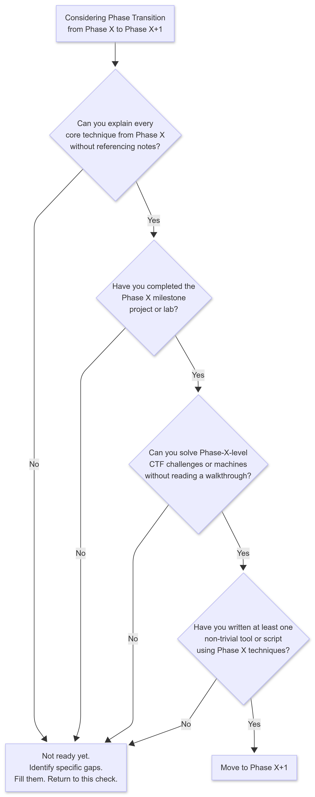
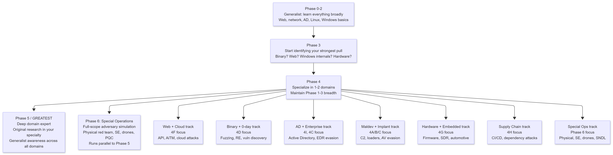
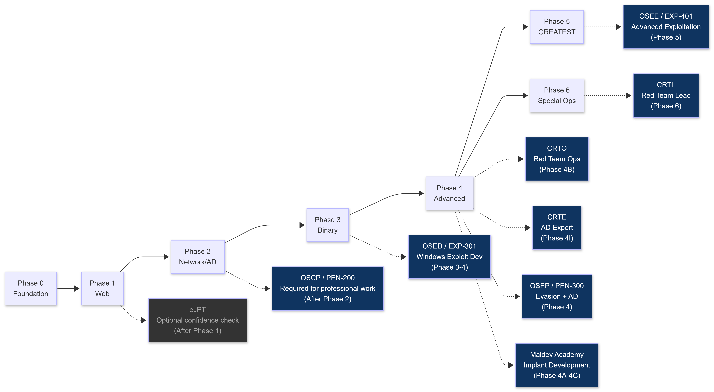
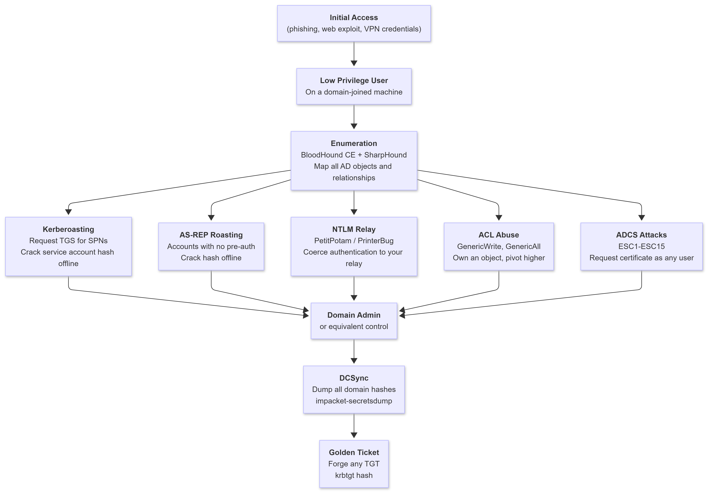

# FAQ

**Every question a beginner asks, and every question they should have asked but didn't.**

---

>**Companion Roadmap Documents:**
> * **[Master Curriculum (Phases -1 to 6)](../phases/PHASE_-1.md)**: Zero-to-elite offensive engineering syllabus from foundational metal to apex operations.
> * **[BlackHat Long-Term Survival Tactics](../black-bag/BlackHat_Long-Term_Survival_Tactics.md)**: The authoritative operational security, physical tradecraft, and digital persona architecture manual.
> * **[Philosophy: The BlackHat Mindset](Philosophy_The_BlackHat_Mindset.md)**: Cognitive doctrine, adversarial assumption hunting, and primitive thinking mental models.
> * **[MITRE ATT&CK Quick Reference](MITRE_ATT&CK_Quick_Reference.md)**: Enterprise, ICS, and ATLAS technique mapping, detection signals, and attack chain blueprints.
> * **[Tools Inventory](Tools_Inventory.md)**: Canonical, phase-aligned 300+ tool directory covering primitive-to-tool realization.
> * **[Resources Aggregated](Resources_Aggregated.md)**: Curated books, research whitepapers, conference talk archives, and hands-on platforms.
> * **[Lab Setup Guide](Lab_Setup_Guide.md)**: Multi-tier hardware specifications and isolated enterprise/kernel lab blueprints.
> * **[Final Word](Final_Word.md)**: Document verification statistics, researcher attributions, and horizon research roadmap.

---

## TABLE OF CONTENTS

1. [Getting Started](#part-1-getting-started)
2. [Hardware, OS, and Environment](#part-2-hardware-os-and-environment)
3. [Learning Path and Methodology](#part-3-learning-path-and-methodology)
4. [Certifications and Courses](#part-4-certifications-and-courses)
5. [Technical Questions](#part-5-technical-questions)
6. [AI, Tools, and the 2027 Landscape](#part-6-ai-tools-and-the-2027-landscape)
7. [Bug Bounty and Real-World Practice](#part-7-bug-bounty-and-real-world-practice)
8. [Mindset, Burn-Out, and Staying Operational](#part-8-mindset-burn-out-and-staying-operational)
9. [Authorization, OPSEC, and Legal Reality](#part-9-authorization-opsec-and-legal-reality)
10. [Questions Nobody Asks But Should](#part-10-questions-nobody-asks-but-should)
11. [2027 Special Operations and Horizons FAQ](#part-11-2027-special-operations-and-horizons-faq)

---

## PART 1: GETTING STARTED

---

**Q: Do I need a Computer Science degree?**

A: No. Self-taught operators reach GREATEST. Many of the best operators in the world have no formal degree. That said, a CS degree accelerates Phase 0 significantly because it builds the theoretical foundations -- algorithms, data structures, computer architecture, operating system theory -- that you will otherwise spend months teaching yourself. The degree does not give you operational skill. Practice gives you that. If you have a CS background, use it to compress Phase 0 and Phase 3 theory. If you don't, spend extra time on the fundamentals sections and accept that Phase 0 will take longer. Everything from Phase 1 forward is built entirely from practice, not from a classroom.

---

**Q: Where do I even start if I know absolutely nothing?**

A: In this order, with no skipping:

1. Learn to use Linux. Not Kali yet -- Ubuntu or any standard distro. Navigate the filesystem, use the terminal, write a basic bash script. Two weeks of daily use.
2. Learn Python basics. Variables, loops, functions, file I/O, making HTTP requests. Write ten small programs. Do not proceed until you can read Python code written by someone else and understand it line by line.
3. Read The C Programming Language by Kernighan and Ritchie. All of it. Do the exercises.
4. Set up a virtual machine lab (VirtualBox or VMware, both free). Get Kali Linux running as a VM.
5. Start Phase 0 of this roadmap.

If you are not willing to do those five steps in sequence, this roadmap is not for you yet. Come back when you are.

---

**Q: How old do I need to be to start?**

A: There is no minimum. Technical ability develops at any age. The constraint is patience, not youth. Some of the most capable operators started as teenagers. Others started in their thirties. The path takes 5 to 8 years of consistent effort regardless of when you begin. Start now.

---

**Q: Is this only for people who want to work in security professionally?**

A: No. The roadmap builds skills. What you do with those skills is your choice. Some people build careers in red team operations, penetration testing, or vulnerability research. Some build tools. Some compete in CTFs. Some do it because they want to understand how systems work at the deepest level. The roadmap does not assume a professional destination. It assumes curiosity and willingness to do hard work for years.

---

## PART 2: HARDWARE, OS, AND ENVIRONMENT

---

**Q: What laptop or computer do I need?**

A: Minimum and recommended specifications:

| Component | Minimum | Recommended | Phase 4+ |
|-----------|---------|-------------|---------|
| CPU | 4 cores, any modern i5 / Ryzen 5 | 8 cores, i7 / Ryzen 7 | 8+ cores with nested virtualization support |
| RAM | 8 GB (painful) | 16 GB (Phase 0-2 comfortable) | 32-64 GB for full AD lab |
| Storage | 256 GB SSD | 512 GB NVMe SSD | 1 TB+ NVMe |
| GPU | Not required | Not required | Not required for most tracks |

For Phase 0 through Phase 2, any modern laptop with 8 GB of RAM and an SSD runs Kali in a VM and connects to cloud labs (TryHackMe, HackTheBox). Phase 3 and beyond requires more RAM to run multiple VMs simultaneously. Do not wait for perfect hardware. Start with what you have. Upgrade when your lab requirements outgrow it.

---

**Q: Which Linux distribution should I use? Kali, Parrot, or something else?**

A: Start with Kali Linux 2024+. It is the industry standard, pre-loaded with the tools you will use, and has the most community support. When something breaks, the fix is one search away.

Comparison:

| Distro | Pros | Cons | Recommendation |
|--------|------|------|----------------|
| Kali Linux | Tools pre-installed, massive community, industry standard | Heavy, some bloat | Start here |
| Parrot OS | Lighter, privacy-focused, good for lower-RAM machines | Smaller community | Good alternative if RAM is tight |
| BlackArch | Enormous tool repository | Complex, not beginner-friendly | Phase 3+ only |
| Custom Ubuntu/Arch | Full control, understand every package | Significant setup time | Phase 4+ when you know what you need |

The reason operators eventually build custom environments is not because Kali is bad -- it is because at Phase 4 you want to know exactly what is installed and why. That understanding comes from using Kali first, learning what the tools are, and then making deliberate choices about your environment. Do not build a custom setup before you understand the defaults.

---

**Q: Virtual machines or real hardware for my lab?**

A: Virtual machines for almost everything. Real hardware for specific cases.

Use VMs for: all Phase 0 through Phase 3 work, web application testing, Active Directory labs, network exploitation, malware analysis (isolated VM), C2 framework practice.

Use real hardware for: kernel driver debugging when VM limitations matter, DMA attack research (Direct Memory Access requires physical PCIe slots), JTAG extraction and hardware teardown, SDR (Software-Defined Radio) work (USB SDR devices connected to physical host), wireless attack practice with real adapters.

The snapshot capability of VMs is critical for learning. You can break a machine completely, revert to a clean snapshot, and try again in 30 seconds. That feedback loop is what accelerates skill development. Real hardware does not offer this.

---

**Q: Which hypervisor should I use?**

A: Depends on your phase and host OS.

| Hypervisor | Cost | Platform | Best For |
|------------|------|----------|---------|
| VMware Workstation Pro | Free (personal use since 2024 Broadcom change) | Windows / Linux | Best performance, most stable. Current primary recommendation. |
| VirtualBox | Free | Windows / Linux / macOS | Good for beginners. Slightly lower performance than VMware. |
| Proxmox VE | Free | Bare metal Linux | Phase 4+ operators running full enterprise lab simulations. Web-based management. Handles 5-8+ concurrent VMs efficiently. |
| QEMU/KVM | Free | Linux only | Best raw performance on Linux hosts. More complex setup. |

Phase 4+ note: when you are running a Domain Controller, two workstations, a Kali attacker, an Ubuntu dev box, and a vulnerable target simultaneously, VMware and VirtualBox hit memory and CPU overhead limits. Proxmox on bare metal changes the efficiency of your lab dramatically. Consider the migration at Phase 3-4 transition.

---

**Q: Do I need a dedicated machine for my lab or can I use my main computer?**

A: You can start on your main machine with VMs. At Phase 4, consider a dedicated lab machine or bare-metal Proxmox install. The main risk of using your daily driver is accidental network misconfiguration -- your malware lab VM should never be able to reach your production network. Use VirtualBox or VMware's Host-Only or Internal network modes for all lab VMs. Your Kali attacker gets NAT for internet access; all targets get Internal network only.

---

**Q: What specialized hardware do I need for Phase 4G (Hardware/Embedded) and Phase 6 (Special Operations)?**

A: Beyond a virtualization host, specialized tracks require targeted physical equipment. Do not buy everything upfront; purchase gear only when entering the corresponding phase:

| Phase | Specialized Hardware Kit | Approximate Cost | Practical Purpose |
|---|---|---|---|
| **Phase 4G** | Raspberry Pi 4 / 5, USB-to-UART serial adapter (FTDI FT232RL), multimeter | ~$60-90 | Hardware console discovery, UART pinout identification, basic embedded reverse engineering |
| **Phase 4G** | JTAG/SWD Debugger (J-Link EDU Base / Tigard), SOIC8 test clip | ~$70-120 | EEPROM dumping, in-circuit firmware extraction, micro-controller memory inspection |
| **Phase 4G** | RTL-SDR v4 + HackRF One + Portapack H2 | ~$40-250 | Software-defined radio sniffing, signal replay attacks (sub-GHz, GPS, ADS-B, ISM band) |
| **Phase 4G** | CANable 2.0 (or Macchina M2) + OBD-II breakout cable | ~$40-80 | Automotive bus fuzzing, CAN packet injection, vehicle diagnostics exploitation |
| **Phase 6** | SouthOrd PXS-14 / Sparrows lockpick set, practice acrylic locks, bump keys | ~$45-75 | Mechanical pin tumbler picking, bypass tools, impressioning |
| **Phase 6** | Proxmark3 RDV4 (or Flipper Zero) | ~$170-300 | 125 kHz / 13.56 MHz RFID/NFC badge interrogation, replay, and brute-force simulation |
| **Phase 6** | Hak5 LAN Turtle, USB Rubber Ducky, WiFi Pineapple | ~$100-300 | Physical network implants, covert out-of-band reverse shells, rogue AP deployment |
| **Phase 6** | DJI Mini 4 Pro or commercial thermal drone (e.g., DJI Mavic 3T) | ~$800-4,500 | Aerial reconnaissance, physical perimeter inspection, thermal HVAC/server room mapping |

Start with low-cost components (serial adapters, RTL-SDR, basic lockpicks) before investing in dedicated RF or drone hardware. For detailed specifications and topologies, reference the [Lab Setup Guide](Lab_Setup_Guide.md).

---

## PART 3: LEARNING PATH AND METHODOLOGY

---

**Q: What is the correct programming language priority?**

A: C first, always.

| Priority | Language | Why | When You Need It |
|----------|----------|-----|-----------------|
| 1 | C | Memory management, pointers, stack and heap behavior are the foundation of exploitation. You cannot understand buffer overflows, use-after-free, or format string vulnerabilities without C. | Phase 0, Phase 3 |
| 2 | Python | Scripting, automation, pwntools for binary exploitation, custom tooling, rapid prototyping. | Phase 1 onward |
| 3 | x86-64 Assembly | Read it fluently. Write it for shellcode. You will be reading disassembly in IDA and Ghidra -- you must understand it. | Phase 3 |
| 4 | C++ | Windows implant development, driver development, custom C2 components. | Phase 4A-4E |
| 5 | PowerShell | Active Directory attacks, Windows post-exploitation, living-off-the-land scripting. | Phase 2-4I |
| 6 | Go or Rust | Production tool development. Go for C2 servers and tooling. Rust for performance-critical components. | Phase 4+ |
| 7 | Bash | Everything. Write it from day one, refine it forever. | Phase 0 onward |

Do not start with Go or Rust. Do not start with JavaScript. Do not start with C++ before C. The order matters because each language builds on the mental model from the one before it.

---

**Q: Windows or Linux focus?**

A: Both. You do not get to choose.

Corporate targets run Windows Active Directory. Most servers run Linux. Binaries you will analyze run on both. Implants you will write are Windows-primary. Exploitation environments and tooling are Linux-primary.

The sequence: start with Linux for Phase 0 through 2. You need Linux comfort before anything else because your attack platform is Linux, your scripting is Linux, and your binary exploitation environment is Linux. Add deep Windows knowledge in Phase 2 through Phase 4I. By Phase 4, your Windows internals depth should match your Linux depth.

macOS: add in Phase 4 if your targets include Apple platforms. macOS requires Phase 4E+ skills to attack meaningfully because of the TCC framework, SIP (System Integrity Protection), and Apple Silicon's PAC (Pointer Authentication Codes). Do not prioritize macOS over Windows at any point before Phase 4.

---

**Q: How long does it take to become dangerous?**

A: Depends heavily on your starting point. These timelines assume consistent effort of 20-30 hours per week:

| Starting Background | Phase 0 Complete | Phase 2 Complete | Phase 3 Complete | Phase 4 Depth | GREATEST |
|--------------------|-----------------|-----------------|-----------------|---------------|---------|
| Complete beginner (no code, no Linux) | 4-8 months | 18-30 months | 30-42 months | 48-72 months | 7-10 years |
| Some coding, no security | 2-4 months | 12-20 months | 24-36 months | 36-54 months | 5-8 years |
| CS graduate, no security | 1-2 months | 8-14 months | 18-28 months | 30-48 months | 4-7 years |
| Security adjacent (IT, sysadmin) | 1-3 months | 8-15 months | 20-30 months | 36-54 months | 5-8 years |

What "dangerous" means by phase:
- Phase 2 complete: You can compromise most unpatched or misconfigured enterprise networks given access. You are a real threat to organizations that have not invested in hardening.
- Phase 3 complete: You can exploit services, develop working exploits from advisories, and adapt when standard tools fail. You are dangerous to most organizations.
- Phase 4 depth: You are a threat to hardened environments with EDR, modern AD hardening, and a security team. You are in the top 5% of practitioners.
- Phase 5 / GREATEST: You discover new vulnerabilities. You build techniques others use. You are in the top 0.0001%. This requires years of Phase 4 residency and original research.

The timelines compress if you obsess. They expand if you are casual about it. There is no shortcut, but there is an accelerant: build something every single day. The gap between people who reach Phase 4 and people who stall at Phase 2 is almost entirely explained by whether they are building or just reading.

---

**Q: Do CTFs matter?**

A: Yes, through Phase 3. Required, not optional.

CTFs train precision. Every challenge has a defined solution and verifiable flag. You know when you have it and when you don't. Real-world environments give you no such feedback -- you can spend a week on a path that leads nowhere. CTFs build the problem-solving discipline and tool fluency you need before facing that ambiguity.

How to use CTFs correctly:
- Compete live when possible (CTFtime.org lists upcoming events)
- After the competition, read every write-up for challenges you couldn't solve. This is where most learning happens.
- At Phase 0-1: PicoCTF, TryHackMe CTF rooms
- At Phase 2: HackTheBox, TryHackMe hard rooms, basic CTF competitions
- At Phase 3: HackTheBox challenges, pwnable.kr, pwnable.tw, Google CTF
- At Phase 4: Flare-On (reverse engineering), high-difficulty CTF challenges, Pwn2Own adjacent research

After Phase 3, CTFs become a supplement rather than the primary training vehicle. Real-world complexity and ambiguity, which CTFs cannot replicate, becomes the primary training ground.

---

**Q: How do I know when I am ready to move to the next phase?**

A: Use this decision process before every phase transition:

<table><tr><td>

</td></tr></table>

The most common mistake is treating a phase as complete when you have read through it but not built anything with it. Reading is not the same as knowing. Knowing is demonstrated by building and breaking without assistance.

---

**Q: How do I document my learning?**

A: Documentation is not optional. It is the mechanism that converts experience into retrievable knowledge. Operators who do not write things down re-learn the same things repeatedly.

Recommended system:

- Keep a private technical wiki. Obsidian (free, offline, markdown-based) is the standard choice. Notion works if you prefer cloud-based. Plain markdown files in a git repository work fine.
- Write up every machine and challenge you solve, even if you never publish it. Include: the vulnerability, why it existed, the exploit chain, what tools you used, what failed before it worked, and what you would do differently.
- Keep a commands reference file. As you discover commands and flags that solve real problems, add them with context. "Why did I run this" is more valuable than "what does this flag do."
- Track your tool inventory. What you have installed, what it does, and when you last used it.
- Optional public blog. Writing for an audience forces clarity of thinking. If you can explain a technique clearly to someone who has never seen it, you understand it. The community rewards quality writeups with connections and opportunities.

---

**Q: How do I stay current with the field when it moves this fast?**

A: Sustainable current-awareness system, not information overload:

Daily (5-10 minutes): Check CISA advisories and NVD for critical CVEs. These arrive as email alerts -- subscribe at nvd.nist.gov.

Weekly (30-60 minutes): Read Tier 1 blogs (Project Zero, Trail of Bits, SpecterOps, PortSwigger Research). Subscribe to their RSS feeds. One good technical post per week is enough to stay ahead of most practitioners.

Monthly (2-4 hours): Watch DEF CON and Black Hat talks published in the previous month on YouTube. Read Mandiant M-Trends or CrowdStrike GTR when they publish annually.

Continuously: Compete in CTFs (CTFtime.org). Practice produces current awareness as a side effect because CTF challenges often reference recent techniques and CVEs.

Do not try to read everything. The field is too large. Depth in your specialty plus breadth awareness in adjacent areas is the sustainable pattern. Pick your specialization direction at Phase 3 and invest deeper there.

---

**Q: Should I specialize or stay generalist?**

A: Both, in sequence. Generalist first. Specialist second.

<table><tr><td>

</td></tr></table>

The operator who specializes too early becomes brittle. A rootkit developer who has never done a web engagement cannot pivot when a target's only accessible surface is a web application. A web tester who has never touched binary analysis cannot adapt when a CVE requires custom exploit development. Build the generalist foundation through Phase 3 without compromise.

---

**Q: What is the biggest mistake beginners make?**

A: Tool dependency without understanding. Running sqlmap without understanding SQL injection. Running Metasploit without understanding what the exploit does. Using BloodHound without understanding the AD paths it draws. Tools are accelerators for people who already understand the technique. They are a trap for people who use them as a substitute for understanding.

The sign you are making this mistake: when a tool fails or a target is not vulnerable to the standard tool chain, you have nothing to try next. The operator who understands the technique manually has infinite ways forward. The operator who only knows the tool has one.

Other major mistakes:
- Skipping phases because something in Phase 4 looks exciting
- Using cloud labs exclusively and never building a local lab (cloud labs reset, your local lab accumulates knowledge)
- Treating certification as the goal instead of skill as the goal
- Staying in "learning mode" (consuming content) instead of "building mode" (making things and breaking things)
- Not reading writeups after CTF challenges -- this is where most Phase 0-3 learning is lost

---

## PART 4: CERTIFICATIONS AND COURSES

---

**Q: Which certification should I get first?**

A: The correct certification timeline based on your phase:

<table><tr><td>

</td></tr></table>

Correct sequence: OSCP first (it is the entry-level professional gate), then CRTO or CRTE depending on your specialization direction (red team operations vs. AD depth), then OSED if you are going toward binary exploitation, then OSEP for hardened enterprise environments.

Do not take OSCP before Phase 2 completion. You will waste $1,499 on a course that requires skills you have not built. The course is not where you learn -- the course is where you validate.

---

**Q: Should I get CompTIA Security+ or eJPT before OSCP?**

A: Security+: No, if GREATEST is your goal. Security+ tests broad conceptual knowledge useful for corporate compliance roles. It does not build offensive skill. It does not accelerate your path to OSCP. If you need it for employment while building skills, get it. If you are on the pure technical development path, skip it.

eJPT (INE Junior Penetration Tester): Optional. It is a legitimate confidence check after Phase 1, costs under $200, and covers basic pentesting methodology. It does not substitute for OSCP and does not replace Phase 2 work. Take it if you want a milestone validation at Phase 1-2 transition. Skip it if you are comfortable with your own assessment of your Phase 1 completion.

The rule: Certifications test what you already know. Build the skill first. The cert follows. Never chase a cert to learn the skill.

---

**Q: Is the OSCP worth it?**

A: For professional penetration testing work, yes. It is the most recognized entry-level offensive security certification. Most corporate red team and pentesting positions list it as required or strongly preferred. The lab network and 24-hour hands-on exam are genuine skill validators -- this is not a multiple choice test.

For pure skill development as a GREATEST track operator, it is valuable but not the most efficient use of $1,499 in isolation. The CRTO and Maldev Academy courses provide higher density of current techniques per dollar. Take OSCP when: you have completed Phase 2, you are targeting professional employment, and you have the budget.

---

## PART 5: TECHNICAL QUESTIONS

---

**Q: How do I find vulnerabilities in real software?**

A: This is Phase 4D territory. The short answer:

Start with open source software because you have the source code. Code audit with grep and semgrep for known vulnerability patterns. Pair code audit with fuzzing: AFL++ is the standard fuzzer for binary targets. LibFuzzer for library-level targets. For web applications, Burp Suite's active scan combined with manual code review.

The full methodology:

1. Define the attack surface (what inputs can you control? what does the software parse?)
2. Static analysis: read the code looking for memory safety issues (C/C++), injection points (any language), deserialization (Java, Python, PHP), format string issues (C/C++)
3. Dynamic analysis: run the software with sanitizers enabled (AddressSanitizer, UndefinedBehaviorSanitizer), fuzz every input
4. Differential analysis: compare behavior between versions to understand what changed in security-relevant code paths

Move to closed source when your reverse engineering skills are strong enough to reconstruct program logic from assembly. Closed source fuzzing uses binary instrumentation (QEMU mode in AFL++, DynamoRIO, Intel PIN) instead of source-level instrumentation.

The practical starting point: download an open source project (SQLite, libpng, libxml2, or any C library that processes external input), build it with sanitizers, write a fuzzer harness, run AFL++, and read the crash output when it finds something. That loop -- fuzz, crash, triage, understand -- is the foundation of vulnerability research.

---

**Q: How does Active Directory exploitation work at a high level?**

A: Active Directory is the identity and access management system in most enterprise networks. Attacking it is Phase 2-4I depth, but the concept is simple: AD trusts Kerberos tickets for authentication. If you can forge, steal, or coerce those tickets, you move through the network as any user you choose.

<table><tr><td>

</td></tr></table>

The depth is in the details of each technique, but the concept is: find a misconfiguration or weak credential, use it to escalate, repeat until you control the domain.

---

**Q: What is the difference between red team, penetration test, and CTF?**

A: These are different activities that share some skills but have different goals, rules, and outputs.

| Activity | Goal | Rules of Engagement | Output | Timescale |
|----------|------|--------------------|---------|----|
| CTF | Capture a flag (solve a defined challenge) | Defined problem, clear solution exists | Score, skill development | Hours to days |
| Penetration test | Find and document vulnerabilities in a defined scope | Defined scope, rules of engagement, no disruption | Written report with findings and remediation | Days to weeks |
| Red team | Test detection and response capability | Minimal restrictions, black team does not know timeline | Report on detection gaps, response time, path to objective | Weeks to months |
| Bug bounty | Find real vulnerabilities in live systems within a defined program scope | Program-specific scope, responsible disclosure required | Monetary reward, CVE credit | Ongoing, self-directed |

For GREATEST development: CTFs build precision. Bug bounty builds web breadth and real-world patience. Penetration testing builds professionalism and report-writing. Red team builds operational thinking. You want experience across all four over the course of the roadmap.

---

**Q: What do I do when I am completely stuck?**

A: Stuck is a normal state. The response to it determines whether you improve or stall.

In order:

1. Walk away for at least 30 minutes. Make coffee. Go outside. Your subconscious continues working on the problem when you step away. Most breakthroughs happen in the 30 minutes after you stop staring.
2. Write out what you know. Force yourself to write every fact you have established: what the service is, what version, what you have tried, what the error messages say. Writing surfaces gaps you could not see while thinking.
3. Read the manual. Not a tutorial -- the actual documentation for the tool or protocol. Tutorials skip edge cases. Documentation does not.
4. Search for exactly the error message you are seeing. Not a paraphrase -- the exact string. Many problems have been solved by someone else whose exact error is indexed.
5. Try the adjacent thing. If port 80 is not responding to your payload, what about the API endpoint? If this injection point is sanitized, what about the export function?
6. After the CTF or challenge closes, read every writeup. Do not read writeups while the challenge is live unless you have spent at least 4-6 hours genuinely trying. The pain of being stuck is the learning.

If you are stuck on a concept rather than a specific challenge, step back one phase. The prerequisite you are missing is usually one level back from where the confusion starts.

---

**Q: How do I budget for this path?**

A: Approximate costs by phase (2026-2027 prices):

| Phase | Primary Cost | Monthly | Notes |
|-------|-------------|---------|-------|
| Phase 0-1 | TryHackMe subscription | ~$14/month | PortSwigger is free. Books from library or free PDFs. |
| Phase 2 | HackTheBox Pro | ~$14/month | OSCP at end: $1,499 one-time |
| Phase 3 | HackTheBox + books | ~$14-30/month | Books: Practical Binary Analysis (free PDF), Shellcoder's Handbook (~$50) |
| Phase 4 start | Sektor7 Maldev Essentials | ~$150 one-time | Best single investment at Phase 4 start |
| Phase 4A-4C | Maldev Academy | ~$500/year | Or Sektor7 courses: ~$350 total for both |
| Phase 4B | CRTO | ~$500 one-time | ZeroPointSecurity |
| Phase 4I | CRTE | ~$400 one-time | Altered Security |
| Phase 4+ | HTB Pro Labs | ~$490 per 3-month lab access | Offshore, RastaLabs |
| Phase 4+ certs | OSEP | ~$1,499 one-time | Take after OSCP |
| Phase 4+ certs | OSED | ~$1,499 one-time | Windows exploit dev track |
| Phase 5 | OSEE | ~$5,000 one-time | When you are ready for it |
| Lab hardware | One-time | $500-1,500 | Upgrade at Phase 3-4 transition |

Realistic 3-year total investment: $3,000 to $6,000 across everything. This sounds like a lot. Compare it to one semester of college tuition. The field pays well when you are competent enough to work in it.

---

## PART 6: AI, TOOLS, AND THE 2027 LANDSCAPE

---

**Q: Does traditional hacking still matter now that AI is everywhere?**

A: More than ever. AI systems run on the same infrastructure as everything else: servers with operating systems, web applications with APIs, network services with authentication layers. AI adds a completely new attack surface on top of the existing one, not instead of it. The Phase 0-4 curriculum in this roadmap applies to attacking AI infrastructure the same way it applies to attacking any other infrastructure.

What changes: the attack surfaces specific to AI systems (model inference endpoints, prompt injection vectors, training pipeline access, vector databases, model files themselves) require new techniques in addition to the existing ones. What does not change: the underlying host, the network, the authentication systems, and the application layer beneath the AI component are still the same systems you learn to attack in Phase 1 through 4.

---

**Q: Can I use AI to skip phases?**

A: No. You can use AI to accelerate every phase. Those are different things.

AI accelerates by: explaining concepts you are struggling with, debugging code you wrote, generating boilerplate, answering "how does this work" questions faster than documentation. These are all genuine accelerants.

AI does not replace: the experience of failing at something for six hours and then finally understanding why it failed. The muscle memory of having built a working exploit from scratch. The intuition that develops from examining a thousand error messages and learning what each one means. The ability to adapt when the tool chain fails and you have nothing to fall back on except your own understanding.

Blind AI-generated exploit code fails constantly in real environments. Real targets have non-standard configurations, patched versions, custom mitigations, and edge cases that no AI was trained on. The operator who understands the technique manually adapts in real time. The operator who copied the output cannot.

---

**Q: What is the highest-leverage skill to develop specifically for 2027?**

A: AI agent exploitation. The attack surface that is most underdefended and fastest growing.

Every major organization is deploying AI agents: systems that use an LLM to take actions (reading email, querying databases, writing code, browsing the web, making API calls) on behalf of users. These systems have a fundamental vulnerability: they cannot reliably distinguish between instructions from legitimate users and instructions embedded in external data the agent reads.

The attack pattern is called indirect prompt injection. You inject malicious instructions into content the agent will process (an email, a document, a web page, a database record, a code file). The agent reads it and executes your instructions as if they came from the authorized user. No vulnerability in the model required. No exploit code required. The attack surface is any external data the agent touches.

This attack class is at Phase 4F in the roadmap. Get there. The first operators who master agentic exploitation will have a significant window before defenses catch up.

---

**Q: How do I think about modern EDR evasion without tool dependency?**

A: Understand what EDR products are measuring. Modern EDR monitors:

- API call sequences and call stacks (who called VirtualAlloc, who called CreateRemoteThread, what is the call depth)
- Memory regions marked RWX (read-write-execute simultaneously)
- Known shellcode patterns via signature scanning and entropy analysis
- Behavioral sequences that match known attack patterns
- Network connections from unusual processes

Evasion at Phase 4C is not about finding a magic bypass. It is about understanding each detection mechanism and removing each observable. Direct syscalls bypass user-mode API hooks. Sleep obfuscation (Ekko, SilentMoonwalk, Cronos) hides the beacon in encrypted memory between callback intervals. Stack spoofing hides the implant from call stack analysis. BYOVD removes kernel-level protections. BOF (Beacon Object Files) execute without spawning a new process.

Each technique is a response to a specific detection capability. Know what you are evading before you try to evade it.

---

**Q: What is Store Now, Decrypt Later (SNDL) and Post-Quantum Cryptography (PQC) in 2027?**

A: SNDL is an active threat model where adversaries intercept and archive encrypted communications traffic today that they cannot currently decrypt, expecting that cryptanalytically relevant quantum computers (CRQCs) will break classical asymmetric keys (RSA, ECC, Diffie-Hellman) within 5 to 10 years.

In 2027, the operational focus shifts to the hybrid migration window:
- **Migration vulnerabilities:** Organizations transitioning from RSA/ECC to NIST PQC standards (ML-KEM/Kyber, ML-DSA/Dilithium) implement hybrid key-exchange mechanisms. Misconfigured cipher suites permit downgrade attacks forcing clients back to legacy algorithms.
- **Side-channel flaws:** Novel C and assembly implementations of lattice-based schemes frequently introduce timing side-channels and power analysis vulnerabilities during polynomial multiplication.
- **Operator OPSEC:** Operators must upgrade their own infrastructure (Tor, SSH, WireGuard, PGP) to hybrid or post-quantum safe ciphers to prevent their historical operational telemetry from future decryption. Phase 6 Section 3 provides the complete offensive audit and downgrade curriculum.

---

## PART 7: BUG BOUNTY AND REAL-WORLD PRACTICE

---

**Q: Is bug bounty a viable path to GREATEST?**

A: Partially viable, with a ceiling.

Bug bounty is excellent for: web application security depth, API security, recon methodology, learning to read JavaScript and identify client-side logic flaws, understanding real-world application architecture.

Bug bounty does not teach: C2 development, implant development, EDR evasion, Active Directory attacks, rootkit development, binary exploitation of compiled programs, kernel research.

The ceiling on bug bounty as a primary path is around Phase 2 depth in web tracks. Beyond that, bug bounty programs do not provide the attack surface for the techniques that define Phase 4 and beyond. Use bug bounty for Phase 1 and 2 practice, as a supplement to the roadmap, and as a source of income while building skills. Do not let it replace the full path.

The operators who successfully combine bug bounty with the full roadmap use it tactically: when you have completed a phase and want real-world practice before moving to the next one, a few weeks of focused bug hunting validates the skills and pays for the next course.

---

**Q: Where do I practice if I cannot afford a lab or subscriptions?**

A: Starting list of zero-cost resources:

- TryHackMe free tier: limited rooms, but enough for Phase 0-1
- HackTheBox free tier: access to retired machines (free after VIP hold period expires), some challenges
- PortSwigger Web Academy: completely free, no account required for labs
- pwn.college: completely free, ASU-backed binary exploitation curriculum
- VulnHub: free downloadable VMs. Run locally in VirtualBox
- PicoCTF: completely free
- CTF competitions: free to compete (CTFtime.org)
- VirtualBox: free. Kali Linux: free download. You can build a full Phase 0-2 lab for $0 in software costs
- Google Project Zero, Trail of Bits, SpecterOps blog: free to read

The only phase where free resources hit significant limits is Phase 4B (C2 operations), where CRTO and Maldev Academy are the primary learning paths and both cost money. By that point, you should have the skills to do bug bounty for supplemental income.

---

**Q: How do I practice offensive techniques without breaking the law?**

A: Three categories of authorized practice:

1. Your own lab: anything you own, you can attack. Build VMs and break them. No authorization required for systems you control.
2. Platforms designed for it: HackTheBox, TryHackMe, pwn.college, VulnHub, PortSwigger Web Academy. These are explicitly authorized practice environments.
3. Bug bounty programs with defined scope: read the scope carefully. In-scope systems are explicitly authorized. Out-of-scope means do not touch it, regardless of what you find.

No fourth category exists. Public networks, random websites, company systems you work at but are not authorized to test, your neighbor's Wi-Fi -- none of these are authorized practice environments regardless of your intent.

---

## PART 8: MINDSET, BURN-OUT, AND STAYING OPERATIONAL

---

**Q: How do I maintain motivation over a 5-8 year journey?**

A: You will not maintain continuous motivation. Motivation is not reliable over 5-8 years. Discipline and systems are.

What works for long-path development:

- Measure output, not time. "I will build something today" is a better commitment than "I will study for 2 hours today." Building produces evidence of progress. Time produces the illusion of progress.
- Set 90-day milestones instead of 5-year goals. A 5-year destination is too abstract to stay energized about. A 90-day milestone (complete Phase 2, get OSCP, finish Maldev Academy) is concrete and achievable.
- Build publicly when you can. A blog post, a GitHub repo, a writeup. Public commitment creates accountability. The community responds, which reinforces continuation.
- Track your own history. Re-read your own writeups from 6 months ago. The contrast between where you were and where you are is the most reliable motivational source available.
- Accept the slow periods. Every operator who has reached Phase 4 has had months where nothing clicked. The ones who reached Phase 5 are the ones who came back after those months.

---

**Q: What do I do when I hit burn-out?**

A: Take a break without guilt. Forcing through burn-out does not produce learning. It produces errors, frustration, and longer burn-out.

Practical burn-out response:

- Take 1-2 weeks completely away from the material. Not "I'll just do a little," -- complete stop.
- When you return, start with something small that you already know you can complete. A beginner challenge. A tool you have used before. A writeup of a machine you already solved. Rebuilding momentum from a small win is faster than trying to force yourself back into hard material.
- Switch areas. If you have been grinding binary exploitation for weeks, do some web. If you have been building an implant for a month, do some network practice. The technical skills are not isolated -- time in a different area often produces insights in the area you left.
- Build something creative. Not a challenge, not a course -- something you actually want to exist. A tool that solves a problem you have. A script that automates something annoying. Creative building is different in quality from grinding exercises.

---

**Q: What separates the 0.0001% from everyone else?**

A: Not knowledge. Not even skill. The refusal to accept incomplete understanding.

The 0.0001% operator does not stop at "the exploit works." They ask why it works, what assumptions the target made that allowed it to work, what would have to change for it to stop working, and what adjacent systems might have the same assumption. They then go find those adjacent systems.

When a tool fails, they do not try a different tool. They ask what the tool was trying to do and do it manually. When a technique is defended against, they understand the defense well enough to route around it. When they read a CVE advisory, they do not read the CVSS score -- they read the root cause and start thinking about what else has the same root cause.

The practical translation of this: build a habit of going one level deeper on every technique you learn. Understanding a buffer overflow is Phase 3. Understanding why the compiler did not protect against it, what mitigation would have stopped it, and whether the same pattern exists in the adjacent library is Phase 4. Discovering that pattern independently, before anyone has documented it, is Phase 5.

---

## PART 9: AUTHORIZATION, OPSEC, AND LEGAL REALITY

---

**Q: Where is the line between security research and criminal activity?**

A: Authorization. That is the entire answer, and it is not complicated.

Written, signed, explicit authorization from the owner of the system changes the legal status of every technique in this document. Without it, you are on the wrong side of computer fraud law regardless of your intent, your technical skill, or whether you found anything harmful.

Authorization means: a document, signed by someone with legal authority over the system, that explicitly authorizes you to test the defined scope, with defined start and end dates, and defined permitted techniques. Verbal authorization is not authorization. "They probably wouldn't mind" is not authorization. Working at a company does not authorize you to test their systems without a written scope.

Bug bounty program scope is explicit authorization for the assets listed in the program. Read the scope carefully. Out-of-scope means no.

This is not about ethics. It is about staying operational. Operators who get arrested do not reach Phase 5.

---

**Q: Can I practice techniques on systems I find on the internet without permission?**

A: No. Full stop.

"I found it open on Shodan" is not authorization. "It looks like a honeypot" is not authorization. "I'm just testing, not doing anything harmful" is not authorization. "It was already compromised when I found it" is not authorization.

Unauthorized access to computer systems is a criminal offense in essentially every jurisdiction that matters. The technical legality varies by country, but the practical reality is that activity against systems you do not own and have not been authorized to test can result in prosecution regardless of intent.

Your practice environments: your own VMs, authorized platforms (HTB, TryHackMe, pwn.college, VulnHub), and in-scope bug bounty targets. Nothing else.

---

**Q: What do I do if I accidentally find a real vulnerability in a system I was not targeting?**

A: Stop immediately. Document what you found and how you found it. Do not exploit further. Do not share the vulnerability before reporting.

Then:

1. Check if the organization has a bug bounty program (HackerOne, Bugcrowd) or a responsible disclosure policy (usually at security.company.com or in a security.txt file at the domain root).
2. If a program exists, report through the program. Include technical detail, reproduction steps, and the impact. Do not include working exploit code in the initial report -- offer to provide it after confirmation.
3. If no program exists: contact the organization directly at security@company.com or abuse@company.com. If you get no response within 2 weeks, CERT/CC (cert.org) can facilitate disclosure for organizations that are unresponsive.
4. Standard disclosure timeline: 90 days from initial report (the Google Project Zero standard). Disclose after 90 days regardless of whether the vulnerability has been fixed, unless there is an active exploitation concern where early disclosure would cause harm.

The above process protects you legally and builds the kind of reputation that leads to legitimate opportunities. Researchers who disclose responsibly get invited to private bug bounty programs, consulting work, and conference speaking slots. Researchers who weaponize what they find accidentally get prosecuted.

---

**Q: Why does Phase -1 (OPSEC) come before everything else in the roadmap?**

A: Because opsec failures are not recoverable the way technical failures are.

If you build a bad exploit at Phase 3, you learn, rebuild, and move forward. The failure is internal. If you make an opsec mistake at Phase 2 -- use your real IP for a scan, log into a platform from your home connection while doing something you should not be doing, leave metadata in a file -- the failure is external and permanent. Logs exist. Forensics finds things years later.

Phase -1 is first not because it is the most technically interesting phase (it is not) but because the habits you build at the start become the habits you keep. An operator who builds opsec hygiene from day one never has to retrofit it onto established workflows. An operator who skips it and adds it later always has gaps.

The minimum opsec posture for anyone doing serious lab work: separate identities for security research vs. personal life, VPN or Tor for anything leaving your lab network, no real personal identifiers in research accounts, understanding of what you are logging and where those logs go.

---

## PART 10: QUESTIONS NOBODY ASKS BUT SHOULD

---

**Q: How do I actually think like a threat actor instead of a script kiddie?**

A: A threat actor thinks about objectives first and techniques second. A script kiddie thinks about techniques first and never asks what they are trying to achieve.

Threat actor thinking pattern:

1. What is the objective? (credentials, data exfiltration, persistence, disruption)
2. What is the minimal path to that objective from my current position?
3. What is the detection risk of each step on that path?
4. What is my fallback if I am detected?
5. What does cleanup look like?

The technique choice is the last decision, not the first. Every technique in the roadmap exists to serve an objective. When you are practicing, practice with an objective in mind, not just "let's see what this tool finds."

---

**Q: Why do operators who understand defenses become better attackers?**

A: Because you are always trying to be invisible to something. If you do not know what that something detects, you cannot be invisible to it.

The best offensive operators have spent meaningful time on the defensive side. They know what Splunk alerts on. They know what EDR call stack analysis looks for. They know which AD events trigger SIEM rules and which ones are ignored. That knowledge shapes every tactical choice in an engagement: what to touch, what to avoid, how long to wait, how to clean up.

CyberDefenders (cyberdefenders.org) is in the platform list for this reason. Working through blue team scenarios teaches you what you leave behind. That knowledge becomes offensive skill when you use it to leave less behind.

---

**Q: When should I start building my own tools instead of using existing ones?**

A: When understanding requires it, not when ego demands it.

For Phase 0 through 2: use existing tools. The goal is to understand what they are doing, not to reinvent them. Run nmap, understand what each flag does and why, read the output, understand what the response means.

For Phase 3: start writing tool components. Write a port scanner from raw sockets in Python. Write a simple fuzzer. Write a basic shellcode injector. Not because nmap is bad -- because writing these things forces you to understand the protocol layer that nmap abstracts away.

For Phase 4: you will build custom tools because existing tools are detected. The moment you are doing serious implant development, C2 infrastructure, or EDR evasion, you are writing custom code because signatures have been written for everything else. This is not optional at Phase 4C.

The rule: use existing tools to learn the technique. Build custom tools when existing tools are insufficient for the objective or when building is the fastest path to understanding.

---

**Q: How do I build a reputation in the security community without compromising my identity?**

A: With a research pseudonym.

Create a separate identity for all security research: pseudonymous accounts on GitHub, Twitter/X, Mastodon, Discord. Use this identity consistently for research-related activity. Never link it to your real name in any searchable way.

Publish under this identity: writeups, tools, CVE credits, conference talks (if you choose to speak, you can use a handle at most conferences). The handle builds a reputation that is searchable and verifiable based on its own output.

The research community does not care about your real name. It cares about the quality of your output. A handle with three excellent public CVEs, well-written technique posts, and a notable CTF track record will attract more legitimate opportunities than a real name with no output.

When transitioning to professional work, you can link your pseudonymous output to your professional identity during a job application process under NDA. Most reputable employers in this field understand the opsec motivation.

---

## PART 11: 2027 SPECIAL OPERATIONS AND HORIZONS FAQ

---

**Q: How does Phase 6 (Special Operations) run in parallel with Phase 5 (GREATEST)?**

A: Phase 5 and Phase 6 represent two distinct pinnacles of offensive engineering:
- **Phase 5 (GREATEST)** is the apex vulnerability research and software capability tier: discovering original zero-days, authoring world-class offensive tooling, engineering hypervisor escapes, and defeating silicon-level mitigations.
- **Phase 6 (Special Operations)** is the apex adversary simulation and multi-domain execution tier: orchestrating physical covert entry, non-verbal social engineering, aerial drone reconnaissance, out-of-band hardware implants, quantum transition attacks (SNDL/PQC downgrade), and complex red team operations.

They branch concurrently from Phase 4 mastery. An operator may focus purely on Phase 5 as a dedicated exploit researcher or purely on Phase 6 as an elite red team lead. The rarest operators, the top 0.0001%, combine both: capable of picking a physical high-security lock to deploy an implant running their own custom kernel rootkit and 0-day exploit payload.

---

**Q: What is the difference between an exploit developer (Phase 4D/5) and a full-scope operator (Phase 6)?**

A: An exploit developer operates primarily in the digital and binary abstraction: disassemblers, debuggers, memory allocators, compilers, and fuzzer pools. Their measure of success is achieving reliable arbitrary execution or privilege escalation against hardened software targets.

A full-scope operator operates across physical, human, and multi-cloud environments. Their measure of success is achieving the strategic engagement objective (such as extracting intellectual property, demonstrating control over critical industrial controllers, or proving domain compromise) using whatever path offers the highest success probability and lowest detection exposure. If a facility has an unmonitored roof hatch or an employee susceptible to pretext vishing, the Phase 6 operator bypasses the entire multi-million-dollar EDR defensive perimeter without writing a single line of binary shellcode.

---

**Q: How should an operator prepare for the Post-Quantum Cryptography (PQC) transition in 2027?**

A: The transition to quantum-resilient algorithms (FIPS 203 ML-KEM, FIPS 204 ML-DSA, FIPS 205 SLH-DSA) is the largest cryptographic shift in internet history. To stay ahead:
1. **Understand hybrid key exchange:** Most enterprise deployments combine classical X25519/ECDH with ML-KEM-768. Identify fallback negotiation flaws that allow stripping quantum parameters.
2. **Audit implementation libraries:** Mathematical hardness does not prevent buffer overflows, side-channel leaks, or timing discrepancies in reference C implementations.
3. **Master Store Now, Decrypt Later (SNDL):** Archive high-value encrypted captures from long-lived certificates, state-sponsored communications, and critical infrastructure protocols.
4. **Harden your own persona:** Ensure all research persona communication channels (GrapheneOS, Tor, Signal, Haveno, SSH) enforce post-quantum hybrid handshakes.

---

**Q: How do physical security, covert entry, and drone recon integrate into cyber C2 operations?**

A: Modern enterprise defensive architectures enforce zero trust, strict external perimeter firewalls, and managed SOC monitoring that make remote initial access expensive and noisy. Physical red teaming and drone reconnaissance fundamentally compress the initial access attack surface:
- **Aerial drone recon:** High-resolution optical and thermal cameras map guard patrol patterns, physical access badges, badge reader models (Wiegand vs. OSDP), HVAC airflow exhaust, and rooftop entry points before boots touch the ground.
- **Physical covert entry:** Non-destructive entry (under-door tools, latch slips, REX sensor thermal bypasses, mechanical lock bumping) places the operator directly inside the physical security perimeter.
- **Hardware implant drops:** Plugging an out-of-band implant (LAN Turtle, Packet Squirrel, Raspberry Pi CM4) into an unmonitored VoIP phone port or printer switch provides an immediate, wired internal network pivot. The implant tunnels out over 4G/5G cellular, completely circumventing corporate edge firewalls, web proxies, and perimeter DLP telemetry.

---

**Q: How should an operator handle detection during an active red team engagement?**

A: Detection is not failure. Detection is operational telemetry.

In real engagements:
1. **Never panic:** Do not burn remaining infrastructure in a frantic scramble. Freeze activity on the flagged beacon or IP address immediately.
2. **Assess detection depth:** Was the binary signatured on disk, was the network callback IP blocked by firewall heuristics, or did EDR detect memory injection? A blocked IP requires rotating C2 listeners; an alerted endpoint requires falling back to dormant backup channels.
3. **Maintain compartmentalized C2 channels:** Always maintain at least three separate C2 channels: interactive (short sleep, operator commands), staging (medium sleep, file delivery), and long-haul (sleep measured in hours or days, completely isolated domains and protocols). If your interactive beacon is killed, your long-haul beacon remains active.
4. **Document everything:** Record the exact timestamp, process ID, command executed, and defensive reaction. In professional red teaming, a comprehensive timeline of what defenders detected and what they missed provides the primary value to the client.

---

**Q: How do you transition from executing known public techniques to discovering novel attack classes?**

A: By systematically cataloging and testing assumptions.

Every public offensive tool (mimikatz, BloodHound, PetitPotam, SilentMoonwalk) was born because an operator stopped asking "how do I run this tool" and started asking "what assumption does this system make that is not provably true?"
- **Look at boundaries:** Where two different systems, protocols, or privilege domains meet (such as browser renderer to IPC broker, Linux kernel to hypervisor, OAuth identity provider to backend API, or LLM agent to tool execution runtime), assumptions are always broken.
- **Analyze patches:** Do not just read CVE advisories. Diff the source code or binary patches of recent security updates. Vendors often fix the specific reported input while leaving the broader architectural assumption intact.
- **Tolerate extended dead ends:** Finding novel techniques requires spending weeks testing hypotheses that produce nothing. The willingness to sustain rigorous technical exploration through failure is the sole filter between an operator and a researcher.

---

*FAQ -- The BlackHAT Roadmap v0.2.0* 
*2027 Edition -- Comprehensive. No gaps. No outdated answers. No hedging.* 
*Author: Sagar Biswas*

---
