# BlackHAT Lab Setup Guide

**Author:** Sagar Biswas<br/>
**Version:** 1.0.0 · 2027 Edition<br/>

<div align="right">

**World-Class Operator Environment: 2027 Edition. From Zero Infrastructure to GREATEST-Grade Lab**

</div>

**Part of:** The BlackHAT Roadmap v0.0.0 (0 to GREATEST) | **Status:** Living document. Update as tools evolve.

>**Companion Roadmap Documents:**
> * **[Master Curriculum (Phases -1 to 6)](../phases/PHASE_-1.md)**: Zero-to-elite offensive engineering syllabus from foundational metal to apex operations.
> * **[BlackHat Long-Term Survival Tactics](../black-bag/BlackHat_Long-Term_Survival_Tactics.md)**: The authoritative operational security, physical tradecraft, and digital persona architecture manual.
> * **[Philosophy: The BlackHat Mindset](Philosophy_The_BlackHat_Mindset.md)**: Cognitive doctrine, adversarial assumption hunting, and primitive thinking mental models.
> * **[MITRE ATT&CK Quick Reference](MITRE_ATT&CK_Quick_Reference.md)**: Enterprise, ICS, and ATLAS technique mapping, detection signals, and attack chain blueprints.
> * **[Tools Inventory](Tools_Inventory.md)**: Canonical, phase-aligned 300+ tool directory covering primitive-to-tool realization.
> * **[Resources Aggregated](Resources_Aggregated.md)**: Curated books, research whitepapers, conference talk archives, and hands-on platforms.
> * **[FAQ](FAQ.md)**: Comprehensive operational and career transitions FAQ.
> * **[Final Word](Final_Word.md)**: Document verification statistics, researcher attributions, and horizon research roadmap.

---

## TABLE OF CONTENTS

1. [Overview and Philosophy](#1-overview-and-philosophy)
2. [Hardware Requirements](#2-hardware-requirements)
3. [Hypervisor Selection](#3-hypervisor-selection)
4. [Lab Network Architecture](#4-lab-network-architecture)
5. [Core VM Library](#5-core-vm-library)
6. [Attacker VM: Kali Linux 2024+](#6-attacker-vm-kali-linux-2024)
7. [Development VM: Ubuntu 22.04 LTS](#7-development-vm-ubuntu-2204-lts)
8. [Windows Target and Implant Dev VM](#8-windows-target-and-implant-dev-vm)
9. [Active Directory Lab: GOAD](#9-active-directory-lab-goad)
10. [Malware Analysis Environment](#10-malware-analysis-environment)
11. [Kernel Debugging Environment](#11-kernel-debugging-environment)
12. [Container Attack Lab](#12-container-attack-lab)
13. [Cloud Lab Alternative](#13-cloud-lab-alternative)
14. [OPSEC Layer: Whonix + Qubes](#14-opsec-layer-whonix--qubes)
15. [Detection Visibility Layer: DetectionLab](#15-detection-visibility-layer-detectionlab)
16. [ICS/SCADA Lab](#16-icsscada-lab)
17. [Hardware Hacking Lab](#17-hardware-hacking-lab)
18. [Vulnerability Research & Fuzzing Lab (Phase 5: GREATEST)](#18-vulnerability-research--fuzzing-lab-phase-5-greatest)
19. [Special Operations Lab: Physical, SE & Quantum (Phase 6)](#19-special-operations-lab-physical-se--quantum-phase-6)
20. [Snapshot Discipline](#20-snapshot-discipline)
21. [Phase-by-Phase Lab Evolution](#21-phase-by-phase-lab-evolution)
22. [Environment Verification Checklist](#22-environment-verification-checklist)
23. [Maintenance Schedule](#23-maintenance-schedule)

---

## 1. Overview and Philosophy

This guide builds a complete, isolated, modular lab that supports every phase of the BlackHAT Roadmap from first packet capture to kernel rootkit development, automated browser/kernel fuzzing, physical access control auditing, and post-quantum cryptographic research. The lab is not a collection of VMs. It is an architecture with intent: isolated networks that mirror real enterprise environments, layered analysis environments that mirror blue-team visibility, and progressive complexity that matches your phase of training.

**Core principles:**

- **Isolation is not optional.** Malware detonates in isolated VMs. Attack traffic never touches your personal network. OPSEC work lives behind Tor. One mistake on a live network is enough to destroy years of work.
- **Snapshots are your version control.** Before every experiment, snapshot. After every success, snapshot. Clean baseline is sacred.
- **The lab grows with you.** Phase 0 needs two VMs. Phase 4 needs twelve. Phase 5 and Phase 6 expand into dedicated high-throughput bare-metal fuzzing instances, physical access control test benches, and covert field implants. Build what you need for your current phase, add infrastructure as you advance.
- **Real is always better.** VMs for most work. Bare metal for kernel debugging (optional), high-throughput fuzzing with Intel PT (required for kAFL/Nyx), hardware hacking (required), and physical access benches (required).

**What this lab builds, fully provisioned:**

<div align="center">
<table><tr><td>

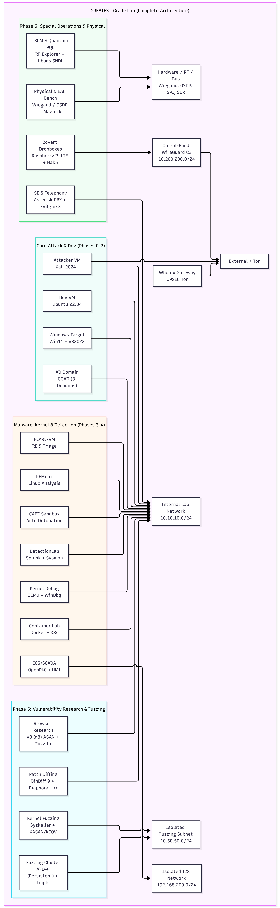

</td></tr></table>
</div>

---

## 2. Hardware Requirements

Three tiers. Start at Beginner, upgrade as you hit Phase 3.

### Tier 1: Beginner (Phase 0 to Phase 2)

```
CPU:     6-core minimum (Intel i5-10th gen / AMD Ryzen 5 5600)
RAM:     16 GB minimum (painful but functional)
Storage: 256 GB SSD (NVMe preferred)
GPU:     Integrated is fine
Network: Single NIC (onboard)
OS:      Any host OS (Windows or Linux)
```

**VM capacity at this tier:** 2 to 3 VMs simultaneously.
Running: Kali + Ubuntu + one target. Do not run the full AD lab at this tier.

### Tier 2: Intermediate (Phase 2 to Phase 3)

```
CPU:     8-12 core (Intel i7-12th gen / AMD Ryzen 7 5800X)
RAM:     32 GB (the real minimum for serious work)
Storage: 500 GB NVMe SSD primary + 1 TB HDD or SSD for VM storage
GPU:     Dedicated (hashcat: RTX 3060 minimum for password cracking)
Network: Dedicated NIC for lab traffic (PCIe, not USB)
OS:      Linux host preferred (bare metal for kernel work)
```

**VM capacity at this tier:** 4 to 6 VMs simultaneously.
Running: full AD lab (3-4 VMs) + Kali + Dev VM.

### Tier 3: Advanced Operator (Phase 4)

```
CPU:     16+ cores (AMD Ryzen 9 7950X or Threadripper / Intel i9-13900K)
RAM:     64 GB DDR5 minimum (128 GB ideal for full GOAD + sandbox + kernel work)
Storage: 2 TB NVMe (primary, PCIe 4.0) + 4 TB SSD (VM library)
GPU:     RTX 3090 or 4080 (hashcat + ML attack research)
Network: 2x NICs: one for external access, one for lab-only internal traffic
         Intel I225-V or similar (not Realtek: driver issues with monitor mode)
OS:      Linux host (Ubuntu 22.04 LTS or Arch Linux bare metal)
         OR Proxmox VE (type-1 hypervisor: see Section 3)
```

**VM capacity at this tier:** 10 to 14 VMs simultaneously.
Full lab: GOAD + attacker + dev + FLARE-VM + REMnux + CAPE + DetectionLab + kernel debug VMs.

### Tier 4: GREATEST Research & Special Ops (Phase 5 and Phase 6)

```
CPU:     24-32+ cores (AMD Threadripper 7000 / Ryzen 9 9950X or Intel Core i9-14900KS / Xeon)
         Bare-metal Linux host required for Intel PT / KVM hardware virtualization (kAFL, Nyx, Syzkaller)
RAM:     128 GB to 256 GB DDR5 (parallel V8 ASAN compilation + multi-instance VM fuzzing)
Storage: 4 TB NVMe Gen4/Gen5 (fast tmpfs / scratch disks for high IOPS fuzzing corpora) + 8 TB storage pool
GPU:     RTX 4090 / RTX 6000 Ada (AI attack surface, local LLM inference, GPU-accelerated side-channel analysis)
Network: Dual 10GbE / 2.5GbE NICs + dedicated isolated lab switch + hardware Wi-Fi / Bluetooth test interfaces
Special: Hardware kits for Phase 6 (Lockpicking sets, Proxmark3 RDV4, Flipper Zero, Hak5 gear, RF Explorer, NLJD)
```

**Capability at this tier:** Autonomous fuzzing clusters (Syzkaller/AFL++ running 24/7 on isolated cores), real-time browser JIT differential testing, bare-metal hardware/firmware reverse engineering, and live physical access control test benches.

> **Note on GPU:** For Phase 2 password attacks, a dedicated GPU is not negotiable. `hashcat` on CPU will take 10x to 100x longer. RTX 3060 cracks NTLM at ~42 GH/s. An integrated GPU will crack at under 1 GH/s.

---

## 3. Hypervisor Selection

### Comparison

<div align="center">
<table><tr><td>

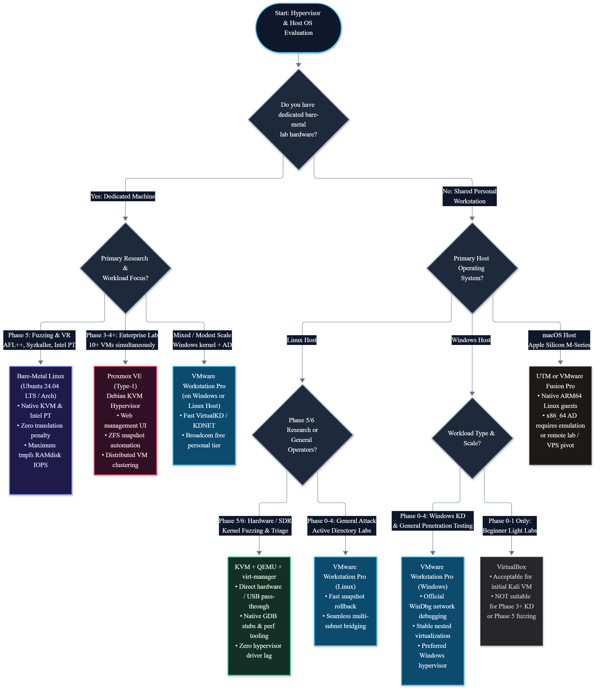

</td></tr></table>
</div>

### Option A: VMware Workstation Pro (Recommended for Most)

VMware Workstation Pro went **free for personal use in May 2024** after the Broadcom acquisition.

- Download: https://www.broadcom.com/products/software/vmware/workstation-pro (Broadcom portal, create a free account)
- Version: 17.x (current as of 2026/2027)
- Why VMware over VirtualBox for serious work:
  - Required for WinDbg kernel debugging over network (VirtualBox pipe debugger is significantly slower)
  - Better nested virtualization support (running VMs inside VMs: needed for some Phase 4 work)
  - More stable with USB pass-through for hardware hacking
  - Faster snapshot operations on large VMs

### Option B: Proxmox VE (GREATEST-Tier Lab Machine)

Proxmox is a free, open-source, enterprise-grade type-1 hypervisor. Install it on a dedicated bare-metal machine and manage everything through a web browser from any device.

```bash
# Download Proxmox VE ISO from: https://www.proxmox.com/proxmox-virtual-environment
# Flash to USB with Rufus or dd, install on bare metal
# After install, access web UI at: https://YOUR_PROXMOX_IP:8006

# Upload VM ISOs through web UI: Datacenter > Storage > ISO Images > Upload
# Create VMs: Create VM button, allocate cores/RAM/storage per VM

# Enable IOMMU for PCI passthrough (GPU/NIC pass to VMs):
# Edit /etc/default/grub: add intel_iommu=on or amd_iommu=on to GRUB_CMDLINE_LINUX_DEFAULT
update-grub && reboot

# Create VM template from a configured base VM (saves time for cloning):
# Right-click VM > Convert to Template
# Clone template for each new VM: Right-click > Clone > Full Clone
```

**Why Proxmox for GREATEST tier:**
- Manage all VMs from any machine via browser
- LXC containers for lightweight Linux environments (faster than full VMs)
- Snapshot and backup built-in with Proxmox Backup Server
- ZFS storage support for instant clones and atomic snapshots
- Network bridge and VLAN support for realistic multi-segment labs without physical switches

### Option C: VirtualBox (Phase 0 to Phase 2 Only)

Free, cross-platform, simple. Adequate for Phases 0 through 2.
**Do not use for:** Windows kernel debugging, nested virtualization, Phase 3+ kernel work.

Download: https://www.virtualbox.org

### Option D: KVM + virt-manager (Linux Power Users)

KVM is built into the Linux kernel. Near-native performance. Recommended for Linux hosts running Phase 3+ kernel research.

```bash
# Install KVM and virt-manager
sudo apt install -y qemu-kvm libvirt-daemon-system virt-manager bridge-utils
sudo usermod -aG libvirt,kvm $(whoami)

# Enable and start libvirt
sudo systemctl enable --now libvirtd

# Open GUI manager
virt-manager
```

### Option E: Bare-Metal Linux Host (Phase 5 & 6 Research Rig)

For Phase 5 high-throughput fuzzing (AFL++, Syzkaller, kAFL/Nyx) and Phase 6 anti-cheat/driver analysis, running inside a virtualized hypervisor introduces translation latency, hampers Intel Processor Trace (Intel PT) execution, and triggers aggressive anti-VM heuristics.

- **Host OS:** Ubuntu 24.04 LTS or Arch Linux running bare-metal on NVMe Gen4/Gen5
- **Key Advantages:**
  - Direct hardware access to CPU MSRs, performance counters, and Intel PT
  - Zero translation overhead for tmpfs RAMdisk execution (>10,000 exec/sec)
  - Native USB pass-through for hardware tooling (Proxmark3 RDV4, HackRF One, Bus Pirate)
  - Direct KVM hypervisor acceleration for Syzkaller guest VM orchestration

---

## 4. Lab Network Architecture

### Network Topology Overview

<div align="center">
<table><tr><td>

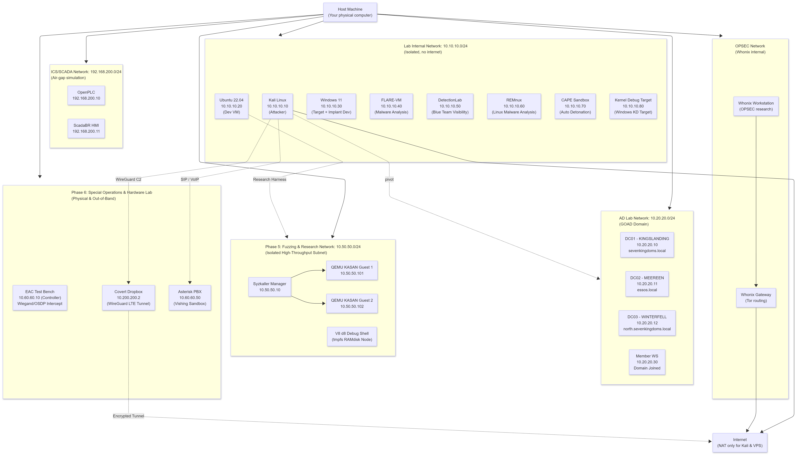

</td></tr></table>
</div>

### Network Setup: VMware Workstation

```bash
# In VMware Workstation:
# Edit > Virtual Network Editor

# Network 1: NAT (VMnet8) - attacker VM internet access ONLY
#   Subnet: 192.168.100.0/24 (default NAT)
#   Keep this as default NAT

# Network 2: Lab Internal (VMnet2)
#   Type: Host-only
#   Subnet: 10.10.10.0/24
#   DHCP: OFF (assign static IPs manually per VM)

# Network 3: AD Lab (VMnet3)
#   Type: Host-only
#   Subnet: 10.20.20.0/24
#   DHCP: OFF (GOAD will handle this)

# Network 4: ICS Network (VMnet4)
#   Type: Host-only
#   Subnet: 192.168.200.0/24
#   DHCP: OFF

# Network 5: Out-of-Band C2 & Implant Tunnel (WireGuard wg0 - Phase 6)
#   Type: Point-to-multipoint encrypted tunnel
#   Subnet: 10.200.200.0/24 (UDP 51820)
#   Endpoints: VPS Hub (10.200.200.1), Field Dropbox (10.200.200.2), Operator (10.200.200.10)

# Network 6: Syzkaller QEMU Fuzzing Isolation (VMnet5 or syz0 tap - Phase 5)
#   Type: Host-only / isolated tap bridge
#   Subnet: 10.0.2.0/24
#   DHCP: Managed by Syzkaller manager daemon

# Attacker VM (Kali) adapter config:
#   Adapter 1: VMnet8 (NAT) - for internet access and tool downloads
#   Adapter 2: VMnet2 (Lab Internal) - for attacking lab VMs
#   Adapter 3: VMnet3 (AD Lab) - for attacking GOAD
#   Adapter 4: wg0 (WireGuard) - for controlling covert dropboxes and cloud C2

# All other lab VMs:
#   Adapter 1: VMnet2 ONLY (no internet)
#   Exception: CAPE Sandbox needs NAT for sample submission to Malware Bazaar
#   Exception: Telephony PBX container binds to host for SIP (5060/udp) and RTP (10000-10050/udp)
```

### Network Setup: Proxmox

```bash
# In Proxmox web UI: Datacenter > Node > Network

# Create Linux Bridge for Lab Internal:
# Name: vmbr1
# IP: 10.10.10.1/24 (Proxmox host on the lab network)
# No gateway (isolated)

# Create Linux Bridge for AD Lab:
# Name: vmbr2
# IP: 10.20.20.1/24

# Create Linux Bridge for ICS:
# Name: vmbr3
# IP: 192.168.200.1/24

# Create Linux Bridge for Syzkaller Fuzzing Isolation (Phase 5):
# Name: vmbr4
# IP: 10.0.2.1/24

# Configure WireGuard Interface on Host or Cloud Redirector (Phase 6):
# wg0: 10.200.200.1/24 listening on UDP 51820

# Assign bridges to VMs in each VM's Network tab
# Kali gets both vmbr0 (internet) and vmbr1 (lab internal), plus wg0 client
# All others get only vmbr1 (or vmbr2 for AD VMs, vmbr3 for ICS)
```

---

## 5. Core VM Library

Complete VM inventory. Build in the order listed: each row's Phase column tells you when it becomes essential.

| VM Name | OS / Version | vCPU | RAM | Storage | Network | Phase |
|---|---|---|---|---|---|---|
| `kali-attacker` | Kali Linux 2024.x | 4 | 8 GB | 80 GB | NAT + Lab | 0 |
| `ubuntu-dev` | Ubuntu 22.04 LTS | 4 | 8 GB | 100 GB | Lab only | 0 |
| `win11-target` | Windows 11 23H2 | 4 | 8 GB | 100 GB | Lab + AD | 1 |
| `winserver-dc` | Windows Server 2022 | 4 | 8 GB | 80 GB | AD only | 2 |
| `ubuntu1804-old` | Ubuntu 18.04 LTS | 2 | 4 GB | 40 GB | Lab only | 2 |
| `debian-old` | Debian 10 Buster | 2 | 4 GB | 40 GB | Lab only | 3 |
| `flare-vm` | Windows 10 22H2 | 4 | 8 GB | 150 GB | Lab only (NO INTERNET) | 3 |
| `remnux` | REMnux 7.x | 2 | 4 GB | 60 GB | Lab only | 3 |
| `cape-sandbox` | Ubuntu 20.04 LTS | 4 | 8 GB | 100 GB | NAT + Lab | 3 |
| `win11-kdbg` | Windows 11 23H2 | 4 | 8 GB | 100 GB | Lab only | 3 |
| `detectionlab` | Auto-provisioned | 8 | 16 GB | 200 GB | Lab only | 3 |
| `whonix-gw` | Whonix Gateway | 1 | 512 MB | 20 GB | NAT + Whonix | -1 |
| `whonix-ws` | Whonix Workstation | 2 | 2 GB | 40 GB | Whonix only | -1 |
| `openplc-ics` | Ubuntu 20.04 | 2 | 2 GB | 40 GB | ICS only | 4 |
| `syzkaller-host` | Ubuntu 24.04 LTS (Bare-Metal / KVM) | 16 | 32 GB | 200 GB | Syzkaller Tap / QEMU | 5 |
| `v8-research` | Ubuntu 22.04 LTS | 8 | 32 GB | 150 GB | Lab only | 5 |
| `rpi-dropbox` | Raspberry Pi OS Lite 64-bit (Physical / QEMU) | 4 | 1 GB | 32 GB | Cellular + WireGuard (10.200.200.0/24) | 6 |
| `telephony-pbx` | Debian 12 / Docker (Asterisk) | 2 | 4 GB | 30 GB | Telephony Bridge (SIP/RTP) | 6 |
| `staging-vps` | Debian 12 (Hardened Cloud VPS) | 2 | 4 GB | 40 GB | Public WAN + WireGuard Hub | 6 |

**GOAD domains** run on `winserver-dc` (primary) plus 2 additional Server 2022 VMs cloned from the same base image.
**Phase 5 fuzzing systems** leverage dedicated bare-metal KVM acceleration and isolated RAMdisks for high-throughput mutation testing.
**Phase 6 systems** run across a hybrid topology of physical SBC hardware (Raspberry Pi Zero 2W / CM4), local dockerized PBX services, and an external cloud staging VPS.

---

## 6. Attacker VM: Kali Linux 2024+

### Download and Install

```bash
# Download: https://www.kali.org/get-kali/#kali-virtual-machines
# Pre-built VMware image available (saves 30 minutes vs ISO install)
# Always download the latest 2024.x release
# SHA256 verify before importing:
sha256sum kali-linux-2024.x-vmware-amd64.7z
# Compare against hash at: https://www.kali.org/get-kali/

# After import: expand disk to 80 GB
# In VMware: VM > Settings > Hard Disk > Expand
```

### First-Boot Hardening

```bash
# Update everything
sudo apt update && sudo apt full-upgrade -y

# Install kali-everything metapackage (adds all tools: warning, 50+ GB)
# OR install selectively by category (recommended):
sudo apt install -y kali-tools-exploitation kali-tools-post-exploitation \
    kali-tools-wireless kali-tools-web kali-tools-forensics \
    kali-tools-sniffing-spoofing kali-tools-passwords kali-tools-reporting

# Core tooling additions (not in default Kali)
sudo apt install -y \
    golang-go \
    rustc cargo \
    python3-pip python3-venv \
    tmux screen \
    proxychains4 \
    bloodhound neo4j \
    crackmapexec netexec

# Update BloodHound to latest
sudo pip3 install bloodhound --break-system-packages

# Golang tools
go install github.com/OJ/gobuster/v3@latest
go install github.com/projectdiscovery/subfinder/v2/cmd/subfinder@latest
go install github.com/projectdiscovery/nuclei/v3/cmd/nuclei@latest
go install github.com/projectdiscovery/httpx/cmd/httpx@latest

# Sliver C2 (latest)
curl https://sliver.sh/install | sudo bash

# Ligolo-ng (tunneling, replaces Metasploit's socks proxy for pivot work)
wget https://github.com/nicocha30/ligolo-ng/releases/latest/download/ligolo-ng_proxy_linux_amd64.tar.gz
tar -xf ligolo-ng_proxy_linux_amd64.tar.gz
sudo mv proxy /usr/local/bin/ligolo-proxy

# impacket suite (Python AD attack toolkit)
sudo pip3 install impacket --break-system-packages

# Certipy (ADCS attacks)
sudo pip3 install certipy-ad --break-system-packages

# NetExec (maintained CrackMapExec replacement)
sudo pip3 install netexec --break-system-packages

# evil-winrm
sudo gem install evil-winrm
```

### tmux Configuration

```bash
cat > ~/.tmux.conf << 'EOF'
# Split panes with | and -
bind | split-window -h
bind - split-window -v

# Mouse support
set -g mouse on

# Large scrollback buffer
set -g history-limit 50000

# Status bar: useful for long sessions
set -g status-right '#[fg=green]%H:%M %d-%b-%Y'

# Faster key repeat
set -s escape-time 0
EOF
```

### proxychains4 Configuration

```bash
# /etc/proxychains4.conf - configure for SOCKS5 tunneling through pivots
sudo tee /etc/proxychains4.conf << 'EOF'
strict_chain
proxy_dns
remote_dns_subnet 224
tcp_read_time_out 15000
tcp_connect_time_out 8000
[ProxyList]
socks5  127.0.0.1 1080
EOF
# Port 1080 is the default for Ligolo-ng and SSH -D tunnels
```

---

## 7. Development VM: Ubuntu 22.04 LTS

This VM is your primary build environment for exploit development, tool development, malware analysis scripts, and anything requiring a clean, stable Linux with known glibc (2.35).

### Base Installation

```bash
# Download: https://ubuntu.com/download/server (22.04.x LTS)
# Or use the desktop ISO: https://ubuntu.com/download/desktop
# Install: minimal install, then add packages

# Post-install: full update
sudo apt update && sudo apt full-upgrade -y

# Build essentials and core toolchain
sudo apt install -y \
    build-essential gcc g++ gdb git vim tmux \
    nasm yasm binutils binutils-aarch64-linux-gnu \
    make cmake ninja-build \
    strace ltrace \
    patchelf upx-ucl \
    checksec \
    file xxd hexdump strings binwalk

# Networking tools
sudo apt install -y \
    net-tools iproute2 iputils-ping \
    wireshark tshark tcpdump \
    nmap netcat-openbsd curl wget \
    dnsutils whois traceroute socat

# Emulation for ARM64/MIPS research
sudo apt install -y \
    qemu-user-static qemu-system-aarch64 qemu-system-x86 \
    gcc-aarch64-linux-gnu \
    gcc-mipsel-linux-gnu

# Rust toolchain (offensive Rust: Phase 4A)
curl --proto '=https' --tlsv1.2 -sSf https://sh.rustup.rs | sh
source ~/.cargo/env
# Install useful Rust crates for offensive dev:
# cargo add windows ntapi winapi (add to your project Cargo.toml)

# Go toolchain
sudo apt install -y golang-go
# Or get latest: https://go.dev/dl/

# Python packages for exploit development
pip3 install --break-system-packages \
    pwntools scapy cryptography \
    requests beautifulsoup4 \
    z3-solver ropgadget \
    angr cle      \
    frida-tools

# GDB Enhanced Features (GEF) - primary debugging UI
bash -c "$(curl -fsSL https://gef.blah.cat/sh)"

# Alternative: pwndbg (different aesthetic, equally powerful)
# git clone https://github.com/pwndbg/pwndbg && cd pwndbg && ./setup.sh

# Ghidra: NSA's free reverse engineering tool
sudo apt install -y openjdk-17-jdk
wget https://github.com/NationalSecurityAgency/ghidra/releases/latest/download/ghidra_*.zip
unzip ghidra_*.zip -d ~/tools/ghidra
echo "alias ghidra='~/tools/ghidra/ghidraRun'" >> ~/.bashrc

# radare2 (lightweight RE, good for scripting)
sudo apt install -y radare2
pip3 install r2pipe --break-system-packages

# AFL++ (fuzzing: Phase 4D)
sudo apt install -y afl++

# Valgrind (memory error detection: useful for vuln research)
sudo apt install -y valgrind

# Docker (for container attack lab: Section 12)
curl -fsSL https://get.docker.com | sh
sudo usermod -aG docker $(whoami)

# Verify glibc version (critical: note this, it affects exploit portability)
ldd --version | head -1
# Should output: ldd (Ubuntu GLIBC 2.35-0ubuntu3.x) 2.35
```

### pwntools Quick Reference

```python
from pwn import *

# Always set context at the top of every exploit
context.arch = 'amd64'      # or 'i386', 'arm', 'aarch64'
context.os = 'linux'
context.log_level = 'info'  # use 'debug' for verbose output

# Local process interaction
p = process('./vulnerable_binary')
p.sendline(b"input data")
output = p.recvline()
p.interactive()             # drop to interactive shell

# Remote interaction
r = remote('target.com', 1337)
r.sendline(b"payload")
r.recvuntil(b"$ ")

# Payload construction
payload  = b"A" * 64            # padding
payload += p64(0xdeadbeef)      # 8-byte little-endian address
payload += p64(0xcafebabe)

# Address packing/unpacking
p64(0x400080)           # pack 64-bit little-endian
p32(0xdeadbeef)         # pack 32-bit little-endian
u64(b"\x80\x00\x40\x00\x00\x00\x00\x00")  # unpack

# ELF analysis
elf = ELF('./binary')
elf.symbols['main']         # address of main()
elf.got['printf']           # GOT entry for printf (for GOT overwrite)
elf.plt['printf']           # PLT entry for printf (for ret2plt)
elf.bss()                   # start of .bss section

# ROP chain construction
rop = ROP(elf)
rop.call('puts', [elf.got['puts']])  # leak libc puts address
rop.call('main')                     # return to main for second stage
```

### Environment Verification

```bash
#!/usr/bin/env bash
# Run after setup to verify everything is functional

echo "=== Compiler Toolchain ==="
gcc --version | head -1
g++ --version | head -1
nasm --version | head -1
rustc --version
go version

echo "=== Python ==="
python3 --version
python3 -c "import pwn; print('[OK] pwntools', pwn.__version__)"
python3 -c "from scapy.all import IP; print('[OK] scapy')"
python3 -c "import angr; print('[OK] angr')"

echo "=== GDB ==="
gdb --version | head -1
gdb -batch -ex "gef version" 2>/dev/null | head -1

echo "=== Reverse Engineering ==="
ghidra --version 2>/dev/null || echo "Run ghidra manually from ~/tools/ghidra"
r2 --version | head -1
objdump --version | head -1

echo "=== glibc ==="
ldd --version | head -1

echo "=== ASLR State ==="
cat /proc/sys/kernel/randomize_va_space   # Should be 2 in normal mode

echo "=== Docker ==="
docker --version

echo "=== Java (Ghidra dependency) ==="
java --version

echo "=== Fuzzing ==="
afl-fuzz --help 2>&1 | head -2

echo "=== Done. ==="
```

---

## 8. Windows Target and Implant Dev VM

This VM serves two purposes: target for your attacks during Phases 1 through 3, and development environment for Windows implants and drivers in Phase 4.

### Base Setup

```powershell
# Download Windows 11 development VM (pre-built, 90-day evaluation):
# https://developer.microsoft.com/en-us/windows/downloads/virtual-machines/

# OR Windows 11 Enterprise evaluation (ISO):
# https://www.microsoft.com/en-us/evalcenter/evaluate-windows-11-enterprise

# After import/install: disable automatic updates (snapshots become useless with background updates)
# Settings > Windows Update > Advanced > Pause Updates (set to maximum)
```

### Windows Development Tools

```powershell
# Install Visual Studio 2022 Community (free)
# Download: https://visualstudio.microsoft.com/vs/community/
# Select workloads:
#   - Desktop development with C++
#   - Game development with C++ (contains Windows SDK components)
# Individual components to also check:
#   - Windows 10/11 SDK (latest)
#   - MSVC v143 toolset
#   - C++ CMake tools

# Install WinDbg Preview (kernel debugger)
winget install Microsoft.WinDbgPreview

# Install Sysinternals Suite
winget install Microsoft.Sysinternals

# x64dbg (user-mode Windows debugger)
# Download: https://x64dbg.com
# Install ScyllaHide plugin: https://github.com/x64dbg/ScyllaHide/releases

# PE analysis tools
# PE-bear: https://github.com/hasherezade/pe-bear/releases
# CFF Explorer: https://ntcore.com/?page_id=388
# Detect-It-Easy: https://github.com/horsicq/Detect-It-Easy

# Process Hacker 2 (now System Informer)
winget install SystemInformer.Unstable

# Install VirtualKD-Redux (speeds up WinDbg KD debugging 10x vs pipe transport)
# https://github.com/4d61726b/VirtualKD-Redux/releases
# Extract, run vminstall.exe (install the VMMON driver in the debuggee VM)
# Run vmmon64.exe in the debugger VM before starting WinDbg sessions

# Python for Windows (scripting, impacket-compatible)
winget install Python.Python.3.11

# git for Windows
winget install Git.Git

# Configure Windows Defender exclusions for lab work (prevents constant interference):
Add-MpPreference -ExclusionPath "C:\Tools", "C:\Users\$env:USERNAME\Desktop\Tools"
Add-MpPreference -ExclusionProcess "x64dbg.exe", "windbg.exe", "ida64.exe"
```

### Windows Security Feature Reference

```
Feature       | Status in Lab | Command to toggle
-----------   | ------------  | -----------------
Windows Defender (real-time) | Disable for implant dev | Set-MpPreference -DisableRealtimeMonitoring $true
SmartScreen   | Disable for lab | via Group Policy: Computer Config > Windows Settings > Security Settings
UAC           | Reduce for dev  | Set-ItemProperty HKLM:\SOFTWARE\Microsoft\Windows\CurrentVersion\Policies\System -Name EnableLUA -Value 0
ASLR          | Keep ON (test against it) | ForceRelocateImages default ON
DEP/NX        | Keep ON (test against it) | bcdedit /set nx AlwaysOn
Test Signing  | Enable for driver dev | bcdedit /set testsigning on (requires reboot)
Kernel Debug  | Enable for Phase 3 lab | see Section 11
HVCI/VBS      | Enable to test bypass | Virtualization-Based Security in Windows Security app
```

---

## 9. Active Directory Lab: GOAD

GOAD (Game of Active Directory) is the standard multi-domain AD lab for 2025 and beyond. It provisions 5 to 6 Windows Server VMs with pre-configured misconfigurations covering every attack in Phase 4I. Do not build AD manually when GOAD exists.

### GOAD Overview

<div align="center">
<table><tr><td>

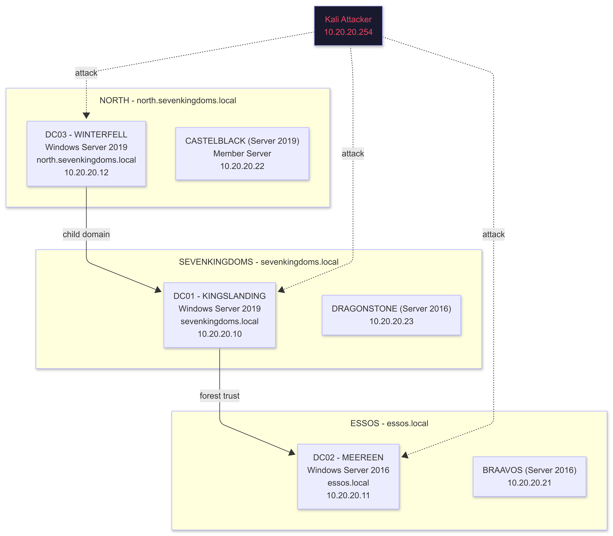

</td></tr></table>
</div>

### GOAD Installation

```bash
# Prerequisites: install on your HOST machine (Kali attacker or Ubuntu dev VM)
# GOAD uses Vagrant + VirtualBox/VMware to provision all VMs automatically

# Install Vagrant
wget -O- https://apt.releases.hashicorp.com/gpg | sudo gpg --dearmor -o /usr/share/keyrings/hashicorp-archive-keyring.gpg
echo "deb [signed-by=/usr/share/keyrings/hashicorp-archive-keyring.gpg] https://apt.releases.hashicorp.com $(lsb_release -cs) main" | sudo tee /etc/apt/sources.list.d/hashicorp.list
sudo apt update && sudo apt install -y vagrant

# Install Ansible (GOAD provisioner)
sudo apt install -y python3-pip
pip3 install ansible pywinrm --break-system-packages

# Clone GOAD
git clone https://github.com/Orange-Cyberdefense/GOAD.git
cd GOAD

# Install GOAD Python requirements
pip3 install -r requirements.txt --break-system-packages

# Check available lab configurations
./goad.sh -t check

# Deploy the GOAD lab (full 5-VM version: recommended)
# Provider: vmware (preferred) or virtualbox
./goad.sh -t install -l GOAD -p vmware -m local

# Lighter version: GOAD-Light (2 VMs, faster to deploy, less coverage)
./goad.sh -t install -l GOAD-Light -p vmware -m local

# Full GOAD deployment takes 1 to 2 hours on first run.
# Vagrant downloads Windows Server evaluation ISOs and Ansible configures each VM.

# After deployment, verify all VMs are running:
vagrant status

# SSH into any VM for admin access:
vagrant ssh DC01
```

### Manual AD Lab (Fallback if GOAD Hardware is Insufficient)

For Tier 1 hardware where GOAD's 5-VM requirement exceeds capacity, build a minimal 2-VM AD lab manually.

```powershell
# ---- On Windows Server 2022 VM (future DC01) ----

# Promote to Domain Controller
Install-WindowsFeature -Name AD-Domain-Services -IncludeManagementTools
Install-ADDSForest `
    -DomainName "lab.local" `
    -DomainNetbiosName "LAB" `
    -SafeModeAdministratorPassword (ConvertTo-SecureString "Lab@dm1n2027!" -AsPlainText -Force) `
    -InstallDns `
    -Force

# After reboot: populate with vulnerable objects
# (run these as Domain Admin after DC promotion)

# Create vulnerable service accounts (Kerberoastable)
New-ADUser -Name "svc_sql" -SamAccountName "svc_sql" -AccountPassword (ConvertTo-SecureString "Password123!" -AsPlainText -Force) -Enabled $true
Set-ADUser -Identity "svc_sql" -ServicePrincipalNames @{Add="MSSQLSvc/dc01.lab.local:1433"}

New-ADUser -Name "svc_backup" -SamAccountName "svc_backup" -AccountPassword (ConvertTo-SecureString "Backup2024" -AsPlainText -Force) -Enabled $true
Set-ADUser -Identity "svc_backup" -ServicePrincipalNames @{Add="BackupSvc/dc01.lab.local"}

# Create AS-REP roastable accounts (no Kerberos preauth required)
New-ADUser -Name "asrep_user" -SamAccountName "asrep_user" -AccountPassword (ConvertTo-SecureString "AsRep2024!" -AsPlainText -Force) -Enabled $true
Set-ADAccountControl -Identity "asrep_user" -DoesNotRequirePreAuth $true

# Create accounts with weak passwords (for password spraying)
$weakPasswords = @("Password1", "Summer2024!", "Welcome1", "Company123")
for ($i = 1; $i -le 4; $i++) {
    New-ADUser -Name "user$i" -SamAccountName "user$i" `
        -AccountPassword (ConvertTo-SecureString $weakPasswords[$i-1] -AsPlainText -Force) `
        -Enabled $true
}

# Configure unconstrained delegation (highly exploitable)
New-ADComputer -Name "WEB01" -AccountPassword (ConvertTo-SecureString "Web01Pass!" -AsPlainText -Force)
Set-ADComputer -Identity "WEB01" -TrustedForDelegation $true

# Configure ACL misconfiguration: give user1 GenericAll over svc_sql
$user1 = Get-ADUser "user1"
$svc_sql = Get-ADUser "svc_sql"
$acl = Get-Acl "AD:\$($svc_sql.DistinguishedName)"
$ace = New-Object System.DirectoryServices.ActiveDirectoryAccessRule(
    $user1.SID,
    "GenericAll",
    "Allow"
)
$acl.AddAccessRule($ace)
Set-Acl -AclObject $acl "AD:\$($svc_sql.DistinguishedName)"

# ---- On Windows 11 VM ----
# Join to lab.local domain
$domainCredential = Get-Credential LAB\Administrator
Add-Computer -DomainName "lab.local" -Credential $domainCredential -Restart

# ---- On Kali: Collect BloodHound data ----
# Download SharpHound collector to the Windows VM, run it:
# .\SharpHound.exe -c All --zipfilename bh_lab.zip
# Copy .zip to Kali, import into BloodHound

# Start BloodHound on Kali:
sudo neo4j start
bloodhound &
# Default creds: neo4j / neo4j (change on first login)
# Upload: drag the SharpHound .zip into BloodHound UI
```

---

## 10. Malware Analysis Environment

Three components work together. Each has a specific role.

<div align="center">
<table><tr><td>

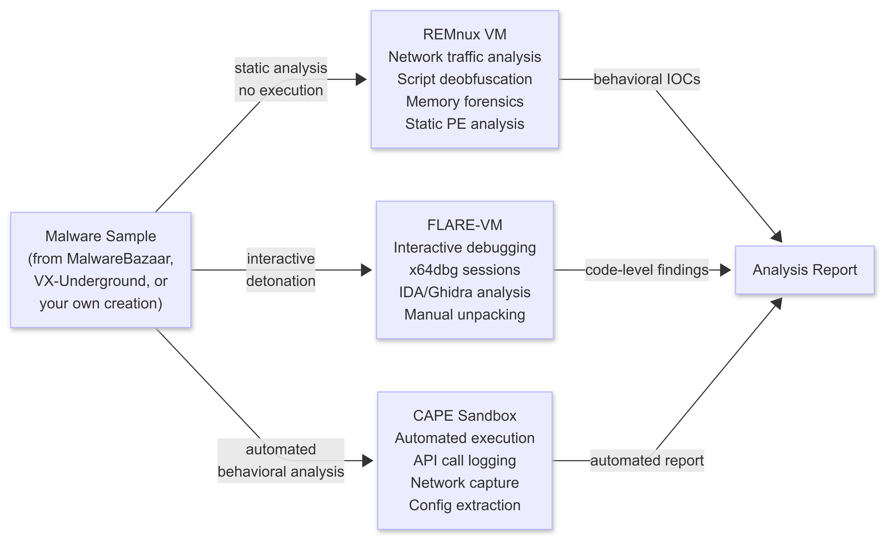

</td></tr></table>
</div>

### 10.1 FLARE-VM Setup

FLARE-VM is Mandiant's Windows malware analysis distribution. Run the installer in a fresh Windows 10 22H2 VM with internet access. **After install, disable internet and snapshot as your clean baseline.**

```powershell
# Requirements:
# - Windows 10 22H2 (NOT Windows 11: some tools have compatibility issues)
# - 8 GB RAM, 150 GB storage, 4 vCPUs
# - Fresh install, fully updated, then run installer
# - Disable Windows Defender BEFORE running (it will interfere)

# Step 1: Disable Windows Defender real-time protection
Set-MpPreference -DisableRealtimeMonitoring $true

# Step 2: Open PowerShell as Administrator

# Step 3: Set execution policy
Set-ExecutionPolicy Unrestricted -Force
$ErrorActionPreference = "Continue"

# Step 4: Download and run FLARE-VM installer
(New-Object net.webclient).DownloadFile(
    'https://raw.githubusercontent.com/mandiant/flare-vm/main/install.ps1',
    "$([Environment]::GetFolderPath('Desktop'))\install.ps1"
)
Unblock-File "$([Environment]::GetFolderPath('Desktop'))\install.ps1"
Set-ExecutionPolicy Unrestricted -Force

# Step 5: Run the installer (select tools interactively or use defaults)
.\install.ps1

# Installation takes 1 to 2 hours. Reboots several times automatically.
# After completion: snapshot as "FLARE-VM-CLEAN-BASELINE"
# Disconnect from internet: change network adapter to Lab-only or None
```

**What FLARE-VM installs (selected highlights):**

```
Reverse Engineering:     IDA Free, Ghidra, Binary Ninja demo, x64dbg, x32dbg, Cutter, radare2
                         Detect-It-Easy, PEiD, ExeinfoPE, PEview, CFF Explorer, PE-bear
Debugging:               x64dbg (primary), OllyDbg, WinDbg (via WDK)
Disassembly:             IDA Free, Ghidra, Binary Ninja demo, Cutter
Memory Analysis:         Volatility 3, Volatility 2
Network:                 Wireshark, FakeNet-NG, Inetsim, Burp Suite Community
Office/Macro:            oletools, ViperMonkey, oledump, olevba
.NET analysis:           dnSpyEx, dotPeek, de4dot
PDF analysis:            PDF-tools, Peepdf
Script analysis:         JStillery, JS Beautifier
Utilities:               7zip, HxD, Notepad++, Process Hacker, ProcMon, ProcDot, Regshot
```

### 10.2 REMnux Setup

REMnux is the Linux counterpart to FLARE-VM. Use it for network-level analysis, script deobfuscation, memory forensics, and examining malware that runs on Linux.

```bash
# Download REMnux OVA: https://remnux.org
# Import into VMware: File > Import Virtual Machine > select OVA
# Default credentials: remnux / malware

# After import: update REMnux
remnux upgrade

# Key tools pre-installed on REMnux (no setup needed):
# Network analysis: Wireshark, tcpdump, Zeek, NetworkMiner (via WINE), netcat
# Memory forensics: Volatility 3, Volatility 2, bulk_extractor
# Script analysis:  JStillery, PyCDC, box-js (JavaScript deobfuscation)
# PDF analysis:     pdf-parser, pdfid, peepdf, PDFStreamDumper
# Office macros:    oletools (olevba, oledump, mraptor), xlmdeobfuscator
# PE analysis:      readpe, pefile, peframe, pescanner
# String extraction: FLOSS (FireEye/Mandiant's enhanced strings tool)
# Sandbox utilities: inetsim (simulates internet services for malware)

# FakeNet-NG equivalent on Linux (intercept and log malware network calls):
sudo inetsim
# REMnux will now respond to DNS, HTTP, HTTPS, SMTP for any VM on its network
# Point malware VM's DNS to REMnux IP to capture all outbound traffic

# Configure REMnux as the fake internet for CAPE Sandbox:
# In CAPE Sandbox config: set the "resultserver" to REMnux IP
```

### 10.3 CAPE Sandbox Setup

CAPE is the maintained successor to Cuckoo Sandbox. It performs automated malware detonation: executes samples in a Windows VM, logs API calls, captures network traffic, and extracts malware configurations.

```bash
# CAPE setup on Ubuntu 20.04 VM (Ubuntu 22.04 has some dependency conflicts)
# VM requirements: 4 vCPU, 8 GB RAM, 100 GB storage
# This VM needs NAT access for initial setup, then reconfigure

# Install CAPE
git clone https://github.com/kevoreilly/CAPEv2
cd CAPEv2

# Run the installer script (installs all dependencies automatically)
sudo -E bash installer/cape2.sh base cape

# CAPE uses KVM under the hood to run the analysis VMs
# You need a clean Windows 7 or Windows 10 VM image as the "guest":
# Download Windows 10 22H2 evaluation ISO
# Install in KVM with: sudo virt-install --name win10 --ram 4096 --vcpus 2 \
#   --disk size=60 --cdrom /path/to/win10.iso --os-type windows

# Install CAPE agent in the Windows analysis VM:
# Copy CAPEv2/agent/agent.py to the Windows VM desktop
# Set it to run at startup: HKCU\Software\Microsoft\Windows\CurrentVersion\Run

# Start CAPE services
sudo systemctl start cape-rooter
sudo systemctl start cape-web
sudo systemctl start cape

# Access web interface: http://CAPE_VM_IP:8000
# Submit samples via web UI or API:
curl -F file=@malware_sample.exe http://10.10.10.70:8000/tasks/create/file/
```

---

## 11. Kernel Debugging Environment

**Two separate setups:** one for Linux kernel research (QEMU + GDB), one for Windows kernel research (WinDbg + VirtualKD-Redux).

### 11.1 Linux Kernel Debugging: QEMU + GDB

<div align="center">
<table><tr><td>

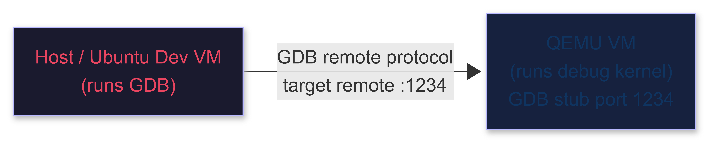

</td></tr></table>
</div>

```bash
# ---- Build a debug-enabled kernel ----
# (run on Ubuntu Dev VM or Kali)

sudo apt install -y git build-essential libncurses-dev bison flex libssl-dev libelf-dev

# Clone kernel source (use a known-vulnerable version for practice)
# Linux 5.15 LTS: widely used, many public CVE writeups available
wget https://cdn.kernel.org/pub/linux/kernel/v5.x/linux-5.15.tar.xz
tar -xf linux-5.15.tar.xz && cd linux-5.15

# Configure with debug options
make defconfig
scripts/config --enable  CONFIG_DEBUG_INFO
scripts/config --enable  CONFIG_DEBUG_INFO_DWARF5
scripts/config --enable  CONFIG_GDB_SCRIPTS
scripts/config --enable  CONFIG_KGDB
scripts/config --enable  CONFIG_KASAN
scripts/config --enable  CONFIG_KCOV         # coverage: needed for syzkaller
scripts/config --enable  CONFIG_FRAME_POINTER
scripts/config --disable CONFIG_RANDOMIZE_BASE  # disable KASLR for local debug only
scripts/config --disable CONFIG_STACKPROTECTOR
scripts/config --set-val CONFIG_SLAB y

make -j$(nproc)   # takes 10 to 30 minutes depending on hardware

# ---- Build a minimal rootfs with busybox ----
wget https://busybox.net/downloads/busybox-1.36.1.tar.bz2
tar -xf busybox-1.36.1.tar.bz2 && cd busybox-1.36.1

make defconfig
scripts/config --enable CONFIG_STATIC
make -j$(nproc) && make install

mkdir -p ../rootfs/{bin,sbin,etc,proc,sys,dev,tmp}
cp -a _install/* ../rootfs/

cat > ../rootfs/init << 'INITEOF'
#!/bin/sh
mount -t proc none /proc
mount -t sysfs none /sys
mount -t devtmpfs none /dev
mount -t tmpfs none /tmp
echo "Kernel: $(uname -r)"
echo "Hostname: $(hostname)"
setsid /bin/sh -c 'exec /bin/sh </dev/ttyS0 >/dev/ttyS0 2>&1'
INITEOF
chmod +x ../rootfs/init
(cd ../rootfs && find . | cpio -o --format=newc | gzip > ../rootfs.cpio.gz)

# ---- Launch QEMU with GDB stub ----
qemu-system-x86_64 \
    -kernel arch/x86/boot/bzImage \
    -initrd rootfs.cpio.gz \
    -append "console=ttyS0 nokaslr nopti nosmap nosmep oops=panic panic=1" \
    -nographic \
    -s -S \
    -m 512M \
    -enable-kvm
# -s: opens GDB server on :1234
# -S: pauses execution until GDB connects

# ---- Connect GDB (in a new terminal) ----
gdb vmlinux
(gdb) target remote :1234
(gdb) continue
# Ctrl+C to break, then:
(gdb) b commit_creds
(gdb) b prepare_kernel_cred
(gdb) info breakpoints
```

### 11.2 Windows Kernel Debugging: WinDbg + VirtualKD-Redux

<div align="center">
<table><tr><td>

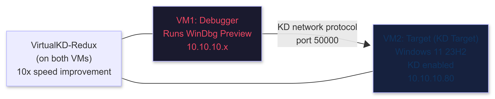

</td></tr></table>
</div>

```powershell
# ---- On the TARGET VM (win11-kdbg: 10.10.10.80) ----
# Run all commands as Administrator

# Enable kernel debugging over network
bcdedit /debug on
bcdedit /dbgsettings net hostip:10.10.10.X port:50000 key:1.2.3.4
# Replace 10.10.10.X with the IP of your debugger VM (or Kali)
# key can be any value: "1.2.3.4" is fine for lab use

# Enable test signing (required for loading unsigned drivers: HEVD etc.)
bcdedit /set testsigning on

# Disable kernel code integrity (for driver loading without signing)
bcdedit /set nointegritychecks on

# Optional: disable HVCI (Hypervisor-Protected Code Integrity) for driver research
# This requires disabling Virtualization-Based Security first:
# Settings > Windows Security > Device Security > Core Isolation > Memory Integrity > OFF

# Install VirtualKD-Redux on TARGET VM:
# Download: https://github.com/4d61726b/VirtualKD-Redux/releases
# Extract, run: vminstall.exe (installs vmmon driver)

# Reboot the target VM
Restart-Computer -Force
```

```powershell
# ---- On the DEBUGGER VM (or your host running WinDbg) ----

# Install WinDbg Preview (free)
winget install Microsoft.WinDbgPreview

# Install VirtualKD-Redux on DEBUGGER VM also:
# Run vmmon64.exe BEFORE starting WinDbg
# vmmon64 creates the VMware pipe that KD will attach to

# Configure symbol path (CRITICAL: without symbols WinDbg is nearly useless)
$env:_NT_SYMBOL_PATH = "srv*C:\Symbols*https://msdl.microsoft.com/download/symbols"
# Add this to your system environment variables permanently

# Connect WinDbg to the target:
# WinDbg Preview > File > Attach to Kernel > Net tab
#   Port: 50000
#   Key:  1.2.3.4
# Click OK and wait for connection (target VM must be running and rebooted after bcdedit)
```

```
Essential WinDbg Kernel Commands for Phase 3:

g                              -- continue execution
Ctrl+Break                     -- break into debugger

.reload /f                     -- force symbol reload (run after connecting)
lm                             -- list loaded modules with addresses
lm m HEVD                      -- show HEVD.sys base address
!analyze -v                    -- analyze current bugcheck/crash

dt nt!_EPROCESS                -- show EPROCESS structure layout
dt nt!_EPROCESS <addr>         -- inspect specific process at address
!process 0 0                   -- list all processes
!process 0 15                  -- list all processes with full details

-- TOKEN OFFSETS (Windows 11 23H2 build 22631):
-- ALWAYS verify with: dt nt!_EPROCESS (offsets change per build)
-- UniqueProcessId:    0x440
-- ActiveProcessLinks: 0x448
-- Token:              0x4B8

dd <addr>                      -- display DWORDs at address
dq <addr>                      -- display QWORDs at address
dq poi(<addr>)                 -- dereference pointer then display
u <addr>                       -- disassemble at address
u <addr> L20                   -- disassemble 20 instructions
bp nt!NtCreateFile             -- software breakpoint on kernel function
ba w8 <addr>                   -- hardware breakpoint on 8-byte write
be 1                           -- enable breakpoint 1
bd 1                           -- disable breakpoint 1

-- For token stealing exploit development:
r                              -- show all registers
r rax=0x0                      -- set register value
eb <addr> 90                   -- patch byte to NOP (0x90)

-- Pool and heap analysis:
!pool <addr>                   -- pool block info
!poolused                      -- pool usage by tag
!heap -s                       -- heap summary
```

```powershell
# Install HEVD (Hacksys Extreme Vulnerable Driver) for kernel exploit practice
# Download pre-built: https://github.com/hacksysteam/HackSysExtremeVulnerableDriver/releases
# Load the driver on the TARGET VM:
sc.exe create HEVD type=kernel binPath="C:\HEVD\HEVD.sys"
sc.exe start HEVD
# Verify: Device Manager > View > Show hidden devices > check for HEVD
# Now exploit it from the DEBUGGER side using Python/C exploit code
```

---

## 12. Container Attack Lab

Phase 4F covers Docker/Kubernetes escapes. Practice environment: isolated from your lab network during detonation.

```bash
# On Ubuntu Dev VM or Kali
# Docker is already installed (Section 7 setup)

# Pull intentionally vulnerable containers for practice
docker pull vulnerables/web-dvwa          # DVWA (web vulns)
docker pull metasploitable/metasploitable3
docker pull webgoat/goat-and-wolf         # OWASP WebGoat

# Launch a privileged container (the target for container escape)
docker run -it --privileged ubuntu:20.04 bash
# Inside this container: mount the host filesystem:
# mkdir /mnt/host && mount /dev/sda1 /mnt/host
# chroot /mnt/host  -> you are now root on the host

# Practice docker.sock escape:
docker run -it -v /var/run/docker.sock:/var/run/docker.sock ubuntu:20.04 bash
# Inside: apt install -y docker.io
# docker -H unix:///var/run/docker.sock run -it -v /:/host ubuntu:20.04 chroot /host

# Set up Kubernetes practice environment (local, via k3s: lightweight K8s)
curl -sfL https://get.k3s.io | sh -
# Verify cluster
kubectl get nodes
# Deploy vulnerable pod
kubectl apply -f https://raw.githubusercontent.com/BishopFox/badPods/main/manifests/everything-allowed/pod/everything-allowed-exec-pod.yaml

# Container security scanning (understand what defenders use)
docker run --rm -v /var/run/docker.sock:/var/run/docker.sock \
    aquasec/trivy image ubuntu:20.04

# grype (Anchore's vulnerability scanner: what blue teams run on your images)
curl -sSfL https://raw.githubusercontent.com/anchore/grype/main/install.sh | sh -s -- -b /usr/local/bin
grype ubuntu:20.04
```

---

## 13. Cloud Lab Alternative

For hardware at Tier 1, or for practicing cloud-specific attacks without spending money on cloud resources, use these free/low-cost alternatives.

### Free Practice Platforms

```
HackTheBox Pro Labs:
  Offshore    -- Full enterprise AD environment, multi-domain
  RastaLabs   -- AD focus with modern defenses (LAPS, Tier model)
  Cybernetics -- Advanced: full network with hardened targets
  Cost: ~$14/month for VIP access to labs

PwnTillDawn:
  https://www.pwntilldawn.com
  Free, AD environments available, lesser known

TryHackMe (beginner to Phase 2):
  https://tryhackme.com
  ~$14/month, guided, great for structured Phase 0 to 2 learning
```

### AWS Free Tier Lab

```bash
# AWS Free Tier: 750 hours/month of t2.micro (1 vCPU, 1 GB RAM) for 12 months
# Enough for: a minimal Kali VM or a target VM

# Install AWS CLI
curl "https://awscli.amazonaws.com/awscli-exe-linux-x86_64.zip" -o "awscliv2.zip"
unzip awscliv2.zip && sudo ./aws/install

# Configure credentials (create an IAM user in AWS console first)
aws configure

# Launch a Kali instance (free tier uses t2.micro: practice only, not for heavy work)
aws ec2 run-instances \
    --image-id ami-0123456789abcdef0 \   # Find current Kali AMI in AWS Marketplace
    --instance-type t2.micro \
    --key-name your-key-pair \
    --security-groups "lab-sg"

# For cloud attack practice specifically:
# Deploy intentionally misconfigured environments:
# CloudGoat (Rhino Security Labs): https://github.com/RhinoSecurityLabs/cloudgoat
pip3 install cloudgoat --break-system-packages
cloudgoat create vulnerable_lambda

# IAM Vulnerable (CloudFormation templates with IAM misconfigs):
# https://github.com/BishopFox/iam-vulnerable
```

---

## 14. OPSEC Layer: Whonix + Qubes

**For:** OPSEC research, anonymous reconnaissance, anything that must not trace back to your real IP.
**Not for:** Attack traffic against your own lab VMs (use the lab network directly for those).

### Whonix Setup

Whonix is a two-VM system: Gateway routes all traffic through Tor, Workstation does your work. Even if the Workstation VM is compromised by malware you are analyzing, your real IP cannot leak because the network is handled entirely by the Gateway.

```bash
# Download Whonix OVA (two files: Gateway and Workstation)
# https://www.whonix.org/wiki/VirtualBox

# Import Gateway first:
# VirtualBox: File > Import Appliance > select Whonix-Gateway-*.ova
# VirtualBox: File > Import Appliance > select Whonix-Workstation-*.ova

# OR for VMware: download .ova and import via File > Import Virtual Machine

# Network configuration (CRITICAL: must match exactly):
# Whonix-Gateway:
#   Adapter 1: NAT (for internet access via Tor)
#   Adapter 2: Internal Network, name: "Whonix"

# Whonix-Workstation:
#   Adapter 1: Internal Network, name: "Whonix"  -- same name as Gateway Adapter 2

# Start Gateway first, then Workstation
# Default credentials on both: user / changeme

# Update both VMs after first boot:
sudo apt update && sudo apt dist-upgrade -y
```

### Qubes OS (Maximum Compartmentalization)

Qubes runs each activity in a separate VM (called a "qube"). A compromised qube cannot access others. Browse in one qube, research in another, build tools in a third. If your research qube gets compromised by malware, your build qube and personal data are untouched.

Qubes is a full operating system replacement for your host machine: it IS the host.

```
Install: https://www.qubes-os.org/downloads/
Hardware requirements: 16 GB RAM minimum, 32 GB recommended
                       VT-x + VT-d (IOMMU) required: check BIOS settings
Recommended hardware:  Framework 13/16, Lenovo ThinkPad X1 Carbon (check HCL)
Hardware Compatibility List: https://www.qubes-os.org/hcl/

Qube setup for the BlackHAT operator:
  dom0:      host domain (never install anything here)
  sys-net:   handles network hardware (compartmentalized)
  sys-vpn:   routes all traffic through Mullvad VPN
  sys-whonix: routes through Tor (Qubes-Whonix integration)
  kali-qube:  attack tools (Fedora or Debian base + Kali tools installed)
  dev-qube:   development environment (Ubuntu 22.04 template)
  research:   internet-connected research (separate from dev)
  vault:      completely offline: passwords, keys, sensitive files
```

---

## 15. Detection Visibility Layer: DetectionLab

Understanding what defenders see when you attack is what separates operators from script kiddies. DetectionLab provisions a full Windows AD environment with Splunk, Sysmon (with the SwiftOnSecurity ruleset), Zeek, and Velociraptor pre-configured. Attack your own lab, then switch to the Splunk dashboard and watch how your attack appears in the logs. This is how you build undetectable tradecraft.

```bash
# DetectionLab requirements: 16 GB RAM, 4 vCPUs, 80 GB storage
# Best run on Tier 2 or Tier 3 hardware
# https://github.com/clong/DetectionLab

# Method 1: Vagrant (VMware or VirtualBox)
git clone https://github.com/clong/DetectionLab.git
cd DetectionLab/Vagrant

# Install Vagrant (if not already installed)
# Review Vagrantfile and adjust memory allocations if needed:
# Default: 8 GB per VM (logger + DC + WEF + win10): 32 GB total

vagrant up --provider=vmware_desktop
# OR:
vagrant up --provider=virtualbox

# Provisioning takes 1 to 2 hours (downloads Windows evaluation ISOs + installs tools)

# After provisioning: access services at:
# Splunk:        https://192.168.56.105:8000    (admin/changeme)
# Fleet/Kolide:  https://192.168.56.105:8412
# Velociraptor:  https://192.168.56.105:9999
# RDP to DC:     192.168.56.102  (vagrant/vagrant)
# RDP to Win10:  192.168.56.104  (vagrant/vagrant)
```

### Using DetectionLab for Tradecraft Development

<div align="center">
<table><tr><td>

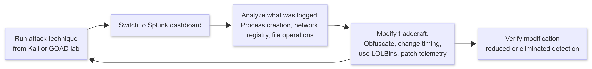

</td></tr></table>
</div>

```bash
# Example: run Mimikatz, see what Sysmon captures
# From Win10 VM (192.168.56.104):
# Download Mimikatz, run: sekurlsa::logonpasswords
# Switch to Splunk: index=main EventCode=4688 process_name=mimikatz*
# You will see: ProcessCreate events, CommandLine logged, ParentProcess chain

# Lesson: next iteration, run Mimikatz from reflective load (no disk touch)
# Compare logs: disk events disappear, process still visible
# Next: indirect syscalls to bypass ETW: no API logs
# This loop is how you build undetectable implants
```

---

## 16. ICS/SCADA Lab

Phase 4G covers ICS/SCADA attacks. This lab is optional until Phase 4G but worth setting up early.

### Topology

<div align="center">
<table><tr><td>

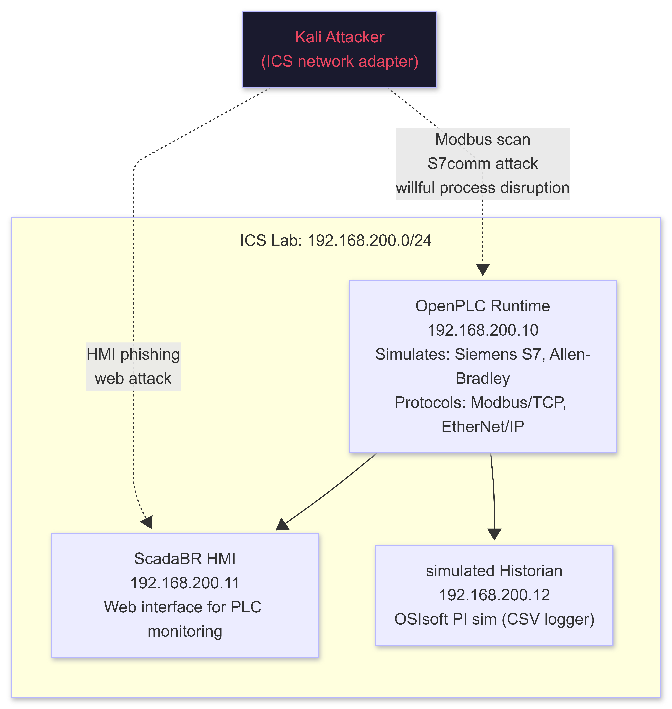

</td></tr></table>
</div>

### ICS Lab Setup

```bash
# OpenPLC Runtime (simulates a PLC, supports Modbus/TCP and EtherNet/IP)
# Run on Ubuntu 20.04 VM on the ICS network (192.168.200.10)

# Install OpenPLC
git clone https://github.com/thiagoralves/OpenPLC_v3.git
cd OpenPLC_v3
./install.sh linux

# Start OpenPLC Runtime
sudo ./start_openplc.sh

# Access web UI at: http://192.168.200.10:8080
# Default credentials: openplc / openplc
# Upload a simple PLC program (.st file) to simulate a real process

# Install ScadaBR (HMI) on a second VM (192.168.200.11)
sudo apt install -y default-jdk tomcat9
wget https://sourceforge.net/projects/scadabr/files/latest/download -O scadabr.zip
unzip scadabr.zip
sudo cp ScadaBR.war /var/lib/tomcat9/webapps/
sudo systemctl restart tomcat9
# Access: http://192.168.200.11:8080/ScadaBR

# Modbus attack tools on Kali (already installed or install via pip):
pip3 install pymodbus --break-system-packages

# Test Modbus connectivity to OpenPLC:
python3 -c "
from pymodbus.client import ModbusTcpClient
c = ModbusTcpClient('192.168.200.10', port=502)
c.connect()
# Read holding registers (process values)
result = c.read_holding_registers(0, 10)
print('Registers:', result.registers)
# Write to coil (turn off a process output)
c.write_coil(0, False)
print('Coil written: process output disabled')
c.close()
"

# Nmap ICS scanning (use Redpoint NSE scripts)
git clone https://github.com/digitalbond/Redpoint.git
nmap --script Redpoint/s7-info.nse -p 102 192.168.200.10    # Siemens S7
nmap --script Redpoint/enip-info.nse -p 44818 192.168.200.10 # EtherNet/IP
nmap --script Redpoint/modbus-discover.nse -p 502 192.168.200.10
```

---

## 17. Hardware Hacking Lab

Phase 4G also covers physical hardware: JTAG/SWD extraction, UART console access, chip glitching, RF attacks. This lab requires physical hardware. No VM can substitute.

### Hardware Inventory

```
Priority 1 (buy before Phase 4G):
  Flipper Zero ($200)           -- RFID 125kHz/13.56MHz, NFC, sub-GHz RF, IR, iButton
                                   https://flipperzero.one
                                   Firmware: keep updated, Unleashed or RogueMaster for extended frequency range
  Bus Pirate v4 ($40)           -- UART, SPI, I2C, 1-Wire protocol analyzer
                                   https://buspirate.com
  USB-to-UART adapter ($5)      -- CP2102 or CH340G: for UART console access on routers/IoT devices

Priority 2 (Phase 4G active):
  Proxmark3 RDV4 ($350)         -- Professional RFID research tool, NFC, cloning
                                   https://proxmark.com
  Logic Analyzer ($15-$40)      -- Saleae clone (8-channel): capture and decode SPI/I2C/UART
                                   Connect to Kali via USB, use PulseView (sigrok) to decode
  JLink EDU Mini ($20)          -- JTAG/SWD debugger for ARM microcontrollers
                                   https://www.segger.com/products/debug-probes/j-link/models/j-link-edu-mini/

Priority 3 (advanced hardware research):
  ChipWhisperer Lite ($300)     -- Side-channel analysis and voltage glitching for bypass
                                   https://rtfm.newae.com/Starter-Tools/ChipWhisperer-Lite/
  HackRF One ($300) + PortaPack  -- Software-Defined Radio (SDR): RF reconnaissance, replay attacks
                                   https://greatscottgadgets.com/hackrf/
  RFCat ($120)                  -- Sub-GHz transceiver: garage doors, car fobs, remote controls

Physical lab tools:
  Heat gun                      -- Chip removal from PCBs
  Soldering station             -- SPI/JTAG test point wiring
  Digital multimeter            -- Voltage, continuity, component testing
  USB power bank                -- Isolated power for target hardware during analysis
  Magnification loupe (10x)     -- Reading IC markings for chip identification
```

### Hardware Lab Workflow

<div align="center">
<table><tr><td>

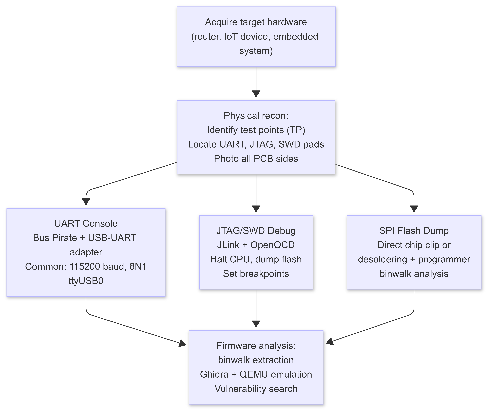

</td></tr></table>
</div>

```bash
# UART console access workflow
# Connect: Target TX -> Bus Pirate RX, Target RX -> Bus Pirate TX, GND -> GND

# Use minicom for UART console
sudo apt install -y minicom
sudo minicom -D /dev/ttyUSB0 -b 115200 -o

# Auto-detect baud rate if unknown:
# Use baudrate.py from Craig Heffner's uart-tools
python3 baudrate.py /dev/ttyUSB0

# Firmware extraction with binwalk
sudo apt install -y binwalk
binwalk -e firmware.bin             # extract all recognized filesystems
binwalk --dd=".*" firmware.bin      # extract everything (aggressive)
ls _firmware.bin.extracted/         # examine extracted files

# QEMU emulation of extracted firmware (for ARM routers)
sudo apt install -y qemu-user-static
chroot _firmware.bin.extracted/squashfs-root qemu-arm-static /bin/sh
# You are now running the router's shell on your machine
```

---

## 18. Vulnerability Research & Fuzzing Lab (Phase 5: GREATEST)

Phase 5 transitions from using tools against known targets to discovering original vulnerabilities in system-critical software. A standard penetration testing or malware analysis lab is inadequate for this tier: modern fuzzing and vulnerability research requires massive CPU throughput, kernel-level coverage instrumentation, dedicated RAMdisks, and deterministic debugging harnesses.

<div align="center">
<table><tr><td>


</td></tr></table>
</div>

---

### 18.1 High-Throughput AFL++ Fuzzing Rig

Fuzzing creates immense disk I/O as test cases mutate thousands of times per second. Running fuzzers directly against SSDs will degrade drive endurance and bottleneck execution speed. A proper fuzzing setup runs on RAMdisks (`tmpfs`) with dedicated CPU pinning.

```bash
# 1. Prepare dedicated RAMdisk for input/output queues
sudo mkdir -p /mnt/ramdisk
sudo mount -t tmpfs -o size=16G tmpfs /mnt/ramdisk
mkdir -p /mnt/ramdisk/in /mnt/ramdisk/out

# 2. CPU configuration: disable scaling governor for maximum performance
echo performance | sudo tee /sys/devices/system/cpu/cpu*/cpufreq/scaling_governor

# 3. System core dump and crash notification tuning
sudo sh -c 'echo core > /proc/sys/kernel/core_pattern'
sudo sh -c 'echo 0 > /proc/sys/kernel/randomize_va_space' # For deterministic reproduction only

# 4. Install AFL++ with full LLVM/Clang LTO support
sudo apt update && sudo apt install -y build-essential clang llvm lld libglib2.0-dev libpixman-1-dev
git clone https://github.com/AFLplusplus/AFLplusplus ~/AFLplusplus
cd ~/AFLplusplus
make distrib
sudo make install
```

#### Persistent Mode Harness Template

Persistent mode (`__AFL_LOOP`) avoids `fork()` overhead by fuzzing the target API function in an in-memory loop. This provides a 10x to 100x speedup over standard forkserver execution:

```c
#include <stdint.h>
#include <stdlib.h>
#include <unistd.h>
#include <string.h>

// Simulated target parsing function
int target_parser(const uint8_t *data, size_t size);

__AFL_FUZZ_INIT();

int main(int argc, char **argv) {
    #ifdef __AFL_HAVE_MANUAL_CONTROL
    __AFL_INIT();
    #endif

    unsigned char *buf = __AFL_FUZZ_TESTCASE_BUF;

    // Loop 100,000 times before recycling process to clean state
    while (__AFL_LOOP(100000)) {
        size_t len = __AFL_FUZZ_TESTCASE_LEN;
        if (len < 4) continue;
        target_parser(buf, len);
    }

    return 0;
}
```

```bash
# Compile with LLVM mode and AddressSanitizer (ASAN)
afl-clang-lto -O2 -fsanitize=address,undefined harness.c -o /mnt/ramdisk/harness

# Seed the corpus with minimal valid input
echo "INIT" > /mnt/ramdisk/in/seed1.bin

# Run parallel fuzzing across pinned CPU cores:
# Main master instance on Core 0:
taskset -c 0 afl-fuzz -M main -i /mnt/ramdisk/in -o /mnt/ramdisk/out -- /mnt/ramdisk/harness
# Secondary slave instance on Core 1:
taskset -c 1 afl-fuzz -S slave1 -i /mnt/ramdisk/in -o /mnt/ramdisk/out -- /mnt/ramdisk/harness
```

---

### 18.2 Syzkaller Linux Kernel Fuzzing Lab

Syzkaller is Google's coverage-guided kernel fuzzer. It uses declarative syscall descriptions (`sys/`) and QEMU virtual machines instrumented with KCOV and KASAN.

```bash
# 1. Install prerequisites
sudo apt install -y make gcc flex bison libelf-dev libssl-dev qemu-system-x86

# 2. Build Linux Kernel with KASAN, KCOV, and Debug Symbols
git clone --depth 1 https://git.kernel.org/pub/scm/linux/kernel/git/torvalds/linux.git ~/linux-syz
cd ~/linux-syz
make defconfig
make kvm_guest.config

# Enable required kernel instrumentation flags in .config:
scripts/config -e CONFIG_KCOV
scripts/config -e CONFIG_KASAN
scripts/config -e CONFIG_KASAN_INLINE
scripts/config -e CONFIG_CONFIGFS_FS
scripts/config -e CONFIG_SECURITYFS
scripts/config -e CONFIG_DEBUG_INFO_DWARF5
scripts/config -d CONFIG_RANDOMIZE_BASE

make -j$(nproc) bzImage

# 3. Create minimal Debian root filesystem image using Syzkaller script
mkdir -p ~/syzkaller-lab/image && cd ~/syzkaller-lab/image
git clone https://github.com/google/syzkaller.git ~/syzkaller
sudo ~/syzkaller/tools/create-image.sh -d bullseye

# 4. Build Syzkaller binaries (requires Go 1.22+)
cd ~/syzkaller
make
```

#### Syzkaller Manager Configuration (`my.cfg`)

```json
{
    "target": "linux/amd64",
    "http": "127.0.0.1:56741",
    "workdir": "/home/user/syzkaller-lab/workdir",
    "kernel_obj": "/home/user/linux-syz",
    "image": "/home/user/syzkaller-lab/image/bullseye.img",
    "sshkey": "/home/user/syzkaller-lab/image/bullseye.id_rsa",
    "syzkaller": "/home/user/syzkaller",
    "procs": 8,
    "type": "qemu",
    "vm": {
        "count": 4,
        "kernel": "/home/user/linux-syz/arch/x86/boot/bzImage",
        "cpu": 2,
        "mem": 2048
    }
}
```

```bash
# Start Syzkaller manager
~/syzkaller/bin/syz-manager -config=my.cfg
# Open browser at http://127.0.0.1:56741 to observe real-time crash reports and coverage growth
```

---

### 18.3 Browser Engine & JIT Research Environment

Browser exploitation focuses on optimizing JIT compilers (V8 TurboFan/Maglev, JavaScriptCore DFG/FTL). Research requires compiling debug shells with internal debugging flags enabled.

```bash
# 1. Install Google depot_tools
git clone https://chromium.googlesource.com/chromium/tools/depot_tools.git ~/depot_tools
export PATH="$HOME/depot_tools:$PATH"
echo 'export PATH="$HOME/depot_tools:$PATH"' >> ~/.bashrc

# 2. Fetch and build V8 debug shell (d8)
mkdir -p ~/v8-research && cd ~/v8-research
fetch v8
cd v8

# Build 64-bit debug build with AddressSanitizer
tools/dev/gm.py x64.debug.asan

# 3. Test JIT engine internals with d8
# Run with optimization tracking flags:
./out/x64.debug.asan/d8 --allow-natives-syntax --trace-opt --trace-deopt test_poc.js
```

---

### 18.4 Patch Diffing & Deterministic Debugging Station

Discovering 1-day vulnerabilities before patches are widely deployed is the fastest way to understand real-world exploit primitives.

```bash
# Patch Diffing Tooling
# 1. BinDiff 9 (Google/Zynamics): Install standalone and configure as Ghidra/IDA plugin
# https://github.com/google/bindiff/releases

# 2. Diaphora: Open-source diffing plugin for Ghidra and IDA Pro
git clone https://github.com/joxeankoret/diaphora.git ~/diaphora

# Deterministic Record and Replay Debugging (rr)
# Record non-deterministic race conditions and heap corruptions once, replay infinitely:
sudo apt install -y rr

# Enable performance counters for rr:
sudo sh -c 'echo 1 > /proc/sys/kernel/perf_event_paranoid'

# Record execution of target binary:
rr record /path/to/vulnerable_binary exploit_input.bin

# Replay under GDB with full reverse execution:
rr replay
# Inside GDB:
# (rr) reverse-continue  # Run backwards to memory allocation
# (rr) reverse-stepi     # Step backwards by single instruction
# (rr) watch *0x7fffffffe000  # Set watchpoint and run reverse-continue to find who overwrote memory
```

---

## 19. Special Operations Lab: Physical, SE & Quantum (Phase 6)

Phase 6 operates in physical spaces, human interactions, and advanced cryptographic frontiers. The lab environment moves beyond virtual machines onto physical test benches, RF test chambers, and hardware interception setups.

---

### 19.1 Physical Red Team & Covert Entry Workbench

A dedicated physical security testing bench allows hands-on practice with commercial locking mechanisms, cylinder repinning, and mechanical bypass tools without damaging property.

```
PHYSICAL BENCH COMPONENTS:
1. Lock Stands & Mounts:
   - 2x Heavy tabletop lock mounting brackets (aluminum or steel)
   - Cutaway practice locks (standard pin tumbler, spool pin, serrated pin)
   - Commercial mortise cylinders (Schlage SC1/SC4, Kwikset KW1, Yale 8-pin)
   - High-security cylinders (Medeco Biaxial, Mul-T-Lock Interactive, ASSA Abloy)

2. Key Impressioning Station:
   - Precision jeweler's bench vise with rubber jaw protectors
   - Swiss pattern #4 cut pippin file
   - 10x illuminated optical loupe
   - Brass key blanks (100x SC1, 100x KW1)

3. Door Bypass Test Rig:
   - Freestanding wooden door simulator jig with adjustable jamb gap (1/8 inch to 1/2 inch)
   - Fitted with commercial commercial lever handle (interior) and keyway (exterior)
   - Deadlatching spring bolt to practice shimming and shove knife manipulation
   - Under-Door Tool (UDT) practice clearance gap (3/8 inch undercut)
```

```bash
# Practical Pinning Practice
# Repin cylinders with increasing difficulty:
# Level 1: 3 standard pins
# Level 2: 5 standard pins
# Level 3: 4 standard pins + 2 spool pins (false set identification)
# Level 4: 2 standard pins + 2 spools + 2 serrated pins (counter-rotation practice)
```

---

### 19.2 Electronic Access Control (EAC) Test Rig

Electronic access control systems run on two primary protocols: legacy Wiegand and modern OSDP (RS-485). A test bench lets you sniff badge traffic, replay credentials, and audit controller fail-safe states.

<div align="center">
<table><tr><td>

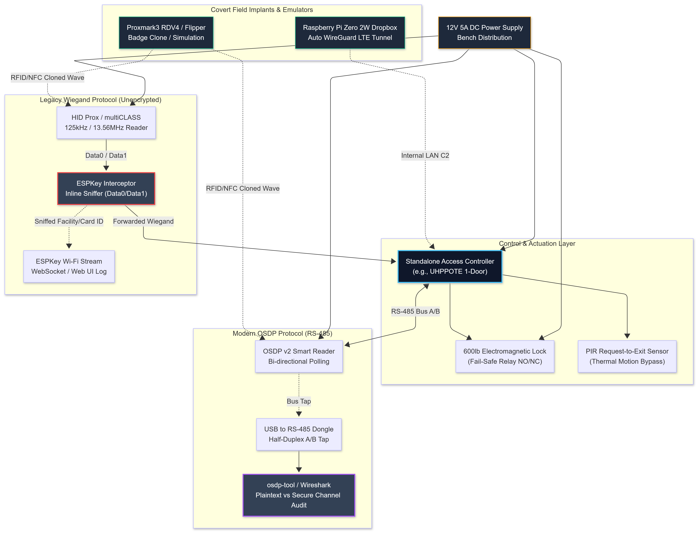

</td></tr></table>
</div>

```bash
# 1. Proxmark3 RDV4 Setup with Iceman Firmware
sudo apt install -y p7zip git build-essential libreadline5 libreadline-dev libusb-0.1-4 libusb-dev libqt5core5a libqt5gui5 libqt5widgets5
git clone https://github.com/RfidResearchGroup/proxmark3.git ~/proxmark3
cd ~/proxmark3
make clean && make all
sudo make install

# Launch Proxmark3 client:
proxmark3 /dev/ttyACM0

# Proxmark3 Quick Reference:
# [usb] pm3 --> lf search             # Auto-detect low frequency (125kHz) badge
# [usb] pm3 --> lf hid clone -w H10301 --fc 100 --cn 1337   # Clone HID Prox card
# [usb] pm3 --> hf search             # Auto-detect high frequency (13.56MHz) badge
# [usb] pm3 --> hf mf autopwn         # Crack MIFARE Classic keys and dump memory

# 2. OSDP Protocol Auditing
git clone https://github.com/ezforever/osdp-tool.git ~/osdp-tool
cd ~/osdp-tool && make
# Capture and parse raw RS-485 OSDP communication between reader and controller:
sudo ./osdp-tool -d /dev/ttyUSB1 -b 9600 -p
```

---

### 19.3 Covert Hardware Implants & Field Dropboxes

Field operations require unattended network implants capable of surviving power cuts, establishing encrypted out-of-band reverse tunnels, and operating silently inside corporate LANs.

<div align="center">
<table><tr><td>

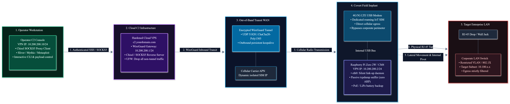

</td></tr></table>
</div>

```bash
# Raspberry Pi Zero 2W / CM4 Stealth Dropbox Configuration
# 1. Base OS: Raspberry Pi OS Lite (64-bit) configured headless
# 2. Install WireGuard for encrypted out-of-band C2 back to VPS
sudo apt install -y wireguard resolvconf

# /etc/wireguard/wg0.conf on Dropbox:
cat << 'EOF' | sudo tee /etc/wireguard/wg0.conf
[Interface]
PrivateKey = <DROPBOX_PRIVATE_KEY>
Address = 10.200.200.2/24
DNS = 1.1.1.1

[Peer]
PublicKey = <VPS_SERVER_PUBLIC_KEY>
Endpoint = c2.yourdomain.com:51820
AllowedIPs = 10.200.200.0/24
PersistentKeepalive = 25
EOF

sudo systemctl enable wg-quick@wg0

# 3. Automated link-up reconnaissance daemon
# Triggers internal enumeration silently whenever Ethernet cable is attached:
cat << 'EOF' | sudo tee /usr/local/bin/on-link-up.sh
#!/bin/bash
INTERFACE="eth0"
LOG="/var/log/net-recon.log"

if ip link show $INTERFACE | grep -q "state UP"; then
    echo "[*] Link active on $INTERFACE at $(date)" >> $LOG
    # Passive network listening for 60 seconds (zero packet injection)
    tcpdump -i $INTERFACE -c 100 -nn "arp or port 53 or port 67 or port 137" -w /tmp/passive.pcap &
fi
EOF
sudo chmod +x /usr/local/bin/on-link-up.sh
```

---

### 19.4 Social Engineering & Telephony Staging Lab

Testing organizational human factors requires isolated telephony infrastructure capable of controlled caller ID assignment and realistic acoustic staging.

<div align="center">
<table><tr><td>

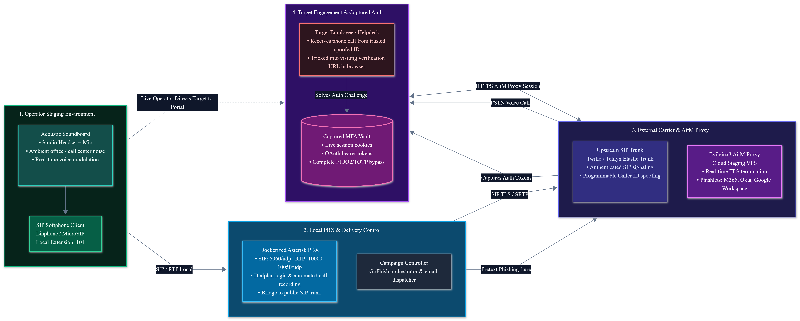

</td></tr></table>
</div>

```bash
# Dockerized Asterisk PBX for Controlled Vishing Simulations
docker run -d --name asterisk-lab \
  -p 5060:5060/udp \
  -p 10000-10050:10000-10050/udp \
  andrius/asterisk

# Configure SIP softphone (Linphone or MicroSIP) to connect to local Asterisk instance
# Staging VPS: Deploy GoPhish + Evilginx3 with automated SSL certificates
git clone https://github.com/kgretzky/evilginx2 ~/evilginx2
cd ~/evilginx2 && make
sudo ./bin/evilginx -p /path/to/phishlets
```

---

### 19.5 Technical Surveillance Countermeasures (TSCM) Test Chamber

To understand how to hide physical devices, you must understand how defensive sweeps detect them. Set up a controlled RF and optical testing space.

```
TSCM LAB EQUIPMENT STACK:
1. RF Spectrum Analysis:
   - RF Explorer 6G Combo (15MHz to 6.1GHz handheld sweep tool)
   - HackRF One + PortaPack H2 running Mayhem firmware (waterfall display, capture & replay)
   - Kismet running on Linux laptop with ALFA AWUS036ACH Wi-Fi adapter

2. Non-Linear Junction Detector (NLJD) Target Testing:
   - Test bed with unpowered silicon ICs, disabled microcontrollers, and copper traces
   - Observe 2nd harmonic return (semiconductor signature) vs 3rd harmonic (corroded metal junction)

3. Optical Lens & Thermal Inspection:
   - SpyFinder PRO or optical retro-reflection LED strobe
   - InfiRay P2 Pro or FLIR ONE smartphone thermal camera (identifies heat plumes in walls/sockets)
```

```bash
# RF Spectrum Baseline Recording
# Sweep frequency bands to establish background baseline before testing bug implants:
# Scan 2.4 GHz ISM band:
hackrf_sweep -f 2400:2500 -w 1000000 > baseline_24ghz.csv

# Inspect peaks and anomalies compared to clean baseline:
python3 -c "
import pandas as pd
data = pd.read_csv('baseline_24ghz.csv', header=None)
print('Strongest RF carriers detected in lab:')
print(data.sort_values(by=data.columns[-1], ascending=False).head(5))
"
```

---

### 19.6 Quantum & Post-Quantum Cryptography (PQC) Test Bench

As quantum-assisted cryptanalysis nears, adversaries collect encrypted traffic today under Store-Now-Decrypt-Later (SNDL) doctrines. The PQC lab audits transition weaknesses and cipher downgrade attacks.

```bash
# 1. Install Open Quantum Safe (liboqs) and OQS-Provider for OpenSSL 3.x
sudo apt update && sudo apt install -y cmake gcc ninja-build libssl-dev
git clone --depth 1 https://github.com/open-quantum-safe/liboqs.git ~/liboqs
cd ~/liboqs && mkdir build && cd build
cmake -GNinja -DCMAKE_INSTALL_PREFIX=/usr/local -DBUILD_SHARED_LIBS=ON ..
ninja && sudo ninja install

git clone --depth 1 https://github.com/open-quantum-safe/oqs-provider.git ~/oqs-provider
cd ~/oqs-provider && mkdir build && cd build
cmake -GNinja -DOPENSSL_ROOT_DIR=/usr -DCMAKE_INSTALL_PREFIX=/usr/local ..
ninja && sudo ninja install

# 2. Test Post-Quantum TLS 1.3 Handshake using ML-KEM-768
openssl s_client -connect pq-test.target.com:443 -groups mlkem768:x25519_mlkem768

# 3. SNDL Traffic Capture Rig
# Set up continuous ring-buffer raw packet capture to encrypted ZFS pool:
dumpcap -i eth0 -b filesize:1000000 -b files:50 -w /mnt/encrypted_storage/sndl_capture.pcapng
```

---

## 20. Snapshot Discipline

Snapshots are your version control. Without strict snapshot discipline, one bad experiment can destroy hours of work. Treat this as non-negotiable.

### Naming Convention

```
Format:   [VM-NAME]_[PHASE]_[DATE]_[STATE]
Examples:
  win11-kdbg_p3_2027-01-15_clean-baseline
  kali-attacker_p2_2027-01-20_after-goad-install
  flare-vm_p4a_2027-02-01_hevd-loaded
  goad-dc01_p4i_2027-02-10_post-kerberoast-test
  cape-sandbox_p4a_2027-03-05_before-malware-run
```

### Snapshot Workflow

<div align="center">
<table><tr><td>

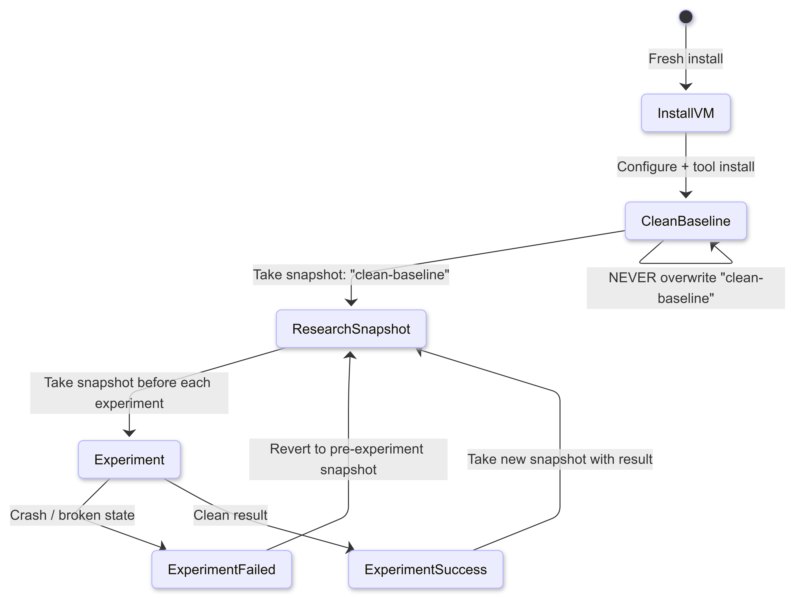

</td></tr></table>
</div>

```bash
# VMware CLI snapshot commands (useful in scripts)
vmrun snapshot /path/to/vm.vmx "p3_2027-01-15_before-heap-exploit"
vmrun listSnapshots /path/to/vm.vmx
vmrun revertToSnapshot /path/to/vm.vmx "p3_2027-01-15_before-heap-exploit"
vmrun deleteSnapshot /path/to/vm.vmx "p3_2027-01-15_before-heap-exploit"

# VirtualBox CLI
VBoxManage snapshot "VM-Name" take "p3_before-heap-exploit"
VBoxManage snapshot "VM-Name" list
VBoxManage snapshot "VM-Name" restore "p3_before-heap-exploit"

# Proxmox CLI (run on Proxmox host)
qm snapshot <VMID> snap_name --description "p3 before heap exploit"
qm listsnapshot <VMID>
qm rollback <VMID> snap_name

# Rule: snapshot BEFORE doing any of these:
# - Loading a new driver or kernel module
# - Running unknown malware for analysis
# - Making bcdedit changes (kernel debug settings)
# - Running GOAD provisioning or reprovisioning
# - Any major tool installation in a lab VM
# - Before starting a new CTF or challenge
```

### Storage Allocation for Snapshots

```
VM storage (thin provisioned) + snapshots grow fast.
Estimated storage requirements across roadmap tiers:

kali-attacker:    80 GB base  + 50 GB snapshots  = 130 GB
ubuntu-dev:       100 GB base + 60 GB snapshots  = 160 GB
win11-target:     100 GB base + 80 GB snapshots  = 180 GB
GOAD (5 VMs):     400 GB base + 200 GB snapshots = 600 GB
flare-vm:         150 GB base + 100 GB snapshots = 250 GB
remnux:           60 GB base  + 20 GB snapshots  = 80 GB
cape-sandbox:     100 GB base + 50 GB snapshots  = 150 GB
detectionlab:     200 GB base + 100 GB snapshots = 300 GB
kernel debug VMs: 100 GB base + 100 GB snapshots = 200 GB
--
Tier 2/3 Total:   2.05 TB (Phases 0 through 4)
Recommendation:   4 TB SSD dedicated to VM storage

Phase 5 & 6 GREATEST Additions:
syzkaller-host:   200 GB base + 100 GB workdirs  = 300 GB
v8-research:      150 GB base + 80 GB build logs = 230 GB
AFL++ RAMdisks:   16-32 GB tmpfs + 100 GB corpus archive = 132 GB
SNDL PCAP pool:   500 GB to 1 TB encrypted ring buffer (ZFS pool)
TSCM RF sweeps:   50 GB spectrum sweep baselines
--
Tier 4 Total:     ~3.5 TB NVMe primary + 4 to 8 TB secondary archive pool
Recommendation:   4 TB NVMe Gen4/Gen5 primary + 8 TB storage pool (Tier 4 GREATEST)
```

---

## 21. Phase-by-Phase Lab Evolution

Build only what you need for your current phase. The full lab is built incrementally.

<div align="center">
<table><tr><td>

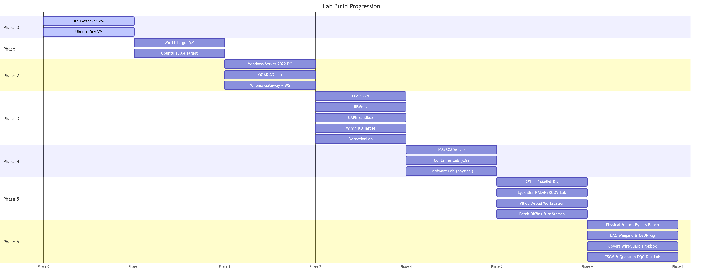

</td></tr></table>
</div>

### Phase Checklist

```
Phase -1 (OPSEC): Start Here
  [ ] Whonix Gateway VM deployed
  [ ] Whonix Workstation VM deployed
  [ ] Tor connectivity verified: curl --socks5 localhost:9050 https://check.torproject.org
  [ ] VPN configured on host (Mullvad recommended: no logs, port forwarding)

Phase 0 (Foundation): Core Lab
  [ ] Kali 2024.x VM deployed: 4 vCPU, 8 GB RAM, 80 GB storage
  [ ] Ubuntu 22.04 LTS Dev VM deployed: 4 vCPU, 8 GB RAM, 100 GB storage
  [ ] Internal lab network (VMnet2 / vmbr1) configured: 10.10.10.0/24
  [ ] Both VMs on internal network with static IPs assigned
  [ ] Kali also on NAT for internet access
  [ ] All Phase 0 packages installed on Ubuntu Dev VM (verify with verification script)
  [ ] GDB + GEF functional: gdb -batch -ex "gef version"
  [ ] pwntools functional: python3 -c "import pwn; print(pwn.__version__)"
  [ ] Ghidra functional: launches without error
  [ ] "clean-baseline" snapshots taken for both VMs

Phase 1 (Web): Add Windows Target
  [ ] Windows 11 23H2 VM deployed: 4 vCPU, 8 GB RAM, 100 GB storage
  [ ] On internal lab network (10.10.10.30)
  [ ] Visual Studio 2022 installed with C++ workloads
  [ ] x64dbg installed and functional
  [ ] Sysinternals Suite installed
  [ ] Burp Suite Community installed on Kali
  [ ] "clean-baseline" snapshot taken for Win11 VM

Phase 2 (Network + AD): Active Directory Lab
  [ ] GOAD deployed (or manual 2-VM AD lab for Tier 1 hardware)
  [ ] GOAD: all 5 VMs running, accessible from Kali
  [ ] BloodHound + Neo4j functional on Kali: sudo neo4j start && bloodhound
  [ ] SharpHound collection successful: .zip imports to BloodHound without error
  [ ] AD lab network (VMnet3 / vmbr2) configured: 10.20.20.0/24
  [ ] Kali can reach all domain controllers via AD network adapter
  [ ] NetExec (nxc) functional: nxc smb 10.20.20.0/24
  [ ] "clean-baseline" snapshots for all GOAD VMs

Phase 3 (Exploitation): Malware Analysis + Kernel Debug
  [ ] FLARE-VM deployed and configured (internet disconnected after install)
  [ ] FLARE-VM tools verified: x64dbg, Ghidra, PE-bear, Detect-It-Easy
  [ ] REMnux deployed and updated
  [ ] REMnux tools verified: volatility3 --info, remnux --version
  [ ] CAPE Sandbox deployed and functional (sample submission returns report)
  [ ] Linux kernel debug environment: QEMU boots debug kernel, GDB connects on :1234
  [ ] Windows kernel debug: WinDbg connects to win11-kdbg via KD network
  [ ] VirtualKD-Redux installed on both debugger and target VMs
  [ ] WinDbg symbols resolving: after .reload /f, lm shows ntoskrnl with symbols
  [ ] HEVD driver loadable on win11-kdbg VM
  [ ] DetectionLab deployed (if hardware allows): Splunk accessible at :8000
  [ ] "clean-baseline" snapshots for all Phase 3 VMs

Phase 4 (Advanced): Full Lab
  [ ] ICS/SCADA lab: OpenPLC accessible, Modbus scan returns results
  [ ] Container lab: k3s cluster functional, kubectl get nodes returns ready
  [ ] Hardware lab: Flipper Zero firmware updated, UART adapter tested
  [ ] All lab VMs have current snapshots
  [ ] Hardware: GPU available for hashcat (if Tier 2+)
  [ ] Storage: at least 2 TB free for VM expansion

Phase 5 (GREATEST): Vulnerability Research, Fuzzing & 0-Day Lab
  [ ] RAMdisk configured and mounted (/mnt/ramdisk)
  [ ] AFL++ installed and compiled with LLVM LTO support
  [ ] CPU governor set to performance; core dumps configured
  [ ] Persistent mode test harness compiles and runs at >10,000 exec/sec
  [ ] Syzkaller installed; custom KASAN/KCOV Linux kernel compiled
  [ ] Syzkaller QEMU test instance boots and connects via SSH key
  [ ] V8 debug shell (d8) compiled with ASAN and optimization tracing
  [ ] BinDiff 9 and Diaphora installed and tested against target DLLs
  [ ] rr (Mozilla record and replay) functional; reverse debugging verified
  [ ] "clean-baseline" snapshots for all Phase 5 fuzzing and research VMs

Phase 6 (Special Operations): Physical Red Team, SE, TSCM & Quantum Lab
  [ ] Physical lockpicking bench setup: practice cylinders, pinning kit, pick sets
  [ ] Door bypass jig tested with Under-Door Tool (UDT) and shove knife
  [ ] Electronic Access Control rig assembled: 12V supply, controller, reader, maglock
  [ ] Proxmark3 RDV4 firmware updated (Iceman build); lf/hf search functional
  [ ] Flipper Zero updated with latest firmware; RFID/sub-GHz replay tested
  [ ] ESPKey / Wiegand sniffer assembled and tested inline on reader
  [ ] Raspberry Pi stealth dropbox configured with auto-reconnecting WireGuard
  [ ] Asterisk PBX / softphone environment operational for vishing pretexts
  [ ] RF Explorer / HackRF One spectrum sweep baseline recorded
  [ ] Optical retro-reflection and thermal camera verified against hidden targets
  [ ] liboqs and oqs-provider compiled with OpenSSL 3.x; ML-KEM handshakes tested
```

---

## 22. Environment Verification Checklist

Run this from Kali after full lab deployment to verify all systems are reachable and functional.

```bash
#!/usr/bin/env bash
# Lab connectivity and tool verification script
# Run from Kali attacker VM

echo "======================================================"
echo "  BlackHAT Lab Verification Script"
echo "  Run from: Kali Attacker VM"
echo "======================================================"

# --- Network connectivity ---
echo ""
echo "[*] Internal Lab Network: 10.10.10.0/24"
for host in 10.10.10.20 10.10.10.30 10.10.10.40 10.10.10.60; do
    ping -c1 -W2 $host > /dev/null 2>&1 && echo "[OK] $host reachable" || echo "[FAIL] $host unreachable"
done

echo ""
echo "[*] AD Lab Network: 10.20.20.0/24 (GOAD)"
for host in 10.20.20.10 10.20.20.11 10.20.20.12; do
    ping -c1 -W2 $host > /dev/null 2>&1 && echo "[OK] $host reachable" || echo "[FAIL] $host unreachable"
done

# --- Tool verification ---
echo ""
echo "[*] Core Tools"
tools=("nmap" "netexec" "bloodhound" "impacket-secretsdump" "certipy" "evil-winrm" "ligolo-proxy" "sliver" "afl-fuzz" "qemu-system-x86_64" "gdb" "r2" "tshark" "dumpcap")
for tool in "${tools[@]}"; do
    which $tool > /dev/null 2>&1 && echo "[OK] $tool" || echo "[FAIL] $tool not found"
done

echo ""
echo "[*] Python Tools"
python3 -c "import pwn" 2>/dev/null && echo "[OK] pwntools" || echo "[FAIL] pwntools"
python3 -c "import impacket" 2>/dev/null && echo "[OK] impacket" || echo "[FAIL] impacket"
python3 -c "import scapy" 2>/dev/null && echo "[OK] scapy" || echo "[FAIL] scapy"
python3 -c "import certipy" 2>/dev/null && echo "[OK] certipy-ad" || echo "[FAIL] certipy-ad"

echo ""
echo "[*] GOAD AD Lab (SMB check)"
nxc smb 10.20.20.10-12 2>/dev/null | grep -E "SMB|FAILED" | head -5

echo ""
echo "[*] BloodHound / Neo4j"
systemctl is-active neo4j > /dev/null 2>&1 && echo "[OK] neo4j running" || echo "[WARN] neo4j not running: sudo neo4j start"

echo ""
echo "[*] Docker (Container Lab)"
docker ps > /dev/null 2>&1 && echo "[OK] docker daemon running" || echo "[FAIL] docker daemon not running"

echo ""
echo "[*] Internet Access (via NAT)"
curl -s --max-time 5 https://1.1.1.1 > /dev/null && echo "[OK] internet reachable" || echo "[FAIL] no internet"

echo ""
echo "======================================================"
echo "  Verification complete."
echo "======================================================"
```

---

## 23. Maintenance Schedule

A lab that is not maintained degrades. Tools go stale. Signatures catch old techniques. Windows evaluation licenses expire.

### Weekly

```bash
# Update Kali
sudo apt update && sudo apt full-upgrade -y

# Update Go tools
go install github.com/OJ/gobuster/v3@latest
go install github.com/projectdiscovery/nuclei/v3/cmd/nuclei@latest

# Update Python tools
pip3 install --upgrade netexec certipy-ad bloodhound impacket --break-system-packages

# Update Sliver C2
curl https://sliver.sh/install | sudo bash

# Phase 5: Clean and deduplicate fuzzing corpora
afl-cmin -i /mnt/ramdisk/out/main/queue -o /mnt/ramdisk/minimized_corpus -- /mnt/ramdisk/harness
```

### Monthly

```bash
# Update GOAD (pull new misconfigs and provisioning scripts)
cd ~/GOAD && git pull && pip3 install -r requirements.txt --break-system-packages

# Update REMnux
remnux upgrade

# Update FLARE-VM (from Windows VM PowerShell as Admin)
# iex ((New-Object System.Net.WebClient).DownloadString('https://raw.githubusercontent.com/mandiant/flare-vm/main/install.ps1'))

# Update BloodHound (if new version released)
# https://github.com/SpecterOps/BloodHound/releases

# Phase 5: Pull latest V8 source and rebuild debug builds
cd ~/v8-research/v8 && git pull && gclient sync && tools/dev/gm.py x64.debug.asan

# Phase 6: Update Proxmark3 RDV4 repository and reflash firmware if needed
cd ~/proxmark3 && git pull && make clean && make all

# Take snapshot of all stable VMs after updates
# Label: [VM-NAME]_maintenance_[DATE]_post-update

# Check Windows evaluation license expiry:
# On Windows VMs: slmgr /dlv (shows days remaining)
# If under 30 days: download new evaluation ISO and rebuild (or use slmgr /rearm for one extension)
```

### When a Tool Gets Signatured

```
Symptom: Defender/EDR catches a tool that worked last week.
Response:
1. Do NOT submit the sample to VirusTotal or any public sandbox (exposes your tradecraft).
2. Use DetectionLab Splunk to identify exactly which detection triggered.
3. Modify the technique: recompile from source with different strings,
   change syscall approach, swap to a LOLBIN equivalent, or write from scratch.
4. Re-test in DetectionLab before using against hardened targets.
5. Document: what was caught, what detection rule fired, what evaded it.
   This documentation is your personal tradecraft development log.
```

---

<div align="right">

*BlackHAT Lab Setup Guide - Part of The BlackHAT Roadmap v1.2.0 (0 to GREATEST)*
*Status: Living document. The lab grows as you grow.*

</div>

---