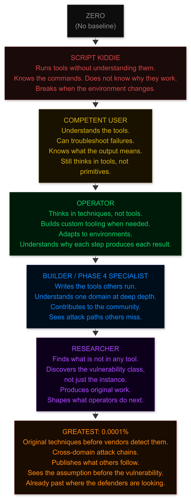
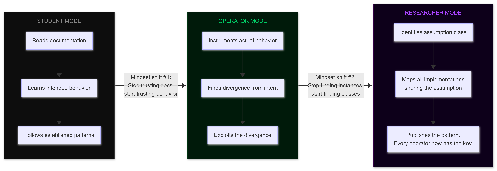
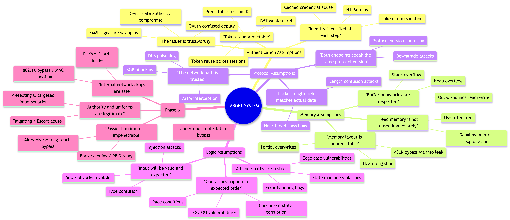
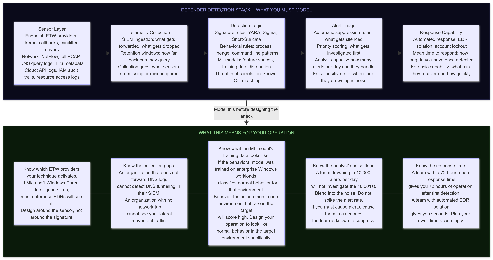
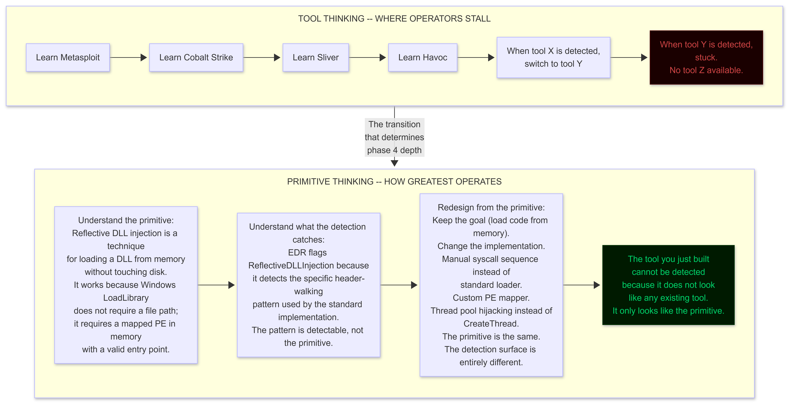
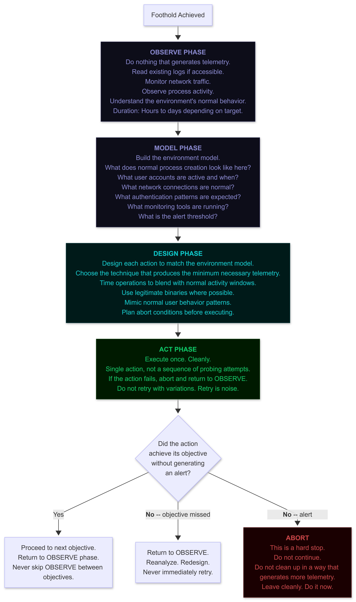
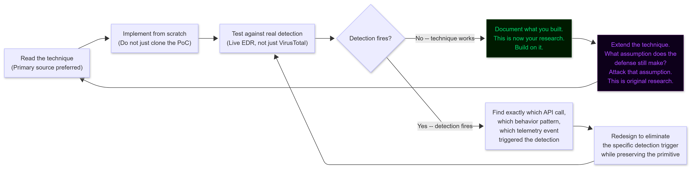
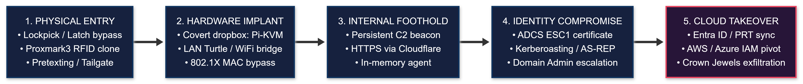

# Philosophy: The BlackHat Mindset

**Author:** Sagar Biswas<br/>
**Version:** 1.0.0 · 2027 Edition<br/>

<div align="right">

**The map is complete. The territory is yours.**

</div>

---

## TABLE OF CONTENTS

1. [What This Is Not](#1-what-this-is-not)
2. [What a BlackHat Actually Is](#2-what-a-blackhat-actually-is)
3. [The Cognitive Progression](#3-the-cognitive-progression)
4. [The Separation That Matters: Student, Operator, Researcher](#4-the-separation-that-matters)
5. [GREATEST vs Good - The 2027 Edition](#5-greatest-vs-good-the-2027-edition)
6. [The Seven Pillars of the BlackHat Mindset](#6-the-seven-pillars-of-the-blackhat-mindset)
   - [Pillar I: Adversarial Assumption Hunting](#pillar-i-adversarial-assumption-hunting)
   - [Pillar II: Understand the Defender Before You Attack](#pillar-ii-understand-the-defender-before-you-attack)
   - [Pillar III: Primitive Thinking Over Tool Thinking](#pillar-iii-primitive-thinking-over-tool-thinking)
   - [Pillar IV: Patience and Operational Silence](#pillar-iv-patience-and-operational-silence)
   - [Pillar V: Fail Silently](#pillar-v-fail-silently)
   - [Pillar VI: Ego Is an OpSec Failure](#pillar-vi-ego-is-an-opsec-failure)
   - [Pillar VII: The Research Posture](#pillar-vii-the-research-posture)
7. [The 2027 Landscape Reality](#7-the-2027-landscape-reality)
8. [The Psychological Framework](#8-the-psychological-framework)
9. [Reality Check - Updated 2027](#9-reality-check-updated-2027)
10. [The Closing Truth](#10-the-closing-truth)

---

<a id="1-what-this-is-not"></a>
## 1. What This Is Not

This is not a training course.

>**Companion Roadmap Documents:**
> * **[Master Curriculum (Phases -1 to 6)](../phases/PHASE_-1.md)**: Zero-to-elite offensive engineering syllabus from foundational metal to apex operations.
> * **[BlackHat Long-Term Survival Tactics](../black-bag/BlackHat_Long-Term_Survival_Tactics.md)**: The authoritative operational security, physical tradecraft, and digital persona architecture manual.
> * **[MITRE ATT&CK Quick Reference](MITRE_ATT&CK_Quick_Reference.md)**: Enterprise, ICS, and ATLAS technique mapping, detection signals, and attack chain blueprints.
> * **[Tools Inventory](Tools_Inventory.md)**: Canonical, phase-aligned 300+ tool directory covering primitive-to-tool realization.
> * **[Lab Setup Guide](Lab_Setup_Guide.md)**: Multi-tier hardware specifications and isolated enterprise/kernel lab blueprints.
> * **[Resources Aggregated](Resources_Aggregated.md)**: Canonical literature, academic security proceedings, and vulnerability research archives.
> * **[FAQ](FAQ.md)**: Comprehensive operational and career transitions FAQ.
> * **[Final Word](Final_Word.md)**: Document verification statistics, researcher attributions, and horizon research roadmap.

It is not a certification path. It does not have a completion badge. It does not prepare you for a job description. No employer wrote its requirements. No compliance framework shaped its scope. No legal jurisdiction reviewed its contents.

It does not care about your background. It does not care whether you have a degree, a bootcamp certificate, or nothing at all except time and a machine that runs Linux. It does not care what you do with what you learn.

What it cares about: depth. Specifically, the kind of depth that cannot be faked, cannot be certificated into existence, and cannot be compressed into a weekend course. The kind of depth that only comes from building things, breaking things, watching them fail, understanding why they failed at the instruction level, rebuilding them, and doing that a few thousand times across a few years in a few different domains.

This document is the philosophy that makes all of that possible. Not the tools. Not the labs. Not the techniques. The mindset that turns technique into craft, craft into research, and research into the ability to shape the field itself.

Read it first. Come back to it when you are stuck. Come back to it when you think you are done.

---

<a id="2-what-a-blackhat-actually-is"></a>
## 2. What a BlackHat Actually Is

A BlackHat is defined by one thing: **understanding systems completely, from the metal up.**

Not understanding how to use tools someone else built. Not understanding in theory. Not understanding well enough to pass a test or answer an interview question. Understanding at the level where you can build the tool, break the tool, hide the tool, find the flaw in the tool's design that the author never intended, and then delete the evidence that the tool ever existed.

"From the metal up" is not a metaphor. It means:

- When you trigger a vulnerability in a web application, you understand what happens at the kernel level when that HTTP request is parsed, what memory allocations occur, which system calls fire, and what the CPU actually executes.
- When your shellcode runs, you know exactly which registers hold what values, why the stack is aligned, what the calling convention expects, and why your NOP sled is the length it is.
- When your C2 beacon calls home, you understand the network stack from the TLS handshake down to the TCP segment structure, why your timing jitter matters to a network detection engineer, and what a PCAP of your traffic looks like to someone running Zeek with custom scripts.

Most people who call themselves hackers understand one layer. They understand the web application layer, or the network layer, or the binary exploitation layer. They operate at the layer they understand and call everything else "out of scope."

GREATEST operators understand every layer and choose which one to attack based on which produces the cleanest result, not based on which one they happen to know.

The skills in this document are neutral. Electricity does not ask what you will power. A compiler does not ask what the program will do. A network does not ask who is transmitting. Learn what is here. What you build with it is yours.

---

<a id="3-the-cognitive-progression"></a>
## 3. The Cognitive Progression

Most people imagine the path from beginner to elite as a straight line. More knowledge, more skill, more tools, more experience. A line.

The actual progression is not a line. It is a series of cognitive phase transitions, each one requiring not just more knowledge but a fundamentally different way of thinking about systems. You cannot skip a transition by studying harder. You have to go through it.

<div align="center">
<table><tr><td>



</td></tr></table>
</div>

Each transition has a specific marker. You cannot buy the transition. You cannot shortcut it. You will know which stage you are at because the stages have specific failure modes:

| Stage | Specific Failure Mode |
|---|---|
| Script Kiddie | The tool breaks, you are stuck. You cannot debug what you cannot read. |
| Competent User | You can use the tool but you cannot explain exactly why the exploit works at the CPU level. |
| Operator | You can build the tool but you operate within known technique classes. You execute others' research. |
| Builder | You specialize deeply but your cross-domain awareness is shallow. You miss attack paths that cross domains. |
| Researcher | You produce original work but within an existing framing. You find new vulnerabilities in known classes. |
| GREATEST | None yet. You are defining the new class. |

The failure mode is the diagnosis. Know which one describes you right now. That is your current layer. The work is getting to the next transition, not pretending you have already made it.

---

## 4. The Separation That Matters

### Student vs Operator vs Researcher

The window between "student" and "operator" is not knowledge. It is mindset.

**Students** learn how things are supposed to work. They study the RFC to understand the protocol. They read the man page to understand the tool. They follow the tutorial to understand the technique. This is not wrong. It is necessary. But it is not sufficient.

**Operators** learn how things actually work. They study the RFC and then read the actual implementation to find where the implementation diverges from the spec, because that divergence is where vulnerabilities live. They read the man page and then read the source code to understand what the man page got wrong or left out. They follow the tutorial and then immediately break the tutorial's assumptions to see what happens when the environment does not match the author's expectations.

The cognitive shift from student to operator is specific: you stop trusting documentation and start trusting instrumented behavior. Documentation describes intent. Behavior describes reality. Reality is where you work.

**Researchers** go one level further. They do not just find where implementations diverge from specs. They find the class of assumption that causes a whole category of implementations to diverge in similar ways. They do not find the SQL injection in this application. They find the pattern that causes SQL injection to appear in applications that use this type of ORM, under this type of configuration, when developers make this specific type of assumption about input sanitization.

The researcher's leverage is asymmetric. The operator finds one vulnerability. The researcher publishes a technique and hands every operator in the field the pattern to find thousands of vulnerabilities across thousands of applications.

<div align="center">
<table><tr><td>



</td></tr></table>
</div>

Both transitions are mindset shifts, not knowledge accumulations. You can have ten years of knowledge and never make transition one. You can have two years of knowledge and make both transitions in rapid succession. The transitions are not correlated with time. They are correlated with the specific cognitive habit of questioning the layer below whatever you are currently looking at.

---

<a id="5-greatest-vs-good-the-2027-edition"></a>
## 5. GREATEST vs Good - The 2027 Edition

This comparison is not aspirational. It is a description of what actually separates the top percentile from the tier below it, as of 2027. These are observable differences in capability and output.

| Dimension | Good (Top 5%) | GREATEST (Top 0.0001%) |
|---|---|---|
| **Vulnerability Discovery** | Finds the CVE. Files the report. | Wrote the PoC before the vendor knew the vulnerability class existed. |
| **Detection Evasion** | Evades signature-based EDR. Knows the YARA rule won't match. | Understands the ML feature space the behavioral detection model classifies against. Designs operations that sit outside the model's training distribution. Not just signature evasion. Distribution evasion. |
| **Tool Relationship** | Uses the framework effectively. Extends it with custom BOFs and modules. | Wrote the framework. Knows exactly what telemetry each action in the framework generates and why. Built the detection bypass into the architecture before shipping. |
| **Log Presence** | Cleans up after operations. Removes obvious artifacts. | Was never in the logs. The operation was designed from the first packet to be indistinguishable from legitimate traffic at every sensor layer. |
| **Lateral Movement** | Can pivot through a network. Understands pass-the-hash, pass-the-ticket, DCSync. | Owns the identity infrastructure. Forges the tokens. Does not need to pivot because there is no perimeter from their position. |
| **Persistence** | Installs persistence that survives reboots. Knows common detection rules. | Persistence at a layer below the OS. UEFI firmware implants that survive reimaging. Supply chain persistence that survives hardware replacement. |
| **Defense Awareness** | Knows what the EDR vendor's marketing page says their product detects. | Has read the EDR's driver source code (or reverse engineered it), understands its callback registration model, knows which ETW providers it subscribes to, and has mapped exactly which of its behavioral heuristics fire on which operation sequences. |
| **Research Output** | Publishes writeups of existing vulnerabilities. Files CVEs. Wins CTF challenges. | Publishes vulnerability classes. Techniques that change how every operator in the field works for the next two to three years. Work that shows up in MITRE ATT&CK as new entries. |
| **Cross-Domain Awareness** | Specialists. Deep in one domain (web, binary, AD, cloud, hardware). | Sees the attack chain that crosses domains because they understand all of them well enough. Web application gives initial access, AD misconfiguration gives lateral movement, cloud misconfiguration gives data access, hardware implant gives persistence. One operator. One chain. No handoff. |
| **AI and ML Surface (2027)** | Knows prompt injection exists. Can run basic attacks. | Understands the attention mechanism well enough to design injection payloads that exploit specific tokenization behaviors. Can extract model weights through black-box API queries. Designs RAG poisoning campaigns against specific embedding models. |
| **Physical Presence (Phase 6)** | Conducts digital attacks remotely. Stays in the terminal. | Walks in through the front door before the first packet is sent. Picks the lock, clones the badge, plugs in the hardware implant, and is gone before the coffee gets cold. Understands that the strongest firewall in the world is defeated by a person who holds the door open. Combines physical access with digital exploitation in a single chained operation. |

The difference is not talent. The difference is the cumulative effect of staying one layer below whatever everyone else is looking at, sustained over years, without stopping.

---

<a id="6-the-seven-pillars-of-the-blackhat-mindset"></a>
## 6. The Seven Pillars of the BlackHat Mindset

These are not tips. They are not heuristics. They are the cognitive operating principles of every operator who has reached Phase 4 depth or beyond. Internalize them before Phase 0. They will determine whether your technical knowledge accumulates into craft or remains a collection of disconnected techniques.

---

<a id="pillar-i-adversarial-assumption-hunting"></a>
### Pillar I: Adversarial Assumption Hunting

Every system is built on assumptions. Not some systems. Every system. Without exception.

The TCP/IP stack assumes that sequence numbers are hard to predict. SSL/TLS assumes that certificate authorities are trustworthy. An authentication system assumes that the token it issues cannot be forged. A browser assumes that JavaScript from one origin cannot read the DOM of another origin. An allocator assumes that a freed chunk will not be written to before it is reallocated.

Each of those assumptions is also a vulnerability. BEAST, CRIME, POODLE, and LUCKY13 were attacks on TLS assumptions. SOP bypass techniques are attacks on browser origin assumptions. Use-after-free is an attack on allocator assumptions. BGP hijacking is an attack on routing trust assumptions.

The pattern is always the same:

1. Someone builds a system.
2. The system encodes assumptions about how it will be used and what its environment guarantees.
3. Those assumptions hold in the expected environment.
4. An adversary creates an unexpected environment.
5. The assumption fails.
6. The system breaks in a way the builder never anticipated.

The GREATEST operator's primary cognitive habit is assumption enumeration. Before touching a single tool, before running a single scan, the question is: what does this system have to believe is true for it to function correctly? Then, methodically: which of those beliefs can I falsify?

<div align="center">
<table><tr><td>



</td></tr></table>
</div>

Train yourself to enumerate assumptions before you enumerate vulnerabilities. The assumption map tells you where to look. Vulnerability scanners tell you what has already been found and documented. The assumptions tell you where the undocumented vulnerabilities live.

Practically: before every engagement, before every CTF, before every research session, write down the assumptions of the target system. Not the attack surface. The assumptions. Then attack the assumptions.

---

<a id="pillar-ii-understand-the-defender-before-you-attack"></a>
### Pillar II: Understand the Defender Before You Attack

You cannot consistently bypass a detection system you do not understand. You can get lucky once. You cannot build a reliable, repeatable evasion methodology against a system whose internals are opaque to you.

This is the most consistently skipped pillar among intermediate operators. They focus entirely on offensive technique and treat detection as an obstacle to work around rather than a system to model and understand. The result is evasion that works until the defender makes a minor adjustment, then fails completely.

The GREATEST operator's approach is different: before designing an attack technique, understand the detection architecture it will face.

<div align="center">
<table><tr><td>



</td></tr></table>
</div>

The operational implication of this pillar: spend time in blue team tooling. Understand how Elastic SIEM ingests and correlates events. Understand how a Zeek sensor processes network traffic. Understand how a CrowdStrike kernel driver registers callbacks. Understand how Azure Sentinel's detection rules are structured and what they query.

Not so you can write detection rules. So you can understand exactly what your techniques look like to the defender and engineer your techniques to be invisible at the sensor layer, not just invisible to the signature database.

**The 2027 Addition: ML-Based Detection**

Traditional detection operates on rules. Rules have known structure. Bypassing them is often a matter of minor technique variation.

ML-based behavioral detection is different. It operates on features extracted from behavior streams and classifies those feature vectors against a model trained on known-malicious and known-benign behavior. Bypassing it requires understanding:

- What features the model extracts (process lineage, API call sequences, memory access patterns, network connection timing)
- What the training data looks like (what does benign behavior in the target environment produce in feature space)
- How to operate such that your feature vector falls inside the benign distribution

This is not a future problem. EDR vendors deployed ML-based behavioral engines at scale in 2024 and 2025. By 2027, signature evasion alone is insufficient. You need distribution evasion: operations that look, at the feature level, like normal enterprise behavior.

The GREATEST operator in 2027 does not just ask "does this bypass the signature?" They ask "does this sit inside the benign distribution of the ML model protecting this target?"

---

<a id="pillar-iii-primitive-thinking-over-tool-thinking"></a>
### Pillar III: Primitive Thinking Over Tool Thinking

There are two ways to think about a buffer overflow:

**Tool thinking:** "I use pwntools. I set up the exploit script. I send the payload. If it does not work, I adjust the offset and try again."

**Primitive thinking:** "I need to overwrite the return address on the stack. The return address is 4 bytes on x86 or 8 bytes on x86-64. It sits at a specific offset from the start of my controlled buffer, determined by the function's stack frame layout. I need to know: where is the buffer, how large is it, how is it allocated, is the stack executable or do I need ROP, is ASLR enabled and if so how do I leak a useful address, is there a canary and if so how do I bypass it or leak it. The tool is just Python that automates the sending of the payload I have already reasoned about from first principles."

The tool executes your understanding. The understanding is not the tool.

<div align="center">
<table><tr><td>



</td></tr></table>
</div>

Practically, this means: for every technique you learn, find the primitive underneath it. Then find the implementation decisions that sit between the primitive and the specific tool you are using. Then ask: if I changed those implementation decisions while keeping the primitive, what would the result look like to a detection engine?

The answer is almost always: it would look like nothing. Because detection engines are trained on implementations, not primitives. The primitive is too general to detect. The implementation is specific enough to be signatured.

GREATEST operators build from primitives. Everyone else uses tools and waits for the tool to be bypassed.

---

<a id="pillar-iv-patience-and-operational-silence"></a>
### Pillar IV: Patience and Operational Silence

Speed is not a virtue in offensive security operations. Speed is a noise source.

A beginner who finds a foothold moves immediately. They run enumeration scripts, try privilege escalation techniques, drop tooling, generate dozens of process creations, dozens of network connections, dozens of file operations. They accomplish their technical objective in two hours and leave a trail that a competent incident responder can reconstruct completely.

A GREATEST operator who finds the same foothold may do nothing for 24 hours. They are reading. Studying the environment. Understanding what normal traffic looks like, what processes run, what accounts exist, what the normal rate of authentication events is. They are building a model of the environment before they do anything that might generate a log entry.

Then they act. Once. Cleanly. The action is designed to look like a specific type of normal activity. It generates the minimum necessary telemetry. It achieves the objective. Then nothing again.

<div align="center">
<table><tr><td>



</td></tr></table>
</div>

The patience principle extends to tool selection: always prefer the technique that requires the fewest external binaries dropped to disk, the fewest network connections, the fewest registry writes, the fewest log entries. Not because these things are impossible to do cleanly, but because each one is a surface area for detection. Minimum surface area, maximum patience, single clean action. That is the operational model.

Silence is not passivity. Silence is the active, disciplined suppression of unnecessary action. It is one of the hardest operational skills to develop because the instinct -- especially under time pressure -- is to act, to probe, to try things. Resisting that instinct is skill. Operational silence under pressure is the mark of a mature operator.

---

<a id="pillar-v-fail-silently"></a>
### Pillar V: Fail Silently

Operations fail. Techniques fail. Payloads crash. Exploits produce the wrong behavior. This is not exceptional. This is the normal operating condition.

The distinction that separates skill levels is not whether operations fail. It is how they fail.

**A failure that is loud:** The exploit crashes the target process. The crash generates a Windows Error Reporting event. The WER event is forwarded to the SIEM. The SIEM correlates the crash event with the anomalous process that was running before the crash. An alert fires.

**A failure that is silent:** The exploit attempts to trigger the vulnerability. The condition is not met -- perhaps the heap layout does not match expectations, or a race condition resolves incorrectly. The code detects this condition before it produces a crash, aborts cleanly, leaves no artifact, and signals to the operator: condition not met, retry with adjusted parameters.

Fail silently means: every operation, every payload, every technique must have an abort path. The abort path must be instrumented and tested. It must execute without producing a log entry, a crash, a hung process, or any other artifact that could indicate an attempted operation.

The fail-silent principle in code:

```
Attempt operation:
  Pre-check: Can I reach the precondition?
    No -> abort cleanly, no artifact, return failure code
    Yes -> proceed
  Execute:
    Success -> continue
    Failure -> abort cleanly, no artifact, return failure code
  Post-check: Did I leave any detectable artifact?
    Yes -> clean up before returning
    No -> return
```

Every phase of every operation is wrapped in this logic. Pre-checks are not optional. They are the difference between a clean miss and a detectable incident.

Practically, this means: before you exploit, verify the preconditions are met. Before you inject, verify the target process is in the expected state. Before you exfiltrate, verify the channel is clean. If any precondition fails, do not proceed. Return cleanly. The operation failed silently. That is acceptable. A loud failure is not.

The psychological corollary: learn to be comfortable with a mission that produces no result. A skilled operator who attempts three approaches and aborts all three cleanly has produced no result and left no evidence. That is a success. The instinct to push through when preconditions are not met is the instinct that gets operators caught.

---

<a id="pillar-vi-ego-is-an-opsec-failure"></a>
### Pillar VI: Ego Is an OpSec Failure

Ego is the most consistent threat to operational security. More consistent than technical mistakes. More consistent than tool failures. More consistent than vendor patches.

Ego produces specific, identifiable OpSec failures:

**Signature ego:** Leaving a recognizable pattern across operations because it functions as a calling card. "Groups" that leave the same C2 infrastructure patterns, the same compilation timestamps, the same PE section names across years of operations. This is the operational equivalent of signing your work. Every pattern you repeat is a correlation opportunity.

**Speed ego:** Moving fast because you can, not because the operation requires it. Fast operations are noisy operations. Noise is detection surface. The ego that wants to demonstrate capability produces the speed that produces the log entry that produces the investigation.

**Complexity ego:** Using sophisticated techniques when simple ones would work because sophisticated techniques feel more impressive. Every unnecessary layer of complexity is an additional failure surface. The GREATEST operators consistently use the simplest technique that achieves the objective cleanly. They save sophisticated techniques for the specific situations where simple techniques fail.

**Recognition ego:** Talking. Discussing operations. Sharing details with people who do not need them. Every piece of information shared about an operation is a link in a chain that can eventually reach people you did not intend to reach.

**Correction ego:** Refusing to abort when the operation is not going as planned because aborting feels like failure. The operation is the objective, not the execution path. If the path is compromised, change the path. If the path cannot be changed cleanly, abort. Continuing a compromised operation to avoid the ego hit of aborting is how operators get caught.

The operational discipline required by this pillar: treat your operations as engineering problems, not performances. The audience for an operation is exactly one person: yourself, verifying that the objective was achieved. No one else. The moment you are thinking about how the operation will be perceived, read, or discussed, you have already introduced ego into the process.

Remove the audience. Work in silence. Leave no signature. The only validation that matters is the objective state of the target system after the operation.

---

<a id="pillar-vii-the-research-posture"></a>
### Pillar VII: The Research Posture

The techniques in this document will be outdated.

Not eventually. Soon. Some of them are outdated between the time this version is written and the time you read it. Security research is not a static field. Vendors patch. Defenders adapt. Detection improves. The technique that worked in Q1 may be signatured by Q3.

This is not a problem with the document. It is the nature of the field. The correct response is not to find a more up-to-date document. The correct response is to develop the ability to generate current techniques from first principles, rather than consuming current techniques from documentation.

The research posture is the cognitive stance that makes this possible. It has three components:

**Component 1: Treat published techniques as starting points, not endpoints.**

When you read about a technique, the first question is not "how do I use this?" The first question is: "what assumption does this technique exploit, what is the current state of detection for this assumption exploitation, and what is the next-generation version of this technique that the detection has not yet caught up to?"

SilentMoonwalk was built because the detection caught up to Ekko. The next sleep obfuscation technique will be built because the detection catches up to SilentMoonwalk. The researcher who builds that technique is not reading a document about what the next technique should be. They are reading the EDR's detection logic for SilentMoonwalk and finding what the detection assumed that the next technique can falsify.

**Component 2: Read primary sources.**

Patch diffs, not blog posts. CVE database entries and the actual advisory, not the article about the article. Vendor security research blogs, not the summary. Conference papers, not the social media thread.

Primary sources contain the exact technical detail that tells you what assumption is being exploited and what constraint the fix imposes. Secondary sources lose that detail in translation.

**Component 3: Build, not just read.**

Reading is not understanding. Reading about a buffer overflow is not the same as exploiting one. Reading about sleep obfuscation is not the same as implementing one, running it against an EDR, watching it get caught, and finding the specific API call that triggered the detection.

The research posture requires lab work as a mandatory component. Every technique you read about, you implement. Every implementation you run, you test against real detection. Every detection you hit, you analyze and work around. The cycle is: read, implement, test, analyze, iterate. The document is the starting point. The lab is where the understanding becomes yours.

<div align="center">
<table><tr><td>



</td></tr></table>
</div>

The research posture is what separates operators who become outdated from operators who remain relevant across years and across multiple generations of defensive tooling. The operators who rely on documented techniques become obsolete when the documentation becomes obsolete. The operators with the research posture generate the next documentation.

---

<a id="7-the-2027-landscape-reality"></a>
## 7. The 2027 Landscape Reality

The threat and defense landscape in 2027 is materially different from the landscape that produced the foundational offensive security literature. Understanding these shifts is not optional context. It is the operating environment.

### The ML-Based Detection Shift

Traditional detection was rule-based. Rules have known structure, known bypass patterns, and known limitations. The evasion methodology for rule-based detection is well understood: study the rule, find the specific condition it matches, modify the technique to not match that condition.

ML-based behavioral detection does not operate on rules. It operates on feature vectors extracted from continuous behavioral streams. The model classifies feature vectors as benign or malicious based on training data. The bypass methodology is entirely different:

- You need to understand what features the model extracts.
- You need to understand what the benign distribution looks like in the target environment.
- You need to operate such that your feature vector falls within the benign distribution.

This is a fundamental shift in the evasion problem. Signature evasion asks: "does my technique match the known-malicious pattern?" Distribution evasion asks: "does my technique look like known-benign behavior at the feature level?"

By 2027, GREATEST-level operators are solving distribution evasion problems, not signature evasion problems.

### The Identity Perimeter

The network perimeter is gone. Most enterprise organizations in 2027 operate on zero-trust architectures where identity is the primary security boundary, not network location.

This shifts the primary attack surface. The most impactful attacks in 2027 are identity attacks: token theft, device code phishing, Primary Refresh Token extraction, Conditional Access policy bypass, and OAuth confused deputy attacks. Network penetration is often less valuable than a single valid identity token with the right privilege scope.

GREATEST operators in 2027 think identity-first. The question is not "how do I get from the DMZ to the internal network?" The question is "which identity allows me to access the target data, how is that identity authenticated, and what does the authentication flow look like when I replicate it?"

### The Cloud-Native Attack Surface

Enterprise infrastructure in 2027 is primarily cloud-hosted. The attack surface is:

- IAM configurations and over-permissioned role chains
- Instance metadata services and the credentials they expose
- CI/CD pipelines and the secrets they contain
- Serverless functions and their environment variables
- Managed identity abuse in Azure, GCP, and AWS

Traditional network attacks reach this surface only indirectly. The GREATEST operator understands cloud IAM at the depth that traditional operators understand Active Directory.

### Offensive AI as an Operational Capability (2027)

AI-augmented offensive operations are no longer research. They are operational.

In 2027, GREATEST operators use local LLM inference for:
- Real-time code review and modification of payloads to evade specific detection signatures
- Automated variant generation for fuzzing campaigns
- Analysis of large binary datasets (firmware, memory dumps) that exceed human review capacity
- Target research and OSINT synthesis at scale
- Social engineering content generation tuned to specific targets

The operators who understand AI at the model level -- not just as a tool to prompt but as an architecture to manipulate -- have access to additional attack surfaces: model extraction, training data poisoning, inference-time manipulation, and agentic AI hijacking chains. These are not theoretical. They are active research with published PoC work in 2025 and 2026.

### The Full-Scope Operator and the Physical Attack Surface (Phase 6)

The dominant assumption in offensive security is that attacks happen through a network. Phase 6 exists to break that assumption.

Every digital defense assumes the attacker is remote. Firewalls, EDR, SIEM, zero-trust network architecture -- every layer of the modern defense stack is designed to stop a remote attacker who must traverse a network to reach the target. That assumption is the attack surface.

The full-scope operator does not traverse the network from outside. They walk through the front door. They pick the lock, clone the badge, or tailgate through the access control point using a pretext that took three hours to build. They sit down at a machine that nobody watches because it is inside the physical perimeter and the physical perimeter was assumed to be impenetrable. They plug in a hardware implant that beacons over HTTPS through Cloudflare to a C2 server that looks like legitimate CDN traffic. They leave before the coffee gets cold.

At that point, the entire digital defense stack is looking at the wrong problem.

The mindset shift Phase 6 demands is specific: **the attack surface is the full human and physical environment, not just the network topology.** This requires the same assumption-enumeration discipline applied in Pillar I, but extended to physical systems:

- What does this organization assume about who can enter the building?
- What does a security guard assume about a person in a suit carrying a laptop bag?
- What does the access control system assume about the credential it is reading?
- What does the receptionist assume about a caller who knows three internal names and references a meeting that happened last Tuesday?

Each of those assumptions is an attack surface. Each can be falsified with preparation, patience, and the right pretext.

The GREATEST operator in 2027 does not choose between digital and physical attack vectors. They chain them. Physical access gives hardware implant placement. The implant gives persistent internal network presence. Internal network presence gives ADCS ESC1 exploitation. ADCS gives domain admin. Domain admin gives cloud lateral movement. The chain starts with a lockpick and ends with the crown jewels. One operator. No handoff. No assumption left intact.

Phase 6 is not a specialization. It is the completion of the full attack surface model.

<div align="center">
<table><tr><td>



</td></tr></table>
</div>

---

<a id="8-the-psychological-framework"></a>
## 8. The Psychological Framework

Technical skill decays without maintenance. Knowledge accumulates. Attention is finite. The physical and cognitive demands of operating at Phase 4 depth across multiple specializations for years are real and must be acknowledged.

### Compartmentalization

Compartmentalization in the operational sense means: what you know and what you do remain separated in your mind and in your infrastructure. This is covered in Phase -1 as technical OpSec. Its psychological dimension is equally important.

The ability to work on sensitive research or operations without carrying that context into unrelated areas of life is a learnable skill. It requires deliberate practice: defined start and end points for work sessions, physical or digital separation of work environments, and the discipline not to think about active operations in contexts where the thinking is unproductive.

Operators who cannot compartmentalize exhibit predictable failure modes: distraction during high-stakes operations, residual anxiety that degrades performance, and the specific error of thinking about active operations in insecure contexts.

### Burnout Recognition and Management

Phase 4 work requires sustained deep focus over months and years. Burnout in this context does not look like exhaustion. It looks like reduced pattern recognition -- you stop seeing the connections between techniques. It looks like shallow reading -- you read but do not absorb. It looks like tool dependency -- you reach for the framework instead of reasoning from primitives because reasoning from primitives requires depth you cannot currently access.

These are not character flaws. They are physiological states. Sustained cognitive load depletes the specific mental resources required for the type of creative, adversarial thinking that offensive research demands.

Manage this deliberately:
- Structured rest periods between intensive research phases are not wasted time. They are recovery that enables the next phase.
- Vary the type of work: alternating between deep research and applying known techniques gives the research-mode cognition recovery time.
- Physical state affects cognitive performance at this level of work. Sleep quality, specifically, is directly correlated with the creative reasoning that produces original research.

### The Long Plateau

Between Phase 3 and Phase 4 there is a plateau. Not a brief one. An extended period where the rate of apparent progress slows dramatically. You are learning but the learning does not produce visible results at the rate that earlier phases did.

This plateau is the accumulation of prerequisite depth for original work. Original work requires a large substrate of connected knowledge. Building that substrate takes time and does not produce visible output. The plateau is not a failure of learning. It is the normal shape of expertise accumulation at deep technical levels.

Expect the plateau. Do not interpret it as evidence that you have reached your ceiling. The plateau ends when the substrate is sufficiently dense to support original connections. It always ends. The duration is determined by how consistently you work during it.

---

<a id="9-reality-check-updated-2027"></a>
## 9. Reality Check - Updated 2027

These numbers reflect the actual distribution of people who begin a serious study of offensive security in 2027, based on observed patterns across public educational platforms, CTF participation data, and community research output.

| Phase | Completion Rate | Primary Exit Reason |
|---|---|---|
| Phase -1 (OPSEC Setup) | ~90% complete | Low barrier; mostly setup work |
| Phase 0 (Foundation) | ~65% complete | Assembly and C. The first real filter. The majority who exit here found that systems-level programming was harder than expected. |
| Phase 1 (Web Security) | ~75% of remaining | Immediate feedback loop. Web has the most accessible learning resources and the fastest path from study to visible results. Retains more people than the phases before and after. |
| Phase 2 (Network and Infrastructure) | ~55% of remaining | The combination of networking depth and real-environment complexity filters significantly. |
| Phase 3 (System and Kernel Exploitation) | ~18% of remaining | The hardest filter. Binary exploitation at depth requires sustained engagement with material that has almost no fast feedback loop. Most people who enter Phase 3 do not reach Phase 3 competency. |
| Phase 4 (Advanced Tradecraft, any specialization) | ~5% of Phase 3 completers | Reaching depth in any single Phase 4 specialization requires original research and sustained engagement beyond documented techniques. |
| Phase 5 (GREATEST: original research) | 0.0001% of everyone who starts | The 0.0001% is not a goal. It is a description of where the field currently is and who is in it. |
| Phase 6 (Special Operations: Multi-Domain Red Teaming) | <0.01% of advanced operators | Requires physical presence, real-time social manipulation, hardware/RF mastery, and legal/regulatory discipline beyond digital environments. Operators fail due to lack of physical nerve, lack of social calibration, or inability to unify physical and digital domains. |

The completion rates are not motivational statistics. They are calibration data. They tell you that the primary filter at each phase is not intelligence -- it is sustained engagement with material that is difficult, poorly documented in places, and slow to produce visible results.

The people who reach Phase 5 are not the most talented people who started the process. They are the people who remained engaged during the phases where most people exit. Persistence across the filters is the primary variable. Not talent.

---

<a id="10-the-closing-truth"></a>
## 10. The Closing Truth

There is a specific moment that every operator who reaches Phase 4 depth describes in some form.

You have been working on a technique for weeks. You have read everything written about it. You have implemented it, run it, watched it fail, analyzed the failure, redesigned, and run it again. You have consumed all the documentation that exists. You are now at the edge of what has been publicly described.

And then, for the first time, you are working in territory that has not been mapped. You are looking at behavior that the documentation does not explain. You are reasoning from what you understand about the underlying system -- not from what someone else wrote about it -- to a hypothesis about why the behavior occurs. You test the hypothesis. It is correct. You now know something that is not in any document.

That moment is what this entire roadmap is building toward.

Not the moment of exploitation. Not the moment of access. The moment of original understanding. The moment when your knowledge of the system is deep enough that you can extend it beyond what was previously known.

That moment cannot be manufactured by documentation. It can only be enabled by it.

This roadmap is the map. The territory is what you discover when the map runs out.

GREATEST is not a level you reach. It is a practice. The practice of staying at the edge of the map, working in the territory that is not yet documented, and producing the documentation that extends the map for everyone who comes after.

The field does not stop when you reach Phase 5. The field continues. The defenders continue. The vendors continue. The techniques that are GREATEST today will be Phase 2 content in five years.

Build the mindset that generates the next techniques. Not the mindset that executes the current ones.

**What separates GREATEST from good:**
- Good knows what the vulnerability is. GREATEST wrote the PoC before the vendor knew the vulnerability class existed.
- Good can exploit a box. GREATEST was never in the logs.
- Good uses the framework. GREATEST wrote the framework and designed the detection bypass into its architecture.
- Good evades signature-based detection. GREATEST evades ML-based behavioral detection by operating inside the benign distribution.
- Good can pivot through a network. GREATEST owns the identity infrastructure and has no need to pivot.
- Good understands one domain deeply. GREATEST sees the cross-domain chain that no single-domain specialist can construct.
- Good reads the research. GREATEST produces the research that good operators will read two years from now.

The skills here are neutral. A compiler does not ask what the program will do. A network does not ask who is transmitting. A vulnerability does not ask who finds it.

Learn what is here.

What you build with it is yours.

---

<div align="right">

*Philosophy: The BlackHat Mindset | The BlackHAT Roadmap v1.2.0 -- 2027 Edition*<br/>
*Author: Sagar Biswas*

</div>

---