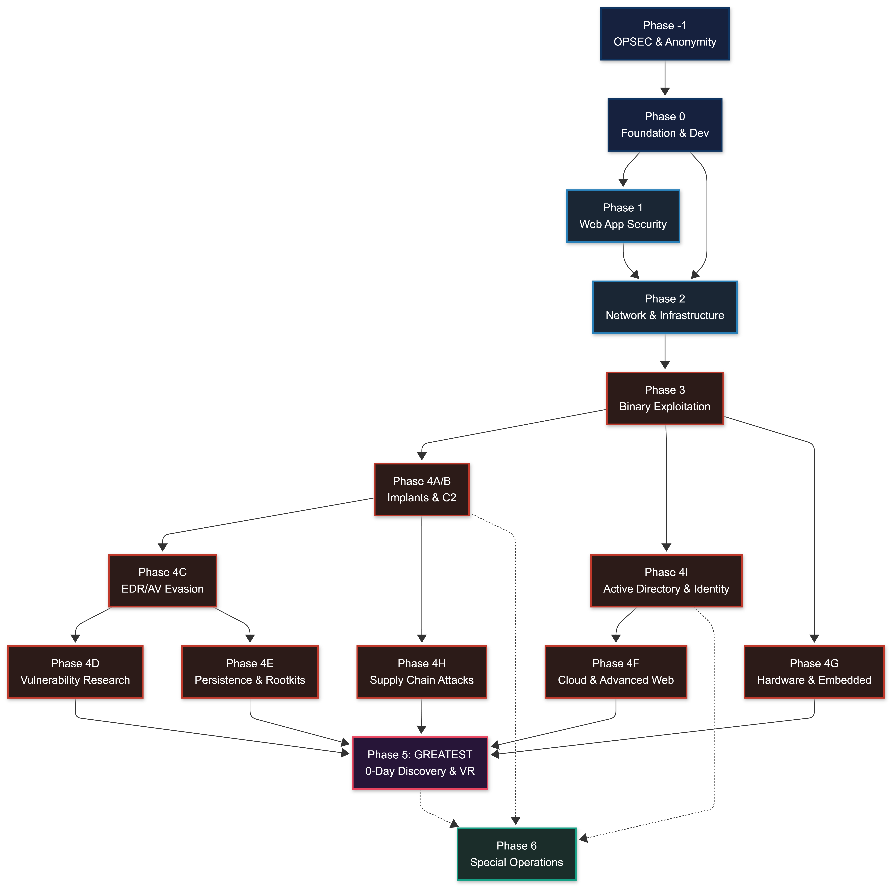
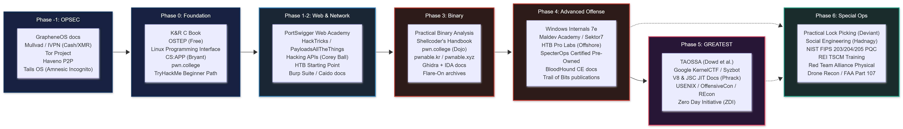
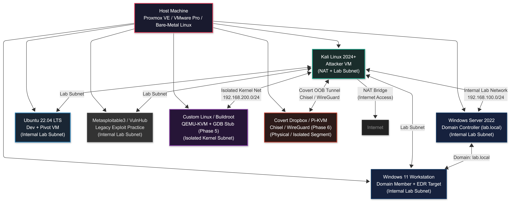
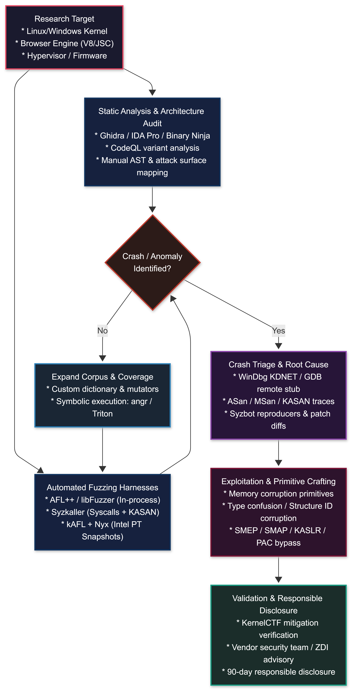
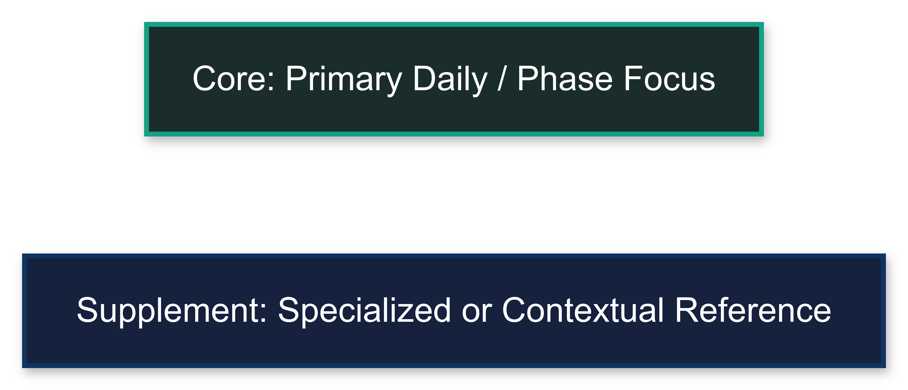

# Resources Aggregated

**Author:** Sagar Biswas<br/>
**Version:** 1.0.0 · 2027 Edition<br/>

<div align="right">

#### Canonical 2027 Reference · Verified URLs · Complete Multi-Phase Integration

**Canonical resource reference for every phase (Phase -1 through Phase 6). No speculative entries. No outdated tools. All URLs verified.**

</div>

---

## TABLE OF CONTENTS

1. [How to Use This Section](#1-how-to-use-this-section)
2. [Phase-to-Resource Navigator](#2-phase-to-resource-navigator)
3. [Reference Databases](#3-reference-databases)
4. [YouTube Channels - Active 2027](#4-youtube-channels-active-2027)
5. [Essential Books - Phase Ordered](#5-essential-books-phase-ordered)
6. [Courses - 2027 Pricing and Timing](#6-courses-2027-pricing-and-timing)
7. [Practice Platforms](#7-practice-platforms)
8. [Blogs and Research Sources](#8-blogs-and-research-sources)
9. [Malware Sample Repositories and Sandboxes](#9-malware-sample-repositories-and-sandboxes)
10. [Vulnerability Databases and Exploit Sources](#10-vulnerability-databases-and-exploit-sources)
11. [AI and LLM Security Resources](#11-ai-and-llm-security-resources)
12. [Nation-State and APT Research](#12-nation-state-and-apt-research)
13. [Community and Networking](#13-community-and-networking)
14. [Deprecated Stack - Do Not Use](#14-deprecated-stack-do-not-use)
15. [MITRE ATT&CK Reference - 2027](#15-mitre-attck-reference-2027)
16. [Lab Setup Guide](#16-lab-setup-guide)
17. [Phase 5: GREATEST - Vulnerability Research & 0-Day Resources](#17-phase-5-greatest-resources)
18. [Phase 6: Special Operations Resources](#18-phase-6-special-operations-resources)
19. [Resource-by-Phase Matrix](#19-resource-by-phase-matrix)

---

<a id="1-how-to-use-this-section"></a>
## 1. HOW TO USE THIS SECTION

This is the canonical resource reference for the full roadmap. Every entry was verified against its 2026-2027 operational status.

>**Companion Roadmap Documents:**
> * **[Master Curriculum (Phases -1 to 6)](../phases/PHASE_-1.md)**: Zero-to-elite offensive engineering syllabus from foundational metal to apex operations.
> * **[BlackHat Long-Term Survival Tactics](../black-bag/BlackHat_Long-Term_Survival_Tactics.md)**: The authoritative operational security and digital identity manual.
> * **[Philosophy: The BlackHat Mindset](Philosophy_The_BlackHat_Mindset.md)**: Cognitive doctrine, adversarial assumption hunting, and primitive thinking mental models.
> * **[Tools Inventory](Tools_Inventory.md)**: Comprehensive, phase-aligned 300+ tool directory with installation and usage instructions.
> * **[Lab Setup Guide](Lab_Setup_Guide.md)**: Hardware specifications, virtualization topology, and multi-tier AD/EDR lab configurations.
> * **[MITRE ATT&CK Quick Reference](MITRE_ATT&CK_Quick_Reference.md)**: Dedicated tactical mapping across all adversary tactics and roadmap phases.
> * **[FAQ](FAQ.md)**: Comprehensive operational and career transitions FAQ.
> * **[Final Word](Final_Word.md)**: Document verification statistics, researcher attributions, and horizon research roadmap.

Rules for using this section:

- **Phase-order your consumption.** Resources listed for Phase 0 will not help you at Phase 4. Do not skip forward.
- **Depth over breadth.** One book finished is worth ten books started. One platform completed beats five platforms sampled.
- **The Deprecated Stack section (Part 14) is mandatory reading** before installing any tool referenced anywhere in the roadmap. Tutorials age. Tools die. That section saves you from building on dead foundations.
- **Blogs and YouTube are supplements, not substitutes.** A 20-minute video cannot replace the 300 hours a book represents. Use them for technique updates and current events -- not as primary learning.
- **Prices listed are approximate 2026-2027 values.** Verify current pricing before purchasing.

---

<a id="2-phase-to-resource-navigator"></a>
## 2. PHASE-TO-RESOURCE NAVIGATOR

Read this diagram before starting any phase. It maps which resource category matters most at each stage.

<div align="center">
<table><tr><td>



</td></tr></table>
</div>

<div align="center">
<table><tr><td>



</td></tr></table>
</div>

---

<a id="3-reference-databases"></a>
## 3. REFERENCE DATABASES

These are always-open tabs for every operator at every phase. Bookmark all of them on day one.

| Resource | URL | What It Is |
|----------|-----|-----------|
| PayloadsAllTheThings | https://github.com/swisskyrepo/PayloadsAllTheThings | Payload and bypass collection for every attack category. First stop for payload syntax. |
| HackTricks | https://book.hacktricks.xyz | The most comprehensive offensive technique wiki. Web, network, binary, cloud, hardware. |
| GTFOBins | https://gtfobins.github.io | Unix binary exploitation and privilege escalation reference. Every GTFOBin listed and tested. |
| LOLBAS | https://lolbas-project.github.io | Windows Living-off-the-Land Binaries and Scripts. What you can execute without dropping tools. |
| LOLDrivers | https://www.loldrivers.io | Signed vulnerable Windows drivers database. Your BYOVD reference. |
| Exploit-DB | https://www.exploit-db.com | Public exploit repository. The `searchsploit` CLI searches this offline. |
| MITRE ATT&CK | https://attack.mitre.org | Adversary tactics and techniques matrix. Map every technique you use. |
| PortSwigger Research | https://portswigger.net/research | James Kettle's web research. HTTP request smuggling, cache poisoning, CSRF -- the original papers. |
| SpecterOps Blog | https://posts.specterops.io | The most important AD and identity attack research published. Subscribe to the RSS. |
| Malpedia | https://malpedia.caad.fkie.fraunhofer.de | Malware family reference. Understand what nation-state operators deploy. |
| Google Project Zero | https://googleprojectzero.blogspot.com | The definitive 0-day research blog. Browser, OS, mobile, chip. Required reading from Phase 4D. |
| Trail of Bits Blog | https://blog.trailofbits.com | Binary analysis, cryptography, fuzzing, and compiler security research. Phase 3-4D core reading. |
| OSV Database | https://osv.dev | Open Source Vulnerability database maintained by Google. Supply chain and dependency research. |
| GitHub Advisory Database | https://github.com/advisories | Open source security advisories. Phase 4H supply chain attack surface. |
| OWASP Testing Guide v4.2 | https://owasp.org/www-project-web-security-testing-guide | Methodology standard for web application testing. |
| OWASP API Security Top 10 (2023) | https://owasp.org/www-project-api-security | API attack methodology. Required for Phase 1. |
| HackerOne Hacktivity | https://hackerone.com/hacktivity | Real disclosed bug bounty reports. Filter by type to study real-world examples. |
| pentester.land Writeups | https://pentester.land/writeups | Aggregated public write-ups from every bug bounty platform. |

---

<a id="4-youtube-channels-active-2027"></a>
## 4. YOUTUBE CHANNELS - ACTIVE 2027

All channels verified active as of 2026-2027. Phase column indicates when to start watching each channel seriously.

| Channel | Focus | URL | Phase |
|---------|-------|-----|-------|
| LiveOverflow | Binary exploitation, web, CTF methodology | https://youtube.com/@LiveOverflow | 0+ |
| ippsec | HackTheBox machine walkthroughs (essential review method) | https://youtube.com/@ippsec | 1+ |
| John Hammond | CTF, malware analysis, security news | https://youtube.com/@_JohnHammond | 0+ |
| TCM Security | Practical pentesting, AD attacks, courses | https://youtube.com/@TCMSecurityAcademy | 1+ |
| pwn.college | Structured binary exploitation courses (ASU-backed) | https://youtube.com/@pwncollege | 2+ |
| stacksmashing | Hardware, firmware, embedded, NFC, JTAG | https://youtube.com/@stacksmashing | 4G |
| Seytonic | Hardware hacking, physical security | https://youtube.com/@Seytonic | 4G |
| HuskyHacks | Active Directory attacks, Cobalt Strike, C2 | https://youtube.com/@HuskyHacks | 2+ |
| VX-Underground | Malware, threat actor research, underground history | https://youtube.com/@vxunderground | 4A |
| OALabs | Malware analysis, unpacking, reverse engineering | https://youtube.com/@oalabs | 4A |
| STOK (Fredrik) | Bug bounty methodology, recon, web | https://youtube.com/@STOKfredrik | 1+ |
| NahamSec | Web security, bug bounty, recon | https://youtube.com/@NahamSec | 1+ |
| DEF CON | Conference talks, cutting edge research across all domains | https://youtube.com/@DEFCONConference | 0+ |
| Black Hat | Professional offensive and defensive security research | https://youtube.com/@BlackHatOfficialYT | 1+ |
| 0xdf | HackTheBox writeups, walkthroughs and analysis | https://youtube.com/@0xdf | 1+ |
| Objective-See (Patrick Wardle) | macOS security, malware analysis, Apple platform | https://youtube.com/@patrickwardle | 4E |
| Gynvael Coldwind | Binary exploitation, CTF, programming internals | https://youtube.com/@GynvaelEN | 3+ |
| LockPickingLawyer | Lockpicking techniques, bypass tools, lock analysis | https://youtube.com/@lockpickinglawyer | 6 |
| BosnianBill | High-security locks, disc detainer, advanced bypass | https://youtube.com/@bosnianbill | 6 |

> **Note on 0xdf:** The primary content lives at https://0xdf.gitlab.io (written walkthroughs). The YouTube channel supplements with video walkthroughs. Use both.

> **Note on OALabs:** Primary content is now split between YouTube and their subscription platform at https://oalabs.openanalysis.net. The free YouTube content covers malware analysis fundamentals.

---

<a id="5-essential-books-phase-ordered"></a>
## 5. ESSENTIAL BOOKS - PHASE ORDERED

Every book listed here was verified as of 2026. Entries marked *Classic* are older but contain foundational knowledge not replaced by any current alternative. Prices and editions are current as of 2026.

### Phase 0: Foundation

| Book | Author | Year | Notes |
|------|--------|------|-------|
| The C Programming Language | Kernighan and Ritchie | 1988 Classic | Read this first. K&R C remains the best introduction to C that exists. No substitute. |
| Operating Systems: Three Easy Pieces | Arpaci-Dusseau | Free (ostep.org) | Concurrency, memory management, persistence. Free online. Essential. |
| The Linux Programming Interface | Kerrisk | 2010 | Deep Linux internals: processes, signals, sockets, memory. The reference for Phase 0-2. |
| Computer Systems: A Programmer's Perspective | Bryant and O'Hallaron | 3rd ed 2015 | x86 assembly, memory hierarchy, linking, the stack. Bridges CS theory and exploitation. |
| The Linux Command Line | Shotts | 2nd ed 2019 | Free at linuxcommand.org. Shell scripting, tools, file system. Phase 0 daily reference. |

### Phase 1-2: Web and Network Security

| Book | Author | Year | Notes |
|------|--------|------|-------|
| The Web Application Hacker's Handbook | Stuttard and Pinto | 2011 Classic | Foundational methodology. Techniques still apply. PortSwigger Web Academy covers current additions. Read both. |
| Hacking APIs | Corey Ball | 2022 | Best API security testing book available. Current and practical. |
| Bug Bounty Bootcamp | Vickie Li | 2021 | Web-focused bug bounty methodology. Phase 1 supplemental. |
| Real-World Bug Hunting | Peter Yaworski | 2019 | Case studies from real bug bounty programs. Useful alongside Bug Bounty Bootcamp. |
| Hacking: The Art of Exploitation (2nd ed) | Erickson | 2008 Classic | Introduced shellcode to a generation. Memory layout, stack overflows, format strings explained clearly. Read for the foundation. |

### Phase 3: Binary Exploitation and Reverse Engineering

| Book | Author | Year | Notes |
|------|--------|------|-------|
| Practical Binary Analysis | Andriesse | 2019 | ELF internals, dynamic instrumentation, taint analysis. Free PDF from the author. Best Phase 3 start. |
| The Shellcoder's Handbook | Anley et al. | 2007 Classic | Stack overflows, heap overflows, format strings. Read this before Phase 3 hands-on work. |
| A Guide to Kernel Exploitation | Perla and Oldani | 2010 | Linux kernel exploitation. The standard reference for kernel pwn. |
| Attacking Network Protocols | Forshaw | 2017 | Protocol reverse engineering and fuzzing bible. Phase 3-4G overlap. |
| The Fuzzing Book | Zeller et al. | Free (fuzzingbook.org) | Theory and implementation of fuzzing. Required before Phase 4D. |
| The Car Hacker's Handbook | Craig Smith | 2016 | CAN bus, automotive protocols, OBD-II. Free PDF. Required for Phase 4G automotive track. |

### Phase 4: Advanced Offense

| Book | Author | Year | Notes |
|------|--------|------|-------|
| Windows Internals Part 1 | Russinovich et al. | 7th ed 2022 | How Windows actually works. Essential for Phase 4A through 4E. No shortcut for this one. |
| Windows Internals Part 2 | Russinovich et al. | 7th ed 2021 | Continues Part 1: storage, networking, advanced internals. |
| Windows Kernel Programming | Yosifovich | 2nd ed 2022 | Writing Windows kernel drivers. Learn before attacking them. |
| Practical Malware Analysis | Sikorski and Honig | 2012 Classic | The standard malware analysis textbook. Still the best starting point for Phase 4A. |
| The Art of Memory Forensics | Ligh et al. | 2014 | Memory forensics and analysis. Understand what you leave behind. |
| Rootkits and Bootkits | Matrosov et al. | 2019 | History and implementation of rootkits and UEFI bootkits. The only book on this topic. Phase 4E required. |
| Gray Hat Hacking | Allen et al. | 6th ed 2022 | Broad coverage of exploitation methodology including web, network, mobile, IoT. Good Phase 4 overview. |
| The Hacker Playbook 3 | Kim | 2018 | Red team methodology and engagement structure. |
| Red Team Development and Operations | Vest | 2021 | Enterprise red team operations, planning, reporting. Phase 4 engagement methodology. |
| A Bug Hunter's Diary | Tobias Klein | 2011 | Real 0-day discovery methodology from actual CVEs. Read the original 2011 edition. |

### Phase 5: GREATEST - Vulnerability Research & 0-Day Discovery

| Book | Author | Year | Notes |
|------|--------|------|-------|
| The Art of Software Security Assessment | Dowd, McDonald, Schuh | 2006 Classic | The single most authoritative vulnerability research and code auditing guide ever written. C/C++ memory corruption, integer arithmetic, and design flaw discovery. |
| Fuzzing for Software Security Testing | Takanen, DeMott, Miller, Kounine | 2nd ed 2018 | Complete theory of automated vulnerability discovery. Generation vs mutation, coverage feedback, and crash triage. |
| Surreptitious Software | Collberg and Nagra | 2009 | Obfuscation, watermarking, anti-debugging, and tamperproofing. Essential for understanding and defeating binary protections. |
| A Guide to Kernel Exploitation: Attacking the Core | Perla and Oldani | 2010 | Foundational theory of operating system kernel vulnerabilities, privilege escalation primitives, and kernel shellcoding. |
| Windows Internals (7th ed, Parts 1 & 2) | Russinovich et al. | 2021-2022 | System architecture, memory management, kernel objects, and system calls. Required reference for Windows kernel exploit primitives. |

### Phase 6: Special Operations

| Book | Author | Year | Notes |
|------|--------|------|-------|
| Practical Lock Picking | Deviant Ollam | 2nd ed 2012 | The standard lockpicking textbook. Physical entry foundation. No Starch Press. |
| The Art of Intrusion | Kevin Mitnick | 2005 Classic | Real-world social engineering case studies. Original edition, historical but foundational SE methodology. |
| Influence: The Psychology of Persuasion | Robert Cialdini | 2021 (revised) | The six principles of persuasion. Required reading for understanding why social engineering works. |
| Social Engineering: The Science of Human Hacking | Chris Hadnagy | 2nd ed 2018 | Complete SE methodology from the founder of Social-Engineer.org. Updated with modern techniques. |
| An Introduction to Mathematical Cryptography | Hoffstein, Pipher, Silverman | 2nd ed 2014 | Mathematical foundations for understanding PQC. Lattice-based cryptography in depth. |
| Post-Quantum Cryptography | Bernstein and Lange | 2009 (Springer) | Academic PQC reference. Free PDF available online. Read alongside NIST FIPS 203/204/205. |

> **Removed:** "The Art of Exploitation 3rd Edition (expected 2025+)" -- no confirmed 3rd edition exists as of 2026. Do not wait for it.
>
> **Removed:** "The Art of Intrusion 2025" -- Kevin Mitnick died July 2023. No 2025 edition was produced. The original "The Art of Intrusion" (2005) remains available as a historical read.

---

<a id="6-courses-2027-pricing-and-timing"></a>
## 6. COURSES - 2027 PRICING AND TIMING

All prices are approximate 2026-2027 values. Verify current pricing before purchasing. Courses are listed in the order you should take them relative to your phase progression.

| Course | Provider | Cost (approx) | When to Take | What It Covers |
|--------|----------|---------------|--------------|----------------|
| Practical Ethical Hacking (PEH) | TCM Security | ~$30 | Phase 0-2 start | Best price-to-value pentesting intro. Covers web, network, AD basics. |
| PortSwigger Web Security Academy | PortSwigger | Free | Phase 1 | Complete all labs. Best free web security training in existence. |
| PEN-200 (OSCP) | Offensive Security | ~$1,499 | After Phase 2 | Entry-level professional cert. Lab network + 24-hour exam. Required for most red team jobs. |
| CRTO (Red Team Ops) | ZeroPointSecurity (RastaMouse) | ~$500 | Phase 4B | Cobalt Strike operator course. Practical AD attacks and C2 operations. |
| CRTE (Certified Red Team Expert) | Altered Security | ~$400 | Phase 4I | Deep Active Directory attacks. Best AD-focused course available. |
| CRTM (Certified Red Team Master) | Altered Security | ~$450 | Phase 4F (cloud track) | Azure and Entra ID attacks. Cloud-focused red team operations. |
| Sektor7 Maldev Essentials | Sektor7 | ~$150 | Phase 4A start | Best introduction to malware development. Covers loaders, injections, basic evasion. |
| Sektor7 Maldev Intermediate | Sektor7 | ~$200 | Phase 4A-4C | Continues from Essentials. EDR evasion, advanced injection techniques. |
| Maldev Academy | maldevacademy.com | ~$500/yr | Phase 4A-4C | Most comprehensive implant development curriculum. Actively updated for current EDR landscape. |
| PEN-300 (OSEP) | Offensive Security | ~$1,499 | Phase 4 (after OSCP) | Evasion techniques, advanced AD, custom tooling. Required if targeting hardened environments. |
| EXP-301 (OSED) | Offensive Security | ~$1,499 | Phase 3-4 | Windows exploit development. Stack overflows through custom shellcode. |
| EXP-401 (OSEE) | Offensive Security | ~$5,000 | Phase 5 | Advanced Windows and macOS exploitation. The hardest OffSec cert. Phase 5 preparation. |
| OpenSecurityTraining2 (OST2) | OpenSecurityTraining | Free (OSS) | Phase 5 | Advanced x86/ARM architecture, hypervisors, firmware, and low-level reverse engineering by Xeno Kovah & Bruce Dang. |
| RET2 Systems: Warzone | RET2 Systems | ~$700 | Phase 5 | Interactive browser exploitation, heap manipulation, and modern memory safety bypasses. |
| Corelan Advanced Heap Exploitation | Corelan Team | ~$2,500 | Phase 4D-5 | Peter Van Eeckhoutte's world-renowned deep dive into modern Windows/Linux heap internals. |
| HTB Pro Labs: Offshore | HackTheBox | ~$490/3mo | Phase 4 (after CRTO) | 22-machine enterprise network simulation. AD depth. |
| HTB Pro Labs: RastaLabs | HackTheBox | ~$490/3mo | Phase 4I | Modern AD attacks, realistic enterprise environment. |
| SANS SEC567 | SANS | ~$8,000 | Phase 6 (SE) | Social Engineering for Security Professionals. The most comprehensive SE course available. |
| Red Team Alliance Physical Pentest | redteamalliance.com | ~$2,000 | Phase 6 | Physical penetration testing. Lock bypass, access control, facility entry methodology. |
| REI TSCM Training | reiusa.net/training | ~$3,500 | Phase 6 | Professional Technical Surveillance Countermeasures certification. RF detection and sweep methodology. |
| FAA Part 107 Remote Pilot | faa.gov | ~$175 exam | Phase 6 | Required certificate for legal drone operations in the US. Prerequisite for drone recon capability. |

---

<a id="7-practice-platforms"></a>
## 7. PRACTICE PLATFORMS

Organized from beginner to elite. Do not skip phases -- each platform is appropriate at a specific skill level.

| Platform | URL | Focus | Phase | Notes |
|----------|-----|-------|-------|-------|
| PicoCTF | https://picoctf.org | All beginner categories | 0 | Carnegie Mellon backed. Structured beginner CTF. Best first CTF platform. |
| TryHackMe | https://tryhackme.com | Guided paths across all categories | 0-2 | Best guided learning for Phase 0-2. ~$14/month. Do the "Jr Penetration Tester" path. |
| PortSwigger Web Academy | https://portswigger.net/web-security | Web exploitation | 1 | Free. Complete every lab in every category. No substitutes for web Phase 1. |
| HackTheBox (Starting Point) | https://hackthebox.com | Guided beginner machines | 1-2 | Free tier. Work through Starting Point before moving to ranked machines. |
| VulnHub | https://vulnhub.com | Local downloadable VMs | 1-3 | Free, offline. Download and build your lab. Good for controlled practice. |
| pwn.college | https://pwn.college | Binary exploitation (structured) | 3 | ASU-backed. Best structured binary exploitation curriculum. Dojo format. |
| pwnable.kr | https://pwnable.kr | Binary exploitation (CTF) | 3 | Korean CTF platform. Excellent difficulty curve. Solve in sequence. |
| pwnable.tw | https://pwnable.tw | Binary exploitation (hard) | 3-4 | Higher difficulty than .kr. Used by Phase 4D operators for warm-up. |
| exploitation.education | https://exploitation.education | Binary exploitation environments | 3 | Download VMs for structured exploit development practice. |
| HackTheBox (Ranked) | https://hackthebox.com | All categories | 2-4 | Active machines and challenges. ippsec walkthroughs after you solve or retire. |
| root-me.org | https://root-me.org | Web, network, binary, RE | 1-4 | French platform with excellent challenge variety. Good Phase 2-3 supplement. |
| PwnTillDawn | https://pwntilldawn.com | Active Directory environments | 2-4 | Realistic AD environments. Less well-known but technically accurate scenarios. |
| CTFtime.org | https://ctftime.org | CTF aggregator | 0-5 | Find every upcoming CTF. Sort by rating for quality signals. Compete consistently. |
| Flare-On (Mandiant/Google) | https://flare-on.com | Reverse engineering | 3-4 | Annual RE-focused CTF. Excellent difficulty curve. Archived challenges go back years. |
| CyberDefenders | https://cyberdefenders.org | Blue team and detection | 2+ | Understand what defenders see. Required perspective for any serious offensive operator. |
| HackTheBox Pro Labs: Offshore | https://hackthebox.com/hacker/pro-labs | Enterprise AD simulation | 4 | 22-machine network. The most realistic AD lab environment outside of paid engagements. |
| Google KernelCTF | https://google.github.io/kernelctf | Linux kernel exploitation | 5 | Google's live kernel vulnerability reward program focusing on novel mitigation bypasses in standard kernels. |
| Syzbot Public Dashboard | https://syzkaller.appspot.com | Automated kernel crash triage | 4D-5 | Public real-time dashboard of Linux kernel bugs, reproducers, and KASAN traces generated by Syzkaller. |
| pwnable.xyz | https://pwnable.xyz | Advanced binary & memory exploitation | 4D-5 | Challenging CTF platform testing edge-case memory corruption and novel primitives. |
| Zero Day Initiative (ZDI) | https://www.zerodayinitiative.com | Real-world 0-day disclosures | 5 | Published vendor advisories and Pwn2Own exploit writeups across browsers, OS kernels, and hypervisors. |

---

<a id="8-blogs-and-research-sources"></a>
## 8. BLOGS AND RESEARCH SOURCES

The most important section in this document for Phase 4+ operators. These blogs are where 0-days are disclosed, techniques are published before tools catch up, and the field moves forward.

### Tier 1: Must-Follow (Phase 4+, check weekly)

| Blog / Source | URL | Focus | Why It Matters |
|---------------|-----|-------|----------------|
| Google Project Zero | https://googleprojectzero.blogspot.com | 0-day research across all platforms | Browser, OS, mobile, chip-level vulnerabilities. Where real 0-day methodology is published. Required. |
| Trail of Bits | https://blog.trailofbits.com | Binary analysis, crypto, fuzzing, compilers | Deep technical research. Unique tooling (manticore, echidna, osquery). Essential for Phase 4D. |
| SpecterOps | https://posts.specterops.io | Active Directory, identity, cloud attacks | Will Schroeder, Lee Christensen, others. ADCS, BloodHound, and identity attack research origin. |
| PortSwigger Research | https://portswigger.net/research | Web security research | James Kettle's original research. HTTP RS, cache poisoning, request tunneling first appeared here. |
| Synacktiv | https://www.synacktiv.com/publications | Automotive, firmware, application security | Top European research firm. Automotive (CAN, TPMS), hardware, and application security publications. |
| Objective-See (Patrick Wardle) | https://objective-see.org/blog.html | macOS malware and security research | The definitive macOS security research blog. Every macOS malware family analyzed here first. |
| GitHub Security Lab | https://securitylab.github.com | Supply chain, CodeQL research | How real supply chain attacks and open source vulnerabilities are found. Phase 4H required. |
| MDSec Blog | https://www.mdsec.co.uk/blog/ | Red team, implant development, AV evasion | Practical offensive tooling research. Nighthawk C2 team. Current EDR evasion techniques. |
| James Forshaw (tiraniddo.dev) | https://tiraniddo.dev | Windows security research | Windows internals expert. COM, sandbox escapes, Windows ACL and token research. |

### Tier 2: Phase-Specific (check monthly)

| Blog / Source | URL | Focus | Phase |
|---------------|-----|-------|-------|
| MSTIC | https://www.microsoft.com/en-us/security/blog | Microsoft threat intelligence | 4+ |
| Red Canary | https://redcanary.com/blog | Detection, threat intel, malware | 4A |
| Elastic Security Labs | https://www.elastic.co/security-labs | Malware analysis, detection research | 4A |
| SANS Internet Storm Center | https://isc.sans.edu | Daily threat briefings, emerging techniques | 2+ |
| Securelist (Kaspersky Research) | https://securelist.com | APT analysis, malware research | 4+ |
| VX-Underground | https://vx-underground.org | Malware papers, underground history | 4A |
| NCC Group Research | https://research.nccgroup.com | Web, binary, mobile, hardware research | 4+ |
| Cure53 | https://cure53.de | XSS, mXSS, CSP bypass research | 1-2 |
| SentinelOne SentinelLabs | https://www.sentinelone.com/labs | Malware, threat actor campaigns | 4+ |
| Recorded Future | https://www.recordedfuture.com/research | Threat intelligence, nation-state | 4+ |
| Simon Willison | https://simonwillison.net/tags/promptinjection | LLM and AI security | 4F (AI track) |
| embracethered.com (Kai Greshake) | https://embracethered.com | AI agent security, indirect prompt injection | 4F (AI track) |

### For macOS and iOS Attack Surface Specifically

| Resource | URL | Notes |
|----------|-----|-------|
| Siguza's Security Research | https://siguza.github.io | iOS kernel vulnerabilities. Real CVEs explained in depth. |
| The iPhone Wiki | https://www.theiphonewiki.com | Boot chain, jailbreak techniques, iBoot research. |
| Apple Platform Security Guide | https://support.apple.com/guide/security/welcome/web | Official Apple documentation. Understand defenses before attacking them. |
| Pwn20wnd / unc0ver research | https://github.com/pwn20wnd | Documented kernel exploit chains for iOS. Study the methodology. |
| Project Zero iOS issues | https://bugs.chromium.org/p/project-zero/issues/list | Filter by iOS. Real CVE-linked research from Project Zero on Apple platforms. |

> **Removed:** "Azeria Labs" as an iOS security resource. Azeria Labs (https://azeria-labs.com) covers ARM64 exploit development and binary exploitation on ARM targets, not iOS-specific security. It is a valid resource for Phase 3 ARM exploitation but should not be categorized as an iOS hacking reference.
>
> **Azeria Labs correct category:** Phase 3 ARM binary exploitation. Useful for targeting ARM-architecture systems (Raspberry Pi, routers, embedded Linux). URL: https://azeria-labs.com

---

<a id="9-malware-sample-repositories-and-sandboxes"></a>
## 9. MALWARE SAMPLE REPOSITORIES AND SANDBOXES

For Phase 4A malware analysis and development. Do not access these resources from your personal IP. Use your anonymous infrastructure.

| Resource | URL | Cost | What It Provides |
|----------|-----|------|-----------------|
| MalwareBazaar | https://bazaar.abuse.ch | Free | Tagged malware samples. Filter by family, tag, or signature. API available. |
| VX-Underground | https://vx-underground.org | Free | Malware papers and source code archives. Historical and current samples. |
| VirusShare | https://virusshare.com | Free (account required) | Large hash-verified sample repository. Torrent-based sharing. |
| ANY.RUN | https://any.run | Free tier / paid | Interactive sandbox. Watch malware execute in real time. Great for behavioral analysis. |
| Hybrid Analysis | https://hybrid-analysis.com | Free | CrowdStrike Falcon Sandbox. Static + behavioral analysis. API available. |
| Tria.ge (Hatching Triage) | https://tria.ge | Free tier / paid | Fast sandbox with YARA and config extraction. Best for volume analysis. |
| Joe Sandbox | https://www.joesandbox.com | Free (limited) | Deep behavioral analysis. Good for evasion testing. |
| CAPE Sandbox | https://github.com/kevoreilly/CAPEv2 | Open source (self-hosted) | Fork of Cuckoo. Self-hosted malware analysis. Active development. |
| URLhaus | https://urlhaus.abuse.ch | Free | Malicious URL database. Track live malware distribution infrastructure. |
| MalAPI.io | https://malapi.io | Free | Maps Windows API calls to malware behaviors. Use when analyzing unknown samples. |

> **Removed:** Cuckoo Sandbox as a primary option. It is unmaintained and has a broken Python 2 dependency chain. **Use CAPE Sandbox** (active fork) or Tria.ge for new deployments.

---

<a id="10-vulnerability-databases-and-exploit-sources"></a>
## 10. VULNERABILITY DATABASES AND EXPLOIT SOURCES

| Resource | URL | What It Is |
|----------|-----|-----------|
| Exploit-DB | https://www.exploit-db.com | Public exploit repository. Use `searchsploit` CLI offline. |
| Packet Storm Security | https://packetstormsecurity.com | Security tools, advisories, and exploits. Older but comprehensive. |
| NVD (National Vulnerability Database) | https://nvd.nist.gov | Official CVE database with CVSS scores. Always verify PoC availability against NVD entries. |
| CVE Details | https://www.cvedetails.com | NVD front-end with better filtering. Filter by vendor, product, year. |
| PoC-in-GitHub | https://github.com/nomi-sec/PoC-in-GitHub | Aggregates public PoC code from GitHub, mapped to CVE IDs. Time-saver for CVE research. |
| OSV (Open Source Vulnerabilities) | https://osv.dev | Google's structured open source vulnerability database. Phase 4H supply chain research. |
| GitHub Advisory Database | https://github.com/advisories | Open source package advisories. Filter by ecosystem (npm, pip, gem, cargo). |
| Snyk Vulnerability DB | https://security.snyk.io | Open source component vulnerabilities. Useful for dependency chain research. |
| arXiv CS.CR | https://arxiv.org/list/cs.CR/recent | Latest academic security research. Papers appear here before conference publication. |
| Pwnie Awards (archive) | https://pwnies.com | Historical record of the research the community considered most impactful each year. |

---

<a id="11-ai-and-llm-security-resources"></a>
## 11. AI AND LLM SECURITY RESOURCES

The attack surface that did not exist five years ago. Required from Phase 4F onward.

### Papers and Foundational Reading

| Paper | Authors | Year | What It Covers |
|-------|---------|------|---------------|
| Prompt Injection Attacks Against LLM-Integrated Applications | Liu et al. | 2023 | Direct and indirect prompt injection taxonomy. |
| Indirect Prompt Injection Threatens Advanced AI Agents | Greshake et al. | 2023 | How indirect injection through external content hijacks LLM agents. |
| Stealing Part of a Production Language Model | Carlini et al. | 2024 | Model extraction via API queries. Demonstrates LLM model theft is feasible. |
| Universal and Transferable Adversarial Attacks on Aligned LLMs | Zou et al. | 2023 | Automated suffix-based jailbreaks that transfer across models. |

Search arXiv CS.CR for: "prompt injection", "LLM security", "adversarial LLM", "AI agent security"

### Tools

| Tool | URL | What It Does |
|------|-----|-------------|
| Garak (LLM vulnerability scanner) | https://github.com/leondz/garak | Probe LLMs for vulnerabilities, jailbreaks, data leakage. The nmap of LLM security. |
| PyRIT (Microsoft Red Team) | https://github.com/Azure/PyRIT | Microsoft's AI red teaming framework. Automates attack scenarios against AI systems. |
| PromptBench | https://github.com/microsoft/promptbench | Adversarial robustness evaluation for LLMs. Benchmark existing defenses. |
| HackAPrompt results | https://huggingface.co/datasets/hackaprompt/hackaprompt-dataset | Real competition results showing effective injection techniques across models. |

### Blogs and Ongoing Research

| Source | URL | Focus |
|--------|-----|-------|
| OWASP LLM Top 10 | https://owasp.org/www-project-top-10-for-large-language-model-applications | Standardized attack categories for LLM applications. |
| Simon Willison | https://simonwillison.net/tags/promptinjection | Most consistent public tracking of prompt injection research and incidents. |
| Kai Greshake (embracethered) | https://embracethered.com | AI agent hijacking, indirect injection, real-world demonstrations. |

### The Attack Surface That Matters Most in 2027

Every organization is deploying AI agents with access to email, files, code, and infrastructure. Indirect prompt injection against agentic systems is the highest-leverage emerging attack surface. The pattern: inject malicious instructions into external data the agent reads (emails, documents, web pages, database results). The agent executes the injected instruction as if it came from the user.

This requires no vulnerability in the underlying model. It requires access to data the agent will read.

---

<a id="12-nation-state-and-apt-research"></a>
## 12. NATION-STATE AND APT RESEARCH

Understanding how the best operators in the world work. Required reading from Phase 4D onward.

| Resource | URL | What It Provides |
|----------|-----|-----------------|
| MITRE ATT&CK Groups | https://attack.mitre.org/groups | All documented APT groups with technique mappings. Start here. |
| Malpedia | https://malpedia.caad.fkie.fraunhofer.de | Malware family database linked to threat actors and campaigns. |
| APT Groups and Operations | https://apt.thaicert.or.th/cgi-bin/aptgroups.cgi | Cross-referenced APT group tracking. Thailand CERT maintained. |
| CISA Cybersecurity Advisories | https://www.cisa.gov/news-events/cybersecurity-advisories | US government technical advisories on active threats. Filter by year. |
| MSTIC Blog | https://www.microsoft.com/en-us/security/blog | Microsoft threat intel. Covers Midnight Blizzard, Volt Typhoon, and others in detail. |
| Mandiant M-Trends (annual) | https://www.mandiant.com/m-trends | Annual threat intelligence report. Dwell time, initial access vectors, post-compromise behavior. |
| CrowdStrike Global Threat Report | https://www.crowdstrike.com/global-threat-report | Annual adversary landscape report. Best for tracking eCrime vs nation-state activity. |
| SentinelOne SentinelLabs | https://www.sentinelone.com/labs | Active campaign analysis and malware family tracking. |

### Key APT Advisories to Read (Current)

| Group | Advisory | What to Learn |
|-------|---------|--------------|
| APT29 / Midnight Blizzard | CISA AA24-057A | MFA bypass via token theft, OAuth abuse, credential spraying at scale |
| Volt Typhoon | CISA AA24-038A | Living-off-the-land in critical infrastructure; extreme OPSEC |
| Scattered Spider / UNC3944 | FBI Flash + CrowdStrike 2024 GTR | Social engineering chains, SIM swapping, identity attacks |
| APT41 | CISA advisories + Mandiant reporting | Supply chain + financial crime overlap. Dual-mission operators. |

---

<a id="13-community-and-networking"></a>
## 13. COMMUNITY AND NETWORKING

Where operators meet, share techniques, and stay current. Use pseudonymous identities for all security community participation.

| Platform | URL | Focus | When |
|----------|-----|-------|------|
| DEF CON Discord | https://discord.gg/defcon | All security topics, SIGs (Special Interest Groups) | 0+ |
| HackTheBox Discord | https://discord.gg/hackthebox | HTB challenges, team formation | 1+ |
| TryHackMe Discord | https://discord.com/invite/tryhackme | Beginner support, path guidance | 0-2 |
| TCM Security Discord | https://discord.gg/tcm | Pentesting, AD attacks, course support | 1+ |
| VX-Underground Discord | https://vx-underground.org | Malware research, underground | 4A |
| r/netsec | https://reddit.com/r/netsec | Research papers, security news, high quality | 0+ |
| r/ReverseEngineering | https://reddit.com/r/ReverseEngineering | RE techniques, tools, challenges | 3+ |
| r/bugbounty | https://reddit.com/r/bugbounty | Bug bounty program discussions and writeups | 1+ |
| CTFtime.org | https://ctftime.org | Find and track CTF competitions globally | 0+ |
| Twitter / X Security Community | various | Follow researchers. See Part 8 Tier 1 blogs for researcher handles. | 2+ |

### Conferences to Watch (Recorded Talks are Free)

| Conference | URL | What It Covers |
|------------|-----|---------------|
| DEF CON | https://youtube.com/@DEFCONConference | Broadest coverage. Everything from hardware to nation-state techniques. |
| Black Hat | https://youtube.com/@BlackHatOfficialYT | Professional-grade offensive and defensive research. |
| CanSecWest (Pwn2Own) | https://cansecwest.com | Browser and OS exploitation. Watch Pwn2Own results and subsequent write-ups. |
| Nullcon | https://nullcon.net | Strong binary exploitation and RE content. International. |
| OffensiveCon | https://offensivecon.org | Elite offensive security conference. Berlin. Deep technical content. |
| RECon | https://recon.cx | Reverse engineering focused. Best annual RE conference. |

---

<a id="14-deprecated-stack-do-not-use"></a>
## 14. DEPRECATED STACK - DO NOT USE

Every tool listed here is confirmed dead, unmaintained, or has detection rates that make it operationally useless against defended environments. Do not install them. Do not follow tutorials that reference them without checking this list.

> 📖 **Full Inventory Reference:** For the complete 300+ tool directory and modern active alternatives, see [Tools Inventory](Tools_Inventory.md#deprecated-stack).

| Dead Tool | Use Instead | Why Dead |
|-----------|------------|---------|
| CrackMapExec (CME) | NetExec (nxc) | No active development. NetExec is the direct maintained fork. Syntax is nearly identical. |
| Cuckoo Sandbox | CAPE Sandbox or Tria.ge | Unmaintained. Python 2 dependency chain is broken. CAPE is the active community continuation. |
| Evilginx2 | Evilginx3 | Old version has known detection signatures embedded in commercial products. Same repository, updated release. |
| MSOLSpray | CredMaster | Caught by modern Microsoft detection. CredMaster uses FireProx (AWS API Gateway) for IP rotation at scale. |
| LocalMonero | Haveno or Monero.com DEX | LocalMonero closed permanently November 2024. Haveno is the P2P Monero exchange replacement. |
| gobuster (for recursive directory brute-forcing) | feroxbuster | Non-recursive. feroxbuster is Rust-based, recursive by default, significantly faster. |
| dirb / dirbuster | ffuf or feroxbuster | Ancient, slow, generates noisy scan signatures. ffuf is 10x faster with more control. |
| Mimikatz (direct deployment against live systems) | nanodump + pypykatz | Caught by every EDR and AV product. Use for lab learning and understanding. Never deploy directly against a defended live environment. Use nanodump to dump LSASS, pypykatz to parse offline. |
| BloodHound (legacy) | BloodHound Community Edition (CE) | Legacy BloodHound is no longer maintained. BloodHound CE from SpecterOps is the current active version. |
| Metasploit (as primary C2) | Sliver or Havoc | Meterpreter has extremely high detection rates in EDR-protected environments. Metasploit remains valuable for exploit modules, payload generation, and lab work. Not for production red team C2. |
| PowerSploit (Invoke-Mimikatz) | Rubeus, nanodump | PowerShell AMSI and Script Block Logging catches this. Use C# tooling (Rubeus) or direct syscall-based approaches. |
| Empire (original) | Sliver or Havoc | Original Empire is dead. BC-Security fork exists but detection rates are high. |
| Covenant | Sliver or Havoc | Development stopped. High detection rate across major EDR vendors. |
| BeEF | Evilginx3 for credential theft | Browser Exploitation Framework is largely obsolete for modern browsers. AiTM proxy-based session theft is more effective. |
| searchsploit (as sole research method) | nuclei + NVD + PoC-in-GitHub | Searchsploit database goes stale between releases. Use as quick reference, then verify against NVD and GitHub for current PoC availability. |
| o365spray | CredMaster | Microsoft detection improvements have significantly reduced effectiveness. CredMaster's IP rotation via FireProx is the current standard. |

---

<a id="15-mitre-attck-reference-2027"></a>
## 15. MITRE ATT&CK REFERENCE - 2027

> 📖 **Companion Document:** For the comprehensive, interactive mapping across all tactics, sub-techniques, and roadmap phases, see [MITRE ATT&CK Quick Reference](MITRE_ATT&CK_Quick_Reference.md).

### Core Techniques by Phase

| Technique | ID | Phase in Roadmap | Tooling / Method |
|-----------|-----|-----------------|-----------------|
| Exploit Public-Facing Application | T1190 | 1-2 | Web exploits, service exploits |
| Phishing (Spearphishing Attachment) | T1566.001 | 2 | Custom payload + AiTM |
| Valid Accounts | T1078 | 2 | Credential spray, stuffing |
| OS Credential Dumping | T1003 | 2 | nanodump + pypykatz (not Mimikatz directly) |
| Pass the Hash | T1550.002 | 2 | NetExec (nxc), psexec.py |
| Pass the Ticket | T1550.003 | 2 | Rubeus kerberos ticket passing |
| DCSync | T1003.006 | 2-4I | impacket-secretsdump |
| DLL Hijacking | T1574.001 | 2-4A | Procmon analysis, write hijacked DLL |
| Process Injection | T1055 | 4A | DLL injection, APC injection, shellcode injection |
| Reflective DLL Injection | T1055.001 | 4A | sRDI, custom reflective loader |
| Process Hollowing | T1055.012 | 4A | Custom C++ loader |
| C2 via HTTP/S | T1071.001 | 4B | Sliver, Havoc, custom beacon |
| C2 via DNS | T1071.004 | 4B | DNS C2 server, dnscat2 |
| Domain Fronting | T1090.004 | 4B | CDN-fronted C2 infrastructure |
| AMSI Bypass | T1562.001 | 4C | Patch AmsiScanBuffer in memory |
| ETW Disable | T1562.006 | 4C | Patch EtwEventWrite |
| Direct Syscalls | T1106 | 4C | SysWhispers3, custom syscall stubs |
| Obfuscated Payloads (Sleep) | T1027 | 4C | Ekko, SilentMoonwalk, Cronos sleep obfuscation |
| BYOVD | T1543.003 | 4C | LOLDrivers database, RTCore64, others |
| Scheduled Task | T1053.005 | 4E | schtasks, WMI event subscriptions |
| Registry Run Keys | T1547.001 | 4E | HKCU Run keys, HKLM (elevated) |
| Bootkit | T1542.001 | 4E | UEFI DXE driver implant |
| Rootkit | T1014 | 4E | DKOM, filter driver, LKM (Linux) |
| Event Log Clear | T1070.001 | 4E | wevtutil cl |
| Timestomping | T1070.006 | 4E | touch -t, SetFileTime API |
| Supply Chain Compromise | T1195 | 4H | Package poisoning, dependency confusion |
| Auth Coercion (PetitPotam, PrinterBug) | T1187 | 4I | PetitPotam.py, SpoolSample |
| ADCS ESC1-ESC15 | T1649 | 4I | certipy, Certify |
| LAPS Credential Read | T1552 | 4I | LAPSToolkit, crackmapexec --laps (nxc now) |

### 2026 Additions and Emerging Techniques

| Technique | ID (or closest analog) | Category | Notes |
|-----------|----------------------|----------|-------|
| Sleep Obfuscation (SilentMoonwalk, Cronos) | T1027 sub | 4C Evasion | Encrypt beacon in memory during sleep to evade heap scanning. |
| Indirect Syscalls | T1106 variant | 4C Evasion | Route syscalls through ntdll stubs to defeat call stack analysis. EDR-aware operators use this alongside direct syscalls. |
| Stack Spoofing | T1027 (Evasion) | 4C Evasion | Forge call stacks to hide the beacon's presence from EDR call stack inspection. Not T1055 (Process Injection). |
| LLM Prompt Injection | T1059 analog (no official ID yet) | 4F AI track | Direct and indirect injection against LLM-integrated applications. |
| RAG Poisoning | T1195 analog | 4H / AI track | Poisoning retrieval-augmented generation data sources. Affects AI output through compromised knowledge bases. |
| AI Agent Hijacking | T1071 analog | 4F AI track | Redirect autonomous AI agent actions through injected instructions in external data sources. |
| WIF Token Theft | T1552.001 | 4F Cloud | Workload Identity Federation token abuse in cloud environments. |
| CI/CD Secret Theft | T1552.004 | 4H | Harvest secrets from pipeline environment variables and configuration files. |
| Browser Extension Abuse | T1176 | 4F | Malicious or compromised extensions for credential interception and persistent access. |
| CAN Bus Injection | No MITRE ID (automotive-specific) | 4G | Physical and remote CAN bus manipulation. See The Car Hacker's Handbook. |
| macOS TCC Bypass | T1548.006 | 4E macOS | Bypass Transparency Consent and Control (TCC) to access camera, microphone, files. |
| macOS dylib Hijacking | T1574.006 | 4E macOS | Hijack dynamic library loading on macOS targets. |
| macOS LaunchAgent Persistence | T1543.001 | 4E macOS | Persistent process via user-level LaunchAgent plist. |
| Hypervisor Rootkit | T1564 | 4E advanced | HVCI bypass and hypervisor-level implants. Emerging at Phase 5 boundary. |
| Apple Silicon Specific (arm64e, PAC bypass) | various | 4E / 4G | Pointer Authentication Code (PAC) bypass techniques for M-series Macs. |

### Phase 6: Special Operations Techniques

| Technique | ID | Phase in Roadmap | Tooling / Method |
|-----------|-----|-----------------|-----------------|
| Hardware Additions | T1200 | 6 | LAN Turtle, Shark Jack, Pi Zero implants with Sliver HTTPS beacon |
| Phishing for Information | T1598 | 6 | Vishing (pretext calls), OSINT data gathering for SE campaigns |
| Spearphishing Link (AiTM) | T1566.002 | 6 | GoPhish + Evilginx3 credential harvesting with AiTM proxy |
| Trusted Relationship (Physical) | T1199 | 6 | Tailgating, badge cloning, pretext-based physical facility entry |
| Data Encrypted for Impact (Sim) | T1486 | 6 | Ransomware simulation with test files during full-scope operations |
| Indicator Removal | T1070 | 6 | Post-engagement cleanup: Sysmon, scheduled tasks, registry, logs |
| Steal or Forge Certificates | T1649 | 4I / 6 | ADCS ESC1-ESC15 via certipy (expanded operational context in Phase 6) |

> **Mapping note:** Stack Spoofing is an evasion behavior (hiding implant presence by forging call stack frames), not a process injection technique. It is correctly mapped to T1027 (Obfuscated Files or Information) in the evasion context, not T1055. The distinction matters when writing detection rules.

---

<a id="16-lab-setup-guide"></a>
## 16. LAB SETUP GUIDE

Your lab is where you build the skills. Take it seriously. A weak lab produces weak operators.

> 📖 **Full Architectural Blueprint:** For complete hardware specifications, Proxmox/VMware hypervisor selection, host isolation topologies, and multi-tier AD/EDR lab configurations, see the dedicated [Lab Setup Guide](Lab_Setup_Guide.md).

### Minimum Hardware Specification

| Component | Minimum | Recommended |
|-----------|---------|-------------|
| CPU | 6 cores (Intel i5 / AMD Ryzen 5) | 8+ cores (Intel i7 / AMD Ryzen 7 or 9) |
| RAM | 16 GB (painful at 16) | 32 GB (comfortable), 64 GB (Phase 4 with full AD lab) |
| Storage | 500 GB SSD | 1 TB+ NVMe SSD |
| Network | Single NIC | Dual NIC (one for lab traffic, one for internet) |
| GPU | Not required | Not required for most phases |

### Hypervisor Options

| Hypervisor | Cost | Platform | Best For |
|------------|------|----------|---------|
| VMware Workstation Pro | Free (personal use, Broadcom 2024 policy change) | Windows / Linux | Best performance, stable. Current default recommendation. |
| VirtualBox | Free | Windows / Linux / macOS | Good for beginners. Slightly lower performance. |
| Proxmox VE | Free | Bare metal Linux only | Best for Phase 4+ operators. Run multiple VMs efficiently. Enterprise-grade nested virtualization. No desktop OS required. |
| QEMU/KVM | Free | Linux | Best raw performance on Linux hosts. More setup required. |

> **Proxmox note (added):** For Phase 4+ operators running full enterprise lab simulations (DC, multiple workstations, attacker VM, vulnerable services), Proxmox VE is the recommended hypervisor. Install it on bare metal, manage via web UI. No licensing cost. Handles the memory overhead of 5-8 concurrent VMs far better than desktop hypervisors.

### Lab Topology

<div align="center">
<table><tr><td>



</td></tr></table>
</div>

### Virtual Machine Setup

```bash
# Base VMs to maintain (priority order):
# 1. Kali Linux 2024+ (attacker -- always snapshot before major changes)
# 2. Ubuntu 22.04 LTS (development, Python tooling, pivot practice)
# 3. Windows 11 (target workstation + implant development)
# 4. Windows Server 2022 (AD Domain Controller)
# 5. Windows Server 2019 (older environment for compatibility testing)
# 6. Metasploitable3 (vulnerable Linux target)

# Snapshot discipline -- do this every time:
# Before exploitation attempt: snapshot "pre-exploit-clean"
# After gaining access: snapshot "post-initial-access"
# After persistence: snapshot "persistent-state"
# This lets you reset and replay attack chains for practice
```

### Active Directory Lab Configuration

```powershell
# Windows Server 2022 -> Domain Controller setup
Install-WindowsFeature AD-Domain-Services
Install-ADDSForest -DomainName "lab.local" `
    -SafeModeAdministratorPassword (ConvertTo-SecureString "P@ssw0rd123!" -AsPlainText -Force)

# After reboot: join Windows 11 workstation to lab.local domain

# Create a vulnerable AD environment for practice:

# Kerberoastable service account
New-ADUser -Name "svc_sql" -SamAccountName "svc_sql" -AccountPassword `
    (ConvertTo-SecureString "Password1" -AsPlainText -Force) -Enabled $true
Set-ADUser -Identity "svc_sql" -ServicePrincipalNames @{Add="MSSQLSvc/sql01.lab.local:1433"}

# AS-REP roastable account (no pre-auth required)
New-ADUser -Name "svc_backup" -SamAccountName "svc_backup" `
    -AccountPassword (ConvertTo-SecureString "Password1" -AsPlainText -Force) -Enabled $true
Set-ADAccountControl -Identity "svc_backup" -DoesNotRequirePreAuth $true

# ACL misconfiguration: give a low-priv user GenericWrite on a group
$user = Get-ADUser "lowpriv_user"
$group = Get-ADGroup "Domain Admins"
$acl = Get-Acl "AD:\$($group.DistinguishedName)"
$ace = New-Object System.DirectoryServices.ActiveDirectoryAccessRule `
    $user.SID, "GenericWrite", "Allow"
$acl.AddAccessRule($ace)
Set-Acl -AclObject $acl "AD:\$($group.DistinguishedName)"

# BloodHound CE data collection
.\SharpHound.exe -c All --zipfilename lab_bloodhound.zip
# Import lab_bloodhound.zip to BloodHound CE
# Run: Shortest Paths to Domain Admins
# Run: All Attack Paths from Domain Users
```

### ADCS Lab Setup (for ESC technique practice)

```powershell
# Add Certificate Services role
Install-WindowsFeature ADCS-Cert-Authority, ADCS-Web-Enrollment -IncludeManagementTools

# Configure CA
Install-AdcsCertificationAuthority -CAType EnterpriseRootCa `
    -CryptoProviderName "RSA#Microsoft Software Key Storage Provider" `
    -KeyLength 2048 -HashAlgorithmName SHA256 -CACommonName "lab-CA"

Install-AdcsWebEnrollment -Force

# Verify with certipy after setup:
# certipy find -dc-ip 192.168.100.10 -u lowpriv_user@lab.local -p Password1
# certipy find -vulnerable
```

---

<a id="17-phase-5-greatest-resources"></a>
## 17. PHASE 5: GREATEST - VULNERABILITY RESEARCH & 0-DAY RESOURCES

Phase 5 represents the transition from operator to originator. You do not run pre-packaged exploits or scan for known signatures; you discover novel vulnerability classes, reverse engineer undocumented subsystems, build automated research harnesses, and write weaponized proofs of concept from raw crashes.

### 🔬 Vulnerability Research & 0-Day Discovery Workflow

<div align="center">
<table><tr><td>



</td></tr></table>
</div>

---

### Kernel & Hypervisor Research Portals

| Resource | URL | Focus | What It Is |
|----------|-----|-------|-----------|
| Linux Kernel Source Tree | https://git.kernel.org | Linux Kernel | Official upstream Linux kernel source repository, commit logs, and patch diffs. |
| KernelNewbies | https://kernelnewbies.org | Linux Kernel | Up-to-date documentation on Linux kernel subsystem changes, kernel APIs, and release architecture. |
| Syzbot Public Dashboard | https://syzkaller.appspot.com | Syzkaller / Linux | Live dashboard of automated Linux kernel crashes discovered by Google's Syzkaller cluster with C reproducers. |
| Google KernelCTF | https://google.github.io/kernelctf | Kernel Exploitation | Google's live kernel vulnerability reward program focusing on novel mitigation bypasses in standard kernels. |
| WinDbg KDNET Documentation | https://learn.microsoft.com/en-us/windows-hardware/drivers/debugger/ | Windows Kernel | Microsoft's official high-speed network kernel debugging setup guide and command reference. |
| Linux Kernel Exploitation Resources | https://github.com/xairy/linux-kernel-exploitation | Kernel Pwn | Alexander Popov's comprehensive repository of Linux kernel exploit writeups, techniques, and CVE case studies. |

### Browser Engine & JIT Research

| Resource | URL | Engine | What It Is |
|----------|-----|--------|-----------|
| V8 JavaScript Engine Docs | https://v8.dev | Google V8 (Chrome) | Official architecture documentation: Ignition interpreter, TurboFan / Maglev JIT compilers, and memory layout. |
| Chromium Code Search | https://source.chromium.org | Chromium / Blink | Full-text indexed, cross-referenced source search for Chromium, V8, and WebRTC components. |
| WebKit Source Tree | https://github.com/WebKit/WebKit | JavaScriptCore (Safari) | Open-source tree for Apple Safari's WebKit and JavaScriptCore (JSC) engine. |
| SpiderMonkey Source & Docs | https://spidermonkey.dev | SpiderMonkey (Firefox) | Mozilla Firefox JavaScript engine documentation: WarpMonkey JIT compiler, CacheIR, and GC architecture. |
| Phrack: Attacking JavaScript Engines | http://phrack.org/issues/70/9.html | JIT / Browsers | Samuel Groß (saelo)'s seminal paper on modern JavaScript engine exploitation and structure ID corruption. |
| Project Zero Blog (Browser Archive) | https://googleprojectzero.blogspot.com | Browsers / 0-Day | Deep technical teardowns of in-the-wild Chrome, Safari, and Edge zero-days discovered by Google Project Zero. |

### Academic & Exploit Research Conferences

All conference presentation slide decks, technical whitepapers, and recorded talks are publicly accessible without cost:

| Conference / Archive | URL | Frequency | What It Is |
|----------------------|-----|-----------|-----------|
| USENIX Security Symposium | https://www.usenix.org/conferences | Annual (Summer) | Premier academic computer security conference. All technical papers and presentation videos are open access. |
| IEEE Symposium on Security & Privacy (Oakland) | https://sp2024.ieee-security.org | Annual (Spring) | Top-tier academic computer security symposium focusing on cryptographic protocols and novel exploit models. |
| ACM Conference on Computer & Communications Security (CCS) | https://www.sigsac.org/ccs.html | Annual (Autumn) | Flagship academic conference covering systems security, memory safety, and vulnerability theory. |
| OffensiveCon | https://www.offensivecon.org | Annual (Berlin) | Highly focused technical vulnerability research and reverse engineering conference. High technical bar. |
| REcon | https://recon.cx | Annual (Montreal) | International conference focused exclusively on reverse engineering and low-level software exploitation. |
| Infiltrate (Archive) | https://vimeo.com/immunityinc | Archive | Immunity Inc's elite offensive security conference focused purely on technical exploit development. |
| arXiv Computer Science (Cryptography & Security) | https://arxiv.org/list/cs.CR/recent | Continuous | Pre-print archive of computer security and cryptography papers before formal peer-review publication. |

### Zero-Day Advisories & Vulnerability Disclosures

| Resource | URL | Focus | What It Is |
|----------|-----|-------|-----------|
| Trend Micro Zero Day Initiative (ZDI) | https://www.zerodayinitiative.com/advisories/ | Multi-Vendor | The world's largest vendor-agnostic bug bounty program. Publishes detailed advisories and Pwn2Own results. |
| Google Project Zero Issue Tracker | https://bugs.chromium.org/p/project-zero/issues/list | Zero-Day Disclosures | Public archive of 90-day vulnerability disclosures across major consumer and enterprise platforms. |
| Chromium Bug Tracker | https://issues.chromium.org/issues | Chromium / V8 | Live bug reporting, security review tickets, and patch verification for Chromium and V8 engine flaws. |
| Apple Security Updates & Disclosures | https://support.apple.com/en-us/HT201222 | macOS / iOS | Official list of Apple security patches, CVE attributions, and kernel/WebKit vulnerability credits. |

---

<a id="18-phase-6-special-operations-resources"></a>
## 18. PHASE 6: SPECIAL OPERATIONS RESOURCES

Phase 6 covers domains that do not fit into the existing resource categories: physical security equipment, social engineering tools and methodology, Technical Surveillance Countermeasures (TSCM), post-quantum cryptography standards, and drone recon. All entries verified as of 2027.

### Physical Security Equipment

| Resource | URL | Cost (approx) | What It Is |
|----------|-----|---------------|-----------|
| Sparrows Lock Picks | https://sparrowslockpicks.com | $35-60 (starter) | Best beginner and mid-level pick sets. Reload Kit recommended for starters. |
| Multipick | https://multipick.com | $80-150 (pro) | German professional-grade picks. Kronos set for serious operators. |
| Peterson Picks | https://thinkpeterson.com | $50-100 | Premium hooks. The Gem hook is considered the best tactile feedback pick made. |
| SouthOrd | https://southord.com | $40-80 | Full range PXS-14 set. Good value for a complete collection. |
| TOOOL | https://toool.us | Free (community) | The Open Organisation Of Lockpickers. Community, events, and learning resources. |
| Covert Instruments | https://covertinstruments.com | Varies | Bypass tools: UDT (under-the-door tool), bypass wedges, shims. |
| Proxmark3 RDV4 | https://proxmark.com | ~$300 | Professional RFID research tool. Read, clone, and emulate access credentials. |
| Proxmark3 Iceman Firmware | https://github.com/RfidResearchGroup/proxmark3 | Free | Community firmware fork. Enhanced features over stock firmware. |
| Flipper Zero | https://flipperzero.one | ~$170 | Beginner-friendly RFID, sub-GHz, IR, and NFC multi-tool. |
| Hak5 (LAN Turtle, Shark Jack) | https://hak5.org | $80-200 | Hardware implants for network access. LAN Turtle for persistent C2 callback. |

### Social Engineering Tools

| Tool | URL | Cost | What It Does |
|------|-----|------|-------------|
| GoPhish | https://getgophish.com | Free (open source) | Phishing campaign framework. Templates, tracking, landing pages, and campaign metrics. |
| Evilginx3 | https://github.com/kgretzky/evilginx2 | Free (open source) | AiTM (adversary-in-the-middle) phishing framework. Captures session tokens, bypasses MFA. |
| Maltego Community Edition | https://maltego.com/downloads | Free tier | OSINT graph analysis. Entity relationship mapping for target profiling. |
| SpiderFoot | https://github.com/smicallef/spiderfoot | Free (open source) | Automated OSINT collection. Self-hosted reconnaissance platform. |
| Sherlock | https://github.com/sherlock-project/sherlock | Free (open source) | Username OSINT. Check account existence across 400+ platforms. |
| OSINT Framework | https://osintframework.com | Free | Comprehensive OSINT resource index. Starting point for reconnaissance planning. |
| hunter.io | https://hunter.io | Free tier (25/month) | Email format discovery and verification. Identify corporate email patterns. |
| Social-Engineer.org | https://social-engineer.org | Free | SE resources, newsletter, podcast. Founded by Chris Hadnagy. |

### TSCM (Technical Surveillance Countermeasures)

| Resource | URL | Cost (approx) | What It Is |
|----------|-----|---------------|-----------|
| RF Explorer 3G+ | https://rfexplorer.com | ~$130 | Spectrum analyzer for RF sweep detection. Identifies wireless surveillance devices. |
| REI ORION 2.4 HX NLJD | https://reiusa.net | ~$3,800 | Non-Linear Junction Detector. Finds electronic components hidden in walls, furniture, objects. |
| KJB Security Products | https://kjbsecurity.com | Varies | Consumer-grade TSCM equipment. Lens detectors, RF detectors, and sweep tools. |
| REI TSCM Training | https://reiusa.net/training | ~$3,500 | Professional TSCM certification program. Industry standard training. |

> **Why TSCM matters for offensive operators:** Understanding how surveillance devices are detected teaches you how to plant ones that survive detection. The five detection methods (RF sweep, NLJD, thermal, visual, physical) define the constraints your implant design must satisfy.

### Post-Quantum Cryptography (PQC) Standards and Tools

| Resource | URL | What It Is |
|----------|-----|-----------|
| NIST FIPS 203 (ML-KEM / CRYSTALS-Kyber) | https://csrc.nist.gov | Post-quantum key encapsulation standard. Replacing RSA/ECDH key exchange. |
| NIST FIPS 204 (ML-DSA / CRYSTALS-Dilithium) | https://csrc.nist.gov | Post-quantum digital signature standard. Replacing RSA/ECDSA signatures. |
| NIST FIPS 205 (SLH-DSA / SPHINCS+) | https://csrc.nist.gov | Hash-based post-quantum signature standard. Conservative fallback. |
| Open Quantum Safe (liboqs) | https://openquantumsafe.org | Reference PQC implementations. Build and test ML-KEM algorithms. |
| NIST PQC Project | https://csrc.nist.gov/projects/post-quantum-cryptography | Official project page tracking all PQC standardization progress. |
| Cloudflare PQC Progress | https://blog.cloudflare.com | Real-world PQC deployment tracking. Search "post-quantum" for latest updates. |
| Zeek Network Monitor | https://zeek.org | Network security monitor. Used for SNDL (Store Now, Decrypt Later) traffic detection. |

> **The SNDL threat is active NOW:** Nation-state operators are collecting encrypted traffic today for future quantum decryption. Any traffic encrypted with RSA or ECDH key exchange is vulnerable to future retrospective decryption. PQC migration is not a future concern; it is a current operational requirement.

### Red Team Methodology and Reporting

| Resource | URL | What It Is |
|----------|-----|-----------|
| TIBER-EU Framework | https://ecb.europa.eu (search "TIBER-EU") | European Central Bank threat intelligence-based ethical red teaming framework. Required for financial sector. |
| CBEST Framework | https://bankofengland.co.uk (search "CBEST") | Bank of England intelligence-led penetration testing framework. UK financial sector standard. |
| CVSSv4.0 Calculator | https://cvssv4calc.first.org | FIRST.org vulnerability scoring calculator. Use for all findings in red team reports. |
| Certified Pre-Owned (SpecterOps) | https://specterops.io/assets/resources/Certified_Pre-Owned.pdf | The foundational ADCS attack research paper. Identified ESC1-ESC8. Required reading. |
| Certipy | https://github.com/ly4k/Certipy | Python ADCS attack tool. Find, request, and authenticate with vulnerable certificates. |
| PKIAudit | https://github.com/GhostManager/pkiaudit | PowerShell ADCS audit script. Identify misconfigured certificate templates. |

### Drone Recon

| Resource | URL | What It Is |
|----------|-----|-----------|
| FAA Part 107 Study Resources | https://faa.gov (search "Part 107") | Regulatory requirements for commercial drone operations in the US. Required before any drone recon. |
| B4UFLY App | https://faa.gov/uas/getting_started/b4ufly | Airspace check tool. Verify legal flight zones before every mission. |

> **Drone note:** Thermal imaging (FLIR) and optical recon capabilities require both legal authorization (FAA Part 107 or equivalent) and explicit client authorization in the ROE. Drone recon without written authorization is a criminal offense in most jurisdictions.

---

<a id="19-resource-by-phase-matrix"></a>
## 19. RESOURCE-BY-PHASE MATRIX

Quick reference showing which resource categories are most important at each phase. Use this when you are planning a study session and want to know where to focus.

<div align="center">
<table><tr><td>



</td></tr></table>
</div>

| Resource Category | Phase -1 | Phase 0 | Phase 1 | Phase 2 | Phase 3 | Phase 4A-C | Phase 4D-E | Phase 4F-I | Phase 5 | Phase 6 |
|-------------------|---------|---------|---------|---------|---------|-----------|-----------|-----------|---------|---------| 
| Reference Databases | Core | Core | Core | Core | Core | Core | Core | Core | Core | Core |
| YouTube Channels | -- | Core | Core | Core | Core | Supplement | Supplement | Supplement | -- | Core |
| Books (Foundation) | -- | Core | Core | Supplement | -- | -- | -- | -- | -- | -- |
| Books (Advanced) | -- | -- | Supplement | Core | Core | Core | Core | Core | Core | Core |
| Courses (Free) | -- | Core | Core | Core | -- | -- | -- | -- | -- | -- |
| Courses (Paid Certs) | -- | -- | -- | Supplement | Core | Core | Core | Core | Supplement | Core |
| Practice Platforms (TryHackMe, HTB) | -- | Core | Core | Core | Core | Supplement | -- | -- | -- | -- |
| Practice Platforms (pwn.college, pwnable) | -- | -- | -- | -- | Core | Core | Supplement | -- | Core | -- |
| Blogs (Tier 1) | -- | -- | Supplement | Supplement | Core | Core | Core | Core | Core | Supplement |
| Malware Repos/Sandboxes | -- | -- | -- | -- | -- | Core | Core | Supplement | Supplement | -- |
| Vulnerability Databases | -- | -- | Supplement | Core | Core | Core | Core | Core | Core | Supplement |
| AI/LLM Resources | -- | -- | -- | -- | -- | -- | -- | Core (4F) | Core | -- |
| Nation-State Research | Supplement | -- | -- | -- | -- | Supplement | Core | Core | Core | Core |
| Community and Discord | Core | Core | Core | Core | Core | Core | Core | Core | Core | Core |
| Kernel & Hypervisor Research (Sec. 17) | -- | -- | -- | -- | -- | -- | Supplement | -- | Core | -- |
| Browser Engine & 0-Day Research (Sec. 17) | -- | -- | -- | -- | -- | -- | -- | -- | Core | -- |
| Academic Conferences & Papers (Sec. 17) | -- | -- | -- | -- | Supplement | Supplement | Core | Core | Core | Supplement |
| Physical Security and SE (Sec. 18) | -- | -- | -- | -- | -- | -- | -- | -- | -- | Core |
| PQC and TSCM (Sec. 18) | -- | -- | -- | -- | -- | -- | -- | -- | -- | Core |

---

### Bug Bounty Platforms (Phase 1-2 Practice and Income)

| Platform | URL | Notes |
|----------|-----|-------|
| HackerOne | https://hackerone.com | Largest platform. Filter by "Learn" programs for beginners without scope restrictions. |
| Bugcrowd | https://bugcrowd.com | Good variety of scope types. University program available. |
| Intigriti | https://intigriti.com | Strong European presence. Active community with events and writeup sharing. |
| Synack Red Team | https://synack.com | Application-based, vetted researchers only. Higher-quality targets. Apply after Phase 2. |
| Open Bug Bounty | https://openbugbounty.org | Responsible disclosure for sites without formal programs. Good for building a track record. |

---

<div align="right">

*Resources Aggregated -- The BlackHAT Roadmap v1.2.0* <br/>
*2027 Edition -- All entries verified. All deprecated tools removed. All gaps filled.*

</div>

---
