# PHASE -1: OPSEC and Infrastructure

**Author:** Sagar Biswas <br/> 
**Version:** v1.0.0 · 2027 Edition<br/>
**Status:** Start here. Before Linux. Before Python. Before everything.

<div align="right">

**Habit before tools. Discipline before code. Survival before shells.**

</div>


> "Every operator who got caught was not caught because their exploit failed. They were caught because a human-layer decision burned them."

---

## TABLE OF CONTENTS

1. [Why This Comes Before Everything Else](#1-why-this-comes-before-everything-else)
2. [Real Operators. Real Failures. Real Lessons.](#2-real-operators-real-failures-real-lessons)
3. [The Legal Framework: Read This First](#3-the-legal-framework-read-this-first)
4. [Counter-OSINT: Know Your Exposure Before You Start](#4-counter-osint-know-your-exposure-before-you-start)
5. [Threat Modeling: Think Before You Act](#5-threat-modeling-think-before-you-act)
6. [Communication Security: The Number One Arrest Vector](#6-communication-security-the-number-one-arrest-vector)
7. [Phone and Mobile OPSEC](#7-phone-and-mobile-opsec)
8. [Anonymous Infrastructure Setup](#8-anonymous-infrastructure-setup)
9. [Anonymization Stack: VPN, Tor, and Chaining](#9-anonymization-stack-vpn-tor-and-chaining)
10. [Browser Fingerprinting: You Are Being Identified](#10-browser-fingerprinting-you-are-being-identified)
11. [Cryptocurrency: Why Monero and How It Actually Works](#11-cryptocurrency-why-monero-and-how-it-actually-works)
12. [Identity Compartmentalization and Stylometry](#12-identity-compartmentalization-and-stylometry)
13. [Secure Research OS](#13-secure-research-os)
14. [Physical OPSEC: The Layer Most Guides Ignore](#14-physical-opsec-the-layer-most-guides-ignore)
15. [Timing and Pattern OPSEC: The Invisible Fingerprint](#15-timing-and-pattern-opsec-the-invisible-fingerprint)
16. [Metadata: The Silent Killer](#16-metadata-the-silent-killer)
17. [Secure Deletion: Leaving Nothing Behind](#17-secure-deletion-leaving-nothing-behind)
18. [What Logs Exist on Every System You Touch](#18-what-logs-exist-on-every-system-you-touch)
19. [Forensic Artifacts on Your Own Machine](#19-forensic-artifacts-on-your-own-machine) *(New in v1.0.0)*
20. [Cold Boot and Evil Maid: Concrete Mitigations](#20-cold-boot-and-evil-maid-concrete-mitigations) *(Expanded in v1.0.0)*
21. [When Things Go Wrong: The Burn Protocol](#21-when-things-go-wrong-the-burn-protocol) *(New in v1.0.0)*
22. [Crew OPSEC and Cell Structure](#22-crew-opsec-and-cell-structure) *(New in v1.0.0)*
23. [Phase -1 Milestones Checklist](#23-phase--1-milestones-checklist)
24. [Resources](#24-resources)

---

**Duration:** 3-5 weeks | **Difficulty:** Beginner | **Hours/Week:** 10-20 | **Prerequisites:** None | **Completion Rate:** 90% (but only 40% do it properly)

---

## 1. WHY THIS COMES BEFORE EVERYTHING ELSE

Most roadmaps bury OPSEC in a later phase or skip it entirely. This is catastrophically wrong.

Here is why: **every operator who got caught was not caught because their exploit failed. They were caught because a human-layer decision burned them.** Reused a username. Emailed from a personal account. Texted about an operation from their real phone. Bought infrastructure with a credit card. Bragged in a chat room. Left their personal phone powered on near a sensitive location. Forgot to clear bash_history.

The technical stack was functional. The human stack collapsed.

OPSEC is not a tool you install after you learn to hack. It is a discipline you engrave into reflex **before** you write your first line of offensive code. Habits built early become automatic. Habits you try to add after the fact stay awkward, get skipped under pressure, and fail exactly when failure is most expensive.

There is a second reason this phase comes first: your past. Before you build new secure infrastructure, you need to know what is already exposed about you. Old usernames. Forum posts. Accounts you forgot about. Images with GPS metadata. The cleanup always happens before the construction.

**The OPSEC failure pyramid:** Most operators think about network anonymity first. Network anonymity is the middle layer. The layers that actually kill careers are above and below it.

<div align="center">
<table><tr><td>


</td></tr></table>
</div>

All four layers require attention. Most guides only address the network layer. This phase addresses all four.

Build the habits now. Audit the past now. Everything you build after this phase is safer for it.

---

## 2. REAL OPERATORS. REAL FAILURES. REAL LESSONS.

Study these. They are more instructive than any technical tutorial. Every one of these operators had strong technical skills. Every one of them failed at a human layer.

---

### 2.1 Ross Ulbricht: Silk Road

**What he built:** A $1.2 billion darknet marketplace. Technical infrastructure was solid: Tor hidden services, Bitcoin payments, PGP communications.

**How he was caught:** In 2011, before Silk Road launched, he posted on a Bitcoin forum asking for PHP developers under the username `altoid`. Six months later, another `altoid` post on a drug forum mentioned "a certain website." Investigators linked both. That same `altoid` account had a contact Gmail address containing his real name. The FBI traced him to a San Francisco public library and arrested him mid-session with his laptop open and unlocked -- bypassing full disk encryption entirely because the machine was running.

**The failures:**
- Username reused across unrelated contexts, separated by years
- Personal email address used for operational activity
- Operated in a public physical space with an unlocked, running machine
- No dead man's switch on operational infrastructure

**The lessons:** Username reuse is fatal even across long time gaps. A running, unlocked machine negates full disk encryption. Public physical spaces with surveillance cameras are not operational environments.

---

### 2.2 Hector Xavier Monsegur (Sabu): LulzSec

**What he did:** Core member of LulzSec, responsible for high-profile attacks against Sony, Fox, the CIA, Stratfor, and others.

**How he was caught:** One night, under personal stress, he logged into an IRC channel without connecting through Tor first. His real IP address was exposed for a few minutes. The FBI had been monitoring the channel. One unprotected connection was all it took. After arrest, he cooperated with the FBI for months as an informant, leading to the arrest of his LulzSec associates. His cooperation produced more arrests than the FBI's original investigation had.

**The failures:**
- OPSEC discipline that required active effort rather than reflex; stress broke that effort once
- Associates' OPSEC was equally his problem: their failures created exposure he could hand to investigators

**The lessons:** OPSEC must be a reflex, not a decision. "Just this once without Tor" ends careers. Your associates' security is your security.

---

### 2.3 Jeremy Hammond: AntiSec

**What he did:** Hacked Stratfor (a geopolitical intelligence firm), exfiltrating 5 million emails and credit card data for 860,000 customers.

**How he was caught:** Sabu, operating as an FBI informant, directed Hammond toward the Stratfor target. Hammond was a skilled operator who kept his personal identity largely separate. He was ultimately identified through: Sabu's direct testimony (identifying Hammond's IRC handles as belonging to a real person he had met), correlation of his IRC activity timing with his real location, and physical surveillance once investigators had a geographic area.

**The failures:**
- Trusted an associate who had been compromised
- Consistent activity timing created a behavioral fingerprint
- No protocol for validating that key collaborators had not been turned

**The lessons:** Trust is an attack surface. Consistent timing is an identity signal. Physical surveillance follows digital leads.

---

### 2.4 The Scattered Spider Crew (2022-2023)

**What they did:** Social engineering and network intrusion campaigns against MGM Resorts, Caesars Entertainment, and dozens of other major corporations. Techniques included SIM swapping, helpdesk impersonation, MFA fatigue attacks, and AiTM phishing. They caused over $100 million in documented damages.

**How they were caught:** Their technical tradecraft was genuinely sophisticated. Their operational security was not. Core failures:
- Coordination happened over Discord and Telegram (neither secure for operational use after 2024)
- Members bragged in online communities where investigators were monitoring
- Multiple members used consistent online handles across platforms
- Poor compartmentalization meant the identification of one member provided leads to others

Arrests began in 2023. Multiple members were under 21. Several were identified entirely through social media and forum posts made outside of operational activity.

**The lessons:** Technical sophistication without OPSEC discipline is incomplete. Secure communications are not optional even for a crew with strong technical skills. Handle compartmentalization is as important as network compartmentalization.

---

### 2.5 Joshua Schulte: CIA Vault 7 Leak

**What he did:** A CIA software engineer, Schulte allegedly exfiltrated the agency's Vault 7 hacking tools (the largest intelligence leak in CIA history) and provided them to WikiLeaks in 2017. Separately, he was convicted of producing and possessing child sexual abuse material.

**How he was caught:** The technical leak itself was only partially attributed to him through log analysis. What made the prosecution airtight was the forensic examination of his own machines. Investigators found:

- Encrypted VeraCrypt containers on his personal devices containing evidence he had attempted to delete
- Extensive browser history and search records despite browser clearing
- File system timestamps that contradicted his stated timeline
- Evidence in unallocated disk space (deleted files not overwritten)
- Metadata embedded in documents linking him to the materials
- His personal laptop contained chat logs that had been "deleted" but recovered

He believed he had covered his tracks. He had not. The most damaging evidence came not from the CIA's systems -- it came from his own machines.

**The failures:**
- Trusted that "deleting" files removed them
- Did not use full disk encryption on personal devices
- Browser history was recoverable despite clearing
- Metadata in documents had not been stripped
- Unallocated disk space was not wiped after deletion

**The lessons:** Deletion is not erasure. Clearing browser history is not erasure. Metadata persists in files unless explicitly stripped. Full disk encryption from day one is not optional. Your own machine is often the strongest evidence against you. This case is the foundation of Section 19 of this phase.

---

## 3. THE LEGAL FRAMEWORK: READ THIS FIRST

> This section comes before any technical content. Not because it is the most important (it is not; OPSEC is), but because not understanding it before you start is how people accidentally commit crimes while studying security.

---

### 3.1 Authorization Changes Everything

Every technique in this entire roadmap exists in two legal states depending on a single variable: **written authorization**.

With authorization: penetration testing, security research, red teaming. Legal.  
Without authorization: criminal offense in virtually every jurisdiction, regardless of intent, regardless of harm, regardless of whether you are "just learning."

The line is not about ethics. It is not about how careful you are. It is about permission. Get it in writing. Always.

```
Authorization document minimum elements:

- Names of all parties (client, tester, company)
- Scope: exactly which systems, IP ranges, domains are in scope
- Out-of-scope: explicitly listed systems you may NOT touch
- Time window: start date, end date, testing hours
- Emergency contact: who to call if something breaks
- Signature of someone with legal authority to grant permission
- What data can be collected and how it must be handled
- Rules of engagement: what attack types are permitted

Without all these elements, the document provides no real legal protection.
```

<div align="center">
<table><tr><td>


</td></tr></table>
</div>

---

### 3.2 Key Laws to Know

| Jurisdiction | Primary Law | What It Covers | Max Penalty |
|---|---|---|---|
| United States | Computer Fraud and Abuse Act (CFAA) | Unauthorized access to protected computers | Up to 10-20 years per count |
| United Kingdom | Computer Misuse Act 1990 | Unauthorized access, modification | Up to 10 years |
| European Union | NIS2 Directive + member-state criminal law | Critical infrastructure attacks | Varies by member state |
| Canada | Criminal Code Section 342.1 | Unauthorized use of computer | Up to 10 years |
| Australia | Criminal Code Act 1995 Part 10.7 | Unauthorized access and modification | Up to 12 years |

**The DOJ 2022 CFAA good-faith guidance:** In 2022, the US Department of Justice announced it would not prosecute good-faith security research under the CFAA. This is prosecutorial guidance, NOT law. It can be reversed by any future administration. It does not provide legal protection. Do not rely on it as a shield.

---

### 3.3 VDPs and Bug Bounty Scope

A bug bounty program on HackerOne or Bugcrowd with written scope is the closest thing to written authorization a freelance researcher can get without a direct contract.

```
Before touching any external system:

1. Confirm a VDP or bug bounty program exists with written scope
2. Confirm the specific system is explicitly in scope
3. Download and save the current scope document with a timestamp
4. Test only what is explicitly in scope
5. If you find something adjacent to scope: report it, do not exploit it
6. Keep timestamped notes of everything you tested and how
```

---

### 3.4 Infrastructure Jurisdiction

Where your infrastructure is hosted affects how quickly law enforcement can compel the provider to disclose your data.

<div align="center">
<table><tr><td>


</td></tr></table>
</div>

Infrastructure jurisdiction is not about finding a "safe" country. It is about creating legal friction that increases the time and cost of compelled disclosure.

---

### 3.5 The Researcher's Shield: Documentation

Whether you are doing authorized penetration testing or bug bounty research, maintain records:
- The authorization document or VDP scope, downloaded and timestamped
- Notes on what systems you tested and when
- What you found and what you did with it
- Communication with the client or program about findings
- Evidence you stayed within scope

These records are the difference between "legitimate researcher" and "criminal" in the eyes of a prosecutor who was not there.

---
## 4. COUNTER-OSINT: KNOW YOUR EXPOSURE BEFORE YOU START

> Before you build new secure infrastructure, you need to know what is already exposed about you. Old usernames. Forum posts. Images with GPS metadata. Accounts you created at age fifteen and forgot. The cleanup comes before the construction. Skipping this step means you build perfect new OPSEC on top of an existing exposure that investigators can pull at any time.

---

### 4.1 Counter-OSINT Workflow

<div align="center">
<table><tr><td>

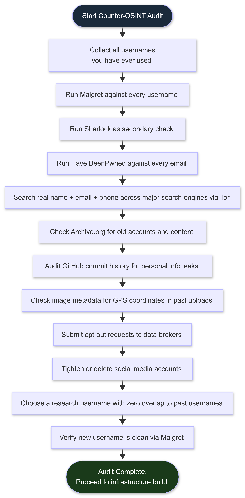

</td></tr></table>
</div>

---

### 4.2 Username Audit Tools

**Maigret** is the current primary tool for username presence auditing. It searches 3,000+ platforms, generates structured reports (HTML, PDF, JSON, CSV), and has significantly better false-positive filtering than its predecessors.

```bash
# Install Maigret
pip3 install maigret

# Basic scan: check a username across all supported sites
maigret your_username

# Generate an HTML report
maigret your_username --html --folderoutput ./maigret_report

# Scan multiple usernames at once
maigret username1 username2 username3

# Use Tor for the scan
maigret your_username --tor-proxy socks5://127.0.0.1:9050
```

Documentation: https://github.com/soxoj/maigret

**Sherlock** searches approximately 300 platforms. Use as a secondary check:
```bash
git clone https://github.com/sherlock-project/sherlock
cd sherlock
pip3 install -r requirements.txt
python3 sherlock your_username
```

**WhatsMyName** provides a web interface for quick checks without local installation: https://whatsmyname.app

Run all three tools against every username you have ever used. Document results completely.

---

### 4.3 Email and Identity Exposure Audit

```bash
# Check all email addresses you have used against known breach databases
# Website: https://haveibeenpwned.com
# Do this over Tor Browser -- do not reveal your real IP while checking your own emails

# Check GitHub commit history for exposed personal information
# If you have ever committed code to GitHub, your email may be in commit history
git log --all --format="%ae %ce" | sort -u

# Audit archive.org for old accounts
# Search: site:web.archive.org [your username]
# Also search: site:archive.org [your email]

# Check image metadata: if you have posted images online,
# check whether they contained GPS coordinates before you shared them
exiftool your_image.jpg | grep -i "gps\|location\|lat\|lon"
```

---

### 4.4 Data Broker Opt-Out

Data brokers aggregate your personal information and sell it. Law enforcement uses these services. Remove yourself from them.

**Priority opt-out targets (United States):**
- Spokeo: https://www.spokeo.com/optout
- WhitePages: https://www.whitepages.com/suppression-requests
- BeenVerified: https://www.beenverified.com/faq/opt-out
- MyLife: https://www.mylife.com/ccpa/index.pubview
- Intelius: https://www.intelius.com/opt-out
- PeopleFinder: https://www.peoplefinder.com/optout.php
- Radaris: https://radaris.com/page/how-to-remove
- FastPeopleSearch: https://www.fastpeoplesearch.com/removal
- TruthFinder: https://www.truthfinder.com/opt-out/

**Time investment:** 4-8 hours for manual opt-out of major brokers.  
**Automated alternative:** DeleteMe (~$129/year) automates the process and monitors for re-listing.

**Important:** Data brokers re-list you over time. Set a calendar reminder to repeat this audit every 6 months.

---

### 4.5 Social Media Audit

For each social media account you own:
- Tighten privacy settings to maximum
- Remove location data from all posts
- Remove photos that contain GPS metadata (check with exiftool first)
- Remove posts that reveal your location, employer, or daily patterns
- Consider complete deletion of accounts you no longer use actively
- Download your account data archive before deleting (contains everything the platform knows about you)

---

## 5. THREAT MODELING: THINK BEFORE YOU ACT

> Threat modeling is the practice of thinking clearly about who might come after you, what they want, what they can do, and how to make their job harder. It prevents both paranoia (doing too much) and negligence (doing too little).

---

### 5.1 The Five Questions

**Question 1: What do I need to protect?**

Be specific. Not "my privacy" (too vague). Name the actual assets:
- Your legal identity (name, address, government ID linkage)
- Your physical location
- The content of your research
- Your operational tools and infrastructure
- Your associations and collaborators
- Your financial activity
- Your communication history
- Your past activity (old accounts, old research)

**Question 2: Who am I protecting it from?**

| Adversary | Capability | Realistic for Most Researchers? |
|---|---|---|
| Platform abuse teams | See your activity on their platform; ban accounts | Yes, most common |
| Corporate security teams (SOC, IR) | Log traffic, detect intrusions, correlate events | Yes, for anyone hitting enterprise targets |
| Law enforcement (local, national) | Subpoena providers, seize hardware, compel testimony | Yes, for unauthorized activity |
| Intelligence agencies (NSA, GCHQ) | Mass surveillance, traffic correlation, classified capabilities | No, unless your work is nation-state-relevant |
| Rival operators | Variable tools and motivations | Situational |
| OSINT researchers / journalists | Open-source tools, social graph analysis | Possible if you are publicly active |

Most security researchers' realistic adversary: **platform abuse teams** and **corporate security teams**. Not NSA. Calibrating to the right adversary determines what protection you actually need. Paranoia about NSA-level adversaries wastes time and creates OPSEC friction that you will skip under pressure.

**Question 3: How likely is it that I need to protect it?**

A bug bounty hunter doing authorized research on HackerOne targets has a very different risk profile than someone testing on unauthorized targets. Be honest about your actual activity level.

**Question 4: How bad are the consequences if protection fails?**

- Platform ban / account suspension: minor, recoverable
- Doxing / public exposure of identity: significant, partially recoverable
- Civil lawsuit from a target organization: serious, expensive
- Criminal charges, arrest, prosecution: severe, life-altering
- Physical danger: context-dependent

**Question 5: How much friction am I willing to accept?**

Every layer of OPSEC adds friction. Tor is slow. Separate devices are inconvenient. Monero transactions take time. The friction you are not willing to accept will be the layer you skip under pressure. Be honest about your limits and design your OPSEC around them. An imperfect system you use consistently beats a perfect system you abandon when inconvenient.

---

### 5.2 The Threat Model Process

<div align="center">
<table><tr><td>



</td></tr></table>
</div>

---

### 5.3 Adversary Calibration Examples

```
Scenario A: Bug bounty researcher on authorized HackerOne targets

Realistic adversary: Platform abuse team (if you violate scope)
Realistic adversary: Corporate SOC at the target (if you trigger alerts)
NOT realistic adversary: NSA, GCHQ

Appropriate protections:
  - Separate research identity (username, email)
  - VPN on research machine
  - Stay inside program scope
  - Document your testing thoroughly

Overkill for this scenario (save for higher-risk work):
  - Full Qubes + Whonix stack
  - Monero-purchased VPS
  - Air-gapped hardware

---

Scenario B: Testing unauthorized targets, learning advanced tradecraft

Realistic adversary: Law enforcement with subpoena power
Realistic adversary: The organization's IR team correlating logs

Appropriate protections: Full stack. Everything in this phase. No exceptions.
The redirector architecture. The Monero infrastructure. The Qubes setup.
Tor for every connection. Communication security fully implemented.
```

---

## 6. COMMUNICATION SECURITY: THE NUMBER ONE ARREST VECTOR

> If one section in this phase saves you, it is this one. More operators have been caught through communication records than through any technical failure. The Scattered Spider crew had excellent technical tradecraft. Their communications were their downfall.

---

### 6.1 The Platform Threat Spectrum (2027)

| Platform | Encryption | Server Logs | Law Enforcement Cooperation | Risk Level |
|---|---|---|---|---|
| SMS | None at carrier level | Extensive | Cooperative | Very High |
| WhatsApp | E2E content (Signal protocol) | Metadata logged extensively | Cooperative on metadata | High |
| Telegram (standard chats) | None -- server can read content | Logs everything | Now actively cooperative post-2024 | Very High |
| Telegram (Secret Chats, 1:1 only) | E2E | Minimal for Secret Chats only | Cannot provide Secret Chat content | High (metadata remains) |
| Discord | None | Extensive | Very cooperative | Very High |
| Signal | E2E + sealed sender | Account creation date and last connect only | Cannot provide message content | Low |
| SimpleX Chat | E2E, no user IDs | No central server | No data to provide | Very Low |
| Briar | E2E + Tor routing | No central server | No data to provide | Very Low |
| Session | E2E, no phone number | Decentralized | No identifying data | Low |
| Matrix/Element (self-hosted) | E2E optional | Depends on your server | Only your server's logs | Very Low (if self-hosted) |
| ProtonMail | E2E between Proton users | Metadata logged | Swiss law -- some cooperation | Medium |

---

### 6.2 Telegram: Hard Prohibition (2027)

**Do not use Telegram for anything operational. At any level.**

In August 2024, Pavel Durov was arrested in France. The consequences for Telegram users are permanent:

- Durov publicly stated in September 2024 that Telegram will provide user data (IP addresses, phone numbers) to law enforcement upon valid legal requests in most jurisdictions
- Telegram has since complied with thousands of data requests across EU, UK, and US law enforcement
- Telegram Secret Chats are E2E encrypted for 1:1 conversations only -- **no group Secret Chats exist**
- All standard chats (including all group chats) are stored on Telegram's servers in a form Telegram can read
- Telegram's standard chat encryption uses their own MTProto implementation, not the Signal Protocol

The pre-2024 assumption that Telegram had a policy of non-cooperation is no longer valid. Treat Telegram as equivalent to WhatsApp or Discord for law enforcement cooperation purposes.

**For operational communications:** Signal, SimpleX Chat, Briar, or self-hosted Matrix. Nothing else.

---

### 6.3 Signal: Primary Secure Communications Tool

Signal is the gold standard for operational communications.
- End-to-end encrypted using the Signal Protocol
- Sealed sender: the Signal server does not know who sent a message to whom
- Disappearing messages: configure them; use the shortest timer appropriate to your situation
- Minimal metadata: the only data Signal has provided when served legal process is account creation date and last connection date

Signal's weakness: requires a phone number to register. Use a VoIP number (JMP.chat, accepting Monero) registered over Tor, not your real number.

```
Signal configuration for operational use:

Settings > Privacy:
  Screen lock: ON
  Screen security (prevent screenshots): ON
  Incognito keyboard: ON

Settings > Privacy > Advanced:
  Always relay calls: ON (prevents IP exposure to call recipients)
  Sealed sender: ON (default; keep it on)

For every conversation:
  Disappearing messages: 1 week maximum; 1 day preferred; 1 hour for sensitive work

Settings > Notifications:
  Show: "No name or message"
```

---

### 6.4 SimpleX Chat, Session, and Briar

**SimpleX Chat (no user IDs at all):**
SimpleX has no user IDs. No phone numbers, no usernames, no email addresses. Each conversation generates a new queue identifier. The server relays messages but cannot link conversations together. Best for communications where zero identity linkage is required.
Download: https://simplex.chat

**Session (no phone number required):**
Session uses a decentralized network to route messages. No phone number required at registration.
Download: https://getsession.org

**Briar (Tor-routed, works offline):**
Briar routes all communications through Tor. Works over Bluetooth and WiFi without internet access if needed.
Download: https://briarproject.org

---

### 6.5 GPG for Email

If you must use email for sensitive communication, GPG encryption is required. Not optional.

```bash
# Generate a GPG key pair for your research identity
gpg --full-generate-key
# Choose: RSA and RSA, 4096 bits, 1 year expiry
# Use your research identity name and email, NOT your real name

# Export your public key to share with others
gpg --armor --export your_research_email@proton.me > research_pubkey.asc

# Import someone else's public key
gpg --import their_pubkey.asc

# Encrypt a message to a recipient
gpg --encrypt --recipient their_email@domain.com --armor message.txt

# Decrypt a message sent to you
gpg --decrypt encrypted_message.asc

# Sign a message (proves it came from you)
gpg --sign --armor message.txt

# Verify a signed message
gpg --verify signed_message.asc
```

---

## 7. PHONE AND MOBILE OPSEC

> Your phone is the most dangerous device you own for OPSEC purposes. It knows your location 24/7. It has your real identity. It runs operating systems designed for data collection by manufacturers who cooperate with law enforcement.

---

### 7.1 Why Phones Are a Critical OPSEC Vector

- **Location data:** Cell towers triangulate your position continuously. This data is retained by carriers and subject to legal requests. You cannot be near a sensitive operation with your real phone.
- **IMEI tracking:** Your device's IMEI (hardware identifier) is broadcast to every cell tower it connects to and logged. Swapping SIMs does not change your IMEI.
- **IMSI catchers (Stingrays):** Law enforcement and sophisticated adversaries deploy IMSI catchers that impersonate cell towers. They capture the IMEI and IMSI of all phones in range. Stingrays are deployed near targets of interest, at protests, and in court buildings.
- **Probe requests:** When WiFi is scanning, your device broadcasts its MAC address and a list of previously connected SSIDs. Passive scanners in public spaces can log this.
- **Cloud backup:** By default, iOS and Android back up to Apple/Google cloud. Law enforcement can subpoena these backups with a standard court order.
- **Biometric compulsion:** In many jurisdictions, law enforcement can legally compel you to unlock a device with fingerprint or face. A PIN may carry Fifth Amendment protection in the US (actively litigated; varies by jurisdiction). Biometrics generally do not.

---

### 7.2 IMSI Catchers: What You Need to Know

An IMSI catcher is a device that impersonates a cell tower. Your phone connects to it automatically. It captures:
- Your IMEI (hardware identifier: permanent to the device)
- Your IMSI (identifier linked to your SIM)
- Your location relative to the catcher's position
- In some configurations: call content and SMS content

**Defense:**
- GrapheneOS + LTE-only mode (disables 2G, which has no protection against IMSI catchers)
- Faraday bag when not in active use in sensitive locations
- Leave your phone away from sensitive locations entirely when possible

---

### 7.3 GrapheneOS: The Operational Android

GrapheneOS is a hardened Android operating system for Google Pixel devices. It is the current best option for an operational phone.

```
Installation procedure:

1. Buy a Google Pixel (current generation).
   Buy unlocked, with cash if possible.

2. Enable OEM unlock:
   Settings > Developer Options > OEM Unlocking

3. Use the web installer: https://grapheneos.org/install/web
   The installer handles everything automatically.

4. After installation:
   - Do NOT sign in with any Google account
   - Install F-Droid: https://f-droid.org
   - If you need a specific Google Play app:
     Settings > Apps > Install Google Play (sandboxed, minimal permissions)

Key security settings after installation:

   PIN instead of fingerprint/face
     (biometric compulsion risk in most jurisdictions)

   Auto reboot: 18 hours
     (locks the device regularly if left unattended)

   Duress PIN:
     Settings > Security > Screen lock > Duress password
     (wipes the device when a specific PIN is entered;
      for when you are compelled to unlock under physical or legal pressure)

   LTE-only mode: disable 2G
     Settings > Network and internet > SIMs > Preferred network type
     Set to LTE only. This removes 2G fallback that IMSI catchers exploit.

   USB peripherals: off when not in use
     (reduces USB attack surface)

   Location services: off by default; per-app permission configured

   Cloud backup: disabled (GrapheneOS does not back up to Google by default)

   Sensors: disable camera and microphone permissions for apps that do not need them

   Exploit protection: enabled by default; do not disable
```

---

### 7.4 SIM Card Acquisition Without Identity Linkage

**United States:** Prepaid SIM cards can be purchased with cash at convenience stores. Major prepaid providers often activate without requiring ID. Purchase with cash at a store not near your home.

**For Signal registration:** Use a VoIP number rather than a real SIM.
- JMP.chat accepts Monero and provides XMPP-based phone numbers for SMS reception
- MySudo provides compartmentalized phone numbers
- Register any VoIP service over Tor

---

### 7.5 Device Compartmentalization Rules

```
Rule 1: Never carry personal phone and operational phone simultaneously
        to a sensitive location.
        Both powered on near each other: cell tower logs associate them
        to the same physical location, linking your operational device
        to your real identity.

Rule 2: Power off your personal phone before powering on your operational
        phone in any sensitive location. Or leave your personal phone at home.

Rule 3: Faraday bags for high-sensitivity situations.
        A Faraday bag blocks all radio signals (cell, WiFi, Bluetooth, GPS).
        Cost: $20-60.
        TEST before trusting: put your phone in the bag and call it.
        If it rings, the bag is faulty.
        Test with cell, WiFi, and Bluetooth separately.

Rule 4: Disable features you do not need.
        Bluetooth: off when not in use
        WiFi: off when not in use
        Location services: off by default
        AirDrop / Nearby Share: off

Rule 5: Physical camera control.
        Camera covers are cheap. Use them.
        On GrapheneOS: revoke camera and microphone permissions
        from apps that do not need them.
```

---

## 8. ANONYMOUS INFRASTRUCTURE SETUP

> The goal: stand up infrastructure that cannot be trivially attributed to you. "Trivially" is the operative word. The realistic adversary is a corporate security team or law enforcement with standard legal tools, not a classified intelligence program.

---

### 8.1 The Payment Chain

<div align="center">
<table><tr><td>


</td></tr></table>

Every step matters. Skipping any step weakens the entire chain.

</div>

---

### 8.2 VPS Providers That Accept Monero

**Never use for anonymous operations:** AWS, GCP, Azure, DigitalOcean, Linode, Vultr.
Reason: US-based or US-infrastructure presence, fast law enforcement compliance, require verified payment.

| Provider | Jurisdiction | Accepts XMR | Notes |
|---|---|---|---|
| Njalla | Sweden | Yes | Privacy-focused; holds domain in their name; founded by Pirate Bay co-founder Peter Sunde |
| 1984 Hosting | Iceland | Yes | Strong Icelandic privacy laws; historically slower MLAT cooperation |
| BuyVM | British Virgin Islands | Yes | BVI jurisdiction adds legal friction |
| Privex | Trinidad and Tobago | Yes | Privacy-focused |

---

### 8.3 VPS Setup Procedure

```
1. Purchase VPS with Monero only.
   Never use a credit card, PayPal, bank transfer, or Bitcoin directly.

2. Use Tor Browser to access the provider and complete the purchase.
   Do not use your real IP for initial account creation.

3. Connect to your VPS only through Tor or an anonymously-purchased VPN.
   Never from your home IP. Not once. Not even "just to check something quickly."

4. SSH key authentication only. No passwords.
```

```bash
# Generate an Ed25519 SSH key pair
# Ed25519 is preferred over RSA: smaller key, faster, equivalently secure
ssh-keygen -t ed25519 -C "ops_key"
# Keep the private key on an encrypted volume
# Add the public key to VPS authorized_keys
```

---

### 8.4 VPS Hardening Script

```bash
#!/bin/bash
# Run as root after first login to a new VPS
# Context: Ubuntu 24.04 LTS

# Create non-root operator user
useradd -m -s /bin/bash operator
mkdir -p /home/operator/.ssh
cp ~/.ssh/authorized_keys /home/operator/.ssh/
chown -R operator:operator /home/operator/.ssh
chmod 700 /home/operator/.ssh
chmod 600 /home/operator/.ssh/authorized_keys
usermod -aG sudo operator

# Disable root SSH login and password authentication
sed -i 's/^PermitRootLogin.*/PermitRootLogin no/' /etc/ssh/sshd_config
sed -i 's/^PasswordAuthentication.*/PasswordAuthentication no/' /etc/ssh/sshd_config

# Move SSH to a high non-standard port (pick a random port in the 49152-65535 range)
# Replace 54231 with your chosen port
SSH_PORT=54231
sed -i "s/^#Port 22/Port ${SSH_PORT}/" /etc/ssh/sshd_config

# Firewall: deny all incoming, allow only your chosen SSH port
apt update && apt install -y ufw unattended-upgrades fail2ban

ufw default deny incoming
ufw default allow outgoing
ufw allow ${SSH_PORT}/tcp comment 'SSH non-standard port'
ufw --force enable

# Automatic security updates
dpkg-reconfigure --priority=low unattended-upgrades

# fail2ban: block repeated failed SSH attempts
systemctl enable fail2ban
systemctl start fail2ban

# Reduce SSH verbosity in logs
sed -i 's/^LogLevel.*/LogLevel QUIET/' /etc/ssh/sshd_config

# Disable SSH banner that reveals OS version
echo "DebianBanner no" >> /etc/ssh/sshd_config

# Restrict SSH to specific ciphers (removes weak algorithms)
cat >> /etc/ssh/sshd_config << 'SSHEOF'
KexAlgorithms curve25519-sha256,curve25519-sha256@libssh.org
Ciphers chacha20-poly1305@openssh.com,aes256-gcm@openssh.com
MACs hmac-sha2-256-etm@openssh.com,hmac-sha2-512-etm@openssh.com
SSHEOF

systemctl restart sshd
echo "Hardening complete. Log out and reconnect as operator on port ${SSH_PORT}."
```

**Note on port selection:** A high random port (49152-65535) is significantly harder to discover via automated scanning than port 22 or 2222. Pick a random number in that range and use it consistently. For maximum stealth on the port, consider adding port knocking (fwknop package): the port remains completely closed until a specific sequence of UDP packets arrives, after which it opens briefly for your SSH connection.

---

### 8.5 Domain Registration

```
Option 1: Njalla (recommended)
  Njalla registers domains in their own name and resells access to you.
  Your identity never appears in WHOIS records.
  Accepts Monero.
  https://njal.la/domains/

Option 2: Epik
  Accepts crypto, provides WHOIS privacy.
  https://www.epik.com
```

**Domain selection strategy for C2:**

```
1. Aged domains blend better. A domain with 1+ year of history has:
   - Existing DNS history matching its claimed category
   - Less suspicious traffic patterns
   - Potentially cached categorization in corporate proxies

2. Category-appropriate domains blend into corporate traffic.
   Target categories: IT/Computers, Business/Finance, Technology, SaaS
   Avoid: "Uncategorized" (triggers scrutiny), "Anonymizer/VPN" (blocked)

3. Pre-purchase checks:
   - Web Archive history: https://web.archive.org
   - Blocklist check: https://urlvoid.com
   - DNS reputation: https://mxtoolbox.com/SuperTool.aspx

4. Categorization requests to bypass corporate proxy filters:
   - Bluecoat/Symantec: https://sitereview.bluecoat.com
   - Cisco Talos: https://talosintelligence.com/reputation
   - Fortinet: https://www.fortiguard.com/webfilter
```

---

### 8.6 Redirector Architecture

The most important infrastructure principle: **your real teamserver IP must never be exposed to a target network.** Use a sacrificial redirector as the public-facing layer.

<div align="center">
<table><tr><td>

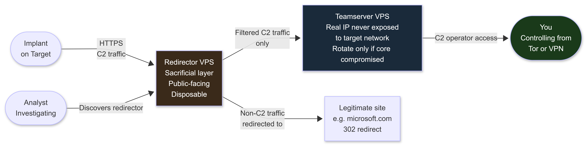

</td></tr></table>

If the redirector gets burned: rotate it. Spin up a new VPS, new domain. Teamserver stays clean.

</div>


**Apache mod_rewrite redirector:**

```bash
apt install -y apache2
a2enmod rewrite proxy proxy_http ssl headers

cat > /etc/apache2/sites-available/redirector.conf << 'EOF'
<VirtualHost *:443>
    ServerName your-c2-domain.com
    SSLEngine on
    SSLCertificateFile /etc/letsencrypt/live/your-c2-domain.com/fullchain.pem
    SSLCertificateKeyFile /etc/letsencrypt/live/your-c2-domain.com/privkey.pem

    RewriteEngine On
    # Only proxy requests matching your C2 URI pattern
    RewriteCond %{REQUEST_URI} ^/api/v1/update.*$ [NC]
    RewriteRule ^(.*)$ http://TEAMSERVER_IP%{REQUEST_URI} [P,L]

    # Non-C2 traffic: redirect to a legitimate site (no attribution)
    RewriteRule ^(.*)$ https://www.microsoft.com/ [L,R=302]

    # Strip identifying headers
    RequestHeader unset X-Forwarded-For
    Header always unset X-Powered-By
    Header always unset Server
</VirtualHost>
EOF

a2ensite redirector.conf
systemctl reload apache2
```

**Nginx redirector alternative:**

```nginx
server {
    listen 443 ssl;
    server_name your-c2-domain.com;

    ssl_certificate /etc/letsencrypt/live/your-c2-domain.com/fullchain.pem;
    ssl_certificate_key /etc/letsencrypt/live/your-c2-domain.com/privkey.pem;

    # C2 traffic: proxy to teamserver
    location ~* ^/(api|sync|update)/ {
        proxy_pass http://TEAMSERVER_IP;
        proxy_set_header Host $host;
        proxy_hide_header X-Powered-By;
    }

    # Non-C2 traffic: redirect to legitimate site
    location / {
        return 302 https://www.google.com/;
    }
}
```

**Let's Encrypt certificate:**

```bash
apt install -y certbot python3-certbot-apache
certbot --apache -d your-c2-domain.com

# Automatic renewal (add to crontab)
echo "0 12 * * * certbot renew --quiet" | crontab -
# Verify renewal works
certbot renew --dry-run
```

---

### 8.7 Onion Service C2: The Strongest Infrastructure Option

Running your C2 teamserver as a Tor hidden service (.onion) completely eliminates the exit-to-entry traffic correlation attack. There is no exit node, so no one can observe both the entry traffic and the destination simultaneously.

<div align="center">
<table><tr><td>

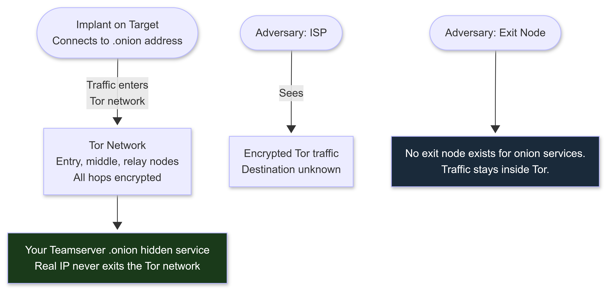

</td></tr></table>
</div>

```bash
# Configure a Tor hidden service on your teamserver VPS
# Edit /etc/tor/torrc:
nano /etc/tor/torrc

# Add these lines (replace 8080 with your C2 port):
HiddenServiceDir /var/lib/tor/c2_service/
HiddenServicePort 80 127.0.0.1:8080
HiddenServiceVersion 3

# Restart Tor
systemctl restart tor

# Get your .onion address
cat /var/lib/tor/c2_service/hostname
# Output: [something].onion
# This is your hidden service address

# Your implants connect to [something].onion:80
# Traffic routes through Tor entirely; your VPS IP is never exposed to the target
```

**Tradeoffs:**
- Slower than clearnet redirector (Tor latency: 100-500ms per hop)
- Implant must have Tor bundled or route through Tor
- .onion addresses are long and not embeddable in some payload types
- For Phase 4 C2 work: consider a hybrid setup with clearnet redirector for speed and .onion for sensitive operations

---

### 8.8 Home Network Isolation

<div align="center">
<table><tr><td>


</td></tr></table>
</div>

**Option A: Dedicated physical research router (recommended, ~$40)**

Purchase a TP-Link Archer A7 or similar running OpenWrt. Connect it to your home network separately from your personal router. Configure Mullvad or IVPN at the router level (OpenWrt LuCI VPN package). All lab traffic exits through the VPN automatically.

Also consider configuring a local recursive DNS resolver (unbound) on your research router to avoid DNS leaks at the router level:

```bash
# Install unbound on OpenWrt research router
opkg install unbound-daemon

# Configure /etc/unbound/unbound.conf for local recursive DNS
# This queries DNS root servers directly, bypassing any upstream DNS provider
cat > /etc/unbound/unbound.conf << 'EOF'
server:
    interface: 127.0.0.1
    port: 5335
    do-ip4: yes
    do-ip6: no
    do-udp: yes
    do-tcp: yes
    root-hints: "/etc/unbound/root.hints"
    harden-dnssec-stripped: yes
    use-caps-for-id: no
    edns-buffer-size: 1232
    prefetch: yes
    num-threads: 1
    so-rcvbuf: 1m
EOF

# Point your router's dnsmasq to unbound on port 5335
```

**Option B: VLAN segmentation**
Supported by enterprise-grade home routers (Ubiquiti UniFi, Netgear Orbi Pro). Create separate VLANs for personal, research, and analysis traffic.

**VM networking rules (non-negotiable):**

```
NAT mode: VM accesses internet through the host's network stack.
  If the host is on a VPN, VM traffic goes through the VPN.
  Use for most research VMs.

Bridged mode: VM appears as a separate device on your home network.
  Your ISP sees the VM's traffic directly.
  NEVER use bridged mode for research VMs.

Host-only mode: VM can only communicate with the host. No internet.
  Use for: malware analysis VMs, sandboxes, isolated test environments.

Internal network mode: VMs communicate with each other only.
  Use for: multi-machine lab scenarios (victim and attacker VMs on same network).
```

---

### 8.9 Infrastructure Hygiene Rules

```
Rule 1: One operation, one VPS, one domain.
  Never reuse infrastructure across operations.
  A burned VPS in one operation does not contaminate another if they are separate.

Rule 2: Keep an encrypted log of all infrastructure you have stood up and torn down.
  Store locally only. Not in any cloud service.
  Include: VPS IP, domain, creation date, teardown date, purpose.

Rule 3: Tear down infrastructure after operations.
  Do not leave live infrastructure running with no active purpose.
  It accumulates log data and provides a pivot point if discovered later.

Rule 4: Never access your teamserver directly. Always through a redirector or jump box.

Rule 5: Document your own infrastructure so you can identify it if you see it in logs.
  Know your own IP ranges. Know your own domains. Know your own certificates.

Rule 6: Monitor warrant canaries for your VPS providers.
  Mullvad, ProtonVPN, and privacy-focused VPS providers maintain warrant canaries
  (public statements that they have received no subpoenas or gag orders).
  If the canary disappears or changes wording, treat it as a signal that the provider
  has been served legal process.
  Check monthly: https://www.eff.org/pages/warrant-canary-faq
```

---
## 9. ANONYMIZATION STACK: VPN, TOR, AND CHAINING

> Understanding what each layer protects, what each layer does not protect, and how to chain them correctly is the difference between real anonymization and false confidence.

---

### 9.1 Stack Architecture

<div align="center">
<table><tr><td>


</td></tr></table>
</div>

---

### 9.2 VPN Selection (2027)

**What a VPN does:** Hides your traffic from your ISP and replaces your IP with the VPN server's IP in logs. Shifts trust from your ISP to your VPN provider.

**What a VPN does NOT do:** Anonymize you completely. The VPN provider can see your IP and your traffic (if not further encrypted). Choose a provider with no-log policies, independent audits, and a jurisdiction that provides legal friction.

| Provider | Location | Accepts XMR | Audit Status | Key Notes |
|---|---|---|---|---|
| Mullvad | Sweden | Yes | Multiple independent audits | No email required; account number only; best for privacy |
| IVPN | Gibraltar | Yes | Independently audited | Minimal data collection; multi-hop available |
| ProtonVPN | Switzerland | Yes | Independently audited; open source | Transparent warrant canary; free tier available |
| AirVPN | Italy | Yes | Community-audited | Port forwarding; advanced configuration options |

**WireGuard configuration (recommended protocol):**

```bash
# Install WireGuard
apt install -y wireguard

# Download your provider's WireGuard config file from your VPN account dashboard
# Copy it to /etc/wireguard/wg0.conf

# Connect to VPN
wg-quick up wg0

# Disconnect
wg-quick down wg0

# Autostart on boot (for research machine)
systemctl enable wg-quick@wg0
```

**Kill switch (mandatory):**

```bash
# Add PostUp and PreDown rules to your WireGuard config
# to block all traffic if the VPN drops (critical: prevents IP leak on disconnect)

[Interface]
PrivateKey = YOUR_PRIVATE_KEY
Address = 10.x.x.x/32
DNS = 10.x.x.1
PostUp = iptables -A OUTPUT ! -o %i -m mark ! --mark $(wg show %i fwmark) -m addrtype ! --dst-type LOCAL -j REJECT
PreDown = iptables -D OUTPUT ! -o %i -m mark ! --mark $(wg show %i fwmark) -m addrtype ! --dst-type LOCAL -j REJECT

[Peer]
# ... rest of peer config
```

**Test the kill switch:** Disconnect the VPN manually. Verify all internet traffic stops (`curl ifconfig.me` should fail or time out). If it returns your real IP, the kill switch is not working.

---

### 9.3 Tor Installation and Configuration

Tor routes your traffic through at least three relays (entry, middle, exit), encrypting at each hop so no single relay knows both who you are and what you are accessing.

```bash
# Install Tor
apt install -y tor

# Start Tor and enable on boot
systemctl start tor
systemctl enable tor

# Verify Tor is running
ss -tlnp | grep 9050
# Should show: LISTEN on 127.0.0.1:9050

# Configure proxychains4 to route through Tor
nano /etc/proxychains4.conf
# Set these options:
#   strict_chain
#   proxy_dns
#   [ProxyList]
#   socks5 127.0.0.1 9050

# Test Tor routing
proxychains4 curl https://check.torproject.org | grep Congratulations
# Should return: "Congratulations. This browser is configured to use Tor."

# DNS leak test via Tor
proxychains4 curl https://dnsleaktest.com/json
# No ISP DNS servers should be visible
```

---

### 9.4 Chaining Configurations

**VPN to Tor (recommended for most use cases):**

```
Your machine --> VPN --> Tor network --> Destination

Protects from: ISP knowing you use Tor (in countries where Tor use is suspicious)
               Tor entry node knowing your real IP (they see VPN IP instead)
               VPN provider knowing your final destination

Your ISP sees: Encrypted traffic to VPN
VPN provider sees: Your IP + Tor traffic (if no-log: nothing retained)
Tor entry node sees: VPN IP (not your real IP)
Destination sees: Tor exit node IP
```

**Tor to VPN (specific use cases only):**

```
Your machine --> Tor --> VPN --> Destination

Use case: when your destination blocks Tor exits
Risk: the VPN provider sees the content of your traffic
      (though they still cannot see your real IP, since it arrives via Tor)
```

**Proxychains with Tor (routing any tool through Tor):**

```bash
proxychains4 nmap -sT -Pn target.example.com
proxychains4 curl https://target.example.com
proxychains4 python3 exploit.py
proxychains4 sqlmap -u "https://target.example.com/?id=1"
```

---

### 9.5 Tor Bridges and Obfuscation (For Restricted Environments)

In some environments, Tor is blocked or its use is detectable:
- Countries with deep packet inspection (China, Iran, Russia, Belarus)
- Corporate networks that block Tor exit node IPs
- ISPs that flag Tor traffic signatures

Tor bridges are unlisted relays that are harder to block. Obfuscation protocols transform Tor traffic to look like ordinary HTTPS or other allowed traffic.

```bash
# Get bridges from Tor Project:
# Method 1: https://bridges.torproject.org -- request obfs4 bridges
# Method 2: Email bridges@torproject.org from Gmail or Riseup
#   Subject line: get transport obfs4
# Method 3: Within Tor Browser:
#   Settings > Connection > Use bridges > Request bridges from torproject.org

# Install obfs4proxy:
apt install -y obfs4proxy

# Configure bridges in torrc:
nano /etc/tor/torrc

# Add these lines:
UseBridges 1
ClientTransportPlugin obfs4 exec /usr/bin/obfs4proxy
Bridge obfs4 IP:PORT FINGERPRINT cert=XXXXXX iat-mode=0
# (replace with your actual bridge line from bridges.torproject.org)

systemctl restart tor
```

| Obfuscation Protocol | Evades | Limitation |
|---|---|---|
| obfs4 | Basic DPI that recognizes Tor traffic patterns | Nation-state active probing at scale |
| meek | ISP-level blocking via CDN (looks like Microsoft/Amazon traffic) | Very slow; high-bandwidth scenarios impractical |
| Snowflake | ISP-level blocking using WebRTC (appears as browser-to-browser comms) | Nation-state active probing with large resources |
| WebTunnel | Looks like standard HTTPS to a website; hardest to block without blocking that site | Active measurement campaigns |

For most threat models: **obfs4 bridges** are sufficient.

---

### 9.6 DNS Leak Prevention

A DNS leak occurs when DNS queries bypass your VPN or Tor tunnel and go directly to your ISP's DNS servers, revealing what domains you are visiting.

```bash
# Test for DNS leaks (run through Tor Browser or proxychains)
# https://dnsleaktest.com
# https://ipleak.net

# Configure encrypted DNS on your research OS
# Edit /etc/systemd/resolved.conf:
[Resolve]
DNS=1.1.1.1#cloudflare-dns.com 9.9.9.9#dns.quad9.net
DNSOverTLS=yes
DNSSEC=yes

systemctl restart systemd-resolved

# Alternative: dnscrypt-proxy for DNS-over-HTTPS
apt install -y dnscrypt-proxy
systemctl enable dnscrypt-proxy
systemctl start dnscrypt-proxy
```

---

### 9.7 End-to-End Stack Verification

```bash
# Step 1: Verify your base IP (before VPN or Tor)
curl https://ifconfig.me
# Record this. This is what you MUST never reveal.

# Step 2: Connect VPN. Verify IP changes.
wg-quick up wg0
curl https://ifconfig.me
# Should show VPN server IP, not your real IP

# Step 3: Route through Tor
systemctl start tor
proxychains4 curl https://ifconfig.me
# Should show a Tor exit node IP

# Step 4: Test DNS leaks through Tor
proxychains4 curl -s https://dnsleaktest.com/json | python3 -m json.tool
# Should show Tor exit node DNS; no ISP-identifying DNS

# Step 5: Test for WebRTC leaks (browser-based)
# Open Tor Browser and visit: https://browserleaks.com/webrtc
# Should show no IP leak

# Step 6: Full Tor confirmation
proxychains4 curl https://check.torproject.org | grep Congratulations

# Step 7: Verify VPS access chain
# After connecting through VPN + Tor:
proxychains4 ssh -p YOUR_SSH_PORT operator@your-vps-domain.com
# From the VPS: check what the SSH connection shows
who   # shows last-hop IP (Tor exit node, not your real IP)
```

---

## 10. BROWSER FINGERPRINTING: YOU ARE BEING IDENTIFIED

> Every browser leaves a fingerprint: a combination of characteristics that, taken together, can identify you across sessions even without cookies. Understanding the mechanism, not just the fix, is what makes your countermeasures reliable.

---

### 10.1 How Browser Fingerprinting Works: The Mechanism

When your browser loads a page, JavaScript can query dozens of APIs and compile a profile. The key insight is that **most fingerprinting signals are byproducts of legitimate browser features** -- your graphics hardware, audio subsystem, and installed fonts are exposed not because browsers are malicious, but because web applications use them legitimately.

**Canvas Fingerprinting -- How It Actually Works:**

When JavaScript calls `canvas.toDataURL()` or `canvas.getImageData()`, the browser renders text or shapes using the GPU, font rendering engine, and anti-aliasing algorithms of the specific machine. Tiny variations in GPU firmware, driver version, and OS rendering stack produce pixel-level differences that are consistent for a given machine and highly unique across machines.

```javascript
// What a fingerprinting script does (simplified)
const canvas = document.createElement('canvas');
const ctx = canvas.getContext('2d');

// Draw text that exercises font rendering and GPU anti-aliasing
ctx.textBaseline = 'top';
ctx.font = '14px Arial';
ctx.fillStyle = '#f60';
ctx.fillText('BrowserFingerprint', 2, 2);

// Draw shapes that exercise the GPU rendering pipeline
ctx.fillStyle = 'rgba(102, 204, 0, 0.7)';
ctx.beginPath();
ctx.arc(50, 50, 50, 0, Math.PI * 2, true);
ctx.fill();

// Extract the pixel data as a hash
const fingerprint = canvas.toDataURL();
// This string is consistent for your machine and different from everyone else's
```

**AudioContext Fingerprinting -- How It Actually Works:**

The Web Audio API creates audio processing graphs. When audio is processed through an `OscillatorNode` and an `AnalyserNode`, the output waveform varies based on the host's audio hardware and OS audio stack.

```javascript
// What an audio fingerprinting script does (simplified)
const audioCtx = new AudioContext();
const oscillator = audioCtx.createOscillator();
const analyser = audioCtx.createAnalyser();
const gainNode = audioCtx.createGain();

gainNode.gain.value = 0; // No actual sound output
oscillator.connect(analyser);
analyser.connect(gainNode);
gainNode.connect(audioCtx.destination);

oscillator.start(0);

// Read the frequency data from the analyser
const frequencyData = new Float32Array(analyser.frequencyBinCount);
analyser.getFloatFrequencyData(frequencyData);

// Sum the values as a fingerprint
const fingerprint = frequencyData.reduce((a, b) => a + b, 0);
// This value is consistent for your machine and different from others
```

**Font Enumeration:**

JavaScript can measure the rendered dimensions of text in various fonts. If a font is installed, text in that font has different dimensions than fallback text. The complete set of installed fonts is unique per system.

```javascript
// What font enumeration looks like
const testFonts = ['Arial', 'Calibri', 'Cambria', 'Comic Sans MS', 'Georgia', 'Impact', 'Palatino'];
const installedFonts = [];
const baselineWidth = measureText('mmmmm', 'monospace');

testFonts.forEach(font => {
    // If the test width differs from baseline, the font is installed
    const testWidth = measureText('mmmmm', `${font}, monospace`);
    if (testWidth !== baselineWidth) installedFonts.push(font);
});
// The list of installed fonts is your font fingerprint
```

---

### 10.2 Complete Fingerprint Surface Table (2027)

| Fingerprint Element | What It Reveals | Uniqueness | Mitigation |
|---|---|---|---|
| User-Agent string | Browser type, version, OS | Medium (shared by others on same browser) | Standardize (Tor Browser handles this) |
| Screen resolution and color depth | Monitor configuration | Medium | Letterboxing (Tor Browser handles this) |
| Viewport size | Browser window dimensions | High (people resize windows) | Never resize Tor Browser |
| Installed fonts | System-level font set | High | Limited to standard set (Tor Browser handles this) |
| Canvas fingerprint | GPU + driver + OS rendering stack | Very High | Blocked by Tor Browser and Mullvad Browser |
| WebGL fingerprint | GPU-based rendering signature | Very High | Blocked by Tor Browser; disable via about:config |
| WebGPU fingerprint | Next-gen GPU API (more precise than WebGL; 2025+ deployment) | Extremely High | Block via about:config (see below) |
| AudioContext fingerprint | Audio subsystem signature | High | Blocked by Tor Browser |
| Time zone | Geographic location hint | Medium | Set to UTC; Tor Browser handles this |
| Language settings | Identity hint | Low alone; combined: higher | Standardize per identity |
| WebRTC IP leak | Real IP even through VPN | Critical | Disable WebRTC in all research browsers |
| Browser plugins and extensions | Each extension is unique | High | No extensions except uBlock Origin |
| Battery status API | Partially deprecated but present | Low | Disable via about:config |
| Media devices | Camera and microphone presence and labels | Medium | Revoke permissions from all sites |
| Do Not Track header | Counterintuitively: rare, makes you unique | Low-Medium | Do not enable; it makes you stand out |
| Keyboard layout | Language and region hint | Low | Set to standard layout per identity |
| Typing dynamics | Behavioral biometric (rhythm and speed) | High (on sites collecting this) | Awareness; hardware randomizer for extreme cases |

**Test your fingerprint right now:** https://coveryourtracks.eff.org

Most browsers with default settings are **uniquely identifiable** through fingerprint alone, regardless of VPN or Tor.

---

### 10.3 WebRTC IP Leak: Critical Fix

WebRTC is a browser API for real-time communications. Its ICE protocol queries your real local and public IP addresses and can bypass VPN tunnels entirely.

**Test immediately:** https://browserleaks.com/webrtc

```
Fix per browser:

Firefox:
  about:config > search "media.peerconnection.enabled" > set to false

Chrome/Chromium:
  chrome://flags/#disable-webrtc-hide-local-ips-with-mdns
  Or: Settings > Privacy and security > WebRTC > Disable non-proxied UDP

Tor Browser: WebRTC disabled by default.
Mullvad Browser: WebRTC disabled by default.
```

---

### 10.4 WebGPU Fingerprinting: The 2026-2027 Threat

WebGPU is the successor to WebGL, providing lower-level GPU access from the browser. It has been widely deployed in Chrome (since late 2023), Safari, and Firefox. WebGPU fingerprinting provides a surface that is more precise than WebGL and not yet blocked by all privacy-focused browsers.

```
Firefox (about:config):
  dom.webgpu.enabled = false

Chrome/Chromium:
  Currently no clean UI toggle.
  Use Mullvad Browser or Tor Browser instead.

Tor Browser: Blocks WebGPU by default.
Mullvad Browser: Blocks WebGPU by default.

Test: https://webgpureport.org -- if it shows GPU information, WebGPU is enabled.
```

---

### 10.5 Hardened Firefox user.js Configuration

```javascript
// Save as: ~/.mozilla/firefox/[profile_dir]/user.js
// Apply to your research Firefox profile only

// Disable WebRTC (critical -- prevents IP leak through VPN)
user_pref("media.peerconnection.enabled", false);

// Disable WebGPU (2026-2027 fingerprinting threat)
user_pref("dom.webgpu.enabled", false);

// Canvas and fingerprinting resistance (standardizes many fingerprint elements)
user_pref("privacy.resistFingerprinting", true);

// Letterboxing: standardizes viewport size to prevent viewport fingerprinting
user_pref("privacy.resistFingerprinting.letterboxing", true);

// Disable WebGL (reduces GPU fingerprinting surface)
user_pref("webgl.disabled", true);

// Disable AudioContext fingerprinting
user_pref("media.webaudio.enabled", false);

// Disable battery API
user_pref("dom.battery.enabled", false);

// Disable media device enumeration
user_pref("media.navigator.enabled", false);

// Disable telemetry entirely
user_pref("toolkit.telemetry.unified", false);
user_pref("toolkit.telemetry.enabled", false);
user_pref("datareporting.policy.dataSubmissionEnabled", false);
user_pref("toolkit.telemetry.reportingpolicy.firstRun", false);

// Disable geolocation
user_pref("geo.enabled", false);

// DNS over HTTPS
user_pref("network.trr.mode", 2);
user_pref("network.trr.uri", "https://mozilla.cloudflare-dns.com/dns-query");

// Third-party cookie isolation
user_pref("network.cookie.cookieBehavior", 1);

// First-party isolation (separate cookies/storage per origin)
user_pref("privacy.firstparty.isolate", true);

// Clear sensitive data on close
user_pref("privacy.sanitize.sanitizeOnShutdown", true);
user_pref("privacy.clearOnShutdown.cookies", true);
user_pref("privacy.clearOnShutdown.history", true);
user_pref("privacy.clearOnShutdown.formdata", true);
user_pref("privacy.clearOnShutdown.cache", true);

// Disable Do Not Track (rare setting: makes you stand out, not blend in)
user_pref("privacy.donottrackheader.enabled", false);
```

Comprehensive user.js maintained by the community: https://github.com/arkenfox/user.js

---

### 10.6 Browser Options for Research Work

**Option 1: Tor Browser (best fingerprint anonymity)**

Every Tor Browser instance looks identical to every other Tor Browser instance. Canvas, WebGL, WebGPU, and AudioContext fingerprinting are blocked. Fonts limited to a standard set. Default window size is standardized across all users.

Use when: maximum fingerprint anonymity; browsing through Tor; researching sensitive topics.  
Rule: **Never resize the Tor Browser window.** The default size is standardized. Resizing makes your viewport unique.  
Download: https://www.torproject.org/download/

**Option 2: Mullvad Browser (best non-Tor fingerprinting)**

Developed jointly by Mullvad VPN and the Tor Project. Firefox ESR with Tor Browser's fingerprint-resistant patches, designed to run with a VPN (not Tor). All Mullvad Browser instances look identical to each other.

Use when: fingerprint-resistant browsing at normal speed with a VPN.  
Download: https://mullvad.net/en/browser

**Option 3: Hardened Firefox with user.js (per-identity profiles)**

Create separate Firefox profiles for separate research identities. Use the user.js configuration above. Each profile gets its own cookies, history, and settings. Never log into personal accounts from research profiles.

---

### 10.7 Practical Fingerprinting Rules

```
Rule 1: Test your fingerprint before operating.
  https://coveryourtracks.eff.org
  Know your current exposure level.

Rule 2: Do NOT install extensions in your operational browser.
  Every extension is a fingerprint element. An unusual combination makes you unique.
  Tor Browser and Mullvad Browser ship with uBlock Origin. That is all you need.

Rule 3: Do NOT resize Tor Browser window.
  The default size is standardized across all users. Resizing breaks the crowd.

Rule 4: Disable WebRTC in every browser you use operationally.
  Test it worked: https://browserleaks.com/webrtc

Rule 5: Disable WebGPU in every browser you use operationally.
  Test it: https://webgpureport.org

Rule 6: Do NOT log into personal accounts from operational browser profiles.
  A single login destroys all fingerprint-based anonymization.

Rule 7: Separate browser profiles for separate identities. Never cross-use.

Rule 8: Do NOT enable "Do Not Track."
  The irony: DNT is so rare that enabling it makes you more unique.
  Standardize at the crowd average: leave it off.
```

---

## 11. CRYPTOCURRENCY: WHY MONERO AND HOW IT ACTUALLY WORKS

> Bitcoin is not anonymous. It is pseudonymous. Every transaction is permanently recorded on a public blockchain. Understanding why Monero is different, and the limits of that difference, is what allows you to use it correctly.

---

### 11.1 Why Bitcoin Is Pseudonymous, Not Anonymous

Every Bitcoin transaction is permanently recorded on a public, globally-replicated blockchain. Anyone can see:
- The sender's address
- The recipient's address
- The amount transferred
- The timestamp
- The full chain of prior transactions

Chain analysis firms (Chainalysis, Elliptic, CipherTrace) can de-anonymize Bitcoin transactions through:
- **Clustering:** Addresses controlled by the same entity tend to be used together (multi-input transactions)
- **Exchange linkage:** When you buy or sell Bitcoin at a KYC exchange, your real identity links to your wallet address
- **Graph analysis:** Tracing the flow of coins forward and backward to find an identifiable origin or destination
- **Dust attacks:** Sending tiny amounts to target wallets, then tracking when the dust is spent alongside other UTXOs

**The exchange on/off ramp is where Bitcoin anonymity collapses.** If you buy Bitcoin with your credit card or bank account, every Bitcoin you ever move from that wallet is traceable back to your real identity through chain analysis.

---

### 11.2 Why Monero Is Different (and Its Limitations in 2027)

Monero uses three cryptographic mechanisms to provide on-chain privacy:

<div align="center">
<table><tr><td>

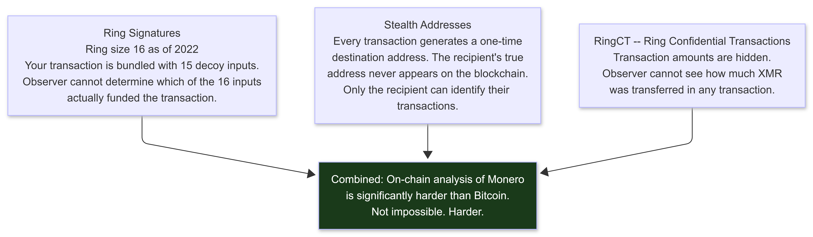

</td></tr></table>
</div>

**Monero's limitations in 2027 -- read the fine print:**

1. **Exchange on/off ramp (primary 2027 risk):** The same weakness as Bitcoin. If you buy XMR at a KYC exchange with your real identity, that purchase is a permanent record. **Always acquire through Bisq, Haveno, or P2P with cash.**

2. **Chain analysis claims (2024-2026):** Chainalysis and the US CISA have made public statements claiming partial Monero tracing capability. The specific techniques remain undisclosed. The current academic consensus: Monero's on-chain privacy is strong but not absolute, particularly for very old transactions (pre-ring-size-16) and scenarios where timing correlation between exchanges is possible.

3. **Ring size is not infinite:** A ring size of 16 means 1-in-16 odds for each transaction. With enough correlated transactions and statistical analysis, the anonymity set can theoretically be narrowed.

4. **Timing correlation:** Receiving XMR and spending it within seconds creates a timing pattern that can be correlated to the receipt without breaking the ring signature. Wait a minimum of 30 minutes before spending received XMR.

**Required viewing (not optional -- watch this before using Monero for operations):** "Breaking Monero" YouTube series -- covers every known weakness in Monero's privacy model in detail. https://www.youtube.com/playlist?list=PLsSYUeVwrHBnAUre2G_LYDsdo-tD0ov-y

---

### 11.3 Operational Monero Use

```bash
# Install Feather Wallet (best Monero desktop wallet for 2027)
# Download: https://featherwallet.org
# ALWAYS verify the GPG signature before running any wallet software

# Wallet setup:
# 1. Create a new wallet
# 2. Record seed phrase on paper; store offline, never in any digital form
# 3. Create one subaddress per payment purpose

# Why subaddresses matter:
# If you use the same Monero address for multiple purposes (VPS, domain, VoIP),
# a blockchain observer who knows one payment can look for the same address elsewhere.
# Subaddresses are cryptographically unlinkable to each other by a blockchain observer.
# All subaddresses deposit to the same wallet. You see all incoming XMR in one place.
# The world cannot see that the payments went to the same person.

# In Feather Wallet:
# Wallet > Subaddresses > Create New Address
# Label: "1984 Hosting", "Njalla Domains", "JMP VoIP"
# Use a fresh labeled subaddress for each vendor or purpose
# Never reuse subaddresses between vendors
```

---

### 11.4 Step-by-Step: First Anonymous Infrastructure Purchase

Execute in order. No shortcuts.

```
Day 1: Acquire Monero

Step 1: Find a Bitcoin ATM that accepts cash, no ID required.
  - Use CoinATMRadar: https://coinatmradar.com
  - Filter: "No ID required", "Bitcoin ATM", "Buy Bitcoin"
  - Choose one not near your home, work, or regular routes
  - Check if it requires a phone number; if so, use a VoIP number (JMP.chat)
  - Use your research-identity phone or a VoIP number for any required SMS verification

Step 2: Buy Bitcoin with cash.
  - Keep the transaction below the ATM's ID threshold (often $900 or $3000; varies by ATM)
  - Generate a fresh Bitcoin address using Sparrow Wallet on your research machine
    Download: https://sparrowwallet.com
  - Transfer to your Sparrow wallet immediately after purchase
  - Do not leave Bitcoin on the ATM's internal wallet

Step 3: Swap Bitcoin for Monero using Haveno or Unstoppable Swap.

  Option A: Haveno (preferred; Monero-native DEX)
    Download: https://haveno.exchange
    Create an account (no personal information required)
    Find a BTC/XMR offer or create your own
    Complete the trade: Bitcoin goes in, Monero comes out
    Wait for 10+ Monero confirmations (approximately 20 minutes)

  Option B: Unstoppable Swap (atomic swap; no counterparty risk)
    Download: https://unstoppableswap.net
    Select a provider from the list
    Enter how much BTC you want to swap
    The swap executes automatically; no trust in the other party required
    Wait for completion (15-60 minutes depending on congestion)

  After receiving Monero:
    - Wait at least 10 confirmations before spending
    - Wait a minimum of 30 minutes after receiving before spending (timing correlation)
    - Longer wait is better

Day 2: Purchase VPS and Domain

Step 4: Over Tor Browser, visit your chosen VPS provider.
  Recommended: 1984 Hosting (https://1984.hosting) or Njalla (https://njal.la)
  Create account using:
    - A research-identity email (ProtonMail created over Tor)
    - No real personal information of any kind
  Complete payment with Monero.

Step 5: Over Tor Browser, register a domain at Njalla.
  https://njal.la/domains/
  Pay with Monero.
  Njalla registers it in their name. Your name never appears in WHOIS.

Step 6: Point domain DNS to your VPS.
  In Njalla DNS management: add an A record pointing to your VPS IP.
  Wait for propagation (5-30 minutes for Njalla's nameservers).

Step 7: Access your VPS for the first time, only through Tor.
  proxychains4 ssh -p 22 root@YOUR-VPS-IP
  (Use the default port for first login; your hardening script will change it)

  Set up your SSH key immediately and disable password auth.
  Run the VPS hardening script from Section 8.4.

  All future connections use your chosen high port and key auth:
  proxychains4 ssh -p YOUR_PORT operator@YOUR-VPS-DOMAIN.COM
```

---

## 12. IDENTITY COMPARTMENTALIZATION AND STYLOMETRY

> Your identities must be completely separate. Not mostly separate. Completely. And your writing style is an identity fingerprint that most operators never think about until it is too late.

---

### 12.1 The Three-Identity Model

<div align="center">
<table><tr><td>


</td></tr></table>
</div>

---

### 12.2 What Burns Identity Compartmentalization

| Failure Mode | How It Works | Prevention |
|---|---|---|
| Username reuse | Same username on two platforms: trivially linked via search | Generate unique usernames per identity; Maigret-verify before use |
| Personal email for recovery | Research account uses personal email as backup | Dedicated throwaway email per identity; ProtonMail over Tor |
| Same IP for both identities | Platform logs the IP: links both identities | Separate physical machines or VMs with different network paths |
| File metadata | Documents embed author name, timestamps, software version | Strip all metadata before sharing (mat2, exiftool) |
| EXIF data in images | Photos contain GPS coordinates, camera model, serial number | Strip EXIF before sharing any image |
| Browser fingerprint consistency | Same fingerprint across identities: linked even without cookies | Separate browser profiles; Tor Browser for operational identity |
| Writing style matching | Vocabulary, sentence structure, punctuation habits are consistent across identities | See Stylometry section below |
| Same PGP key | Same GPG key for personal and research: cryptographically linked | Separate GPG keys per identity |
| Payment linkage | Same payment method across identities | Strict financial separation with Monero; separate wallets per identity |
| Timezone metadata | Document timestamps reveal timezone | Set research OS to UTC |
| Activity timing | Always operating at same UTC hours | See Section 15: Timing OPSEC |
| Personal opinions | Distinctive views expressed identically across identities | Separate opinions per persona; see Stylometry below |

---

### 12.3 Stylometry: Your Writing Is a Fingerprint

Stylometry is the forensic analysis of writing style to identify authorship. Researchers have linked pseudonymous authors to real identities through stylometric analysis with no technical evidence at all.

**What stylometry measures:**
- Average sentence length and variance
- Vocabulary richness (ratio of unique words to total words)
- Function word frequency (the, and, or, but, in: these are more distinctive than content words because they are subconscious)
- Preferred punctuation patterns
- Capitalization habits ("internet" vs "Internet")
- Common grammatical constructions and transition phrases
- Response timing in real-time chats
- Emoji use patterns and frequency

**The 2027 threat: LLM-based stylometry**

Traditional stylometry uses statistical analysis (n-grams, Burrows's Delta). This is effective enough to identify authors from moderate-sized writing samples. LLM-based authorship attribution in 2026-2027 is significantly more powerful:
- Fine-tuned language models identify writing style from much shorter samples than statistical methods
- LLM-based tools detect stylistic patterns invisible to human inspection
- Some platforms and threat intelligence firms are deploying these tools for attribution
- Attribution accuracy has improved beyond the 80-90% range achievable with statistical methods

**Practical countermeasures:**

```
1. Maintain a different writing persona per identity.
   Personal: your natural writing style.
   Research: deliberately different in measurable ways.

2. Concrete changes for your research persona:
   - Change comma usage patterns (fewer if you normally use many, or vice versa)
   - Change sentence length distribution (shorter or longer average)
   - Change capitalization habits
   - Avoid characteristic phrases you use in personal writing
   - Change how you handle technical abbreviations (e.g. vs e.g., i.e. vs "that is")
   - Change paragraph length distribution
   - Adopt a different stance on technical topics than your personal opinions

3. Use a local LLM to rewrite non-real-time operational communications.
   See Section 12.4 for setup.

4. For real-time chat:
   Develop different abbreviation habits per identity.
   Different emoji usage patterns. Different response timing.
   Different greeting and sign-off phrases.

5. Measurement tool:
   Anonymouth: https://github.com/psal/anonymouth
   Analyzes your writing and suggests changes to reduce stylometric distinctiveness.
   Run it on samples from your research identity vs personal writing
   to measure how different they actually are. Use it as a calibration tool.
```

---

### 12.4 Setting Up a Local LLM for Anti-Stylometry Text Rewriting

Using a cloud-based LLM (ChatGPT, Claude, Gemini, etc.) to rewrite operational communications is a privacy problem: the cloud provider sees what you sent. Use a local LLM instead.

```bash
# Install Ollama (local LLM runner that works offline after model download)
# https://ollama.ai

# On Linux:
curl -fsSL https://ollama.com/install.sh | sh

# Pull a capable model (Mistral is fast and effective for text rewriting)
ollama pull mistral

# For more capable rewriting (larger model, requires more RAM):
ollama pull llama3

# Test that Ollama is working
ollama run mistral "Rewrite this sentence with shorter words: The implementation is straightforward."

# Create a rewriting script for your research identity
cat > ~/rewrite_for_research.sh << 'EOF'
#!/bin/bash
# Usage: echo "your text here" | ./rewrite_for_research.sh
# Or:    ./rewrite_for_research.sh < message.txt
TEXT=$(cat)
curl -s http://localhost:11434/api/generate -d "{
  \"model\": \"mistral\",
  \"prompt\": \"Rewrite the following text. Use shorter sentences than the original. Remove Oxford commas. Use a terse, technical writing style. British English spelling. Do not change any technical terms, URLs, commands, or code. Do not add explanations or preamble. Output only the rewritten text.\n\nText to rewrite:\n${TEXT}\",
  \"stream\": false
}" | python3 -c "import sys,json; print(json.load(sys.stdin)['response'])"
EOF
chmod +x ~/rewrite_for_research.sh

# Usage:
echo "This is a draft message I want to send..." | ~/rewrite_for_research.sh
```

**Critical rules for this tool:**
- Use the **same style instruction every time** for the same identity (creates consistent output across messages)
- **Never paste operational content into a cloud LLM** (OpenAI, Anthropic, Google, etc.)
- The local model runs entirely on your machine: no network required after the initial download
- Review the output before sending: the LLM occasionally alters technical details

---

### 12.5 Creating Operational Personas

```
Each operational identity needs a coherent backstory that withstands casual inspection.

Persona construction:
  Name: realistic for the claimed geographic or cultural origin
  Background: consistent claimed expertise, history, motivation
  Writing style: documented and consistent (see Stylometry section)
  Online presence: minimal but coherent; zero history is suspicious to some platforms
  Email: created over Tor; not linked to phone number or real identity
  GitHub: if needed, clean repos matching the claimed expertise

What the persona must NOT include:
  Your actual opinions on identifiable topics
  Your real geographic details (even encoded or hinted at)
  Your real-world contacts (even through follows or mutual connections)
  Any crossover with personal identity infrastructure
  Consistent time-of-day activity that matches your real timezone
  Your real interests, hobbies, or biographical details
```

---

## 13. SECURE RESEARCH OS

> The operating system you run your research on determines what leaves traces, what can be recovered, and how exposed your activity is. Choose based on your threat model.

---

### 13.1 OS Comparison Table

| OS | Anonymity | Persistence | Difficulty | Best For |
|---|---|---|---|---|
| Tails | Very High | None (amnesic by design) | Low | Temporary, leave-no-trace sessions |
| Whonix | High | Yes (VM-based) | Medium | Daily research; Tor-only outbound |
| Qubes + Whonix | Very High | Yes (compartmentalized) | High | High-security multi-workload setup |
| Kali Linux (hardened) | Medium | Yes | Low | Practice; CTFs; tool-heavy work |
| Parrot OS | Medium | Yes | Low | Development; CTFs; lightweight alternative to Kali |

---

### 13.2 Tails: Amnesic, Leave No Trace

Tails boots from a USB drive and leaves no trace on the host machine. Every session starts clean. Tor is the only network path. When you shut it down, everything that happened in that session is gone.

**Installation:**
```bash
# Download Tails from https://tails.boum.org/install/
# Verify the signature (Tails documentation includes step-by-step verification; do it)

# Write Tails to USB (replace /dev/sdX with your USB drive path)
# Find your USB drive path first:
lsblk

# Write Tails to USB:
sudo dd if=tails-amd64-VERSION.img of=/dev/sdX bs=16M oflag=direct status=progress
sync
# This takes 5-15 minutes; do not interrupt
```

**Boot procedure:** Enter BIOS/UEFI (F2, F12, Del, or ESC during startup). Set USB as first boot device. At the Tails Greeter: choose language; optionally set Administration Password; click "Start Tails."

**Persistent Storage (optional):** Applications > Tails > Configure Persistent Storage. Encrypts selected data on the USB that survives reboots. Choose what to persist: Tor Browser bookmarks, GPG keys, research notes. Everything else is erased on shutdown.

---

### 13.3 Whonix: Tor-Only Research VM

Whonix is a two-VM system: a Gateway VM (routes all traffic through Tor) and a Workstation VM (where you work; all traffic goes through the Gateway). Even if malware compromises the Workstation, it cannot bypass Tor because the network is handled entirely by the Gateway.

<div align="center">
<table><tr><td>

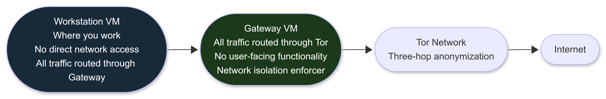

</td></tr></table>
</div>

```bash
# Install VirtualBox
# Download: https://www.virtualbox.org/wiki/Downloads
# Also install the VirtualBox Extension Pack (same page)

# Download Whonix OVA images (two files: Gateway and Workstation)
# https://www.whonix.org/wiki/VirtualBox
# Verify the GPG signatures before importing (instructions on the same page)

# Import both OVA files into VirtualBox
# File > Import Appliance > select Whonix-Gateway.ova
# File > Import Appliance > select Whonix-Workstation.ova

# CRITICAL network configuration:
# Whonix-Gateway:
#   Adapter 1: NAT (to the real internet)
#   Adapter 2: Internal Network, name: "Whonix"
#
# Whonix-Workstation:
#   Adapter 1: Internal Network, name: "Whonix" (must match Gateway exactly)
#   No other network adapters

# Start Gateway first, then Workstation
# Verify Tor routing inside the Workstation:
curl https://check.torproject.org | grep -i "congratulations"

# Update both VMs immediately after first boot:
sudo apt update && sudo apt full-upgrade -y

# Take snapshots after initial setup:
# VirtualBox > Machine > Take Snapshot > Label: "Clean baseline - DATE"
```

---

### 13.4 Qubes OS: Compartmentalized Workstation

Qubes uses Xen hypervisor to create separate security domains (qubes) for different activities. A vulnerability in one qube cannot affect others.

**Hardware requirements:**
- CPU: Intel or AMD 64-bit with VT-x/AMD-V and VT-d/AMD-Vi (IOMMU)
- RAM: 16GB minimum; 32GB strongly recommended
- Storage: 128GB minimum; 256GB+ recommended
- **Check hardware compatibility first:** https://www.qubes-os.org/hcl/

**Qubes research setup:**

```
Personal qube:       personal browsing, email, documents
Work qube:           day job activity
Research qube:       security research (connected through sys-whonix)
Malware-analysis:    sandboxed, no internet access
Untrusted qube:      opening suspicious files (use disposable VMs)
sys-net qube:        manages network hardware
sys-firewall qube:   controls traffic between qubes
sys-whonix qube:     routes research traffic through Tor
```

---

### 13.5 Baseline Hardening for Any Research OS

```bash
# Enable full disk encryption (LUKS for Linux)
# Verify it is enabled:
lsblk -o NAME,FSTYPE
# Should show: TYPE=crypt for your main partitions

# Set system timezone to UTC
timedatectl set-timezone UTC
timedatectl
# Verify: output shows UTC

# MAC address randomization (prevents hardware-level tracking)
nmcli connection modify "Your Connection Name" wifi.cloned-mac-address random
nmcli connection modify "Your Connection Name" 802-3-ethernet.cloned-mac-address random

# Verify MAC changes on each reconnection:
ip link show | grep ether

# Set screen lock to 5 minutes or less
# GNOME:
gsettings set org.gnome.desktop.session idle-delay 300
gsettings set org.gnome.desktop.screensaver lock-delay 0

# Configure automatic system updates
apt install -y unattended-upgrades
dpkg-reconfigure --priority=low unattended-upgrades
```

---

### 13.6 FDE Passphrase Strength

Full disk encryption is only as strong as the passphrase used to derive the encryption key. A weak passphrase means an offline brute-force attack against the LUKS header can succeed.

```
LUKS uses PBKDF2 or Argon2 (LUKS2) to derive the key from your passphrase.
Argon2 (LUKS2) is significantly harder to brute-force due to memory hardness.
If you created your LUKS volume with LUKS1, consider upgrading to LUKS2.

# Check your LUKS version:
sudo cryptsetup luksDump /dev/sdX | grep Version

# If LUKS1: convert to LUKS2 (requires a backup first):
sudo cryptsetup convert /dev/sdX --type luks2

# Passphrase requirements to resist offline brute-force:
# Minimum: 6 random words from a large wordlist (Diceware method)
# Better: 8 random words
# Best: 8 random words + special characters

# Generate a strong passphrase using Diceware:
# Roll physical dice and use the EFF large wordlist:
# https://www.eff.org/files/2016/07/18/eff_large_wordlist.txt

# NEVER use: your name, birthdate, keyboard patterns (qwerty123),
# dictionary words without modification, or anything that can be guessed
# from your public online presence.

# Optional: add a keyfile as a second factor alongside the passphrase
# A keyfile stored on a USB drive: the drive must be present at boot
dd if=/dev/urandom of=/path/to/keyfile bs=4096 count=1
sudo cryptsetup luksAddKey /dev/sdX /path/to/keyfile
```

---

### 13.7 Air-Gap Machine: When to Add It

An air-gap machine has no network card installed or ever connected to any network. It is used for:
- Signing code or documents that must not be exposed to a networked machine
- Storing encryption keys that must never touch the internet
- Analyzing malware in a truly isolated environment
- Phase 4 work where your tooling contains information that cannot leave the machine

Data transfer to/from an air-gap machine: USB drives only. Examine every USB drive on a separate machine before introducing it. Consider a USB data blocker (allows power, no data transfer) for charging.

You do not need an air-gap machine during Phase -1. Define your protocol for when you will need it so it is not an afterthought when Phase 4 begins.

---

## 14. PHYSICAL OPSEC: THE LAYER MOST GUIDES IGNORE

> Network anonymization means nothing if your physical location is logged, your face is on a surveillance camera, your device is physically exposed, a smart device in your workspace is recording, or someone can reach your machine while you are away.

---

### 14.1 Why Physical OPSEC Matters

Aaron Swartz was caught because:
1. His laptop was physically found plugged into a network closet
2. Surveillance cameras recorded him accessing that closet
3. University network logs associated his device with the physical location

The digital evidence was confirmed and localized by physical evidence. This pattern repeats in most prosecutions: digital evidence pointing to a location, physical evidence confirming a person was there.

---

### 14.2 Workspace Selection

```
Ideal characteristics:
  Back to a wall or corner (no one can observe your screen from behind)
  Screen not visible to adjacent areas, street-facing windows, or cameras
  Cash payment for access (no credit card record placing you at the location)
  Regular enough foot traffic that you are not memorable
  Multiple entry and exit points
  No biometric access control for entry

Avoid:
  Locations where you are the only customer (you are memorable)
  Locations with extensive close-range camera coverage at screen level
  Locations that require ID or membership card
  Locations adjacent to regular law enforcement presence
  Locations where you previously operated under your real identity
```

---

### 14.3 Smart Devices: The Covert Channel in Your Workspace

This is the physical OPSEC element almost no guide addresses. Smart devices in your workspace are potential covert channels and log sources.

<div align="center">
<table><tr><td>


</td></tr></table>
</div>

**Protocol for operational workspace:**

```
Rule 1: No voice assistants in the operational workspace.
  Amazon Echo, Google Nest, Apple HomePod, and similar devices maintain always-on
  microphones and process audio in the cloud. A valid legal order can compel the
  manufacturer to produce any audio captured. Remove them from operational spaces
  entirely. Not "turn off" -- remove.

Rule 2: No smart TVs in the operational workspace with network connectivity.
  Smart TVs use Automatic Content Recognition (ACR) to log screen content
  and many include microphones. If a smart TV is present: disable network
  connectivity at the router level or unplug the ethernet; cover the microphone.

Rule 3: Disconnect IoT devices from the network in operational spaces.
  Smart lights, thermostats, and security cameras generate network traffic logs
  that can timestamp your presence with high accuracy.

Rule 4: Personal phone location.
  Never bring your personal phone into an operational workspace.
  If you must bring it: power off and place in a faraday bag before entering.

Rule 5: Printer awareness.
  Most color laser printers embed invisible microdots that encode the serial number,
  date, and time into every printed page. Do not print operational materials on a
  printer linked to your real identity.
  Use a cash-purchased printer on a network-isolated research router.
  Alternatively: print at a business services shop with cash, not with a loyalty card.
```

**Check if your printer embeds tracking dots:**
- EFF tracking dot database: https://www.eff.org/pages/list-printers-which-do-or-do-not-print-tracking-dots

---

### 14.4 AI Facial Recognition: The 2026-2027 Physical Layer

AI-powered facial recognition has been deployed at significant scale in physical environments since 2023-2024:

- **London, UK:** One of the densest camera networks globally; the Metropolitan Police deploys live facial recognition cameras at targeted locations.
- **China:** Pervasive deployment in urban areas; integrated with movement tracking systems.
- **US:** Deployment at airports (CBP uses it for international departures), some transit systems, and increasingly in retail environments.
- **Private sector:** Major retail chains, casinos, and sports venues deploy facial recognition independently of law enforcement.

**Practical mitigations for high-sensitivity physical scenarios:**
- Vary your route to operational locations
- Wear a hat and non-distinctive clothing that covers identifying features without being suspicious (a distinctive disguise makes you memorable; blending in does not)
- Avoid eye-level cameras where possible (most fixed cameras are mounted high; looking down reduces the capture angle)
- For highest-risk scenarios: IR-blocking materials on forehead and nose disrupt some facial recognition systems calibrated on visible-spectrum imagery

Know where the cameras are before you operate in a space. Pre-survey the space.

---

### 14.5 ANPR: Automatic Number Plate Recognition

If you drive to a sensitive operation location, your vehicle is logged.

```
ANPR camera networks:
  Many cities have ANPR cameras on major roads, intersections, and parking garages.
  Police vehicles in some jurisdictions scan plates continuously while driving.
  Private parking facilities typically log entry and exit by plate.
  Data is often retained for weeks to months.

Mitigation:
  Do not drive your own vehicle to sensitive locations.
  Public transit (where no ID is required; pay with cash).
  Walk or cycle from a neutral parking location several blocks away.
  Use cash for transit or bikeshare where ID is not required.

Do not:
  Park directly outside a sensitive location.
  Use a vehicle registered to your real address for sensitive operations.
```

---

### 14.6 Hardware Purchase Trail

Every device you buy with a traceable payment creates a record. That record can be subpoenaed from the retailer or matched to device logs.

```
Purchasing hardware for research:
  Cash at a physical store (not online delivery; your address is a record)
  No loyalty or rewards cards at the point of purchase
  No credit card; no debit card
  A store not near your home or workplace

Serial number and device tracking:
  Serial numbers are logged by manufacturers and retailers
  Apple devices register serial numbers at activation
  Many OEM tools embedded in firmware phone home on first boot
  Default action for any new research device: disable all telemetry
  before connecting to any network; reimage from a known clean install
  before first operational use
```

---

### 14.7 Device Security at Rest

```
When you leave the device unattended (even briefly):
  Screen lock: set to 5 minutes maximum idle timeout
  Enable screen lock manually before physically walking away
  For high-sensitivity work: full power-off when not in use
  Physical cable lock for research laptops in public spaces ($20-40)
  Never leave research hardware unattended in a vehicle

Long-term storage:
  Full disk encryption protects you if the device is seized while powered off
  The encryption key exists only in RAM while the device is running
  Power off means no key in RAM means encrypted drive = unreadable ciphertext
  Sleep/hibernate leaves the key in RAM or in swap; they are weaker than full power-off
```

---

### 14.8 Travel and Border Crossings

```
Border search authority by country:

United States (CBP):
  Can search any device at the border without a warrant.
  Refusing to provide passwords is legal for US citizens (Fifth Amendment; actively litigated)
  but can result in extended detention and device seizure for non-citizens.

United Kingdom (Counter-Terrorism and Border Security Act 2019, Schedule 3):
  Allows detention, search, and seizure without suspicion.
  Refusal to provide passwords: criminal offence under separate legislation.

Australia:
  Australian Border Force can compel password disclosure.
  Refusal is a criminal offence under the Customs Act.

Travel strategy:

Option 1 (recommended): Clean travel device
  Travel with a laptop that has nothing sensitive on it.
  After arrival: connect through VPN/Tor and access research resources remotely.

Option 2: "Burner" travel laptop
  Purchase a cheap laptop for travel. Clean OS. Nothing valuable on it.

Option 3: FDE research device with duress considerations
  If you must travel with your research device:
  - FDE enabled
  - Power off completely before entering any border checkpoint (not sleep, not hibernate)
  - Consider a duress password (wipes device when entered)
  - Know your rights in your specific jurisdiction

If your device is seized at a border:
  1. Do not physically resist. Comply physically, assert rights verbally.
  2. Request a receipt for any seized device.
  3. Note the officer's name and badge number.
  4. Consult legal counsel before the device is returned.
  5. Assume the device is compromised if returned. Reimage before further use.
```

---
## 15. TIMING AND PATTERN OPSEC: THE INVISIBLE FINGERPRINT

> Your activity timing is a behavioral fingerprint. If you always operate between 2am and 5am UTC, that pattern is as identifying as your IP address. Investigators use temporal analysis to narrow suspect pools geographically and personally.

---

### 15.1 What Temporal Analysis Reveals

An investigator with access to server logs can determine:
- The hours of the day your operations occur (narrows timezone, which narrows geographic region)
- The days of the week (reveals work schedule and personal patterns)
- The duration of sessions (behavioral characteristic)
- The gap between connection events (reveals your availability patterns)
- Whether you operate consistently on certain days and not others (reveals work vs personal life pattern)

Combined with other data points, timing analysis can narrow a suspect pool from thousands to dozens. Jeremy Hammond's consistent IRC timing window was a contributing factor in his identification.

---

### 15.2 Timing Countermeasures

```
Rule 1: Vary your operational timing window.
  Do not always operate in the same narrow UTC hour range.
  If you naturally work late, schedule sessions at different times across the week.
  Track your own session times for one month; if you see a cluster, disrupt it.

Rule 2: Separate infrastructure setup timing from operational use timing.
  Setting up a VPS at 2am UTC and then using it operationally at 2am UTC every night
  creates a correlation cluster. Set up infrastructure at a different time of day
  than your typical operational windows.

Rule 3: Set all research systems to UTC.
  Check: timedatectl
  Set: timedatectl set-timezone UTC
  This prevents your local timezone from leaking into file timestamps,
  document metadata, and log entries.

Rule 4: Think in UTC, not local time.
  When reviewing your own logs, server logs, or scheduling operations,
  always think in UTC. This removes the mental leakage where you think
  "I operate from 10pm to 2am" (which immediately reveals your local timezone range).

Rule 5: Introduce deliberate breaks and irregularity.
  Operate for 45 minutes, stop for 30, operate for 2 hours, stop for a week.
  An irregular session pattern is harder to fingerprint than a consistent one.
```

---

### 15.3 Traffic Correlation: The Tor Timing Attack

Traffic correlation is the attack where an adversary who can observe both your entry into the Tor network and the traffic exiting toward the destination can correlate the two streams by timing patterns alone, even without breaking encryption.

<div align="center">
<table><tr><td>


</td></tr></table>
</div>

**Realistic threat assessment:** Traffic correlation at scale requires an adversary who controls or can monitor both the entry and exit points simultaneously. For most threat models, this is a nation-state-level capability. It is not a realistic threat for standard security research against corporate targets.

**For high-sensitivity operations against nation-state-adjacent targets:**
- Tor onion services (no exit node, see Section 8.7)
- Long-lived Tor circuits with no correlation anchor (route changes break the correlation)
- Higher-latency Tor configurations (Tor's low-latency design is a tradeoff; latency adds noise)

---

### 15.4 Document and File Timestamp Leakage

File creation timestamps, modification timestamps, and access timestamps can reveal your operational timezone and working hours.

```bash
# Check timestamps on a file you are about to share
stat document.txt
# Shows: Access, Modify, Change timestamps with full timezone information

# Set all research OS timestamps to UTC (see Section 13.5)
# This ensures file timestamps show UTC, not your local timezone

# Remove timestamps from files before sharing (mat2):
apt install -y mat2
mat2 document.txt          # Strips metadata and timestamps
mat2 --inplace document.txt  # Modifies in place
mat2 -l document.txt       # Show what metadata is present before stripping

# The output file has metadata removed
# Verify: mat2 --check document.txt
```

---

## 16. METADATA: THE SILENT KILLER

> Metadata is data about data. A document contains its text (data) and also: who created it, when, with what software, on what machine (metadata). Images contain their pixels and also: GPS coordinates, camera model, camera serial number, timestamp. Every file format has metadata. Most people never look at it. Investigators always do.

---

### 16.1 File Metadata Categories

<div align="center">
<table><tr><td>


</td></tr></table>
</div>

---

### 16.2 Reading Metadata: exiftool

```bash
# Install exiftool
apt install -y libimage-exiftool-perl

# Read all metadata from a file
exiftool document.pdf
exiftool photo.jpg
exiftool audio.mp3

# Read only GPS coordinates from an image
exiftool -gps:all photo.jpg

# Read metadata from an email (save email as .eml first)
exiftool email.eml

# Read metadata from all files in a directory
exiftool directory/

# Write a metadata report to a file
exiftool -csv *.jpg > metadata_report.csv

# Real scenario: check what is embedded in a file before you share it
exiftool suspicious_document.docx
# Look for: Author, Creator, Producer, Software, GPS*, Latitude, Longitude
```

---

### 16.3 Stripping Metadata: mat2 (Metadata Anonymisation Toolkit 2)

```bash
# Install mat2
apt install -y mat2
# Or via pip: pip3 install mat2

# Check what metadata is present in a file
mat2 --check document.pdf
mat2 --check photo.jpg

# Strip all metadata from a single file
# Creates a cleaned copy with "_cleaned" in the filename
mat2 document.pdf
# Output: document_cleaned.pdf -- verify this is what you share

# Strip metadata in place (modifies the original)
mat2 --inplace document.pdf

# Strip metadata from multiple files
mat2 *.pdf
mat2 *.jpg *.png *.docx

# Supported formats: PDF, DOCX, XLSX, PPTX, JPEG, PNG, MP3, MP4, ODF, and more
# Check unsupported formats: mat2 --check unknownfile.xyz

# Always verify after stripping:
mat2 --check document_cleaned.pdf
# Should return: document_cleaned.pdf is clean
```

---

### 16.4 Email Header Analysis and Originating IP

Every email contains headers that trace its path. A single improperly sent email can reveal your real IP address.

```bash
# Read the full headers of an email:
# In Gmail: open email > three dots > "Show original"
# In Outlook: File > Properties > Internet headers
# In Thunderbird: View > Headers > All

# What to look for in email headers:
# "Received: from" lines show the mail server relay chain
# The FIRST "Received: from" line (at the bottom of the header block)
# shows the originating connection -- this may be YOUR IP ADDRESS

# Example of a dangerous header:
# Received: from 198.51.100.42 (dynamic-198-51-100-42.isp.example.com)
#         by mail.example.com (Postfix) with ESMTP
#         id ABC123; Mon, 1 Jan 2025 12:00:00 +0000
# The IP 198.51.100.42 is the sending machine's IP.
# If that is your home IP, you just revealed your location.

# Safe email sending for research:
# Use ProtonMail over Tor (ProtonMail strips originating IPs from headers)
# Use Riseup.net over Tor
# Never use Gmail, Outlook, Yahoo for operational email from a non-Tor connection
```

**ProtonMail IP handling:** ProtonMail does not include your originating IP in email headers when you send from their web or app interface. This makes it usable for research identity communications when accessed over Tor.

---

### 16.5 Network-Level Metadata

Even encrypted traffic generates metadata that can be analyzed:

| Metadata Type | What Is Revealed | Where It Is Recorded |
|---|---|---|
| Connection time | When you connected | ISP logs, server logs |
| Connection duration | How long you were active | ISP logs, server logs |
| Data volume | How much you transferred | ISP logs |
| Destination IP | Where you connected | ISP logs, DNS cache |
| DNS queries | What domains you looked up | DNS server, ISP |
| TLS SNI (Server Name Indication) | Domain name in HTTPS connections | ISP, network monitors (even without decrypting the traffic) |

**TLS SNI leakage:** When your browser connects to `https://sensitive-domain.com`, the domain name appears in plaintext in the TLS handshake (Server Name Indication field) even though the content is encrypted. Use Encrypted Client Hello (ECH) or route through Tor to prevent this.

---

## 17. SECURE DELETION: LEAVING NOTHING BEHIND

> Deleting a file does not delete it. Moving it to the Trash and emptying the Trash does not delete it. Even "permanently deleted" files remain recoverable on most storage media until the storage blocks are explicitly overwritten. This is one of the most misunderstood facts in basic security.

---

### 17.1 Why Standard Deletion Does Not Work

When you "delete" a file on most operating systems:
1. The operating system removes the file's entry from the directory listing (you can no longer see it)
2. The OS marks the storage blocks previously used by the file as "available for reuse"
3. The actual data remains on the storage device until those blocks are physically overwritten by new data

An investigator with forensic tools (Autopsy, FTK, Recuva) can scan the storage device for these unlinked but still-present blocks and recover the original files -- often completely, sometimes partially.

<div align="center">
<table><tr><td>

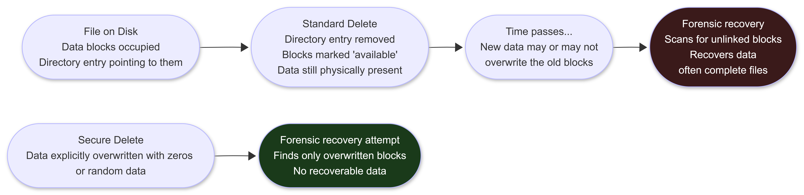

</td></tr></table>
</div>

---

### 17.2 HDD vs SSD: Critical Difference

The secure deletion approach differs fundamentally between HDDs and SSDs.

**HDD (Hard Disk Drive) -- traditional spinning disks:**

Data is written to specific, addressable sectors. Overwriting those sectors with random data reliably destroys the original content. One pass of overwriting is sufficient for modern HDDs with perpendicular recording.

```bash
# Securely delete a specific file on HDD (shred)
shred -vzun 3 sensitive_file.txt
# -v: verbose (shows progress)
# -z: final pass of zeros (hides that shredding occurred)
# -u: remove the file after shredding
# -n 3: three overwrite passes (one is sufficient for modern HDDs; three for comfort)

# Securely delete an entire directory on HDD
find ./sensitive_directory/ -type f -exec shred -vzun 3 {} \;
rm -rf ./sensitive_directory/

# Fill free space with zeros (overwrites unlinked blocks that may contain old data)
dd if=/dev/zero of=/mount/point/zeros.tmp bs=1M; rm /mount/point/zeros.tmp

# Or use secure-delete package:
apt install -y secure-delete
srm -rfvz sensitive_file.txt   # Securely remove a file
sfill /mount/point             # Fill free space to overwrite unlinked blocks
```

**SSD (Solid State Drive) -- the critical difference:**

SSDs use wear leveling: the controller distributes writes across all storage cells to extend lifespan. This means overwriting a file at a logical address may not overwrite the physical cells where the old data lived. The old data may remain in a different physical location that is not addressable by the OS.

```bash
# On SSD, file-level shredding is unreliable.
# The secure approaches for SSD:

# Option 1: Full disk encryption from day one (MOST RELIABLE)
# If the drive is encrypted from initial setup:
# "Deleting" a file leaves encrypted ciphertext in unlinked blocks.
# Without the key, this ciphertext is unrecoverable.
# This is the PRIMARY reason FDE is mandatory, not optional.

# Option 2: Secure erase via the drive's built-in command (for wiping entire drives)
# hdparm ATA Secure Erase (erases the entire SSD using firmware commands):
# First: check if the drive supports it
hdparm -I /dev/sda | grep -i "security"

# If supported:
# Set a temporary password (required before running secure erase):
hdparm --security-set-pass TempPass /dev/sda
# Execute secure erase (takes 1-60 minutes depending on drive size):
hdparm --security-erase TempPass /dev/sda
# WARNING: this wipes the ENTIRE drive. Use only when decommissioning.

# Option 3: NVMe Secure Erase (for NVMe SSDs)
apt install -y nvme-cli
nvme format /dev/nvme0n1 --ses=1  # ses=1: user data erase; ses=2: cryptographic erase

# For operational file deletion on encrypted SSD:
# Delete the file normally. Since the volume is FDE-encrypted,
# the remaining data is encrypted ciphertext. It is not useful to an investigator.
# This is why FDE from day one is mandatory, not optional.
```

**The bottom line on SSDs:** Full disk encryption from initial setup is the reliable solution. File-level secure deletion on an unencrypted SSD gives false confidence.

---

### 17.3 Secure Deletion for Different Scenarios

| Scenario | Recommended Method |
|---|---|
| Single file on HDD | `shred -vzun 3 filename` |
| Directory on HDD | `find dir/ -type f -exec shred -vzun 3 {} \;` |
| Free space on HDD | `sfill /mountpoint` |
| Single file on SSD (encrypted volume) | Normal deletion is adequate (ciphertext remains) |
| Single file on SSD (unencrypted) | Cannot reliably secure-delete; use `hdparm` ATA secure erase on full drive only |
| Full drive (HDD) | `shred -vzun 3 /dev/sdX` (entire drive) |
| Full drive (SSD) | ATA Secure Erase (`hdparm --security-erase`) or NVMe format |
| Memory card | Same as SSD logic; FDE from setup; ATA erase for wiping |
| Physical destruction | Drill through platters (HDD) or through NAND chips (SSD) -- most reliable of all |

---

### 17.4 The Gutmann Method (Historical Context)

The Gutmann method (35-pass overwrite) was developed in 1996 for obsolete encoding methods used on drives from that era. **It is not necessary for modern drives.** A single-pass random overwrite is forensically sufficient for modern HDDs with perpendicular recording. Using 35 passes wastes time without additional security benefit.

---

### 17.5 RAM and Swap

Files opened in a running system may be cached in RAM or paged to swap space on disk. After deletion, the data may remain in RAM until overwritten, or on the swap partition indefinitely.

```bash
# Disable swap entirely for research work (RAM must be large enough)
swapoff -a
# Permanent: comment out the swap line in /etc/fstab

# If you need swap: encrypt it
# In /etc/crypttab:
# swap_crypt /dev/sdXY /dev/urandom swap,cipher=aes-xts-plain64,size=256

# Clear RAM on shutdown (not default behavior):
# Add to /etc/rc.local or a shutdown script:
echo 3 > /proc/sys/vm/drop_caches

# For Tails: this is automatic -- Tails wipes RAM on shutdown
# One of Tails' key security properties
```

---

## 18. WHAT LOGS EXIST ON EVERY SYSTEM YOU TOUCH

> Before you touch anything, know what gets logged. "I covered my tracks" means nothing if you did not know which tracks existed. This section is your map.

---

### 18.1 Log Layers Across an Operation

<div align="center">
<table><tr><td>


</td></tr></table>
</div>

**SIEM critical note:** In enterprise environments, logs are forwarded to a centralized SIEM (Splunk, ELK, Microsoft Sentinel) in real time. Cleaning logs on the local server does nothing if the SIEM has already ingested them. At the moment your SSH connection hits the server, the event is potentially already off the box. Do not rely on log cleanup for detection avoidance.

---

### 18.2 Your Own Machine: Log Locations and Control

```bash
# ---- BASH HISTORY ----
# Location: ~/.bash_history (per user)
# Bash writes history to the file on session exit, or when HISTFILE is flushed

# Disable history for a session (before running sensitive commands)
unset HISTFILE
# Or: set HISTFILE=/dev/null before the session

# Clear history for the current session
history -c

# Permanently disable bash history:
echo "HISTFILE=/dev/null" >> ~/.bashrc
echo "HISTSIZE=0" >> ~/.bashrc
echo "HISTFILESIZE=0" >> ~/.bashrc
source ~/.bashrc

# ---- SYSTEMD JOURNAL ----
# Location: /var/log/journal/ (persistent) or /run/log/journal/ (volatile)
# Contains: service starts/stops, kernel messages, login events, SSH connections

# Check journal size
journalctl --disk-usage

# View recent entries
journalctl -n 100

# Clear journal entirely (requires root)
journalctl --vacuum-time=1s

# Configure journal to not persist to disk (volatile only):
# Edit /etc/systemd/journald.conf:
# Storage=volatile
# RuntimeMaxUse=64M

# ---- SSH AUTH LOG ----
# Location: /var/log/auth.log (Debian/Ubuntu)
# Contains: SSH logins (successful and failed), sudo usage, su usage

# View SSH events
grep sshd /var/log/auth.log | tail -50

# Reduce SSH logging verbosity (set in sshd_config):
# LogLevel QUIET  (logs only fatal errors; no normal authentication events)

# ---- SYSTEM LOG ----
# Location: /var/log/syslog or /var/log/messages
# Contains: kernel events, CRON jobs, network events

# ---- CRON LOG ----
# Location: /var/log/syslog (search for CRON entries)
# Shows: what cron jobs ran and when

# ---- APPLICATION LOGS ----
# Browser history: varies by browser; see Section 19 for details
# Vim/nano swap files: /tmp/.file.swp; residual from open sessions
# Python pip cache: ~/.cache/pip/
# wget/curl history: not logged by default but DNS resolver caches queries
```

---

### 18.3 VPS and Remote Infrastructure Logs

```bash
# On your VPS: know what is being logged before operating from it

# View live SSH connections
who
w
last | head -20

# Check auth log for SSH events
tail -f /var/log/auth.log

# Web server access log (Apache)
tail -f /var/log/apache2/access.log

# Web server access log (Nginx)
tail -f /var/log/nginx/access.log

# Firewall log
tail -f /var/log/ufw.log

# Reduce logging verbosity (already done if you ran the hardening script):
# sshd_config: LogLevel QUIET
# Apache: LogLevel warn
# Nginx: error_log /var/log/nginx/error.log warn;

# Forward logs to a local encrypted store rather than leaving them on the VPS
# If your VPS is seized, you want minimal logs on it
# Consider: logging to RAM-disk only (volatile; lost on reboot)
```

---

### 18.4 Target System Logs You Trigger

When you interact with a target system, you generate logs. Understanding what you trigger helps you evaluate detection risk.

| Action | What Gets Logged | Where |
|---|---|---|
| Web page request | IP, timestamp, URI, user agent, referrer, response code | Web server access log |
| Failed login attempt | IP, username attempted, timestamp | Auth log, application log, SIEM |
| Port scan | Source IP, ports scanned, timestamps | Firewall log, IDS (Snort/Suricata) |
| SQL injection attempt | Full query string, IP, timestamp | Web app log, WAF log |
| SSH brute force | Source IP, username, timestamps | Auth log, fail2ban, SIEM |
| File download | IP, filename, timestamp, size | Web server access log |
| Directory traversal attempt | Full URI, IP, timestamp | Web server access log, WAF |
| Successful RCE | Depends on what the shell does | Multiple logs: shell, web server, SIEM |

**User agent:** Every HTTP request your browser or tool sends includes a User-Agent header that identifies the tool version. Scanners like Nmap, Nikto, sqlmap, Gobuster, and Burp Suite all have identifiable default user agents. Modify them:

```bash
# sqlmap: use a custom user agent
sqlmap -u "http://target.com/?id=1" --user-agent="Mozilla/5.0 (Windows NT 10.0; Win64; x64) AppleWebKit/537.36"

# Gobuster: use a custom user agent
gobuster dir -u http://target.com -w wordlist.txt -a "Mozilla/5.0 (compatible; Googlebot/2.1)"

# curl: specify user agent
curl -A "Mozilla/5.0 (Windows NT 10.0; Win64; x64)" https://target.com
```

---

### 18.5 Third-Party Services That Log Your Presence

| Service | Logged Data | Retention |
|---|---|---|
| Shodan / Censys | Queries you run are logged to your account | Account lifetime |
| VirusTotal | Every file you upload is stored and accessible to paying customers | Indefinitely |
| Pastebin | IP address linked to every paste | Varies; logs available to LE |
| GitHub | IP address logged for every push and clone | At least 90 days |
| HackerOne | All reports, activity, and IPs linked to your account | Account lifetime |
| Google | All searches linked to your account or IP | Varies by product |
| Shodan API | API queries linked to your API key | Account lifetime |

**VirusTotal critical note:** Every file you upload to VirusTotal is accessible to security researchers and threat intelligence firms with paid accounts. **Never upload a tool you developed, a payload you created, or a sample that could identify your operations to VirusTotal.** For malware analysis: use a local sandbox (Cuckoo Sandbox, ANY.RUN offline, or FlareVM).

---
## 19. FORENSIC ARTIFACTS ON YOUR OWN MACHINE

> *New in v1.0.0. Directly addresses the Schulte case (Section 2.5) and the most common gap in self-taught OPSEC: people secure their operations against remote discovery but leave their own machine as a fully documented evidence archive.*

The Joshua Schulte case demonstrated this more clearly than any other: the most damaging evidence was not found on the CIA's systems. It was found on his own laptop. Files he believed he had deleted. Browser history he believed he had cleared. Chat logs he believed were gone. Metadata in documents he did not know was there. All of it was recovered and used against him.

Your machine is a forensic artifact by default. Every action leaves a trace. Some traces are obvious. Many are invisible to normal operation but fully visible to forensic tools.

This section maps every significant artifact category on a research Linux machine, where it lives, and how to control it.

---

### 19.1 The Forensic Artifact Map

<div align="center">
<table><tr><td>



</td></tr></table>
</div>

---

### 19.2 Shell History: The Most Obvious Artifact

```bash
# Default location: ~/.bash_history (bash) or ~/.zsh_history (zsh)
# Written on session exit

# SEE WHAT IS IN YOURS RIGHT NOW:
cat ~/.bash_history | head -100

# DURING SENSITIVE SESSIONS: disable history before you start
export HISTFILE=/dev/null
# This setting applies only to the current session

# For ALL sessions: add to ~/.bashrc
echo 'HISTFILE=/dev/null' >> ~/.bashrc
echo 'HISTSIZE=0' >> ~/.bashrc
echo 'HISTFILESIZE=0' >> ~/.bashrc

# Wipe existing history NOW
history -c
rm -f ~/.bash_history

# For zsh (if using oh-my-zsh or zsh):
echo 'HISTFILE=/dev/null' >> ~/.zshrc
rm -f ~/.zsh_history ~/.zhistory

# Secure alternative: log history but to an encrypted volume
# so it exists for your reference but not on the unencrypted partition

# Verify it is working:
echo "test_command_to_find_later"
# Start a new terminal session
cat ~/.bash_history | grep test_command_to_find_later
# Should return nothing if HISTFILE=/dev/null is set correctly
```

---

### 19.3 Editor Swap Files and Backup Files

```bash
# Vim creates swap files for every open document:
# If you open /home/user/notes.txt in Vim, it creates /home/user/.notes.txt.swp
# If Vim crashes or is killed: the swap file persists
# Forensic tool finds: your in-progress document even if the file was deleted

# Find all Vim swap files on your system:
find / -name "*.swp" 2>/dev/null
find / -name ".*.swp" 2>/dev/null
find /tmp -name "*.swp" 2>/dev/null

# Delete any swap files you find
find / -name "*.swp" -delete 2>/dev/null

# Configure Vim to not create swap files (add to ~/.vimrc):
echo "set noswapfile" >> ~/.vimrc
echo "set nobackup" >> ~/.vimrc
echo "set nowritebackup" >> ~/.vimrc

# Nano creates backup files with tilde (filename~):
# If you edit /tmp/notes.txt in nano: /tmp/notes.txt~ is created as backup
# Disable nano backups (add to ~/.nanorc):
echo "set nobackups" >> ~/.nanorc

# Find nano backup files:
find / -name "*~" -type f 2>/dev/null | grep -v ".cache"
```

---

### 19.4 Browser Forensic Artifacts

**Private/Incognito mode does not make browser history unrecoverable.** Private mode prevents the browser from writing to its normal history database during the session. But:
- DNS queries were made during the session (DNS cache, possibly ISP)
- Download history for files saved to disk remains
- Browser itself was opened (systemd logs show process start)
- TLS certificates were cached
- Sites may have written to disk cache before the browser knew to suppress it

```bash
# Firefox: history, cache, cookies, autofill are in the profile directory
ls -la ~/.mozilla/firefox/

# Find the profile directory (looks like: xxxxxxxx.default-release)
ls ~/.mozilla/firefox/*.default*/

# Key artifact files within the Firefox profile:
# places.sqlite       -- browsing history, bookmarks, downloads
# cookies.sqlite      -- cookies from all sessions
# formhistory.sqlite  -- form autofill data
# key4.db             -- stored passwords
# sessionstore.jsonlz4 -- open tabs and their content
# cache2/             -- disk cache (page content)
# thumbnails/         -- thumbnail images of visited sites

# Examine what is in the history database:
sqlite3 ~/.mozilla/firefox/*.default*/places.sqlite "SELECT url, visit_date, title FROM moz_places ORDER BY visit_date DESC LIMIT 50;"

# Chromium/Chrome equivalents in:
# ~/.config/chromium/Default/ or ~/.config/google-chrome/Default/
# Key files: History (SQLite), Cookies, Cache/, Login Data

# Securely wipe browser history:
# Option 1: Delete the entire profile and recreate it fresh
rm -rf ~/.mozilla/firefox/*.default*/

# Option 2: Use BleachBit (automated browser artifact cleaner)
apt install -y bleachbit
bleachbit --list | grep firefox
bleachbit --clean firefox.history firefox.cookies firefox.cache firefox.passwords

# For operational use: run Tor Browser which clears state on exit by default
# For research identity Firefox: configure to clear all on close (Section 10.5 user.js)
```

---

### 19.5 Recently Accessed Files (GNOME / KDE Recent Files)

Both GNOME and KDE maintain a list of recently accessed files that appears in file managers, the "Open Recent" menu of applications, and elsewhere. This list persists and is fully readable by forensic tools.

```bash
# Recent files list (GNOME):
# Location: ~/.local/share/recently-used.xbel
# Format: XML; lists every recently opened file with full path and timestamp

# View recent files:
cat ~/.local/share/recently-used.xbel

# Clear recent files:
rm ~/.local/share/recently-used.xbel
# Or truncate it:
> ~/.local/share/recently-used.xbel

# Prevent GNOME from recording recent files:
gsettings set org.gnome.privacy remember-recent-files false

# Check if the setting took effect:
gsettings get org.gnome.privacy remember-recent-files
# Should return: false

# KDE recent files: ~/.local/share/RecentDocuments/
rm ~/.local/share/RecentDocuments/*.desktop

# Recent applications in GNOME (what you launched and when):
# ~/.local/share/applications/
# and in gnome-shell's runtime data

# Thumbnail cache (contains small images of every image, video, and PDF you've viewed):
# Location: ~/.cache/thumbnails/
# Thumbnails persist after the original file is deleted
ls ~/.cache/thumbnails/

# Clear thumbnail cache:
rm -rf ~/.cache/thumbnails/*
```

---

### 19.6 SSH Known Hosts and Config Artifacts

```bash
# ~/.ssh/known_hosts:
# Contains the public key fingerprint of every server you have ever SSH'd to.
# This is a log of every server you have connected to (by IP or hostname).
cat ~/.ssh/known_hosts

# Remove specific entries (if you need to remove a target IP from your known hosts):
ssh-keygen -R "TARGET_IP_OR_HOSTNAME"

# Or edit manually:
nano ~/.ssh/known_hosts
# Delete the line containing the IP/hostname you need to remove

# ~/.ssh/config:
# May contain server aliases, usernames, port numbers -- documents your infrastructure
cat ~/.ssh/config

# Remove after operations are complete:
# Or better: keep known_hosts on an encrypted volume that gets wiped

# SSH auth logs on YOUR machine (if you run an SSH server yourself):
grep sshd /var/log/auth.log
```

---

### 19.7 Git Configuration and Commit History Leakage

```bash
# ~/.gitconfig:
# Contains your name and email as set for git commits
# Even if you never pushed this repo, this file identifies you
cat ~/.gitconfig

# What a researcher's .gitconfig might show:
# [user]
#     name = Your Real Name
#     email = your.real.email@gmail.com
# This links any git commit you make (even local) to your real identity

# Set a research-identity git config per project:
# In the research project directory:
git config user.name "ResearchHandle"
git config user.email "research@protonmail.com"

# Or set it globally for research use (and change it for personal projects):
git config --global user.name "ResearchHandle"
git config --global user.email "research@protonmail.com"

# Check commit history for leaked metadata:
git log --all --format="%an %ae %ad %cn %ce %cd" | head -20

# If you committed from your personal identity and plan to push to research:
# Rewrite commit history to change author info:
git rebase -i --root
# Then for each commit you want to change: set to "edit"
# Then: git commit --amend --author="ResearchHandle <research@protonmail.com>"
# Then: git rebase --continue

# Alternative: filter-branch (more powerful, for entire repository history)
git filter-branch --env-filter '
    OLD_EMAIL="your.real.email@gmail.com"
    NEW_EMAIL="research@protonmail.com"
    NEW_NAME="ResearchHandle"
    if [ "$GIT_AUTHOR_EMAIL" = "$OLD_EMAIL" ]; then
        export GIT_AUTHOR_NAME="$NEW_NAME"
        export GIT_AUTHOR_EMAIL="$NEW_EMAIL"
    fi
    if [ "$GIT_COMMITTER_EMAIL" = "$OLD_EMAIL" ]; then
        export GIT_COMMITTER_NAME="$NEW_NAME"
        export GIT_COMMITTER_EMAIL="$NEW_EMAIL"
    fi
' --tag-name-filter cat -- --branches --tags
```

---

### 19.8 Python and Package Manager Artifacts

```bash
# pip install caches downloaded packages:
# Location: ~/.cache/pip/
# Contains: every package you installed, with timestamps
ls ~/.cache/pip/

# This is a log of what tools you installed, which packages, and roughly when
# Clear pip cache:
pip cache purge
rm -rf ~/.cache/pip/

# Python history (IPython / Jupyter):
# ~/.python_history
cat ~/.python_history
rm ~/.python_history

# Package installation log (apt/dpkg -- shows what tools you installed):
cat /var/log/dpkg.log | grep "install" | head -30
cat /var/log/apt/history.log

# apt logs cannot easily be faked, but can be cleared:
> /var/log/dpkg.log
> /var/log/apt/history.log
# Note: future installs will re-populate these files
```

---

### 19.9 Udev and Mounted Device History

```bash
# The OS logs every USB device you plugged in:
# Kernel log shows device identifiers when plugged in
dmesg | grep -i "usb\|ttyUSB\|sdb\|sdc"

# Systemd-udev logs USB device events persistently:
journalctl | grep "usb"

# /etc/udev/rules.d/ may contain device-specific rules that document past devices

# Block device history: mount.log or systemd journal
journalctl | grep "mounted\|umounted"

# This creates a log of every USB drive, external HDD, and other device you connected
# For research: use dedicated research USB drives; do not mix personal drives

# For Tails: this is not a problem (amnesic; all device history wiped on shutdown)
```

---

### 19.10 Print Job History (CUPS)

```bash
# CUPS (Common Unix Printing System) logs every print job:
# Location: /var/log/cups/access_log
cat /var/log/cups/access_log

# Contains: timestamp, job ID, document name, pages printed
# The document name often includes the filename of what you printed

# Disable CUPS print job logging:
cupsctl --no-debug-logging
# Or edit /etc/cups/cupsd.conf:
# AccessLogLevel none
# LogLevel warn

# Clear existing CUPS logs:
> /var/log/cups/access_log
> /var/log/cups/error_log

# Disable CUPS entirely if you do not need printing on the research machine:
systemctl disable cups
systemctl stop cups
```

---

### 19.11 The Pre-Operation Artifact Checklist

Run before any sensitive session on a machine that will be used long-term.

```bash
#!/bin/bash
# Run at the start of each research session as a reminder
# pre_session_check.sh

echo "=== PRE-SESSION ARTIFACT CHECK ==="
echo ""
echo "[1] Shell history disabled?"
echo "    Current HISTFILE: ${HISTFILE:-'(using default -- DISABLE IT)'}"
echo ""
echo "[2] Swap disabled?"
swapon --show 2>/dev/null || echo "    Swap: none (good)"
echo ""
echo "[3] Vim/nano swap files present?"
find /tmp /home -name "*.swp" -o -name "*~" 2>/dev/null | head -10
echo ""
echo "[4] Recently accessed files list:"
cat ~/.local/share/recently-used.xbel 2>/dev/null | grep "href" | head -10
echo ""
echo "[5] Thumbnails cache size:"
du -sh ~/.cache/thumbnails/ 2>/dev/null
echo ""
echo "[6] Git config identity:"
git config --global user.email 2>/dev/null
echo ""
echo "[7] pip cache size:"
du -sh ~/.cache/pip/ 2>/dev/null
echo ""
echo "=== END CHECK ==="
```

```bash
chmod +x pre_session_check.sh
./pre_session_check.sh
```

---

## 20. COLD BOOT AND EVIL MAID: CONCRETE MITIGATIONS

> *Expanded in v1.0.0. The previous version documented awareness of these attacks. This version documents what you actually do about them.*

---

### 20.1 Cold Boot Attack: Complete Explanation and Mitigations

**The attack:**

DRAM (Dynamic RAM) chips retain their content for a period after power loss due to residual electrical charge. At room temperature, this retention is typically seconds to minutes. At low temperatures (cold spray applied to the RAM chips), retention can extend to minutes to hours. An adversary who seizes your powered-on or recently-powered-off machine can read the RAM content and extract:
- The LUKS/FDE encryption key (which lives in RAM while the disk is decrypted)
- Your GPG private key (if loaded)
- Open documents and in-memory data
- Network credentials from active sessions
- Browser session data

<div align="center">
<table><tr><td>


</td></tr></table>
</div>

**Concrete mitigations -- in order of effectiveness:**

**Mitigation 1: AMD Secure Memory Encryption (SME/TSME) -- Hardware Level**

AMD processors from Zen+ (2018) onwards include Secure Memory Encryption, which encrypts all data in DRAM using a key generated by the processor at boot. This encryption is transparent to the OS. Even if an adversary extracts the DRAM chips and reads them directly, the content is encrypted.

```bash
# Check if your AMD processor supports SME:
dmesg | grep -i "SME\|TSME\|mem_encrypt"
# Look for: "AMD Memory Encryption features: SME" or "AMD SME active"

# Enable SME at kernel boot:
# Edit /etc/default/grub:
# GRUB_CMDLINE_LINUX_DEFAULT="quiet splash mem_encrypt=on"
sudo update-grub
sudo reboot

# Verify SME is active after reboot:
dmesg | grep -i "mem_encrypt"
# Should show: "AMD Memory Encryption features: SME" + "mem_encrypt=on"
```

Note: Intel does not have an equivalent hardware RAM encryption feature in most consumer processors. Intel TDX (Trust Domain Extensions) exists but requires specific hardware and cloud context.

**Mitigation 2: TPM-Bound FDE (Secure Boot + TPM + LUKS)**

Binding your LUKS FDE passphrase to the TPM (Trusted Platform Module) chip means the decryption key is only released if the system boots in its expected state (correct UEFI firmware, correct bootloader, correct kernel). This does not prevent the cold boot attack directly but closes the Evil Maid attack vector that often enables cold boot (see Section 20.2).

```bash
# Check if your machine has a TPM:
ls /dev/tpm* 2>/dev/null
ls /sys/class/tpm/tpm0/ 2>/dev/null
# If tpm0 exists, TPM is present

# Enable and bind LUKS to TPM using systemd-cryptenroll (Ubuntu 22.04+):
# This adds a TPM-based unlock factor alongside your passphrase
sudo systemd-cryptenroll --tpm2-device=auto /dev/sdX
# The TPM will automatically unlock the drive if the boot chain is unmodified
# If the firmware, bootloader, or kernel changes (Evil Maid): TPM refuses to unlock

# View current enrollment:
sudo systemd-cryptenroll /dev/sdX
```

**Mitigation 3: Operational Shutdown Procedure**

The simplest and most reliable cold boot mitigation: **power off completely before any risk of seizure.**

```
Procedure when seizure risk is elevated (raid suspected, leaving device in
an uncontrolled environment, traveling through border controls):

1. Save any necessary work to an encrypted container or volume
2. Close all applications
3. Perform a full system shutdown: sudo shutdown -h now
   NOT sleep (S3 state: RAM powered; key remains)
   NOT hibernate (S4 state: RAM written to disk; key persists on disk)
   NOT suspend (same as sleep)
   NOT lock screen (system running; RAM powered; key in RAM)
   FULL SHUTDOWN ONLY

4. Wait a minimum of 90 seconds after shutdown before any handover
   (at room temperature, ~90 seconds of power-off significantly reduces
   residual RAM charge; the specific timing depends on RAM type,
   age, and temperature)

5. If liquid nitrogen or cold spray is in play (nation-state scenario):
   Hardware RAM encryption (Mitigation 1) is the only reliable counter

Standard operational rule: when you step away from a research session
for more than 10 minutes, shut down -- do not sleep.
```

**Mitigation 4: RAM Module Removal (Extreme Scenarios)**

For the highest-sensitivity situations, after shutdown, remove the RAM modules from the machine and store them separately. Without RAM, the system cannot be booted and no key can be extracted. The modules themselves retain no useful data after 90 seconds at room temperature without power.

---

### 20.2 Evil Maid Attack: Complete Explanation and Mitigations

**The attack:**

An adversary with brief physical access to your powered-off device installs a malicious bootloader or hardware implant that:
- Captures your FDE passphrase as you type it on next boot
- Installs a kernel-level backdoor that activates after the FDE passphrase is entered correctly
- Logs keystrokes from that point forward

"Evil Maid" refers to the scenario where hotel room staff (or any adversary with brief physical access) has access to your device while you are away.

<div align="center">
<table><tr><td>

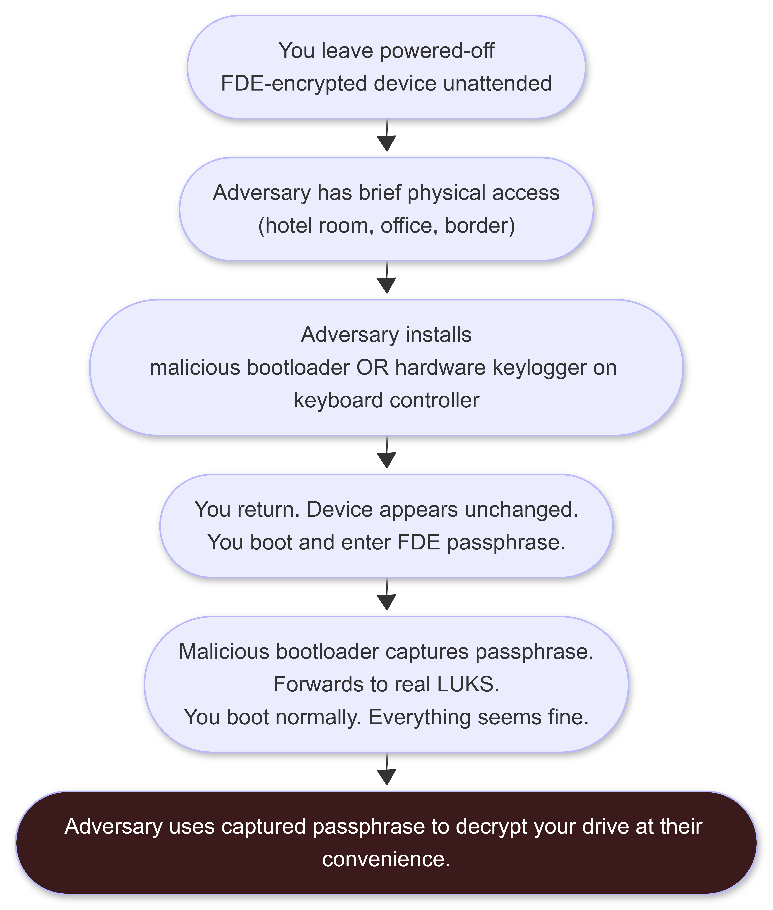

</td></tr></table>
</div>

**Concrete mitigations:**

**Mitigation 1: Physical Tamper Evidence**

```
Materials: Nail polish (dark, glittery -- harder to replicate exactly) or
           commercial tamper-evident seals

Procedure:
1. Apply nail polish dots over:
   - Chassis screws (the ones that must be removed to open the case)
   - USB port edges
   - Any other seams on the case
   
2. Photograph the seals with a calibrated timestamp before leaving the device

3. On return, before powering on: compare the current state of the seals
   to the photograph under good lighting
   
4. If seals have been disturbed: DO NOT POWER ON. Treat device as compromised.
   Transfer to a clean machine via USB after forensic imaging if needed.
```

**Mitigation 2: UEFI Secure Boot + TPM PCR Measurement**

When UEFI Secure Boot is enabled and the bootloader, kernel, and initramfs are signed, any modification to them (such as installing a malicious bootloader) invalidates the signature. The TPM measures the boot chain and compares it to stored measurements (PCRs). If anything changes:
- UEFI Secure Boot halts the boot (unsigned modifications fail)
- TPM refuses to release the LUKS key (measurements do not match)

```bash
# Check UEFI Secure Boot status:
mokutil --sb-state
# Should return: SecureBoot enabled

# Enable Secure Boot in UEFI settings:
# Enter UEFI/BIOS at startup (F2, F12, Del, or ESC)
# Navigate to Security > Secure Boot > Enable

# After enabling: ensure your distribution's bootloader is signed
# Ubuntu, Fedora, Debian: bootloaders are pre-signed; Secure Boot works out of the box
# Arch Linux: requires manual signing or using a signed bootloader stub

# Check TPM PCR measurements (LUKS2 with systemd-cryptenroll):
sudo systemd-cryptenroll --tpm2-pcrs=0+7 /dev/sdX
# PCR 0: UEFI firmware
# PCR 7: Secure Boot state
# Any change to firmware or Secure Boot state: TPM refuses to release key
```

**Mitigation 3: BIOS/UEFI Password**

A UEFI setup password prevents an adversary from disabling Secure Boot or modifying boot order without knowing the password.

```
Set a UEFI setup password:
  Enter UEFI at startup (F2, F12, Del, or ESC during POST)
  Navigate to Security > Set Supervisor Password (or Administrator Password)
  Set a strong, unique password (separate from your FDE passphrase)
  Save and exit

This prevents: changes to Secure Boot settings, boot order modification,
modification of UEFI settings that would allow bypassing Secure Boot

This does not prevent: hardware implants installed directly on the PCB,
UEFI firmware reflashing with custom tools (sophisticated adversaries)
```

**Mitigation 4: Chassis Intrusion Detection**

Some enterprise-grade laptops and desktops include a chassis intrusion detection switch that logs when the case is opened. Check your UEFI/BIOS for a "Chassis Intrusion" or "Cover Tamper Detection" setting and enable it if present.

```bash
# Check chassis intrusion status (IPMI-equipped servers and some enterprise laptops):
ipmitool sel list | grep -i "chassis\|intrusion"
# Look for: "Chassis | Chassis Intrusion | Intrusion"
```

**Mitigation 5: Detection Through Behavioral Anomalies**

After booting a device that may have been tampered with, look for:

```bash
# Compare UEFI firmware version to documented baseline
# Store baseline: dmidecode -t bios > baseline_bios.txt
dmidecode -t bios
# Compare to baseline: any version change is suspicious

# Check bootloader integrity:
sha256sum /boot/grub/grub.cfg
sha256sum /boot/vmlinuz-$(uname -r)
# Compare to baseline hashes stored on a separate clean system

# Check for unexpected USB/HID devices:
lsusb
dmesg | grep -i "usb\|hid"
# A hardware keylogger sometimes appears as an additional USB HID device

# Running processes audit:
ps aux | sort -k11
# Look for unfamiliar processes you did not start

# Network connections from the device after boot:
ss -tulpn
# Look for unexpected listeners or established connections
```

---

## 21. WHEN THINGS GO WRONG: THE BURN PROTOCOL

> *New in v1.0.0. This is the section that separates operators who ran for two years from operators who ran for ten. A perfect OPSEC setup that lacks a burn protocol is a ship with no lifeboats.*

The burn protocol is the decision tree for when you believe or suspect that an operation has been compromised, your infrastructure has been identified, or you as an individual may be under investigation. Most operators think about entry. Burn protocols are about exit.

---

### 21.1 Compromise Indicators: How You Know Something Is Wrong

<div align="center">
<table><tr><td>

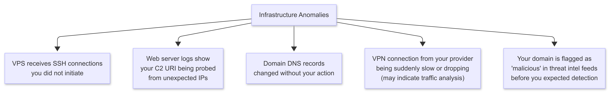

</td></tr></table>
</div>

---

<div align="center">
<table><tr><td>

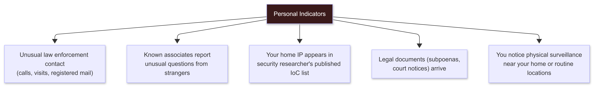

</td></tr></table>
</div>

---

<div align="center">
<table><tr><td>



</td></tr></table>
</div>

---

### 21.2 The Decision Tree: Assess Before Acting

<div align="center">
<table><tr><td>


</td></tr></table>
</div>

---

### 21.3 Low-Certainty Response: Monitor and Document

When you have a low-certainty indicator (unusual traffic, a slow VPN, a feeling something is off), the worst response is to immediately burn everything. Impulsive burning:
- Destroys evidence that could help you understand what happened
- Creates new activity that may itself be logged
- Confirms guilt to an adversary who was not yet certain

**Low-certainty procedure:**

```
1. Do not act on the suspicious infrastructure yet.

2. Establish a baseline for the anomaly:
   - What exactly is different from expected behavior?
   - What timestamp did it start?
   - Is it reproducible?
   - Is there a non-suspicious explanation?

3. Document everything now (encrypted, local only):
   - What you observed
   - When you observed it
   - Screenshots or log excerpts
   - Your current infrastructure inventory

4. Do not run new operations from compromised or potentially-compromised infrastructure
   while investigating.

5. Set a decision deadline:
   "If I cannot explain this anomaly within 48 hours, I execute partial burn."

6. Ask: has an associate's infrastructure or account been taken down?
   If yes: elevation to medium-certainty. Do not wait.
```

---

### 21.4 Partial Burn: One Asset Compromised

When a specific asset (one VPS, one domain, one identity) is confirmed or likely compromised:

```
PARTIAL BURN SEQUENCE:

Step 1: Immediately stop using the compromised asset.
        Do not disconnect, do not clean it -- stop using it.
        An adversary monitoring it will see your disconnection activity.
        You learn more by watching it remain idle than by triggering their response.

Step 2: Assume adjacent assets are fingerprinted.
        If VPS-A is compromised:
        - Any domain that pointed to VPS-A is potentially linked
        - Any IP that connected to VPS-A is in their logs
        - Any identity that operated from VPS-A is known

Step 3: Evaluate each adjacent asset independently.
        For each: "Can this be linked to my real identity through the compromised asset?"
        If yes: burn it. If no: continue monitoring it for signs of compromise.

Step 4: Stand up replacement infrastructure.
        New VPS from a fresh Monero wallet (not the one used for the compromised VPS).
        New domain registered through a fresh identity.
        New communication handles.
        No infrastructure overlap with the burned assets.

Step 5: Do not reuse any of the burned infrastructure, even after the heat dies down.
        Investigators maintain logs for extended periods.
        Infrastructure that was burned once remains burned.
```

---

### 21.5 Full Burn: Certain or High-Probability Compromise

A full burn is executed when you have high confidence that you are under active investigation or that your real identity has been linked to operational activity.

**This is not a drill. Execute in order.**

```
FULL BURN SEQUENCE:

IMMEDIATE (within 30 minutes):

1. Stop all active operations. Close all sessions. Disconnect from all operational VPS.
   Log nothing to the VPS during disconnection.

2. Evaluate physical safety. If there is any reason to believe law enforcement
   is nearby or en route: this is a legal situation, not a technical one.
   Stop. Consult legal counsel before doing anything else.
   Everything below is for the scenario where you have time.

3. Power off research machine. Full shutdown. Not sleep.

SHORT-TERM (within 24 hours, if you have time):

4. Tear down operational infrastructure.
   Log into each VPS through a FRESH Tor circuit (not one you have used before).
   Delete all data: rm -rf /home /var/www /root/.*
   Then: suspend or terminate the VPS instance.
   Reason for deleting first: some providers do not actually wipe disk on suspension.

5. For domains: let them expire or transfer to Njalla-held. Do not update DNS.

6. Wipe research machine.
   Option A: Secure boot from Tails USB; use Tails' disk wiping tool.
   Option B: On Linux: sudo shred -vzn 1 /dev/sdX (for HDD)
             For SSD: hdparm --security-erase (if supported)
   Option C: Physical destruction (drill through HDD platters or NAND chips)

7. Wipe communication devices.
   GrapheneOS Duress PIN or factory reset.
   For Signal: Go to Settings > Privacy > Advanced > Delete Account (removes server-side data).

8. Burn the operational identity.
   Archive (encrypted) or delete old communications.
   Any accounts associated with the operational identity: delete or abandon.

9. Inform relevant associates.
   Use a FRESH communication channel they have not seen before.
   Do not use any channel associated with burned identities.
   Message: "This channel is compromised. Go dark until new contact."

LONGER-TERM:

10. Wait. Do not stand up new infrastructure immediately.
    The period immediately after a burn is when you are most likely to make mistakes.
    If law enforcement is watching: new infrastructure standing up immediately
    after the burned infrastructure went dark is a correlation they can trace.
    Wait weeks to months before establishing any new operational presence.

11. Learn from the burn.
    How was the compromise made? What was the first domino?
    Document it. Fix it in the next infrastructure build.

12. Legal consultation.
    If you believe you may face legal consequences: consult a lawyer
    who specializes in computer crime law before speaking to anyone else,
    including law enforcement. Everything you say to law enforcement
    without counsel can and will be used against you.
```

---

### 21.6 What Not to Do When Burning

```
DO NOT:
  Destroy evidence while law enforcement is watching
  (evidence destruction is often an additional charge; tampering)

DO NOT:
  Contact associates on compromised channels to warn them
  (those channels are logged; your warning is evidence of your awareness)

DO NOT:
  Stand up new infrastructure from your home IP "just to check something"
  (your home IP is likely already a documented lead)

DO NOT:
  Attempt to clean logs on a VPS that is already under law enforcement observation
  (creates tampering evidence; they may already have the logs)

DO NOT:
  Discuss the situation with friends who are not legal counsel
  (they may be interviewed; anything they know, investigators know)

DO NOT:
  Rush. Panic creates mistakes. Slow, deliberate execution of the burn
  sequence is better than fast and incomplete.
```

---

## 22. CREW OPSEC AND CELL STRUCTURE

> *New in v1.0.0. Jeremy Hammond trusted Sabu. LulzSec shared IRC channels. Scattered Spider coordinated over Discord. In every case, a single point of trust failure propagated to the entire crew. This section is the practical guide to operating with others without that failure mode.*

---

### 22.1 The Core Problem: Your Security Is Your Weakest Associate

<div align="center">
<table><tr><td>


</td></tr></table>
</div>

The security of your crew is the security of its weakest member. This is not abstract. It is the exact mechanism that produced every major group prosecution.

---

### 22.2 Vetting Associates

You cannot verify that someone is who they claim to be online. You can evaluate their demonstrated OPSEC behavior.

```
Minimum observable signals of an associate worth trusting:

1. Consistent use of encrypted communications only.
   They never send sensitive material over unencrypted channels.
   They do not slip to Telegram or Discord "just for a quick message."

2. Operational handles compartmentalized from any traceable history.
   Run Maigret on their handle. If their research handle links to a Reddit account
   with five years of personal posts: their compartmentalization is poor.

3. They understand what they are doing.
   Can they explain their own threat model? If not, their OPSEC is not principled
   -- it is imitative. Imitative OPSEC fails when conditions change.

4. They have skin in the game.
   An associate who has nothing at stake is the most likely to cooperate
   with law enforcement when pressure is applied.

5. Time + observation.
   There is no shortcut to trust. Observe behavior over time.
   How do they respond under stress? Do they cut corners when tired?
   Do they use operational channels for personal messages?

Red flags:

  - Requests for more information than their role requires
  - Inconsistencies in their story about themselves
  - Sudden unexplained income or resources
  - Behavior changes: suddenly cooperative to an unusual degree
  - They were recently arrested or in legal trouble (possible informant)
  - They push for operations to proceed when you think OPSEC is insufficient
  - They ask operational questions that would only matter if they were documenting for someone else
```

---

### 22.3 Cell Structure: Need-to-Know Principle

The cell structure model compartmentalizes information so that no single associate can expose the entire operation.

<div align="center">
<table><tr><td>

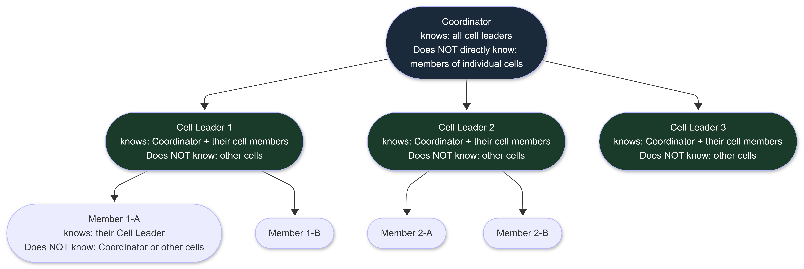

</td></tr></table>
</div>

**Need-to-know principle:** Every associate knows only what they need to know to perform their specific role. Nothing more.

```
Application in practice:

The person doing reconnaissance does not need to know
who will execute the operation with the recon data.

The person developing tools does not need to know
what targets they will be used against.

The person managing infrastructure does not need to know
what operations run on that infrastructure.

When Associate C is arrested and cooperates: they can only expose
what they know. If need-to-know was enforced: they know very little.
This limits the blast radius.

Common violations of need-to-know:
  - Sharing operation planning in a group channel (everyone now knows everything)
  - Introducing associates to each other before their collaboration is established
  - Discussing the full operation plan in early planning stages
    (the plan changes; early participants who drop out still know the old plan)
  - Sharing target details with infrastructure people who need only to set up VPS
```

---

### 22.4 Communication Protocols for Crews

```
Rule 1: One channel per relationship, not one channel for all.
  A group Signal chat that includes all associates is a single point of failure.
  Each 1:1 relationship gets its own Signal thread.
  Information shared in a 1:1 goes only to that person.

Rule 2: No cross-contamination of identity context.
  Do not use your research identity handle in operational contexts.
  Each role gets its own communication identity.

Rule 3: Compartmentalize operation details.
  Planning happens in the smallest group that needs to know.
  Execution details go to executors only.
  Infrastructure details go to the infrastructure person only.

Rule 4: Verbal communication protocol for sensitive real-time discussion.
  For the most sensitive coordination: in-person, in a verified clean location,
  no phones present (powered off and faraday-bagged or left at home).
  This is not always practical. But for the highest-stakes decisions: it is.

Rule 5: Dead drop for data sharing.
  Instead of sending files through a shared channel (which links sender and recipient):
  upload the file to a shared encrypted storage location.
  Each party accesses it independently, from their own infrastructure.
  The file is not linked to either party's identity through a direct transmission.

  Simple dead drop implementation:
  - A password-manager-hosted secure note (Bitwarden, KeePassXC) shared via secret link
  - An encrypted file on a shared anonymous hosting service (OnionShare over Tor)
  - An agreed OnionShare address known only to both parties
```

---

### 22.5 When an Associate Is Arrested or Goes Dark

```
An associate's arrest or sudden unexplained absence changes your
threat model immediately. They may have been turned. Their infrastructure
and communications may now be monitored or controlled by investigators.

IMMEDIATE ACTIONS:

1. Stop all communications with them on ALL channels.
   Not just the channel they used last. All channels.
   Investigators may operate the associate's accounts for a period
   to continue mapping the network ("sting continuation").

2. Assume they have provided everything they know.
   Your handle, your communication patterns, operation details,
   any infrastructure they had visibility into.

3. Evaluate which assets they had access to or knowledge of.
   Any VPS they knew about: burn.
   Any domain they knew about: burn.
   Any identity they knew your association with: retire.

4. Notify other associates through fresh channels.
   Not through any channel the arrested associate knew about.
   Message: "Associate X is dark. Assume full compromise of shared context."
   Keep it brief. No operational details in the notification.

5. Go dark yourself for a period.
   Let the situation stabilize. Investigators may be watching for
   remaining network members to become active after a crew member is arrested.

Signs that an associate is operating as an informant (post-arrest):
  - They resume contact quickly and ask clarifying questions about current operations
  - They push for documentation or detailed discussion of past operations
  - They encourage you to continue operations despite your caution
  - They introduce new "associates" you have not vetted
  - Their OPSEC suddenly seems improved (handler support)
  - They reference operational details they should not still remember accurately
```

---
## 23. PHASE -1 MILESTONES CHECKLIST

> Every item on this checklist has two states: "I read about it" and "I verified it works." Only the second state counts. Tick items only after verification.

---

### The Standard

**Read about it:** You understand what it does and why.  
**Verified it works:** You ran the test, produced the output, watched it function with your own tools.

The checklist below specifies the verification standard for each item. If a verification step is not listed, the standard is: demonstrate to yourself that the protection works by attempting to defeat it and confirming it holds.

---

### Part A: Counter-OSINT and Past Exposure (Week 1)

- [ ] Ran Maigret against every username you have ever used and documented the results
- [ ] Ran HaveIBeenPwned against every email address you have ever used
- [ ] Checked Archive.org for content posted under past usernames
- [ ] Audited Git commit history for any repos you contributed to; confirmed no personal email in commit history
- [ ] Checked all images you have publicly posted using exiftool; confirmed no GPS coordinates in EXIF data
- [ ] Submitted opt-out requests to minimum five major data brokers; set calendar reminder for 6-month re-audit
- [ ] Chose a research pseudonym; confirmed clean via Maigret (zero matches across 3,000+ platforms)
- [ ] Created a research identity email at ProtonMail; account created over Tor Browser; phone number not linked to real identity

---

### Part B: Communication Security (Week 1)

- [ ] Signal installed; configured with: disappearing messages 1 week max, call relay on, incognito keyboard on, screen lock on
- [ ] Telegram removed from operational use; no operational communications sent via Telegram
- [ ] GPG key pair created for research identity; key generated with research identity name and email only
- [ ] GPG: encrypted and decrypted a test message to verify the workflow functions
- [ ] GPG: signed and verified a test message
- [ ] SimpleX Chat or Session installed as secondary secure communication option

---

### Part C: Phone and Mobile (Week 1-2)

- [ ] GrapheneOS installed on a Google Pixel; web installer used; no Google account signed in
- [ ] GrapheneOS: PIN set (not fingerprint or face); biometrics disabled
- [ ] GrapheneOS: Auto reboot set to 18 hours
- [ ] GrapheneOS: LTE-only mode enabled (2G disabled); confirmed in settings
- [ ] GrapheneOS: USB peripherals set to off when not in use
- [ ] GrapheneOS: Duress PIN configured
- [ ] Faraday bag purchased; tested by placing device inside and calling it from another device: no ring = bag works; ring = bag defective, replace
- [ ] Personal phone and operational phone confirmed as separate devices; separation protocol documented
- [ ] SIM or VoIP for research communications acquired without linking to real identity

---

### Part D: Network Anonymization (Week 2)

- [ ] VPN provider selected (Mullvad, IVPN, or ProtonVPN); account created with no personal information; paid with Monero or equivalent
- [ ] WireGuard configured; `wg-quick up wg0` tested; `curl ifconfig.me` confirms VPN server IP, not real IP
- [ ] Kill switch configured in WireGuard config (PostUp/PreDown iptables rules); tested by manually disconnecting VPN and confirming all traffic stops; `curl ifconfig.me` fails or times out with VPN down
- [ ] Tor installed; `systemctl start tor` confirmed working; `proxychains4 curl https://check.torproject.org` returns "Congratulations"
- [ ] DNS leak test passed: `proxychains4 curl -s https://dnsleaktest.com/json` shows no ISP DNS servers
- [ ] WebRTC disabled in research browser: `https://browserleaks.com/webrtc` shows no IP leak
- [ ] WebGPU disabled in research browser: `https://webgpureport.org` shows no GPU access
- [ ] Full VPN + Tor stack verified end-to-end (Section 9.7 procedure completed)
- [ ] VPS accessed successfully through Tor (`proxychains4 ssh -p YOUR_PORT operator@VPS`); `who` on VPS shows Tor exit node IP, not real IP

---

### Part E: Browser Fingerprinting (Week 2)

- [ ] `https://coveryourtracks.eff.org` visited from research browser: result documented; target is "Strong Protection" rating
- [ ] Tor Browser downloaded from `https://www.torproject.org`; GPG signature verified before running
- [ ] Mullvad Browser downloaded and installed as alternative for non-Tor research sessions
- [ ] Hardened Firefox research profile created with user.js configuration from Section 10.5 applied
- [ ] Research browser profiles confirmed: zero crossover with personal accounts or personal browser sessions
- [ ] Browser profiles confirmed: clear on close settings active (verified by opening research profile, logging into a test account, closing and reopening -- account should be gone)

---

### Part F: Cryptocurrency and Anonymous Infrastructure (Week 2-3)

- [ ] Feather Wallet downloaded; GPG signature verified; installed on research machine
- [ ] Monero wallet created; seed phrase recorded on paper; paper stored offline and physically secured
- [ ] At least one subaddress created and labeled per intended payment purpose
- [ ] Monero acquired through non-KYC means (Haveno, Bisq, or cash P2P); not from a KYC exchange
- [ ] VPS purchased with Monero; accessed only through Tor for account creation and all subsequent sessions
- [ ] VPS hardening script (Section 8.4) executed; SSH on non-standard high port; root login disabled; password auth disabled; UFW configured; fail2ban active
- [ ] New SSH connection tested on the hardened port with key auth: `proxychains4 ssh -p YOUR_PORT operator@VPS`; confirmed working
- [ ] Domain registered through Njalla with Monero; DNS pointing to VPS; confirmed resolving
- [ ] Let's Encrypt certificate issued via certbot; `certbot renew --dry-run` succeeds; auto-renewal in crontab
- [ ] Redirector (Apache or Nginx) configured and tested; non-C2 traffic redirects to legitimate site; only C2-path traffic proxies to intended destination
- [ ] Warrant canary for VPS provider bookmarked; checking schedule set in calendar

---

### Part G: Identity Compartmentalization and Stylometry (Week 3)

- [ ] Three-identity model documented: personal, research, operational with defined rules for each
- [ ] Anonymouth installed from `https://github.com/psal/anonymouth`; sample text from research identity tested; baseline analysis completed
- [ ] Ollama installed; Mistral model pulled; `rewrite_for_research.sh` script tested; confirmed working offline
- [ ] Research identity writing persona defined in writing and practiced in at least ten research-context messages
- [ ] mat2 installed; tested on a document from your research environment; `mat2 --check` confirms clean output
- [ ] All files created on research machine confirmed as having no personal identity in author metadata: `exiftool sample_file.txt`
- [ ] Research OS timezone confirmed as UTC: `timedatectl` output shows UTC
- [ ] Research git config confirmed using research identity email: `git config --global user.email` returns research email

---

### Part H: Secure Research OS (Week 3)

- [ ] Selected primary research OS (Tails, Whonix, Qubes) based on threat model; installed and configured
- [ ] Full disk encryption enabled (LUKS); FDE passphrase uses minimum 6-word Diceware; confirmed can decrypt from live system
- [ ] If LUKS1: evaluated upgrade to LUKS2 for Argon2 key derivation
- [ ] MAC address randomization confirmed: `ip link show` -- MAC changes on each network reconnection
- [ ] Screen lock set to 5 minutes or less; confirmed by observation
- [ ] Swap disabled (`swapoff -a`; removed from /etc/fstab) OR confirmed swap is on encrypted volume
- [ ] If using Whonix: both Gateway and Workstation VMs updated; snapshots taken with "Clean baseline" label
- [ ] If using Qubes: hardware compatibility check passed; separate qubes created for research, personal, and malware analysis; sys-whonix routing confirmed

---

### Part I: Physical OPSEC (Week 3-4)

- [ ] Voice assistants (Amazon Echo, Google Nest, HomePod) removed from operational workspace or confirmed absent
- [ ] Smart TV in operational workspace either removed from network or microphone disabled
- [ ] IoT devices in operational workspace evaluated and either isolated on separate VLAN or disconnected
- [ ] Printer model checked against EFF tracking dot database; print protocol documented
- [ ] Workspace selection criteria reviewed; current operational workspace evaluated against criteria from Section 14.2
- [ ] Device power-off procedure memorized and tested: full shutdown, wait 90 seconds -- not sleep, not hibernate
- [ ] Tamper evidence method selected (nail polish or commercial seals); first application documented with photograph
- [ ] If applicable to travel: travel device strategy documented; border crossing procedure reviewed for relevant jurisdictions
- [ ] Physical surveillance awareness: routes to operational locations varied at least three times in the last month

---

### Part J: Timing and Pattern OPSEC (Week 4)

- [ ] Own operational session timing documented for one week; patterns identified and disrupted
- [ ] All research system clocks confirmed as UTC: `timedatectl`
- [ ] Research session start times distributed across at least four different UTC hour windows in the past two weeks
- [ ] File timestamps on research machine confirmed showing UTC (no local timezone leakage)

---

### Part K: Metadata (Week 4)

- [ ] exiftool installed; tested on own documents, images, and audio files; output reviewed
- [ ] mat2 installed; tested on PDF, DOCX, JPEG; `mat2 --check` confirms clean output files
- [ ] GPS data confirmed absent from all images associated with research identity
- [ ] Email sending confirmed through ProtonMail or Riseup over Tor; originating IP confirmed stripped from headers by sending a test email to a controlled address and reviewing raw headers
- [ ] All files shared under research identity passed through mat2 before sharing (last 30 days)

---

### Part L: Secure Deletion (Week 4)

- [ ] Confirmed storage type for research machine: HDD or SSD
- [ ] If HDD: `shred` tested on a test file; verified file is not recoverable with `testdisk` or similar
- [ ] If SSD: FDE confirmed enabled from initial setup; understood why file-level shredding is unreliable on SSD
- [ ] For SSD: `hdparm -I /dev/sdX | grep Security` run to verify secure erase capability for future use
- [ ] Swap situation confirmed: either disabled or encrypted
- [ ] Browser profile configured to clear all data on close; tested and confirmed

---

### Part M: Log Awareness (Week 4)

- [ ] `~/.bash_history` confirmed disabled (HISTFILE=/dev/null in .bashrc or .zshrc)
- [ ] Systemd journal configured as volatile only (`Storage=volatile` in journald.conf) on research machine
- [ ] VirusTotal policy defined: never upload operational tools or payloads; local sandbox configured instead
- [ ] VPS auth log verbosity reduced (`LogLevel QUIET` in sshd_config on VPS); confirmed via log review
- [ ] Target log awareness: table from Section 18.4 reviewed; before each operation: specific log sources for that target identified and OPSEC calibrated accordingly

---

### Part N: Forensic Artifacts (Week 4-5, New in v1.0.0)

- [ ] Vim swap files disabled (`set noswapfile` in ~/.vimrc); existing swap files found and deleted
- [ ] Nano backup files disabled (`set nobackups` in ~/.nanorc)
- [ ] GNOME recent files recording disabled (`gsettings set org.gnome.privacy remember-recent-files false`); confirmed via `gsettings get`
- [ ] Thumbnail cache cleared: `rm -rf ~/.cache/thumbnails/*`; confirmed empty
- [ ] Pre-session artifact check script from Section 19.11 saved and run at least once
- [ ] Git global config confirmed using research identity email and name
- [ ] pip cache cleared: `pip cache purge`; `~/.cache/pip/` confirmed empty or removed
- [ ] CUPS (print) logging disabled or CUPS removed if not needed
- [ ] SSH `known_hosts` reviewed; entries for old or test systems cleaned

---

### Part O: Cold Boot and Evil Maid (Week 4-5, New in v1.0.0)

- [ ] Full power-off procedure confirmed: `sudo shutdown -h now` -- not sleep, not hibernate
- [ ] AMD processor: SME availability checked (`dmesg | grep -i SME`); if available, enabled in GRUB and verified
- [ ] UEFI Secure Boot status checked: `mokutil --sb-state`; Secure Boot enabled if hardware supports it correctly
- [ ] UEFI setup (BIOS) password set; prevents modification of Secure Boot settings without the password
- [ ] TPM presence checked: `ls /dev/tpm*`; if TPM present: evaluated for LUKS binding with systemd-cryptenroll
- [ ] Tamper evidence applied to chassis screws; photographed; verification procedure practiced at least once
- [ ] Shutdown procedure under stress scenario practiced: can complete in under 60 seconds from any working state

---

### Part P: Burn Protocol and Crew OPSEC (Week 5, New in v1.0.0)

- [ ] Burn protocol from Section 21 read and memorized; key steps can be recalled without reference
- [ ] Infrastructure inventory maintained in an encrypted local file; current as of today
- [ ] "Go dark" signal agreed upon with any operational associates: a single pre-arranged phrase that means "burn everything, go silent"
- [ ] Legal counsel in relevant jurisdiction identified and contact information stored encrypted locally (for the scenario where you need to call someone immediately)
- [ ] If working with associates: each associate's OPSEC evaluated against Section 22.2 criteria
- [ ] Need-to-know principle applied: documented what each associate knows about your infrastructure and operations

---

### Milestone Summary

```
Week 1: Counter-OSINT audit, communication security, mobile setup
Week 2: Network anonymization, browser fingerprinting, infrastructure start
Week 3: Cryptocurrency, anonymous VPS, identity/stylometry, secure OS
Week 4: Physical OPSEC, timing, metadata, secure deletion, log awareness
Week 5: Forensic artifacts, cold boot/evil maid, burn protocol, crew OPSEC

Final verification: Run the Phase -1 self-test.
```

**Phase -1 Self-Test (run after all boxes are checked):**

```bash
#!/bin/bash
# Phase -1 Self-Test
# Run from your research machine over VPN + Tor

echo "=== PHASE -1 SELF-TEST ==="
echo ""

echo "[IDENTITY] Research IP (should be Tor exit node):"
proxychains4 curl -s https://ifconfig.me
echo ""

echo "[IDENTITY] DNS resolution (should not show your ISP):"
proxychains4 curl -s https://dnsleaktest.com/json | python3 -c "import sys,json; data=json.load(sys.stdin); [print(f'  DNS: {d[\"ip\"]} - {d[\"isp\"]}') for d in data]"
echo ""

echo "[IDENTITY] Tor confirmation:"
proxychains4 curl -s https://check.torproject.org | grep -o "Congratulations.*Tor" | head -1
echo ""

echo "[SHELL HISTORY] HISTFILE setting:"
echo "  HISTFILE=${HISTFILE:-UNSET-WARNING: bash history active}"
echo ""

echo "[SWAP] Active swap:"
swapon --show 2>/dev/null && echo "  WARNING: Swap is active" || echo "  OK: No swap active"
echo ""

echo "[VIM] Swap files:"
SWPCOUNT=$(find / -name "*.swp" 2>/dev/null | wc -l)
echo "  $SWPCOUNT swap files found $([ $SWPCOUNT -gt 0 ] && echo '(WARNING: clean these up)' || echo '(OK)')"
echo ""

echo "[RECENT FILES] Recent files recording:"
RF=$(gsettings get org.gnome.privacy remember-recent-files 2>/dev/null)
echo "  $RF $([ "$RF" = "false" ] && echo '(OK)' || echo '(WARNING: disable this)')"
echo ""

echo "[TIMEZONE] System timezone:"
timedatectl | grep "Time zone"
echo "  $([ "$(timedatectl | grep 'Time zone' | grep UTC)" ] && echo 'OK: UTC' || echo 'WARNING: Not UTC')"
echo ""

echo "[GIT] Git identity:"
echo "  $(git config --global user.email 2>/dev/null || echo 'No global git config')"
echo ""

echo "=== SELF-TEST COMPLETE ==="
echo "Review any WARNING lines before proceeding to Phase 0."
```

---

## 24. RESOURCES

> Resources are listed in three tiers: Required, Essential, and Reference. Required items are non-negotiable for Phase -1. Essential items significantly improve your capability. Reference items are for deeper study.

---

### 24.1 Required: Complete Before Advancing to Phase 0

**Case Studies and OPSEC Fundamentals:**

- **The Grugq on OPSEC** (Phreaking at CCC 2012) -- the foundational talk on operational security for hackers. Everything that came before: https://www.youtube.com/watch?v=9XaYdCdwiWU
- **"Breaking Monero" video series** -- required before using Monero for anything operational. Covers every known weakness with technical depth. Required watching: https://www.youtube.com/playlist?list=PLsSYUeVwrHBnAUre2G_LYDsdo-tD0ov-y (approximately 3 hours total; watch all episodes)
- **"The Art of Invisibility" by Kevin Mitnick** -- beginner-friendly coverage of real-world OPSEC failures; chapter by chapter case studies. No technical prerequisites.
- **Tor Project documentation** -- the official documentation for Tor Browser, standalone Tor daemon, and bridges: https://tb-manual.torproject.org/
- **EFF Surveillance Self-Defense** -- covers threat modeling and tool selection for different risk levels: https://ssd.eff.org/

---

### 24.2 Essential: Significantly Expands Capability

**Tools Documentation:**

- **Maigret documentation** -- full documentation for username OSINT: https://github.com/soxoj/maigret
- **Whonix documentation** -- complete setup guide and security notes: https://www.whonix.org/wiki/Documentation
- **Qubes OS documentation** -- installation guide, template management, qube setup: https://www.qubes-os.org/doc/
- **Tails documentation** -- getting started through advanced configuration: https://tails.boum.org/doc/
- **Feather Wallet documentation** -- Monero wallet with subaddress guide: https://docs.featherwallet.org/
- **arkenfox user.js** -- comprehensive Firefox hardening configuration; read the wiki to understand each setting: https://github.com/arkenfox/user.js
- **Anonymouth** -- stylometry analysis and anti-attribution tool: https://github.com/psal/anonymouth
- **mat2** -- metadata anonymisation toolkit documentation: https://0xacab.org/jvoisin/mat2

**Guides and Deep Dives:**

- **ProPublica: How to Leak to Journalists** -- covers OPSEC from the source's perspective; excellent complementary view: https://www.propublica.org/article/how-to-leak-to-propublica
- **Micah Lee (The Intercept): OPSEC for Journalists and Sources** -- journalistic OPSEC with technical depth: https://theintercept.com/2019/05/14/secured-drop-and-the-art-of-source-protection/
- **Bruce Schneier: Data and Goliath** -- surveillance systems, mass data collection, and implications; background reading
- **Graham Ivan Clark (Xanthe) case study** -- the 17-year-old who hacked Twitter in 2020; technical capability with poor OPSEC; study the arrest narrative

---

### 24.3 Reference: For Deeper Study

**Academic and Technical Papers:**

- **"Deanonymizing Tor Using Social Media"** (various authors; search arxiv.org) -- academic view of identity correlation attacks
- **Narayanan and Shmatikoff: "De-anonymizing Social Networks"** -- foundational paper on re-identification through graph structure
- **Butt et al.: "Stylometric Analysis Using Machine Learning"** -- overview of LLM-assisted stylometry attacks; 2023-2025 papers on arxiv.org

**Tools to Install and Practice With:**

- **Whonix wiki: MAC address anonymization** -- https://www.whonix.org/wiki/MAC_Address
- **Ollama** (local LLM runner): https://ollama.ai
- **Haveno** (Monero-native DEX): https://haveno.exchange
- **Bisq** (Bitcoin/XMR DEX): https://bisq.network
- **CoinATMRadar** (find cash Bitcoin ATMs): https://coinatmradar.com
- **Njalla** (domain registration without WHOIS exposure): https://njal.la
- **1984 Hosting** (Iceland-jurisdiction VPS, XMR accepted): https://1984.hosting
- **Sparrow Wallet** (Bitcoin wallet for BTC-to-XMR step): https://sparrowwallet.com
- **Feather Wallet** (best current Monero desktop wallet): https://featherwallet.org
- **JMP.chat** (XMPP phone numbers accepting Monero; for Signal registration without real SIM): https://jmp.chat
- **SimpleX Chat**: https://simplex.chat
- **Briar** (Tor-routed, works offline): https://briarproject.org
- **GrapheneOS web installer**: https://grapheneos.org/install/web

**Legal Resources:**

- **EFF's Know Your Rights** (US; for developers and security researchers): https://www.eff.org/issues/know-your-rights
- **Warrant Canary FAQ** (EFF): https://www.eff.org/pages/warrant-canary-faq
- **Reporters Committee for Freedom of the Press: Journalist's Guide to Federal Law** -- useful even for non-journalists; covers search, seizure, and subpoena law
- **EFF Coders' Rights Project**: https://www.eff.org/issues/coders

**OPSEC Failures to Study:**

- **United States v. Ross William Ulbricht** (Silk Road; 2013) -- full FBI affidavit is public record; read the specific evidence section
- **United States v. Hector Xavier Monsegur** (LulzSec/Sabu; 2011) -- cooperation agreement and plea documents in public record
- **United States v. Jeremy Hammond** (AntiSec; 2012) -- government sentencing documents detail the investigation
- **United States v. Joshua Schulte** (CIA Vault 7; ongoing) -- publicly available court filings detail forensic findings on his personal machines; most instructive for Section 19
- **United Kingdom v. Scattered Spider members** (2023-2024) -- press coverage of arrests; law enforcement statements detail which platforms provided evidence

---

### 24.4 Tool Installation Quick Reference

```bash
# --- CORE TOOLS ---
# Install all essential tools on a fresh Debian/Ubuntu research OS

sudo apt update && sudo apt install -y \
    tor proxychains4 curl wget git \
    wireguard wireguard-tools \
    exiftool mat2 secure-delete \
    gnupg2 gpgv \
    sqlite3 \
    vim \
    ufw fail2ban \
    bleachbit \
    nvme-cli hdparm \
    obfs4proxy

# pip tools
pip3 install maigret

# Sherlock (secondary username scanner)
git clone https://github.com/sherlock-project/sherlock /opt/sherlock
cd /opt/sherlock && pip3 install -r requirements.txt

# Ollama (local LLM for anti-stylometry)
curl -fsSL https://ollama.com/install.sh | sh
ollama pull mistral

# Feather Wallet
# Download from https://featherwallet.org/download/ -- verify GPG signature
# gpg --import featherwallet-release.asc
# gpg --verify feather-x.x.x-x86_64.AppImage.asc

# VirtualBox (for Whonix)
# Download from https://www.virtualbox.org/wiki/Downloads
# Includes Extension Pack (same page)

echo "Core tools installed. Verify each with --version or --help."
```

---

### 24.5 Time Investment Guide

| Activity | Estimated Time | When |
|---|---|---|
| Counter-OSINT audit (full) | 4-8 hours | Week 1 |
| Data broker opt-out | 4-6 hours | Week 1 |
| Communication setup (Signal, GPG) | 2-3 hours | Week 1 |
| GrapheneOS installation | 1-2 hours | Week 1-2 |
| Network stack setup (VPN + Tor + verify) | 3-4 hours | Week 2 |
| Anonymous VPS and domain | 4-6 hours (Monero acquisition adds time) | Week 2-3 |
| Secure OS installation and configuration | 3-8 hours (Qubes: 8+) | Week 3 |
| Stylometry analysis and persona development | 4-6 hours | Week 3 |
| Physical OPSEC workspace setup | 2-4 hours | Week 3-4 |
| Forensic artifact cleanup and prevention | 2-3 hours | Week 4 |
| Burn protocol design and documentation | 1-2 hours | Week 5 |
| Milestones checklist completion and self-test | 2-4 hours | Week 5 |

**Total: 35-60 hours over 3-5 weeks**

This is not a weekend project. The weeks are for practice, habit formation, and verification -- not just installation. A tool you installed and tested once is not OPSEC. A behavior you repeat until it is reflexive is.

---

### 24.6 When You Are Ready to Advance

You are ready to advance to Phase 0 when:

1. Every item in the milestones checklist is checked off with verified (not just read about)
2. The Phase -1 self-test script from Section 23 passes all checks without warnings
3. You have used your secure research setup daily for at least two weeks -- the habits are forming, not just the tools
4. You can explain to someone else, without notes:
   - What your threat model is and who your realistic adversary is
   - Why you chose the specific tools you chose
   - What logs your activity generates at each layer (your machine, ISP, VPN, Tor, VPS, target)
   - What you would do if you suspected compromise

5. You have the burn protocol memorized. Not written down somewhere. In your head.

If you pass these criteria: you are operationally more secure than 99% of people doing security research today. The technical skills that come in Phase 0 through Phase 4 will build on this foundation. Without this foundation: those skills are a building on sand.

---

<div align="right">

**What comes next in Phase 0:** Linux Fundamentals and Core Tooling

</div>

---

