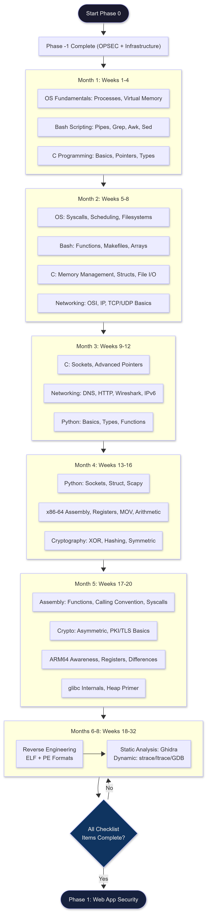
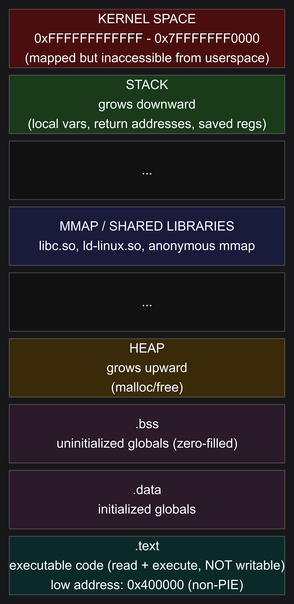
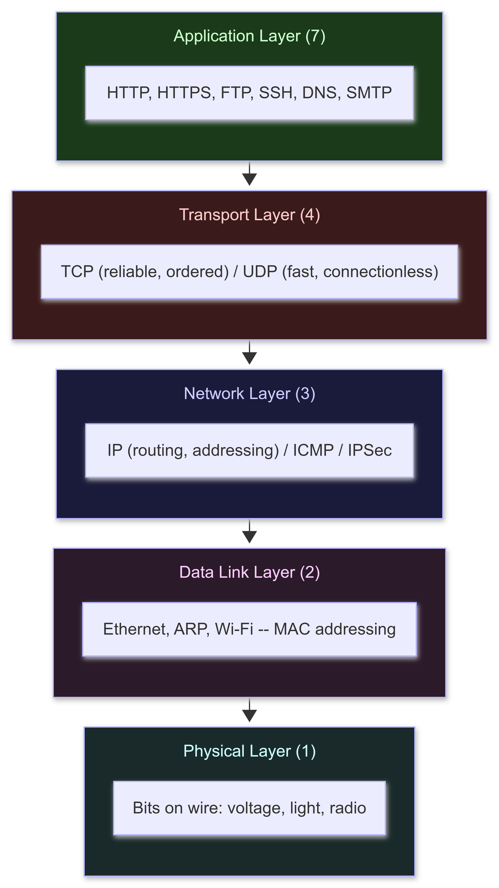
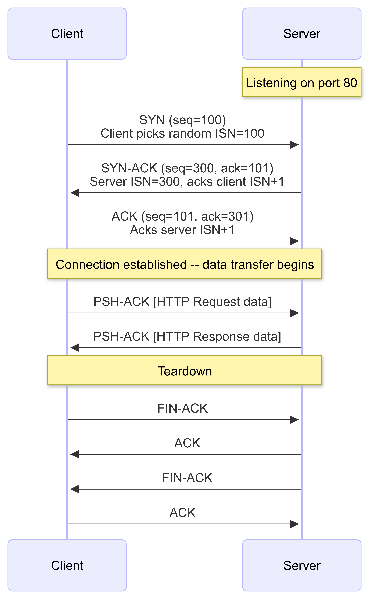
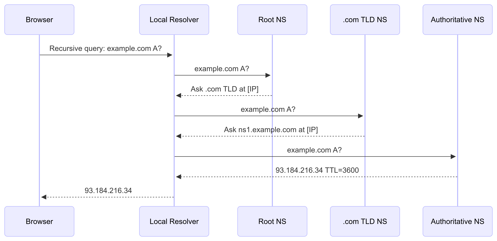

# PHASE 0: FOUNDATION

**Author:** Sagar Biswas<br/>
**Version:** v1.0.0 · 2027 Edition<br/>

<div align="right">

**You cannot exploit systems you do not understand.**

</div>

**Duration:** 5-8 Months (no background) | 3-5 Months (CS/dev background) | **Difficulty:** Beginner to Intermediate | **Hours/Week:** 20-25 | **Prerequisites:** Phase -1 (OPSEC and Infrastructure) | **Completion Rate:** 70% -- and the 30% who quit, quit in Weeks 3-6. Read the Failure Points section before you start.

---

> **This is the most important phase in the entire roadmap.**
>
> Everything from Phase 1 onward assumes you own this material completely. Not "understand it." **Own it.** Build with it. Debug it from memory. Adapt it when it breaks unexpectedly.
>
> Rushing this phase is how operators collapse under real-world pressure. The foundation determines the ceiling. Do the work. All of it.

---

## TABLE OF CONTENTS

1. [Goal and Philosophy](#1-goal-and-philosophy)
2. [How to Use This Phase](#2-how-to-use-this-phase)
3. [Prerequisites](#3-prerequisites)
4. [Checkpoint: What You Must Know by the End](#4-checkpoint-what-you-must-know-by-the-end)
5. [Timeline and Parallel Track Architecture](#5-timeline-and-parallel-track-architecture)
6. [Section 1: Operating Systems Fundamentals](#6-section-1-operating-systems-fundamentals)
7. [Section 1B: Bash Scripting Essentials](#7-section-1b-bash-scripting-essentials)
8. [Section 2: C Programming](#8-section-2-c-programming)
9. [Section 3: Python Scripting](#9-section-3-python-scripting)
10. [Section 4: Networking Fundamentals](#10-section-4-networking-fundamentals)
11. [Section 5: x86-64 Assembly](#11-section-5-x86-64-assembly)
12. [Section 6: Reverse Engineering Basics](#12-section-6-reverse-engineering-basics)
13. [Section 7: Cryptography Primer](#13-section-7-cryptography-primer)
14. [Section 8: ARM64 Architecture Awareness](#14-section-8-arm64-architecture-awareness)
15. [Section 9: glibc Internals Primer](#15-section-9-glibc-internals-primer)
16. [Milestone Projects: Full Spec Cards](#16-milestone-projects-full-spec-cards)
17. [Lab Setup](#17-lab-setup)
18. [GDB Setup and Command Reference](#18-gdb-setup-and-command-reference)
19. [CTF Platform Guide](#19-ctf-platform-guide)
20. [Common Failure Points and Fixes](#20-common-failure-points-and-fixes)
21. [Phase 0 Master Checklist](#21-phase-0-master-checklist)
22. [What Comes Next](#22-what-comes-next)
23. [Resources Aggregated](#23-resources-aggregated)

---

## 1. GOAL AND PHILOSOPHY

**Goal:** Build unshakeable fundamentals in operating systems, programming, networking, assembly, reverse engineering, and cryptography. You cannot exploit systems you do not understand. Shortcuts here compound into catastrophic gaps later -- gaps that show up when an exploit behaves unexpectedly in memory, when a binary does not match your mental model, when a network trace makes no sense.

### What This Phase Actually Builds

You are not learning to use tools. You are building the **mental model** that makes every tool make sense.

After Phase 0, when you open a debugger, you already know what the registers mean. When you look at a network capture, you already know what the bytes represent. When you read shellcode, you can trace it mentally. When you see an XOR loop in a decompiler, you know exactly what it is doing and why. The tool is just a window into something you already understand.

### What Separates Operators Who Make It

Not intelligence. Not speed. Not prior experience.

**Willingness to sit with confusion long enough for it to resolve.**

Every concept in this phase will feel impossible before it feels obvious. The window between impossible and obvious is usually 48-72 hours of sustained exposure. Most people quit in that window. They interpret confusion as a sign they are not cut out for this. They are wrong. Confusion is the learning process working correctly. The signal that you are not learning is when you feel nothing -- when you are reading passively without building, nodding along without understanding.

Do not quit in the confusion window. Build through it.

### Why 2027 Demands More Than Previous Years

The attack landscape has shifted. x86-64 is no longer the only architecture that matters:

- Apple Silicon (arm64) dominates macOS development machines -- your targets will be on these
- AWS Graviton and Ampere Altra power an increasing share of cloud infrastructure
- Android (arm64) is the world's most common operating system by user count
- IoT and embedded targets are overwhelmingly ARM Cortex-M and Cortex-A
- RISC-V is appearing in embedded and server contexts

Phase 0 teaches x86-64 as the primary architecture because the tooling, resources, and exploit techniques are most mature there. But it also plants the ARM64 seed now so you are not starting from zero when you encounter it in Phase 2.

---

## 2. HOW TO USE THIS PHASE

### Build a Knowledge Base: From Day 1

Install **Obsidian** (free, local-first, Markdown): https://obsidian.md

Create a vault called `hacking-kb`. Every time you learn something in this phase, write a note. Not a copy-paste -- a restatement in your own words. One note per concept. The act of writing forces understanding.

Suggested structure:
```
hacking-kb/
├── os/
│   ├── virtual-memory.md
│   ├── syscalls.md
│   └── process-model.md
├── c/
│   ├── pointers.md
│   └── memory-layout.md
├── assembly/
│   ├── x86-64-registers.md
│   ├── arm64-registers.md
│   └── calling-convention.md
├── networking/
│   ├── tcp-handshake.md
│   └── dns-resolution.md
├── re/
│   └── elf-format.md
├── crypto/
│   ├── xor-basics.md
│   └── pki-tls.md
└── gdb-cheatsheet.md   -- your personal GDB reference, built as you learn
```

You will consult this knowledge base in every phase that follows. Operators who build it in Phase 0 move 2x faster in Phase 3 and Phase 4. Operators who do not spend Phase 3 re-researching concepts they already saw once and forgot.

### The Building Rule

**Reading without building is tourism.** After every sub-section, close the document, open a terminal, and build something. Even if it is small. Even if it breaks. Especially if it breaks. Broken builds teach more than working examples.

### Weekly Self-Assessment

At the end of each week, spend 15 minutes answering three questions in your Obsidian vault:

1. What can I build today that I could not build last week?
2. What concept still does not feel solid? (This is what you revisit first next week.)
3. Did I hit my CTF minimum this week? (One challenge per day, minimum.)

These are not performance reviews. They are calibration instruments. The goal is honest data, not a good grade.

### Weekly "Am I On Track" Checkpoints

Use these as sanity checks. If you cannot do the item for your current week, you are not behind -- you are in the confusion window. Keep building.

| Week | You should be able to... |
|------|--------------------------|
| 2 | Write and compile a C program with malloc, free, and a pointer to a struct |
| 4 | Explain fork/exec from memory; navigate /proc/[pid]/maps and identify each region |
| 6 | Write a Bash script that reads a file and filters output through awk and grep in a pipeline |
| 8 | Write a C program that makes a direct write() syscall without libc |
| 10 | Write a Python TCP client that connects, sends data, and parses a binary response with struct |
| 12 | Trace a packet from application to wire in both directions, naming every header field |
| 14 | Write a NASM function callable from C; use GDB to step through it at the instruction level |
| 18 | Open an unknown ELF in Ghidra, find main(), rename all variables, map the control flow |
| 20 | Implement XOR encrypt/decrypt and break single-byte XOR by frequency analysis in Python |
| 22 | Explain the difference between x86-64 and ARM64 calling conventions without looking anything up |

### When You Are Stuck

1. **Read the error message.** Completely. Not the first line -- all of it.
2. **Re-read the relevant concept.** Something in your mental model is wrong.
3. **Search with precision.** "C segfault dereferencing null pointer" beats "C program crash."
4. **Use GDB.** Set a breakpoint before the crash. Look at the registers. Look at the memory. The answer is always in there.
5. **After 2 hours with no progress:** look at a reference implementation. Understand why it works. Then close it and rebuild from memory.

Skipping step 4 is the most common mistake beginners make. GDB is not an advanced tool. It is the first tool. Get comfortable with it in Week 1.

---

## 3. PREREQUISITES

Before starting Phase 0, you need:

- Phase -1 completed (OPSEC and Infrastructure)
- A working Linux installation (Ubuntu 22.04 LTS recommended): real install or VM
- Anonymous research environment set up per Phase -1
- Basic terminal comfort: you can navigate directories, create files, run commands
- A text editor -- **vim** is the recommendation (you will use it everywhere, learn the basics now)

**Vim basics you need in the first week** (15 minutes of practice covers this):
```
i          --> insert mode (start typing)
Esc        --> normal mode (stop typing)
:w         --> save
:q         --> quit
:wq        --> save and quit
:q!        --> quit without saving
dd         --> delete line
yy         --> copy line
p          --> paste
/word      --> search for "word"
n          --> next match
G          --> end of file
gg         --> beginning of file
```

**Zero prior programming experience?** This phase handles it. Section 2 (C) starts from scratch. Do not let "I have never coded" stop you from starting.

**CS/developer background?** Cut OS and Python sections by 40-50%. Do NOT skip assembly or reverse engineering -- almost no academic program teaches them at the depth needed here.

**Windows users:** WSL2 (Windows Subsystem for Linux 2) is a viable alternative to a full VM for Phase 0 learning. Install Ubuntu 22.04 from the Microsoft Store. WSL2 runs a real Linux kernel with native performance. Limitation: raw socket operations (AF_PACKET) require a VM or bare metal for Project 3. Everything else in Phase 0 works fine under WSL2.

---

## 4. CHECKPOINT: WHAT YOU MUST KNOW BY THE END

Before moving to Phase 1, you must be able to do every one of these **without looking anything up.** These are not optional. They are the entrance criteria for Phase 1.

### Operating Systems
- [ ] Explain what happens from `execve()` to a running process: fork, exec, address space layout
- [ ] Explain virtual memory: pages, page tables, TLB, physical vs virtual addresses
- [ ] Explain interrupt handling: hardware interrupt -> kernel entry -> handler -> return to userspace
- [ ] Explain process scheduling: context switch, scheduler, process states
- [ ] Navigate `/proc/[pid]/` and extract: maps, fd, status, cmdline, mem

### Bash Scripting
- [ ] Write a Bash script that takes a filename as argument, reads it line by line, and prints only lines matching a pattern
- [ ] Chain three tools with pipes to extract a specific field from command output
- [ ] Write a Makefile that compiles a multi-file C program and has a `clean` target
- [ ] Use `awk` to extract the 3rd field from space-separated output
- [ ] Write a `for` loop that runs nmap against a list of IPs from a file

### C Programming
- [ ] Write a program using pointers, pointer arithmetic, and void pointers correctly
- [ ] Explain the difference between stack and heap allocation; implement both
- [ ] Write a working linked list in C with insert, delete, traverse
- [ ] Write a program that makes direct system calls using inline assembly (no libc wrappers)
- [ ] Produce a memory leak intentionally, then detect it with Valgrind AND AddressSanitizer
- [ ] Write a Makefile that compiles a C program with multiple source files

### Python Scripting
- [ ] Write a TCP client and server in raw Python sockets
- [ ] Parse a binary file format using the `struct` module
- [ ] Write a script that runs a subprocess, captures stdout, and processes the output
- [ ] Use Scapy to craft and send a raw ARP request; parse the reply

### Networking
- [ ] Trace a packet from application layer to physical layer and back: every layer, every header field
- [ ] Explain the TCP three-way handshake byte by byte
- [ ] Explain DNS resolution from query to answer: every step
- [ ] Read a Wireshark capture and identify a TCP connection, a DNS query, and an HTTP request
- [ ] Explain the difference between IPv4 and IPv6 addressing; identify an IPv6 address on sight

### Assembly and Debugging
- [ ] Read x86-64 assembly output of a C function and trace its control flow
- [ ] Explain the x86-64 System V AMD64 calling convention from memory
- [ ] Write a function in NASM assembly that takes two arguments and returns a value
- [ ] Use GDB with GEF: set a breakpoint, step through instructions, examine registers and memory
- [ ] Explain how the ARM64 calling convention differs from x86-64 in two sentences

### Reverse Engineering
- [ ] Identify an ELF binary's architecture, entry point, and sections using `readelf`
- [ ] Extract printable strings from a binary and identify interesting ones
- [ ] Open a binary in Ghidra, navigate to `main()`, and read the decompiled output
- [ ] Trace a library call with `ltrace` and a syscall with `strace`
- [ ] Describe the structural difference between ELF (Linux) and PE (Windows) formats

### Cryptography
- [ ] Implement XOR encryption/decryption from scratch in Python
- [ ] Explain why XOR is reversible (mathematical proof in one line)
- [ ] Implement a Caesar cipher and break it by frequency analysis
- [ ] Explain the difference between symmetric and asymmetric encryption (one paragraph, no notes)
- [ ] Compute an MD5 and SHA-256 hash of a file and explain why they are one-way
- [ ] Explain what a TLS certificate is and what the chain of trust means

### ARM64 Awareness
- [ ] Name the ARM64 general-purpose registers used for arguments (x0-x7) and return values (x0)
- [ ] Explain one structural difference between ARM64 and x86-64 instruction design
- [ ] Identify an ARM64 ELF binary using `file` or `readelf`

---

## 5. TIMELINE AND PARALLEL TRACK ARCHITECTURE

The honest timeline for a beginner with no prior background is **5-8 months at 20-25 hours/week.** If you have prior development experience, 3-5 months is realistic.

**The critical insight about parallelism:** You do not finish one section then start the next. Several tracks run simultaneously because they reinforce each other. Reading about OS memory management while writing C programs that allocate memory makes both click faster. Learning assembly while reading C compiler output makes both sharper.

### Phase 0 Learning Path Overview

<div align="center">
<table><tr><td>



</td></tr></table>
</div>

### Milestone Project Schedule

| Project | Primary Section | Target Week | Hours |
|---------|----------------|-------------|-------|
| 1. Simple Shell in C | C + OS | 6-8 | 15-25 |
| 2. Memory Allocator | C + OS | 10-12 | 20-30 |
| 3. Network Packet Analyzer | Networking + C | 14-16 | 15-20 |
| 4. Assembly Function Library | Assembly | 17-19 | 10-15 |
| 5. First Binary Reverse | RE Basics | 22-24 | 10-15 |

**CTF (picoCTF):** Start Week 4. Run concurrently forever. Details in Section 19.

---

## 6. SECTION 1: OPERATING SYSTEMS FUNDAMENTALS

**Duration:** 6-8 weeks (Weeks 1-8) | **Parallel with:** C Programming, Bash Scripting

### Why This Comes First

Every exploit targets the operating system's abstractions. Buffer overflows corrupt the stack -- a construct the OS and calling convention define. Process injection writes into another process's address space -- which only exists because the OS created it. Privilege escalation abuses the OS's permission model. Understanding what you are breaking is not optional background: it is the foundation every technique builds on.

---

### 1.1 Processes and Threads

A **process** is a running program. It is not the program itself -- the program is bytes on disk. When the OS executes a program, it creates a process: a distinct execution context with its own address space, file descriptor table, and state.

**What a process consists of:**
- **Address space:** the virtual memory the process sees (code, data, stack, heap, mapped files)
- **Thread(s):** actual execution streams -- a process has at least one
- **File descriptor table:** open files, sockets, pipes indexed by integer (0=stdin, 1=stdout, 2=stderr)
- **Process state:** running, sleeping (interruptible/uninterruptible), zombie, stopped
- **PID:** process identifier, assigned by the OS at creation

A **thread** is an execution context within a process. Threads share the process's address space but each has its own stack and registers. This is why threads are cheaper to create than processes (no new address space) and why they introduce race conditions (shared memory + concurrent access = undefined behavior without synchronization).

**How a process is created -- the fork/exec model:**

```c
// On Linux, new processes come from fork() + exec()
// This is how your shell runs every command you type.

#include <unistd.h>
#include <sys/wait.h>
#include <stdio.h>

int main() {
    pid_t pid = fork();    // Creates an exact copy of the current process
                           // Returns 0 in child, child's PID in parent, -1 on error

    if (pid == 0) {
        // We are in the child process (pid == 0 means "I am the child")
        char *argv[] = {"/bin/ls", "-la", NULL};
        char *envp[] = {NULL};
        execve("/bin/ls", argv, envp);  // Replace child's entire memory image with ls
        // If execve() returns, it failed. execve never returns on success.
        perror("execve failed");
        return 1;

    } else if (pid > 0) {
        // We are in the parent process
        int status;
        waitpid(pid, &status, 0);  // Wait for child to finish; prevents zombie processes
        printf("Child exited with status: %d\n", WEXITSTATUS(status));

    } else {
        // pid == -1: fork failed (out of memory, process limit hit)
        perror("fork failed");
        return 1;
    }
    return 0;
}
```

**Key system calls for processes:**

| Syscall | Number (x86-64) | What it does |
|---------|-----------------|--------------|
| `fork()` | 57 | Create child process (copy of parent) |
| `execve()` | 59 | Replace process image with new program |
| `exit()` | 60 | Terminate process, return status to parent |
| `waitpid()` | 61 | Wait for child to change state; collect exit status |
| `getpid()` | 39 | Get current process ID |
| `getppid()` | 110 | Get parent process ID |
| `clone()` | 56 | Create thread (fork with granular control over shared resources) |
| `kill()` | 62 | Send a signal to a process |

**Inspect live processes:**
```bash
# List all processes with full detail
ps aux

# Process tree (shows parent-child relationships)
pstree -p

# Dynamic process viewer
top
htop   # better; install: apt install htop

# Everything about a specific process
ls -la /proc/[pid]/
cat /proc/[pid]/status     # state, PID, PPID, memory stats
cat /proc/[pid]/cmdline    # command line that started it (null-separated)
cat /proc/[pid]/maps       # virtual memory map (CRITICAL -- study this)
ls -la /proc/[pid]/fd/     # open file descriptors
```

---

### 1.2 Virtual Memory: The Most Important Concept in Phase 0

This is the foundation of every memory corruption exploit. Understand this completely before moving on.

**Virtual memory** gives every process the illusion that it owns the entire address space. On 64-bit Linux, each process sees a 48-bit virtual address space (~128 TB). The physical RAM might be 16 GB. The mismatch does not matter because the OS handles translation transparently.

**Why virtual memory exists:**
1. **Isolation:** Process A cannot read Process B's memory by default. (This is exactly what process injection exploits break.)
2. **Overcommit:** Processes can request more memory than physically exists; the OS pages cold memory to disk.
3. **Shared libraries:** `libc.so` is mapped into every process at runtime but only exists once in physical RAM.

**Address Space Layout of a Process:**

<div align="center">
<table><tr><td>



</td></tr></table>
</div>

**ASLR (Address Space Layout Randomization):** On modern Linux, the stack, heap, and library base addresses are randomized at load time. The text segment of PIE (Position-Independent Executable) binaries is also randomized. This is why hardcoded addresses fail -- and why defeating ASLR is a core technique in Phase 3.

**Pages and Page Tables:**

Memory is divided into **pages** (4096 bytes = 4 KB default). The CPU's Memory Management Unit (MMU) translates virtual addresses to physical addresses using page tables maintained by the kernel.

```
Virtual Address (64-bit x86-64):
  [Unused: bits 63-48][PML4 index: 9 bits][PDPT index: 9 bits]
  [PD index: 9 bits][PT index: 9 bits][Page Offset: 12 bits]
                                                  |
                                     Page Table Walk (4 levels)
                                                  |
Physical Address: [Physical Frame Number][Page Offset: 12 bits]
```

Each page has **permission bits** enforced by hardware:
- **R** (readable): can read from this page
- **W** (writable): can write to this page
- **X** (executable): can execute code from this page

The `.text` section is **R+X, not W**. The stack is **R+W, not X** (when NX/DEP is enabled). Writing to a read-only page causes a page fault, and the kernel sends SIGSEGV to the process.

**Translation Lookaside Buffer (TLB):** Page table walks are expensive (4 memory accesses). The TLB caches recent virtual-to-physical translations. Context switches flush the TLB -- a major performance cost.

**Read a live process's memory map:**
```bash
# Your own process
cat /proc/self/maps

# Another process (requires matching UID or root)
cat /proc/[pid]/maps

# Example output and what each field means:
# 55f0a3e00000-55f0a3e01000 r--p 00000000 08:01 1234567  /usr/bin/cat
# address range             perms offset  dev   inode    path
#
# perms: r=read, w=write, x=execute, p=private(CoW), s=shared
```

**Practical exercise:** Open a terminal. Run `cat /proc/self/maps`. Find: the text segment, the stack, the heap, the libc mapping. Identify the permissions on each. Note whether any segment is executable. This is the map you will be exploiting in Phase 3.

---

### 1.3 System Calls: The Kernel Interface

A system call is the controlled mechanism by which userspace code asks the kernel to do something privileged: open a file, allocate memory, create a process, send data over a network. The CPU runs in two modes: **user mode** (ring 3) and **kernel mode** (ring 0). Userspace code cannot directly touch hardware. System calls are the bridge.

**The syscall mechanism on x86-64 Linux:**

```nasm
; Step 1: Load syscall number into rax
; Step 2: Load arguments into rdi, rsi, rdx, r10, r8, r9 (in order)
; Step 3: Execute `syscall` instruction -> CPU switches to ring 0
; Step 4: Kernel validates args, executes, switches back to ring 3
; Step 5: Return value is in rax (negative value = -errno on error)

; Example: write(1, "hello\n", 6) -- write to stdout
section .data
    msg db "hello", 0x0a    ; "hello\n"

section .text
    global _start
_start:
    mov rax, 1          ; syscall number 1 = write
    mov rdi, 1          ; arg1: fd = 1 (stdout)
    mov rsi, msg        ; arg2: pointer to buffer
    mov rdx, 6          ; arg3: byte count
    syscall             ; invoke kernel

    mov rax, 60         ; syscall number 60 = exit
    xor rdi, rdi        ; arg1: exit code = 0
    syscall
```

**Essential syscall reference (x86-64 Linux):**

| Syscall | Number | Signature |
|---------|--------|-----------|
| `read` | 0 | `read(fd, buf, count)` |
| `write` | 1 | `write(fd, buf, count)` |
| `open` | 2 | `open(filename, flags, mode)` |
| `close` | 3 | `close(fd)` |
| `stat` | 4 | `stat(filename, statbuf)` |
| `mmap` | 9 | `mmap(addr, len, prot, flags, fd, offset)` |
| `mprotect` | 10 | `mprotect(addr, len, prot)` |
| `munmap` | 11 | `munmap(addr, len)` |
| `brk` | 12 | `brk(addr)` -- heap growth |
| `fork` | 57 | `fork()` |
| `execve` | 59 | `execve(filename, argv, envp)` |
| `exit` | 60 | `exit(error_code)` |
| `socket` | 41 | `socket(family, type, protocol)` |
| `connect` | 42 | `connect(fd, addr, addrlen)` |
| `accept` | 43 | `accept(fd, addr, addrlen)` |

Full reference: https://syscall.sh -- bookmark this. You will use it constantly.

**Trace syscalls of any program:**
```bash
# Print every syscall a program makes with arguments and return values
strace /bin/ls

# Attach to running process by PID
strace -p [pid]

# Filter to specific syscalls
strace -e trace=open,read,write /bin/cat /etc/passwd

# Show time spent in each syscall
strace -c /bin/ls
```

---

### 1.4 Filesystems

**Everything in Linux is a file.** Devices, sockets, pipes, processes (/proc), hardware (/dev) -- all exposed through the file interface (open/read/write/close).

**Filesystem hierarchy (know these paths):**
```
/               Root
/bin            Essential binaries (ls, cat, sh)
/sbin           System binaries (fdisk, ifconfig)
/etc            Configuration files (/etc/passwd, /etc/shadow, /etc/hosts)
/home/username  User home directories
/root           Root user home
/tmp            Temporary files (world-writable; a classic attack surface)
/var            Variable data (logs in /var/log/, mail, spool)
/proc           Virtual FS: live kernel/process data (not on disk)
/sys            Virtual FS: hardware/driver info
/dev            Device files (disk, null, random, urandom, tty)
/lib            Shared libraries
/usr/lib        More shared libraries
/opt            Optional third-party software
```

**Key files for offensive work (memorize these):**
```bash
/etc/passwd        # User accounts (username, UID, GID, home, shell)
/etc/shadow        # Password hashes (readable only by root)
/etc/hosts         # Static hostname/IP mappings
/etc/crontab       # System-wide cron jobs (privilege escalation target)
/etc/sudoers       # Who can run what as root (sudo configuration)
/etc/ssh/          # SSH server configuration and host keys
~/.ssh/            # User SSH keys (authorized_keys, id_rsa)
~/.bash_history    # Command history (contains passwords, paths, clues)
/var/log/auth.log  # Authentication log (Ubuntu) / /var/log/secure (RHEL)
/var/log/syslog    # System log
/tmp/              # World-writable; used for dropping tools
```

**File permissions -- read them instantly:**
```bash
# Output of ls -la:
# -rwxr-xr-- 1 root staff 4096 Jan 1 00:00 filename
#  rwx r-x r--
#  owner group other

# Read permissions numerically:
# r=4, w=2, x=1
# rwxr-xr-- = 754
# rw-r--r-- = 644 (typical file)
# rwx------ = 700 (only owner can do anything)
# rwxr-xr-x = 755 (typical executable)

# SUID bit: when set on an executable, runs as the file's OWNER, not the caller
# ls -la shows 's' instead of 'x' for owner:
# -rwsr-xr-x  (SUID set -- if owned by root, runs as root regardless of who calls it)

# Find all SUID binaries on a system:
find / -perm -4000 -type f 2>/dev/null
```

---

### 1.5 The /proc Filesystem

`/proc` is a virtual filesystem -- it does not exist on disk. The kernel generates its content dynamically. It is the most useful debugging and reconnaissance interface on Linux.

```bash
# For your own shell process ($$ = current shell PID)
cat /proc/$$/maps         # Virtual memory map of the shell process
cat /proc/$$/status       # Name, State, PID, PPID, UID, GID, memory usage
ls -la /proc/$$/fd/       # Open file descriptors
cat /proc/$$/cmdline      # Command line (null-byte separated)
cat /proc/$$/environ      # Environment variables

# System-wide information
cat /proc/cpuinfo         # CPU details (architecture, features, flags)
cat /proc/meminfo         # Memory stats
cat /proc/net/tcp         # Active TCP connections (hex addresses and ports)
cat /proc/net/udp         # Active UDP connections
cat /proc/loadavg         # System load averages
cat /proc/version         # Kernel version string
cat /proc/sys/kernel/randomize_va_space  # ASLR setting (0=off, 1=partial, 2=full)
```

**Exercise:** Open a text editor (gedit, nano). Find its PID with `ps aux | grep gedit`. Read its `/proc/[pid]/maps`. Identify: where is the editor's code? Where is libc? Where is the stack? Where is the heap?

---

### Section 1 Resources

| Resource | Type | Cost | Notes |
|----------|------|------|-------|
| [Operating Systems: Three Easy Pieces (OSTEP)](https://pages.cs.wisc.edu/~remzi/OSTEP/) | Free Book | FREE | The best OS textbook. Conversational tone. Read chapters on processes, virtual memory, concurrency. |
| [Linux Kernel Labs](https://linux-kernel-labs.github.io/) | Tutorial | FREE | Goes deep. Use as reference when you want more. |
| `man 2 syscall` | Man page | FREE | Read this. Then read `man 2 fork`, `man 2 execve`, `man 2 mmap`. The man pages are complete. |
| [The Linux Programming Interface (Kerrisk)](https://man7.org/tlpi/) | Book | ~$70 | The definitive Linux systems programming reference. Optional for Phase 0, essential eventually. |

---

## 7. SECTION 1B: BASH SCRIPTING ESSENTIALS

**Duration:** 5-6 weeks (Weeks 1-6) | **Parallel with:** OS Fundamentals, C Programming

> **Start this Week 1. Run it parallel to everything else. This is not optional.**
>
> Bash is used every single day in offensive work: wrapping tools, parsing output, automating recon, processing log files, writing exploit delivery scripts. Not knowing Bash is like being a carpenter who cannot use a tape measure -- the other skills do not matter if you cannot work efficiently.

---

### 1B.1 The Absolute Basics

```bash
#!/bin/bash

# Variables: no spaces around =
name="Sagar Biswas"
port=4444
echo "Name: $name"
echo "Port: ${port}"
echo "Port+1: $((port + 1))"

# Strings
greeting="Hello, $name"      # Double quotes: variable expansion works
literal='No $expansion here'  # Single quotes: no expansion

# Command substitution: capture output of a command into a variable
current_user=$(whoami)
current_dir=$(pwd)
file_count=$(ls /etc | wc -l)

echo "User: $current_user, Dir: $current_dir, /etc files: $file_count"
```

---

### 1B.2 Pipes and Redirection: The Most Important Bash Concept

```bash
# Redirection
command > file.txt        # Redirect stdout to file (OVERWRITES)
command >> file.txt       # Redirect stdout to file (APPENDS)
command 2> errors.txt     # Redirect stderr to file
command 2>&1              # Redirect stderr to stdout
command > out.txt 2>&1    # Redirect both stdout and stderr to file
command < input.txt       # Read stdin from file

# Pipes: stdout of left becomes stdin of right
cat /etc/passwd | grep bash
ps aux | grep python | awk '{print $2}' | head -5
cat access.log | sort | uniq -c | sort -rn | head -20

# /dev/null: discard output you do not want
command 2>/dev/null       # Suppress error messages
command > /dev/null 2>&1  # Suppress all output

# tee: send output to BOTH a file AND stdout
nmap 192.168.1.0/24 | tee scan.txt
```

---

### 1B.3 The Text Processing Triad: grep, awk, sed

Master these three tools. They process 90% of all text manipulation tasks in offensive work.

#### grep -- Find Lines Matching a Pattern

```bash
grep "pattern" file.txt           # Print lines matching pattern
grep -i "pattern" file.txt        # Case-insensitive
grep -r "pattern" /directory/     # Recursive
grep -n "pattern" file.txt        # Show line numbers
grep -v "pattern" file.txt        # Invert: lines NOT matching
grep -E "error|warning|critical" /var/log/syslog  # OR matching

# Practical offensive usage
grep -r "password" /var/www/ 2>/dev/null
grep -r "api_key\|secret\|token" . 2>/dev/null
grep -E "[0-9]{1,3}\.[0-9]{1,3}\.[0-9]{1,3}\.[0-9]{1,3}" file.txt
cat /etc/passwd | grep -v "nologin\|false"
```

#### awk -- Field Extraction and Pattern Processing

```bash
# Default field separator: whitespace
awk '{print $1}' file.txt         # First field of every line
awk '{print $1, $3}' file.txt     # Fields 1 and 3
awk '{print $NF}' file.txt        # Last field

# Field separator with -F
awk -F: '{print $1}' /etc/passwd           # Print usernames
awk -F: '{print $1, $3}' /etc/passwd       # Username and UID
awk -F: '$3 == 0' /etc/passwd              # Root-equivalent accounts
awk -F: '$3 >= 1000 {print $1}' /etc/passwd  # Regular user accounts

# Arithmetic
awk '{sum += $1} END {print sum}' numbers.txt    # Sum a column
awk '{count[$1]++} END {for(k in count) print count[k], k}' access.log

# Practical offensive usage
ps aux | awk '{print $2, $11}'
ss -tnp | awk 'NR>1 {print $4, $6}'
cat /etc/passwd | awk -F: '{print $1":"$3":"$6}'
```

#### sed -- Stream Editor

```bash
sed 's/old/new/' file.txt          # Replace first occurrence per line
sed 's/old/new/g' file.txt         # Replace ALL occurrences per line
sed -i 's/old/new/g' file.txt      # In-place edit
sed '/^#/d' file.txt               # Delete comment lines
sed '/^$/d' file.txt               # Delete empty lines
sed -n '5,10p' file.txt            # Print lines 5-10

# Practical
cat /etc/hosts | sed '/^#/d' | sed '/^$/d'
sed 's/\r//' windows_file.txt      # Remove Windows carriage returns
```

---

### 1B.4 Control Flow

```bash
#!/bin/bash

# if/elif/else
if [ -f "/etc/passwd" ]; then
    echo "File exists"
elif [ -d "/etc/shadow" ]; then
    echo "It is a directory"
else
    echo "Neither"
fi

# Common test operators:
# [ -f file ]       file exists and is a regular file
# [ -d dir ]        directory exists
# [ -r file ]       file is readable
# [ -x file ]       file is executable
# [ -z "$var" ]     string is empty
# [ "$a" = "$b" ]   strings are equal
# [ "$n" -gt 5 ]    integer greater than

# for loop
for i in 1 2 3 4 5; do
    echo "Number: $i"
done

# for loop over lines in a file
while IFS= read -r line; do
    echo "Line: $line"
done < hosts.txt

# Loop over command output
for pid in $(pgrep python); do
    echo "Python process: $pid"
    cat /proc/$pid/cmdline | tr '\0' ' '
    echo
done
```

---

### 1B.5 Functions and Script Structure

```bash
#!/bin/bash
# Best-practice script structure

set -euo pipefail
# -e: exit immediately if a command fails
# -u: treat unset variables as errors
# -o pipefail: pipe fails if any command in it fails
# These three lines should open every serious Bash script.

check_root() {
    if [ "$EUID" -ne 0 ]; then
        echo "[-] Must run as root" >&2
        exit 1
    fi
    echo "[+] Running as root"
}

scan_host() {
    local host="$1"
    local port="$2"
    echo "[*] Scanning $host:$port"
    nc -z -w 2 "$host" "$port" && echo "[+] Open" || echo "[-] Closed"
}

main() {
    check_root
    local target="${1:-192.168.1.1}"
    for port in 22 80 443 445 3389; do
        scan_host "$target" "$port"
    done
}

main "$@"
```

---

### 1B.6 Arrays and Practical Patterns

```bash
#!/bin/bash

# Arrays
targets=("192.168.1.1" "192.168.1.2" "10.0.0.5")
echo "First: ${targets[0]}"
echo "All: ${targets[@]}"
echo "Count: ${#targets[@]}"
targets+=("10.0.0.10")

# Loop over array
for ip in "${targets[@]}"; do
    ping -c 1 -W 1 "$ip" &>/dev/null && echo "[+] $ip is up" || echo "[-] $ip down"
done

# Read array from file
mapfile -t hosts < hosts.txt

# String manipulation
filename="/path/to/file.txt"
echo "${filename##*/}"    # Filename only: file.txt
echo "${filename%.*}"     # Without extension: /path/to/file
echo "${filename##*.}"    # Extension only: txt

# Parallel execution
for ip in "${targets[@]}"; do
    nmap -sn "$ip" &
done
wait
echo "Scan complete"
```

---

### 1B.7 Makefile Basics

```makefile
# CRITICAL: indentation MUST be a TAB character, not spaces.

CC = gcc
CFLAGS = -Wall -Wextra -g -O0
TARGET = shell
SRCS = main.c utils.c syscalls.c
OBJS = $(SRCS:.c=.o)

all: $(TARGET)

$(TARGET): $(OBJS)
	$(CC) $(CFLAGS) -o $(TARGET) $(OBJS)
	@echo "[+] Built $(TARGET)"

%.o: %.c
	$(CC) $(CFLAGS) -c -o $@ $<

.PHONY: all clean debug install

clean:
	rm -f $(TARGET) $(OBJS)
	@echo "[*] Cleaned"

debug: CFLAGS += -DDEBUG -fsanitize=address,undefined
debug: $(TARGET)
```

### 1B.8 What to Build (Section 1B)

**Exercise 1:** Write `port_check.sh`: reads IPs from a file, checks ports 22 and 80 with `nc`, writes results to `results.txt`.

**Exercise 2:** Parse `/var/log/auth.log`, extract failed SSH login attempts, count per source IP, sort by count descending, print top 10.

**Exercise 3:** Write a Makefile for a two-file C project with targets: `all`, `clean`, `debug`, and `install`.

**Exercise 4:** Find all `.c` files recursively in a directory, count lines of code in each, print sorted by line count (largest first).

**Exercise 5:** Monitor a log file in real time with `tail -f` and alert to stderr whenever a line matching "FAILED" or "ERROR" appears.

### Section 1B Resources

| Resource | Type | Cost | Notes |
|----------|------|------|-------|
| [Bash scripting cheatsheet](https://devhints.io/bash) | Reference | FREE | Best quick reference. Bookmark it. |
| [Shell Scripting Tutorial](https://www.shellscript.sh/) | Tutorial | FREE | Beginner-friendly. Work through it. |
| `man bash` | Man page | FREE | The authoritative reference. Long, but complete. |
| [CommandLineFu](https://www.commandlinefu.com/) | Examples | FREE | One-liners for inspiration. Read daily. |
| [The Art of Command Line](https://github.com/jlevy/the-art-of-command-line) | Guide | FREE | Intermediate-level. Return to this during Phase 1. |

---

## 8. SECTION 2: C PROGRAMMING

**Duration:** 10-12 weeks (Weeks 1-12) | **Parallel with:** OS Fundamentals, Bash

### Why C Is Non-Negotiable

The Linux kernel is written in C. The Windows kernel is written in C. Every exploit primitive -- buffer overflow, use-after-free, format string -- is a C concept. Shellcode interacts with C runtime conventions. Every security tool worth understanding (glibc, OpenSSL, the kernel itself) is C. Not knowing C means not understanding any of this at depth.

---

### 2.1 The Basics: Data, Variables, Types

```c
#include <stdio.h>    // Standard I/O: printf, scanf, fgets, fopen
#include <stdlib.h>   // malloc, free, exit, atoi
#include <string.h>   // memcpy, memset, strlen, strcpy (dangerous -- know why)
#include <stdint.h>   // Fixed-width integers: uint8_t, uint32_t, uint64_t

// Primitive types and their sizes (x86-64 Linux):
// Type             Size    Range
// char             1 byte  -128 to 127 (or 0-255 if unsigned)
// short            2 bytes
// int              4 bytes -2,147,483,648 to 2,147,483,647
// long             8 bytes (on 64-bit Linux; 4 bytes on Windows 64-bit!)
// long long        8 bytes
// float            4 bytes
// double           8 bytes
// pointer          8 bytes (on 64-bit -- this is critical)

// Use fixed-width types when size matters (and in security work, it always matters):
uint8_t  byte_val  = 0xFF;
uint16_t word_val  = 0xDEAD;
uint32_t dword_val = 0xDEADBEEF;
uint64_t qword_val = 0xDEADBEEFCAFEBABE;

// Integer overflow -- a classic bug and exploit primitive:
uint8_t a = 255;
a++;                    // a = 0 (unsigned overflow: wraps around -- DEFINED behavior)
printf("%u\n", a);      // prints 0

int8_t b = 127;
b++;                    // b = -128 (SIGNED overflow: UNDEFINED BEHAVIOR in C standard)
printf("%d\n", b);      // prints -128 on most compilers but the optimizer can remove this
```

---

### 2.2 Pointers: The Core of Everything

If you understand nothing else in C, understand this section. Every memory corruption exploit comes down to pointer manipulation.

```c
#include <stdio.h>
#include <stdint.h>

int main() {
    int x = 42;
    int *p = &x;     // p is a pointer to int; &x gives the address of x

    printf("Value of x: %d\n", x);
    printf("Address of x: %p\n", (void*)&x);
    printf("*p (dereferenced): %d\n", *p);  // 42

    *p = 100;   // Write through the pointer: changes x
    printf("x is now: %d\n", x);  // 100

    // Pointer arithmetic: advances by the SIZE of the pointed-to type
    int arr[5] = {10, 20, 30, 40, 50};
    int *ap = arr;       // Points to arr[0]

    printf("%d\n", *(ap + 1)); // 20 -- advances by sizeof(int) = 4 bytes
    printf("%d\n", arr[3]);    // 40
    printf("%d\n", *(arr + 3));// 40 -- same thing: array indexing IS pointer arithmetic

    // Pointer to pointer
    int **pp = &p;
    printf("%d\n", **pp);  // 42 (double dereference)

    // void pointer: points to any type; must cast before dereferencing
    void *vp = &x;
    printf("%d\n", *(int*)vp);

    // NULL pointer: do NOT dereference this
    int *null_p = NULL;
    if (null_p == NULL) {
        printf("Null pointer -- do not dereference\n");
    }

    // Pointer sizes on 64-bit:
    printf("sizeof(int): %zu\n", sizeof(int));       // 4
    printf("sizeof(int*): %zu\n", sizeof(int*));     // 8 on 64-bit
    printf("sizeof(void*): %zu\n", sizeof(void*));   // 8 on 64-bit
    // ALL pointers are 8 bytes on 64-bit systems regardless of what they point to.

    return 0;
}
```

**Draw this. Physical pen and paper. Every time you get confused about pointers.** Draw boxes for variables, draw arrows for pointers. The arrow is the pointer. The box it points to is the data. Do this until you can visualize it without drawing.

---

### 2.3 Stack vs Heap Memory

```c
#include <stdio.h>
#include <stdlib.h>
#include <string.h>

// STACK: automatic, limited (~8MB default), fast, cleaned up automatically
void stack_example() {
    int x = 10;              // On the stack
    char buf[256];           // 256 bytes on the stack
    // Stack memory is GONE when this function returns.
    // Never return a pointer to stack memory -- that is undefined behavior.
}

// HEAP: dynamic, large (limited by RAM), must be managed manually
void heap_example() {
    int *p = (int*)malloc(sizeof(int));
    if (p == NULL) {
        fprintf(stderr, "malloc failed\n");
        exit(1);
    }
    *p = 42;
    printf("Heap value: %d\n", *p);
    free(p);
    p = NULL;  // Null after free -- prevents use-after-free bugs

    int *arr = (int*)calloc(100, sizeof(int));  // Allocate AND zero-initialize
    if (!arr) { exit(1); }
    free(arr);

    char *buf = (char*)malloc(64);
    if (!buf) { exit(1); }
    strcpy(buf, "hello");
    buf = (char*)realloc(buf, 256);
    if (!buf) { exit(1); }
    strcat(buf, " world");
    free(buf);
}

// Memory errors you WILL exploit in Phase 3:
void memory_errors_demo() {
    // 1. Buffer overflow: writing past allocation end
    char *buf = (char*)malloc(10);
    strcpy(buf, "this is more than 10 characters");  // OVERFLOW

    // 2. Use-after-free: using memory after freeing it
    char *p = (char*)malloc(32);
    free(p);
    p[0] = 'A';  // USE-AFTER-FREE -- exploitable

    // 3. Double free: freeing the same pointer twice
    char *q = (char*)malloc(32);
    free(q);
    free(q);     // DOUBLE FREE -- exploitable heap corruption

    // 4. Memory leak: allocating without freeing
    for (int i = 0; i < 1000; i++) {
        char *leak = (char*)malloc(1024);
        // Never freed
    }
}

int main() {
    heap_example();
    return 0;
}
```

### 2.4 Memory Error Detection: Valgrind AND AddressSanitizer

**Use both tools. They catch different classes of bugs.**

**Valgrind** is thorough and works on existing binaries but is slow (~20x):
```bash
gcc -g -O0 program.c -o program
valgrind --leak-check=full --show-leak-kinds=all --track-origins=yes ./program
```

**AddressSanitizer (ASan)** is fast (~2x overhead), catches stack corruption, and gives better error messages for many bug classes. **Use this during development:**

```bash
# Compile with ASan and UBSan (UBSan catches undefined behavior)
gcc -fsanitize=address,undefined -g -O0 program.c -o program_asan
./program_asan

# Example ASan output for a heap buffer overflow:
# ==12345==ERROR: AddressSanitizer: heap-buffer-overflow on address 0x...
# WRITE of size 1 at 0x... thread T0
#     #0 0x... in vulnerable_function /home/user/program.c:42
# This tells you: the file, the line, the type of corruption. Exactly.
```

**When to use which:**

| Tool | Use When |
|------|----------|
| ASan + UBSan | Always during development (add to CFLAGS) |
| Valgrind | Finding leaks; auditing existing compiled binaries |
| Both | Before marking any project "complete" |

**Default Makefile with sanitizers:**
```makefile
CC = gcc
CFLAGS_BASE = -Wall -Wextra -g -O0
CFLAGS = $(CFLAGS_BASE) -fsanitize=address,undefined

all: $(TARGET)

# To build without sanitizers (for performance testing):
release: CFLAGS = $(CFLAGS_BASE) -O2
release: $(TARGET)
```

---

### 2.5 Strings in C

```c
#include <stdio.h>
#include <string.h>
#include <stdlib.h>

int main() {
    // Stack-allocated string (writable, fixed size)
    char buf[32] = "hello";
    buf[0] = 'H';           // OK: writable
    printf("%s\n", buf);    // "Hello"

    // Safe string functions
    strncpy(buf, "a very long string...", sizeof(buf) - 1);
    buf[sizeof(buf) - 1] = '\0';  // strncpy may not null-terminate; do it manually

    snprintf(buf, sizeof(buf), "Value: %d", 42);  // Format string with size limit

    // Memory functions (work on raw bytes -- do not stop at null byte)
    memset(buf, 0, sizeof(buf));
    memset(buf, 0x41, 16);      // Fill first 16 bytes with 'A' (0x41)
    memcpy(buf, "hello", 5);    // Copy 5 bytes

    return 0;
}
```

**Why strcpy/gets/sprintf are dangerous (critical for Phase 3):**
```c
// This is a textbook buffer overflow:
void vulnerable(char *input) {
    char buf[64];
    strcpy(buf, input);  // If input > 64 bytes, OVERFLOW: overwrites stack
}
// In Phase 3 you control what overwrites the stack.
// The saved return address sits just past the buffer.
// Overwrite it with an address you control = code execution.
// This is the foundation of stack-based buffer overflow exploitation.
```

---

### 2.6 Functions, Structs, and File I/O

```c
#include <stdio.h>
#include <stdlib.h>
#include <string.h>
#include <stdint.h>

typedef struct {
    char username[32];
    uint32_t uid;
    uint32_t gid;
    char home[128];
    char shell[64];
} User;

// Function pointers: functions are addresses; you can store them in pointers
typedef int (*CompareFunc)(const void*, const void*);

int compare_ints(const void *a, const void *b) {
    return *(int*)a - *(int*)b;
}

void file_operations() {
    FILE *f = fopen("output.txt", "w");
    if (!f) { perror("fopen"); exit(1); }
    fprintf(f, "Line %d: %s\n", 1, "hello");
    fclose(f);

    // Read entire binary file
    FILE *bf = fopen("/bin/ls", "rb");
    if (!bf) { perror("fopen"); exit(1); }

    fseek(bf, 0, SEEK_END);
    long size = ftell(bf);
    fseek(bf, 0, SEEK_SET);

    uint8_t *data = (uint8_t*)malloc(size);
    fread(data, 1, size, bf);
    printf("Magic: %02X %02X %02X %02X\n",
           data[0], data[1], data[2], data[3]);
    // ELF: 7F 45 4C 46
    free(data);
    fclose(bf);
}

int main() {
    User u = {
        .username = "root",
        .uid = 0,
        .gid = 0,
        .home = "/root",
        .shell = "/bin/bash"
    };
    printf("User: %s (uid=%u)\n", u.username, u.uid);

    int arr[] = {5, 2, 8, 1, 9, 3};
    qsort(arr, 6, sizeof(int), compare_ints);

    file_operations();
    return 0;
}
```

---

### 2.7 Direct System Calls in C

```c
#include <sys/syscall.h>
#include <unistd.h>
#include <stdio.h>

// Method 1: syscall() wrapper from libc
int main() {
    syscall(SYS_write, 1, "hello via syscall\n", 18);
    syscall(SYS_exit, 0);
    return 0;
}
```

```c
// Method 2: inline assembly (direct syscall, no libc at all)
#include <stdint.h>

static long raw_write(int fd, const void *buf, size_t count) {
    long ret;
    __asm__ volatile (
        "syscall"
        : "=a" (ret)
        : "0" (1),
          "D" ((long)fd),
          "S" (buf),
          "d" ((long)count)
        : "rcx", "r11", "memory"
    );
    return ret;
}

void raw_exit(int code) {
    __asm__ volatile (
        "syscall"
        :
        : "a" (60), "D" ((long)code)
        :
    );
}

int main() {
    raw_write(1, "direct syscall\n", 15);
    raw_exit(0);
    return 0;
}
```

---

### Section 2 Resources

| Resource | Type | Cost | Notes |
|----------|------|------|-------|
| [The C Programming Language (K&R)](https://en.wikipedia.org/wiki/The_C_Programming_Language) | Book | ~$40 | Read the whole thing. Classic. Essential. |
| [Beej's Guide to C Programming](https://beej.us/guide/bgc/) | Free Book | FREE | More accessible than K&R. Read this first if K&R is too dense. |
| [CS50](https://cs50.harvard.edu/x/) | Course | FREE | Harvard's intro CS course. Solid C foundation. |
| [Learn C the Hard Way](https://learncodethehardway.org/c/) | Book/Course | ~$30 | Exercise-focused. Good for building not just reading. |

### What to Build (Section 2)

1. **Linked list:** insert, delete, search, reverse -- complete implementation
2. **Stack and queue:** both in C using dynamic allocation
3. **Direct syscall programs:** write, open, read, close without any libc includes
4. **String parser:** split a string by delimiter without strtok (implement it yourself)
5. **Binary file inspector:** read a file, print first 16 bytes in hex + ASCII (like xxd)

---

## 9. SECTION 3: PYTHON SCRIPTING

**Duration:** 8-10 weeks (Weeks 9-18) | **Parallel with:** Networking, Assembly

### Why Python Alongside C

C teaches you what the machine actually does. Python lets you act on that understanding at speed. Exploit delivery, fuzzing harnesses, network scanners, binary parsers, automation scripts -- Python does all of it in a fraction of the code. You need both: C for depth, Python for reach.

---

### 3.1 Python Fundamentals

```python
# Python 3.10+ (Ubuntu 22.04 ships 3.10 or 3.11)

# Types
x: int = 42
pi: float = 3.14159
msg: str = "hello"
data: bytes = b"\x41\x42\x43"
data_hex: bytes = bytes.fromhex("414243")

# f-strings
addr = 0xdeadbeef
print(f"Address: {addr:#010x}")
print(f"Hex bytes: {data.hex()}")
print(f"Decimal: {int.from_bytes(b'\x02\x01', 'little')}")

# Lists
targets = ["192.168.1.1", "10.0.0.5"]
targets.append("172.16.0.1")
filtered = [t for t in targets if t.startswith("192")]

# Dictionaries
findings = {"host": "192.168.1.1", "port": 22, "service": "ssh"}
findings["version"] = "OpenSSH_8.9"
for key, value in findings.items():
    print(f"  {key}: {value}")

# Sets
seen_ips = set()
seen_ips.add("10.0.0.1")
seen_ips.add("10.0.0.1")  # Duplicate -- silently ignored
print(len(seen_ips))        # 1
```

---

### 3.2 Binary Handling: The struct Module

Struct is essential for parsing binary protocols, file formats, and network packets.

```python
import struct

# Format strings:
# B = uint8,  b = int8
# H = uint16, h = int16
# I = uint32, i = int32
# Q = uint64, q = int64
# < = little-endian (x86 native)
# > = big-endian (network byte order)

# Pack a struct
payload = struct.pack("<IHH", 0xdeadbeef, 0x0001, 0x0002)
print(payload.hex())  # efbeadde01000200

# Unpack
magic, version, flags = struct.unpack("<IHH", payload)
print(f"magic={magic:#010x}, version={version}, flags={flags}")

# Parsing an ELF header (first 64 bytes)
with open("/bin/ls", "rb") as f:
    elf_header = f.read(64)

ei_class = elf_header[4]   # 1=32bit, 2=64bit
ei_data  = elf_header[5]   # 1=little, 2=big

print(f"Class: {'64-bit' if ei_class == 2 else '32-bit'}")
print(f"Endian: {'little' if ei_data == 1 else 'big'}")

e_type, e_machine, e_version, e_entry = struct.unpack_from("<HHIQ", elf_header, 16)
print(f"Machine: {e_machine:#06x}, Entry: {e_entry:#018x}")
```

---

### 3.3 Sockets: TCP Client and Server

```python
import socket

# TCP Client
def tcp_client(host: str, port: int, data: bytes) -> bytes:
    with socket.socket(socket.AF_INET, socket.SOCK_STREAM) as s:
        s.settimeout(5.0)
        s.connect((host, port))
        s.sendall(data)
        response = b""
        while True:
            chunk = s.recv(4096)
            if not chunk:
                break
            response += chunk
    return response

# TCP Server
def tcp_server(host: str, port: int):
    with socket.socket(socket.AF_INET, socket.SOCK_STREAM) as srv:
        srv.setsockopt(socket.SOL_SOCKET, socket.SO_REUSEADDR, 1)
        srv.bind((host, port))
        srv.listen(5)
        print(f"[*] Listening on {host}:{port}")
        while True:
            conn, addr = srv.accept()
            print(f"[+] Connection from {addr[0]}:{addr[1]}")
            with conn:
                data = conn.recv(4096)
                print(f"[<] {len(data)} bytes: {data[:64]}")
                conn.sendall(b"ACK\n")

# Port scanner
def scan_port(host: str, port: int, timeout: float = 0.5) -> bool:
    try:
        with socket.socket(socket.AF_INET, socket.SOCK_STREAM) as s:
            s.settimeout(timeout)
            return s.connect_ex((host, port)) == 0
    except Exception:
        return False

def port_scan(host: str, ports):
    print(f"[*] Scanning {host}")
    for port in ports:
        if scan_port(host, port):
            print(f"[+] {port}/tcp OPEN")
```

---

### 3.4 Subprocess and OS Interaction

```python
import subprocess
import shlex

def run_cmd(cmd: str):
    result = subprocess.run(
        shlex.split(cmd),
        capture_output=True,
        text=True,
        timeout=30
    )
    return result.returncode, result.stdout, result.stderr

rc, out, err = run_cmd("nmap -sV --open -p 22,80,443 192.168.1.1")
if rc == 0:
    for line in out.splitlines():
        if "open" in line.lower():
            print(f"[+] {line.strip()}")

# Streaming output (long-running commands)
proc = subprocess.Popen(
    ["nmap", "-sn", "192.168.1.0/24"],
    stdout=subprocess.PIPE,
    stderr=subprocess.PIPE,
    text=True
)
for line in proc.stdout:
    print(line, end="")
proc.wait()
```

---

### 3.5 Scapy: Packet Crafting and Analysis

Scapy is the Python library for building, sending, and parsing raw network packets. It is the gold standard for packet manipulation in offensive Python work.

```bash
pip3 install scapy --break-system-packages
```

```python
from scapy.all import *

# 1. ICMP ping (requires root)
def ping(target: str):
    pkt = IP(dst=target) / ICMP()
    reply = sr1(pkt, timeout=2, verbose=False)
    if reply:
        print(f"[+] {target} up -- TTL={reply.ttl}")
    else:
        print(f"[-] {target} no response")

# 2. ARP scan (discover live hosts on local subnet)
def arp_scan(network: str):
    answered, _ = srp(
        Ether(dst="ff:ff:ff:ff:ff:ff") / ARP(pdst=network),
        timeout=2, verbose=False
    )
    for sent, received in answered:
        print(f"[+] {received.psrc:15s}  {received.hwsrc}")

# 3. TCP SYN scan (half-open -- does not complete handshake)
def syn_scan(target: str, ports: list) -> list:
    open_ports = []
    for port in ports:
        pkt = IP(dst=target) / TCP(dport=port, flags="S")
        reply = sr1(pkt, timeout=1, verbose=False)
        if reply and reply.haslayer(TCP):
            if reply[TCP].flags & 0x12:     # SYN+ACK = open
                open_ports.append(port)
                send(IP(dst=target) / TCP(dport=port, flags="R"), verbose=False)
    return open_ports

# 4. Packet sniffing
def packet_callback(pkt):
    if pkt.haslayer(IP):
        src, dst = pkt[IP].src, pkt[IP].dst
        print(f"{src:15s} -> {dst:15s}", end="")
        if pkt.haslayer(TCP):
            print(f"  TCP {pkt[TCP].sport} -> {pkt[TCP].dport}", end="")
        elif pkt.haslayer(UDP):
            print(f"  UDP {pkt[UDP].sport} -> {pkt[UDP].dport}", end="")
        print()

# sniff(iface="eth0", prn=packet_callback, count=50)

# 5. Reading pcap files
def analyze_pcap(pcap_file: str):
    packets = rdpcap(pcap_file)
    print(f"[*] {len(packets)} packets from {pcap_file}")
    for i, pkt in enumerate(packets[:10]):
        print(f"  [{i}] {pkt.summary()}")
```

**Scapy layer separator:** Use `/` to stack layers: `IP() / TCP() / Raw(b"data")`

| Task | Call |
|------|------|
| Send L3 (IP) packet | `send(pkt)` |
| Send L2 (Ethernet) packet | `sendp(pkt)` |
| Send and receive one reply | `sr1(pkt)` |
| Send L2 and receive | `srp(pkt)` |
| Sniff live traffic | `sniff(iface, prn, count)` |
| Read pcap file | `rdpcap(file)` |
| Write pcap file | `wrpcap(file, packets)` |

---

### 3.6 File and Data Processing

```python
import json, re, hashlib

def parse_auth_log(logfile: str) -> dict:
    failed: dict = {}
    pattern = re.compile(r"Failed password for .+ from (\d+\.\d+\.\d+\.\d+)")
    with open(logfile, "r", errors="replace") as f:
        for line in f:
            m = pattern.search(line)
            if m:
                ip = m.group(1)
                failed[ip] = failed.get(ip, 0) + 1
    return dict(sorted(failed.items(), key=lambda x: -x[1]))

def hash_file(path: str) -> dict:
    h256 = hashlib.sha256()
    with open(path, "rb") as f:
        for chunk in iter(lambda: f.read(65536), b""):
            h256.update(chunk)
    return {"sha256": h256.hexdigest()}
```

### Section 3 Resources

| Resource | Type | Cost |
|----------|------|------|
| [Automate the Boring Stuff with Python](https://automatetheboringstuff.com/) | Free Book | FREE |
| [Black Hat Python (Seitz/Arnold)](https://nostarch.com/black-hat-python2E) | Book | ~$30 |
| [Violent Python (TJ O'Connor)](https://www.amazon.com/dp/1597499579) | Book | ~$30 |
| [Scapy Documentation](https://scapy.readthedocs.io/) | Docs | FREE |
| [Python Docs: struct](https://docs.python.org/3/library/struct.html) | Docs | FREE |

---

## 10. SECTION 4: NETWORKING FUNDAMENTALS

**Duration:** 8-10 weeks (Weeks 9-18) | **Parallel with:** Python, Assembly

### Why Networks

Every network service is a program that reads from a socket. Every web app, API, and VPN is built on protocols you need to know at byte level. Wireshark should be as natural as a text editor by the end of this section.

---

### 4.1 The OSI Model and TCP/IP Stack

<div align="center">
<table><tr><td>



</td></tr></table>
</div>

Frame structure when sending a TCP payload:
```
[ Ethernet Header | IP Header | TCP Header | Application Data ]
  14 bytes          20 bytes    20 bytes     variable
```

---

### 4.2 IP Addressing: IPv4 and IPv6

#### IPv4

```
192.168.1.100 = 11000000.10101000.00000001.01100100

CIDR:  192.168.1.0/24  = hosts .1 to .254, broadcast .255

Private ranges:
  10.0.0.0/8       Class A private
  172.16.0.0/12    Class B private
  192.168.0.0/16   Class C private
  127.0.0.0/8      Loopback
  169.254.0.0/16   Link-local (APIPA)
```

#### IPv6 -- What You Need Now

IPv6 is 128 bits as 8 groups of 4 hex digits, colon-separated.

```
Full:        2001:0db8:85a3:0000:0000:8a2e:0370:7334
Compressed:  2001:db8:85a3::8a2e:370:7334
             (:: = one or more all-zero groups; used once per address)

Key addresses:
  ::1              Loopback (= 127.0.0.1)
  fe80::/10        Link-local (auto-configured on every interface)
  ff02::1          All-nodes multicast (local segment)

Commands:
  ip -6 addr show
  ping6 ::1
  ping6 -I eth0 fe80::...    # Must specify interface for link-local
  ss -6 -tnp
  nmap -6 [target_ipv6]
```

**Offensive relevance:** Dual-stack hosts often have weaker IPv6 firewall rules. Neighbor Discovery Protocol (NDP) replaces ARP and introduces new attack surfaces (Phase 2). Many organizations do not monitor IPv6 traffic as closely as IPv4.

---

### 4.3 TCP: The Three-Way Handshake

<div align="center">
<table><tr><td>



</td></tr></table>
</div>

**TCP Flags:**

| Flag | Meaning |
|------|---------|
| SYN | Start connection |
| ACK | Acknowledge received data |
| FIN | No more data from this side |
| RST | Abort connection immediately |
| PSH | Push data to application now |
| URG | Urgent data present |

**Port states in SYN scanning:**
- SYN -> SYN-ACK = **OPEN**
- SYN -> RST = **CLOSED**
- SYN -> no response = **FILTERED**

---

### 4.4 DNS: From Query to Answer

<div align="center">
<table><tr><td>



</td></tr></table>
</div>

**DNS Record Types:**

| Type | Purpose |
|------|---------|
| A | IPv4 address |
| AAAA | IPv6 address |
| CNAME | Alias to another name |
| MX | Mail server |
| NS | Authoritative name servers |
| TXT | Arbitrary text (SPF, DKIM, verification) |
| PTR | Reverse DNS (IP to name) |

```bash
dig example.com
dig example.com MX
dig @8.8.8.8 example.com
dig -x 93.184.216.34          # Reverse DNS
dig axfr example.com @ns1.example.com  # Zone transfer attempt
dig +trace example.com        # Full resolution chain
```

---

### 4.5 HTTP Basics

```bash
# Raw HTTP/1.1 request format:
# GET /index.html HTTP/1.1\r\n
# Host: example.com\r\n
# User-Agent: Custom/1.0\r\n
# \r\n

echo -e "GET / HTTP/1.1\r\nHost: example.com\r\nConnection: close\r\n\r\n" \
    | nc example.com 80

curl -v http://example.com/
curl -v https://target.com/ --insecure
curl -H "X-Custom: value" -X POST -d '{"key":"val"}' http://target.com/api
```

**HTTP Methods:** GET, POST, PUT, DELETE, HEAD, OPTIONS, PATCH

**Status codes to know:**
- 200 OK | 301/302 Redirect | 400 Bad Request | 401 Unauthorized
- 403 Forbidden | 404 Not Found | 500 Internal Error | 503 Unavailable

---

### 4.6 Wireshark

```bash
sudo apt install wireshark tshark

# Capture
sudo tcpdump -i eth0 -w capture.pcap

# CLI analysis
tshark -r capture.pcap
tshark -r capture.pcap -Y "http"
tshark -r capture.pcap -Y "dns" -T fields -e dns.qry.name
```

**Key display filters:**

| Filter | Shows |
|--------|-------|
| `tcp` | All TCP traffic |
| `http` | HTTP only |
| `dns` | DNS only |
| `ip.addr == 10.0.0.1` | Specific IP |
| `tcp.flags.syn == 1 and tcp.flags.ack == 0` | SYN packets |
| `http contains "password"` | HTTP with password in payload |
| `ipv6` | IPv6 traffic |
| `!arp and !dns` | Exclude ARP and DNS noise |

---

### Section 4 Resources

| Resource | Type | Cost |
|----------|------|------|
| [Beej's Guide to Network Programming](https://beej.us/guide/bgnet/) | Free Book | FREE |
| [Computer Networking: Top-Down Approach (Kurose/Ross)](https://gaia.cs.umass.edu/kurose_ross/) | Book | ~$60 |
| [Julia Evans -- DNS deep dives](https://jvns.ca/) | Blog | FREE |
| [Wireshark Documentation](https://www.wireshark.org/docs/) | Docs | FREE |
| [Practical Packet Analysis (Beale)](https://nostarch.com/packetanalysis3) | Book | ~$30 |

---

## 11. SECTION 5: x86-64 ASSEMBLY

**Duration:** 6-8 weeks (Weeks 13-19) | **Parallel with:** Python, RE Basics

### Why Assembly Is Not Optional

Assembly is the native language of the machine. Shellcode is assembly. Buffer overflow exploits manipulate the stack -- an assembly-level concept. ROP chains are sequences of assembly gadgets. Malware is decompiled back to assembly before it is understood. When Ghidra fails to decompile cleanly, you read the assembly. You cannot skip this.

---

### 5.1 Registers: The CPU's Working Memory

The CPU has no access to RAM during computation. All work happens in registers. Registers are named storage locations inside the CPU itself -- extremely fast, extremely limited in number.

**x86-64 General-Purpose Registers:**

```
64-bit   32-bit   16-bit   8-bit (high)  8-bit (low)   Conventional role
rax      eax      ax       ah            al             Return value; accumulator
rbx      ebx      bx       bh            bl             Callee-saved (preserve across calls)
rcx      ecx      cx       ch            cl             4th argument; loop counter
rdx      edx      dx       dh            dl             3rd argument; I/O port
rsi      esi      si                     sil            2nd argument; source string ptr
rdi      edi      di                     dil            1st argument; destination ptr
rsp      esp      sp                     spl            Stack pointer (do NOT clobber)
rbp      ebp      bp                     bpl            Base pointer (stack frame)
r8       r8d      r8w                    r8b            5th argument
r9       r9d      r9w                    r9b            6th argument
r10      r10d     r10w                   r10b           Caller-saved; syscall arg 4
r11      r11d     r11w                   r11b           Caller-saved; syscall return
r12-r15  ...                                            Callee-saved
rip                                                     Instruction pointer (PC)
rflags                                                  Flags (ZF, CF, SF, OF, DF)
```

**Critical flag bits (RFLAGS):**

| Flag | Bit | Set when |
|------|-----|----------|
| ZF (Zero) | 6 | Result was zero |
| CF (Carry) | 0 | Unsigned overflow or borrow |
| SF (Sign) | 7 | Result was negative |
| OF (Overflow) | 11 | Signed overflow |
| DF (Direction) | 10 | String ops go down in memory |

---

### 5.2 Essential Instructions

```nasm
section .text
    global _start

; DATA MOVEMENT
mov  rax, 42          ; rax = 42  (immediate)
mov  rax, rbx         ; rax = rbx (register to register)
mov  rax, [rbx]       ; rax = *rbx (load from memory)
mov  [rbx], rax       ; *rbx = rax (store to memory)
mov  [rbx + 8], rax   ; *(rbx+8) = rax (base+offset addressing)
lea  rax, [rbx + rcx*4 + 8]  ; rax = address of rbx + rcx*4 + 8 (no memory access)
xchg rax, rbx         ; swap rax and rbx
movzx rax, byte [rbx] ; zero-extend byte from memory into rax
movsx rax, dword [rbx]; sign-extend dword from memory into rax

; ARITHMETIC
add  rax, rbx         ; rax += rbx
sub  rax, rbx         ; rax -= rbx
imul rax, rbx         ; rax *= rbx (signed)
idiv rbx              ; rdx:rax / rbx -> rax=quotient, rdx=remainder
inc  rax              ; rax++ (does NOT set CF)
dec  rax              ; rax--
neg  rax              ; rax = -rax (two's complement)

; BITWISE
and  rax, rbx         ; rax &= rbx
or   rax, rbx         ; rax |= rbx
xor  rax, rbx         ; rax ^= rbx
xor  rax, rax         ; rax = 0 (idiom: fastest way to zero a register)
not  rax              ; rax = ~rax
shl  rax, 3           ; rax <<= 3 (multiply by 8)
shr  rax, 3           ; rax >>= 3 (divide by 8, unsigned)
sar  rax, 3           ; rax >>= 3 (divide by 8, signed -- preserves sign bit)

; COMPARISON AND JUMPS
cmp  rax, 10          ; sets flags based on (rax - 10), does not store result
test rax, rax         ; sets ZF if rax==0 (cheaper than cmp rax, 0)
je   label            ; jump if ZF=1 (equal / zero)
jne  label            ; jump if ZF=0 (not equal / not zero)
jl   label            ; jump if less (signed: SF != OF)
jg   label            ; jump if greater (signed)
jb   label            ; jump if below (unsigned)
ja   label            ; jump if above (unsigned)
jmp  label            ; unconditional jump
jmp  rax              ; indirect jump: jump to address in rax

; STACK OPERATIONS (rsp decrements before push, increments after pop)
push rax              ; rsp -= 8; mem[rsp] = rax
pop  rbx              ; rbx = mem[rsp]; rsp += 8
push 0x1234           ; push immediate value

; FUNCTION CALLS
call function         ; push rip+5; jmp function
ret                   ; pop rip (return to caller)
```

---

### 5.3 The x86-64 System V AMD64 Calling Convention

**Memorize this. It governs how every function on Linux works.**

```
Function arguments (integer/pointer, in order):
  arg1 -> rdi
  arg2 -> rsi
  arg3 -> rdx
  arg4 -> rcx
  arg5 -> r8
  arg6 -> r9
  arg7+ -> pushed on stack (right to left)

Return value: rax (for 64-bit), rdx:rax (for 128-bit)

Caller-saved registers (caller must save if it needs them after the call):
  rax, rcx, rdx, rsi, rdi, r8, r9, r10, r11

Callee-saved registers (called function must restore before returning):
  rbx, rbp, r12, r13, r14, r15

Stack alignment: rsp must be 16-byte aligned at the CALL instruction.
  This means rsp % 16 == 8 just before executing call (because call pushes 8 bytes).
  SIMD instructions (SSE/AVX) segfault on misaligned stack.
```

**Complete function example -- NASM callable from C:**

```nasm
; file: add_numbers.asm
; int64_t add_numbers(int64_t a, int64_t b);
; a is in rdi, b is in rsi. Return value goes in rax.
section .text
    global add_numbers

add_numbers:
    push rbp              ; save caller's base pointer (callee-saved)
    mov  rbp, rsp         ; set up stack frame

    mov  rax, rdi         ; rax = a
    add  rax, rsi         ; rax += b  (result = a + b)

    pop  rbp              ; restore caller's base pointer
    ret                   ; return: rax holds the result
```

```c
// main.c
#include <stdio.h>
#include <stdint.h>

extern int64_t add_numbers(int64_t a, int64_t b);

int main() {
    int64_t result = add_numbers(10, 32);
    printf("Result: %ld\n", result);  // 42
    return 0;
}
```

```makefile
# Makefile to assemble + compile + link
CC     = gcc
NASM   = nasm
TARGET = main

all:
	$(NASM) -f elf64 -o add_numbers.o add_numbers.asm
	$(CC) -o $(TARGET) main.c add_numbers.o
	@echo "[+] Built $(TARGET)"

clean:
	rm -f *.o $(TARGET)
```

---

### 5.4 Reading Compiler Output

```bash
# Generate assembly from C code
gcc -S -O0 -o output.asm source.c        # AT&T syntax (GAS)
gcc -S -O0 -masm=intel -o output.asm source.c  # Intel syntax (preferred)

# Or use Godbolt online: https://godbolt.org
# Paste your C code, select GCC x86-64, add flags -O0 -masm=intel
```

**Example: trace a C function in assembly:**

```c
// C source
int add(int a, int b) {
    return a + b;
}
```

```nasm
; Compiler output (GCC -O0 -masm=intel)
add:
    push    rbp           ; save caller's rbp
    mov     rbp, rsp      ; new stack frame
    mov     DWORD PTR [rbp-4], edi   ; store arg a on stack
    mov     DWORD PTR [rbp-8], esi   ; store arg b on stack
    mov     edx, DWORD PTR [rbp-4]   ; load a
    mov     eax, DWORD PTR [rbp-8]   ; load b
    add     eax, edx                  ; a + b
    pop     rbp           ; restore caller's rbp
    ret                   ; return (result in eax -> zero-extended to rax)
```

---

### 5.5 Syscalls in Assembly

```nasm
; Syscall calling convention (Linux x86-64):
; rax = syscall number
; rdi = arg1, rsi = arg2, rdx = arg3, r10 = arg4, r8 = arg5, r9 = arg6
; Return value in rax; negative = -errno

section .data
    msg  db "hello, world", 0x0a
    msglen equ $ - msg

section .text
    global _start

_start:
    ; write(1, msg, msglen)
    mov  rax, 1           ; SYS_write = 1
    mov  rdi, 1           ; fd = 1 (stdout)
    mov  rsi, msg         ; buf = address of msg
    mov  rdx, msglen      ; count = length
    syscall

    ; exit(0)
    mov  rax, 60          ; SYS_exit = 60
    xor  rdi, rdi         ; status = 0
    syscall
```

```bash
# Assemble and link (no libc)
nasm -f elf64 -o hello.o hello.asm
ld -o hello hello.o
./hello
```

---

### 5.6 Inspecting Binaries

```bash
# See what your compiler actually generated
objdump -d -M intel binary     # Disassemble all sections, Intel syntax
objdump -d -M intel -j .text binary  # Only .text section
readelf -h binary              # ELF header
readelf -S binary              # Section table
readelf -l binary              # Program headers (segments)
nm binary                      # Symbol table (function names, global vars)
strings binary                 # Extract printable strings (min 4 chars)
strings -n 8 binary            # Strings of minimum 8 characters
xxd binary | head -4           # Hex dump of first 4 lines (check magic bytes)
strace ./binary                # Trace system calls at runtime
ltrace ./binary                # Trace library calls at runtime
```

---

### 5.7 Godbolt: Your Assembly Laboratory

Godbolt Compiler Explorer (https://godbolt.org) is the fastest way to understand how C maps to assembly:

1. Paste C code on the left
2. Select "x86-64 gcc" and version (use 13.x or 14.x -- match your Ubuntu version with `gcc --version`)
3. Add flags: `-O0 -masm=intel` (no optimizations, Intel syntax)
4. See assembly on the right update in real time
5. Hover over assembly lines to highlight the C line that generated them

Experiment with:
- Adding/removing `volatile` and watching what changes
- Comparing `-O0` vs `-O2` vs `-O3` (optimization changes everything)
- Integer overflow with signed vs unsigned types
- Struct access and how `->` and `.` become `[rbp-N]` loads

---

### Section 5 Resources

| Resource | Type | Cost |
|----------|------|------|
| [x86-64 Reference (Félix Cloutier)](https://www.felixcloutier.com/x86/) | Reference | FREE |
| [NASM Documentation](https://www.nasm.us/doc/) | Docs | FREE |
| [Godbolt Compiler Explorer](https://godbolt.org) | Tool | FREE |
| [CS 61C (Berkeley) -- Machine Structures](https://cs61c.org/) | Course | FREE |
| [Computer Organization and Design (Patterson/Hennessy)](https://www.elsevier.com/books/computer-organization-and-design-x86-edition) | Book | ~$60 |
| [Linux Syscall Table](https://syscall.sh) | Reference | FREE |

---

## 12. SECTION 6: REVERSE ENGINEERING BASICS

**Duration:** 6-8 weeks (Weeks 18-26) | **Parallel with:** Assembly, Crypto

### Why RE Before Exploitation

Exploitation is applied reverse engineering. You find a vulnerability by understanding what a binary does. You verify an exploit works by watching the binary's behavior change. Without RE skills, you are guessing. With them, you are reading.

---

### 6.1 ELF vs PE: Two Worlds

<div align="center">
<table><tr><td>


</td></tr></table>
</div>

---

**Key structural differences:**

| Feature | ELF (Linux) | PE (Windows) |
|---------|-------------|--------------|
| Magic bytes | `7F 45 4C 46` (`\x7fELF`) | `4D 5A` (`MZ`) |
| Import table | PLT + GOT | Import Address Table (IAT) |
| Export table | Dynamic symbol table | Export Directory |
| Loader | `ld-linux.so` | `ntdll.dll` |
| Analysis tool | readelf, objdump | PE-bear, CFF Explorer |

---

### 6.2 ELF Deep Dive

```bash
# Identify any binary
file /bin/ls
# /bin/ls: ELF 64-bit LSB pie executable, x86-64, version 1 (SYSV),
#   dynamically linked, interpreter /lib64/ld-linux-x86-64.so.2,
#   BuildID[sha1]=..., stripped

# Full ELF header
readelf -h /bin/ls

# Section table (name, type, address, offset, size, flags)
readelf -S /bin/ls
# Flags: A=alloc, W=write, X=exec
# .text: AX (alloc + exec -- this is where the code lives)
# .data: AW (alloc + write -- initialized global vars)
# .bss:  AW (alloc + write -- zero-initialized globals)
# .got:  AW (alloc + write -- overwriting this = hijacking function pointers)

# Dynamic linking info (which .so files are required)
readelf -d /bin/ls | grep NEEDED
ldd /bin/ls          # Shows all shared library dependencies

# Disassemble the binary
objdump -d -M intel /bin/ls | less

# Find the entry point
readelf -h /bin/ls | grep "Entry"
objdump -d -M intel /bin/ls | grep -A 20 "<_start>"
```

---

### 6.3 Static Analysis: Ghidra

**Ghidra** is the NSA's free, open-source reverse engineering framework. The decompiler converts assembly back to readable C-like pseudocode. This is where you will spend the majority of your RE time.

```bash
# Install (requires Java 17+)
sudo apt install openjdk-17-jdk
wget https://github.com/NationalSecurityAgency/ghidra/releases/download/Ghidra_11.2_build/ghidra_11.2_PUBLIC_20241127.zip
unzip ghidra_11.2_PUBLIC_20241127.zip
cd ghidra_11.2_PUBLIC
./ghidraRun
```

**Workflow:**
1. File -> New Project -> Non-Shared Project -> name it
2. File -> Import File -> select binary
3. Auto-analyze: accept defaults, click Analyze (wait -- this takes minutes on large binaries)
4. Window -> Functions -> find `main`
5. Decompiler window (right side): read the pseudocode
6. Assembly window (center): read the actual instructions
7. Click any variable in decompiler -> renames highlight in assembly too

**Essential Ghidra actions:**

| Action | How |
|--------|-----|
| Rename variable | L while hovering over it |
| Rename function | Right-click -> Edit Function |
| Jump to address | G then type address |
| Find string references | Window -> Defined Strings -> double-click |
| Find function by name | Window -> Functions -> search |
| Cross-references | Right-click symbol -> References |
| Export decompiled output | File -> Export Program -> C/C++ |

**Alternative tools (know they exist, choose based on task):**
- **Binary Ninja** (https://binary.ninja): fast, scriptable, excellent API. Free tier available. Better for automation.
- **IDA Free** (https://hex-rays.com/ida-free): industry standard. Free version limited to x86/x86-64/ARM. Worth having.
- **radare2** (free, CLI): steep learning curve, powerful, scriptable. Good after Ghidra is comfortable.
- **Cutter** (free): radare2 GUI. More accessible entry point to radare2.

---

### 6.4 Dynamic Analysis: strace, ltrace, GDB

```bash
# Trace every system call a binary makes
strace ./binary
strace -e trace=open,read,write,connect ./binary   # Filter to specific calls
strace -f ./binary                                  # Follow forks
strace -o trace.log ./binary                        # Write trace to file

# Trace library calls (printf, malloc, strcmp, etc.)
ltrace ./binary
ltrace -e strcmp ./binary   # Watch only strcmp calls -- useful for crackmes

# Both together
strace -e trace=all -f -o strace.out ./binary &
ltrace -f -o ltrace.out ./binary &
```

---

### 6.5 First Crackme Walkthrough (Methodology)

A **crackme** is a program designed to be reversed. The goal is typically to find a valid password, serial number, or key.

**Standard approach:**

```bash
# Step 1: Identify the file
file crackme
readelf -h crackme     # if ELF

# Step 2: Extract strings (look for: hardcoded passwords, messages, clues)
strings crackme
strings -n 8 crackme   # Longer minimum -- fewer false positives

# Step 3: Dynamic first look
strace ./crackme <<< "test_input"   # Feed stdin
ltrace ./crackme <<< "test_input"   # Watch library calls
# Look for: strcmp, strncmp, memcmp -- often the comparison you need to beat

# Step 4: Find the validation logic in Ghidra
# Load binary, auto-analyze
# Find: the function that calls the comparison
# Trace: what does the program compare your input against?

# Step 5: GDB dynamic analysis
gdb ./crackme
(gdb) info functions    # List all function names
(gdb) break strcmp      # Break when strcmp is called
(gdb) run <<< "test"
(gdb) x/s $rdi          # Print first argument (string being compared)
(gdb) x/s $rsi          # Print second argument (what it compares against)
```

---

### Section 6 Resources

| Resource | Type | Cost |
|----------|------|------|
| [Ghidra Book (NSA/Buchanan/Eagle)](https://nostarch.com/GhidraBook) | Book | ~$50 |
| [Practical Malware Analysis (Sikorski/Honig)](https://nostarch.com/malware) | Book | ~$50 |
| [Binary Exploitation (pwn.college)](https://pwn.college/) | Free Course | FREE |
| [crackmes.one](https://crackmes.one/) | Practice | FREE |
| [Reverse Engineering for Beginners (Dennis Yurichev)](https://beginners.re/) | Free Book | FREE |
| [LiveOverflow -- Binary Exploitation series](https://www.youtube.com/@LiveOverflow) | YouTube | FREE |

---

## 13. SECTION 7: CRYPTOGRAPHY PRIMER

**Duration:** 4-6 weeks (Weeks 15-20) | **Parallel with:** Assembly, RE

### Why Crypto Is Offensive Knowledge

Malware uses XOR to obfuscate payloads. C2 channels use custom or poorly-implemented crypto. CTF challenges hide flags behind weak ciphers. TLS is on every web target. If you cannot read, implement, and break basic cryptography, you are blind to half of what binaries and protocols do.

---

### 7.1 XOR: The Exploit Developer's Best Friend

XOR is the most important operation in exploit development. Shellcode obfuscation, custom C2 encryption, and half the CTF challenges you will see are built on XOR.

**Mathematical foundation:**
```
XOR truth table:    0 XOR 0 = 0
                    0 XOR 1 = 1
                    1 XOR 0 = 1
                    1 XOR 1 = 0   (same inputs = 0)

Why it is self-inverse:
  If C = M XOR K  (encrypt: message XOR key = ciphertext)
  Then M = C XOR K  (decrypt: ciphertext XOR key = message)

Proof:
  C XOR K = (M XOR K) XOR K = M XOR (K XOR K) = M XOR 0 = M
```

**Properties that matter offensively:**
- `x XOR x = 0` -- any value XORed with itself is zero (used to zero registers: `xor rax, rax`)
- `x XOR 0 = x` -- XOR with zero is identity (no change)
- `x XOR 0xFF = ~x` -- XOR with all-ones flips all bits (bitwise NOT)
- Commutative: `A XOR B = B XOR A`
- Associative: `(A XOR B) XOR C = A XOR (B XOR C)`

```python
def xor_crypt(data: bytes, key: bytes) -> bytes:
    return bytes(b ^ key[i % len(key)] for i, b in enumerate(data))

plaintext = b"Hello, World!"
key = b"\xAA\xBB\xCC"

ciphertext = xor_crypt(plaintext, key)
recovered  = xor_crypt(ciphertext, key)

print(f"Encrypted: {ciphertext.hex()}")
print(f"Decrypted: {recovered}")
assert recovered == plaintext
```

---

### 7.2 Breaking Single-Byte XOR by Frequency Analysis

A single-byte XOR key is trivially breakable. This is the technique used to find the key when you do not know it.

```python
def score_english(text: bytes) -> float:
    freq = {
        ord('e'): 12.7, ord('t'): 9.1,  ord('a'): 8.2,  ord('o'): 7.5,
        ord('i'): 7.0,  ord('n'): 6.7,  ord('s'): 6.3,  ord('h'): 6.1,
        ord('r'): 6.0,  ord('d'): 4.3,  ord('l'): 4.0,  ord(' '): 13.0,
    }
    return sum(freq.get(b, 0) for b in text.lower())

def break_single_byte_xor(ciphertext: bytes) -> tuple:
    best_score = -1
    best_key = 0
    best_plain = b""

    for key_byte in range(256):
        candidate = bytes(b ^ key_byte for b in ciphertext)
        score = score_english(candidate)
        if score > best_score:
            best_score = score
            best_key = key_byte
            best_plain = candidate

    return best_key, best_plain, best_score

ciphertext = bytes.fromhex("1b37373331363f78151b7f2b783431333d78397828372d363c7837373c")
key, plaintext, score = break_single_byte_xor(ciphertext)
print(f"Key: {key:#04x} ({key})")
print(f"Plaintext: {plaintext}")
```

---

### 7.3 Hashing: One-Way Functions

A **hash function** takes arbitrary input and produces a fixed-size digest. It is one-way: you cannot recover the input from the output (in theory). It is deterministic: same input always produces same output.

```python
import hashlib

data = b"hello, world"
print(hashlib.md5(data).hexdigest())       # 128-bit (32 hex chars) -- BROKEN, do not use for security
print(hashlib.sha1(data).hexdigest())      # 160-bit (40 hex chars) -- BROKEN
print(hashlib.sha256(data).hexdigest())    # 256-bit (64 hex chars) -- CURRENT standard
print(hashlib.sha512(data).hexdigest())    # 512-bit (128 hex chars)
print(hashlib.sha3_256(data).hexdigest())  # SHA-3 (Keccak) -- post-SHA-2 standard

# File hashing
with open("/bin/ls", "rb") as f:
    h = hashlib.sha256()
    for chunk in iter(lambda: f.read(65536), b""):
        h.update(chunk)
print(h.hexdigest())
```

**Why hashes matter for offense:**
- Password databases store hashes, not plaintext. Cracking = finding input that produces matching hash.
- Hash collisions in MD5/SHA-1 are practical -- file forgery attacks.
- HMAC (hash-based MAC) is used for request signing -- if the key is weak, it is attackable.

---

### 7.4 Symmetric Encryption

Symmetric encryption uses the same key to encrypt and decrypt. Fast. Used for bulk data.

```python
from cryptography.hazmat.primitives.ciphers.aead import AESGCM
import os

# AES-256-GCM: the correct modern choice for authenticated encryption
# "Authenticated" = encryption + integrity check in one operation
key = os.urandom(32)   # 256-bit key (must be kept secret)
nonce = os.urandom(12) # 96-bit nonce (NEVER reuse with same key)

aesgcm = AESGCM(key)
plaintext = b"SECRET: password=hunter2"
aad = b"authenticated but not encrypted header"

ciphertext = aesgcm.encrypt(nonce, plaintext, aad)
decrypted  = aesgcm.decrypt(nonce, ciphertext, aad)

assert decrypted == plaintext
print(f"Ciphertext ({len(ciphertext)} bytes): {ciphertext.hex()[:32]}...")
```

**Why AES-GCM and not AES-ECB/CBC:**
- ECB encrypts each 16-byte block independently -- identical blocks produce identical ciphertext. The ECB penguin demonstrates this vulnerability. Never use ECB.
- CBC is better than ECB but has padding oracle vulnerabilities (POODLE, BEAST). Use it only if you understand the risks.
- GCM provides both confidentiality AND integrity (authentication tag). Tampering with the ciphertext is detected. This is what you want.

```bash
pip3 install cryptography --break-system-packages
```

---

### 7.5 Asymmetric Encryption and Digital Signatures

Asymmetric cryptography uses a key pair: **public key** (share freely) and **private key** (never share). What the public key encrypts, only the private key can decrypt. What the private key signs, the public key can verify.

```python
from cryptography.hazmat.primitives.asymmetric import rsa, padding
from cryptography.hazmat.primitives import hashes, serialization

# Generate RSA key pair
private_key = rsa.generate_private_key(
    public_exponent=65537,
    key_size=2048
)
public_key = private_key.public_key()

# Encrypt with public key (only private key can decrypt)
ciphertext = public_key.encrypt(
    b"secret message",
    padding.OAEP(
        mgf=padding.MGF1(algorithm=hashes.SHA256()),
        algorithm=hashes.SHA256(),
        label=None
    )
)

# Decrypt with private key
plaintext = private_key.decrypt(
    ciphertext,
    padding.OAEP(
        mgf=padding.MGF1(algorithm=hashes.SHA256()),
        algorithm=hashes.SHA256(),
        label=None
    )
)
print(plaintext)  # b'secret message'

# Sign with private key (prove authenticity)
signature = private_key.sign(
    b"message to sign",
    padding.PSS(mgf=padding.MGF1(hashes.SHA256()), salt_length=padding.PSS.MAX_LENGTH),
    hashes.SHA256()
)

# Verify with public key (anyone can verify)
public_key.verify(
    signature,
    b"message to sign",
    padding.PSS(mgf=padding.MGF1(hashes.SHA256()), salt_length=padding.PSS.MAX_LENGTH),
    hashes.SHA256()
)
print("Signature valid")
```

---

### 7.6 PKI and TLS: What Certificates Actually Are

Every HTTPS connection you attack involves certificates. You need to understand the trust chain.

**What a TLS certificate is:**
A TLS certificate is a data structure containing:
- The **public key** of the server
- The server's **domain name** (Common Name / Subject Alternative Name)
- The **issuer** (who signed this certificate)
- **Validity period** (not before / not after dates)
- A **digital signature** from the issuer

**The chain of trust:**

```
Root CA (Root Certificate Authority)
  -- Self-signed. Pre-installed in your browser/OS.
  -- Example: DigiCert Global Root G2, ISRG Root X1 (Let's Encrypt)

Intermediate CA (Signed by Root CA)
  -- Root CAs rarely sign end-entity certs directly.
  -- Adds an extra layer of security (compromise of intermediate != compromise of root)

End-Entity Certificate (Signed by Intermediate CA)
  -- The certificate your browser verifies when connecting to example.com
  -- Contains the server's public key and domain names
```

**What your browser does when connecting to https://example.com:**
1. Server sends its certificate (and intermediate CA certificate)
2. Browser verifies the signature on the end-entity cert using the intermediate CA's public key
3. Browser verifies the signature on the intermediate cert using the root CA's public key
4. Browser checks the root CA is in its trusted store (pre-installed by OS/browser vendor)
5. Browser checks the domain in the certificate matches example.com
6. Browser checks the certificate has not expired
7. If all checks pass: browser uses the server's public key to establish a TLS session
8. If any check fails: browser shows a warning

**A self-signed certificate** is one where the issuer and subject are the same -- the certificate is signed by itself. Browsers do not trust self-signed certs by default because there is no chain back to a trusted root.

```bash
# View a website's certificate
openssl s_client -connect example.com:443 -showcerts < /dev/null 2>/dev/null | \
    openssl x509 -text -noout | head -40

# Create a self-signed certificate (for lab use)
openssl req -x509 -newkey rsa:4096 -keyout server.key -out server.crt \
    -days 365 -nodes -subj "/CN=localhost"

# View a local certificate
openssl x509 -in server.crt -text -noout
```

**Why this matters for offense:**
- MITM attacks: you need to present a certificate the victim's browser trusts. This means either stealing a legitimate cert, generating one from a CA the victim was tricked into trusting, or exploiting a MITM tool (Burp Suite's CA cert must be installed in the victim's browser for HTTPS interception).
- Certificate validation bugs (CWE-295): software that does not properly validate the chain is vulnerable to MITM even without browser manipulation.
- Client certificates: some applications use client certs for authentication. Finding these certs is a post-exploitation goal.

---

### 7.7 The Cryptopals Challenges

Do these. Not as a suggestion.

https://cryptopals.com

Sets 1 and 2 cover everything in this section and more, implemented from scratch in Python. If you can complete Sets 1-2 before moving to Phase 1, your cryptographic intuition is correct. Set 1 exercises include:
- Hex to base64 conversion
- Fixed-XOR
- Single-character XOR cracking
- Detecting single-character XOR in a file
- Repeating-key XOR (Vigenere-style)
- Breaking repeating-key XOR using Hamming distance and frequency analysis
- AES in ECB mode
- Detecting ECB mode

---

### Section 7 Resources

| Resource | Type | Cost |
|----------|------|------|
| [Cryptopals Challenges](https://cryptopals.com) | Exercises | FREE |
| [Serious Cryptography (Aumasson)](https://nostarch.com/seriouscrypto) | Book | ~$40 |
| [Crypto 101 (Laurens Van Houtven)](https://www.crypto101.io/) | Free Book | FREE |
| [Dan Boneh -- Cryptography I (Coursera)](https://www.coursera.org/learn/crypto) | Course | FREE (audit) |
| [openssl s_client documentation](https://www.openssl.org/docs/man3.0/man1/openssl-s_client.html) | Docs | FREE |

---

## 14. SECTION 8: ARM64 ARCHITECTURE AWARENESS

**Duration:** 2-3 weeks (Weeks 20-22) | **Parallel with:** RE Basics, Crypto

> This section was not in earlier versions of this roadmap. It is here now because 2027 demands it.

### Why ARM64 in Phase 0

You will encounter ARM64 targets before you finish this roadmap:
- macOS on Apple Silicon (M-series Macs): every security researcher's laptop, many developer targets
- AWS Graviton instances: ARM64 is 20-40% cheaper per compute unit; adoption is accelerating
- Android: all modern Android phones are ARM64
- IoT and embedded devices: Raspberry Pi 4/5, routers, cameras, industrial controllers

ARM64 assembly has different registers, different instruction names, and a different calling convention from x86-64. The **concepts** (registers, stack, calling convention, syscalls) are identical. The **specifics** are different. Learning them now means you are not starting from zero in Phase 2 when you hit your first ARM64 target.

---

### 8.1 ARM64 Registers

```
General-purpose registers: x0-x30
  x0-x7    Function arguments and return values
             x0 = arg1 (also return value)
             x1 = arg2
             x2 = arg3
             x3 = arg4
             x4 = arg5
             x5 = arg6
             x6 = arg7
             x7 = arg8
  x8       Syscall number (on Linux ARM64 -- NOT the same as x86-64's rax)
           Also used as indirect result location register (XR) in ABI
  x9-x15   Temporary (caller-saved)
  x16-x17  Intra-procedure-call scratch (IP0, IP1) -- used by linker stubs
  x18      Platform register (do not use; OS may claim it)
  x19-x28  Callee-saved (function must restore if it uses them)
  x29      Frame pointer (FP) -- equivalent to rbp in x86-64
  x30      Link register (LR) -- stores return address (NOT on stack by default)
  xzr      Zero register: always reads as 0, writes are discarded (no equivalent in x86-64)

Special registers:
  sp       Stack pointer (x31 in some contexts)
  pc       Program counter (instruction pointer -- cannot be accessed directly like rip)
  pstate   Processor State flags (N, Z, C, V -- equivalents of SF, ZF, CF, OF)
```

**Comparison with x86-64:**

| Concept | x86-64 | ARM64 |
|---------|--------|-------|
| Return value | rax | x0 |
| Arg 1 | rdi | x0 |
| Arg 2 | rsi | x1 |
| Arg 3 | rdx | x2 |
| Arg 4 | rcx | x3 |
| Arg 5 | r8 | x4 |
| Arg 6 | r9 | x5 |
| Arg 7+ | Stack | x6, x7, then stack |
| Stack pointer | rsp | sp |
| Frame pointer | rbp | x29 |
| Return address | On stack (pushed by call) | In x30 (link register) |
| Syscall number | rax | x8 |
| Zero register | None (xor rax, rax) | xzr |

**Naming conventions:**
- `x0` = 64-bit register
- `w0` = lower 32 bits of x0 (write to w0 zero-extends into x0)
- `h0` / `b0` = 16-bit / 8-bit (less common in AArch64 GP code)

---

### 8.2 ARM64 Instruction Set Basics

ARM64 is a **RISC** (Reduced Instruction Set Computer) architecture. The key design differences from x86-64 (CISC):

1. **Fixed-width instructions:** Every ARM64 instruction is exactly 4 bytes (32 bits). x86-64 instructions are 1-15 bytes.
2. **Load/store architecture:** Cannot operate on memory directly. Must load from memory into a register, operate on registers, then store back. x86-64 can do `add rax, [rbx]` directly; ARM64 requires `ldr x1, [x0]; add x0, x0, x1`.
3. **Three-operand instructions:** `add x0, x1, x2` means `x0 = x1 + x2`. x86-64 uses two-operand: `add rax, rbx` means `rax = rax + rbx`.
4. **Condition codes on most instructions:** Most ARM64 instructions have conditional variants.

```asm
// ARM64 assembly (using GNU as syntax)

// Data movement
mov  x0, #42           // x0 = 42 (immediate, must fit in 16 bits per movz/movk rule)
mov  x1, x0            // x1 = x0
ldr  x0, [x1]          // x0 = *x1 (load 64-bit from address in x1)
str  x0, [x1]          // *x1 = x0 (store 64-bit to address in x1)
ldr  x0, [x1, #8]      // x0 = *(x1 + 8)
ldr  x0, [x1, x2]      // x0 = *(x1 + x2)
ldr  w0, [x1]          // Load 32-bit, zero-extend into x0

// Arithmetic (three-operand)
add  x0, x1, x2        // x0 = x1 + x2
sub  x0, x1, x2        // x0 = x1 - x2
mul  x0, x1, x2        // x0 = x1 * x2
add  x0, x1, #8        // x0 = x1 + 8 (immediate)

// Bitwise
and  x0, x1, x2        // x0 = x1 & x2
orr  x0, x1, x2        // x0 = x1 | x2 (note: 'orr' not 'or')
eor  x0, x1, x2        // x0 = x1 ^ x2 (XOR -- note: 'eor' not 'xor')
mvn  x0, x1            // x0 = ~x1 (bitwise NOT)
lsl  x0, x1, #3        // x0 = x1 << 3
lsr  x0, x1, #3        // x0 = x1 >> 3 (logical, zero-fill)
asr  x0, x1, #3        // x0 = x1 >> 3 (arithmetic, sign-fill)

// Comparison and branches
cmp  x0, #10           // sets flags based on x0 - 10
cmp  x0, x1            // sets flags based on x0 - x1
b    label             // unconditional branch (= jmp)
beq  label             // branch if equal (ZF=1)
bne  label             // branch if not equal (ZF=0)
blt  label             // branch if less than (signed)
bgt  label             // branch if greater than (signed)
cbz  x0, label         // branch if x0 == 0 (compare-and-branch zero -- no flags set)
cbnz x0, label         // branch if x0 != 0

// Stack (full-descending: sp decrements before push, increments after pop)
// ARM64 has no push/pop instructions -- use pre-indexed stores/loads
str  x30, [sp, #-16]!  // push x30 (link register): sp -= 16; *(sp) = x30
ldr  x30, [sp], #16    // pop x30: x30 = *(sp); sp += 16

stp  x29, x30, [sp, #-16]!  // Push pair: save frame pointer AND link register (common pattern)
ldp  x29, x30, [sp], #16    // Pop pair: restore both

// Function call and return
bl   function          // Branch-and-Link: x30 = pc+4, then jump (= call)
blr  x0               // Branch-with-Link to Register: call address in x0
ret                    // Return: branch to address in x30 (link register)
ret  x30              // Explicit form (x30 is default)
```

---

### 8.3 ARM64 Linux Syscall Convention

```asm
// Linux ARM64 syscall convention:
// x8  = syscall number
// x0  = arg1
// x1  = arg2
// x2  = arg3
// x3  = arg4
// x4  = arg5
// x5  = arg6
// svc #0 = supervisor call (triggers kernel entry)
// Return value in x0; negative = -errno

// Example: write(1, "hello\n", 6)
.section .data
msg:    .ascii "hello\n"

.section .text
.global _start
_start:
    mov  x8, #64          // SYS_write = 64 (ARM64 Linux)
    mov  x0, #1           // fd = 1 (stdout)
    ldr  x1, =msg         // buf = address of msg
    mov  x2, #6           // count = 6
    svc  #0               // syscall

    mov  x8, #93          // SYS_exit = 93 (ARM64 Linux)
    mov  x0, #0           // status = 0
    svc  #0
```

**ARM64 Linux syscall numbers differ from x86-64:**

| Syscall | x86-64 | ARM64 |
|---------|--------|-------|
| read | 0 | 63 |
| write | 1 | 64 |
| open | 2 | N/A (use openat=56) |
| close | 3 | 57 |
| mmap | 9 | 222 |
| execve | 59 | 221 |
| exit | 60 | 93 |
| socket | 41 | 198 |

Full ARM64 syscall table: https://arm64.syscall.sh

---

### 8.4 Identifying ARM64 Binaries

```bash
# Identify architecture before you begin
file /usr/bin/python3
# On x86-64 system:
# ELF 64-bit LSB pie executable, x86-64, ...
# On ARM64 system (or cross-compiled binary):
# ELF 64-bit LSB pie executable, ARM aarch64, ...

readelf -h binary | grep Machine
# Machine: AArch64     <- ARM64
# Machine: Advanced Micro Devices X86-64   <- x86-64

# Disassemble an ARM64 binary (requires aarch64 binutils)
sudo apt install binutils-aarch64-linux-gnu
aarch64-linux-gnu-objdump -d binary
aarch64-linux-gnu-readelf -h binary

# GDB with ARM64 binary (on ARM64 host or via QEMU)
# Ghidra handles ARM64 natively -- just open the binary
```

---

### 8.5 Setting Up an ARM64 Lab

You do not need ARM64 hardware for Phase 0 awareness. You can emulate:

```bash
# QEMU user-mode: run individual ARM64 binaries on x86-64
sudo apt install qemu-user-static gcc-aarch64-linux-gnu

# Cross-compile a C program for ARM64
aarch64-linux-gnu-gcc -o hello_arm64 hello.c

# Run it with QEMU user-mode emulation
qemu-aarch64-static ./hello_arm64

# Full ARM64 system: QEMU system mode with Ubuntu 22.04 ARM64
# (Download: ubuntu.com/download/server/arm)
# Run: qemu-system-aarch64 with appropriate -M virt -cpu cortex-a53 flags
```

---

### 8.6 Resources for ARM64

| Resource | Type | Cost |
|----------|------|------|
| [Azeria Labs ARM Assembly](https://azeria-labs.com/writing-arm-assembly-part-1/) | Tutorial | FREE |
| [ARM Architecture Reference Manual (AArch64)](https://developer.arm.com/documentation/ddi0487/latest) | Manual | FREE |
| [ARM64 Syscall Table](https://arm64.syscall.sh) | Reference | FREE |
| [ARM Developer Documentation](https://developer.arm.com/documentation) | Docs | FREE |
| [Code with Engineering Playbook -- ARM64](https://microsoft.github.io/code-with-engineering-playbook/) | Guide | FREE |

---

## 15. SECTION 9: glibc INTERNALS PRIMER

**Duration:** 1 week (Week 22-23) | **Pre-Phase 3 awareness**

> This section exists to plant a flag. You will NOT master heap exploitation in Phase 0. You WILL know enough that Phase 3 heap content does not blindside you.

### Why glibc Version Matters

glibc (GNU C Library) is the standard C library on Linux. Every C program that uses `malloc`, `free`, `printf`, or most standard functions links against it.

The heap allocator inside glibc is called **ptmalloc2**. Its internal structure -- bins, chunks, tcache -- is what heap exploitation attacks. The structure has changed significantly across versions:

- **glibc 2.26 (2017):** tcache (thread-local cache) introduced. New exploitation target.
- **glib 2.29 (2019):** tcache hardening (count checks added).
- **glib 2.32 (2020):** Safe-linking introduced for single-linked list pointers (fastbins, tcache).
- **glibc 2.34 (2021):** `__malloc_hook`, `__free_hook`, `__realloc_hook` removed. Many 2019-era techniques broken.
- **glibc 2.35 (2022 -- Ubuntu 22.04):** Further hardening.
- **glibc 2.39+ (2024+):** Available in newer distros.

**Ubuntu version to glibc version mapping:**

| Ubuntu | glibc | Key changes |
|--------|-------|-------------|
| 18.04 LTS | 2.27 | tcache present, hooks present |
| 20.04 LTS | 2.31 | safe-linking absent, hooks present |
| 22.04 LTS | 2.35 | safe-linking, hooks REMOVED |
| 24.04 LTS | 2.39 | Further hardening |

**What this means for you:** CTF writeups and exploitation tutorials from 2019-2021 that use `__free_hook` or `__malloc_hook` do NOT work on Ubuntu 22.04. When following an old writeup and it fails, check the glibc version first.

```bash
# Check your glibc version
ldd --version
# or
/lib/x86_64-linux-gnu/libc.so.6 --version

# Check a binary's linked glibc
ldd binary | grep libc

# For CTF challenges: patch binary to use a specific glibc version
# Tool: patchelf
sudo apt install patchelf
patchelf --set-interpreter ./ld-2.31.so --set-rpath . ./binary
```

### Heap Chunk Structure (Awareness Only)

```
A malloc chunk in memory looks like this:
  (prev_size field: only used when previous chunk is free)
  size field: chunk size in bytes, with 3 flags in low bits
              bit 0 (P): previous chunk in use
              bit 1 (M): mmap'd chunk
              bit 2 (A): non-main arena
  user data: the bytes that malloc() returns to the caller
  (next chunk starts immediately after)

When a chunk is freed (simplified):
  It goes into a bin based on its size:
    tcache: per-thread singly-linked list, 0-1032 bytes (glibc 2.26+)
    fastbin: small chunks, singly-linked
    smallbin: doubly-linked, sorted by size
    largebin: doubly-linked, unsorted first
    unsorted bin: recently freed chunks waiting to be sorted
```

You do not need to exploit any of this in Phase 0. You need to know it exists so that when Phase 3 says "tcache poisoning" or "fastbin dup", you have a mental model to attach the technique to.

**The one practical thing to do now:**

```c
// Compile this and run it under gdb.
// Set a breakpoint at malloc(). Step through it.
// Use `x/32gx ptr` to examine the heap memory.
// Look at the chunk header (8 bytes before ptr).

#include <stdlib.h>
int main() {
    void *a = malloc(64);
    void *b = malloc(64);
    free(a);
    void *c = malloc(64);  // Likely returns same address as a (tcache)
    return 0;
}
```

### Section 9 Resources

| Resource | Type | Cost |
|----------|------|------|
| [Heap Exploitation (Shellphish how2heap)](https://github.com/shellphish/how2heap) | Guide + Code | FREE |
| [glibc malloc source (2.35)](https://sourceware.org/git/?p=glibc.git;a=blob;f=malloc/malloc.c;hb=glibc-2.35) | Source | FREE |
| [heap-exploitation book (dhavalkapil)](https://heap-exploitation.dhavalkapil.com/) | Free Book | FREE |

---

## 16. MILESTONE PROJECTS: FULL SPEC CARDS

> Projects are the proof of the phase. Reading builds awareness. Building builds competence. Every project here has a pass/fail criterion. If it does not meet the criterion, it is not done.

---

### Project 1: Simple Shell in C

**Target week:** 6-8  
**Estimated hours:** 15-25  
**Primary skills:** C, OS, Bash

#### Spec

Build a Unix shell that:

1. Displays a prompt (`>>> `)
2. Reads a line of input
3. Parses the command and arguments (handles quoted strings: `echo "hello world"` is one argument)
4. Forks a child process, `execve`s the command
5. Waits for the child and displays the exit code
6. Handles built-in commands: `cd`, `exit`, `pwd`, `export`
7. Handles pipelines: `ls -la | grep .c | wc -l` (minimum two-pipe chains)
8. Handles I/O redirection: `cat file.txt > output.txt` and `sort < input.txt`
9. Handles background jobs: `sleep 60 &`
10. Handles SIGINT (Ctrl+C): does not kill the shell itself

#### Pass Criterion

```bash
# In your shell, this must work correctly:
ls -la | grep .c | wc -l
echo "hello world" > /tmp/test.txt && cat /tmp/test.txt
cd /tmp && pwd && cd - && pwd
./your_shell <<< "ls /etc | head -5"
```

#### Implementation Notes

- Do not use `system()`. Use `fork() + execve()` directly.
- Build the tokenizer first (handle spaces and quotes), test it standalone before the rest.
- Add built-ins after the basic fork/exec loop works.
- Pipelines: chain `pipe()` calls. Connect stdout of process N to stdin of process N+1 with `dup2()`.
- Compile with: `gcc -Wall -Wextra -g -fsanitize=address,undefined -o shell shell.c`

---

### Project 2: Memory Allocator

**Target week:** 10-12  
**Estimated hours:** 20-30  
**Primary skills:** C, OS, Systems

#### Spec

Implement `my_malloc()`, `my_free()`, and `my_realloc()` using `sbrk()` (deprecated but educational) or `mmap()`. Your allocator must:

1. Serve arbitrary allocation requests
2. Use a free list (first-fit or best-fit)
3. Coalesce adjacent free blocks
4. Pass the test suite (provided below)
5. Produce zero errors under Valgrind AND AddressSanitizer
6. Have a `my_heap_dump()` function that prints all blocks with their addresses, sizes, and free/used status

#### Pass Criterion

```bash
# Zero errors from ALL of these:
valgrind --leak-check=full ./allocator_test
gcc -fsanitize=address,undefined -o allocator_test_asan allocator.c test.c && ./allocator_test_asan

# Correctness test:
void test_allocator() {
    void *a = my_malloc(64);
    void *b = my_malloc(128);
    my_free(a);
    void *c = my_malloc(32);   // Should reuse a's block
    assert(c == a || c < a + 64);  // Reuse or fit within old block
    my_free(b);
    my_free(c);
    // After all frees: heap should be one large free block (coalesced)
    my_heap_dump();  // Should show one free block
}
```

#### Why This Project

You will understand `malloc()` deeply. When you later learn heap exploitation, you will not be confused by chunk headers, free lists, and coalescing -- you built all of it.

---

### Project 3: Network Packet Analyzer

**Target week:** 14-16  
**Estimated hours:** 15-20  
**Primary skills:** C, Networking, Sockets

#### Spec

Build a raw packet sniffer in C that:

1. Opens a raw socket (`AF_PACKET, SOCK_RAW, htons(ETH_P_ALL)`) -- requires root
2. Captures packets from a network interface
3. Parses and displays: Ethernet header, IP header (both IPv4 and IPv6), TCP/UDP headers
4. Displays source and destination addresses, ports, protocol, and payload size
5. Has a BPF-style filter option: `--proto tcp`, `--proto udp`, `--port 80`
6. Writes captured packets to a `.pcap` file (implement the pcap file format from the spec)

#### Pass Criterion

```bash
# Run your sniffer and separately run curl:
sudo ./sniffer --proto tcp --port 80 -o capture.pcap &
curl http://neverssl.com/ > /dev/null
sleep 2 && kill %1

# Your capture.pcap must open in Wireshark without errors
# and show the HTTP GET request and 200 response.
wireshark capture.pcap
```

#### Note on WSL2

Raw `AF_PACKET` sockets are not available in WSL2. Use a VM or bare metal for this project. Everything else in Phase 0 works under WSL2.

---

### Project 4: Assembly Function Library

**Target week:** 17-19  
**Estimated hours:** 10-15  
**Primary skills:** Assembly, C, ABI

#### Spec

Write a NASM assembly library (`asm_lib.asm`) and link it against a C test harness. Implement in pure x86-64 assembly:

1. `int64_t asm_strlen(const char *s)` -- string length without libc
2. `void asm_memcpy(void *dst, const void *src, size_t n)` -- memory copy without libc
3. `int64_t asm_atoi(const char *s)` -- ASCII string to integer (handles negative numbers)
4. `void asm_reverse(char *buf, size_t len)` -- reverse bytes in-place
5. `int64_t asm_strcmp(const char *a, const char *b)` -- string compare without libc
6. A direct syscall function: `int64_t raw_write(int fd, const void *buf, size_t count)` -- no libc call

#### Pass Criterion

```c
// test.c -- must pass all assertions with no sanitizer errors
#include <assert.h>
#include <string.h>
int main() {
    assert(asm_strlen("hello") == 5);
    assert(asm_strlen("") == 0);
    assert(asm_atoi("42") == 42);
    assert(asm_atoi("-100") == -100);
    assert(asm_strcmp("abc", "abc") == 0);
    assert(asm_strcmp("abc", "abd") < 0);
    // etc.
    raw_write(1, "all tests passed\n", 17);
    return 0;
}
```

---

### Project 5: First Binary Reverse

**Target week:** 22-24  
**Estimated hours:** 10-15  
**Primary skills:** RE, GDB, Ghidra

#### Spec

Download a crackme binary from https://crackmes.one (recommended difficulty: Easy). Your deliverable is a written analysis document in your Obsidian vault containing:

1. Binary metadata: architecture, file type, stripped/unstripped, linked libraries
2. Strings of interest and what they suggest about the program's logic
3. The validation algorithm (in pseudocode or reconstructed C)
4. The correct input that satisfies the validation
5. GDB session notes: breakpoints set, register values observed, memory examined
6. Ghidra decompiler output for the key validation function (cleaned up with renamed variables)

#### Pass Criterion

Running the crackme with your discovered input produces the "correct" output (usually "Correct!" or similar) with no patches to the binary. You solved it through analysis, not brute force.

---

## 17. LAB SETUP

### Linux: Primary Environment

**Ubuntu 22.04 LTS** is the recommended base system. It ships glibc 2.35, GCC 11, Python 3.10, and has excellent package coverage.

```bash
# Full Phase 0 package installation
sudo apt update && sudo apt upgrade -y

# Build essentials
sudo apt install -y \
    build-essential gcc g++ gdb git vim tmux \
    nasm yasm binutils binutils-aarch64-linux-gnu \
    make cmake ninja-build \
    strace ltrace gdb-peda python3-pip python3-venv

# Networking tools
sudo apt install -y \
    net-tools iproute2 iputils-ping \
    wireshark tshark tcpdump \
    nmap netcat-openbsd curl wget \
    dnsutils whois traceroute

# Security and analysis tools
sudo apt install -y \
    pwndbg binwalk \
    patchelf upx-ucl \
    checksec

# RE tools
sudo apt install -y \
    radare2 ltrace strings file xxd hexdump

# Emulation (for ARM64 work)
sudo apt install -y \
    qemu-user-static qemu-system-aarch64 \
    gcc-aarch64-linux-gnu

# Python packages
pip3 install --break-system-packages \
    pwntools scapy cryptography \
    requests beautifulsoup4 \
    z3-solver ropgadget

# Install GEF (GDB Enhanced Features)
bash -c "$(curl -fsSL https://gef.blah.cat/sh)"

# Verify glibc version (important -- note this down)
ldd --version | head -1

# Install Ghidra (requires Java 17)
sudo apt install -y openjdk-17-jdk
# Download latest Ghidra from: https://github.com/NationalSecurityAgency/ghidra/releases
# Extract and run ./ghidraRun
```

---

### Windows VM: Secondary Environment

Set up a Windows 10 or 11 VM now. You will need it for:
- PE binary analysis
- Windows-specific exploit development (Phase 3)
- Testing payloads against Windows Defender
- SMB/Active Directory labs (Phase 2)

**Recommended VMs (free):**
- Windows 10 evaluation: https://www.microsoft.com/en-us/evalcenter/evaluate-windows-10-enterprise (90-day trial)
- Windows 11 development VM: https://developer.microsoft.com/en-us/windows/downloads/virtual-machines/ (pre-built, 90-day)

**Tools to install in Windows VM:**
```
x64dbg        -- https://x64dbg.com (Windows debugger)
PE-bear       -- https://github.com/hasherezade/pe-bear (PE analysis)
CFF Explorer  -- https://ntcore.com/?page_id=388 (PE editor)
Process Monitor (ProcMon) -- from Sysinternals Suite
Process Hacker 2 -- https://processhacker.sourceforge.io
Wireshark     -- https://www.wireshark.org
```

---

### WSL2 Alternative (Windows Host Users)

WSL2 (Windows Subsystem for Linux 2) runs a real Linux kernel and is sufficient for most Phase 0 work:

```powershell
# In Windows PowerShell (Administrator)
wsl --install -d Ubuntu-22.04
wsl --set-default-version 2

# After install, open Ubuntu 22.04 from Start Menu
# Run the same apt install commands as above
```

**WSL2 limitations for Phase 0:**
- Raw `AF_PACKET` sockets (needed for Project 3) require a VM or bare metal
- Some QEMU system emulation is limited
- Everything else works correctly

---

### pwntools Quick Reference

pwntools is the Python framework for exploit development. Install it now, learn it incrementally.

```python
from pwn import *

# Context settings (set these at the top of every exploit script)
context.arch = 'amd64'      # or 'i386', 'arm', 'aarch64'
context.os = 'linux'
context.log_level = 'info'  # or 'debug' for verbose output

# Process interaction (local binary)
p = process('./vulnerable_binary')
p.sendline(b"input data")
output = p.recvline()
p.interactive()

# Network interaction
r = remote('target.com', 1337)
r.sendline(b"payload")
r.recvuntil(b"$ ")

# Building payloads
payload = b"A" * 64             # 64 'A' bytes
payload += p64(0xdeadbeef)      # Append 8-byte little-endian address
payload += p64(0xcafebabe)

# Useful converters
p64(0x400080)           # Pack 64-bit little-endian
p32(0xdeadbeef)         # Pack 32-bit little-endian
u64(b"\x80\x00\x40\x00\x00\x00\x00\x00")  # Unpack
hex(u64(p64(0x400080))) # Convert and verify

# ELF interaction
elf = ELF('./binary')
elf.symbols['main']     # Address of main()
elf.got['printf']       # GOT entry for printf
elf.plt['printf']       # PLT entry for printf
elf.bss()              # Start of .bss section
```

---

### Key Environment Checks

```bash
# Run these to verify your setup
echo "=== GCC ==="
gcc --version

echo "=== Python ==="
python3 --version
python3 -c "import pwn; print('pwntools ok')"
python3 -c "from scapy.all import IP; print('scapy ok')"

echo "=== GDB + GEF ==="
gdb --version
gdb -batch -ex "gef version" 2>/dev/null | head -1

echo "=== NASM ==="
nasm --version

echo "=== glibc ==="
ldd --version | head -1

echo "=== ASLR ==="
cat /proc/sys/kernel/randomize_va_space  # Should be 2

echo "=== Java for Ghidra ==="
java --version
```

---

## 18. GDB SETUP AND COMMAND REFERENCE

GDB is your primary dynamic analysis tool. Use it from the first day you write C code. It is not an advanced tool -- it is the first tool.

### Installation and GEF Setup

```bash
# GEF installation (GDB Enhanced Features)
bash -c "$(curl -fsSL https://gef.blah.cat/sh)"

# Verify
gdb --quiet
# GEF prompt should appear with color and context display

# Alternative: pwndbg (different aesthetic, also excellent)
git clone https://github.com/pwndbg/pwndbg && cd pwndbg && ./setup.sh
```

### Essential GDB Session Workflow

```bash
# Start debugging a binary
gdb ./binary
gdb -q ./binary                 # Quiet mode (no banner)
gdb --args ./binary arg1 arg2   # With arguments

# Attach to running process
gdb -p 1234
```

```gdb
# === SETUP ===
set disassembly-flavor intel     # Intel syntax (readable)
set follow-fork-mode child       # Follow child process on fork
set detach-on-fork off          # Keep both parent and child attached

# === BREAKPOINTS ===
break main                      # Break at function name
break *0x401234                 # Break at specific address
break file.c:42                 # Break at source line
break *main+30                  # Break at offset from function
info breakpoints                # List all breakpoints
delete 1                        # Delete breakpoint 1
disable 2                       # Disable breakpoint 2 (keep it)
enable 2                        # Re-enable

# === EXECUTION ===
run                             # Start program from beginning
run arg1 arg2                   # Start with arguments
run < /tmp/input.txt            # Start with stdin from file
continue                        # Continue to next breakpoint (c)
next                            # Step over (do not enter calls) (n)
step                            # Step into (enter calls) (s)
nexti                           # Step over one instruction (ni)
stepi                           # Step into one instruction (si)
finish                          # Execute until current function returns
until 42                        # Continue until line 42
jump *0x401234                  # Jump to address (USE WITH CAUTION)

# === REGISTERS ===
info registers                  # Show all registers
info registers rax rbx rsp      # Show specific registers
print $rax                      # Print rax value
print/x $rax                    # Print rax in hex
set $rax = 0x42                 # Set rax value (patch register)
# GEF shows registers automatically at each break -- use 'regs' command

# === MEMORY EXAMINATION ===
x/10gx $rsp                    # Examine 10 * 8-byte hex values at rsp
x/20wx 0x401000                # Examine 20 * 4-byte hex values at address
x/s $rdi                       # Examine memory as string at rdi
x/i $rip                       # Show instruction at rip
x/10i main                     # Show 10 instructions from main
x/20bx 0x602000                # Examine 20 bytes in hex

# Format letters: x=hex, d=decimal, u=unsigned, s=string, i=instruction, c=char
# Size letters: b=byte(1), h=halfword(2), w=word(4), g=giant(8)

# GEF-specific memory commands
heap bins                       # Show heap bin state (GEF)
heap chunks                     # Show all heap chunks (GEF)
vmmap                           # Virtual memory map (like /proc/pid/maps)
search-pattern "password"       # Search memory for string
search-pattern 0xdeadbeef       # Search memory for value

# === STACK ===
info stack                      # Backtrace (call chain)
backtrace                       # Same as info stack (bt)
frame 2                         # Switch to stack frame 2
info frame                      # Details of current frame
info locals                     # Local variables in current frame
info args                       # Arguments of current function

# === DISASSEMBLY ===
disassemble main                # Disassemble main function
disassemble /r main             # With raw bytes
disassemble 0x401000,0x401050   # Range of addresses
layout asm                      # Split view: source + assembly
layout regs                     # Split view: registers + assembly

# === PROCESS INFO ===
info proc maps                  # Virtual memory map
info files                      # Files and sections
info sharedlibrary              # Loaded shared libraries
shell cat /proc/self/maps        # Alternative: run shell command from gdb

# === WATCHPOINTS ===
watch $rax                      # Break when rax value changes
watch *0x602000                 # Break when memory at address changes
rwatch *0x602000                # Break when memory is READ
awatch *0x602000                # Break on read or write

# === CONVENIENCE ===
define hook-stop                # Run commands automatically at every stop
  x/5i $rip
  info registers rax rbx rcx rdx rsi rdi rsp rbp
end

# Save GDB commands to file
echo "break main\nrun\ninfo registers" > gdb_script.txt
gdb -x gdb_script.txt ./binary

# Or use Python in GDB
python print(gdb.parse_and_eval('$rax'))
```

### GDB Workflow: Debugging a Segfault

```bash
gdb ./segfaulting_program
(gdb) run arg1
# Program receives SIGSEGV
(gdb) backtrace             # What functions were called to get here?
(gdb) frame 0               # Go to the faulting frame
(gdb) info registers        # What was in the registers?
(gdb) x/20i $rip-20         # What instructions were we executing?
# rip = 0x00000000 means we jumped through a null pointer
# rip = 0x41414141 means we jumped through a corrupted pointer ('AAAA')
# rip = (stack address) means we jumped to the stack -- buffer overflow
(gdb) x/32gx $rsp           # Look at the stack
(gdb) x/s $rdi              # Was a string argument corrupted?
```

---

## 19. CTF PLATFORM GUIDE

CTF (Capture The Flag) competitions provide safe, legal environments to practice offensive techniques against intentionally vulnerable systems. They are the bridge between theory and real-world skill.

### Where to Practice

| Platform | Type | Best For |
|----------|------|---------|
| [picoCTF](https://picoctf.org) | Beginner-friendly | First challenges -- start here Week 4 |
| [pwn.college](https://pwn.college) | Binary exploitation focused | Assembly and exploit challenges |
| [Hack The Box](https://www.hackthebox.com) | Full machines | Web, Linux privesc, RE |
| [TryHackMe](https://tryhackme.com) | Guided paths | Structured learning, good for beginners |
| [CTFtime](https://ctftime.org) | Competition aggregator | Live competitions and archives |
| [crackmes.one](https://crackmes.one) | RE only | Crackme binaries |
| [CryptoHack](https://cryptohack.org) | Crypto only | Cryptography challenges |
| [OverTheWire Bandit](https://overthewire.org/wargames/bandit/) | Linux fundamentals | Command line and basics |

### Phase 0 CTF Schedule

**Week 4 -- Start picoCTF:**
- Category: General Skills (start with all "Easy" challenges)
- Target: 5 challenges per week minimum

**Week 6 -- Add picoCTF Forensics:**
- Strings, hexdump, file type identification

**Week 8 -- Add picoCTF Cryptography:**
- Matches Section 7; ROT13, Caesar, base64, XOR

**Week 12 -- Add picoCTF Reverse Engineering:**
- Simple crackmes, beginner RE

**Week 14 -- Add pwn.college Assembly:**
- Directly parallels Section 5

**Week 18 -- Add OverTheWire Bandit:**
- Applies Bash and Linux fundamentals

**Week 22 -- Try your first Hack The Box Easy machine:**
- Recon, enumeration, web vulnerability basics

### The Two-Hour Rule

When you are stuck on a CTF challenge:
1. Spend at least 2 hours genuinely trying to solve it before looking at hints
2. After 2 hours: look at the hint or writeup
3. **Read the writeup, close it, and solve the challenge yourself using what you learned**
4. Write a note in your Obsidian vault: what was the technique? What did you not know?

The writeup is not cheating. Copying the solution without understanding is cheating (against yourself).

---

## 20. COMMON FAILURE POINTS AND FIXES

> The 30% who quit, quit in Weeks 3-6. These are the specific failure modes. Read them now, before they happen.

---

**Failure: "I read the chapter but I don't understand pointers."**

Fix: Close the book. Open a terminal. Write this program, compile it, run it:
```c
int x = 5;
int *p = &x;
printf("x=%d addr=%p *p=%d\n", x, (void*)p, *p);
*p = 99;
printf("x=%d\n", x);
```
Now draw it on paper. Box for x. Arrow from p. What did the arrow point to? What happened when you wrote through the arrow? The concept clicks through building, not through reading.

---

**Failure: "The program compiles but crashes with no useful error."**

Fix: Always compile with sanitizers: `gcc -fsanitize=address,undefined -g -O0`. If ASan does not show the error, run under Valgrind. If Valgrind does not show it, run under GDB: `gdb ./program`, `run`, then `backtrace` when it crashes. The error is always findable. Always.

---

**Failure: "I don't know if I'm ready to move to the next section."**

Fix: Go to Section 4 (Checkpoint) and attempt the items for your current section. Not in your head -- in a terminal. If you cannot do them without looking things up, you are not ready. That is not failure -- that is honest calibration. Spend one more week building.

---

**Failure: "Assembly makes no sense. It's just random characters."**

Fix: Use Godbolt. Write the simplest possible C function -- `int add(int a, int b) { return a + b; }` -- and watch the assembly output. Every line of assembly maps to something in your C. The connection becomes obvious when you can see both side by side.

---

**Failure: "I've been in this phase for 4 months and feel like I'm not making progress."**

Fix: Open your Obsidian vault. Look at what you wrote in Week 1 vs what you could write now. The progress is real -- you are too close to see it. The specific diagnostic: go back to Week 2's exercise and see how fast you can do it now. Progress is measured against your past self, not against some imagined standard.

---

**Failure: "I got stuck on a CTF challenge for 3 days and quit."**

Fix: Apply the two-hour rule (Section 19). Then use the writeup correctly: understand the technique, close it, re-solve from scratch. One unsolved challenge is not a sign you cannot do this. It is a sign you found the edge of your current knowledge. That edge is where you grow.

---

**Failure: "The networking section is too abstract. I can't see how it connects to offense."**

Fix: Run `wireshark` and browse any HTTP site. Watch your TCP handshake in real time. Watch your DNS query. See the packet bytes. The abstraction collapses when you see real traffic. Every concept in Section 4 is visible in any packet capture.

---

**Failure: "I installed everything but GDB just shows 'No symbol table loaded'."**

Fix: Compile with `-g` flag: `gcc -g -O0 -o program program.c`. The `-g` flag embeds debug information (DWARF format) that GDB needs to show source lines, variable names, and function names. Without it, GDB works but shows only addresses.

---

**Failure: "I don't know what ARM64 is. The new Section 8 feels overwhelming."**

Fix: Section 8 does not require you to build anything for ARM64 in Phase 0. It requires you to read the register table, understand the calling convention differences in two sentences, and be able to identify an ARM64 binary with `file`. That is all. The full ARM64 exploitation work is Phase 3. Plant the seed now, harvest it later.

---

**Failure: "I've been reading documentation without building anything for two weeks."**

Fix: Close the documentation. Open a text editor. Build something -- anything -- related to what you just read. Even if it is wrong. Even if it breaks. The build forces you to confront what you actually understand vs what you think you understand. Reading without building is how operators develop dangerous blind spots.

---

## 21. PHASE 0 MASTER CHECKLIST

Do not move to Phase 1 until every item here is checked. These are the entrance criteria.

### Operating Systems
- [ ] Explain fork/exec from memory with the correct system calls
- [ ] Navigate `/proc/[pid]/` and identify every major file
- [ ] Draw the virtual address space layout from memory (text, data, bss, heap, mmap, stack)
- [ ] Explain virtual memory and page tables in two paragraphs
- [ ] Explain the syscall mechanism: what happens when `syscall` instruction executes
- [ ] Know the 15 most important system call numbers for x86-64 Linux

### Bash Scripting
- [ ] Write a function that processes a log file with grep + awk + sed in a pipeline
- [ ] Write a Makefile for a multi-file C project
- [ ] Write a script that reads IPs from a file and does something with each
- [ ] Use `set -euo pipefail` correctly and explain what each flag does
- [ ] Know how to redirect stdout, stderr, and both to files and to each other

### C Programming
- [ ] Explain pointer arithmetic with a concrete example
- [ ] Write a working dynamic data structure (linked list, stack, or queue)
- [ ] Write a program that makes direct syscalls without any libc headers
- [ ] Run Valgrind AND AddressSanitizer against your own code and understand the output
- [ ] Write a working Makefile with `all`, `clean`, `debug`, `release` targets

### Python Scripting
- [ ] Write a TCP client and server from scratch
- [ ] Parse a binary file format with `struct.pack` and `struct.unpack`
- [ ] Use Scapy to send an ARP request and parse the reply
- [ ] Write a port scanner using raw sockets

### Networking
- [ ] Trace a packet from application layer to physical layer and back
- [ ] Explain the TCP three-way handshake byte by byte
- [ ] Explain DNS resolution from query to answer (every step)
- [ ] Read a Wireshark capture and identify TCP, DNS, and HTTP traffic
- [ ] Identify an IPv6 address by sight; explain `::1` and `fe80::/10`
- [ ] Know the six most important DNS record types

### Assembly and Debugging
- [ ] Name all x86-64 general-purpose registers and their calling convention roles
- [ ] Write a NASM function callable from C
- [ ] Use GDB with GEF to step through assembly and examine registers and memory
- [ ] Explain the x86-64 calling convention: argument registers, return register, callee/caller-saved
- [ ] Explain in two sentences how ARM64 calling convention differs from x86-64
- [ ] Use `objdump -d -M intel` to disassemble a binary and read the output

### Reverse Engineering
- [ ] Open a binary in Ghidra, analyze it, navigate to main(), read the decompiled output
- [ ] Use `readelf -S` and `readelf -h` to extract binary metadata
- [ ] Use `strace` to trace a program's system calls
- [ ] Use `ltrace` to trace a program's library calls
- [ ] Solve a beginner crackme without patching the binary
- [ ] Explain the difference between ELF (Linux) and PE (Windows) format structure

### Cryptography
- [ ] Implement XOR encryption and decryption from scratch
- [ ] Break single-byte XOR by frequency analysis (implemented, not just understood)
- [ ] Explain why AES-GCM is preferred over AES-ECB
- [ ] Explain what a TLS certificate is and what the chain of trust means
- [ ] Compute SHA-256 of a file using Python's hashlib

### ARM64 and glibc
- [ ] Name the ARM64 registers used for function arguments
- [ ] Identify an ARM64 binary using `file`
- [ ] Know your Ubuntu version's glibc version number
- [ ] Explain in one sentence why glibc version matters for heap exploitation

### Projects
- [ ] Project 1: Shell handles pipelines and I/O redirection correctly
- [ ] Project 2: Allocator passes Valgrind and ASan with zero errors
- [ ] Project 3: Packet sniffer writes valid pcap (confirmed in Wireshark)
- [ ] Project 4: All assembly functions pass the test harness
- [ ] Project 5: Crackme solved and analysis documented in Obsidian

### Knowledge Base
- [ ] Obsidian vault created with organized structure
- [ ] At least 20 notes written (one per concept learned)
- [ ] Personal GDB cheatsheet built from actual session experience
- [ ] CTF writeup notes: at least 10 challenges documented with technique explanations

---

## 22. WHAT COMES NEXT

**Phase 1: Web Application Security**

You will apply your networking knowledge against web targets. Topics include:

- HTTP in depth: cookies, sessions, authentication, CORS
- OWASP Top 10: SQL injection, XSS, CSRF, XXE, SSRF, IDOR, broken authentication
- Web recon: subdomain enumeration, directory brute-forcing, technology fingerprinting
- Burp Suite: intercepting, modifying, repeating, and fuzzing HTTP requests
- API security: REST, GraphQL, JWT attacks
- File upload vulnerabilities and web shells

Your Phase 0 foundation enables this because you understand: TCP (why HTTP connections work), DNS (how recon maps to IPs), Python sockets (why curl and HTTP are just socket operations), and C strings (why SQL injection and XSS are fundamentally input handling bugs).

---

## 23. RESOURCES AGGREGATED

### Operating Systems

| Resource | URL |
|----------|-----|
| Operating Systems: Three Easy Pieces | https://pages.cs.wisc.edu/~remzi/OSTEP/ |
| Linux Kernel Labs | https://linux-kernel-labs.github.io/ |
| Linux Programming Interface | https://man7.org/tlpi/ |
| Linux Syscall Table (x86-64) | https://syscall.sh |
| Linux Syscall Table (ARM64) | https://arm64.syscall.sh |

### Bash and Tools

| Resource | URL |
|----------|-----|
| Bash Scripting Cheatsheet | https://devhints.io/bash |
| Shell Scripting Tutorial | https://www.shellscript.sh/ |
| Art of Command Line | https://github.com/jlevy/the-art-of-command-line |
| CommandLineFu | https://www.commandlinefu.com/ |

### C Programming

| Resource | URL |
|----------|-----|
| The C Programming Language (K&R) | ISBN 978-0131103627 |
| Beej's Guide to C | https://beej.us/guide/bgc/ |
| Learn C the Hard Way | https://learncodethehardway.org/c/ |
| CS50 (Harvard) | https://cs50.harvard.edu/x/ |

### Python

| Resource | URL |
|----------|-----|
| Automate the Boring Stuff | https://automatetheboringstuff.com/ |
| Black Hat Python | https://nostarch.com/black-hat-python2E |
| Scapy Documentation | https://scapy.readthedocs.io/ |
| pwntools Documentation | https://docs.pwntools.com/ |

### Networking

| Resource | URL |
|----------|-----|
| Beej's Guide to Network Programming | https://beej.us/guide/bgnet/ |
| Julia Evans (networking deep dives) | https://jvns.ca/ |
| Wireshark Sample Captures | https://wiki.wireshark.org/SampleCaptures |
| Practical Packet Analysis | https://nostarch.com/packetanalysis3 |

### Assembly

| Resource | URL |
|----------|-----|
| x86-64 Instruction Reference | https://www.felixcloutier.com/x86/ |
| Godbolt Compiler Explorer | https://godbolt.org |
| NASM Documentation | https://www.nasm.us/doc/ |
| Azeria Labs ARM Assembly | https://azeria-labs.com/writing-arm-assembly-part-1/ |
| ARM Architecture Reference Manual | https://developer.arm.com/documentation/ddi0487/latest |

### Reverse Engineering

| Resource | URL |
|----------|-----|
| Ghidra Releases | https://github.com/NationalSecurityAgency/ghidra/releases |
| Ghidra Book | https://nostarch.com/GhidraBook |
| Binary Ninja | https://binary.ninja |
| IDA Free | https://hex-rays.com/ida-free |
| Practical Malware Analysis | https://nostarch.com/malware |
| Reverse Engineering for Beginners | https://beginners.re/ |
| LiveOverflow (YouTube) | https://www.youtube.com/@LiveOverflow |

### Cryptography

| Resource | URL |
|----------|-----|
| Cryptopals Challenges | https://cryptopals.com |
| CryptoHack | https://cryptohack.org |
| Serious Cryptography | https://nostarch.com/seriouscrypto |
| Crypto 101 | https://www.crypto101.io/ |
| Dan Boneh Cryptography I | https://www.coursera.org/learn/crypto |

### CTF Platforms

| Platform | URL |
|----------|-----|
| picoCTF | https://picoctf.org |
| pwn.college | https://pwn.college |
| Hack The Box | https://www.hackthebox.com |
| TryHackMe | https://tryhackme.com |
| CTFtime | https://ctftime.org |
| crackmes.one | https://crackmes.one |
| OverTheWire | https://overthewire.org/wargames/ |

### Heap and glibc

| Resource | URL |
|----------|-----|
| how2heap | https://github.com/shellphish/how2heap |
| heap-exploitation book | https://heap-exploitation.dhavalkapil.com/ |
| glibc source (2.35) | https://sourceware.org/git/?p=glibc.git |

---

<div align="right">

*Phase 0 complete. The foundation is solid. Phase 1 begins.*

</div>

---